# STM32 上使用 PWM

本文描述了如何在搭载了 RT-Thread 操作系统的平台上使用 PWM 输出波形，包括 PWM 的应用、配置和驱动的添加等。并给出了在正点原子 `STM32L475 pandora` 开发板上验证的代码示例。

## 硬件平台简介

本文基于正点原子 `STM32L475 pandora` 开发板，给出了 PWM 的具体应用示例代码，由于 RT-Thread 上层应用 API 的通用性，因此这些代码不局限于具体的硬件平台，用户可以轻松将它移植到其它平台上。

`STM32L475 pandora` 是正点原子推出的一款基于 ARM Cortex-M4 内核的开发板，最高主频为 80Mhz，该开发板具有丰富的板载资源，可以充分发挥 STM32L475 的芯片性能。

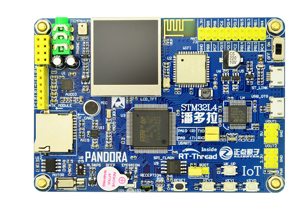

## 使用 PWM

### 在 menuconfig 中打开 PWM 通道

打开 Env 工具，使用 menuconfig 工具配置工程，在 Env 命令行中输入 menuconfig 进入配置界面。在 menuconfig 配置界面依次选择 `Hardware Driver Config ---> On-chip Peripheral Drivers ---> Enable pwm ---> Enable timer2 output pwm` 如下图所示：

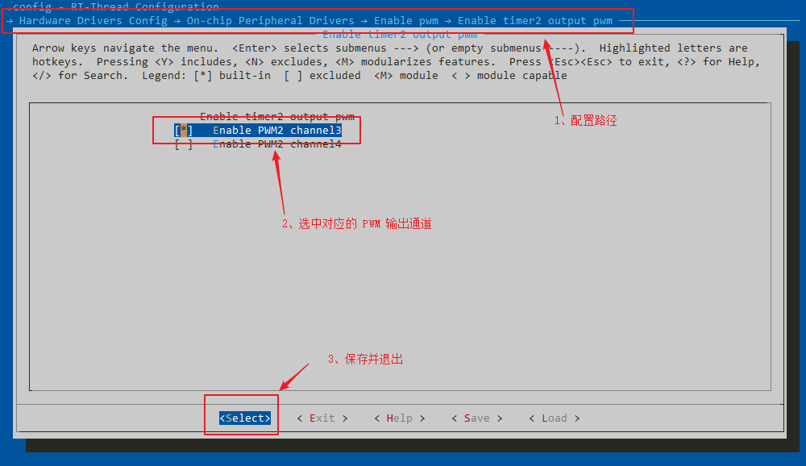

 选中需要使用的 PWM 通道后保存退出，使用 `scons --target=mdk5` 生成 mdk5 工程，打开工程进行编译并下载程序，在终端输入 list_device 命令可以看到 PWM2 设备已经成功添加了，如下图所示：

 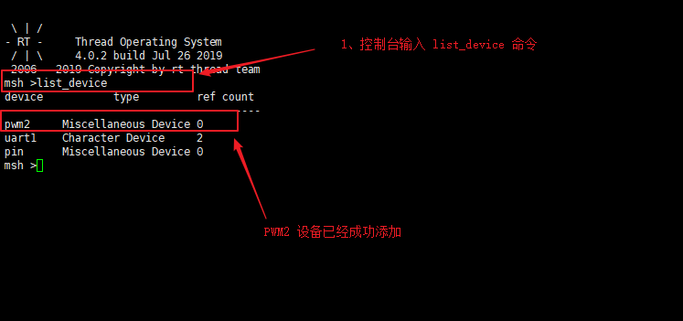

### 使用 PWM 输出波形
应用程序可以通过 RT-Thread 提供的设备管理接口来访问 PWM 设备硬件，相关接口如下所示：

| **函数** | **描述**                           |
| ----------------- | ---------------------------------- |
| rt_device_find  | 根据 PWM 设备名称查找设备获取设备句柄      |
| rt_pwm_set     | 设置 PWM 周期和脉冲宽度     |
| rt_pwm_enable   | 使能 PWM 设备      |
| rt_pwm_disable  | 关闭 PWM 设备    |

接口参数的具体描述请参考官网 [PWM 设备](https://www.rt-thread.org/document/site/programming-manual/device/pwm/pwm/)

#### PWM 设备使用步骤

PWM 设备的具体使用方式可以参考如下步骤：

1. 初始化 PWM 设备。

    * 使用 `rt_device_find` 查找指定的 PWM 设备。
    * 使用 `rt_pwm_set` 设置通道的默认 PWM 周期和脉冲宽度。
    * 使用 `rt_pwm_enable` 使能需要输出波形的 PWM 通道。

2. 使用 PWM 设备输出波形。

    * 使用 `rt_pwm_set` 输出特定的波形。

3. 关闭 PWM 输出通道。

    * 当不再需要使用 PWM 通道输出波形时，可以调用 `rt_pwm_disable` 关闭对应的输出通道。

代码如下所示：

```c
#define PWM_DEV_NAME            "pwm2"  /* PWM设备名称 */
#define PWM_DEV_CHANNEL         3       /* PWM通道 */
#define THREAD_PRIORITY         25      /* 线程优先级 */
#define THREAD_STACK_SIZE       512     /* 线程栈大小 */
#define THREAD_TIMESLICE        5       /* 线程时间片大小 */

static rt_thread_t tid1 = RT_NULL;      /* 线程句柄 */
struct rt_device_pwm *pwm_dev;          /* PWM设备句柄 */
static rt_uint32_t period = 500000;     /* 周期为0.5ms，单位为纳秒ns */
static rt_uint32_t pulse = 0;           /* PWM脉冲宽度值的增减方向 */

/* 线程 pwm_entry 的入口函数 */
static void pwm_entry(void *parameter)
{
    rt_uint32_t count = 0;

    while (count++ < 1000)
    {
        rt_thread_mdelay(50);
        /* step 2、设置 PWM 周期和脉冲宽度，输出特定的波形 */
        rt_pwm_set(pwm_dev, PWM_DEV_CHANNEL, period, pulse++);
    }
    /* step 3、如果不再使用该通道，可以关闭 PWM 通道的输出 */
    rt_pwm_disable(pwm_dev, PWM_DEV_CHANNEL);
}

static int pwm_test(int argc, char *argv[])
{
    /* step 1.1、查找 PWM 设备 */
    pwm_dev = (struct rt_device_pwm *)rt_device_find(PWM_DEV_NAME);
    if (pwm_dev == RT_NULL)
    {
        rt_kprintf("pwm sample run failed! can't find %s device!\n", PWM_DEV_NAME);
        return RT_ERROR;
    }

    /* step 1.2、设置 PWM 周期和脉冲宽度默认值 */
    rt_pwm_set(pwm_dev, PWM_DEV_CHANNEL, period, pulse);
    /* step 1.3、使能 PWM 设备的输出通道 */
    rt_pwm_enable(pwm_dev, PWM_DEV_CHANNEL);

    /* 创建线程，名称是 pwm_thread ，入口是 pwm_entry*/
    tid1 = rt_thread_create("pwm_thread",
                             pwm_entry,
                             RT_NULL,
                             THREAD_STACK_SIZE,
                             THREAD_PRIORITY,
                             THREAD_TIMESLICE);

    /* 如果获得线程控制块，启动这个线程 */
    if (tid1 != RT_NULL)
        rt_thread_startup(tid1);

    return RT_EOK;
}
/* 导出到 msh 命令列表中 */
MSH_CMD_EXPORT(pwm_test, pwm sample);
```

编译、下载程序，在终端输入 help 命令可以看到 pwm_test 命令已经成功导出，如下图所示：

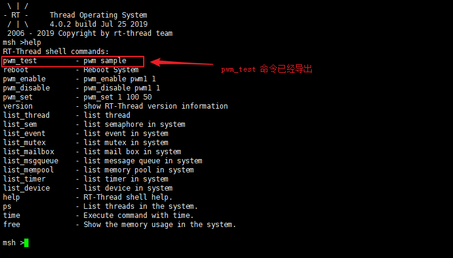

#### 运行 PWM 测试程序

要运行 PWM 测试程序，需要在终端输入 pwm_test 由于此 BSP 的 PWM2 通道 3 的输出并没有连接到外设上，无法直观的看到现象，所以这里使用逻辑分析仪来抓取 PWM 输出的波形，波形输出如下图所示：

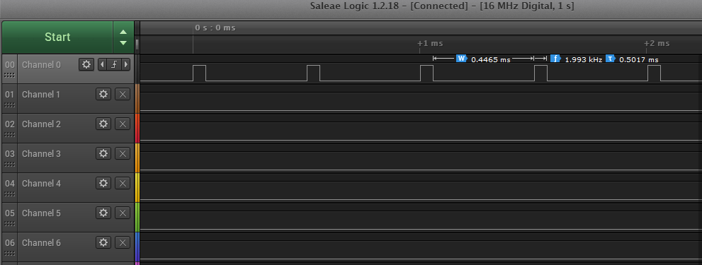

从逻辑分析仪抓取的波形可以看到，PWM 波形已经成功输出。
## 添加 PWM 驱动

如果使用的 BSP 在 menuconfig 中没有给出 PWM 通道的配置项，那么就需要自己添加 PWM 的驱动，下面就如何自己添加 PWM 驱动展开讲解。

### 检查驱动文件是否支持 PWM

进入 `rt-thread\bsp\stm32\libraries\HAL_Drivers` 目录检查 drv_pwm.c 文件是否支持相应的 PWM 外设输出。

检查驱动文件是否支持相应的 PWM 外设(PWM1、2、n)

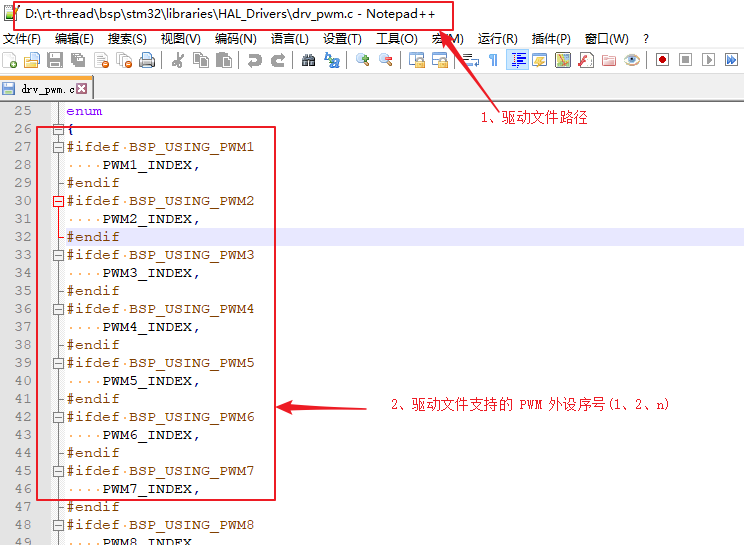

检查驱动文件是否支持相应的 PWM 输出通道(1、2、3、4)

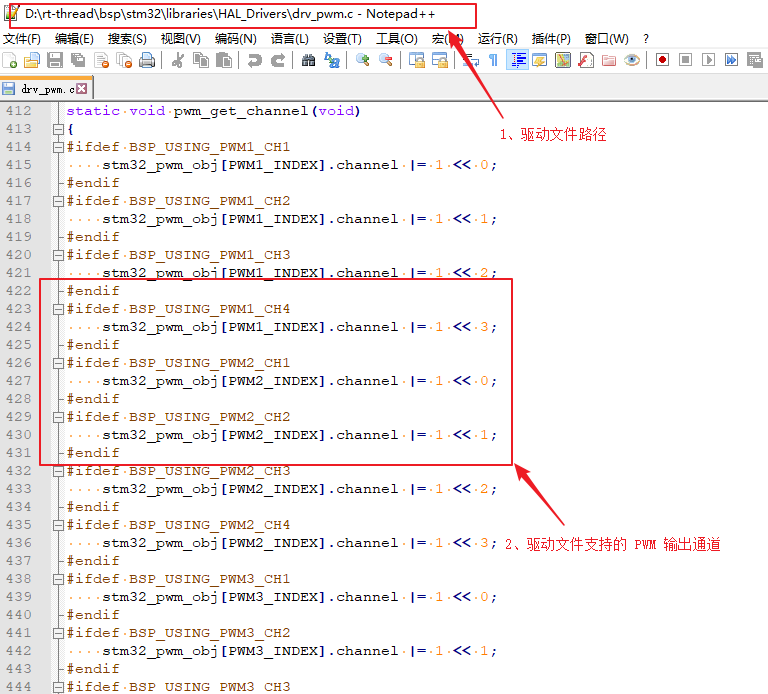

### 初始化 PWM 通道引脚

进入 `rt-thread\bsp\stm32l475-atk-pandora\board\CubeMX_Config` 目录，双击打开 `STM32L475VE.ioc` 文件初始化 PWM 通道对应的引脚，这里以 PWM2 通道 3 为例，如下图所示：

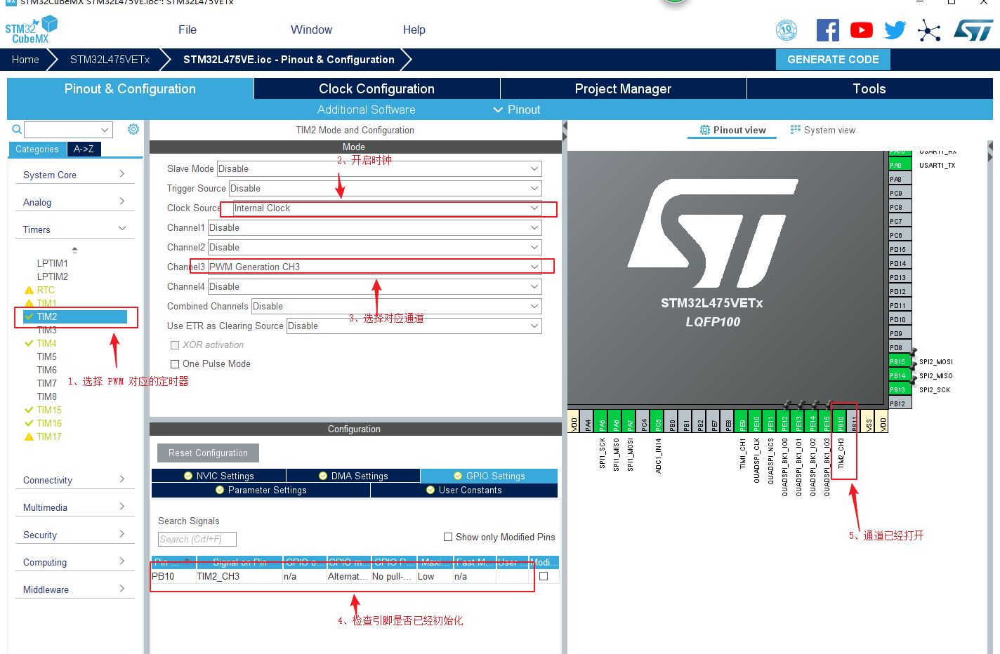

点击 `GENERATE CODE` 按钮生成代码，虽然 `STM32CubeMX` 生成了多个文件用来初始化外设，但 RT-Thread 只使用了 `STM32CubeMX` 生成的 `stm32fxx_hal_msp.c` 文件和 `stm32fxx_hal_conf.h` 文件，生成的 PWM 代码如下所示：

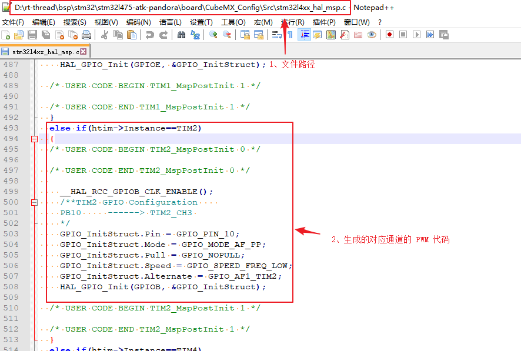

### 配置 Kconfig 文件

进入 `rt-thread\bsp\stm32l475-atk-pandora\board` 目录，添加 Kconfig 选项，如下图所示：

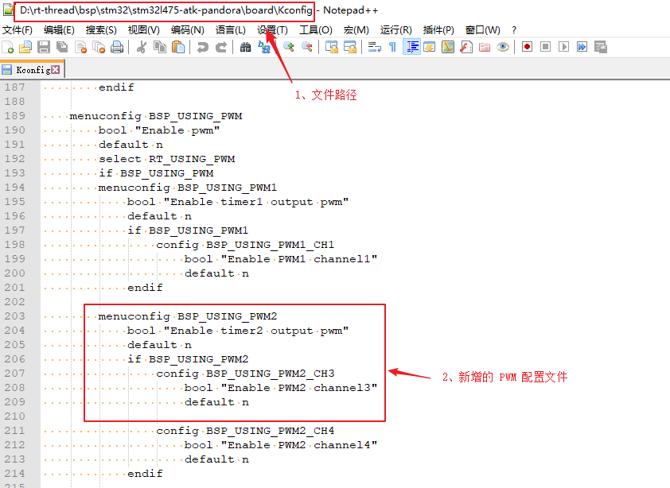

使用 `scons --target=mdk5` 命令生成 mdk5 工程，打开工程并编译，如果工程提示 PWMn_CONFIG 未定义。 可以在 `stm32/libraries/HAL_Drivers/config/f4/pwm_config.h` 中进行定义，如下图所示：

 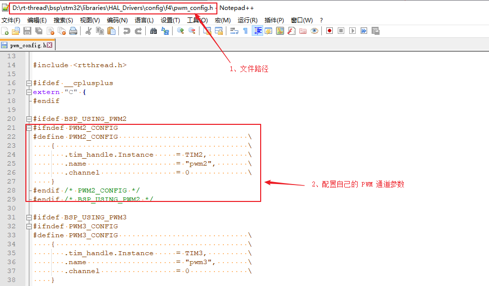

完成以上步骤就可以在 menuconfig 菜单中添加支持的 PWM 输出通道，至于如何使用 PWM 通道输出波形请参考上一章节。

到这一步为止，如何在搭载了 RT-Thread 操作系统的平台上如何使用 PWM 的介绍就结束了。


## 参考资料
* [ENV 用户手册](https://www.rt-thread.org/document/site/programming-manual/env/env/)
* [PWM 设备](https://www.rt-thread.org/document/site/programming-manual/device/pwm/pwm/)
* [STM32L475-atk-pandora BSP 源码](https://github.com/RT-Thread/rt-thread/tree/master/bsp/stm32/stm32l475-atk-pandora)
* [STM32 系列驱动添加指南](https://github.com/RT-Thread/rt-thread/blob/master/bsp/stm32/docs/STM32%E7%B3%BB%E5%88%97%E5%A4%96%E8%AE%BE%E9%A9%B1%E5%8A%A8%E6%B7%BB%E5%8A%A0%E6%8C%87%E5%8D%97.md)

## 常见问题

### Q: 按照上述使用 PWM 章节进行操作，无法输出 PWM 波形怎么办？

**A:** 该问题一般是 menuconfig 菜单中给出了 PWM 的配置选项，但是相应的 PWM 输出通道和时钟没有初始化引起的。使用 `STM32CubeMX` 工具使能相应的输出通道和时钟即可。

### Q: 编译提示 PWMn_CONFIG 未定义怎么办？

**A:**  在 `stm32/libraries/HAL_Drivers/config/f1/pwm_config.h` 文件中参考已定义的配置文件来定义自己需要的 PWM 输出通道。

### Q: 当使用 I/O 作为 PWM 输出通道时是否还需要使用 `rt_pin_mode` 设置 I/O 引脚的工作模式？

**A:**  不需要。在使用 `STM32CubeMX` 配置 PWM 输出通道时已经生成了对应通道引脚的初始化文件，所以不再需要对引脚做初始化。

### Q: 当前 PWM 驱动是否支持同一通道的反向输出？

**A:** PWM 驱动暂未支持同一通道的反向输出。

### Q:使用 `STM32CubeMX` 工具将 PWM 通道重映射后，需要修改驱动文件吗？

**A:** 不需要。驱动文件初始化的是 PWM 外设和引脚无关。不管通道引脚如何映射，对应的 PWM 通道是不会改变的。
