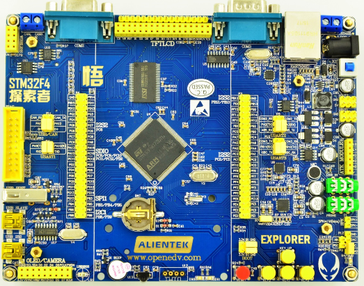
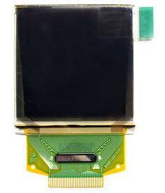
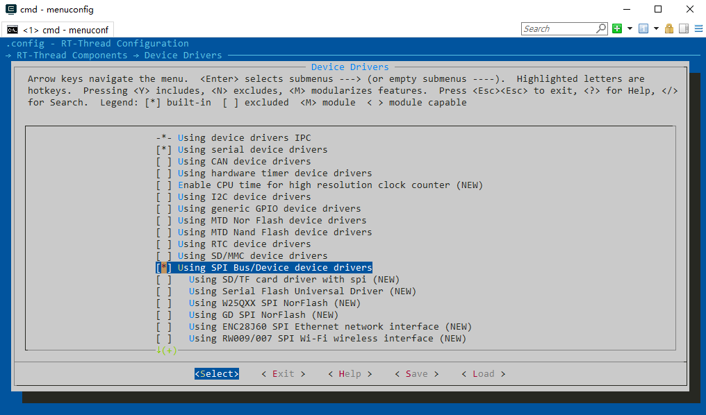
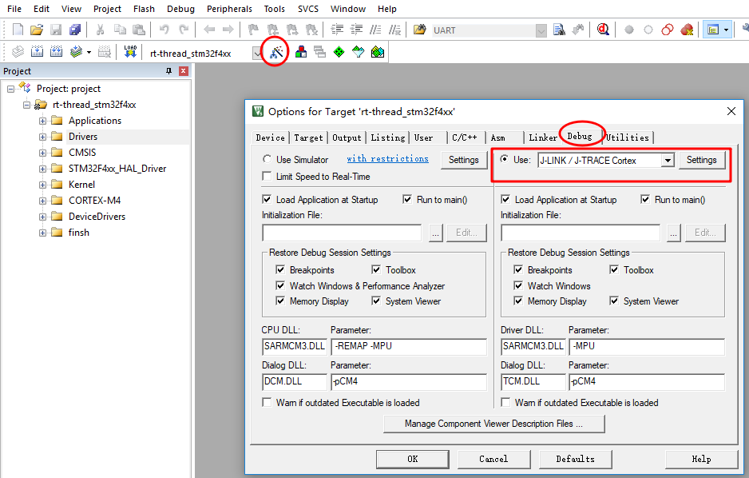
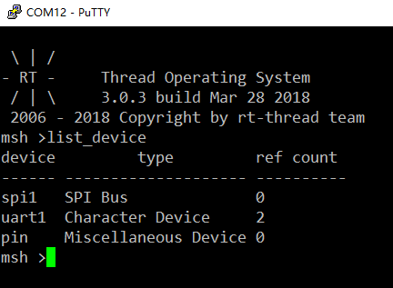
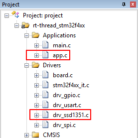
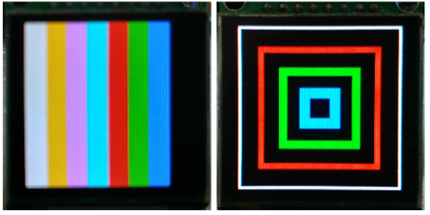
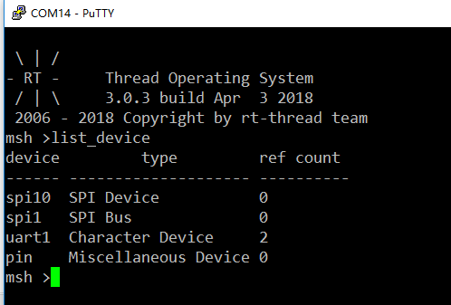

# SPI设备应用笔记 #

本文以驱动SPI接口的OLED显示屏为例，说明了如何添加SPI设备驱动框架及底层硬件驱动，使用SPI设备驱动接口开发应用程序。并给出了在正点原子STM32F4探索者开发板上验证的代码示例。

## 本文的目的和结构 ##

### 本文的目的和背景 ###

为了方便应用层程序开发，RT-Thread中引入了SPI设备驱动框架。本文说明了如何使用RT-Thread SPI设备驱动。

### 本文的结构 ###

本文首先介绍了在正点原子STM32F4探索者开发板上运行了SPI设备驱动示例代码。

## 运行示例代码 ##

本章节基于正点原子探索者STM32F4 开发板及SPI示例代码，给出了RT-Thread SPI设备驱动框架的使用方法。

### 示例代码软硬件资源 ###

1. [RT-Thread 源码](https://github.com/RT-Thread/rt-thread)
2. [ENV工具](https://www.rt-thread.org/document/site/docs/tools/env/env-user-manual/)
3. [SPI设备驱动示例代码](spi-oled.rar)
4. <https://github.com/RT-Thread-packages/peripheral-sample>
5. [正点原子STM32F4探索者开发板](http://www.openedv.com/thread-13912-1-1.html)
6. 1.5寸彩色OLED显示屏(SSD1351控制器)
7. MDK5

正点原子探索者STM32F4 开发板的MCU是STM32F407ZGT6，本示例使用USB转串口（USART1）发送数据及供电，使用SEGGER J-LINK连接JTAG调试，STM32F4 有多个硬件SPI控制器，本例使用 SPI1。彩色OLED显示屏板载SSD1351控制器，分辨率128*128。

STM32F4 与 OLED 显示屏管脚连接如下表所示：

STM32管脚 | OLED显示屏管脚 | 说明
- | - | -
PA5 |  D0 | SPI1 SCK，时钟
PA6 |    | SPI1 MISO，未使用
PA7 |  D1 | SPI1 MOSI，主机输出，从机输入
PC6 |  D/C | GPIO，输出，命令0/数据1选择
PC7 |  RES | GPIO，输出，复位，低电平有效
PC8 |   CS | GPIO，输出，片选，低电平有效
3.3V |   VCC | 供电
GND |  GND | 接地





SPI设备驱动示例代码包括`app.c、drv_ssd1351.c、drv_ssd1351.h` 3个文件，`drv_ssd1351.c`是OLED显示屏驱动文件，此驱动文件包含了SPI设备ssd1351的初始化、挂载到系统及通过命令控制OLED显示的操作方法。由于RT-Thread上层应用API的通用性，因此这些代码不局限于具体的硬件平台，用户可以轻松将它移植到其它平台上。

### 配置工程 ###

使用menuconfig配置工程：在env工具命令行使用cd 命令进入 rt-thread/bsp/stm32f4xx-HAL 目录，然后输入`menuconfig` 命令进入配置界面。



* 修改工程芯片型号：修改 Device type为STM32F407ZG。
* 配置shell使用串口1：选中Using UART1，进入RT-Thread Kernel ---> Kernel Device Object菜单，修改the device name for console为uart1。
* 开启SPI总线及设备驱动并注册SPI总线到系统：进入RT-Thread Components ---> Device Drivers菜单，选中Using SPI Bus/Device device drivers，RT-Thread Configuration界面会默认选中Using SPI1，spi1总线设备会注册到操作系统。
* 开启GPIO驱动：进入RT-Thread Components ---> Device Drivers菜单，选中Using generic GPIO device drivers。OLED屏需要2个额外的GPIO用于DC、RES信号，SPI总线驱动也需要对片选管脚进行操作，都需要调用系统的GPIO驱动接口。

生成新工程及修改调试选项：退出menuconfig配置界面并保存配置，在ENV命令行输入`scons --target=mdk5 -s` 命令生成mdk5工程，新工程名为project。使用MDK5打开工程，修改调试选项为J-LINK。



使用list_device命令查看SPI总线：添加SPI底层硬件驱动无误后，在终端PuTTY(打开对应端口，波特率配置为115200)使用`list_device`命令就能看到SPI总线。同样可以看到我们使用的UART设备和PIN设备。



### 添加示例代码 ###

将SPI设备驱动示例代码里的`app.c`拷贝到`/rt-thread/bsp/stm32f4xx-HAL/applications`目录。`drv_ssd1351.c、drv_ssd1351.h`拷贝到`/rt-thread/bsp/stm32f4xx-HAL/drivers`目录，并将它们添加到工程中对应分组。如图所示：



在`main.c`中调用`app_init()`，`app_init()`会创建一个oled线程，线程会循环展示彩虹颜色图案和正方形颜图案。



`main.c`调用测试代码源码如下:

```c
#include <rtthread.h>
#include <board.h>

extern int app_init(void);

int main(void)
{
  /* user app entry */

  app_init();

  return 0;
}
```



## SPI设备驱动接口使用详解 ##

按照前文的步骤，相信读者能很快的将RT-Thread SPI设备驱动运行起来，那么如何使用SPI设备驱动接口开发应用程序呢？

RT-Thread SPI设备驱动使用流程大致如下：

1. 定义SPI设备对象，调用`rt_spi_bus_attach_device()`挂载SPI设备到SPI总线。
1. 调用`rt_spi_configure()`配置SPI总线模式。
1. 使用`rt_spi_send()`等相关数据传输接口传输数据。

接下来本章节将详细讲解示例代码使用到的主要的SPI设备驱动接口。

### 挂载SPI设备到总线 ###

用户定义了SPI设备对象后就可以调用此函数挂载SPI设备到SPI总线。可使用函数`rt_spi_bus_attach_device()`。

本文示例代码底层驱动`drv_ssd1351.c` 中 `rt_hw_ssd1351_config()`挂载ssd1351设备到SPI总线源码如下：

```c
#define SPI_BUS_NAME                "spi1"  /* SPI总线名称 */
#define SPI_SSD1351_DEVICE_NAME     "spi10" /* SPI设备名称 */

... ...

static struct rt_spi_device spi_dev_ssd1351; /* SPI设备ssd1351对象 */
static struct stm32_hw_spi_cs  spi_cs;  /* SPI设备CS片选引脚 */

... ...

static int rt_hw_ssd1351_config(void)
{
    rt_err_t res;

    /* oled use PC8 as CS */
    spi_cs.pin = CS_PIN;
    rt_pin_mode(spi_cs.pin, PIN_MODE_OUTPUT);    /* 设置片选管脚模式为输出 */

    res = rt_spi_bus_attach_device(&spi_dev_ssd1351, SPI_SSD1351_DEVICE_NAME, SPI_BUS_NAME, (void*)&spi_cs);
    if (res != RT_EOK)
    {
        OLED_TRACE("rt_spi_bus_attach_device!\r\n");
        return res;
    }

    ... ...
}
```

### 配置SPI模式 ###

挂载SPI设备到SPI总线后，为满足不同设备的时钟、数据宽度等要求，通常需要配置SPI模式、频率参数。SPI从设备的模式决定主设备的模式，所以SPI主设备的模式必须和从设备一样两者才能正常通讯。可使用函数`rt_spi_configure()`配置模式。

本文示例代码底层驱动`drv_ssd1351.c`  中`rt_hw_ssd1351_config()`配置SPI传输参数源码如下：

```c
static int rt_hw_ssd1351_config(void)
{
    ... ...

    /* config spi */
    {
        struct rt_spi_configuration cfg;
        cfg.data_width = 8;
        cfg.mode = RT_SPI_MASTER | RT_SPI_MODE_0 | RT_SPI_MSB;
        cfg.max_hz = 20 * 1000 *1000; /* 20M,SPI max 42MHz,ssd1351 4-wire spi */

        rt_spi_configure(&spi_dev_ssd1351, &cfg);
    }

    ... ...

```

### 数据传输 ###

本文示例代码底层驱动`drv_ssd1351.c`调用`rt_spi_send()`向SSD1351发送指令和数据的函数源码如下：
```
rt_err_t ssd1351_write_cmd(const rt_uint8_t cmd)
{
    rt_size_t len;

    rt_pin_write(DC_PIN, PIN_LOW);    /* 命令低电平 */

    len = rt_spi_send(&spi_dev_ssd1351, &cmd, 1);

    if (len != 1)
    {
        OLED_TRACE("ssd1351_write_cmd error. %d\r\n",len);
        return -RT_ERROR;
    }
    else
    {
        return RT_EOK;
    }

}

rt_err_t ssd1351_write_data(const rt_uint8_t data)
{
    rt_size_t len;

    rt_pin_write(DC_PIN, PIN_HIGH);        /* 数据高电平 */

    len = rt_spi_send(&spi_dev_ssd1351, &data, 1);

    if (len != 1)
    {
        OLED_TRACE("ssd1351_write_data error. %d\r\n",len);
        return -RT_ERROR;
    }
    else
    {
        return RT_EOK;
    }
}

```

### SPI设备驱动应用 ###

本文示例使用SSD1351显示图像信息，首先需要确定信息在显示器上的行列起始地址，调用`ssd1351_write_cmd()`向SSD1351发送指令，调用`ssd1351_write_data()`向SSD1351发送数据，源代码如下：

```c
void set_column_address(rt_uint8_t start_address, rt_uint8_t end_address)
{
    ssd1351_write_cmd(0x15);              //   Set Column Address
    ssd1351_write_data(start_address);    //   Default => 0x00 (Start Address)
    ssd1351_write_data(end_address);      //   Default => 0x7F (End Address)
}
void set_row_address(rt_uint8_t start_address, rt_uint8_t end_address)
{
    ssd1351_write_cmd(0x75);              //   Set Row Address
    ssd1351_write_data(start_address);    //   Default => 0x00 (Start Address)
    ssd1351_write_data(end_address);      //   Default => 0x7F (End Address)
}
```

## 参考资料

* 《SPI 设备》

