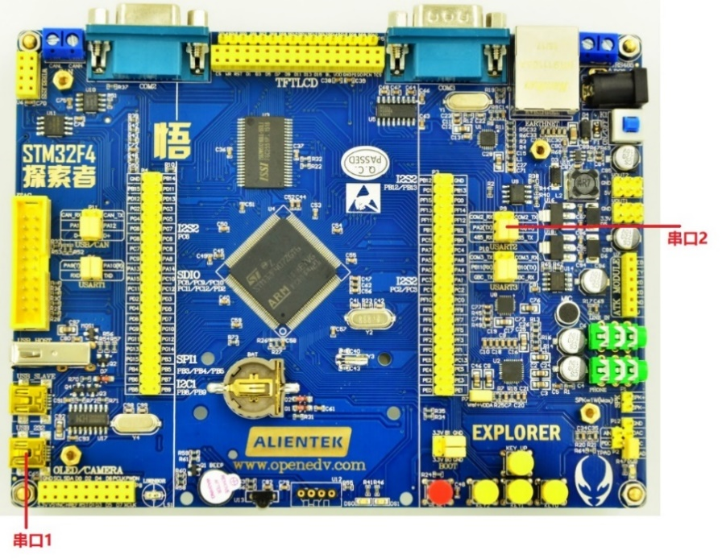
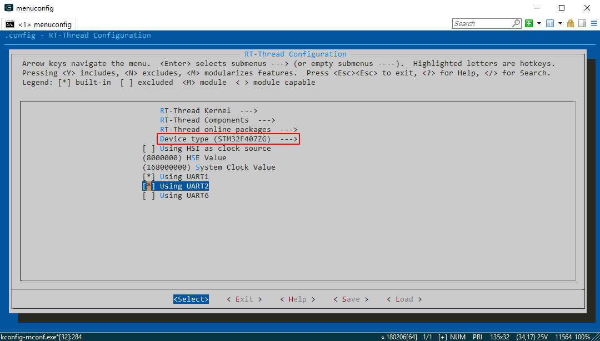
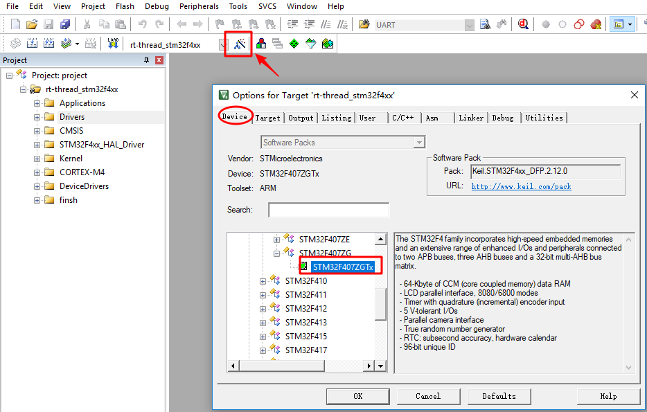
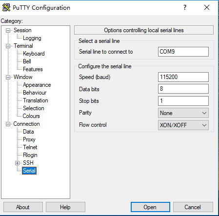
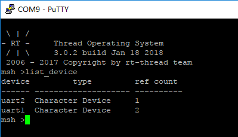
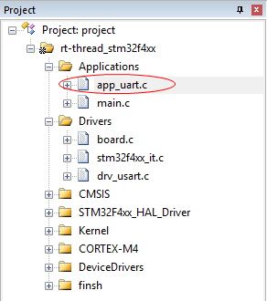
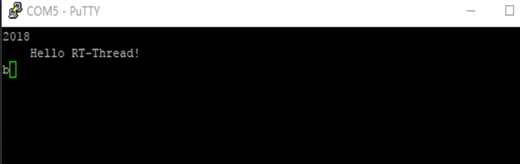
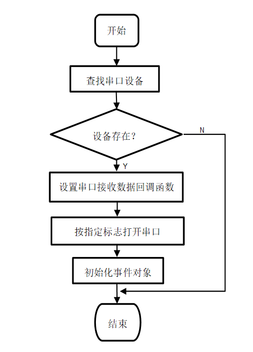
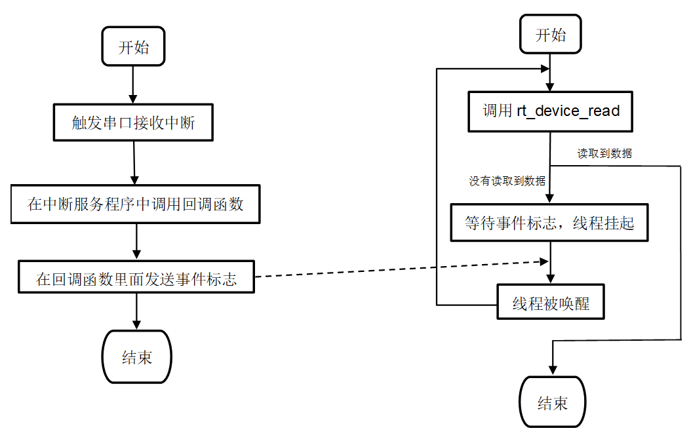

# 串口设备应用笔记 #

本文描述了如何使用 RT-Thread 的串口设备，包括串口配置、设备操作接口的应用。并给出了在正点原子 STM32F4 探索者开发板上验证的代码示例。

## 本文的目的和结构 ##

### 本文的目的和背景 ###

串口（通用异步收发器，常写作 UART、uart）是最为广泛使用的通信接口之一。在裸机平台或者是没有设备管理框架的 RTOS 平台上，我们通常只需要根据官方手册编写串口硬件初始化代码即可。引入了带设备管理框架的实时操作系统 RT-Thread 后，串口的使用则与裸机或者其它 RTOS 有很大的不同之处。RT-Thread 中自带 I/O 设备管理层，将各种各样的硬件设备封装成具有统一接口的逻辑设备，方便管理及使用。本文说明了如何在 RT-Thread 中使用串口。

### 本文的结构 ###

本文首先给出使用 RT-Thread 的设备操作接口开发串口收、发数据程序的示例代码，并在正点原子 STM32F4 探索者开发板上验证。接着分析了示例代码的实现，最后深入地描述了 RT-Thread 设备管理框架与串口的联系。

## 运行示例代码 ##

本文基于正点原子 STM32F4 探索者开发板，给出了串口的配置流程和应用代码示例。由于 RT-Thread 设备操作接口的通用性，因此这些代码与硬件平台无关，读者可以直接将它用在自己使用的硬件平台上。
正点原子 STM32F4 探索者开发板使用的是 STM32F407ZGT6，具有多路串口。我们使用串口 1 作为 shell 终端，串口 2 作为实验用串口，测试数据收发。终端软件使用 putty。板载串口 1 带有 USB 转串口芯片，因此使用 USB 线连接串口 1 和 PC 即可；串口 2 则需要使用 USB 转串口模块连接到 PC。



### 准备和配置工程 ###

1. 下载 [RT-Thread 源码](https://github.com/RT-Thread/rt-thread)

2. 进入 `rt-thread\bsp\stm32f4xx-HAL` 目录，在 Env 命令行中输入 menuconfig，进入配置界面，使用 menuconfig 工具（学习如何使用）配置工程。

(1) 配置 shell 使用串口 1：RT-Thread Kernel ---> Kernel Device Object ---> 修改 the device name for console 为 uart1。

(2) 勾选 Using UART1、Using UART2，选择芯片型号为 STM32F407ZG，时钟源为外部 8MHz，如图所示：



3. 输入命令 scons --target=mdk5 -s 生成 keil 工程，打开工程后先修改 MCU 型号为 STM32F407ZETx，如图所示：



4. 打开 putty，选择正确的串口，软件参数配置为 115200-8-1-N、无流控。如图所示：



5. 编译、下载程序，按下复位后就可以在串口 1 连接的终端上看到 RT-Thread 标志 log 了，输入 list_device 命令能查看到 uart1、uart2 Character Device 就表示串口配置好了。



### 加入串口相关代码 ###

[下载串口示例代码](uart.rar)



本文示例代码 app_uart.c、app_uart.h，app_uart.c 中是串口相关操作的代码，方便阅读。app_uart.c 中提供了 4 个函数 uart_open、uart_putchar、uart_putstring、uart_getchar 以方便使用串口。app_uart.c 中的代码与硬件平台无关，读者可以把它直接添加到自己的工程。利用这几个函数在 main.c 中编写测试代码。
main.c 源码如下：

```c
#include "app_uart.h"
#include "board.h"
void test_thread_entry(void* parameter)
{
    rt_uint8_t uart_rx_data;
    /* 打开串口 */
    if (uart_open("uart2") != RT_EOK)
    {
        rt_kprintf("uart open error.\n");
         while (1)
         {
            rt_thread_delay(10);
         }
    }
    /* 单个字符写 */
    uart_putchar('2');
    uart_putchar('0');
    uart_putchar('1');
    uart_putchar('8');
    uart_putchar('\n');
    /* 写字符串 */
    uart_putstring("Hello RT-Thread!\r\n");
    while (1)
    {
        /* 读数据 */
        uart_rx_data = uart_getchar();
        /* 错位 */
        uart_rx_data = uart_rx_data + 1;
        /* 输出 */
        uart_putchar(uart_rx_data);
    }
}
int main(void)
{
    rt_thread_t tid;
    /* 创建 test 线程 */
    tid = rt_thread_create("test",
                    test_thread_entry,
                    RT_NULL,
                    1024,
                    2,
                    10);
    /* 创建成功则启动线程 */
    if (tid != RT_NULL)
        rt_thread_startup(tid);
    return 0;
}
```

这段程序实现了如下功能：

1. main 函数里面创建并启动了测试线程 test_thread_entry。

2. 测试线程调用 uart_open 函数打开指定的串口后，首先使用 uart_putchar 函数发送字符和 uart_putstring 函数发送字符串。

3. 接着在 while 循环里面调用 uart_getchar 函数读取接收到的数据并保存到局部变量 uart_rx_data 中，最后将数据错位后输出。

### 运行结果 ###

编译、将代码下载到板卡，复位，串口 2 连接的终端软件 putty（软件参数配置为 115200-8-1-N、无流控）输出了字符 2、0、1、8 和字符串 Hello RT-Thread!。输入字符 ‘A’，串口 2 接收到将其错位后输出。实验现象如图所示：



> 提示：图中 putty 连接开发板的串口 2 作为测试串口。

## 进阶阅读 ##

串口通常被配置为接收中断和轮询发送模式。在中断模式下，CPU 不需要一直查询等待串口相关标志寄存器，串口接收到数据后触发中断，我们在中断服务程序进行数据处理，效率较高。RT-Thread 官方 BSP 默认便是这种模式。

### 使用哪个串口 ###

uart_open 函数用于打开指定的串口，它完成了串口设备回调函数设置、串口设备的开启和事件的初始化。源码如下：

```c
rt_err_t uart_open(const char *name)
{
    rt_err_t res;
    /* 查找系统中的串口设备 */
    uart_device = rt_device_find(name);
    /* 查找到设备后将其打开 */
    if (uart_device != RT_NULL)
    {
        res = rt_device_set_rx_indicate(uart_device, uart_intput);
        /* 检查返回值 */
        if (res != RT_EOK)
        {
            rt_kprintf("set %s rx indicate error.%d\n",name,res);
            return -RT_ERROR;
        }
        /* 打开设备，以可读写、中断方式 */
        res = rt_device_open(uart_device, RT_DEVICE_OFLAG_RDWR |
                             RT_DEVICE_FLAG_INT_RX );
        /* 检查返回值 */
        if (res != RT_EOK)
        {
            rt_kprintf("open %s device error.%d\n",name,res);
            return -RT_ERROR;
        }
    }
    else
    {
        rt_kprintf("can't find %s device.\n",name);
        return -RT_ERROR;
    }
    /* 初始化事件对象 */
    rt_event_init(&event, "event", RT_IPC_FLAG_PRIO);
    return RT_EOK;
}
```

简要流程如下：



uart_open 函数使用到的设备操作接口有：rt_device_find、rt_device_set_rx_indicate、rt_device_open。
uart_open 函数首先调用 rt_device_find 根据串口名字获得串口句柄，保存在静态全局变量 uart_device 中，后面关于串口的操作都是基于这个串口句柄。这里的名字是在 drv_usart.c 中调用注册函数 rt_hw_serial_register 决定的，该函数将串口硬件驱动和 RT-Thread 设备管理框架联系起来了。

```c
    /* register UART2 device */
    rt_hw_serial_register(&serial2,
                          "uart2",
                          RT_DEVICE_FLAG_RDWR | RT_DEVICE_FLAG_INT_RX,
                          uart);
```

接着调用 rt_device_set_rx_indicate 设置串口接收中断的回调函数。
最后调用 rt_device_open 以可读写、中断接收方式打开串口。它的第二个参数为标志，与上面提到的注册函数 rt_hw_serial_register 保持一致即可。

```c
rt_device_open(uart_device, RT_DEVICE_OFLAG_RDWR | RT_DEVICE_FLAG_INT_RX);
```

最后调用 rt_event_init 初始化事件。
RT-Thread 中默认开启了自动初始化机制，因此用户不需要在应用程序中手动调用串口的初始化函数（drv_usart.c 中的 INIT_BOARD_EXPORT 实现了自动初始化）。用户实现的由宏 RT_USING_UARTx 选定的串口硬件驱动将自动关联到 RT-Thread 中来（drv_usart.c 中的 rt_hw_serial_register 实现了串口硬件注册）。

### 串口发送 ###

uart_putchar 函数用于发送 1 字节数据。uart_putchar 函数实际上调用的是 rt_device_write 来发送一个字节，并采取了防出错处理，即检查返回值，失败则重新发送，并限定了超时。源码如下：

```c
void uart_putchar(const rt_uint8_t c)
{
    rt_size_t len = 0;
    rt_uint32_t timeout = 0;
    do
    {
        len = rt_device_write(uart_device, 0, &c, 1);
        timeout++;
    }
    while (len != 1 && timeout < 500);
}
```

### 串口接收 ###

uart_getchar 函数用于接收数据，uart_getchar 函数的实现采用了串口接收中断回调机制和事件用于异步通信，它具有阻塞特性。
相关源码如下：

```c
/* 串口接收事件标志 */
#define UART_RX_EVENT (1 << 0)
/* 事件控制块 */
static struct rt_event event;
/* 设备句柄 */
static rt_device_t uart_device = RT_NULL;

/* 回调函数 */
static rt_err_t uart_intput(rt_device_t dev, rt_size_t size)
{
    /* 发送事件 */
    rt_event_send(&event, UART_RX_EVENT);
    return RT_EOK;
}
rt_uint8_t uart_getchar(void)
{
    rt_uint32_t e;
    rt_uint8_t ch;
    /* 读取 1 字节数据 */
    while (rt_device_read(uart_device, 0, &ch, 1) != 1)
{
         /* 接收事件 */
        rt_event_recv(&event, UART_RX_EVENT,RT_EVENT_FLAG_AND |
                      RT_EVENT_FLAG_CLEAR,RT_WAITING_FOREVER, &e);
}
    return ch;
}
```

uart_getchar 函数内部有一个 while() 循环，先调用 rt_device_read 去读取一字节数据，没有读到则调用 rt_event_recv 等待事件标志，挂起调用线程；串口接收到一字节数据后产生中断，调用回调函数 uart_intput，回调函数里面调用了 rt_event_send 发送事件标志以唤醒等待该 event 事件的线程。
调用 uart_getchar 函数发生的数据流向示意图如下：



应用程序调用 uart_getchar 时，实际调用关系为：rt_device_read ==> rt_serial_read ==> drv_getc，最终从串口数据寄存器读取到数据。

## 参考资料

* 《串口设备》


