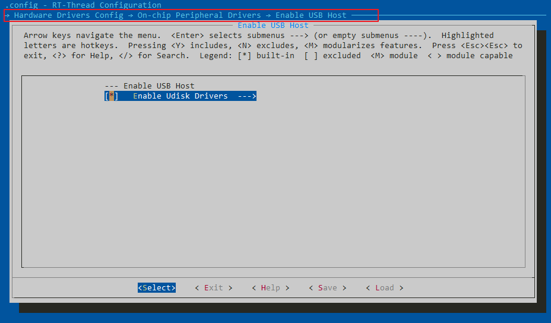
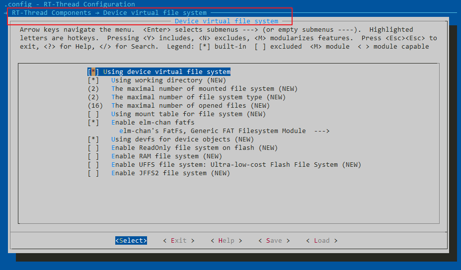
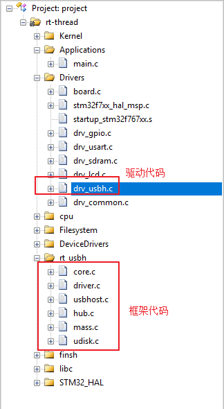
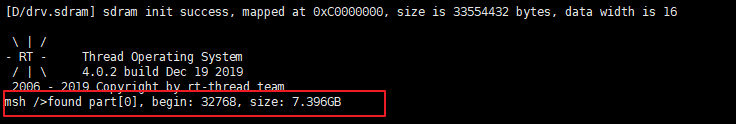
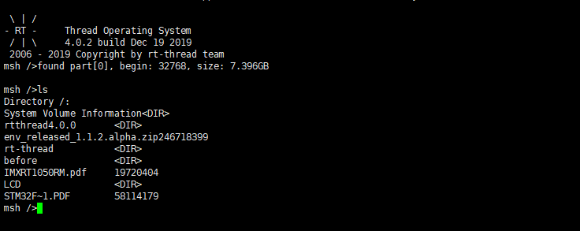
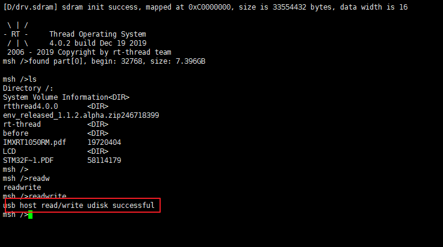
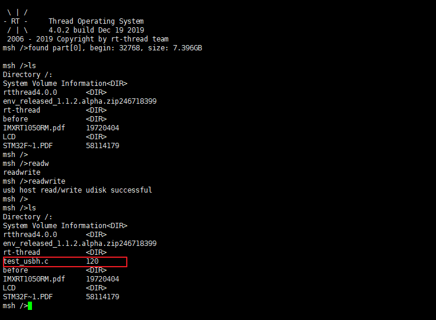
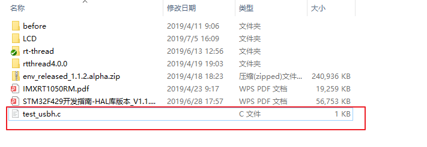

# STM32 上使用 USB Host 读写 U 盘

本文描述了如何在搭载了 RT-Thread 操作系统的平台上使用 USB Host 读写 U 盘，包括 USB Host 的应用、配置等。并给出了在正点原子 `STM32F767 apollo` 开发板上验证的演示。

## 简介

USB(Universal Serial Bus)是一种支持热插拔的通用串行总线。它使用差分信号来传输数据，在 USB 1.0和 USB 1.1 版本中，只支持 1.5Mb/s 的低速（low-speed）模式和 12Mb/s 的全速（full-speed）模式，在 USB 2.0 中，又加入了480Mb/s 的高速模式，USB 3.0(super speed)，传输速率最大5Gbps。

在 USB 体系中又包括 USB Host(主机)和USB Device(设备)

- USB Host

    - 任何USB系统中只有一个主机。 主机系统的USB接口被称为主机控制器。 主机控制器可以以硬件，固件或软件的组合来实现。 根集线器集成在主机系统内以提供一个或多个连接点。

- USB Device
    USB Device 可以分为 USB Hub 和 USB Function。

    USB Hub 提供了一种低成本、低复杂度的  USB接口扩展方法。Hub  的上行端口面向 HOST，下行端口面向设备(Hub 或功能设备)。在下行端口上，Hub 提供了设备连接检测和设备移除检测的能力，并给各下行端口供电。Hub 可以单独使能各下行端口。不同端口可以工作在不同的速度等级(高速/全速/低速)。

    USB Function 能够通过总线传输或接收数据或控制信息的设备，在 USB2.0 标准中，别称为 Class

本文主要是基于正点原子 `stm32f767-atk-apollo` 开发板，给出了 USB Host 读写 U 盘的配置和使用示例。

本文准备资料如下：

- [RT-Thread 源码](https://github.com/RT-Thread/rt-thread)
- [Env 工具](https://www.rt-thread.org/page/download.html)
- U 盘

依赖

- RT-Thread 4.0.2+
- RT-Thread 设备驱动框架

## 硬件连接准备

本文是基于 U 盘的读写，所以需要准备好一个 U 盘，并插入开发板上的 U 盘接口。

## ENV 配置

### 打开 USB Host
RT-Thread 可以很方便的通过 ENV 来配置和生成工程。在 `rt-thread\bsp\stm32\stm32f767-atk-apollo` 目录下打开 ENV 工具，使用 menuconfig 进入如下配置界面并选中。

    ---- Hardware Drivers Config
        ----On-Chip Peripheral Drivers
            ----Enable USH Host
                ----Enable Udisk Drivers

配置界面如下图所示



### 打开文件系统

本文使用的是 USB Host 读写 U 盘的功能，所以需要打开 RT-Thread 的虚拟文件系统功能，打开文件系统的操作如下

    ---- RT-Thread Components
        ----Device virtual file system
            ----Using device virtual file system

配置界面如下图所示



### 生成工程并下载

在 ENV 中打开 USB Host 和虚拟文件系统的功能之后，工程配置就结束了，退出配置界面并保存。在 ENV 工具中使用 `scons --target=mdk5` 命令重新生成工程并打开。工程打开之后可以看到 USB Host 的框架代码和驱动代码都已经自动加入到工程里面了，如下图所示



在 `main.c` 文件中加入以下测试代码并下载
```c
#include <dfs_posix.h>
#define TEST_FN     "/test_usbh.c"
static char test_data[120], buffer[120];

void readwrite(const char* filename)
{
    int fd;
    int index, length;

    fd = open(TEST_FN, O_WRONLY | O_CREAT | O_TRUNC, 0);
    if (fd < 0)
    {
        rt_kprintf("open file for write failed\n");
        return;
    }

    for (index = 0; index < sizeof(test_data); index ++)
    {
        test_data[index] = index + 27;
    }

    length = write(fd, test_data, sizeof(test_data));
    if (length != sizeof(test_data))
    {
        rt_kprintf("write data failed\n");
        close(fd);
        return;
    }

    close(fd);

    fd = open(TEST_FN, O_RDONLY, 0);
    if (fd < 0)
    {
        rt_kprintf("check: open file for read failed\n");
        return;
    }

    length = read(fd, buffer, sizeof(buffer));
    if (length != sizeof(buffer))
    {
        rt_kprintf("check: read file failed\n");
        close(fd);
        return;
    }

    for (index = 0; index < sizeof(test_data); index ++)
    {
        if (test_data[index] != buffer[index])
        {
            rt_kprintf("check: check data failed at %d\n", index);
            close(fd);
            return;
        }
    }

    rt_kprintf("usb host read/write udisk successful\r\n");

    close(fd);
}

MSH_CMD_EXPORT(readwrite, usb host read write test);
```

### 运行测试程序

将以上程序下载入开发板之后连接串口调试工具可以看到如下调试信息



这里可以看到 U 盘的大小约为 7.4G，说明 U 盘已经成功挂载到开发板上面的文件系统了。使用文件系统的 ls 命令查看 U 盘目录的结果如下图：



在串口运行导出的 readwrite 测试函数的结果如下图所示



再次使用 ls 命令可以看到在 U 盘的根目录下已经新建了一个 test_usbh.c 文件，并且大小为 120 个字节，如下图所示



我们可以将 U 盘拔出并插在电脑上验证一下我们刚才写入的文件。



从电脑上我们可以看到已经成功创建了一个 `test_usbh.c` 的文件。到这一步为止，在 STM32 上使用 USB Host 读写 U 盘的介绍就结束了

## 参考资料

[ENV 用户手册](https://www.rt-thread.org/document/site/programming-manual/env/env/)

[虚拟文件系统](https://www.rt-thread.org/document/site/programming-manual/filesystem/filesystem/)

[RT-Thread源码](https://github.com/RT-Thread/rt-thread)

## 常见问题

### Q: 在 `rt-thread\bsp\stm32\libraries` 目录下没有 drv_usbh.c 文件？

**A:** 该问题一般是当前版本还没有支持 USB Host 的驱动，请使用 RT-Thread 4.0.2+ 的版本进行测试。

### Q:工程目录下没有 drv_usbh.c 文件？

**A:** 该问题一般是当前 BSP 没有添加 drv_usbh.c 的驱动，请参考[STM32 外设添加指南](https://github.com/RT-Thread/rt-thread/blob/master/bsp/stm32/docs/STM32%E7%B3%BB%E5%88%97%E5%A4%96%E8%AE%BE%E9%A9%B1%E5%8A%A8%E6%B7%BB%E5%8A%A0%E6%8C%87%E5%8D%97.md)。
