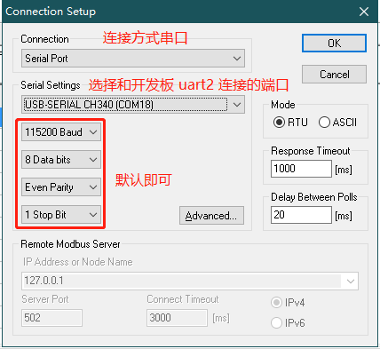

# FreeModbus 应用笔记

## 简介

FreeModbus 是一款开源的 Modbus 协议栈， Modbus 是施耐德公司设计的通信协议，一般用于工控领域, 只有从机代码开源，主机源码是需要**收费**的。同时网上也没有比较好的开源的 Modbus 主机协议栈，在这样的背景下，armink 大神开发了这款支持主机模式的 FreeModbus 协议栈。 

本文的目的是介绍如何在潘多拉开发板上运行 Modbus 主机与从机。首先介绍串口方式通信的 Modbus 主机和从机。然后介绍如何使用网络进行 Modbus 通信。

## 准备工作

1. 首先演示使用串口作为 Modbus 通信通道的方式，将潘多拉开发板的 `uart2` 通过 usb 转串口线连接到电脑上

2. 使用 usb 线连接开发板的 st-link 接口到电脑上，打开电源开发，开发板上电。

3. 查看设备管理器，可以看到两个串口设备，一个用来 shell 通信，一个用来 Modbus 通信。


## 运行 Modbus 主机

### 配置工程

在 RT-Thread 源码目录下找到潘多拉的bsp `rt-thread\bsp\stm32\stm32l475-atk-pandora` ，在此目录下打开 ENV 工具。

#### 配置 FreeModbus 软件包

1. 输入 menuconfig 命令打开配置工具


2. 按照下面的路径进入 FreeModbus 软件包的配置菜单，并开启`主机`模式

   ```
   RT-Thread online packages  --->
     IoT - internet of things  --->
       [*] FreeModbus: Modbus master and slave stack  --->
         [*]   Master mode  --->
         [ ]   Slave mode  ----
         Version (latest)  --->
   ```

3. 配置主机模式选项

进入 `Mastar mode` 配置菜单，然后开启主机示例程序，如下图所示：


- **advanced configuration**：高级配置选项
- **Enable RTU master mode**：开启 RTU 模式支持（主机暂只支持 RTU 模式）
- **Enable master sample**：开启主机示例程序
- **Test slave device address**：测试用的从机设备地址
- **uart number used by master sample, e.g. 2 means uart2**：表示使用串口几进行通信，默认使用 uart2
- **uart baudrate used by master sample**：通信用的波特率

#### 配置硬件 uart2

然后返回到主菜单，进入硬件配置的菜单里开启 uart2 。

```
Hardware Drivers Config  --->
  On-chip Peripheral Drivers  --->
    -*- Enable UART  --->
      [*]   Enable UART2
```


退出 `menuconfig` 配置工具并保存。然后 `pkgs --update` 下载软件包，然后 `scons --target=mdk5` 生成工程。


### 运行示例程序

打开工程，在 FreeModbus 分组里可以看到主机的示例代码 `sample_mb_master.c` 关键代码如下所示：

```
#define MB_POLL_CYCLE_MS   500

static void send_thread_entry(void *parameter)
{
    eMBMasterReqErrCode error_code = MB_MRE_NO_ERR;
    rt_uint16_t error_count = 0;
    USHORT data[2] = {0};

    while (1)
    {
        /* 准备要写入的数据 */
        data[0] = (USHORT)(rt_tick_get() / 10);
        data[1] = (USHORT)(rt_tick_get() % 10);
        /* 向从机写多个保持寄存器 */
        error_code = eMBMasterReqWriteMultipleHoldingRegister(SLAVE_ADDR,          /* salve address */
                                                              MB_SEND_REG_START,   /* register start address */
                                                              MB_SEND_REG_NUM,     /* register total number */
                                                              data,                /* data to be written */
                                                              RT_WAITING_FOREVER); /* timeout */

        /* Record the number of errors */
        if (error_code != MB_MRE_NO_ERR)
        {
            error_count++;
        }
    }
}

static void mb_master_poll(void *parameter)
{
    /* Modbus 主机协议栈初始化，初始化为 RTU 模式 */
    eMBMasterInit(MB_RTU, PORT_NUM, PORT_BAUDRATE, PORT_PARITY);
    eMBMasterEnable();

    while (1)
    {
        /* 定时轮询 */
        eMBMasterPoll();
        rt_thread_mdelay(MB_POLL_CYCLE_MS);
    }
}
```

编译下载，程序开始运行。


输入 `mb_master_samlpe` 运行主机示例程序。

### 运行 Modbus Slave

Modbus Slave 是一个 Modbus 从设备仿真器，可以仿真 32 个从设备/地址域。每个接口都提供了对 EXCEL 报表的 OLE 自动化支持。主要用来模拟 Modbus 从站设备,接收主站的命令包,回送数据包。帮助 Modbus 通讯设备开发人员进行 Modbus 通讯协议的模拟和测试。安装运行 Modbus Slave。下载安装软件 [Modbus Slave](<https://www.modbustools.com/>) 。

Modbus Slave 需要先配置从机参数，然后连接主机。

**modbus slave 程序主窗口介绍**

其中：ID = 1表示模拟的Modbus子设备的设备地址；F = 03表示所使用的Modbus功能码，图中为03功能码。红字部分，表示当前的错误状态，“No Connection”表示未连接状态。

单击菜单【Setup】中【Slave Definition.. F8】进行参数设置，会弹出参数设置对话框。


然后点击连接（Connection），连接对应开发板上 Modbus 主机控制的 uart2 的端口即可。


### 运行结果

可以看到 Modbus Slave 与开发板上运行的主机通信成功，并且可以看到其对应的保持寄存器的寄存器 2，3 的数据被不断改变。


## 运行 Modbus 从机

### 配置工程

在 RT-Thread 源码目录下找到潘多拉的bsp `rt-thread\bsp\stm32\stm32l475-atk-pandora` ，在此目录下打开 ENV 工具。

#### 配置 FreeModebus 软件包

1. 输入 menuconfig 命令打开配置工具


2. 按照下面的路径进入 FreeModbus 软件包的配置菜单，并开启`从机`模式

   ```
   RT-Thread online packages  --->
     IoT - internet of things  --->
       [*] FreeModbus: Modbus master and slave stack  --->
         [ ]   Master mode  ----
         [*]   Slave mode  --->
         Version (latest)  --->
   ```

3.  配置从机模式选项

进入 `Slave mode` 配置菜单，然后开启从机示例程序，如下图所示：


- **advanced configuration**：高级配置选项
- **Enable RTU slave mode**：开启 RTU 模式支持
- **Enable ASCII slave mode**：开启 ASCII 模式支持
- **Enable TCP slave mode**：开启 TCP 模式支持（需要设备可以连接网络，且可做服务器使用）
- **Enable slave sample**：开启主机示例程序
- **Test slave device address**：测试用的从机设备地址
- **uart number used by master sample, e.g. 2 means uart2**：表示使用串口几进行通信，默认使用 uart2
- **uart baudrate used by master sample**：通信用的波特率

#### 配置硬件 uart2

然后返回到主菜单，进入硬件配置的菜单里开启 uart2 。

```
Hardware Drivers Config  --->
  On-chip Peripheral Drivers  --->
    -*- Enable UART  --->
      [*]   Enable UART2
```


退出 `menuconfig` 配置工具并保存。然后 `pkgs --update` 下载软件包，然后 `scons --target=mdk5` 生成工程。


### 运行示例程序

打开工程，在 FreeModbus 分组里可以看到从机的示例代码 `sample_mb_slave.c` 关键代码如下所示：

```c
#define MB_POLL_CYCLE_MS 200
extern USHORT usSRegHoldBuf[S_REG_HOLDING_NREGS]; /* 存储保持寄存器的数组 */

static void send_thread_entry(void *parameter)
{
    USHORT         *usRegHoldingBuf;
    usRegHoldingBuf = usSRegHoldBuf;
    rt_base_t level;

    while (1)
    {
        level = rt_hw_interrupt_disable();
        /* 改变保持寄存器 3 的数据 */
        usRegHoldingBuf[3] = (USHORT)(rt_tick_get() / 100);

        rt_hw_interrupt_enable(level);
        /* 数据产生的速率为 1个/秒 */
        rt_thread_mdelay(1000);
    }
}

static void mb_slave_poll(void *parameter)
{
    if (rt_strstr(parameter, "RTU"))
    {
#ifdef PKG_MODBUS_SLAVE_RTU    # 如果开启了 RTU 模式就检测 RTU 参数
        eMBInit(MB_RTU, SLAVE_ADDR, PORT_NUM, PORT_BAUDRATE, PORT_PARITY);
#else
        rt_kprintf("Error: Please open RTU mode first");
#endif
    }
    else if (rt_strstr(parameter, "ASCII"))
    {
#ifdef PKG_MODBUS_SLAVE_ASCII  # 如果开启了 ASCII 模式就检测 ASCII 参数
        eMBInit(MB_ASCII, SLAVE_ADDR, PORT_NUM, PORT_BAUDRATE, PORT_PARITY);
#else
        rt_kprintf("Error: Please open ASCII mode first");
#endif
    }
    else if (rt_strstr(parameter, "TCP"))
    {
#ifdef PKG_MODBUS_SLAVE_TCP    # 如果开启了 TCP 模式就检测 TCP 参数
        eMBTCPInit(0);         # TCP 模式下使用默认端口 502
#else
        rt_kprintf("Error: Please open TCP mode first");
#endif
    }
    else
    {
        rt_kprintf("Error: unknown parameter");
    }
    eMBEnable();
    while (1)
    {
        eMBPoll();
        rt_thread_mdelay(MB_POLL_CYCLE_MS);
    }
}
```

编译下载，程序开始运行。


输入 `mb_slave_samlpe <RTU/ASCII/TCP>`  运行示例程序。如运行 `RTU` 模式的从机示例程序。

```
 \ | /
- RT -     Thread Operating System
 / | \     4.0.2 build Jul 11 2019
 2006 - 2019 Copyright by rt-thread team
msh />mb_slave_samlpe RTU           # 运行 RTU 模式的从机示例程序
msh />
```

### 运行 Modbus Poll

Modbus Poll 是一个 Modbus 主机仿真器，用于测试和调试Modbus从设备。该软件支持ModbusRTU、ASCII、TCP/IP。用来帮助开发人员测试Modbus从设备，或者其它Modbus协议的测试和仿真。下载安装软件 [Modbus Poll](<https://www.modbustools.com/>) 。


**modbus poll 程序主窗口介绍**

其中：Tx = 0表示向主站发送数据帧次数； Error = 0表示通讯错误次数； ID = 1表示模拟的Modbus子设备的设备地址；F = 03表示所使用的Modbus功能码，图中为03功能码； SR = 1000ms表示扫描周期。红字部分，表示当前的错误状态，“No Connection”表示未连接状态。

单击菜单【Setup】中【Read/Write Definition.. F8】进行参数设置，会弹出参数设置对话框。


然后点击 connection，连接从机。




### 运行结果

可以看到 Modbus Poll 与开发板上运行的从机通信成功，并且可以查看到从机 1 保持寄存器寄存器 3 的数据每秒改变一次。


## 使用网络进行 Modbus 通信

FreeModbus 的**从机**支持 TCP 模式，可以在**已经连接网络，且可做服务端**的设备上运行，并利用 TCP 协议和 远端主机进行通讯。

### 配置 FreeModebus 软件包

按上一节的操作，打开并配置 FreeModbus 软件包，配置支持 TCP 模式。


退出 `menuconfig` 配置工具并保存。然后 `pkgs --update` 下载软件包，然后 `scons --target=mdk5` 生成工程。


### 运行示例程序

编译下载，程序开始运行。输入 `mb_slave_samlpe TCP`  运行 `TCP` 模式下的示例程序。

```
 \ | /
- RT -     Thread Operating System
 / | \     4.0.2 build Jul 11 2019
 2006 - 2019 Copyright by rt-thread team
lwIP-2.0.2 initialized!
[I/sal.skt] Socket Abstraction Layer initialize success.
msh />ifconfig                     # 查看设备 IP 地址
network interface device: e0 (Default)
MTU: 1500
MAC: 00 80 e1 14 2e 34
FLAGS: UP LINK_UP INTERNET_UP DHCP_ENABLE ETHARP BROADCAST IGMP
ip address: 192.168.12.162         # 设备的 IP 地址
gw address: 192.168.10.1
net mask  : 255.255.0.0
dns server #0: 192.168.10.1
dns server #1: 223.5.5.5
msh />mb_slave_samlpe TCP          # 运行 TCP 模式的从机示例程序
msh />
```

### 运行 Modbus Poll

单击菜单【Connection】中【connect.. F3】进行连接参数设置，会弹出参数设置对话框。选择 TCP/IP 连接方式，配置 从机设备的 IP 地址和端口号，点击 OK 即可。


### 运行结果

可以看到 Modbus Poll 与开发板上运行的从机通信成功，并且可以查看到从机 1 保持寄存器寄存器 3 的数据每秒改变一次。


## 注意事项

- 运行 TCP 通信示例之前，请确认当前 BSP **支持网络通信**且**可作为服务端**运行。

## 引用参考

- [FreeModbus 软件包主页](<https://github.com/RT-Thread-packages/freemodbus>)
