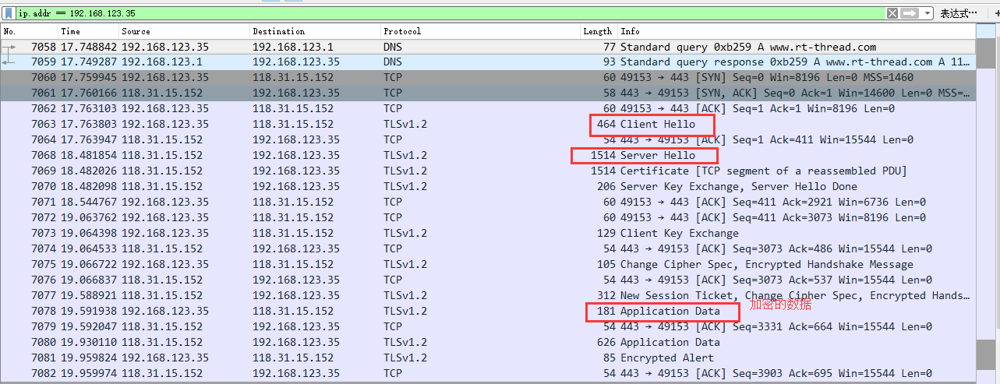

# 前言
随着物联网的发展，连接到互联网的设备数量呈指数增长，物联网信息安全越来越重要。

因此，TLS逐渐成为物联网通讯的标配。但是TLS是加密传输，这给调试增加了一定的难度。

笔者最近工作中一直用到HTTPS，但是苦于wireshark只能抓取HTTP的明文数据包，无法抓取HTTPS的数据包，于是就有了这篇文章，使用wireshark抓取HTTPS的数据包.

# 简单介绍TLS1.2握手和协商过程


## client hello
客户端向服务器发送客户端信息:

- 支持的最高tls协议版本
- 客户端支持的加密方式(cipher suites)列表
- 客户端随机数(ramdom_c)
- 其他扩展字段

## server hello
- 服务器端返回 tls 版本, 加密方式(cipher suite), 服务器的随机数(random_s)
- 服务器发送证书，用于身份验证
- 通知客户端 server hello 信息发送完成

## 证书校验
客户端验证证书的合法性，如果验证通过才会进行后续通讯

## client key exchange
- 客户端计算产生随机数 pre-master，并使用服务器公钥(非对称加密的公钥)加密，发送给服务器
- 客户端通过random_c,random_s,pre_master计算出密钥
- 客户端发送change cipher spec通知服务器后续使用此密钥和加密算法进行通信
- 发送握手数据.

## server change cipher spec
- 服务器接收 pre_master，并使用服务器私钥(非对称加密的私钥)解密
- 服务器通过random_c, random_s, pre_master计算出密钥
- 服务器发送change cipher spec告诉客户端后续的通讯都采用协商的密钥和协商的加密算法通讯

## hangshake message finish
客户端接收服务器发送的握手消息，验证通过后，握手完成。

此后的通讯都采用协商密钥和加密算法通讯。

# 设备端解密https数据包
查阅文档得知，wireshark 支持将 tls 会话中使用的密钥保存到外部文件中，供 wireshark 使用。

## 流程图


在没有抓包路由器的情况下，使用方案A， 电脑创建 wifi 热点，设备端连接电脑热点，并发起 https 请求，服务器接收到请求，向设备端发出响应，设备端根据响应的内容，计算出密钥, 并将设备端随机数和密钥通过 udp 发送到 pc，保存到 sslkey.log 文件，wireshark 根据设备端随机数和密钥即可将 tls 数据包解密。

## 配置wireshark
- 新建 sslkey.log 文件，并配置为 windows 系统变量。


- 配置 wireshark

编辑->首选项->protocols->SSL(version 2.4.9)，更高版本的 wireshark 操作步骤为：编辑->首选项->protocols->TLS


>配置好之后重启 wireshark

按照下面的格式，向 sslkey.log 写入客户端随机数和密钥, 即可使 wireshark 解密 tls 数据包.

```
CLIENT_RANDOM 5a497axx 3756f69b4axxx
CLIENT_RANDOM 5dfb96xx b07a9da164xxx
CLIENT_RANDOM 5a497axx 12e14567b9xxx
CLIENT_RANDOM 55c00xxx b07a9da164xxx
CLIENT_RANDOM 5a497xxx b03ca0d5fcxxx
```

数据的含义如下：

- CLIENT_RANDOM: 固定标签(支持 SSL 3.0, TLS 1.0, 1.1, 1.2)
- 第二个参数：客户端随机数(random_c)32个字节，编码为64个十六进制字符
- 第三个参数: 48字节的协商密钥，编码为96个十六进制字符

接下来只要找到设备上的客户端随机数和密钥，保存到 syskey.log，即可通过 wireshark 解密 tls 数据包。

下面函数，保存了客户端随机数和密钥信息。

ssl_tls.c

```c
int mbedtls_ssl_derive_keys( mbedtls_ssl_context *ssl )
{
    ...

    MBEDTLS_SSL_DEBUG_MSG( 3, ( "ciphersuite = %s",
                   mbedtls_ssl_get_ciphersuite_name( session->ciphersuite ) ) );
    MBEDTLS_SSL_DEBUG_BUF( 3, "master secret", , 48 );
    MBEDTLS_SSL_DEBUG_BUF( 4, "random bytes", handshake->randbytes, 64 );
    MBEDTLS_SSL_DEBUG_BUF( 4, "key block", keyblk, 256 );
    ...
}

```
其中`session->master`保存的是密钥，`handshake->randbytes`保存的是客户端和服务器的随机数。
也就是说，将这两个参数保存到 sslkey.log 文件中，那么 wireshark 就能解密设备上的https数据包。

编写 udp 客户端，将客户端随机数和密钥发送到 windows，windows 编写 udp server python 脚本，用于接收数据，并将数据写入 sslkey.log 文件

```c
#include <rtthread.h>
#include <stdio.h>

#include <sys/socket.h>
#include "netdb.h"

static int port = 5000;

void udpcli_send(char* ip, char* random_c, int random_len, char* master, int master_len)
{
    int sock;
    struct hostent *host;
    struct sockaddr_in server_addr;
    char random_ptr[100] = {0};
    char master_ptr[100] = {0};
    int i = 0;

    if(random_c == RT_NULL || master == RT_NULL)
    {
        rt_kprintf("random_c or master is null\n");
        return;
    }

    host = (struct hostent *) gethostbyname(ip);
    if(host == RT_NULL)
    {
        rt_kprintf("Get host by name failed!\n");
        return;
    }

    //random server_random : 32bit + client_random : 32bit
    for(i = 0; i < 32; i++)
    {
        sprintf(&random_ptr[i*2], "%02x", random_c[32+i]);
    }

    for(i = 0; i < 48; i++)
    {
        sprintf(&master_ptr[i*2], "%02x", master[i]);
    }
    rt_kprintf("random : %s\n", random_ptr);
    rt_kprintf("master : %s\n", master_ptr);

    if((sock = socket(AF_INET, SOCK_DGRAM, IPPROTO_UDP)) == -1)
    {
        rt_kprintf("Create socket error");
        return;
    }

    server_addr.sin_family = AF_INET;
    server_addr.sin_port = htons(port);
    server_addr.sin_addr = *((struct in_addr *)host->h_addr);

    rt_memset(&(server_addr.sin_zero), 0, sizeof(server_addr.sin_zero));

    // sendto(sock, send_data, rt_strlen(send_data), 0, (struct sockaddr *)&server_addr, sizeof(struct sockaddr));
    sendto(sock, random_ptr, 64, 0, (struct sockaddr *)&server_addr, sizeof(struct sockaddr));
    sendto(sock, master_ptr, 96, 0, (struct sockaddr *)&server_addr, sizeof(struct sockaddr));

    if(sock >= 0)
    {
        closesocket(sock);
        sock = -1;
    }
}

```

udpserver.py
```python
import socket

BUFSIZ = 1024
ip_port = ('0.0.0.0', 5000)
file = r'd:\work\tmp\sslkey.log'

server = socket.socket(socket.AF_INET, socket.SOCK_DGRAM)
server.bind(ip_port)

while True:
    random_c, client_addr = server.recvfrom(BUFSIZ)
    master, client_addr = server.recvfrom(BUFSIZ)
    print("open file" + " " + file)
    write_data = 'CLIENT_RANDOM ' + str(random_c, encoding='utf-8') + ' ' + str(master, encoding='utf-8')
    print(write_data)

    with open(file, 'a') as f:
        f.write(write_data)
    print("close file" + " " +file)
```

需要注意的是，设备使用上述方法解密 https 的数据包，加密算法目前只能是 RSA，所以还需要强制客户端发送的加密方式(cipher suites)只能是 RSA。

修改`packages\mbedtls-latest\ports\inc\tls_config.h`，注释掉如下宏定义：

```c
// #define MBEDTLS_KEY_EXCHANGE_PSK_ENABLED
// #define MBEDTLS_KEY_EXCHANGE_DHE_PSK_ENABLED
// #define MBEDTLS_KEY_EXCHANGE_ECDHE_PSK_ENABLED
// #define MBEDTLS_KEY_EXCHANGE_RSA_PSK_ENABLED
// #define MBEDTLS_KEY_EXCHANGE_DHE_RSA_ENABLED
// #define MBEDTLS_KEY_EXCHANGE_ECDHE_RSA_ENABLED
// #define MBEDTLS_KEY_EXCHANGE_ECDHE_ECDSA_ENABLED
// #define MBEDTLS_KEY_EXCHANGE_ECDH_ECDSA_ENABLED
// #define MBEDTLS_KEY_EXCHANGE_ECDH_RSA_ENABLED
```
这样就可以确保客户端和服务器只使用 RSA 的加密方式进行通信, 但是部分服务器不支持 RSA 的方式，握手过程会失败。

将`udpcli_send`函数添加到`mbedtls_ssl_derive_keys`函数中,如下所示
```c
    MBEDTLS_SSL_DEBUG_MSG( 3, ( "ciphersuite = %s",
                   mbedtls_ssl_get_ciphersuite_name( session->ciphersuite ) ) );
    MBEDTLS_SSL_DEBUG_BUF( 3, "master secret", session->master, 48 );
    MBEDTLS_SSL_DEBUG_BUF( 4, "random bytes", handshake->randbytes, 64 );
    MBEDTLS_SSL_DEBUG_BUF( 4, "key block", keyblk, 256 );

    //replace your ip address
    udpcli_send("192.168.123.206", handshake->randbytes, 32, session->master, 48);

    mbedtls_zeroize( handshake->randbytes, sizeof( handshake->randbytes ) );
```

windows 运行 python 脚本(注意修改sslkey.log的文件路径)

```
python udpserver.py
```

设备联网成功后，在 MSH 终端输入

```
 \ | /
- RT -     Thread Operating System
 / | \     4.0.1 build Apr  2 2019
 2006 - 2019 Copyright by rt-thread team
lwIP-2.0.2 initialized!
[I/SAL_SOC] Socket Abstraction Layer initialize success.

...........
msh /mnt/sdcard>
msh /mnt/sdcard>
msh /mnt/sdcard>
msh /mnt/sdcard>wget https://www.rt-thread.com/service/rt-thread.txt 1.txt
```
## wireshark抓包

加密的数据包



解密的数据包


## 分析tls数据包

### 查看客户端随机数


### 查看服务端随机数


### 查看http请求

