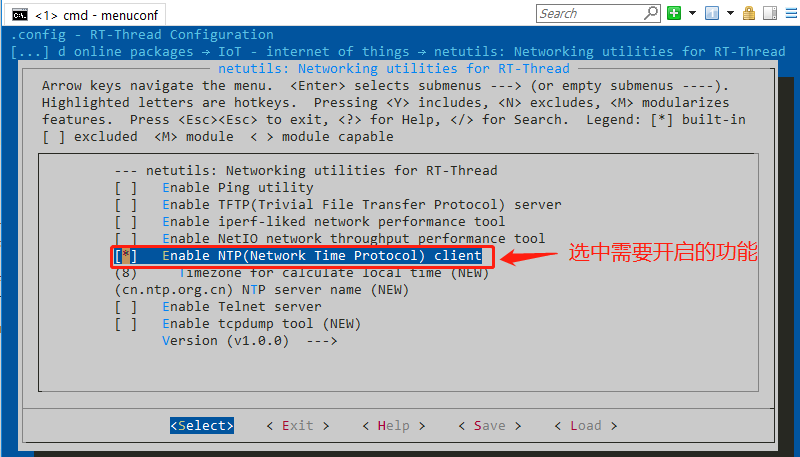
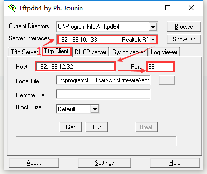
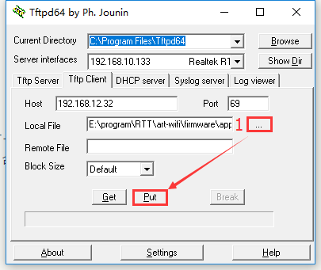
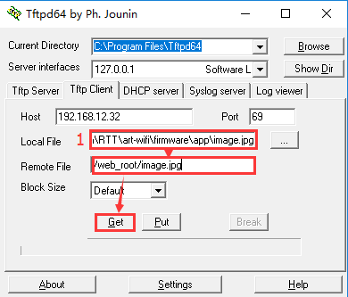
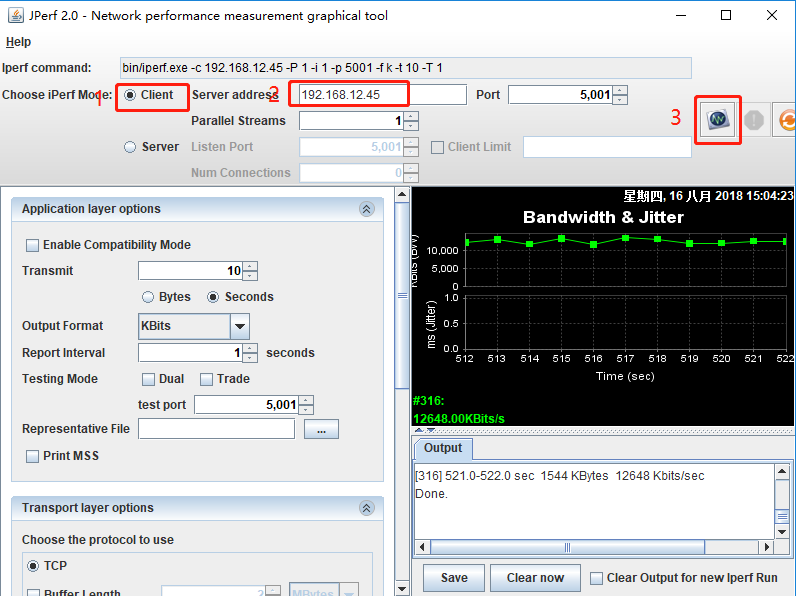
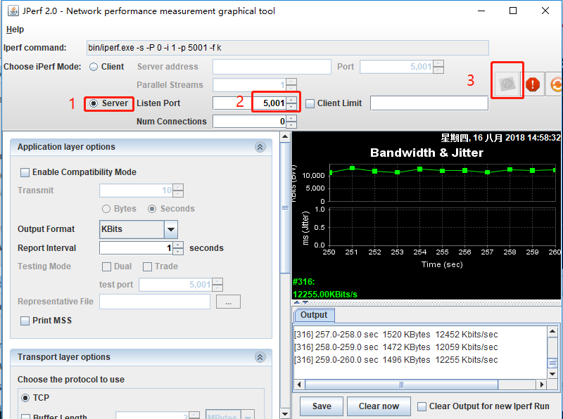

# 网络工具集 (NetUtils) 使用指南

本文介绍 RT-Thread NetUtils 的使用方法，帮助开发者更好地使用 RT-Thread NetUtils 组件来解决网络开发过程中遇到的问题。

## 简介

在进行网络相关的产品开发和调试时，一些好用的小工具往往能取到事半功倍的效果。 RT-Thread NetUtils 组件基于此应用场景，开发和封装了一系列简洁好用的网络工具集合，为开发者提供便利。

为了方便用户开发网络应用，RT-Thread 将常用的网络工具制作 NetUtils 组件包，通过 Env 动态配置，即开即用， 有效降低资源的占用。

## NetUtils 组件简介

RT-Thread NetUtils 作为网络工具合集，既有用于测试调试的 Ping 命令， 同步时间的 NTP 工具， 性能和带宽测试的 Iperf 、 NetIO，还有在嵌入式系统中广泛使用的轻量级文件传输工具 TFTP，方便地通过网络完成两个设备间的文件互传。另外， RT-Thread 还针对开发中的实际问题，提供了一些高级的辅助工具，如可以远程登录到 RT-Thread Finsh/MSH Shell 的 Telnet 工具，以及基于 lwIP 的网络抓包工具 tcpdump。

下面是 RT-Thread NetUtils 的分类和简介：

| **名称** | **分类** | **描述** |
|:--|:--:|:--|
| Ping | 调试测试 | 利用 “ping” 命令可以检查网络是否连通，可以很好地帮助我们分析和判定网络故障 |
| NTP | 时间同步 | 网络时间协议 |
| TFTP | 文件传输 | TFTP 是一个传输文件的简单协议，比 FTP 还要轻量级 |
| Iperf | 性能测试 | 测试最大 TCP 和 UDP 带宽性能，可以报告带宽、延迟抖动和数据包丢失 |
| NetIO | 性能测试 | 测试网络的吞吐量的工具 |
| Telnet | 远程访问 | 可以远程登录到 RT-Thread 的 Finsh/MSH Shell|
| tcpdump | 网络调试 | tcpdump 是 RT-Thread 基于 lwIP 的网络抓包工具 |

每个小工具可使用 menuconfig 独立控制启用 / 停用，并提供了 Finsh/MSH 的使用命令。
首先打开 Env 工具，进入 BSP 目录，在 Env 命令行输入 menuconfig 进入配置界面配置工程，根据需求选择合适的 NetUtils 功能，如图所示

> [!NOTE]
> 注：Ping 和 TFTP 依赖于 lwIP，需要先开启 lwIP 的依赖后才能显示

```c
RT-Thread online packages
  -> IoT - internet of things
    -> netutils: Networking utilities for RT-Thread
```



## Ping 工具

[Ping](https://baike.baidu.com/item/ping/6235) 是一种网络诊断工具，用来测试数据包能否通过 IP 协议到达特定主机。估算与主机间的丢失数据包率（丢包率）和数据包往返时间（网络时延，Round-trip delay time)

Ping 工具依赖 lwIP，需要先在 Env 工具 开启 lwIP 的依赖才可见，步骤如下：

```c
-> RT-Thread Components
  -> Network stack
    -> light weight TCP/IP stack
      -> Enable lwIP stack
```

在 NetUtils 菜单栏使能 Ping 选项：

```c
RT-Thread online packages
  -> IoT - internet of things
    -> netutils: Networking utilities for RT-Thread
    [*] Enable Ping utility
```

Ping 支持访问 `IP 地址 ` 或 ` 域名 ` ，使用 Finsh/MSH 命令进行测试，大致使用效果如下：

- Ping 域名

```
msh />ping rt-thread.org
60 bytes from 116.62.244.242 icmp_seq=0 ttl=49 time=11 ticks
60 bytes from 116.62.244.242 icmp_seq=1 ttl=49 time=10 ticks
60 bytes from 116.62.244.242 icmp_seq=2 ttl=49 time=12 ticks
60 bytes from 116.62.244.242 icmp_seq=3 ttl=49 time=10 ticks
msh />

```
- Ping IP

```
msh />ping 192.168.10.12
60 bytes from 192.168.10.12 icmp_seq=0 ttl=64 time=5 ticks
60 bytes from 192.168.10.12 icmp_seq=1 ttl=64 time=1 ticks
60 bytes from 192.168.10.12 icmp_seq=2 ttl=64 time=2 ticks
60 bytes from 192.168.10.12 icmp_seq=3 ttl=64 time=3 ticks
msh />

```

## NTP 工具

[NTP](https://baike.baidu.com/item/NTP) 是网络时间协议 (Network Time Protocol)，它是用来同步网络中各个计算机时间的协议。
在 RT-Thread 上实现了 NTP 客户端，连接上网络后，可以获取当前 UTC 时间，并更新至 RTC 中。

在 NetUtils 菜单栏使能 NTP 选项：

```c
RT-Thread online packages
  -> IoT - internet of things
    -> netutils: Networking utilities for RT-Thread
    [*] Enable NTP(Network Time Protocol) client
```

### 获取 UTC 时间

[UTC 时间](https://baike.baidu.com/item/%E5%8D%8F%E8%B0%83%E4%B8%96%E7%95%8C%E6%97%B6/787659?fromtitle=UTC&fromid=5899996) 又称世界统一时间、世界标准时间、国际协调时间。北京时间为 UTC+8 时间，比 UTC 时间多 8 小时，或者理解为早 8 小时。

获取 UTC 时间函数原型为：`time_t time_t ntp_get_time(void)`，返回值大于 0 则获取时间成功，等于 0 失败。

示例代码：

```c
#include <ntp.h>

void main(void)
{
    time_t cur_time;

    cur_time = ntp_get_time();

    if (cur_time)
    {
        rt_kprintf("NTP Server Time: %s", ctime((const time_t*) &cur_time));
    }
}
```

### 获取本地时间

本地时间比 UTC 时间多了时区的概念，例如：北京时间为东八区，比 UTC 时间多 8 个小时。在 `menuconfig` 中可以设置当前时区，默认为 `8`。

获取本地时间函数原型为： `time_t ntp_get_local_time(void)`，返回值大于 0 则获取时间成功，等于 0 失败。该 API 使用方法与 `ntp_get_time()` 类似。

### 同步本地时间至 RTC

如果开启 RTC 设备，还可以使用下面的命令及 API 同步 NTP 的本地时间至 RTC 设备。

Finsh/MSH 命令效果如下：

```
msh />ntp_sync
Get local time from NTP server: Sat Feb 10 15:22:33 2018
The system time is updated. Timezone is 8.
msh />
```

同步本地时间至 RTC 函数原型为：`time_t ntp_sync_to_rtc(void)`，返回值大于 0 成功，等于 0 失败。

> [!NOTE]
> NTP API 方法执行时会占用较多的线程堆栈，使用时保证堆栈空间充足（≥1.5K）。
>
> NTP API 方法 **不支持可重入**，并发使用时，请注意加锁。

## TFTP 工具

[TFTP](https://baike.baidu.com/item/TFTP) （Trivial File Transfer Protocol, 简单文件传输协议）是 TCP/IP 协议族中的一个用来在客户机与服务器之间进行简单文件传输的协议，提供不复杂、开销不大的文件传输服务，端口号为**69**，比传统的 FTP 协议要轻量级很多，适用于小型的嵌入式产品上。

RT-Thread 目前支持的是 TFTP 服务器。

TFTP 工具依赖 lwIP，需要先在 Env 工具 开启 lwIP 的依赖才可见，步骤如下：
```c
-> RT-Thread Components
  -> Network stack
    -> light weight TCP/IP stack
      -> Enable lwIP stack
```
在 NetUtils 菜单栏使能 TFTP 选项：
```c
RT-Thread online packages
  -> IoT - internet of things
    -> netutils: Networking utilities for RT-Thread
    [*] Enable TFTP(Trivial File Transfer Protocol) server
```

- 安装 TFTP 客户端

安装文件位于 `netutils/tools/Tftpd64-4.60-setup.exe` ，使用 TFTP 前，请先安装该软件。

- 启动 TFTP 服务器

在传输文件前，需要在 RT-Thread 上使用 Finsh/MSH 命令来启动 TFTP 服务器，大致效果如下：

```
msh />tftp_server
TFTP server start successfully.
msh />
```

### 传输文件

打开刚安装的 `Tftpd64` 软件，按如下操作进行配置：

1、选择 `Tftp Client` ；

2、在 `Server interfaces` 下拉框中，务必选择好与 RT-Thread 处于同一网段的网卡；

3、填写 TFTP 服务器的 IP 地址。可以在 RT-Thread 的 MSH 下使用 `ifconfig` 命令查看；

4、填写 TFTP 服务器端口号，默认： `69`



### 发送文件到 RT-Thread

1、在 `Tftpd64` 软件中，选择好要发送文件；

2、`Remote File` 是服务器端保存文件的路径（包括文件名），选项支持相对路径和绝对路径。由于 RT-Thread 默认开启 `DFS_USING_WORKDIR` 选项，此时相对路径是基于 Finsh/MSH 当前进入的目录。所以，使用相对路径时，务必提前切换好目录；

3、点击 `Put` 按钮即可。

如下图所示，将文件发送至 Finsh/MSH 当前进入的目录下，这里使用的是**相对路径**：



> [!NOTE]
> 注：如果 `DFS_USING_WORKDIR` 未开启，同时 `Remote File` 为空，文件会将保存至根路径下。

### 从 RT-Thread 接收文件

1、在 `Tftpd64` 软件中，填写好要接收保存的文件路径（包含文件名）；

2、`Remote File` 是服务器端待接收回来的文件路径（包括文件名），选项支持相对路径和绝对路径。由于 RT-Thread 默认开启 `DFS_USING_WORKDIR` 选项，此时相对路径是基于 Finsh/MSH 当前进入的目录。所以，使用相对路径时，务必提前切换好目录；

3、点击 `Get` 按钮即可。


如下所示，将 `/web_root/image.jpg` 保存到本地，这里使用的是**绝对路径**：

```
msh /web_root>ls           ## 查看文件是否存在
Directory /web_root:
image.jpg           10559
msh /web_root>
```


## Iperf 工具

[Iperf](https://baike.baidu.com/item/iperf) 是一个网络性能测试工具。Iperf 可以测试最大 TCP 和 UDP 带宽性能，具有多种参数和 UDP 特性，可以根据需要调整，可以报告带宽、延迟抖动和数据包丢失。

在 NetUtils 菜单栏使能 Iperf 选项：
```c
RT-Thread online packages
  -> IoT - internet of things
    -> netutils: Networking utilities for RT-Thread
    [*] Enable iperf-liked network performance tool
```

Iperf 使用的是主从式架构，即一端是服务器，另一端是客户端，我们提供的 Iperf 软件包实现了 TCP 服务器模式和客户端模式，暂不支持 UDP 测试。下面将具体讲解 2 种模式的使用方法。

### Iperf 服务器模式

#### 获取 IP 地址

需要在 RT-Thread 上使用 Finsh/MSH 命令来获取 IP 地址，大致效果如下：

```
msh />ifconfig
network interface: e0 (Default)
MTU: 1500
MAC: 00 04 9f 05 44 e5
FLAGS: UP LINK_UP ETHARP
ip address: 192.168.12.71
gw address: 192.168.10.1
net mask  : 255.255.0.0
dns server #0: 192.168.10.1
dns server #1: 223.5.5.5
```
记下获得的 IP 地址 192.168.12.71（按实际情况记录）

#### 启动 Iperf 服务器

需要在 RT-Thread 上使用 Finsh/MSH 命令来启动 Iperf 服务器，大致效果如下：

```
msh />iperf -s -p 5001
```

-s 表示作为服务器启动
-p 表示监听 5001 端口

- 安装 JPerf 测试软件

安装文件位于 `netutils/tools/jperf.rar` ，这个是绿色软件，安装实际上是解压的过程，解压到新文件夹即可。

- 进行 jperf 测试

打开 `jperf.bat` 软件，按如下操作进行配置：

1、 选择 `Client` 模式；

2、 输入刚刚获得的 IP 地址 192.168.12.71（按实际地址填写）；

3、 修改端口号为 5001；

4、 点击 `run Lperf!` 开始测试；

5、 等待测试结束。测试时，测试数据会在 shell 界面和 JPerf 软件上显示。



### Iperf 客户端模式

- 获取 PC 的 IP 地址

在 PC 的命令提示符窗口上使用 ipconfig 命令获取 PC 的 IP 地址，记下获得的 PC IP 地址为 192.168.12.45（按实际情况记录）。

- 安装 JPerf 测试软件

安装文件位于 `netutils/tools/jperf.rar` ，这个是绿色软件，安装实际上是解压的过程，解压到新文件夹即可。

- 开启 jperf 服务器

打开 `jperf.bat` 软件，按如下操作进行配置：

1、 选择 `Server` 模式

2、 修改端口号为 5001

3、 点击 `run Lperf!` 开启服务器

- 启动 Iperf 客户端

需要在 RT-Thread 上使用 Finsh/MSH 命令来启动 Iperf 客户端，大致效果如下：

```
msh />iperf -c 192.168.12.45 -p 5001
```
-c 表示作为客户端启动，后面需要加运行服务器端的 pc 的 IP 地址
-p 表示连接 5001 端口
等待测试结束。测试时，测试数据会在 shell 界面和 JPerf 软件上显示。



## 其他网络调试工具的介绍和使用
除了上述常用的网络工具，RT-Thread 也提供一些开发调试中比较实用的网络工具，如 NetIO 工具、 Telnet 工具和 tcpdump 工具。

### NetIO 工具
[NetIO](http://www.nwlab.net/art/netio/netio.html) 用于在 OS/2 2.x 、 Windows 、 Linux 和 Unix 上进行网络性能测试的工具。它会通过 TCP/UDP 方式，使用不同大小的数据包进行网络净吞吐量测试。

RT-Thread 目前支持的是 NetIO TCP 服务器。

NetIO 的使用请参考组件目录下的 README ，此处不再赘述。

### Telnet 工具

[Telnet](https://baike.baidu.com/item/Telnet) 协议是一种应用层协议，使用于互联网及局域网中，使用虚拟终端机的形式，提供双向、以文字字符串为主的交互功能。属于 TCP/IP 协议族的其中之一，是 Internet 远程登录服务的标准协议和主要方式，常用于网页服务器的远程控制，可供用户在本地主机运行远程主机上的工作。

RT-Thread 目前支持的是 Telnet 服务器， Telnet 客户端连接成功后，将会远程连接到设备的 Finsh/MSH ，实现设备的远程控制。

Telnet 的使用请参考组件目录下的 README ，此处不再赘述。

###  tcpdump 工具

tcpdump 是一款基于 RT-Thread 的捕获 IP 报文的小工具， 抓包的数据可以通过文件系统保存，或者通过 rdb 工具导入 PC，利用 wireshark 软件解析。

tcpdump 的使用请参考组件目录下的 README ，此处不再赘述。

## 参考资料

* [《Env 用户手册》](../../../programming-manual/env/env.md)
