# Telnet 协议原理及使用体验

## 1\. 概述

Telnet 协议是 TCP/IP 协议族中的一员，是 Internet 远程登陆服务的标准协议。Telnet 协议的目的是提供一个相对通用的，双向的，面向八位字节的通信方法，允许界面终端设备和面向终端的过程能通过一个标准过程进行互相交互。应用 Telnet 协议能够把本地用户所使用的计算机变成远程主机系统的一个终端。

Telnet 协议具有如下的特点：

1.  **适应异构**　　

为了使多个操作系统间的 Telnet 交互操作成为可能，就必须详细了解异构计算机和操作系统。比如，一些操作系统需要每行文本用 ASCII 回车控制符（CR）结束，另一些系统则需要使用 ASCII 换行符（LF），还有一些系统需要用两个字符的序列回车-换行（CR-LF）；再比如，大多数操作系统为用户提供了一个中断程序运行的快捷键，但这个快捷键在各个系统中有可能不同（一些系统使用CTRL+C，而另一些系统使用ESCAPE）。如果不考虑系统间的异构性，那么在本地发出的字符或命令，传送到远地并被远地系统解释后很可能会不准确或者出现错误。因此，Telnet 协议必须解决这个问题。

为了适应异构环境，Telnet 协议定义了数据和命令在 Internet 上的传输方式，此定义被称作网络虚拟终端 NVT（Net Virtual Terminal）。它的应用过程如下：

对于发送的数据：客户机软件把来自用户终端的按键和命令序列转换为 NVT 格式，并发送到服务器，服务器软件将收到的数据和命令，从 NVT 格式转换为远地系统需要的格式；
对于返回的数据：远地服务器将数据从远地机器的格式转换为 NVT 格式，而本地客户机将将接收到的 NVT 格式数据再转换为本地的格式。

2. **传送远地命令**　　

我们知道绝大多数操作系统都提供各种快捷键来实现相应的控制命令，当用户在本地终端键入这些快捷键的时候，本地系统将执行相应的控制命令，而不把这些快捷键作为输入。那么对于 Telnet 来说，它是用什么来实现控制命令的远地传送呢？

Telnet 同样使用 NVT 来定义如何从客户机将控制功能传送到服务器。我们知道 USASCII 字符集包括 95 个可打印字符和 33 个控制码。当用户从本地键入普通字符时，NVT 将按照其原始含义传送；当用户键入快捷键（组合键）时，NVT 将把它转化为特殊的 ASCII 字符在网络上传送，并在其到达远地机器后转化为相应的控制命令。将正常 ASCII 字符集与控制命令区分主要有两个原因：

这种区分意味着 Telnet 具有更大的灵活性：它可在客户机与服务器间传送所有可能的 ASCII 字符以及所有控制功能；
这种区分使得客户机可以无二义性的指定信令，而不会产生控制功能与普通字符的混乱。　　

3. **数据流向**　　

将 Telnet 设计为应用级软件有一个缺点，那就是：效率不高。这是为什么呢？下面给出 Telnet 中的数据流向：

数据信息被用户从本地键盘键入并通过操作系统传到客户机程序，客户机程序将其处理后返回操作系统，并由操作系统经过网络传送到远地机器，远地操作系统将所接收数据传给服务器程序，并经服务器程序再次处理后返回到操作系统上的伪终端入口点，最后，远地操作系统将数据传送到用户正在运行的应用程序，这便是一次完整的输入过程；输出将按照同一通路从服务器传送到客户机。

因为每一次的输入和输出，计算机将切换进程环境好几次，这个开销是很昂贵的。还好用户的键入速率并不算高，这个缺点我们仍然能够接受。　　

4. **强制命令**

我们应该考虑到这样一种情况：假设本地用户运行了远地机器的一个无休止循环的错误命令或程序，且此命令或程序已经停止读取输入，那么操作系统的缓冲区可能因此而被占满，如果这样，远地服务器也无法再将数据写入伪终端，并且最终导致停止从 TCP 连接读取数据，TCP 连接的缓冲区最终也会被占满，从而导致阻止数据流流入此连接。如果以上事情真的发生了，那么本地用户将失去对远地机器的控制。

为了解决此问题，Telnet 协议必须使用**外带信令以便强制服务器读取一个控制命令**。我们知道 TCP 用紧急数据机制实现外带数据信令，那么 Telnet 只要再附加一个被称为数据标记 (date mark) 的保留八位组，并通过让 TCP 发送已设置紧急数据比特的报文段通知服务器便可以了，携带紧急数据的报文段将绕过流量控制直接到达服务器。作为对紧急信令的相应，服务器将读取并抛弃所有数据，直到找到了一个数据标记。服务器在遇到了数据标记后将返回正常的处理过程。

5. **选项协商**　　

由于 Telnet 两端的机器和操作系统的异构性，使得 Telnet 不可能也不应该严格规定每一个 telnet 连接的详细配置，否则将大大影响 Telnet 的适应异构性。因此，Telnet 采用选项协商机制来解决这一问题。

Telnet选项的范围很广：一些选项扩充了大方向的功能，而一些选项制涉及一些微小细节。例如：有一个选项可以控制Telnet是在半双工还是全双工模式下工作（大方向）；还有一个选项允许远地机器上的服务器决定用户终端类型（小细节）。

Telnet 选项的协商方式也很有意思，它对于每个选项的处理都是对称的，即任何一端都可以发出协商申请；任何一端都可以接受或拒绝这个申请。另外，如果一端试图协商另一端不了解的选项，接受请求的一端可简单的拒绝协商。因此，有可能将更新，更复杂的 Telnet 客户机服务器版本与较老的，不太复杂的版本进行交互操作。如果客户机和服务器都理解新的选项，可能会对交互有所改善。否则，它们将一起转到效率较低但可工作的方式下运行。所有的这些设计，都是为了增强适应异构性，可见 Telnet 的适应异构性对其的应用和发展是多么重要。　

## 2\. 原理

Telnet 协议的主体由三个部分组成：

网络虚拟终端（NVT，Network Virtual Terminal）的定义；操作协商定义；协商有限自动机；

### 2.1. 网络虚拟终端（NVT）

#### 2.1.1. NVT 工作原理

顾名思义，网络虚拟终端（NVT）是一种虚拟的终端设备，它被客户和服务器所采用，用来建立数据表示和解释的一致性。

#### 2.1.2. NVT的定义

1. NVT 的组成

网络虚拟终端 NVT 包括两个部分：

输出设备：输出远程数据，一般为显示器
输入设备：本地数据输入

2. 在 NVT 上传输的数据格式

在网络虚拟终端 NVT 上传输的数据采用 8 bit 字节数据，其中最高位为0的字节用于一般数据，最高位为 1 的字节用于 NVT 命令

3. NVT 在 TELNET 中的使用

TELNET 使用了一种对称的数据表示，当每个客户机发送数据时，把它的本地终端的字符表示影射到 NVT 的字符表示上，当接收数据时，又把 NVT 的表示映射到本地字符集合上。

在通信开始时，通信双方都支持一个基本的 NVT 终端特性子集（只能区分何为数据，何为命令），以便在最低层次上通信，在这个基础上，双方通过 NVT 命令协商确定 NVT 的更高层次上的特性，实现对 NVT 功能的扩展。

在 TELNET 中存在大量的子协议用于协商扩展基本的网络虚拟终端 NVT 的功能，由于终端类型的多样化，使得 TELNET 协议族变得庞大起来。

### 2.2. 操作协商

#### 2.2.1. 为什么要协商操作选项

当定义了网络虚拟终端设备后，通信的双方就可以在一个较低的层次上实现数据通信，但基本的 NVT 设备所具有的特性是十分有限的，它只能接收和显示 7 位的ASCII 码，没有最基本的编辑能力，所以简单的 NVT 设备是没有实际应用意义的；为此 TELNET 协议定义了一族协议用于扩展基本 NVT 的功能，目的是使 NVT 能够最大限度地达到用户终端所具有的功能。

为了实现对多种终端特性的支持，TELNET 协议规定在扩展 NVT 功能时采用协商的机制，只有通信双方通过协商后达成一致的特性才能使用，才能赋予 NVT 该项特性，这样就可以支持具有不同终端特性的终端设备可以互连，保证他们是工作在他们自己的能力以内。

#### 2.2.2. 操作协商命令格式

TELNET 的操作协商使用 NVT 命令，即最高位为 1 的字节流，每条 NVT 命令以字节 IAC（0xFF）开始。原理如下：

只要客户机或服务器要发送命令序列而不是数据流，它就在数据流中插入一个特殊的保留字符，该保留字符叫做“解释为命令”（IAC ，Interpret As Command\) 字符。当接收方在一个入数据流中发现 IAC 字符时，它就把后继的字节处理为一个命令序列。下面列出了所有的 Telnet NVT 命令，其中很少用到。

表1 TELNET 命令

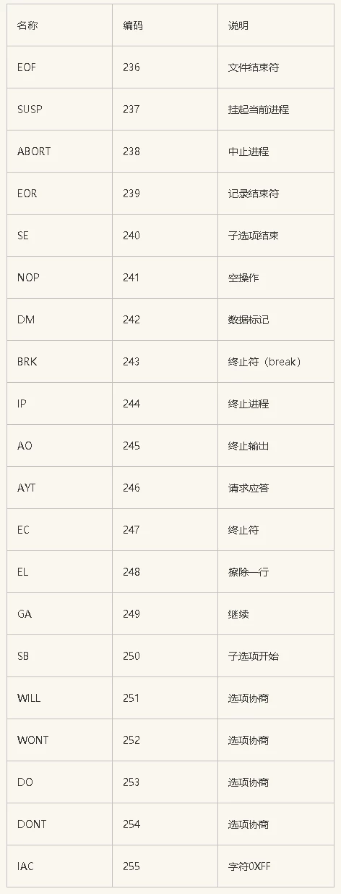

其中常用的 TELNET选项协商如下：

WILL \(option code\) 251 指示希望开始执行，或者确认现在正在操作指示的选项。
WON'T \(option code\) 252 指出拒绝执行或继续招待所指示的选项。
DO \(option code\) 253 指出要求对方执行，或者确认希望对方执行指示的选项。
DON'T \(option code\) 254 指出要求对方停止执行，或者确诊要求对方停止执行指示的选项。
那么对于接收方和发送方有以下几种组合：

**表2 TELNET 选项协商的六种情况**

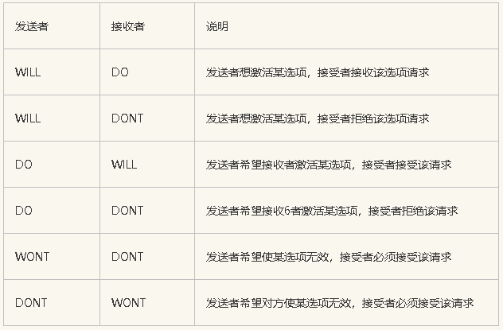

发送者希望对方使某选项无效，接受者必须接受该请求

选项协商需要 3 个字节：IAC，然后是 WILL、DO、WONT 或 DONT；最后一个标识字节用来指明操作的选项。常用的选项代码如下：

**表3 TELNET 选项代码**

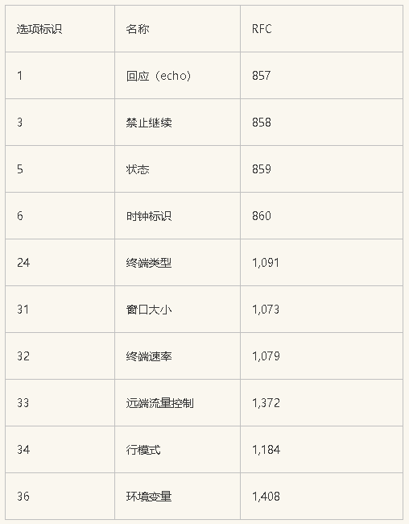

通常情况下，客户机向服务器发送字符而服务器将其回显到用户的终端上，但是，如果网络的时延回引起回显速度太慢，用户可能更愿意让本地系统回显字符。在客户机允许本地系统回显前，它要向服务器发送以下序列：

IAC DONT ECHO

服务器收到请求后，发出 3 个字符的响应：

IAC WONT ECHO

表示服务器已经按请求同意关闭回显。

### 2.3. 子选项协商

除了“打开”或“关闭”以外，有些选项还需要更多的信息，例如对于指明终端类型来说，客户必须发送一个字符串来标识终端类型，所以要定义子选项协商。

RFC 1091 定义了终端类型的子选项协商。举个例子：

客户发送字节序列来请求打开选项：

\< IAC，WILL，24>

24 是终端类型的选项标识符。如果服务器同意该请求，响应为：

\< IAC，DO，24 >

接着服务器发送

\< IAC，SB，24，1，IAC，SE>请求客户给出其终端类型。

SB 是子选项开始命令，下一个字节 24 表示该子选项为终端类型选项。下一个字节 1 表示：发送你的终端类型。客户的响应为：

\< IAC，SB，24，0，'I'，'B'，'M'，'P'，'C'， IAC，SE>

第四个字节 0 的含义是“我的终端类型为”。

### 3\. 实现

整个协议软件分为三个模块，各模块的功能如下：

1.  与本地用户的输入/输出模块：处理用户输入/输出；
2.  与远地系统的输入/输出模块：处理与远程系统输入/输出；
3.  TELNET协议模块：实现TELNET协议，维护协议状态机。

telnet客户机要做两件事：

读取用户在键盘上键入的字符，并通过tcp连接把他们发送到远程服务器上。
读取从tcp连接上收到的字符，并显示在用户的终端上。

### rt-thread中使用telnet功能,基于开发板Art-Pi

1. 可以使示例工程 art\_pi\_wifi
    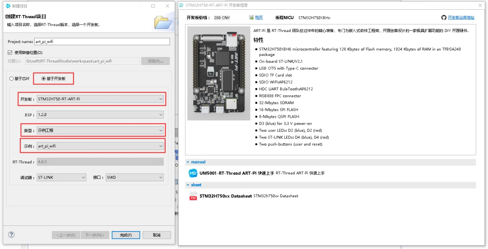

2. 确保 “rt-thread setting” 三个组件安装 easyflash, netutils, fal
    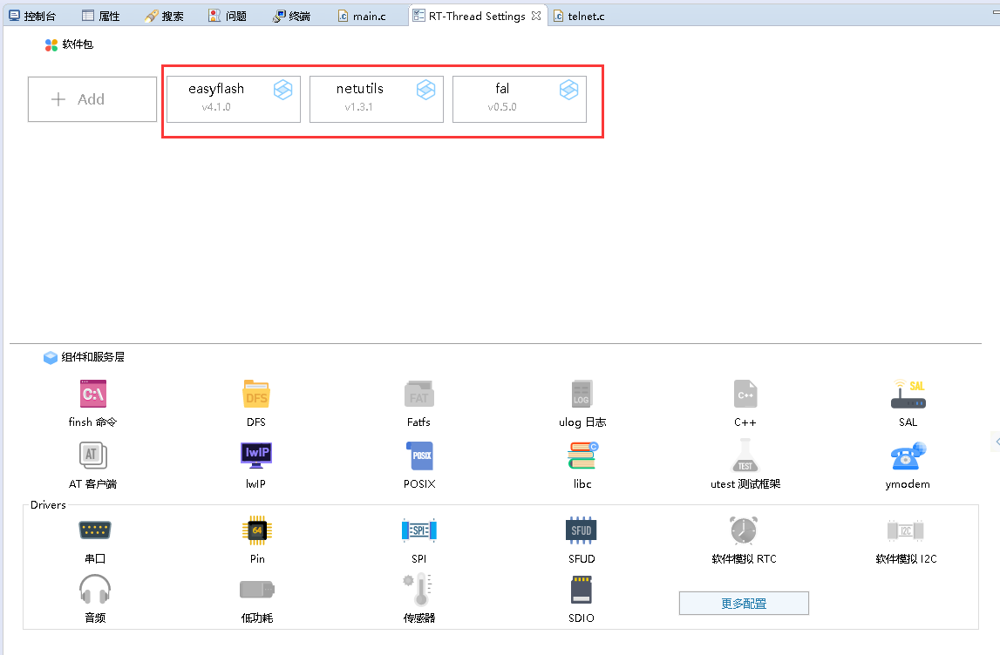

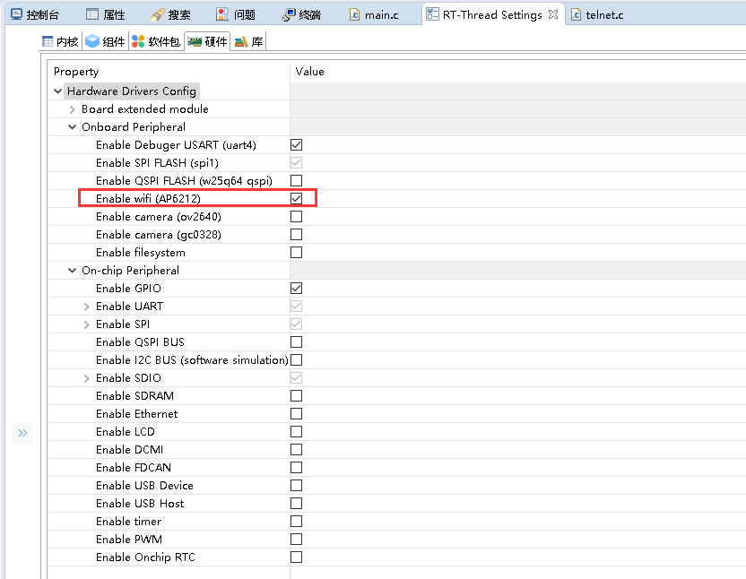


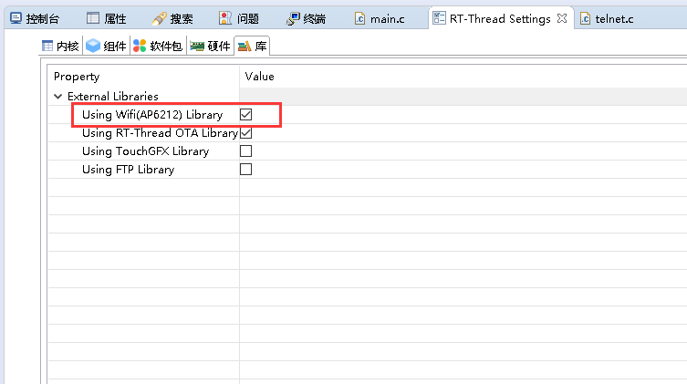

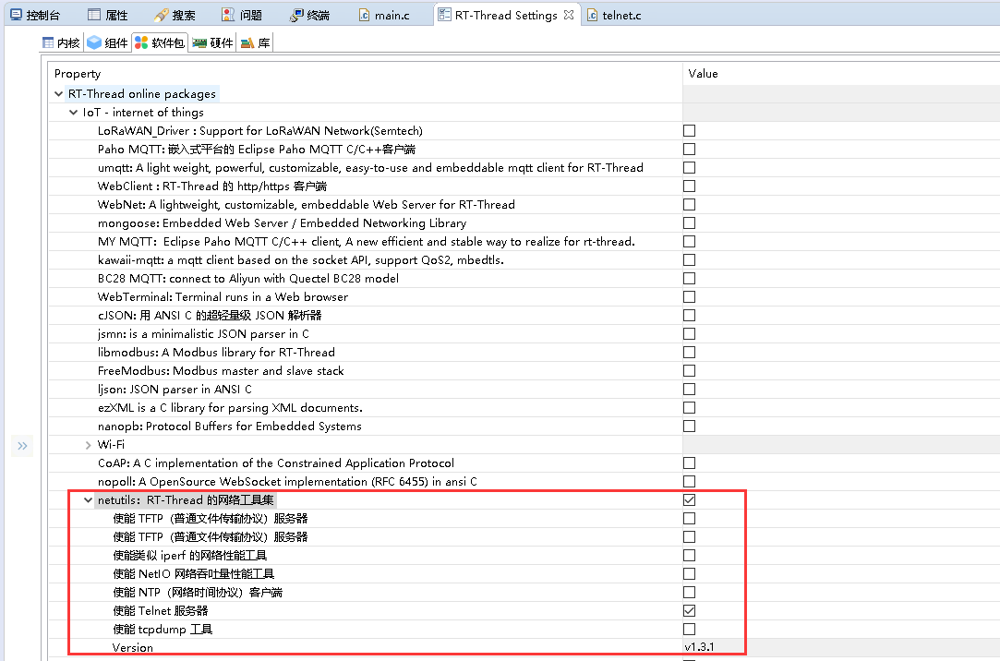

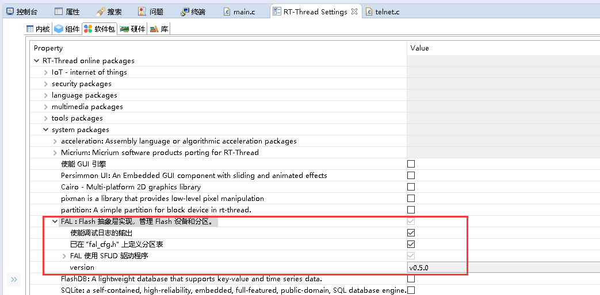

3. 在 main.c 可以加上以下代码

```c
extern void wlan_autoconnect_init(void); 

rt_wlan_config_autoreconnect(RT_TURE);

rt_pin_mode(LED_PIN, PIN_MODE_OUTPUT);
```

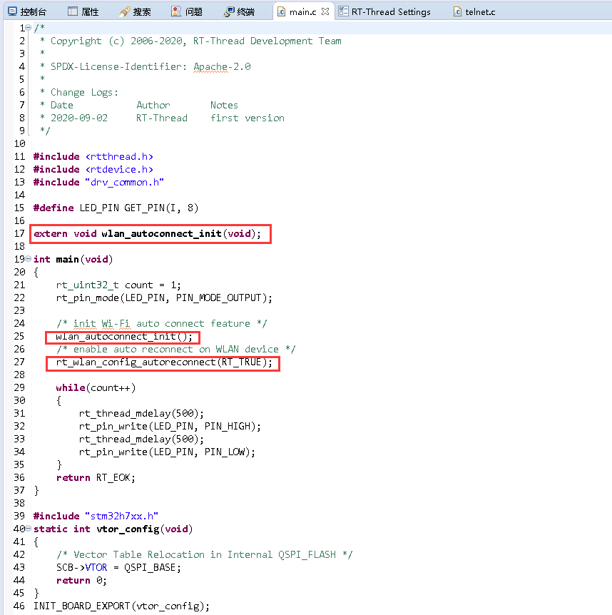

4. 工程项目 packagesnetutils - v1.3.1 -> telnet -> telnet.c

```c
/*
 * File      : telnet.c
 * This file is part of RT-Thread RTOS
 * COPYRIGHT (C) 2006-2018, RT-Thread Development Team
 *
 *  This program is free software; you can redistribute it and/or modify
 *  it under the terms of the GNU General Public License as published by
 *  the Free Software Foundation; either version 2 of the License, or
 *  (at your option) any later version.
 *
 *  This program is distributed in the hope that it will be useful,
 *  but WITHOUT ANY WARRANTY; without even the implied warranty of
 *  MERCHANTABILITY or FITNESS FOR A PARTICULAR PURPOSE.  See the
 *  GNU General Public License for more details.
 *
 *  You should have received a copy of the GNU General Public License along
 *  with this program; if not, write to the Free Software Foundation, Inc.,
 *  51 Franklin Street, Fifth Floor, Boston, MA 02110-1301 USA.
 *
 * Change Logs:
 * Date           Author       Notes
 * 2012-04-01     Bernard      first version
 * 2018-01-25     armink       Fix it on RT-Thread 3.0+
 */
#include <rtthread.h>
#include <rtdevice.h>

#ifdef PKG_NETUTILS_TELNET
#if defined(RT_USING_DFS_NET) || defined(SAL_USING_POSIX)
#include <sys/socket.h>
#else
#include <lwip/sockets.h>
#endif /* SAL_USING_POSIX */

#if defined(RT_USING_POSIX)
#include <dfs_posix.h>
#include <dfs_poll.h>
#include <libc.h>
static int dev_old_flag;
#endif

#include <finsh.h>
#include <msh.h>
#include <shell.h>

#define TELNET_PORT         23
#define TELNET_BACKLOG      5
#define RX_BUFFER_SIZE      256
#define TX_BUFFER_SIZE      4096

#define ISO_nl              0x0a
#define ISO_cr              0x0d

#define STATE_NORMAL        0
#define STATE_IAC           1
#define STATE_WILL          2
#define STATE_WONT          3
#define STATE_DO            4
#define STATE_DONT          5
#define STATE_CLOSE         6

#define TELNET_IAC          255
#define TELNET_WILL         251
#define TELNET_WONT         252
#define TELNET_DO           253
#define TELNET_DONT         254

struct telnet_session
{
    struct rt_ringbuffer rx_ringbuffer;
    struct rt_ringbuffer tx_ringbuffer;

    rt_mutex_t rx_ringbuffer_lock;
    rt_mutex_t tx_ringbuffer_lock;

    struct rt_device device;
    rt_int32_t server_fd;
    rt_int32_t client_fd;

    /* telnet protocol */
    rt_uint8_t state;
    rt_uint8_t echo_mode;

    rt_sem_t read_notice;
};

static struct telnet_session* telnet;

/* process tx data */
static void send_to_client(struct telnet_session* telnet)
{
    rt_size_t length;
    rt_uint8_t tx_buffer[32];

    while (1)
    {
        rt_memset(tx_buffer, 0, sizeof(tx_buffer));
        rt_mutex_take(telnet->tx_ringbuffer_lock, RT_WAITING_FOREVER);
        /* get buffer from ringbuffer */
        length = rt_ringbuffer_get(&(telnet->tx_ringbuffer), tx_buffer, sizeof(tx_buffer));
        rt_mutex_release(telnet->tx_ringbuffer_lock);

        /* do a tx procedure */
        if (length > 0)
        {
            send(telnet->client_fd, tx_buffer, length, 0);
        }
        else break;
    }
}

/* send telnet option to remote */
static void send_option_to_client(struct telnet_session* telnet, rt_uint8_t option, rt_uint8_t value)
{
    rt_uint8_t optbuf[4];

    optbuf[0] = TELNET_IAC;
    optbuf[1] = option;
    optbuf[2] = value;
    optbuf[3] = 0;

    rt_mutex_take(telnet->tx_ringbuffer_lock, RT_WAITING_FOREVER);
    rt_ringbuffer_put(&telnet->tx_ringbuffer, optbuf, 3);
    rt_mutex_release(telnet->tx_ringbuffer_lock);

    send_to_client(telnet);
}

/* process rx data */
static void process_rx(struct telnet_session* telnet, rt_uint8_t *data, rt_size_t length)
{
    rt_size_t index;

    for (index = 0; index < length; index++)
    {
        switch (telnet->state)
        {
        case STATE_IAC:
            if (*data == TELNET_IAC)
            {
                rt_mutex_take(telnet->rx_ringbuffer_lock, RT_WAITING_FOREVER);
                /* put buffer to ringbuffer */
                rt_ringbuffer_putchar(&(telnet->rx_ringbuffer), *data);
                rt_mutex_release(telnet->rx_ringbuffer_lock);

                telnet->state = STATE_NORMAL;
            }
            else
            {
                /* set telnet state according to received package */
                switch (*data)
                {
                case TELNET_WILL:
                    telnet->state = STATE_WILL;
                    break;
                case TELNET_WONT:
                    telnet->state = STATE_WONT;
                    break;
                case TELNET_DO:
                    telnet->state = STATE_DO;
                    break;
                case TELNET_DONT:
                    telnet->state = STATE_DONT;
                    break;
                default:
                    telnet->state = STATE_NORMAL;
                    break;
                }
            }
            break;

            /* don't option */
        case STATE_WILL:
        case STATE_WONT:
            send_option_to_client(telnet, TELNET_DONT, *data);
            telnet->state = STATE_NORMAL;
            break;

            /* won't option */
        case STATE_DO:
        case STATE_DONT:
            send_option_to_client(telnet, TELNET_WONT, *data);
            telnet->state = STATE_NORMAL;
            break;

        case STATE_NORMAL:
            if (*data == TELNET_IAC)
            {
                telnet->state = STATE_IAC;
            }
            else if (*data != '\r') /* ignore '\r' */
            {
                rt_mutex_take(telnet->rx_ringbuffer_lock, RT_WAITING_FOREVER);
                /* put buffer to ringbuffer */
                rt_ringbuffer_putchar(&(telnet->rx_ringbuffer), *data);
                rt_mutex_release(telnet->rx_ringbuffer_lock);
                rt_sem_release(telnet->read_notice);
            }
            break;
        }
        data++;
    }


#if !defined(RT_USING_POSIX)
    rt_size_t rx_length;
    rt_mutex_take(telnet->rx_ringbuffer_lock, RT_WAITING_FOREVER);
    /* get total size */
    rx_length = rt_ringbuffer_data_len(&telnet->rx_ringbuffer);
    rt_mutex_release(telnet->rx_ringbuffer_lock);

    /* indicate there are reception data */
    if ((rx_length > 0) && (telnet->device.rx_indicate != RT_NULL))
    {
        telnet->device.rx_indicate(&telnet->device, rx_length);
    }
#endif

    return;
}

/* client close */
static void client_close(struct telnet_session* telnet)
{
    /* set console */
    rt_console_set_device(RT_CONSOLE_DEVICE_NAME);
    /* set finsh device */
#if defined(RT_USING_POSIX)
    ioctl(libc_stdio_get_console(), F_SETFL, (void *) dev_old_flag);
    libc_stdio_set_console(RT_CONSOLE_DEVICE_NAME, O_RDWR);
#else
    finsh_set_device(RT_CONSOLE_DEVICE_NAME);
#endif /* RT_USING_POSIX */

    rt_sem_release(telnet->read_notice);

    /* close connection */
    closesocket(telnet->client_fd);

    /* restore shell option */
    finsh_set_echo(telnet->echo_mode);

    rt_kprintf("telnet: resume console to %s\n", RT_CONSOLE_DEVICE_NAME);
}

/* RT-Thread Device Driver Interface */
static rt_err_t telnet_init(rt_device_t dev)
{
    return RT_EOK;
}

static rt_err_t telnet_open(rt_device_t dev, rt_uint16_t oflag)
{
    return RT_EOK;
}

static rt_err_t telnet_close(rt_device_t dev)
{
    return RT_EOK;
}

static rt_size_t telnet_read(rt_device_t dev, rt_off_t pos, void* buffer, rt_size_t size)
{
    rt_size_t result;

    rt_sem_take(telnet->read_notice, RT_WAITING_FOREVER);

    /* read from rx ring buffer */
    rt_mutex_take(telnet->rx_ringbuffer_lock, RT_WAITING_FOREVER);
    result = rt_ringbuffer_get(&(telnet->rx_ringbuffer), buffer, size);
    if (result == 0)
    {
        /**
         * MUST return unless **1** byte for support sync read data.
         * It will return empty string when read no data
         */
        *(char *) buffer = '\0';
        result = 1;
    }
    rt_mutex_release(telnet->rx_ringbuffer_lock);

    return result;
}

static rt_size_t telnet_write (rt_device_t dev, rt_off_t pos, const void* buffer, rt_size_t size)
{
    const rt_uint8_t *ptr;

    ptr = (rt_uint8_t*) buffer;

    rt_mutex_take(telnet->tx_ringbuffer_lock, RT_WAITING_FOREVER);
    while (size)
    {
        if (*ptr == '\n')
            rt_ringbuffer_putchar(&telnet->tx_ringbuffer, '\r');

        if (rt_ringbuffer_putchar(&telnet->tx_ringbuffer, *ptr) == 0) /* overflow */
            break;
        ptr++;
        size--;
    }
    rt_mutex_release(telnet->tx_ringbuffer_lock);

    /* send data to telnet client */
    send_to_client(telnet);

    return (rt_uint32_t) ptr - (rt_uint32_t) buffer;
}

static rt_err_t telnet_control(rt_device_t dev, int cmd, void *args)
{
    return RT_EOK;
}

#ifdef RT_USING_DEVICE_OPS
    static struct rt_device_ops _ops = {
        telnet_init,
        telnet_open,
        telnet_close,
        telnet_read,
        telnet_write,
        telnet_control
    };
#endif
/* telnet server thread entry */
static void telnet_thread(void* parameter)
{
#define RECV_BUF_LEN 64

    struct sockaddr_in addr;
    socklen_t addr_size;
    rt_uint8_t recv_buf[RECV_BUF_LEN];
    rt_int32_t recv_len = 0;

    if ((telnet->server_fd = socket(AF_INET, SOCK_STREAM, 0)) == -1)
    {
        rt_kprintf("telnet: create socket failed\n");
        return;
    }

    addr.sin_family = AF_INET;
    addr.sin_port = htons(TELNET_PORT);
    addr.sin_addr.s_addr = INADDR_ANY;
    rt_memset(&(addr.sin_zero), 0, sizeof(addr.sin_zero));
    if (bind(telnet->server_fd, (struct sockaddr *) &addr, sizeof(struct sockaddr)) == -1)
    {
        rt_kprintf("telnet: bind socket failed\n");
        return;
    }

    if (listen(telnet->server_fd, TELNET_BACKLOG) == -1)
    {
        rt_kprintf("telnet: listen socket failed\n");
        return;
    }

    /* register telnet device */
    telnet->device.type     = RT_Device_Class_Char;
#ifdef RT_USING_DEVICE_OPS
    telnet->device.ops = &_ops;
#else
    telnet->device.init     = telnet_init;
    telnet->device.open     = telnet_open;
    telnet->device.close    = telnet_close;
    telnet->device.read     = telnet_read;
    telnet->device.write    = telnet_write;
    telnet->device.control  = telnet_control;
#endif

    /* no private */
    telnet->device.user_data = RT_NULL;

    /* register telnet device */
    rt_device_register(&telnet->device, "telnet", RT_DEVICE_FLAG_RDWR | RT_DEVICE_FLAG_STREAM);

    while (1)
    {
        rt_kprintf("telnet: waiting for connection\n");

        /* grab new connection */
        if ((telnet->client_fd = accept(telnet->server_fd, (struct sockaddr *) &addr, &addr_size)) == -1)
        {
            continue;
        }

        rt_kprintf("telnet: new telnet client(%s:%d) connection, switch console to telnet...\n", inet_ntoa(addr.sin_addr), addr.sin_port);

        /* process the new connection */
        /* set console */
        rt_console_set_device("telnet");
        /* set finsh device */
#if defined(RT_USING_POSIX)
        /* backup flag */
        dev_old_flag = ioctl(libc_stdio_get_console(), F_GETFL, (void *) RT_NULL);
        /* add non-block flag */
        ioctl(libc_stdio_get_console(), F_SETFL, (void *) (dev_old_flag | O_NONBLOCK));
        /* set tcp shell device for console */
        libc_stdio_set_console("telnet", O_RDWR);
        /* resume finsh thread, make sure it will unblock from last device receive */
        rt_thread_t tid = rt_thread_find(FINSH_THREAD_NAME);
        if (tid)
        {
            rt_thread_resume(tid);
            rt_schedule();
        }
#else
        /* set finsh device */
        finsh_set_device("telnet");
#endif /* RT_USING_POSIX */

        /* set init state */
        telnet->state = STATE_NORMAL;

        telnet->echo_mode = finsh_get_echo();
        /* disable echo mode */
        finsh_set_echo(0);
        /* output RT-Thread version and shell prompt */
#ifdef FINSH_USING_MSH
        msh_exec("version", strlen("version"));
#endif
        rt_kprintf(FINSH_PROMPT);

        while (1)
        {
            /* try to send all data in tx ringbuffer */
            send_to_client(telnet);

            /* do a rx procedure */
            if ((recv_len = recv(telnet->client_fd, recv_buf, RECV_BUF_LEN, 0)) > 0)
            {
                process_rx(telnet, recv_buf, recv_len);
            }
            else
            {
                /* close connection */
                client_close(telnet);
                break;
            }
        }
    }
}

/* telnet server */
void telnet_server(void)
{
    rt_thread_t tid;

    if (telnet == RT_NULL)
    {
        rt_uint8_t *ptr;

        telnet = rt_malloc(sizeof(struct telnet_session));
        if (telnet == RT_NULL)
        {
            rt_kprintf("telnet: no memory\n");
            return;
        }
        /* init ringbuffer */
        ptr = rt_malloc(RX_BUFFER_SIZE);
        if (ptr)
        {
            rt_ringbuffer_init(&telnet->rx_ringbuffer, ptr, RX_BUFFER_SIZE);
        }
        else
        {
            rt_kprintf("telnet: no memory\n");
            return;
        }
        ptr = rt_malloc(TX_BUFFER_SIZE);
        if (ptr)
        {
            rt_ringbuffer_init(&telnet->tx_ringbuffer, ptr, TX_BUFFER_SIZE);
        }
        else
        {
            rt_kprintf("telnet: no memory\n");
            return;
        }
        /* create tx ringbuffer lock */
        telnet->tx_ringbuffer_lock = rt_mutex_create("telnet_tx", RT_IPC_FLAG_FIFO);
        /* create rx ringbuffer lock */
        telnet->rx_ringbuffer_lock = rt_mutex_create("telnet_rx", RT_IPC_FLAG_FIFO);

        telnet->read_notice = rt_sem_create("telnet_rx", 0, RT_IPC_FLAG_FIFO);

        tid = rt_thread_create("telnet", telnet_thread, RT_NULL, 2048, 25, 5);
        if (tid != RT_NULL)
        {
            rt_thread_startup(tid);
            rt_kprintf("Telnet server start successfully\n");
        }
    }
    else
    {
        rt_kprintf("telnet: server already running\n");
    }

}

#ifdef RT_USING_FINSH
#include <finsh.h>
FINSH_FUNCTION_EXPORT(telnet_server, startup telnet server);
#ifdef FINSH_USING_MSH
MSH_CMD_EXPORT(telnet_server, startup telnet server)
#endif /* FINSH_USING_MSH */
#endif /* RT_USING_FINSH */
#endif /* PKG_NETUTILS_TELNET */
```

代码里主函数 void telnet\_server\(void\)

5. 烧录到开发板里，开始在 msh> 下操作
    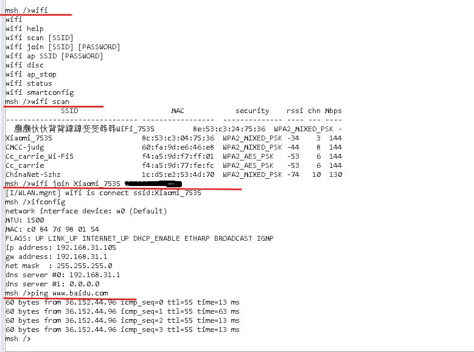

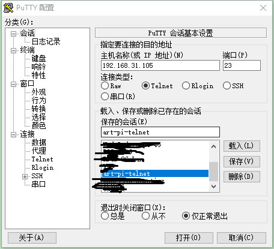

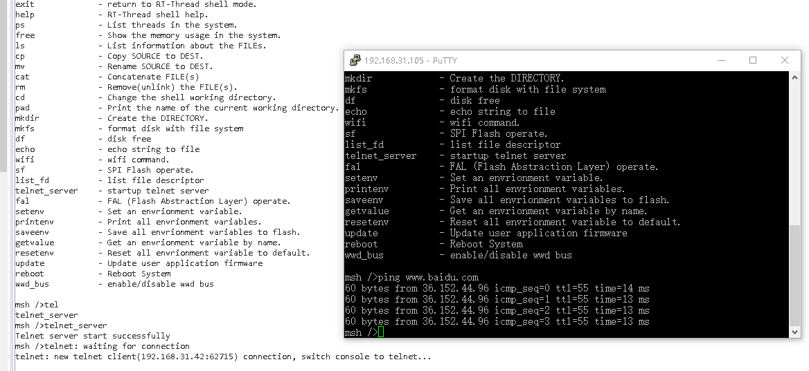

顺利与 telnet 服务器连接运行使用起来。
