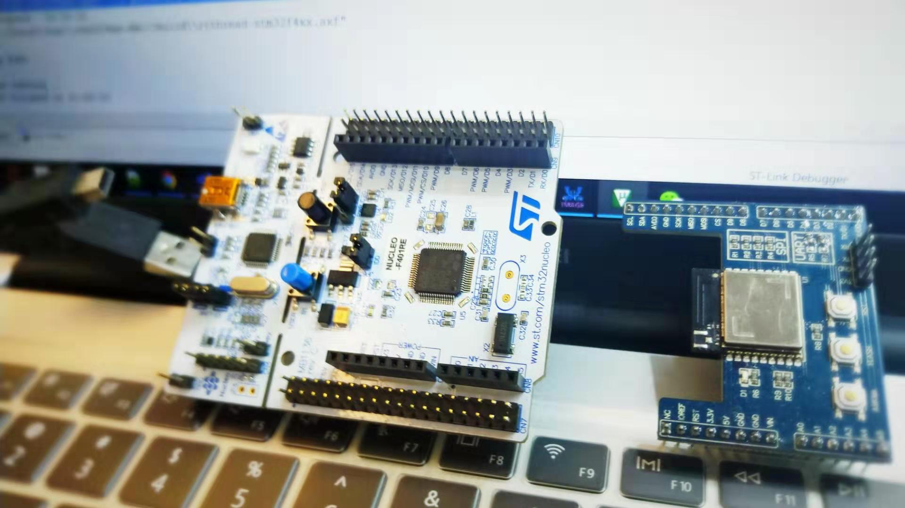
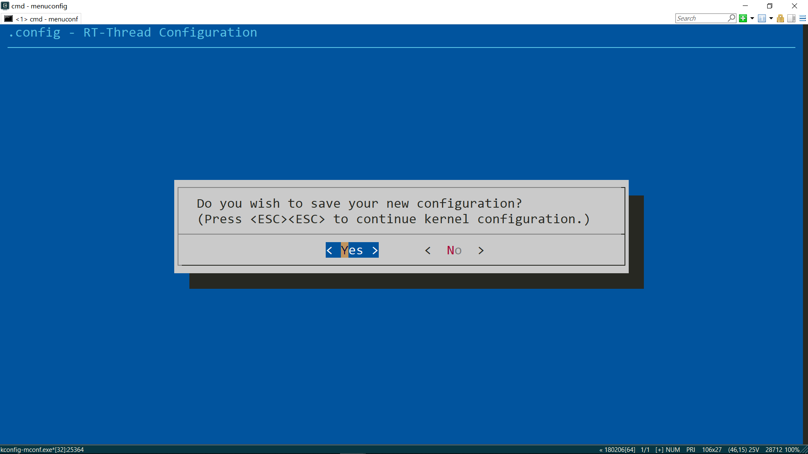

# 简介

本文使用 STM32 Nucleo 系列开发板连接 RW007 WiFi 模块，通过运行 RT-Thread 操作系统，让开发板轻松愉快联网。

## STM32F401 Nucleo-64

STM32 Nucleo-64 是 ST 官方推出的开发板，依据搭载的 STM32 芯片型号不同（皆为 LQFP64 封装），分为众多版本，本文所使用的是带 STM32F401RE 芯片的板子 —— `STM32F401 Nucleo-64`作为本文的示例，使用其他型号的板子也可以参考本文的方法进行操作，通过 RW007 WIFI 模块方便快速联网。


### 主要特性

* STM32F401RET6 64 脚 MCU
* ARM Cortex-M4 内核，84MHz 主频
* 512KB Flash, 96KB SRAM 存储容量
* Arduino Uno 和 ST morpho 两类扩展接口
* 板载 ST-LINK/V2-1 调试编程器、USB 调试串口

Nucleo 上的 Arduino 接口能让开发板与 WiFi 模块「无缝衔接」，值得一提的是，这款开发板还自带了 ST-LINK 和 USB 串口，这就意味着：只需要一根 Mini-USB 线，就能完成开发和调试工作。

快速入门：[Getting started with STM32 Nucleo board software development tools](https://www.st.com/resource/en/user_manual/dm00105928.pdf)

原理图下载：[STM32 Nucleo (64 pins) schematics](https://www.st.com/resource/en/schematic_pack/nucleo_64pins_sch.zip)

*更多相关信息资料见 ST 官网详情页：[STM32 Nucleo-64 development board with STM32F401RE MCU](https://www.st.com/zh/evaluation-tools/nucleo-f401re.html)*

## RW007

RW007 是由上海睿赛德电子科技有限公司开发的高速 WiFi 模块，使用 SPI 与主机通信 ，支持 IEEE 802.11b/g/n 网络、 WEP/WPA/WPA2 加密方式和 STA 和 AP 模式。


### 主要特性

* 高性能 MCU
* 使用 SPI 通信方式
* SPI 时钟高达 30Mbps
* SPI 模式下有效以太网带宽高达上传 1MBytes/s，下载 1MBytes/s
* 支持 WiFi+BLE 主从机功能
* BLE 主机功能可同时连接多个 BLE 设备
* WiFi 支持 STA+AP 模式
* 支持微信小程序 BLE 快速配网
* 支持断网快速回连
* 内置 Bootloader，支持 OTA 固件升级、安全固件功能
* 支持批量远程升级，方便运维管理

*更多相关信息资料见 RW007 介绍页面：[睿赛德科技推出高速Wi-Fi模块RW007：内置RT-Thread物联网操作系统](https://mp.weixin.qq.com/s/HYHoMnOhzad2m6IBS2Z-Qg)*

由睿赛德推出的 WiFi 模块，可以说是 RT-Thread 的「亲儿子」了，操作系统原生支持，相应的网络组件、WLAN 框架都能完美兼容，在跑 RTT 的板子上使用 RW007，几乎不需要过多配置，即插即用式的使用体验，大大减轻了嵌入式开发者的工作量。

# 准备工作

在把 RW007 畅快跑起来之前，以下准备工作必不可少，你将需要：

1. STM32 Nucleo-64 开发板（或其他支持 RTT 的板子）
2. RW007 WiFi 模块
3. Mini-USB 连接线（连接开发板与电脑）
4. ENV 编译构建环境（[安装使用说明](https://www.rt-thread.org/document/site/programming-manual/env/env/)）
5. 开发常用软件（git、Keil5、串口调试等）
6. 一颗爱折腾的心




# 开始上路

RT-Thread 包含了 RW007 的软件包，用户无需自己编写驱动程序，下面以 SPI 模式（断开模块上 UART 的电阻 R5 和 R7）为例，介绍如何在 STM32F401 Nucleo-64 上驱动 RW007 模块，并完成 AP 扫描、连接等基本 WiFi 功能。

## 硬件连接

得益于 Nucleo 上的 Arduino 接口，只需把 RW007 往开发板上一插，即可完成了两者的硬件连接。显然，其他带 Arduino 接口的开发板也能直接插，就是这么简单粗暴……


电路连接示意图如下：


各 IO 接口与功能之间的对应关系表：

| STM32 引脚名  | 封装管脚序号  | Arduino 接口序号  | 功能      |
|--------------|--------------|------------------|-----------|
| PA5          | 5            | D13              | BOOT0/CLK |
| PA6          | 6            | D12              | MISO      |
| PA7          | 7            | D11              | MOSI      |
| PB6          | 22           | D10              | BOOT1/CS  |
| PC7          | 39           | D9               | INT/BUSY  |
| PA9          | 9            | D8               | RESET     |

**特别注意！！！**

**关于pin 序号规则，与旧 bsp 使用封装管脚序号不同，在新的 stm32 bsp 框架中，统一采用顺序编号的方式，对 GPIO 驱动进行管理，移植旧程序时要留意。**

pin 序号与引脚名对应关系如下表：

| STM32 引脚名  | 管脚序号 pin |
|--------------|--------------|
| PA0 - PA15   | 0 - 15       |
| PB0 - PB15   | 16 - 31      |
| PC0 - PC15   | 32 - 47      |
| PD0 - ...    | 48 - ...     |

*在 [bsp/stm32/libraries/HAL_Drivers/drv_gpio.c](https://github.com/RT-Thread/rt-thread/blob/master/bsp/stm32/libraries/HAL_Drivers/drv_gpio.c) 的 `pins[]` 数组中，能清除看到 pinmap 关系。*

## STM32 bsp 配置（Menuconfig）

### 步骤一：下载 RT-Thread SDK 

* Github 链接：[RT-Thread/rt-thread: RT-Thread is an open source IoT operating system from China.](https://github.com/RT-Thread/rt-thread)
* Gitee 链接：[RT-Thread/rt-thread: RT-Thread is an open source IoT operating system from China.](https://gitee.com/rtthread/rt-thread)

打开 `rt-thread\bsp\stm32` 目录，能看到 RT-Thread 所支持的开发板型号，把 RT-Thread 在 STM32 上跑起来并不是一件难事，但在编译内核组件之前，要先对 bsp 进行简单配置（别慌，通过 Menuconfig 图形化界面即可完成）。

本次实验所使用的 bsp 为 `stm32f401-st-nucleo`，Github 仓库链接：[rt-thread/bsp/stm32/stm32f401-st-nucleo at master · RT-Thread/rt-thread](https://github.com/RT-Thread/rt-thread/bsp/stm32/stm32f401-st-nucleo), Gitee 仓库链接:[rt-thread/bsp/stm32/stm32f401-st-nucleo at master · RT-Thread/rt-thread](https://gitee.com/rtthread/rt-thread/tree/gitee_master/bsp/stm32/stm32f401-st-nucleo).
从 RT-Thread SDK 中分离 stm32f401-st-nucleo 分离 BSP 出来。
进入 `rt-thread\bsp\stm32\stm32f401-st-nucleo` 文件夹，右键打开 ENV 窗口（前提是已在 windows 下搭好 ENV 环境），输入 `scons --dist`命令。


到此可以把分离出来的 BSP 拷贝到任意的目录中，进行项目的开发。

### 步骤二 通过 CubeMX 配置 SPI 初始化程序

1. 查看对应的引脚：


2.引脚列表

| STM32 引脚名  | 封装管脚序号  | Arduino 接口序号  | 功能      |
|--------------|--------------|------------------|-----------|
| PA5          | 5            | D13              | BOOT0/CLK |
| PA6          | 6            | D12              | MISO      |
| PA7          | 7            | D11              | MOSI      |
| PB6          | 22           | D10              | BOOT1/CS  |
| PC7          | 39           | D9               | INT/BUSY  |
| PA9          | 9            | D8               | RESET     |

3. CubeMX 配置 SPI

   一般 STM32 系列的引脚分配可以通过对应 BSP 中`board\CubeMX_Config`目录下的`CubeMX_Config.ioc`打开 CubeMX 工程，进行配置 SPI1，并生成代码，保存退出即可 。

   

   

   

   

   

### 步骤三 ：通过`menuconfig`配置 RW007 软件包

进入 `rt-thread\bsp\stm32\stm32f401-st-nucleo` 文件夹，右键打开 ENV 窗口（前提是已在 Windows 下搭好 ENV 环境），输入 `pkgs --upgrade` 更新 ENV 和软件包，再输入 `menuconfig` 进行系统配置：


附 Menuconfig 常用操作按键：

| 按键  |    ↑↓   |   ←→    | Enter |   空格    |  Esc |
|------ |---------|---------|-------|----------|------|
| 功能  | 列表选择 | 菜单选择 | 确认  | 选中/取消 | 后退 |

**1. 配置开启 SPI 外设**

开发板与模块的通讯依赖 SPI 设备，在 bsp 中已经实现了 SPI 驱动，只需在设置中打开即可使用。 进入 `Hardware Drivers Config --->` 下的 `On-chip Peripheral Drivers`，勾选 `Enable SPI BUS --->` 选项，并按回车键进入，进一步选中 `Enable SPI1 BUS`，完成配置：


如果在 bsp 中的 menuconfig 中没有对应 `spi`的配置，可以通过修改 `Kconfig`文件增加对应`spi`的配置。 `Kconfig` 的路径在`board/Kconfig` ，如下面是添加 `SPI1`的配置。


**2. 配置 RW007 软件包**

RT-Thread 通过软件包的形式，对 RW007 模块提供配套驱动支持，系统默认选项不包含软件包，用户需手动开启：通过 `Esc` 键回到 Menuconfig 主界面，依次进入 `RT-Thread online packages  ---> `、`IoT - internet of things  --->`、`Wi-Fi  --->`，勾选 `rw007: SPI WIFI rw007 driver  --->` 选项：


*RW007 软件包 Github 仓库链接：[RT-Thread-packages/rw007: RW007 (SPI Wi-Fi module) driver for RT-Thread](https://github.com/RT-Thread-packages/rw007)*

紧接着按下 `Enter` 键进一步设置软件包参数，完成 SPI 总线和 IO 的配置，更改总线设备名称 `RW007 BUS NAME` 为 `spi1`：


然后配置 SPI 控制 IO，各管脚号依次按下表填入：

| 引脚号 | 功能                                  |
|-------|---------------------------------------|
| 22    | CS pin index                          |
| 5     | BOOT0 pin index (same as spi clk pin) |
| 22    | BOOT1 pin index (same as spi cs pin)  |
| 39    | INT/BUSY pin index                    |
| 9     | RESET pin index                       |


最高 SPI 速率配置：**从 v2.0.1 版本起**，用户可以根据实际使用情况提高或降低总线速率（默认为 30MHz），为满足对通讯稳定性和传输速度的需求，建议更新至最新版本，对应的 Menuconfig 配置项如下：


**3. 开启 WiFi 框架**

RW007 驱动使用了 WLAN 相关的接口，按以下选项路径打开 WiFi 框架：`RT-Thread Components  --->`、`Device Drivers  --->`、`Using WiFi  --->`，勾选 `Using Wi-Fi framework`：


**4. 保存 Menuconfig 配置**

完成了上面的 3 步，bsp 配置算大功告成了，但最最重要的一步不能漏 —— 保存 Menuconfig 配置：直接一路狂按 `Esc` 键退出，在保存提示窗口中选择 `Yes` 确认即可：



## 编译烧写固件

**1. 更新本地软件包**

根据 RT-Thread 的软件包机制，在 Menucofnig 选中了软件包后，相关代码文件并未添加到工程中。在 ENV 终端输入 `pkgs --update` 命令，便能从服务器下载所选软件包，更新到本地目录：


**2. 生成 MDK5 项目文件**

使用 Keil IDE 可以十分方便对 STM32 程序编译和烧录，在 ENV 终端输入 `scons --target=mdk5 -s`，生成 Keil5 工程文件：


**3. 编译、下载工程**

使用工具栏的 `Build` 按钮编译工程，出现 `0 Error(s)` 表示编译成功，将开发板连接电脑，再点击 `Download` 按钮下载固件到开发板，完成上面所有步骤后，接下来就是见证奇迹的时刻了。

## 运行、测试模块功能

下载完程序便能自动复位运行，打开串口工具（推荐使用 XShell 等交互型终端），设置参数为 `115200 8-1-N`。若系统启动正常，且开发板与模块间的通讯也没有问题，会看到如下初始化打印信息：

```
 \ | /
- RT -     Thread Operating System
 / | \     4.0.3 build Mar  5 2021
 2006 - 2020 Copyright by rt-thread team
lwIP-2.0.2 initialized!
msh >
[I/WLAN.dev] wlan init success
[I/WLAN.lwip] eth device init ok name:w0
[I/WLAN.dev] wlan init success
[I/WLAN.lwip] eth device init ok name:w1

rw007  sn: [rw0078c47c8000000]
rw007 ver: [2.0.5-c30c4e84-77821]


msh >
```

使用 `wifi scan` 命令扫描周边热点、`wifi join ssid password` 命令连接路由、`ifconfig` 命令查看网络配置，验证模块功能：


# 常见问题与解决方法

* **Menuconfig 中没看到 rw007 pkg？**

    ENV 和 包索引不是最新，执行 `pkgs --upgrade` 命令更新软件包源。

* **Keil 编译错误？**

    是否已经把软件包替换为 RW007 适配版本，新老版本 stm32 bsp 中 spi 接口稍有差异。

* **运行后串口无输出？**

    1. 检查开发板与电脑的连接是否正常
    2. 检查串口工具参数配置，应为 `115200, 8, 1, None`

* **运行出现 `wspi` device not found**

    确认 RW007 软件包中总线的设备名为 `spi1`，否则会导致设备挂载失败。


# 使用 `RT-Thread Studio IDE` 体验 `RW007` 开发

## 准备工作

在使用 RT-Thread Studio IDE 体验 RW007 开发前需要准备以下软件和板子：

1. STM32 Nucleo-64 开发板，这里使用 STM32F411-ST-Nucleo 开发板进行演示（可以使用其他支持 RTT 的板子）

2. RW007 WiFi 模块

3. Mini-USB 连接线(连接开发板和电脑)

4. RT-Thread Studio IDE 软件

## 开始操作

使用 RT-Thread Studio IDE 进行开发，用户只需要简单配置相关功能，就能实现对应的效果，接下来将介绍如何使用 RT-Thread Studio IDE 进行 STM32F411-ST-NUCLEO 开发板上驱动 RW007 模块,并完成 AP 扫描、WiFi 联网测试等功能。

### 创建 RT-Thread 工程

使用 RT-Thread Studio IDE 创建 RT-Thread 项目工程，先点击菜单栏上的文件选项，然后选择新建，再选择 RT-Thread 项目，就会提示需要基于芯片还是基于开发板，进行创建项目。


这里需要选择基于开发板进行创建项目工程，由于没有 STM32F411 NUCLEO 开发板资源包，需要点击添加更多，添加 STM32F411 NUCLEO 开发板的资源包，详细步骤入下图。

### 添加 STM32F411-ST-NUCLEO 开发板资源包


### 创建 Test_RW007 项目工程

通过上面的步骤，已经正确添加了 STM32F411 NUCLEO 开发板的资源包，下面进行创 Test_RW007 的项目工程。也是重复前面的步骤，先点击菜单栏上的文件选项，然后选择新建，再选择 RT-Thread 项目，就会提示需要基于芯片还是基于开发板，进行创建项目，需要选择基于开发板进行创建项目工程，并选择 STM32F411-ST-NUCLEO 的型号，输入创建的工程名，最后点击完成，就完成了创建工程。


然后，等待软件执行创建工程的操作，创建工程完成后，再项目资源管理器可以看到创建的工程，并且会在控制台输出工程创建完成的信息。


### Test_RW007 项目工程软件配置

根据前面的步骤，创建了基本的 STM32F411-ST-NUCLEO 的工程，下面将为如何把 RW007 EVB 和 STM32F411-NUCLEO 开发板进行硬件连接和软件工程配置进行详细描述。

#### 硬件连接

说明：由于 STM32F411-ST-NUCLEO 开发板的 Arduino 接口和 STM32F401-ST-NUCLEO 的 Arduino 接口是相同的，故可参考前文的引脚配置说明。


整理 IO 引脚 对应表

各 IO 接口与功能之间的对应关系表：

| STM32 引脚名 | Arduino 接口序号 | 功能      |
| ------------ | ---------------- | --------- |
| PA5          | D13              | BOOT0/CLK |
| PA6          | D12              | MISO      |
| PA7          | D11              | MOSI      |
| PB6          | D10              | BOOT1/CS  |
| PC7          | D9               | INT/BUSY  |
| PA9          | D8               | RESET     |

#### CubeMX 配置工程

需要使用 CubeMX 进行软件配置对应的 IO 引脚功能，由于默认 `PA6` 和 `PA7` 引脚没有被配置为 `SPI1` 的功能引脚，所以需要分别把 `PA6` 配置为 `SPI1_MISO`、`PA7` 配置为`SPI1_MOSI`功能引脚，然后重新生成配置代码。具体操作如下图。


#### 查看 RW007 对应引脚编号

在使用 RW007 模块，除了需要配置 SPI 功能引脚，还需要配置对应的 `CS`、`INT/BUSY`、`RESET` 引脚，根据前面的电路图和 `IO` 引脚对应表，需要在 `drv_gpio.c` 中找到对应的引脚编号，具体操作如下图。


各 IO 接口与功能之间的对应关系表：

| STM32 引脚名 | 封装管脚序号 | Arduino 接口序号 | 功能      |
| ------------ | ------------ | ---------------- | --------- |
| PA5          | 5            | D13              | BOOT0/CLK |
| PA6          | 6            | D12              | MISO      |
| PA7          | 7            | D11              | MOSI      |
| PB6          | 22           | D10              | BOOT1/CS  |
| PC7          | 39           | D9               | INT/BUSY  |
| PA9          | 9            | D8               | RESET     |

#### 工程配置开启 SPI1 功能

使用 RT-Thread Studio IDE 配置对应的驱动和软件包，可以通过图形化进行配置，方便用户操作，具体的驱动配置操作步骤如下图。


#### RW007 软件包配置和下载软件包

在使用 RW007 模块的网络功能，需要配置 RW007 软件包和使能 `Wi-Fi` 框架。

注意： RW007 软件包需要选择 2.0.1 以上的版本，模块才能正常工作,并且配置 RW007 BUS NAME 为 `spi1`


#### 配置开启 Wi-Fi 框架

***注意：如果不开启 `Wi-Fi`框架会编译报错***


#### 屏蔽 `main.c` 文件中关于 `LED0_PIN` 操作

由于默认工程中的 `LED` 的 `IO` 引脚 `PA5` 刚好是 `SPI1` 的功能引脚，两者冲突了，需要屏蔽关于 `LED0_PIN` 的操作语句。


### 构建工程和烧录程序

按照上面的步骤操作后，可以构建工程和烧录程序。


### 打开串口终端测试 WiFi 功能

烧录程序后，可以使用 RT-Thread Studio IDE 配套的终端工具可以方便地调试。


#### WiFi 功能测试


