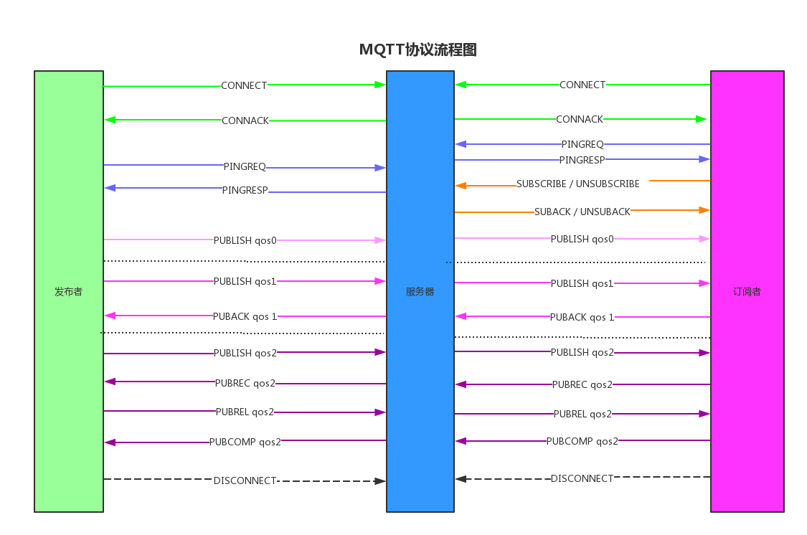

# **1. MQTT 背景应用**

**MQTT**是机器对机器(`M2M`)/物联网(`IoT`)连接协议，英文全名为"**Message Queuing Telemetry Transport**"，中文译名为“**消息队列遥测传输**”协议。它是专为受限设备和低带宽、高延迟或不可靠的网络而设计的，是一种基于`发布`/`订阅`（`publish`/`subscribe`）模式的"轻量级"通讯协议，该协议构建于`TCP/IP`协议之上，由IBM在1999年发布。目前，该协议的最新版本为V5.0，常用版本为V3.1.1。

举例说明MQTT的实际应用场景。如图1 - 1，很好地展示出了一个基于MQTT协议的通信网络系统案例：


<center>图1 - 1	基于MQTT的通信案例</center>

名词释义：

- **Publisher** - 发布者

- **Broker** - 代理（服务端）

- **Subscriber** - 订阅者

- **Topic** - 发布/订阅的主题

流程概述：上图中，各类传感器的角色是发布者(Publisher)。譬如，湿度传感器和温度传感器分别向接入的MQTT Broker中（周期性）发布两个主题名为"Moisture"（湿度）和"Temp"（温度）的主题；当然，伴随着这两个主题共同发布的，还有湿度值和温度值，被称为“消息”。几个客户端的角色是订阅者Subscriber，如手机APP从Broker订阅了"Temp"主题，便能在手机上获取到温度传感器Publish在Broker中的温度值。

补充说明：
1. 发布者和订阅者的角色并非是固定的，而是相对的。发布者也可以同时从Broker订阅主题，同理，订阅者也可以向Broker发布主题；即发布者可以是订阅者，订阅者也可以是发布者。
2. Broker可以是在线的云服务器，也可以是本地搭建的局域网客户端；按照需求，实际上Broker自身也会包含一些订阅/发布主题的功能。

更多参考资料，请前往[MQTT中文网](http://mqtt.p2hp.com/)或[MQTT官网](https://mqtt.org/)查阅。

------

学习目标：

1. 了解MQTT协议及其报文格式
2. 理解uMQTT和LWIP的关系
3. 掌握uMQTT的实现原理

# **2. MQTT 报文结构**

任何通用/私有协议都是由事先规定好的、按某种规则约束的各种报文数据包组成的，MQTT也不例外。在MQTT协议中，所有的数据包都是由最多三部分组成：`固定header` + `可变header` + `有效载荷`，如表2 - 1：

| **[Fixed header](#2.1. Fixed header)（at least 2 Bytes）** | [Variable header](#2.2. Variable header) | [Payload](#2.3. Payload*)  |
| ---------------------------------------------------------- | ---------------------------------------- | :------------------------- |
| **存在于所有MQTT控制数据包中**                             | 存在于部分MQTT控制数据包中               | 存在于部分MQTT控制数据包中 |
| Bytes[0]    Bytes[1]...                                    | ... ...                                  | ...Bytes[N-1]    Bytes[N]  |
<center>表2 - 1	MQTT的数据包组成格式</center>

其中，固定Header是必需的，可变Header和有效载荷是非必需的。因此，理论上来说，MQTT协议数据包的最小长度为2个字节，造就了它本身占用的额外资源消耗最小化特色。接下来将以MQTT3.1.1为例，来介绍各部分报文的详细格式（详细用法见 [**4. uMQTT的实现**](#4. uMQTT的实现)）。

## **2.1. Fixed header**

<table>
    <tr>
        <td align="center"><B>Bit</B></td>
        <td align="center"><B>7</B></td>
        <td align="center"><B>6</B></td>
        <td align="center"><B>5</B></td>
        <td align="center"><B>4</B></td>
        <td align="center"><B>3</B></td>
        <td align="center"><B>2</B></td>
        <td align="center"><B>1</B></td>
        <td align="center"><B>0</B></td>
    </tr>
    <tr>
        <td>Bytes[0]</td>
        <td colspan="4">MQTT控制报文类型(MQTT Control Packet type)</td>
        <td colspan="4">MQTT控制报文类型标志位(Flags specific to each MQTT Control Packet type)</td>
    </tr>
    <tr>
        <td>Bytes[1]...</td>
        <td colspan="8", align="center">剩余长度(Remaining Length)</td>
</table>
<center>表2 - 2 Fixed header format</center>

固定Header由至少两个字节组成，如表2 - 2。第一个字节的高4位描述了当前数据报文的类型([MQTT Control Packet type](#2.1.1 MQTT Control Packet type))，见下表2 - 3；低四位定义了与报文类型相关的标志位([Flags specific to each MQTT Control Packet type](#2.1.2 Flags specific to each MQTT Control Packet type))，见下文表2 - 4；第二个及之后的至多4个字节代表着剩余数据的字节长度([Remaining Length](#2.1.3 Remaining Length))，见下文表2 - 5。

### 2.1.1 MQTT Control Packet type

|  **名称**   | **值** | **Bytes[0]** |              **描述**              |
| :---------: | :----: | :----------: | :--------------------------------: |
|  Reserved   |   0    |     0x0*     |               预留位               |
|   CONNECT   |   1    |     0x1*     |           客户端请求连接           |
|   CONNACK   |   2    |     0x2*     |           服务端连接确认           |
|   PUBLISH   |   3    |     0x3*     |              发布消息              |
|   PUBACK    |   4    |     0x4*     |          发布确认（QoS1）          |
|   PUBREC    |   5    |     0x5*     | 发布收到（QoS2 - 保证交付第1部分） |
|   PUBREL    |   6    |     0x6*     | 发布释放（QoS2 - 保证交付第2部分） |
|   PUBCOMP   |   7    |     0x7*     | 发布完成（QoS2 - 保证交付第3部分） |
|  SUBSCRIBE  |   8    |     0x8*     |           客户端订阅请求           |
|   SUBACK    |   9    |     0x9*     |           服务端订阅确认           |
| UNSUBSCRIBE |   10   |     0xA*     |         客户端取消订阅请求         |
|  UNSUBACK   |   11   |     0xB*     |         服务端取消订阅确认         |
|   PINGREQ   |   12   |     0xC*     |        客户端心跳(PING)请求        |
|  PINGRESP   |   13   |     0xD*     |        服务端心跳(PING)响应        |
| DISCONNECT  |   14   |     0xE*     |         客户端即将断开连接         |
|  Reserved   |   15   |     0xF*     |               预留位               |

<center>表2 - 3 Control Packet type</center>

### 2.1.2 Flags specific to each MQTT Control Packet type

| **控制报文类型** | **Fixed header flags** | **Bit 3** | **Bit 2** | **Bit 1** | **Bit 0** |
| ---------------- | ---------------------- | --------- | --------- | --------- | --------- |
| CONNECT          | Reserved               | 0         | 0         | 0         | 0         |
| CONNACK          | Reserved               | 0         | 0         | 0         | 0         |
| PUBLISH          | Used in MQTT 3.1.1     | DUP       | QoS       | QoS       | RETAIN    |
| PUBACK           | Reserved               | 0         | 0         | 0         | 0         |
| PUBREC           | Reserved               | 0         | 0         | 0         | 0         |
| PUBREL           | Reserved               | 0         | 0         | 1         | 0         |
| PUBCOMP          | Reserved               | 0         | 0         | 0         | 0         |
| SUBSCRIBE        | Reserved               | 0         | 0         | 1         | 0         |
| SUBACK           | Reserved               | 0         | 0         | 0         | 0         |
| UNSUBSCRIBE      | Reserved               | 0         | 0         | 1         | 0         |
| UNSUBACK         | Reserved               | 0         | 0         | 0         | 0         |
| PINGREQ          | Reserved               | 0         | 0         | 0         | 0         |
| PINGRESP         | Reserved               | 0         | 0         | 0         | 0         |
| DISCONNECT       | Reserved               | 0         | 0         | 0         | 0         |

<center>表2 - 4 Control Packet Flags</center>

Fixed header中**Bytes[0]**的**bit[3..0]**包含了每个MQTT控制报文类型的特殊标识，如上表2 - 4。表中flags为“Reserved”的各标志位虽然是预留给将来版本使用的，但是在数据传输过程中必须赋值为表中的值。如果识别到了与表中不符的非法flag，接收方必须关闭网络连接。

其中，已经用在3.1.1版本中的3种标志位：

- DUP = 控制报文的重复分发标志[Duplicate]
- QoS = PUBLISH报文的服务质量等级[Quality of Service]
- RETAIN = PUBLISH报文的保留标志

### 2.1.3 Remaining Length

| **字节数** | **起**(Bytes[1], Bytes[2], Bytes[3], Bytes[4]) | **止(Bytes[1], Bytes[2], Bytes[3], Bytes[4])** |
| ---------- | ---------------------------------------------- | ---------------------------------------------- |
| 1          | 0 (0x00)                                       | 127 (0x7F)                                     |
| 2          | 128 (0x80, 0x01)                               | 16 383 (0xFF, 0x7F)                            |
| 3          | 16 384 (0x80, 0x80, 0x01)                      | 2 097 151 (0xFF, 0xFF, 0x7F)                   |
| 4          | 2 097 152 (0x80, 0x80, 0x80, 0x01)             | 268 435 455 (0xFF, 0xFF, 0xFF, 0x7F)           |

<center>表2 - 5 Remaining Length</center>

剩余长度（Remaining Length）表示当前报文剩余部分的字节数，包括可变header和有效载荷的数据。剩余长度不包括用于编码剩余长度字段本身的字节数，即不包含Fixed header的长度。

剩余长度字段使用一个变长度编码方案，如上表2 - 5：

- 小于128的值，使用单字节编码。
- 更大的值按下面的方式处理——低7位有效位用于编码数据，最高有效位用于指示是否有更多的字节。因此每个字节可以编码128个数值和一个**延续位（continuation bit）**。延续位仅有指示进位功能，在计算长度时不能被计算在内。
- 该字段最多4个字节。

## **2.2. Variable header**

某些MQTT控制报文包含一个可变header部分，它位于固定header和有效载荷之间。可变header的内容根据控制报文类型([MQTT Control Packet type](#2.1.1 MQTT Control Packet type))的不同而不同；譬如**CONNECT**类型的报文，它的可变header含有“协议名称（Protocol Name）”、”协议等级（Protocol Level）“、”连接标志（Connect Flags）“和”保活间隔（Keep Alive）“四个字段域。其余可变header，详见[MQTT报文格式](#3. MQTT报文格式)。

虽然有各种不同的可变header内容，但是报文标识符（Packet Identifier）是一个重要的通用字段，且具有`唯一性`。见表2 - 6：

| **字节** | **值**         |
| -------- | -------------- |
| byte 1   | 报文标识符 MSB |
| byte 2   | 报文标识符 LSB |

<center>表2 - 6 Packet Identifier</center>

这个通用字段存在于多种类型的报文里，见表2 - 7：

| **报文类型** | **是否存在报文标识符** |
| ------------ | ---------------------- |
| CONNECT      | NO                     |
| CONNACK      | NO                     |
| PUBLISH      | YES (If QoS > 0)       |
| PUBACK       | YES                    |
| PUBREC       | YES                    |
| PUBREL       | YES                    |
| PUBCOMP      | YES                    |
| SUBSCRIBE    | YES                    |
| SUBACK       | YES                    |
| UNSUBSCRIBE  | YES                    |
| UNSUBACK     | YES                    |
| PINGREQ      | NO                     |
| PINGRESP     | NO                     |
| DISCONNECT   | NO                     |

<center>表2 - 7 Control Packets that contain a Packet Identifier</center>

报文标识符（Packet Identifier）的规则如下：

- SUBSCRIBE、UNSUBSCRIBE、和PUBLISH（在QoS>0的情况下）控制数据包必须包含**非零16位**报文标识符。
- 每次客户端发送这些类型之一的新数据包时，它必须为其分配一个当前未使用的报文标识符。
- 如果一个客户端重新发送了某个特定的控制数据包，那么它必须在该数据包的后续重发中使用与之相同的报文标识符。在客户端处理了该特定控制数据包相对应的ACK数据包之后，该报文标识符得以重新使用。
  - QoS 1的PUBLISH包，PUBACK与之对应。
  - QoS 2的PUBLISH包，PUBCOMP与之对应。
  - 对于SUBSCRIBE 和 UNSUBSCRIBE，由SUBACK和UNSUBACK与之一一对应。
- 当服务端发送QoS>0的PUBLISH报文时，也应遵守上述规则。
- QoS=0的PUBLISH报文，**不允许**包含报文标识符。
- PUBACK，PUBREC，PUBREL包的报文标识符，必须和PUBLISH包最初发送的值相同。
- 类似地，SUBACK和UNSUBACK包，必须与SUBSCRIBE和UNSUBSCRIBE包中的报文标识符相同。

客户端和服务端相互独立地分配报文标识符。因此，客户端-服务端组合使用相同的报文标识符，可以实现并发信息交换。

## **2.3. Payload**

某些MQTT控制报文在数据包的最后部分包含有效载荷，详情见[MQTT报文格式](#3. MQTT报文格式)。例如，对于PUBLISH报文来说，有效载荷就可以是应用消息。表2 - 8列出了各种需要有效载荷的控制报文。

| **控制报文** | **有效载荷** |
| :----------- | :----------- |
| CONNECT      | Required     |
| CONNACK      | None         |
| PUBLISH      | Optional     |
| PUBACK       | None         |
| PUBREC       | None         |
| PUBREL       | None         |
| PUBCOMP      | None         |
| SUBSCRIBE    | Required     |
| SUBACK       | Required     |
| UNSUBSCRIBE  | Required     |
| UNSUBACK     | None         |
| PINGREQ      | None         |
| PINGRESP     | None         |
| DISCONNECT   | None         |

<center>表2 - 8 Control Packets that contain a Payload</center>

# **3. MQTT报文格式**

由于Variable header和Payload的格式较多，本文不再赘述，详情可参考以下链接：

- [**MQTT Version 3.1.1** | 3   MQTT Control Packets](http://docs.oasis-open.org/mqtt/mqtt/v3.1.1/os/mqtt-v3.1.1-os.html#_Toc398718027)
- [MQTT 3.1.1 协议 中文版 | MQTT中文网](http://mqtt.p2hp.com/mqtt311)
- [第三章 MQTT控制报文 MQTT Control Packets](https://github.com/mcxiaoke/mqtt/blob/master/mqtt/03-ControlPackets.md)
- [第三章 – MQTT控制报文](https://mcxiaoke.gitbook.io/mqtt/03-controlpackets)

# **4. uMQTT的实现**

uMQTT 软件包是 RT-Thread 自主研发的，基于 MQTT 3.1.1 协议的客户端实现，它提供了设备与 MQTT Broker 通讯的基本功能。GitHub主页[点击这里](https://github.com/RT-Thread-packages/umqtt)，Gitee主页[点这里](https://gitee.com/RT-Thread-Mirror/umqtt)。

uMQTT 软件包功能如下:  

* 实现基础的连接、订阅、发布功能;  
* 具备多重心跳保活，设备重连机制，保证 mqtt 在线状态，适应复杂情况; 
* 支持 QoS=0, QoS=1, QoS=2 三种发送信息质量;  
* 支持多客户端使用;
* 用户端接口简便，留有多种对外回调函数;
* 支持多种技术参数可配置，易上手，便于产品化开发；
* 功能强大，资源占用率低，支持功能可裁剪。

## **4.1. uMQTT的结构框架**

uMQTT 软件包主要用于在嵌入式设备上实现 MQTT 协议，软件包的主要工作基于 MQTT 协议实现。软件包结构框图如图4 - 1:


<center>图4 - 1	uMQTT结构框图</center>

软件包实现过程中主要做了:

1. 根据 MQTT 3.1.1 协议规定，进行软件包数据协议的封包解包；
2. 传输层函数适配对接 SAL （Socket Abstraction Layer）层；
3. uMQTT 客户端层，根据协议包层和传输层编写符合应用层的接口。实现基础连接、断连、订阅、取消订阅、发布消息等功能。支持 QoS0/1/2 三种发送信息质量。利用 uplink timer 定时器，实现多重心跳保活机制和设备重连机制，增加设备在线稳定性，适应复杂情况。

## **4.2. uMQTT客户端**

由图1 - 1可知，想要连接Broker，嵌入式设备需要作为MQTT协议中的客户端来使用。

在uMQTT组件的`umqtt.h`文件中，抽象出了初始化客户端用到的MQTT配置信息，组成对应的数据结构体：

```C
struct umqtt_info
{
    rt_size_t send_size, recv_size;                     /* 收发缓冲区大小 */ 
    const char *uri;                                    /* 完整的URI (包含: URI + URN) */ 
    const char *client_id;                              /* 客户端ID */ 
    const char *lwt_topic;                              /* 遗嘱主题 */
    const char *lwt_message;                            /* 遗嘱消息 */ 
    const char *user_name;                              /* 用户名 */ 
    const char *password;                               /* 密码 */ 
    enum umqtt_qos lwt_qos;                             /* 遗嘱QoS */
    umqtt_subscribe_cb lwt_cb;                          /* 遗嘱回调函数 */
    rt_uint8_t reconnect_max_num;                       /* 最大重连次数 */ 
    rt_uint32_t reconnect_interval;                     /* 最大重连时间间隔 */ 
    rt_uint8_t keepalive_max_num;                       /* 最大保活次数 */ 
    rt_uint32_t keepalive_interval;                     /* 最大保活时间间隔 */ 
    rt_uint32_t recv_time_ms;                           /* 接收超时时间 */ 
    rt_uint32_t connect_time;                           /* 连接超时时间 */ 
    rt_uint32_t send_timeout;                           /* 上行(发布/订阅/取消订阅)超时时间 */ 
    rt_uint32_t thread_stack_size;                      /* 线程栈大小 */ 
    rt_uint8_t thread_priority;                         /* 线程优先级 */ 
#ifdef PKG_UMQTT_TEST_SHORT_KEEPALIVE_TIME
    rt_uint16_t connect_keepalive_sec;                  /* 连接信息，保活秒数 */    
#endif
};
```

这些配置信息一般在创建uMQTT客户端之前需要自行填写指定，譬如Broker的”URI“、”用户名“或”密码“之类的关键信息。其它的非关键信息，如果没有指定，那么会在创建客户端函数`umqtt_create`中，调用`umqtt_check_def_info`函数来赋值为默认值：

```C
static void umqtt_check_def_info(struct umqtt_info *info)
{
    if (info) 
    {
        if (info->send_size == 0) { info->send_size = PKG_UMQTT_INFO_DEF_SENDSIZE; }
        if (info->recv_size == 0) { info->recv_size = PKG_UMQTT_INFO_DEF_RECVSIZE; }
        if (info->reconnect_max_num == 0) { info->reconnect_max_num = PKG_UMQTT_INFO_DEF_RECONNECT_MAX_NUM; }
        if (info->reconnect_interval == 0) { info->reconnect_interval = PKG_UMQTT_INFO_DEF_RECONNECT_INTERVAL; }
        if (info->keepalive_max_num == 0) { info->keepalive_max_num = PKG_UMQTT_INFO_DEF_KEEPALIVE_MAX_NUM; }
        if (info->keepalive_interval == 0) { info->keepalive_interval = PKG_UMQTT_INFO_DEF_HEARTBEAT_INTERVAL; }
        if (info->connect_time == 0) { info->connect_time = PKG_UMQTT_INFO_DEF_CONNECT_TIMEOUT; }
        if (info->recv_time_ms == 0) { info->recv_time_ms = PKG_UMQTT_INFO_DEF_RECV_TIMEOUT_MS; }
        if (info->send_timeout == 0) { info->send_timeout = PKG_UMQTT_INFO_DEF_SEND_TIMEOUT; }
        if (info->thread_stack_size == 0) { info->thread_stack_size = PKG_UMQTT_INFO_DEF_THREAD_STACK_SIZE; }
        if (info->thread_priority == 0) { info->thread_priority = PKG_UMQTT_INFO_DEF_THREAD_PRIORITY; }
    }
}
```

然而只有上述信息，是无法运行起来一个MQTT客户端的。故在`umqtt.c`中，含有`umqtt_info`的`umqtt_client`结构体列出了初始化客户端用到的所有数据：

```C
struct umqtt_client
{
    int sock;                                                   /* 套接字 */ 
    enum umqtt_client_state connect_state;                      /* mqtt客户端状态 */ 

    struct umqtt_info mqtt_info;                                /* mqtt用户配置信息 */ 
    rt_uint8_t reconnect_count;                                 /* mqtt客户端重连计数 */ 
    rt_uint8_t keepalive_count;                                 /* mqtt保活计数 */ 
    rt_uint32_t pingreq_last_tick;                              /* mqtt的PING请求上一次滴答值 */
    rt_uint32_t uplink_next_tick;                               /* 上行连接的下一次滴答值 */ 
    rt_uint32_t uplink_last_tick;                               /* 上行连接的上一次滴答值 */ 
    rt_uint32_t reconnect_next_tick;                            /* 客户端断开重连时的下一次滴答值 */ 
    rt_uint32_t reconnect_last_tick;                            /* 客户端断开重连时的上一次滴答值 */ 

    rt_uint8_t *send_buf, *recv_buf;                            /* 收发缓冲区指针 */ 
    rt_size_t send_len, recv_len;                               /* 收发数据的长度 */ 

    rt_uint16_t packet_id;                                      /* mqtt报文标识符 */ 

    rt_mutex_t lock_client;                                     /* mqtt客户端互斥锁 */ 
    rt_mq_t msg_queue;                                          /* mqtt客户端消息队列 */ 

    rt_timer_t uplink_timer;                                    /* mqtt保活重连定时器 */ 

    int sub_recv_list_len;                                      /* 接收订阅信息的链表长度 */ 
    rt_list_t sub_recv_list;                                    /* 订阅消息的链表头 */ 

    rt_list_t qos2_msg_list;                                    /* QoS2的消息链表 */
    struct umqtt_pubrec_msg pubrec_msg[PKG_UMQTT_QOS2_QUE_MAX]; /* 发布收到消息数组(QoS=2) */                   

    umqtt_user_callback user_handler;                           /* 用户句柄 */ 

    void *user_data;                                            /* 用户数据 */ 
    rt_thread_t task_handle;                                    /* umqtt任务线程 */ 

    rt_list_t list;                                             /* umqtt链表头 */ 
};
```

上述部分成员的结构体和枚举类型定义，可自行在`umqtt.h`文件中查看。该结构体会在创建客户端函数`umqtt_create`中，调用`umqtt_check_def_info`函数之后初始化：

1. 初始化遗嘱数据结构（如果有的话）
2. 为收发缓冲区申请内存
3. 创建互斥锁、消息队列和超时重连定时器（超时回调实现重连+保活）
4. 初始化各链表
5. 创建`umqtt_thread`——mqtt数据收发线程
6. 返回`mqtt_client`结构体地址

当第6步返回的值不为空时，即可调用`umqtt_start`函数来通过**LWIP**发送**CONNECT**报文连接Broker；连接成功后便会启动`umqtt_thread`线程，开启MQTT的通信之路了。

## **4.3. uMQTT与LWIP**

在`umqtt_start`函数中，首先会将uMQTT客户端的状态置为`UMQTT_CS_LINKING`，表示`正在连接中`。接下来会调用`umqtt_connect`函数，将本地客户端连接到Broker。

连接到Broker的过程分两步：

1. 创建**套接字**，与Broker建立链路连接
2. 发送CONNECT报文，创建MQTT协议连接

在`umqtt_connect`函数中，通过调用`umqtt_trans_connect`函数，来完成第一步：

```C
/** 
 * TCP/TLS Connection Complete for configured transport
 *
 * @param uri the input server URI address
 * @param sock the output socket
 *
 * @return <0: failed or other error
 *         =0: success
 */
int umqtt_trans_connect(const char *uri, int *sock)
{
    int _ret = 0;
    struct addrinfo *addr_res = RT_NULL;
    
    *sock = -1;
    /* 域名解析 */
    _ret = umqtt_resolve_uri(uri, &addr_res);
    if ((_ret < 0) || (addr_res == RT_NULL)) 
    {
        LOG_E("resolve uri err");
        _ret = UMQTT_FAILED;
        goto exit;
    }
	/* 创建套接字 */
    if ((*sock = socket(addr_res->ai_family, SOCK_STREAM, UMQTT_SOCKET_PROTOCOL)) < 0) 
    {
        LOG_E("create socket error!");
        _ret = UMQTT_FAILED;
        goto exit;
    }
	/* 设置套接字工作在非阻塞模式下 */
    _ret = ioctlsocket(*sock, FIONBIO, 0);
    if (_ret < 0) 
    {
        LOG_E(" iocontrol socket error!");
        _ret = UMQTT_FAILED;
        goto exit;
    }
	/* 建立连接 */
    if ((_ret = connect(*sock, addr_res->ai_addr, addr_res->ai_addrlen)) < 0) 
    {
        LOG_E(" connect err!");
        closesocket(*sock);
        *sock = -1;
        _ret = UMQTT_FAILED;
        goto exit;
    }

exit:
    if (addr_res) {
        freeaddrinfo(addr_res);
        addr_res = RT_NULL;
    }
    return _ret;
}
```

这个函数，就是uMQTT通过LWIP与Broker建立连接的核心函数。并且从[uMQTT的框架图](#**4.1. uMQTT的结构框架**)中我们可以知道，该函数是通过**SAL**即**套接字抽象层**组件，来调用相关接口访问LWIP的。用到的部分SAL组件封装的函数（`getaddrinfo`是在`umqtt_resolve_uri`函数中用来解析域名的）如下：

```c
int getaddrinfo(const char *nodename,
       const char *servname,
       const struct addrinfo *hints,
       struct addrinfo **res)
{
    return sal_getaddrinfo(nodename, servname, hints, res);
}
---------------------------------------------------------------------------------------------
#define connect(s, name, namelen)                          sal_connect(s, name, namelen)
#define recvfrom(s, mem, len, flags, from, fromlen)        sal_recvfrom(s, mem, len, flags, from, fromlen)
#define send(s, dataptr, size, flags)                      sal_sendto(s, dataptr, size, flags, NULL, NULL)
#define socket(domain, type, protocol)                     sal_socket(domain, type, protocol)
#define closesocket(s)                                     sal_closesocket(s)
#define ioctlsocket(s, cmd, arg)                           sal_ioctlsocket(s, cmd, arg)
```

## **4.4. uMQTT发送组包**

当uMQTT客户端与Broker成功建立链路层连接后，就会立刻发送CONNECT报文，建立MQTT的协议层连接。

uMQTT组件使用了巧妙的结构体+共用体来管理所有的收发报文：

```C
union umqtt_pkgs_msg                                /* mqtt message packet type */ 
{
    struct umqtt_pkgs_connect     connect;          /* connect */ 
    struct umqtt_pkgs_connack     connack;          /* connack */ 
    struct umqtt_pkgs_publish     publish;          /* publish */ 
    struct umqtt_pkgs_puback      puback;           /* puback */ 
    struct umqtt_pkgs_pubrec      pubrec;           /* publish receive (QoS 2, step_1st) */ 
    struct umqtt_pkgs_pubrel      pubrel;           /* publish release (QoS 2, step_2nd) */ 
    struct umqtt_pkgs_pubcomp     pubcomp;          /* publish complete (QoS 2, step_3rd) */ 
    struct umqtt_pkgs_subscribe   subscribe;        /* subscribe topic */ 
    struct umqtt_pkgs_suback      suback;           /* subscribe ack */ 
    struct umqtt_pkgs_unsubscribe unsubscribe;      /* unsubscribe topic */ 
    struct umqtt_pkgs_unsuback    unsuback;         /* unsubscribe ack */ 
};

struct umqtt_msg
{
    union umqtt_pkgs_fix_header header;             /* fix header */ 
    rt_uint32_t msg_len;                            /* message length */ 
    union umqtt_pkgs_msg msg;                       /* retain payload message */ 
};
```

该结构体的各种报文类型正好对应[2.1.1章节](#2.1.1 MQTT Control Packet type)的各种控制报文类型（PINGREQ和PINGRESP的报文各自只需两个字节，[参考此处](http://docs.oasis-open.org/mqtt/mqtt/v3.1.1/os/mqtt-v3.1.1-os.html#_Toc398718081)，因此没有必要使用结构体来管理）。通过`umqtt_encode`函数来调用不同的组包函数，填充对应格式的结构体，然后发送到Broker服务端：

```C
/** 
 * packaging the data according to the format
 *
 * @param type the input packaging type
 * @param send_buf the output send buf, result of the package
 * @param send_len the output send buffer length
 * @param message the input message
 *
 * @return <=0: failed or other error
 *         >0: package data length
 */
int umqtt_encode(enum umqtt_type type, rt_uint8_t *send_buf, size_t send_len, struct umqtt_msg *message)
{
    int _ret = 0;
    switch (type)
    {
    case UMQTT_TYPE_CONNECT:
        _ret = umqtt_connect_encode(send_buf, send_len, &(message->msg.connect));
        break;
    case UMQTT_TYPE_PUBLISH:
        _ret = umqtt_publish_encode(send_buf, send_len, message->header.bits.dup, message->header.bits.qos, &(message->msg.publish));
        break;
    case UMQTT_TYPE_PUBACK:
        _ret = umqtt_puback_encode(send_buf, send_len, message->msg.puback.packet_id);
        break;
    case UMQTT_TYPE_PUBREC:
        // _ret = umqtt_pubrec_encode();
        break;
    case UMQTT_TYPE_PUBREL:
        _ret = umqtt_pubrel_encode(send_buf, send_len, message->header.bits.dup, message->msg.pubrel.packet_id);
        break;
    case UMQTT_TYPE_PUBCOMP:
        _ret = umqtt_pubcomp_encode(send_buf, send_len, message->msg.pubcomp.packet_id);
        break;
    case UMQTT_TYPE_SUBSCRIBE:
        _ret = umqtt_subscribe_encode(send_buf, send_len, &(message->msg.subscribe));
        break;
    case UMQTT_TYPE_UNSUBSCRIBE:
        _ret = umqtt_unsubscribe_encode(send_buf, send_len, &(message->msg.unsubscribe));
        break;
    case UMQTT_TYPE_PINGREQ:
        _ret = umqtt_pingreq_encode(send_buf, send_len);
        break;
    case UMQTT_TYPE_DISCONNECT:
        _ret = umqtt_disconnect_encode(send_buf, send_len);
        break;
    default:
        break;
    }
    return _ret;
}

```

其中，MQTT控制报文类型的宏定义，与[2.1.1 MQTT Control Packet type](#2.1.1 MQTT Control Packet type)相对应:

```C
enum umqtt_type
{
    UMQTT_TYPE_RESERVED      = 0,
    UMQTT_TYPE_CONNECT       = 1,
    UMQTT_TYPE_CONNACK       = 2,
    UMQTT_TYPE_PUBLISH       = 3,
    UMQTT_TYPE_PUBACK        = 4,
    UMQTT_TYPE_PUBREC        = 5,
    UMQTT_TYPE_PUBREL        = 6,
    UMQTT_TYPE_PUBCOMP       = 7,
    UMQTT_TYPE_SUBSCRIBE     = 8,
    UMQTT_TYPE_SUBACK        = 9,
    UMQTT_TYPE_UNSUBSCRIBE   = 10,
    UMQTT_TYPE_UNSUBACK      = 11,
    UMQTT_TYPE_PINGREQ       = 12,
    UMQTT_TYPE_PINGRESP      = 13,
    UMQTT_TYPE_DISCONNECT    = 14,
};
```

由于报文类型较多，接下来仅以**[CONNECT]( http://docs.oasis-open.org/mqtt/mqtt/v3.1.1/os/mqtt-v3.1.1-os.html#_Toc398718028 )**报文（可变header —— “协议名称”、“协议等级”、“连接标志”、“保活间隔(秒)”，有效载荷——“客户端标识符”、“遗嘱主题”、“遗嘱消息”、“用户名”、“密码”）为例，来简述uMQTT的组包过程：

1. 填充MQTT客户端的默认配置信息

   ```C
       encode_msg.msg.connect.protocol_name_len = PKG_UMQTT_PROTOCOL_NAME_LEN;
       encode_msg.msg.connect.protocol_name = PKG_UMQTT_PROTOCOL_NAME;
       encode_msg.msg.connect.protocol_level = PKG_UMQTT_PROTOCOL_LEVEL; /* MQTT3.1.1 ver_lvl:4;  MQTT3.1 ver_lvl:3 */ 
       encode_msg.msg.connect.connect_flags.connect_sign = UMQTT_DEF_CONNECT_FLAGS;
   #ifdef PKG_UMQTT_TEST_SHORT_KEEPALIVE_TIME
       encode_msg.msg.connect.keepalive_interval_sec = ((client->mqtt_info.connect_keepalive_sec == 0) ? PKG_UMQTT_CONNECT_KEEPALIVE_DEF_TIME : client->mqtt_info.connect_keepalive_sec);
   #else
       encode_msg.msg.connect.keepalive_interval_sec = PKG_UMQTT_CONNECT_KEEPALIVE_DEF_TIME;
   #endif
       encode_msg.msg.connect.client_id = client->mqtt_info.client_id;
       encode_msg.msg.connect.will_topic = client->mqtt_info.lwt_topic;
       encode_msg.msg.connect.will_message = client->mqtt_info.lwt_message;
       encode_msg.msg.connect.user_name = client->mqtt_info.user_name;
       if (client->mqtt_info.user_name) 
       {
           encode_msg.msg.connect.connect_flags.bits.username_flag = 1;
       }
       encode_msg.msg.connect.password = client->mqtt_info.password;
       if (client->mqtt_info.password) {
           encode_msg.msg.connect.connect_flags.bits.password_flag = 1;
           encode_msg.msg.connect.password_len = rt_strlen(client->mqtt_info.password);
       }
   ```

2. 调用`umqtt_encode`→`umqtt_connect_encode`编码函数（仅封装了`MQTTSerialize_connect`）组包：

   ```C
   static int MQTTSerialize_connect(unsigned char* buf, int buflen, MQTTPacket_connectData* options)
   {
   	unsigned char *ptr = buf;
   	MQTTHeader header = { 0 };
   	int len = 0;
   	int rc = -1;
   
   	if (umqtt_pkgs_len(len = MQTTSerialize_connectLength(options)) > buflen) 
       {
   		rc = UMQTT_BUFFER_TOO_SHORT;
   		goto exit;
   	}
   
   	header.byte = 0;
   	header.bits.type = UMQTT_TYPE_CONNECT;
   	umqtt_writeChar(&ptr, header.byte);                                 /* 写固定header的第一个字节 */
   
   	ptr += umqtt_pkgs_encode(ptr, len);                                 /* 写剩余长度 */
   
   	if (options->protocol_level == 4) 									/* MQTT V3.1.1 */
       {
   		umqtt_writeCString(&ptr, "MQTT");
   		umqtt_writeChar(&ptr, (char) 4);
   	} 
       else 
       {
   		umqtt_writeCString(&ptr, "MQIsdp");								/* MQTT V3.1 */
   		umqtt_writeChar(&ptr, (char) 3);
   	}
   
   	umqtt_writeChar(&ptr, options->connect_flags.connect_sign);
   	umqtt_writeInt(&ptr, options->keepalive_interval_sec);
   	// umqtt_writeInt(&ptr, PKG_UMQTT_CONNECT_KEEPALIVE_DEF_TIME);                                       /* ping interval max, 0xffff */ 
   	umqtt_writeMQTTString(&ptr, options->client_id);
   	if (options->connect_flags.bits.will_flag) 
       {
   		umqtt_writeMQTTString(&ptr, options->will_topic);
   		umqtt_writeMQTTString(&ptr, options->will_message);
   	}
   
   	if (options->connect_flags.bits.username_flag)
   		umqtt_writeMQTTString(&ptr, options->user_name);
   	if (options->connect_flags.bits.password_flag)
   		umqtt_writeMQTTString(&ptr, options->password);
   
   	rc = ptr - buf;
   
   exit:
   	return rc;
   }
   ```

   该函数首先调用`MQTTSerialize_connectLength`来计算**可变header**和**有效载荷**的长度，得到的len会被作为参数传递给`umqtt_pkgs_len`函数，它的作用是计算**固定header**中的`剩余长度`字段的字节数并加上**固定header**第一个字节长度即1，与buflen作比较，判断该包数据的有效性。

   > 为什么这里使用了`if (umqtt_pkgs_len(len = MQTTSerialize_connectLength(options)) > buflen) `这种的复合语句呢？
   >
   > 因为我们希望得到的len长度就是**固定header**中的`剩余长度`值从而方便后面的组包过程，而有效的报文长度buflen = len + 1 + `剩余长度`字段的字节数；如果直接计算报文长度，当后面写入`剩余长度`值时，还需要减去自身字节长以及**固定header**第一个字节长度即1，更加复杂繁琐。

   这里拉出几个重要的结构体和共用体，来和MQTT协议对应一下：

   - 固定header

     可参考[**2.1. Fixed header**](#**2.1. Fixed header**)

     ```c
     union umqtt_pkgs_fix_header
     {
         rt_uint8_t byte;                                /* header */ 
         struct {        
             rt_uint8_t retain: 1;                       /* reserved bits */ 
             rt_uint8_t qos:    2;                       /* QoS, 0-Almost once; 1-Alteast once; 2-Exactly once */ 
             rt_uint8_t dup:    1;                       /* dup flag */ 
             rt_uint8_t type:   4;                       /* MQTT packet type */ 
         } bits;
     };
     ```

   - CONNECT标志位

     <table>
         <tr>
             <td align="center"><B>Bit</B></td>
             <td align="center"><B>7</B></td>
             <td align="center"><B>6</B></td>
             <td align="center"><B>5</B></td>
             <td align="center"><B>4</B></td>
             <td align="center"><B>3</B></td>
             <td align="center"><B>2</B></td>
             <td align="center"><B>1</B></td>
             <td align="center"><B>0</B></td>
         </tr>
         <tr>
             <td>描述</td>
             <td align="center">User Name Flag</td>
             <td align="center">Password Flag</td>
             <td align="center">Will Retain</td>
             <td colspan="2", align="center">Will QoS</td>
             <td align="center">Will Flag</td>
             <td align="center">Clean Session</td>
             <td align="center">Reserved</td>
         </tr>
         <tr>
             <td>byte 8</td>
             <td align="center">X</td>
             <td align="center">X</td>
             <td align="center">X</td>
             <td align="center">X</td>
             <td align="center">X</td>
             <td align="center">X</td>
             <td align="center">X</td>
             <td align="center">0</td>
     </table>
     
     ```c
     union umqtt_pkgs_connect_sign
     {
         rt_uint8_t connect_sign;
         struct {
             rt_uint8_t reserved:       1;               /* reserved bits */ 
             rt_uint8_t clean_session:  1;               /* clean session bit */ 
             rt_uint8_t will_flag:      1;               /* will flag bit */ 
             rt_uint8_t will_Qos:       2;               /* will Qos bit */ 
             rt_uint8_t will_retain:    1;               /* will retain bit */ 
             rt_uint8_t password_flag:  1;               /* password flag bit */ 
             rt_uint8_t username_flag:  1;               /* user name flag bit */ 
         } bits;
     };
     -------------------------------------------------------------------------------
     #define UMQTT_SET_CONNECT_FLAGS(user_name_flag, password_flag, will_retain, will_qos, will_flag, clean_session, reserved)    \
         (((user_name_flag & 0x01) << 7) |    \
         ((password_flag & 0x01) << 6) |  \
         ((will_retain & 0x01) << 5) |   \
         ((will_qos & 0x01) << 3) |   \
         ((will_flag & 0x01) << 2) | \
         ((clean_session & 0x01) << 1) | \
         (reserved & 0x01))
     #define UMQTT_DEF_CONNECT_FLAGS                             (UMQTT_SET_CONNECT_FLAGS(0,0,0,0,0,1,0))
     ```

以上组包过程完成之后，会调用`umqtt_trans_send`函数，通过LWIP将发送缓冲区数据发送到socket连接的Broker：

```c
/** 
 * TCP/TLS send datas on configured transport.
 *
 * @param sock the input socket
 * @param send_buf the input， transport datas buffer
 * @param buf_len the input, transport datas buffer length
 * @param timeout the input, tcp/tls transport timeout
 *
 * @return <0: failed or other error
 *         =0: success
 */
int umqtt_trans_send(int sock, const rt_uint8_t *send_buf, rt_uint32_t buf_len, int timeout)
{
    int _ret = 0;
    rt_uint32_t offset = 0U;
    while (offset < buf_len) 
    {
        _ret = send(sock, send_buf + offset, buf_len - offset, 0);
        if (_ret < 0) 
            return -errno;
        offset += _ret;
    }

    return _ret;
}
```

## **4.5. uMQTT接收解包**

当uMQTT将CONNECT报文发送完成后，就会调用`umqtt_handle_readpacket`函数（完成CONNECT过程后，该函数也会在`umqtt_thread`线程中被循环调用来收发数据）读取Broker的回复，对接收到的数据进行解包处理：

```C
static int umqtt_handle_readpacket(struct umqtt_client *client)
{
    int _ret = 0, _onedata = 0, _cnt = 0, _loop_cnt = 0, _remain_len = 0;
    int _temp_ret = 0;
    int _pkt_len = 0;
    int _multiplier = 1;
    int _pkt_type = 0;
    struct umqtt_msg decode_msg = { 0 };
    struct umqtt_msg_ack msg_ack = { 0 };
    struct umqtt_msg encode_msg = { 0 };
    RT_ASSERT(client);

    /* 1. 读Fixed header的第一个字节 */
    _temp_ret = umqtt_trans_recv(client->sock, client->recv_buf, 1);
    if (_temp_ret <= 0) 
    {
        _ret = UMQTT_FIN_ACK;
        LOG_W(" server fin ack! connect failed! need to reconnect!");
        goto exit;
    } 

    /* 2. 读Fixed header的Remaining length字段并解析剩余长度 */
    do {
        if (++_cnt > MAX_NO_OF_REMAINING_LENGTH_BYTES) 
        {
            _ret = UMQTT_FAILED;
            LOG_E(" umqtt packet length error!");
            goto exit;
        }
        _ret = umqtt_readpacket(client, (unsigned char *)&_onedata, 1, client->mqtt_info.recv_time_ms);
        if (_ret == UMQTT_FIN_ACK)
        {
            LOG_W(" server fin ack! connect failed! need to reconnect!");
            goto exit;
        }
        else if (_ret != UMQTT_OK) 
        {
            _ret = UMQTT_READ_FAILED;
            goto exit;
        }
        *(client->recv_buf + _cnt) = _onedata;
        _pkt_len += (_onedata & 0x7F) * _multiplier;
        _multiplier *= 0x80; 
    } while ((_onedata & 0x80) != 0);

    /* 异常处理：如果当前报文的数据长度大于缓冲区长度，会将socket缓冲中的数据全部读出来丢掉，返回UMQTT_BUFFER_TOO_SHORT错误 */
    if ((_pkt_len + 1 + _cnt) > client->mqtt_info.recv_size)
    {
        LOG_W(" socket read buffer too short! will read and delete socket buff! ");
        _loop_cnt = _pkt_len / client->mqtt_info.recv_size;

        do 
        {
            if (_loop_cnt == 0)
            {
                umqtt_readpacket(client, client->recv_buf, _pkt_len, client->mqtt_info.recv_time_ms);
                _ret = UMQTT_BUFFER_TOO_SHORT;
                LOG_W(" finish read and delete socket buff!");
                goto exit;
            }
            else 
            {
                _loop_cnt--;
                umqtt_readpacket(client, client->recv_buf, client->mqtt_info.recv_size, client->mqtt_info.recv_time_ms);
                _pkt_len -= client->mqtt_info.recv_size;
            }
        }while(1);
    }

    /* 3. 读剩余数据——可变header+有效载荷 */
    _ret = umqtt_readpacket(client, client->recv_buf + _cnt + 1, _pkt_len, client->mqtt_info.recv_time_ms);
    if (_ret == UMQTT_FIN_ACK)
    {
        LOG_W(" server fin ack! connect failed! need to reconnect!");
        goto exit;
    }
    else if (_ret != UMQTT_OK)
    {
        _ret = UMQTT_READ_FAILED;
        LOG_E(" read remain datas error!");
        goto exit;
    }

    /* 4. 解析数据包，并根据不同报文类型做相应处理 */
    rt_memset(&decode_msg, 0, sizeof(decode_msg));
    _ret = umqtt_decode(client->recv_buf, _pkt_len + _cnt + 1, &decode_msg);
    if (_ret < 0) 
    {
        _ret = UMQTT_DECODE_ERROR;
        LOG_E(" decode error!");
        goto exit;
    }
    _pkt_type = decode_msg.header.bits.type;
    switch (_pkt_type)
    {
    case UMQTT_TYPE_CONNACK:
        {
            LOG_D(" read connack cmd information!");
            set_uplink_recon_tick(client, UPLINK_NEXT_TICK);
            set_connect_status(client, UMQTT_CS_LINKED);
        }
        break;
    case UMQTT_TYPE_PUBLISH:
        {
            LOG_D(" read publish cmd information!");
            set_uplink_recon_tick(client, UPLINK_NEXT_TICK);
            
            if (decode_msg.header.bits.qos != UMQTT_QOS2) 
            {
                LOG_D(" qos: %d, deliver message! topic nme: %s ", decode_msg.header.bits.qos, decode_msg.msg.publish.topic_name);
                umqtt_deliver_message(client, decode_msg.msg.publish.topic_name, decode_msg.msg.publish.topic_name_len, 
                                    &(decode_msg.msg.publish));
            }

            if (decode_msg.header.bits.qos != UMQTT_QOS0)
            {   
                rt_memset(&encode_msg, 0, sizeof(encode_msg));
                encode_msg.header.bits.qos = decode_msg.header.bits.qos;
                encode_msg.header.bits.dup = decode_msg.header.bits.dup;
                if (decode_msg.header.bits.qos == UMQTT_QOS1)
                {
                    encode_msg.header.bits.type = UMQTT_TYPE_PUBACK;
                    encode_msg.msg.puback.packet_id = decode_msg.msg.publish.packet_id;
                }
                else if (decode_msg.header.bits.qos == UMQTT_QOS2)
                {
                    encode_msg.header.bits.type = UMQTT_TYPE_PUBREC;
                    add_one_qos2_msg(client, &(decode_msg.msg.publish));
                    encode_msg.msg.pubrel.packet_id = decode_msg.msg.publish.packet_id;
                    add_one_pubrec_msg(client, encode_msg.msg.pubrel.packet_id);        /* add pubrec message */
                }
                
                _ret = umqtt_encode(encode_msg.header.bits.type, client->send_buf, client->mqtt_info.send_size, 
                                    &encode_msg);
                if (_ret < 0)
                {
                    _ret = UMQTT_ENCODE_ERROR;
                    LOG_E(" puback / pubrec failed!");
                    goto exit;
                }
                client->send_len = _ret;

                _ret = umqtt_trans_send(client->sock, client->send_buf, client->send_len, 
                                        client->mqtt_info.send_timeout);
                if (_ret < 0) 
                {
                    _ret = UMQTT_SEND_FAILED;
                    LOG_E(" trans send failed!");
                    goto exit;                    
                }
                
            }
        }
        break;
    case UMQTT_TYPE_PUBACK:
        {
            LOG_D(" read puback cmd information!");
            rt_memset(&msg_ack, 0, sizeof(msg_ack));
            msg_ack.msg_type = UMQTT_TYPE_PUBACK;
            msg_ack.packet_id = decode_msg.msg.puback.packet_id;
            _ret = rt_mq_send(client->msg_queue, &msg_ack, sizeof(struct umqtt_msg_ack));
            if (_ret != RT_EOK) 
            {
                _ret = UMQTT_SEND_FAILED;
                LOG_E(" mq send failed!");
                goto exit;
            }
            set_uplink_recon_tick(client, UPLINK_NEXT_TICK);
        }
        break;
    case UMQTT_TYPE_PUBREC:
        {
            LOG_D(" read pubrec cmd information!");
            rt_memset(&msg_ack, 0, sizeof(msg_ack));
            msg_ack.msg_type = UMQTT_TYPE_PUBREC;
            msg_ack.packet_id = decode_msg.msg.puback.packet_id;
            _ret = rt_mq_send(client->msg_queue, &msg_ack, sizeof(struct umqtt_msg_ack));
            if (_ret != RT_EOK)
            {
                _ret = UMQTT_SEND_FAILED;
                LOG_E(" mq send failed!");
                goto exit;
            }
            set_uplink_recon_tick(client, UPLINK_NEXT_TICK);
        }
        break;
    case UMQTT_TYPE_PUBREL:
        {
            LOG_D(" read pubrel cmd information!");   

            rt_memset(&encode_msg, 0, sizeof(encode_msg));
            encode_msg.header.bits.type = UMQTT_TYPE_PUBCOMP;
            encode_msg.header.bits.qos = decode_msg.header.bits.qos;
            encode_msg.header.bits.dup = decode_msg.header.bits.dup;            
            encode_msg.msg.pubrel.packet_id = decode_msg.msg.pubrec.packet_id;

            /* publish callback, and delete callback */
            qos2_publish_delete(client, encode_msg.msg.pubrel.packet_id);

            /* delete array numbers! */
            clear_one_pubrec_msg(client, encode_msg.msg.pubrel.packet_id);

            _ret = umqtt_encode(UMQTT_TYPE_PUBCOMP, client->send_buf, client->mqtt_info.send_size, &encode_msg);
            if (_ret < 0)
            {
                _ret = UMQTT_ENCODE_ERROR;
                LOG_E(" pubcomp failed!");
                goto exit;
            }
            client->send_len = _ret;

            _ret = umqtt_trans_send(client->sock, client->send_buf, client->send_len, 
                                    client->mqtt_info.send_timeout);
            if (_ret < 0) 
            {
                _ret = UMQTT_SEND_FAILED;
                LOG_E(" trans send failed!");
                goto exit;                    
            }

        }
        break;
    case UMQTT_TYPE_PUBCOMP:
        {
            LOG_D(" read pubcomp cmd information!");

            rt_memset(&msg_ack, 0, sizeof(msg_ack));
            msg_ack.msg_type = UMQTT_TYPE_PUBCOMP;
            msg_ack.packet_id = decode_msg.msg.pubcomp.packet_id;
            _ret = rt_mq_send(client->msg_queue, &msg_ack, sizeof(struct umqtt_msg_ack));
            if (_ret != RT_EOK) 
            {
                _ret = UMQTT_SEND_FAILED;
                goto exit;
            }            
        }
        break;
    case UMQTT_TYPE_SUBACK:
        {
            LOG_D(" read suback cmd information!");

            rt_memset(&msg_ack, 0, sizeof(msg_ack));
            msg_ack.msg_type = UMQTT_TYPE_SUBACK;
            msg_ack.packet_id = decode_msg.msg.suback.packet_id;

            set_uplink_recon_tick(client, UPLINK_NEXT_TICK);

            _ret = rt_mq_send(client->msg_queue, &msg_ack, sizeof(struct umqtt_msg_ack));
            if (_ret != RT_EOK) 
            {
                _ret = UMQTT_SEND_FAILED;
                goto exit;
            }
        }
        break;
    case UMQTT_TYPE_UNSUBACK:
        {
            LOG_D(" read unsuback cmd information!");

            rt_memset(&msg_ack, 0, sizeof(msg_ack));
            msg_ack.msg_type = UMQTT_TYPE_UNSUBACK;
            msg_ack.packet_id = decode_msg.msg.unsuback.packet_id;

            set_uplink_recon_tick(client, UPLINK_NEXT_TICK);

            _ret = rt_mq_send(client->msg_queue, &msg_ack, sizeof(struct umqtt_msg_ack));
            if (_ret != RT_EOK) 
            {
                _ret = UMQTT_SEND_FAILED;
                goto exit;
            }

        }
        break;
    case UMQTT_TYPE_PINGRESP:
        {
            LOG_I(" ping resp! broker -> client! now tick: %d ", rt_tick_get());
            set_uplink_recon_tick(client, UPLINK_NEXT_TICK);
        }
        break;
    default:
        {
            LOG_W(" not right type(0x%02x)!", _pkt_type);
        }
        break;
    }

exit:
    return _ret;
}
```

简述上面几个关键步骤：

1. 读Fixed header的第一个字节

   这里会调用`umqtt_trans_recv`函数读取socket数据：

   ```C
   /** 
    * TCP/TLS receive datas on configured transport.
    *
    * @param sock the input socket
    * @param recv_buf the output， receive datas buffer
    * @param buf_len the input, receive datas buffer length
    *
    * @return <=0: failed or other error
    *         >0: receive datas length
    */
   int umqtt_trans_recv(int sock, rt_uint8_t *recv_buf, rt_uint32_t buf_len)
   {
       return recv(sock, recv_buf, buf_len, 0);
       // return read(sock, recv_buf, buf_len);
   }
   -------------------------------------------------------------------------
   #define recv(s, mem, len, flags)                           sal_recvfrom(s, mem, len, flags, NULL, NULL)
   ```

   可以看到，该函数其实是对SAL层的`sal_recvfrom`函数做了一层封装，作用就是从对应的sock中读取buf_len长度的数据到recv_buf。

2. 读Fixed header的Remaining length字段并解析剩余长度

   这里就不赘述，该部分算法参照[2.1.3 Remaining Length](#2.1.3 Remaining Length)的规则。

3. 读剩余数据——可变header+有效载荷

   不再赘述。

4. 解析数据包，并根据不同报文类型做相应处理

   这里有一个关键的结构体和解包函数：

   - ```C
     struct umqtt_msg decode_msg = { 0 };
     ```

     结构体成员可参考**[4.4. uMQTT发送组包](#4.4. uMQTT发送组包)**

   - ```C
     /** 
      * parse the data according to the format
      *
      * @param recv_buf the input, the raw buffer data, of the correct length determined by the remaining length field
      * @param recv_buf_len the input, the length in bytes of the data in the supplied buffer
      * @param message the output datas
      *
      * @return <0: failed or other error
      *         =0: success
      */
     int umqtt_decode(rt_uint8_t *recv_buf, size_t recv_buf_len, struct umqtt_msg *message)
     {
         int _ret = 0;
         rt_uint8_t* curdata = recv_buf;
         enum umqtt_type type;
         if (message == RT_NULL) 
         {
             _ret = UMQTT_INPARAMS_NULL;
             LOG_E(" umqtt decode inparams null!");
             goto exit;
         }
         
         message->header.byte = umqtt_readChar(&curdata);
         type = message->header.bits.type;
     
         switch (type)
         {
         case UMQTT_TYPE_CONNACK:
             _ret = umqtt_connack_decode(&(message->msg.connack), recv_buf, recv_buf_len);
             break;
         case UMQTT_TYPE_PUBLISH:
             _ret = umqtt_publish_decode(message, recv_buf, recv_buf_len);
             break;
         case UMQTT_TYPE_PUBACK:
             _ret = umqtt_puback_decode(message, recv_buf, recv_buf_len);
             break;
         case UMQTT_TYPE_PUBREC:
             // _ret = umqtt_pubrec_decode();
             break;
         case UMQTT_TYPE_PUBREL:
             // _ret = umqtt_pubrel_decode();
             break;
         case UMQTT_TYPE_PUBCOMP:
             // _ret = umqtt_pubcomp_decode();
             break;
         case UMQTT_TYPE_SUBACK:
             _ret = umqtt_suback_decode(&(message->msg.suback), recv_buf, recv_buf_len);
             break;
         case UMQTT_TYPE_UNSUBACK:
             _ret = umqtt_unsuback_decode(&(message->msg.unsuback), recv_buf, recv_buf_len);
             break;
         case UMQTT_TYPE_PINGRESP:
             // _ret = umqtt_pingresp_encode();
             break;
         default:
             break;
         }
     exit:
         return _ret;
     }
     ```

     报文类型比较多，依然只拿**CONNECT**报文举例：

     ```C
     static int umqtt_connack_decode(struct umqtt_pkgs_connack *connack_msg, rt_uint8_t* buf, int buflen)
     {
         MQTTHeader header = {0};
     	unsigned char* curdata = buf;
     	unsigned char* enddata = NULL;
     	int rc = 0;
     	int mylen;
     
     	header.byte = umqtt_readChar(&curdata);
     	if (header.bits.type != UMQTT_TYPE_CONNACK)
         {
             rc = UMQTT_FAILED;
             LOG_E(" not connack type!");
     		goto exit;
         }
     
     	curdata += (rc = umqtt_pkgs_decodeBuf(curdata, &mylen)); /* read remaining length */
     	enddata = curdata + mylen;
     	if (enddata - curdata < 2)
         {
             LOG_D(" enddata:%d, curdata:%d, mylen:%d", enddata, curdata, mylen);
     		goto exit;
         }
     
         connack_msg->connack_flags.connack_sign = umqtt_readChar(&curdata);
         connack_msg->ret_code = umqtt_readChar(&curdata);
     exit:
     	return rc;
     }
     -----------------------------------------------------------------------------------------
     union umqtt_pkgs_connack_sign
     {
         rt_uint8_t connack_sign;
         struct {
             rt_uint8_t sp:             1;               /* current session bit */ 
             rt_uint8_t reserved:       7;               /* retain bit */ 
         } bits;
     };
     struct umqtt_pkgs_connack
     {
         /* variable header */ 
         union umqtt_pkgs_connack_sign connack_flags;    /* connect flags */ 
         enum umqtt_connack_retcode ret_code;            /* connect return code */ 
         /* payload = NULL */ 
     };
     ```

     仍旧是熟悉的套路：读Fixed header→读Remaining length→读Variable header解析相关flags

5. UMQTT_TYPE_CONNACK:

   调用`set_uplink_recon_tick(client, UPLINK_NEXT_TICK)`函数设置下一次重连滴答值，调用` set_connect_status(client, UMQTT_CS_LINKED)`函数设置uMQTT客户端状态为`已连接`。

至此，已经完成了CONNECT报文的收发过程，下一步就是启动`umqtt_thread`线程，调用`umqtt_handle_readpacket`函数来处理从Broker服务端收到的数据报文。报文处理流程与上文类似，不再赘述，具体内容相关流程可参考图4 - 2：



<center>图4 - 2	MQTT通信流程图</center>

## **4.6. uMQTT数据流向**

综上所述，使用一张流程图简要描绘uMQTT一些重要的函数调用，见图4 - 3。由于很多细节不好展现出来，还需要从实际的代码中体会其功能流程。


<center>图4 - 3	umqtt重要函数流程图</center>
