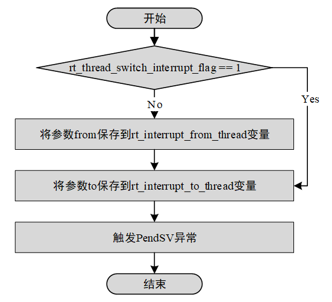

# cortex-m 移植

## 知识储备

### 常用寄存器

PRIMASK 寄存器

* PRIMASK 寄存器为 1 位宽的中断屏蔽寄存器。在置位时，它会阻止不可屏蔽中断 (NMI) 和 HardFault 异常之外的所有异常(包括中断)。实际上，它是将当前异常优先级提升为 0，这也是可编程异常 / 中断的最高优先级。

FAULTMASK 寄存器

* FAULTMASK 与 PRIMASK 相类似，但同时它能屏蔽 HardFault 异常，它实际上是将异常优先级提升到了 -1

程序状态寄存器 (xPSR)

* xPSR 包含：

  * 应用 PSR(APSR)

  * 执行 PSR(EPSR)

  * 中断 PSR(IPSR)

 

注：GE 在 Cortex-M4 等 ARMv7E-M 处理器中存在，在 Cortex-M3 处理器中则不可用。

 | 位       | 描述                                                         |
  | -------- | ------------------------------------------------------------ |
  | N        | 负标志                                                       |
  | Z        | 零标志                                                       |
  | C        | 进位 (或者非借位) 标志                                         |
  | V        | 溢出标志                                                     |
  | Q        | 饱和标志 (ARMv6-M 中不存在)                                    |
  | GE[3:0]  | 大于或等于标志，对应每个字节通路 (只存在于 ARMv7E-M, ARMv6-M 或 Cortex-M3 中则不存在) |
  | ICI/IT   | 中断继续指令 (ICI) 位，IF-THEN 指令状态位用于条件执行(ARMv6-M 中则不存在) |
  | T        | Thumb 状态，总是 1，清除此位会引起错误异常                     |
  | 异常编号 | 表示处理器正在处理的异常                                     |

中断向量表

- Cortex-M 系列处理器的中断向量表位于 0x00000000, 但 Cortex-M3/4 系列提供了 Vector table offset register (SCB_VTOR)，所以，中断向量表的位置位于 0x00000000 + SCB_VTOR。

### 常用汇编指令

#### 异常相关指令

| 指令    | 操作                                          |
| ------- | --------------------------------------------- |
| CPSIE I | 使能中断 (清除 PRIMASK)                         |
| CPSID I | 禁止中断 (设置 PRIMASK)，NMI 和 HardFault 不受影响 |
| CPSIE F | 使能中断 (清除 FAULTMASK)                       |
| CPSID F | 禁止中断 (设置 FAULTMASK)，NMI 不受影响          |

## 移植过程

在嵌入式领域有多种不同 CPU 架构，例如 Cortex-M、ARM920T、MIPS32、RISC-V 等等。为了使 RT-Thread 能够在不同 CPU 架构的芯片上运行，RT-Thread 提供了一个 libcpu 抽象层来适配不同的 CPU 架构。libcpu 层向上对内核提供统一的接口，包括全局中断的开关，线程栈的初始化，上下文切换等。

RT-Thread 的 libcpu 抽象层向下提供了一套统一的 CPU 架构移植接口，这部分接口包含了全局中断开关函数、线程上下文切换函数、时钟节拍的配置和中断函数、Cache 等等内容。下表是 CPU 架构移植需要实现的接口和变量。

libcpu 移植相关 API

|  函数和变量               |  描述                                                      |
| ------------------------------------------------------------ | ------------------------------------------------------------ |
| rt_base_t rt_hw_interrupt_disable(void);                     | 关闭全局中断                                                 |
| void rt_hw_interrupt_enable(rt_base_t level);                | 打开全局中断                                                 |
| rt_uint8_t *rt_hw_stack_init(void *tentry, void *parameter, rt_uint8_t *stack_addr, void *texit); | 线程栈的初始化，内核在线程创建和线程初始化里面会调用这个函数 |
| void rt_hw_context_switch_to(rt_uint32 to);                  | 没有来源线程的上下文切换，在调度器启动第一个线程的时候调用，以及在 signal 里面会调用 |
| void rt_hw_context_switch(rt_uint32 from, rt_uint32 to);     | 从 from 线程切换到 to 线程，用于线程和线程之间的切换         |
| void rt_hw_context_switch_interrupt(rt_uint32 from, rt_uint32 to); | 从 from 线程切换到 to 线程，用于中断里面进行切换的时候使用   |
| rt_uint32_t rt_thread_switch_interrupt_flag;                 | 表示需要在中断里进行切换的标志                               |
| rt_uint32_t rt_interrupt_from_thread, rt_interrupt_to_thread; | 在线程进行上下文切换时候，用来保存 from 和 to 线程           |

要对 CPU 进行移植，只需实现上述接口。

### 关闭全局中断

rt_base_t rt_hw_interrupt_disable(void);

```assembly
/*
 * rt_base_t rt_hw_interrupt_disable();
 */
    .global rt_hw_interrupt_disable
    .type rt_hw_interrupt_disable, %function
rt_hw_interrupt_disable:
    MRS     R0, PRIMASK	; 将 PRIMASK 当前值 (关中断前的状态) 存入 R0，并作为函数返回值返回
    CPSID   I			; 关闭中断
    BX      LR
```

### 打开全局中断

```assembly
/*
 * void rt_hw_interrupt_enable(rt_base_t level);	//level 是调用关中断函数时的返回值，代表关中断前 PRIMASK 的值
 */
    .global rt_hw_interrupt_enable
    .type rt_hw_interrupt_enable, %function
rt_hw_interrupt_enable:
    MSR     PRIMASK, R0	; 将 level 写入 PRIMASK 寄存器，恢复关中断前的状态
    BX      LR
```

### 实现线程栈初始化

在动态创建线程和初始化线程的时候，会使用到内部的线程初始化函数_rt_thread_init()，_rt_thread_init() 函数会调用栈初始化函数 rt_hw_stack_init()，在栈初始化函数里会手动构造一个上下文内容，这个上下文内容将被作为每个线程第一次执行的初始值。上下文在栈里的排布如下图所示：


```c
rt_uint8_t *rt_hw_stack_init(void       *tentry,
                             void       *parameter,
                             rt_uint8_t *stack_addr,
                             void       *texit)
{
    struct stack_frame *stack_frame;
    rt_uint8_t         *stk;
    unsigned long       i;

    stk  = stack_addr + sizeof(rt_uint32_t);
    stk  = (rt_uint8_t *)RT_ALIGN_DOWN((rt_uint32_t)stk, 8);
    stk -= sizeof(struct stack_frame);

    stack_frame = (struct stack_frame *)stk;

    /* init all register */
    for (i = 0; i < sizeof(struct stack_frame) / sizeof(rt_uint32_t); i ++)
    {
        ((rt_uint32_t *)stack_frame)[i] = 0xdeadbeef;
    }

    /* 根据 ARM  APCS 调用标准，将第一个参数保存在 r0 寄存器 */
    stack_frame->exception_stack_frame.r0  = (unsigned long)parameter; /* r0 : argument */
    /* 其他参数寄存器初始化为 0 */
    stack_frame->exception_stack_frame.r1  = 0;                        /* r1 */
    stack_frame->exception_stack_frame.r2  = 0;                        /* r2 */
    stack_frame->exception_stack_frame.r3  = 0;                        /* r3 */
    /* 将 IP(Intra-Procedure-call scratch register.) 设置为 0 */
    stack_frame->exception_stack_frame.r12 = 0;                        /* r12 */
    /* 将线程退出函数的地址保存在 lr 寄存器 */
    stack_frame->exception_stack_frame.lr  = (unsigned long)texit;     /* lr */
    /* 将线程入口函数的地址保存在 pc 寄存器 */
    stack_frame->exception_stack_frame.pc  = (unsigned long)tentry;    /* entry point, pc */
    /* 设置 psr 的值为 0x01000000L，表示默认切换过去是 Thumb 模式 */
    stack_frame->exception_stack_frame.psr = 0x01000000L;              /* PSR */

    /* return task's current stack address */
    return stk;
}
```

### 实现上下文切换

在 Cortex-M 里面上下文切换都是统一使用 PendSV 异常来完成。为了能适应不同的 CPU 架构，RT-Thread 的 libcpu 抽象层需要实现三个线程切换相关的函数：

1） rt_hw_context_switch_to()：没有来源线程，切换到目标线程，在调度器启动第一个线程的时候被调用。

2） rt_hw_context_switch()：在线程环境下，从当前线程切换到目标线程。

3） rt_hw_context_switch_interrupt ()：在中断环境下，从当前线程切换到目标线程。

#### PendSV_Handler

产生 PendSV 异常时，Cortex-M 系列处理器硬件会自动将 from 线程的 PSR、PC、LR、R12、R3-R0 压栈，因此在 PendSV_Handler 中，我们需要把 from 线程的 R11-R4 压栈，并把 to 线程的 R11-R4 弹出。修改 PSP 为 to 线程的栈地址，在退出 PendSV 中断时，硬件会自动弹出 to 线程的 R3-R0、R12、LR、PC、PSR 寄存器。

```assembly
/* R0 --> switch from thread stack
 * R1 --> switch to thread stack
 * psr, pc, LR, R12, R3, R2, R1, R0 are pushed into [from] stack
 */
    .global PendSV_Handler
    .type PendSV_Handler, %function
PendSV_Handler:
    /* disable interrupt to protect context switch */
    MRS     R2, PRIMASK
    CPSID   I

    /* get rt_thread_switch_interrupt_flag */
    LDR     R0, =rt_thread_switch_interrupt_flag
    LDR     R1, [R0]
    CBZ     R1, pendsv_exit         /* pendsv aLReady handled */	; 判断是否已经在 rt_hw_context_switchx 中置位

    /* clear rt_thread_switch_interrupt_flag to 0 */
    MOV     R1, #0
    STR     R1, [R0]

    LDR     R0, =rt_interrupt_from_thread
    LDR     R1, [R0]
    CBZ     R1, switch_to_thread    /* skip register save at the first time */
    								; 判断 from 线程是否为空 (判断是否是 rt_hw_context_switch_to)
    MRS     R1, PSP                 /* get from thread stack pointer */	; 将 from 线程的堆栈地址读入 R1
    STMFD   R1!, {R4 - R11}         /* push R4 - R11 register */	; 将 from 线程的数据寄存器 R4-R11 压栈
    LDR     R0, [R0]				; 将最新的栈指针存回 rt_interrupt_from_thread
    STR     R1, [R0]                /* update from thread stack pointer */

switch_to_thread:
    LDR     R1, =rt_interrupt_to_thread
    LDR     R1, [R1]
    LDR     R1, [R1]                /* load thread stack pointer */

    LDMFD   R1!, {R4 - R11}         /* pop R4 - R11 register */	; 将 to 线程的数据寄存器 R4-R11 弹出
    MSR     PSP, R1                 /* update stack pointer */

pendsv_exit:
    /* restore interrupt */
    MSR     PRIMASK, R2

    ORR     LR, LR, #0x04
    BX      LR
```

#### rt_hw_context_switch_to


```assembly
/*
 * void rt_hw_context_switch_to(rt_uint32 to);
 * R0 --> to
 */
    .global rt_hw_context_switch_to
    .type rt_hw_context_switch_to, %function
rt_hw_context_switch_to:
    LDR     R1, =rt_interrupt_to_thread		; 将传入的目标线程栈存入 rt_interrupt_to_thread
    STR     R0, [R1]

    /* set from thread to 0 */
    LDR     R1, =rt_interrupt_from_thread
    MOV     R0, #0
    STR     R0, [R1]

    /* set interrupt flag to 1 */
    LDR     R1, =rt_thread_switch_interrupt_flag	; 设置 rt_thread_switch_interrupt_flag, PendSV 中会判断该标志来确定是否进行上下文切换
    MOV     R0, #1
    STR     R0, [R1]

    /* set the PendSV and SysTick exception priority */
    LDR     R0, =SHPR3	;System handler priority register 3 (SCB_SHPR3)，其中 Bits[23:16] 为 Priority of system handler 14, PendSV
    LDR     R1, =PENDSV_PRI_LOWEST ;PENDSV_PRI_LOWEST 即 0xFFFF0000，作为其 mask
    LDR.W   R2, [R0,#0]             /* read */
    ORR     R1, R1, R2              /* modify */
    STR     R1, [R0]                /* write-back */

    LDR     R0, =ICSR               /* trigger the PendSV exception (causes context switch) */
    LDR     R1, =PENDSVSET_BIT		;0x10000000，ICSR 的第 28 位为 PendSV set-pending bit.
    STR     R1, [R0]				;Writing 1 to this bit is the only way to set the PendSV exception state to pending.

    /* restore MSP */
    LDR     r0, =SCB_VTOR	; 设置 SCB_VTOR 的地址
    LDR     r0, [r0]		; 读取中断向量表的位置
    LDR     r0, [r0]		; 读取 SP 初始值
    NOP
    MSR     msp, r0			; 将 SP 初始值赋给 MSP

    /* enable interrupts at processor level */
    CPSIE   F
    CPSIE   I

    /* never reach here! */
```

#### rt_hw_context_switch / rt_hw_context_switch_interrupt



```assembly
/*
 * void rt_hw_context_switch(rt_uint32 from, rt_uint32 to);
 * R0 --> from
 * R1 --> to
 */
    .global rt_hw_context_switch_interrupt
    .type rt_hw_context_switch_interrupt, %function
    .global rt_hw_context_switch
    .type rt_hw_context_switch, %function
rt_hw_context_switch_interrupt:
rt_hw_context_switch:
    /* set rt_thread_switch_interrupt_flag to 1 */
    LDR     R2, =rt_thread_switch_interrupt_flag
    LDR     R3, [R2]
    CMP     R3, #1		; 判断 rt_thread_switch_interrupt_flag 是否已经被置位
    BEQ     _reswitch	; 如果已经被置位，则跳转到_reswitch
    MOV     R3, #1
    STR     R3, [R2]	;rt_thread_switch_interrupt_flag = 1

    LDR     R2, =rt_interrupt_from_thread   /* set rt_interrupt_from_thread */
    STR     R0, [R2]	; 将传入的 from 线程存入 rt_interrupt_from_thread 变量

_reswitch:
    LDR     R2, =rt_interrupt_to_thread     /* set rt_interrupt_to_thread */
    STR     R1, [R2]

    LDR     R0, =ICSR           /* trigger the PendSV exception (causes context switch) */
    LDR     R1, =PENDSVSET_BIT
    STR     R1, [R0]
    BX      LR
```

### 实现时钟节拍

要实现时间片轮转调度、软定时器、rt_thread_delay() 等功能，必须要保证 rt_tick_increase() 被周期性调用。在 Cortex-M 系列 MCU 中，可以使用系统滴答定时器来对其周期性调用。

```c
void SysTick_Handler(void)
{
    /* enter interrupt */
    rt_interrupt_enter();

    rt_tick_increase();

    /* leave interrupt */
    rt_interrupt_leave();
}
```

## 参考文档

[1] [Procedure Call Standard for the Arm Architecture - ABI 2020Q2 documentation](https://developer.arm.com/documentation/ihi0042/j/)

[2] Joseph Yiu 著. ARM Cortex-M3 与 Cortex-M4 权威指南 (第 3 版). 吴常玉等译. 清华大学出版社

