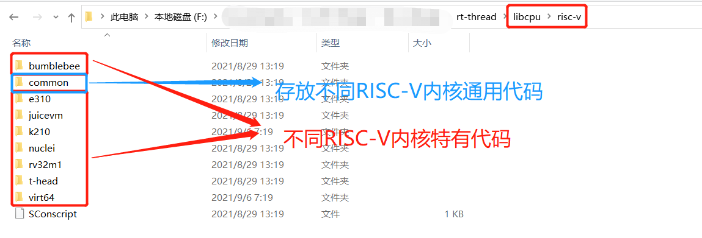
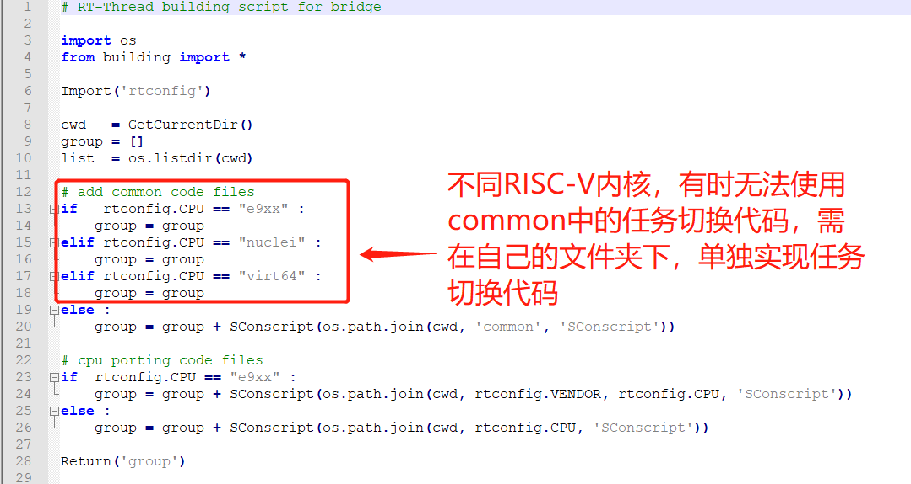
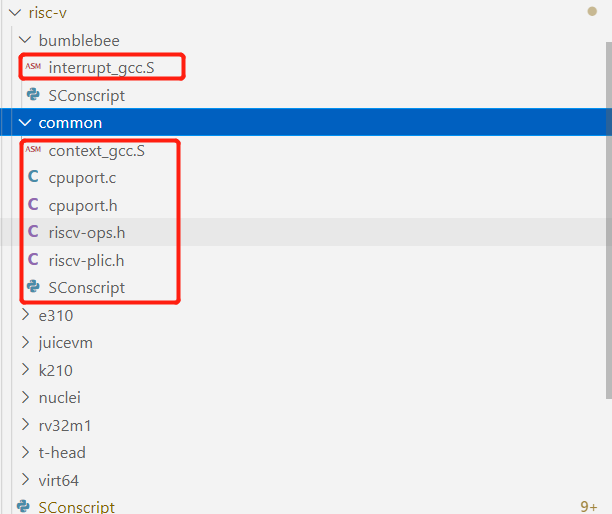

# RISC-V 移植

## RISC-V 简介

RISC-V (读作 “RISC-FIVE”) 是 **基于精简指令集计算 (RISC)原理建立的开放 指令集架构** (ISA)，V 表示为第五代 RISC (精简指令集计算机), 表示此前已经四代 RISC 处理器原型芯片。

## 内核移植简介

- 内核移植就是指将 RT-Thread 内核在不同的芯片架构、不同的板卡上运行起来，能够具备线程管理和调度，内存管理，线程间同步和通信、定时器管理等功能。移植可分为 CPU 架构移植和 BSP（Board support package，板级支持包）移植两部分。

- 在嵌入式领域有多种不同 CPU 架构，例如 Cortex-M、ARM920T、MIPS32、RISC-V 等等。为了使 RT-Thread 能够在不同 CPU 架构的芯片上运行，RT-Thread 提供了一个 libcpu 抽象层来适配不同的 CPU 架构。libcpu 层向上对内核提供统一的接口，包括全局中断的开关，线程栈的初始化，上下文切换等。

- RT-Thread 的 libcpu 抽象层向下提供了一套统一的 CPU 架构移植接口，这部分接口包含了全局中断开关函数、线程上下文切换函数、时钟节拍的配置和中断函数、Cache 等等内容。下表是 CPU 架构移植需要实现的接口和变量。

### RTOS 内核移植

RTOS 内核移植一般需要实现如下功能，对接 RTOS

- 中断使能 / 失能
- 任务切换
- 中断处理
- 时钟节拍
- Cache (可选)

### libcpu 移植相关 API 介绍

| **函数和变量**                                               | **描述**                                                     |
| ------------------------------------------------------------ | ------------------------------------------------------------ |
| rt_base_t rt_hw_interrupt_disable(void);                     | 关闭全局中断                                                 |
| void rt_hw_interrupt_enable(rt_base_t level);                | 打开全局中断                                                 |
| rt_uint8_t *rt_hw_stack_init(void *tentry, void *parameter, rt_uint8_t *stack_addr, void *texit); | 线程栈的初始化，内核在线程创建和线程初始化里面会调用这个函数 |
| void rt_hw_context_switch_to(rt_uint32 to);                  | 没有来源线程的上下文切换，在调度器启动第一个线程的时候调用，以及在 signal 里面会调用 |
| void rt_hw_context_switch(rt_uint32 from, rt_uint32 to);     | 从 from 线程切换到 to 线程，用于线程和线程之间的切换         |
| void rt_hw_context_switch_interrupt(rt_uint32 from, rt_uint32 to); | 从 from 线程切换到 to 线程，用于中断里面进行切换的时候使用   |
| rt_uint32_t rt_thread_switch_interrupt_flag;                 | 表示需要在中断里进行切换的标志                               |
| rt_uint32_t rt_interrupt_from_thread, rt_interrupt_to_thread; | 在线程进行上下文切换时候，用来保存 from 和 to 线程           |

## RISC-V 内核移植

### RT-Thread RISC-V 内核架构介绍

- 在 RISC-V 内核架构设计上，common 文件夹一般来用存放的是不同 RISC-V 内核的通用任务切换代码，其他不同内核之间不一样的地方，使用单独的文件夹存放。

  

- 不同的 RISC-V 内核芯片，我们会发现一个很有意思的现象：任务切换代码经常有一些不一样的地方，比较碎片化，因此我们会发现，有时，很难比较统一的将任务切换代码都放在 common 文件夹中，查看 libcpu\risc-v\SConscript 文件，我们会发现，不同内核架构，有时无法使用 common 文件夹中的任务切换代码

  

### RT-Thread RISC-V 内核移植 API 实现

内核移植的主要工作内容，主要就是实现上面 libcpu 移植相关的 API，相关实现函数也位于上面提到的 libcpu/risc-v 文件夹中，因为不同的 RISC-V 内核，任务切换相关 API 实现也不完全一样，下面我们以 `GD32FV103` 芯片为例，将介绍一下，如何实现一个 RISC-V 内核架构的芯片移植工作。

`GD32VF103` 是 `bumblebee` 内核，相关的内核移植 API 主要位于如下文件 夹中，接下来，我们依次介绍内核移植 API 的实现



#### 实现全局中断关闭

```assembly
/*
 * rt_base_t rt_hw_interrupt_disable(void);
 * 保存全局中断状态，然后关闭中断，返回保存的中断状态
 */
    .globl rt_hw_interrupt_disable
rt_hw_interrupt_disable:
    csrrci a0, mstatus, 8	/* 8 表示 mstatus 的第 3bit，即 MIE 字段，设置为 0，关闭全局中断 */
    ret
```

#### 实现全局中断打开

```assembly
/*
 * void rt_hw_interrupt_enable(rt_base_t level);
 * 恢复全局中断状态，a0 为之前关闭中断时保存下的中断状态
 */
    .globl rt_hw_interrupt_enable
rt_hw_interrupt_enable:
    csrw mstatus, a0	/* 恢复之前的中断状态 */
    ret
```

#### 实现线程栈初始化

```c
/**
 * This function will initialize thread stack
 *
 * @param tentry the entry of thread
 * @param parameter the parameter of entry
 * @param stack_addr the beginning stack address
 * @param texit the function will be called when thread exit
 *
 * @return stack address
 */
rt_uint8_t *rt_hw_stack_init(void       *tentry,
                             void       *parameter,
                             rt_uint8_t *stack_addr,
                             void       *texit)
{
    struct rt_hw_stack_frame *frame;
    rt_uint8_t         *stk;
    int                i;

    stk  = stack_addr + sizeof(rt_ubase_t);
    stk  = (rt_uint8_t *)RT_ALIGN_DOWN((rt_ubase_t)stk, REGBYTES);
    stk -= sizeof(struct rt_hw_stack_frame);

    frame = (struct rt_hw_stack_frame *)stk;

    for (i = 0; i < sizeof(struct rt_hw_stack_frame) / sizeof(rt_ubase_t); i++)
    {
        ((rt_ubase_t *)frame)[i] = 0xdeadbeef;
    }

    frame->ra      = (rt_ubase_t)texit;		// ra 寄存器相当于 ARM 中的 LR 寄存器，存放函数返回时，PC 的地址
    frame->a0      = (rt_ubase_t)parameter;	// a0 存放参数
    frame->epc     = (rt_ubase_t)tentry;	// epc 用来存放线程入口函数

    /* force to machine mode(MPP=11) and set MPIE to 1 */
    frame->mstatus = 0x00007880;			// 设置 MPP=1, 强制当前内核处于 machine mode

    return stk;
}
```

#### 实现上下文切换

一般在 CM3 等架构下，我们习惯在任务切换函数中，触发 PendSV 中断，然后在 PendSV 处理函数中实现上下文切换，在 RISC-V 架构中，可以使用 Software interrupt 来替换 PendSV，也可以不使用 Software interrupt，直接在任务切换函数中，进行上下文的切换，`rt-thread libcpu/risc-v/common/` 下任务切换的实现，其实使用的是方法二，即 **直接在任务切换函数中，直接进行上下文切换**，而没有使用 Software interrupt，主要原因是：

1. 使用 Software interrupt 模式，代码处理起来会别扭一些，特别是在使用 Software interrupt 并没有特别性能提升的时候，可能更没有必要
2. 目前已知的一些 RISC-V 并没有硬件自动压栈，出栈一些 CPU 寄存器，相比 PendSV 硬件上可以自动压栈，出栈
3. 其实 CM3 中使用 PendSV 做任务切换，也并不是架构强制要求的, 只是鼓励 RTOS 这么使用，RTOS 也可以完全不实用 PendSV 来做任务切换，是否这么做，完全取决于 RTOS 如何实现

当然，也可以使用 Software interrupt 来做任务切换， `libcpu/risc-v/nuclei` 这里的内核移植，就是使用了 Software interrupt 来做任务切换的

##### rt_hw_context_switch_to

`rt_hw_context_switch_to` 主要是在第一次切换到新的线程时使用到，第一次线程切换时，是没有 from 线程的，只有 to 线程

```assembly
/*
 * #ifdef RT_USING_SMP
 * void rt_hw_context_switch_to(rt_ubase_t to, stuct rt_thread *to_thread);
 * #else
 * void rt_hw_context_switch_to(rt_ubase_t to);
 * #endif
 * a0 --> to
 * a1 --> to_thread
 */
    .globl rt_hw_context_switch_to
rt_hw_context_switch_to:
    LOAD sp, (a0)		/* 将 to 线程的 sp 指针赋值给 CPU 的 sp*/

#ifdef RT_USING_SMP
    mv   a0,   a1
    call  rt_cpus_lock_status_restore
#endif
    /* 将 sp 的值加上 2 个寄存器位宽（32 位架构中，寄存器位宽为 4 字节），然后将地址中的内容取出来赋值给 a0,
    * 其实这里的 a0 就是 to 线程当前的 mstatus， 恢复 to 线程的 mstatus
    */
    LOAD a0,   2 * REGBYTES(sp)

    /* 将 to 线程的 mstatus 写入 CPU 的 mstatus 寄存器中 */
    csrw mstatus, a0
    j    rt_hw_context_switch_exit	/* 该函数实现了下文的恢复（to 线程的相关状态恢复到 CPU 寄存器中） */
```

```assembly
.global rt_hw_context_switch_exit
rt_hw_context_switch_exit:
#ifdef RT_USING_SMP
#ifdef RT_USING_SIGNALS
    mv a0, sp

    csrr  t0, mhartid
    /* switch interrupt stack of current cpu */
    la    sp, __stack_start__
    addi  t1, t0, 1
    li    t2, __STACKSIZE__
    mul   t1, t1, t2
    add   sp, sp, t1 /* sp = (cpuid + 1) * __STACKSIZE__ + __stack_start__ */

    call rt_signal_check
    mv sp, a0
#endif
#endif
	/*
	* 将 sp 指向的地址，偏移 0 个寄存器位宽，并将其中的值，取出来，赋值给 a0
	*/
    /* resw ra to mepc */
    LOAD a0,   0 * REGBYTES(sp)
    csrw mepc, a0

	/* 恢复 to 线程的 x1(ra) 寄存器 */
    LOAD x1,   1 * REGBYTES(sp)

    li    t0, 0x00007800
    csrw  mstatus, t0
    LOAD a0,   2 * REGBYTES(sp)
    csrs mstatus, a0

	/* 恢复 to 线程其他寄存器值 */
    LOAD x4,   4 * REGBYTES(sp)
    LOAD x5,   5 * REGBYTES(sp)
    LOAD x6,   6 * REGBYTES(sp)
    LOAD x7,   7 * REGBYTES(sp)
    LOAD x8,   8 * REGBYTES(sp)
    LOAD x9,   9 * REGBYTES(sp)
    LOAD x10, 10 * REGBYTES(sp)
    LOAD x11, 11 * REGBYTES(sp)
    LOAD x12, 12 * REGBYTES(sp)
    LOAD x13, 13 * REGBYTES(sp)
    LOAD x14, 14 * REGBYTES(sp)
    LOAD x15, 15 * REGBYTES(sp)
    LOAD x16, 16 * REGBYTES(sp)
    LOAD x17, 17 * REGBYTES(sp)
    LOAD x18, 18 * REGBYTES(sp)
    LOAD x19, 19 * REGBYTES(sp)
    LOAD x20, 20 * REGBYTES(sp)
    LOAD x21, 21 * REGBYTES(sp)
    LOAD x22, 22 * REGBYTES(sp)
    LOAD x23, 23 * REGBYTES(sp)
    LOAD x24, 24 * REGBYTES(sp)
    LOAD x25, 25 * REGBYTES(sp)
    LOAD x26, 26 * REGBYTES(sp)
    LOAD x27, 27 * REGBYTES(sp)
    LOAD x28, 28 * REGBYTES(sp)
    LOAD x29, 29 * REGBYTES(sp)
    LOAD x30, 30 * REGBYTES(sp)
    LOAD x31, 31 * REGBYTES(sp)

    addi sp,  sp, 32 * REGBYTES

#ifdef ARCH_RISCV_FPU
    FLOAD   f0, 0 * FREGBYTES(sp)
    FLOAD   f1, 1 * FREGBYTES(sp)
    FLOAD   f2, 2 * FREGBYTES(sp)
    FLOAD   f3, 3 * FREGBYTES(sp)
    FLOAD   f4, 4 * FREGBYTES(sp)
    FLOAD   f5, 5 * FREGBYTES(sp)
    FLOAD   f6, 6 * FREGBYTES(sp)
    FLOAD   f7, 7 * FREGBYTES(sp)
    FLOAD   f8, 8 * FREGBYTES(sp)
    FLOAD   f9, 9 * FREGBYTES(sp)
    FLOAD   f10, 10 * FREGBYTES(sp)
    FLOAD   f11, 11 * FREGBYTES(sp)
    FLOAD   f12, 12 * FREGBYTES(sp)
    FLOAD   f13, 13 * FREGBYTES(sp)
    FLOAD   f14, 14 * FREGBYTES(sp)
    FLOAD   f15, 15 * FREGBYTES(sp)
    FLOAD   f16, 16 * FREGBYTES(sp)
    FLOAD   f17, 17 * FREGBYTES(sp)
    FLOAD   f18, 18 * FREGBYTES(sp)
    FLOAD   f19, 19 * FREGBYTES(sp)
    FLOAD   f20, 20 * FREGBYTES(sp)
    FLOAD   f21, 21 * FREGBYTES(sp)
    FLOAD   f22, 22 * FREGBYTES(sp)
    FLOAD   f23, 23 * FREGBYTES(sp)
    FLOAD   f24, 24 * FREGBYTES(sp)
    FLOAD   f25, 25 * FREGBYTES(sp)
    FLOAD   f26, 26 * FREGBYTES(sp)
    FLOAD   f27, 27 * FREGBYTES(sp)
    FLOAD   f28, 28 * FREGBYTES(sp)
    FLOAD   f29, 29 * FREGBYTES(sp)
    FLOAD   f30, 30 * FREGBYTES(sp)
    FLOAD   f31, 31 * FREGBYTES(sp)

    addi    sp, sp, 32 * FREGBYTES
#endif

    mret
```

##### rt_hw_context_switch

该函数用于在线程（而不是中断中）实现上下文切换

```assembly
/*
 * #ifdef RT_USING_SMP
 * void rt_hw_context_switch(rt_ubase_t from, rt_ubase_t to, struct rt_thread *to_thread);
 * #else
 * void rt_hw_context_switch(rt_ubase_t from, rt_ubase_t to);
 * #endif
 *
 * a0 --> from			a0 存放的是 from 线程的 sp
 * a1 --> to			a1 存放的是 to 线程的 sp
 * a2 --> to_thread		to_thread 仅在使能了 SMP 功能后使用到
 */
    .globl rt_hw_context_switch
rt_hw_context_switch:
	/* 保存 from 线程的状态到 from 线程的栈中 */
    /* saved from thread context
     *     x1/ra       -> sp(0)
     *     x1/ra       -> sp(1)
     *     mstatus.mie -> sp(2)
     *     x(i)        -> sp(i-4)
     */
#ifdef ARCH_RISCV_FPU
    addi    sp, sp, -32 * FREGBYTES

    FSTORE  f0, 0 * FREGBYTES(sp)
    FSTORE  f1, 1 * FREGBYTES(sp)
    FSTORE  f2, 2 * FREGBYTES(sp)
    FSTORE  f3, 3 * FREGBYTES(sp)
    FSTORE  f4, 4 * FREGBYTES(sp)
    FSTORE  f5, 5 * FREGBYTES(sp)
    FSTORE  f6, 6 * FREGBYTES(sp)
    FSTORE  f7, 7 * FREGBYTES(sp)
    FSTORE  f8, 8 * FREGBYTES(sp)
    FSTORE  f9, 9 * FREGBYTES(sp)
    FSTORE  f10, 10 * FREGBYTES(sp)
    FSTORE  f11, 11 * FREGBYTES(sp)
    FSTORE  f12, 12 * FREGBYTES(sp)
    FSTORE  f13, 13 * FREGBYTES(sp)
    FSTORE  f14, 14 * FREGBYTES(sp)
    FSTORE  f15, 15 * FREGBYTES(sp)
    FSTORE  f16, 16 * FREGBYTES(sp)
    FSTORE  f17, 17 * FREGBYTES(sp)
    FSTORE  f18, 18 * FREGBYTES(sp)
    FSTORE  f19, 19 * FREGBYTES(sp)
    FSTORE  f20, 20 * FREGBYTES(sp)
    FSTORE  f21, 21 * FREGBYTES(sp)
    FSTORE  f22, 22 * FREGBYTES(sp)
    FSTORE  f23, 23 * FREGBYTES(sp)
    FSTORE  f24, 24 * FREGBYTES(sp)
    FSTORE  f25, 25 * FREGBYTES(sp)
    FSTORE  f26, 26 * FREGBYTES(sp)
    FSTORE  f27, 27 * FREGBYTES(sp)
    FSTORE  f28, 28 * FREGBYTES(sp)
    FSTORE  f29, 29 * FREGBYTES(sp)
    FSTORE  f30, 30 * FREGBYTES(sp)
    FSTORE  f31, 31 * FREGBYTES(sp)

#endif
    addi  sp,  sp, -32 * REGBYTES
    STORE sp,  (a0)

    STORE x1,   0 * REGBYTES(sp)
    STORE x1,   1 * REGBYTES(sp)

    csrr a0, mstatus
    andi a0, a0, 8
    beqz a0, save_mpie
    li   a0, 0x80
save_mpie:
    STORE a0,   2 * REGBYTES(sp)

    STORE x4,   4 * REGBYTES(sp)
    STORE x5,   5 * REGBYTES(sp)
    STORE x6,   6 * REGBYTES(sp)
    STORE x7,   7 * REGBYTES(sp)
    STORE x8,   8 * REGBYTES(sp)
    STORE x9,   9 * REGBYTES(sp)
    STORE x10, 10 * REGBYTES(sp)
    STORE x11, 11 * REGBYTES(sp)
    STORE x12, 12 * REGBYTES(sp)
    STORE x13, 13 * REGBYTES(sp)
    STORE x14, 14 * REGBYTES(sp)
    STORE x15, 15 * REGBYTES(sp)
    STORE x16, 16 * REGBYTES(sp)
    STORE x17, 17 * REGBYTES(sp)
    STORE x18, 18 * REGBYTES(sp)
    STORE x19, 19 * REGBYTES(sp)
    STORE x20, 20 * REGBYTES(sp)
    STORE x21, 21 * REGBYTES(sp)
    STORE x22, 22 * REGBYTES(sp)
    STORE x23, 23 * REGBYTES(sp)
    STORE x24, 24 * REGBYTES(sp)
    STORE x25, 25 * REGBYTES(sp)
    STORE x26, 26 * REGBYTES(sp)
    STORE x27, 27 * REGBYTES(sp)
    STORE x28, 28 * REGBYTES(sp)
    STORE x29, 29 * REGBYTES(sp)
    STORE x30, 30 * REGBYTES(sp)
    STORE x31, 31 * REGBYTES(sp)

    /* restore to thread context
     * sp(0) -> epc;
     * sp(1) -> ra;
     * sp(i) -> x(i+2)
     */
    LOAD sp,  (a1)

#ifdef RT_USING_SMP
    mv   a0,   a2
    call  rt_cpus_lock_status_restore
#endif /*RT_USING_SMP*/

	/* 该函数实现了下文的恢复（to 线程的相关状态恢复到 CPU 寄存器中） */
    j rt_hw_context_switch_exit
```

##### rt_hw_context_switch_interrupt

在上下文实现，主要是在中断函数中进行调用，设置上下文切换的标志，然后在 `irq_entry` 中实现上下文的切换

```c
void rt_hw_context_switch_interrupt(rt_ubase_t from, rt_ubase_t to)
{
    if (rt_thread_switch_interrupt_flag == 0)
        rt_interrupt_from_thread = from;

    rt_interrupt_to_thread = to;
    rt_thread_switch_interrupt_flag = 1;

    return ;
}
```

#### 实现时钟节拍

要实现时间片轮转调度、软定时器、rt_thread_delay() 等功能，必须要保证 rt_tick_increase() 被周期性调用。在 RISC-V 系列 MCU 中，可以使用内核 timer 实现

```c
/* System Tick Configuration */
static void systick_config(rt_uint32_t ticks) {
    /* set value */
    *(rt_uint64_t *) (TMR_CTRL_ADDR + TMR_MTIMECMP) = ticks;
    /* enable interrupt */
    eclic_irq_enable(CLIC_INT_TMR, 0, 0);
    /* clear value */
    *(rt_uint64_t *) (TMR_CTRL_ADDR + TMR_MTIME) = 0;
}
```

```c
/* This is the timer interrupt service routine. */
void eclic_mtip_handler(void) {
    /* clear value */
    *(rt_uint64_t *) (TMR_CTRL_ADDR + TMR_MTIME) = 0;

    /* enter interrupt */
    rt_interrupt_enter();
    /* tick increase */
    rt_tick_increase();

    /* leave interrupt */
    rt_interrupt_leave();
}
```

## 参考文档

[1] [文档中心-内核移植](https://www.rt-thread.org/document/site/#/rt-thread-version/rt-thread-standard/programming-manual/porting/porting)

[2] RISC-V-Reader-Chinese-v2p1.pdf

[3] [野火 ®]《RT-Thread + 内核实现与应用开发实战—基于 STM32》.pdf

[4] Bumblebee 内核指令架构手册.pdf