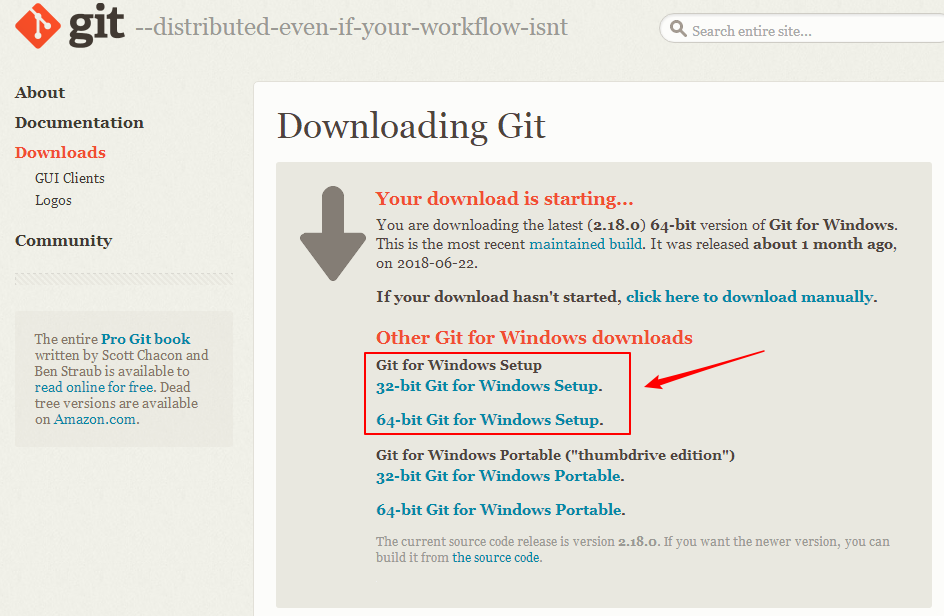
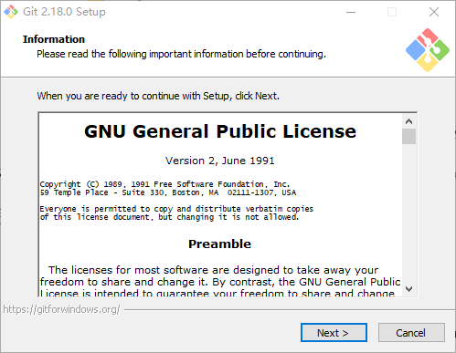
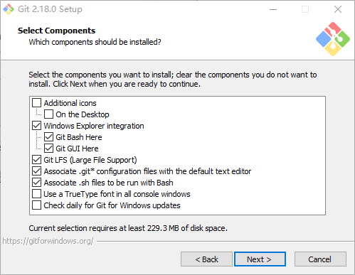
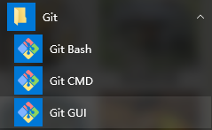
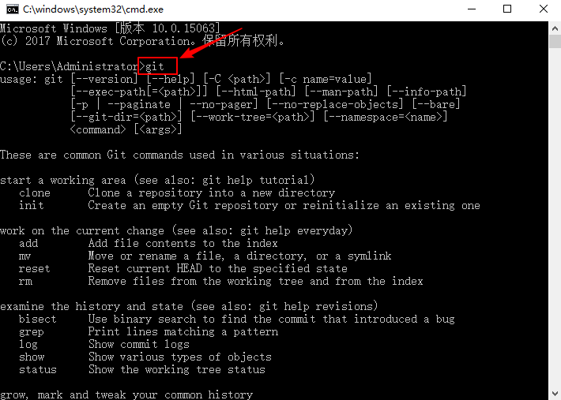

# Git 安装应用笔记 #

本文将详细介绍如何安装 Git，并将 Git 添加到 Windows 系统环境变量。

## 本文的目的和结构 ##

### 本文的目的和背景 ###

Git 是一个开源的分布式版本控制系统，用于敏捷高效地处理任何或小或大的项目，任何程序员想要很好的管理自己的项目肯定离不开 Git 。RT-Thread提供的开发辅助工具 Env 的软件包管理功能也需要 Git 提供支持。

### 本文的结构 ###

本文先解释 Git 安装步骤，然后介绍了怎么添加 Git 到系统环境变量中。

## Git 安装 ##

从 Git 官方网站(https://git-scm.com/download/win)下载 Git 安装包，根据自己的系统配置选择对应的安装包。

下载完成后运行安装程序，会出现如下图所示的软件安装画面，这是git的安装说明。

点击“Next >”进入组件选择界面，在这里可以选择自己需要安装的组件，默认选择就可以，默认选择直到安装成功。

在 Windows 环境下 Git 有两个命令行输入窗口 Git Bash 和 Git CMD，以及一个图形界面窗口 Git Gui。Git Bash是基于Git CMD，在 Git CMD 的基础上增添一些新的命令与功能。所以建议在使用的时候，用 Git Bash 更加方便。

安装好 Git 后启用 Windows 命令行工具或者 Git Bash ，输入Git 命令将会显示下图所示的提示信息，说明 Git 安装成功。

