# 使用 Eclipse 开发 RT-Thread #

本文描述了在 Windows 平台使用 Eclipse 开发 RT-Thread qemu-vexpress-a9 BSP 工程。

## 简介

Eclipse 是跨平台的自由集成开发环境（IDE）。最初主要用来 Java 语言开发，通过安装不同的插件 Eclipse 可以支持不同的计算机语言，比如 C++ 和 Python 等开发工具。Eclipse 的本身只是一个框架平台，但是众多插件的支持使得 Eclipse 拥有其他功能相对固定的 IDE 软件很难具有的灵活性。

本文准备资料如下：

* [RT-Thread 源码](https://www.rt-thread.org/page/download.html)

* [Env 工具](https://www.rt-thread.org/page/download.html)

* [Eclipse](https://www.eclipse.org/downloads/)

## 步骤一 使用 scons 命令编译工程

打开 Env 文件夹，双击 env.exe 文件打开 Env 控制台：

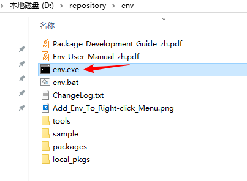

在 Env 控制台下切换目录，输入命令 `cd D:\repository\rt-thread\bsp\qemu-vexpress-a9` 切换到 RT-Thread 源码文件夹下的 qemu-vexpress-a9  BSP 根目录，然后输入 `scons` 命令编译工程，如果编译正确无误，会在 BSP 目录下生成 QEMU 下运行的 rtthread.elf 目标文件，调试工程需要这个文件。

## 步骤二 安装调试插件

在 Eclipse Marketplace 里下载并安装支持 QEMU 的调试插件：

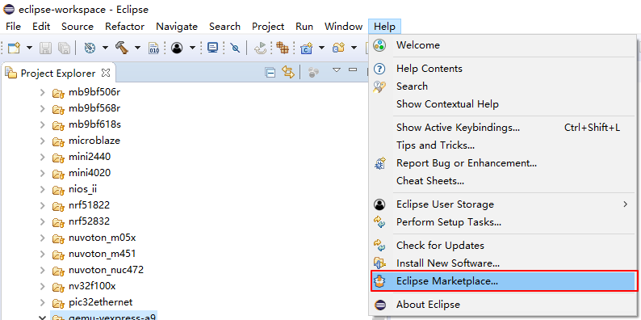

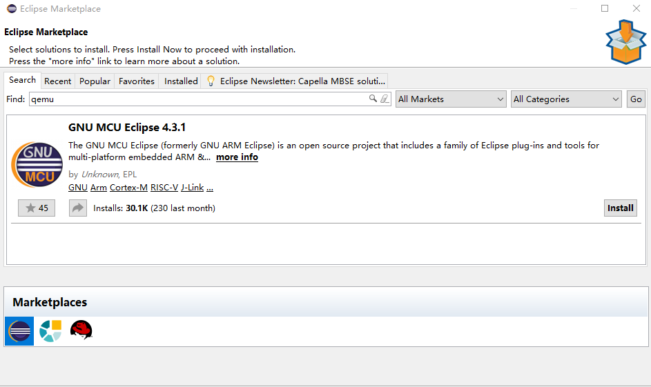

## 步骤三 新建 Eclipse 工程

按照如下图所示步骤添加 RT-Thread 源代码到 Eclipse:

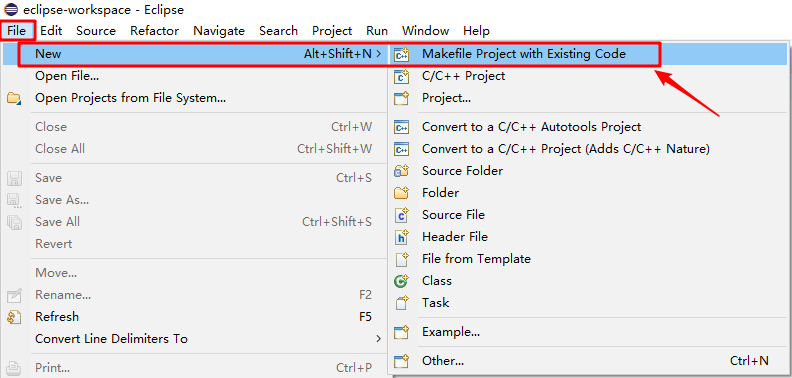

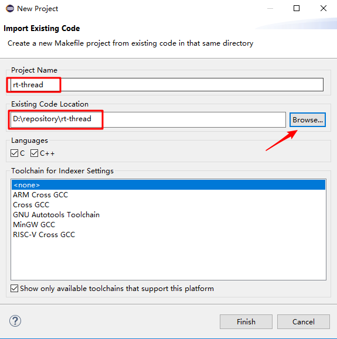

## 步骤四 新建调试项目

新建调试项目并配置调试参数，如下图所示步骤配置：

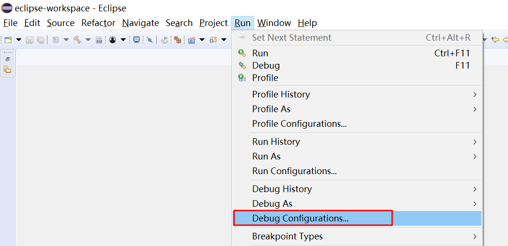

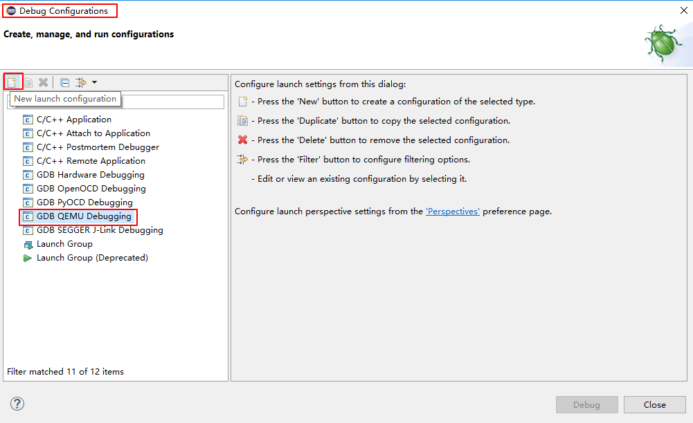

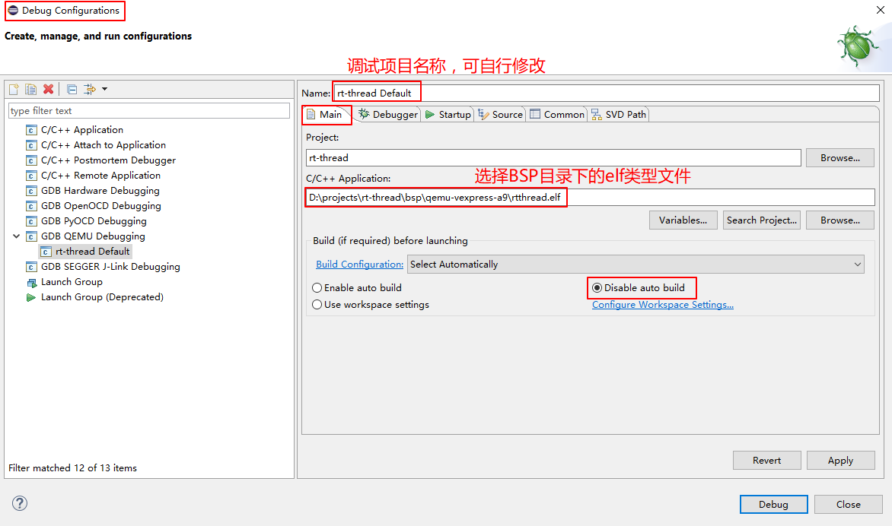

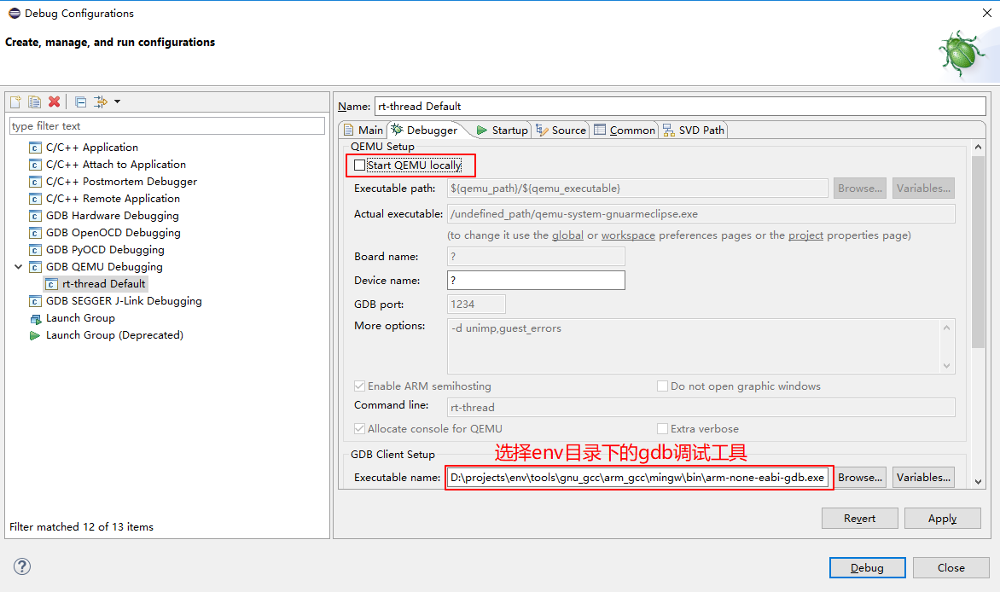

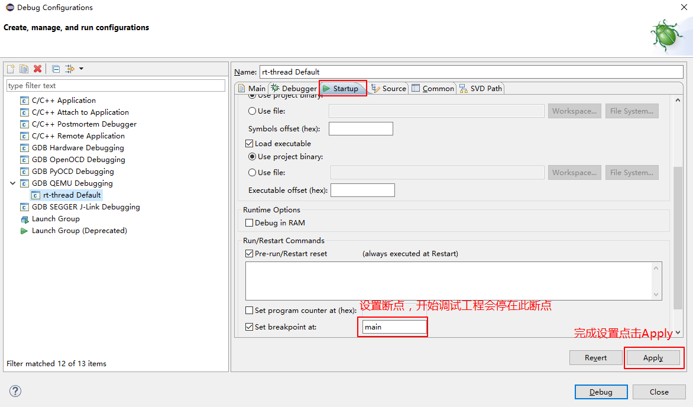

## 步骤五 调试工程

1、调试相关参数配置好后就可以开始调试了，回到 Env 命令行界面输入 `qemu-dbg.bat` 开启调试模式：

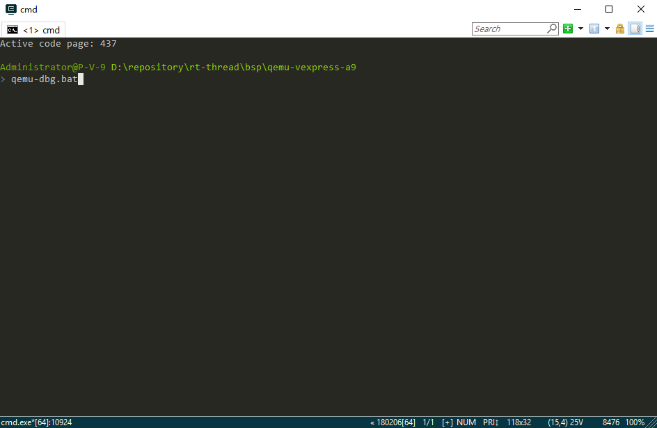

这时候启动的 QEMU 虚拟机处于暂停状态，等待连接调试：

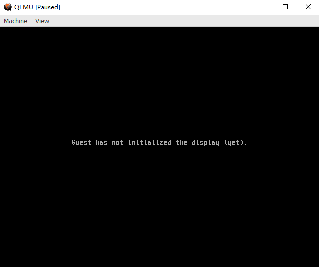

2、点击 eclipse 调试配置界面的 “Debug” 按钮，或者点击调试项目名称，开启 eclipse 调试界面，这时就可以对工程进行调试了：

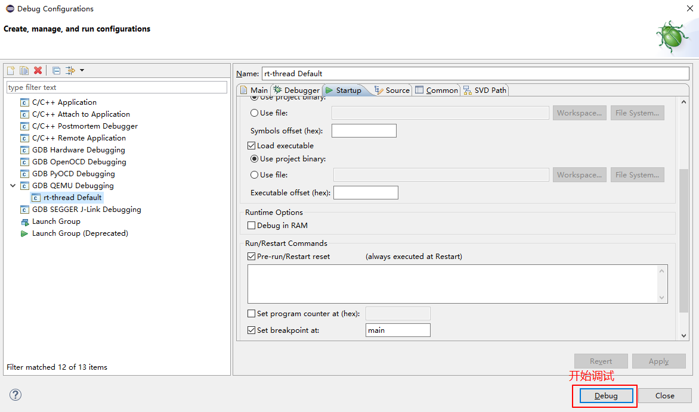

3、Eclipse 主要调试选项简介如下所示：

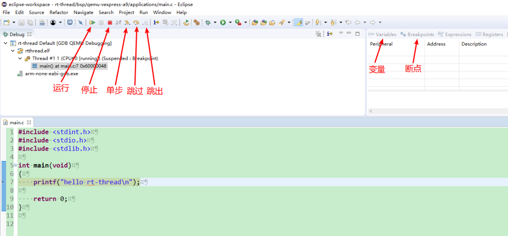

可以使用快捷键 `Ctrl+Shift+r` 查看其他源文件内容。

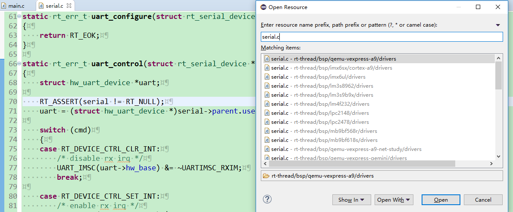

## 参考资料

* [《Env 用户手册》](../../../../programming-manual/env/env.md)
