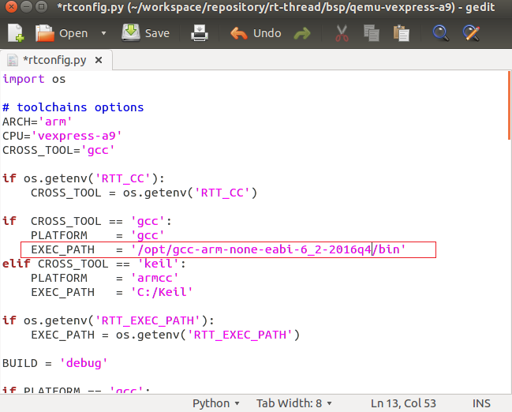
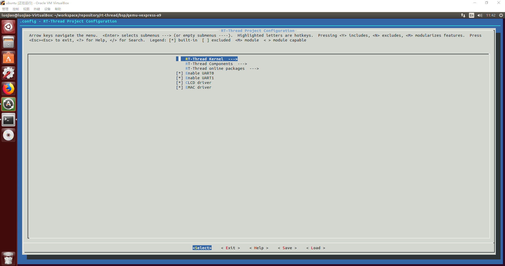
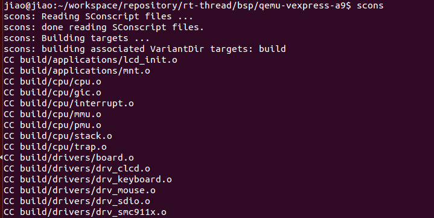
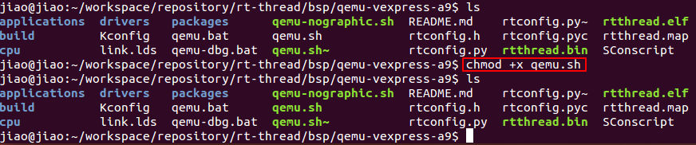
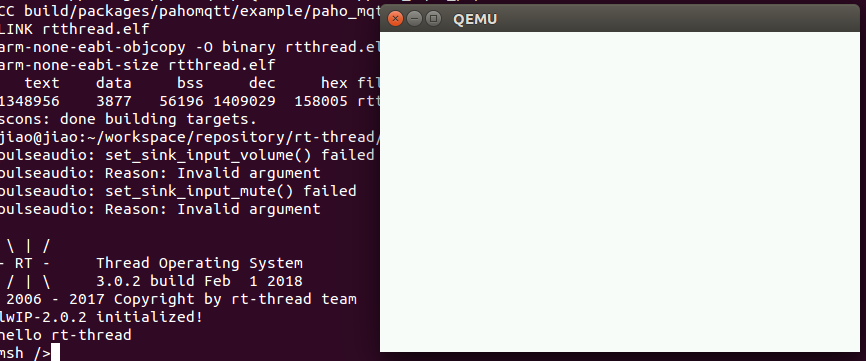

# 在 Ubuntu 平台开发 RT-Thread

本文描述了如何在 Ubuntu 平台使用 QEMU 运行 RT-Thread qemu-vexpress-a9 BSP 工程。

## 简介

嵌入式软件开发离不开开发板，在没有物理开发板的情况下，可以使用 QEMU 等类似的虚拟机来模拟开发板。QEMU 是一个支持跨平台虚拟化的虚拟机，它可以虚拟很多开发板。为了方便大家在没有开发板的情况下体验 RT-Thread，RT-Thread 提供了 QEMU 模拟的 ARM vexpress A9 开发板的板级支持包 (BSP)。

本文主要介绍在 Ubuntu 平台使用 QEMU 运行 RT-Thread qemu-vexpress-a9 BSP 工程。

## 准备工作

### 安装环境

* 下载 RT-Thread 源码，使用命令：

```
git clone https://github.com/RT-Thread/rt-thread.git
```

* 安装 QEMU，使用命令：

```
sudo apt-get install qemu-system-arm
```

* 安装 Scons，使用命令：

```
sudo apt-get install scons
```

* 安装编译器。使用 apt-get 命令安装的编译器版本太旧会导致编译报错，可依次使用如下命令下载安装新版本，下载链接和解压文件夹名因下载版本而异：

```
tom@laptop:~$ cd /tmp/
tom@laptop:/tmp$ wget https://armkeil.blob.core.windows.net/developer/Files/downloads/gnu-rm/6-2016q4/gcc-arm-none-eabi-6_2-2016q4-20161216-linux.tar.bz2
tom@laptop:/tmp$ tar xf ./gcc-arm-none-eabi-6_2-2016q4-20161216-linux.tar.bz2
tom@laptop:/tmp$ mv gcc-arm-none-eabi-6_2-2016q4/ /opt/
tom@laptop:/tmp$ /opt/gcc-arm-none-eabi-6_2-2016q4/bin/arm-none-eabi-gcc --version
```

以上命令下载编译器，并安装到 `/opt/gcc-arm-none-eabi-6_2-2016q4/` 。如果最后输出结果如下，则安装完成：

```
arm-none-eabi-gcc (GNU Tools for ARM Embedded Processors) 6.2.1 20161205 (release) [ARM/embedded-6-branch revision 243739]
Copyright (C) 2016 Free Software Foundation, Inc.
This is free software; see the source for copying conditions.  There is NO
warranty; not even for MERCHANTABILITY or FITNESS FOR A PARTICULAR PURPOSE.
```

*  安装 ncurses 库，使用命令：

```
sudo apt-get install libncurses5-dev
```

### 配置 rtconfig.py

编译器安装好以后需要修改源码中的 `bsp/qemu-vexpress-a9/rtconfig.py` 文件，修改 gcc 链接的路径为刚才安装路径，如将 `EXEC_PATH   = '/usr/bin'` 改为：

```
EXEC_PATH   = '/opt/gcc-arm-none-eabi-6_2-2016q4/bin'
```

如下：



## 使用 menuconfig 配置工程

1、在 qemu-vexpress-a9 BSP 根目录输入

```
scons --menuconfig
```

此命令开启配置界面，配置操作和 Window 平台一样:



2、使用 `scons --menuconfig` 命令后会安装及初始化 Env 工具，并在 home 目录下面生成 “.env” 文件夹，此文件夹为隐藏文件夹，切换到 home 目录，使用 `ls` 命令可查看所有目录和文件。

```
$ ls ~/.env
env.sh  local_pkgs  packages  tools
```

运行 env.sh 会配置好环境变量，让我们可以使用 `pkgs` 命令来更新软件包，执行

```
$ source ~/.env/env.sh
```

若已经选择了在线软件包，就可以使用 `pkgs --update` 命令下载软件包到 BSP 目录下的 packages 文件夹里：

```
$ pkgs --update
```

## 编译和运行 RT-Thread

1、在 qemu-vexpress-a9 BSP 目录下输入 `scons` 命令编译工程：



2、输入 ls 命令查看 BSP 下面的文件明细，绿色显示的文件是有执行权限的文件，我们需要给 qemu.sh 文件新增执行权限，输入 `chmod +x qemu.sh` 命令：



3、输入 `./qemu.sh` 命令执行脚本文件，这时候虚拟机便运行起来，如下图所示，命令行显示了 RT-Thread 操作系统启动过程所打印的相关信息，弹出的窗口为虚拟的 LCD 屏。



## 参考资料

* [《Env 用户手册》](../../../../programming-manual/env/env.md)

