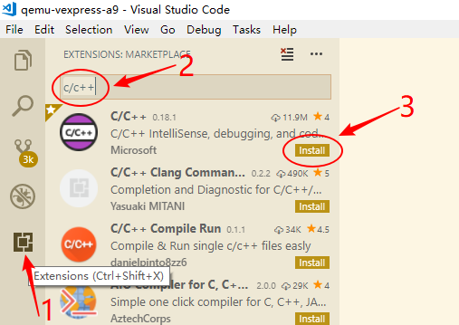
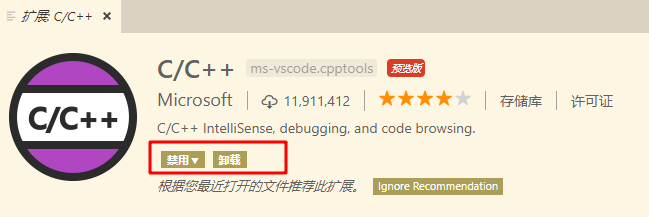
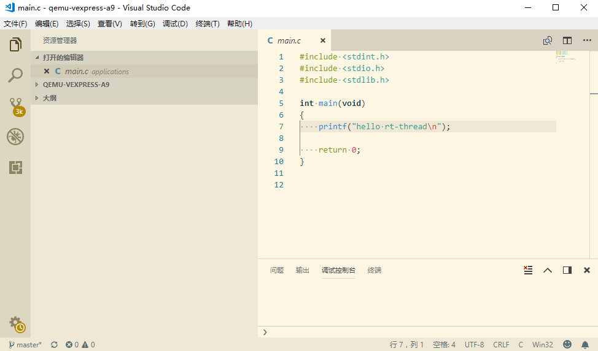

# 使用 VS Code 开发 RT-Thread #

本文描述了在 Windows 平台使用 VS Code 开发 RT-Thread qemu-vexpress-a9 BSP 工程。

## 简介

VS Code（全称 Visual Studio Code）是一个轻量且强大的代码编辑器，支持 Windows，OS X 和 Linux。内置 JavaScript、TypeScript 和 Node.js 支持，而且拥有丰富的插件生态系统，可通过安装插件来支持 C++、C#、Python、PHP 等其他语言。

本文准备资料如下：

* [RT-Thread 源码](https://www.rt-thread.org/page/download.html)

* [Env 工具](https://www.rt-thread.org/page/download.html)

* [VS Code](https://code.visualstudio.com/Download)

## 步骤一 安装调试插件

在 VS Code Extensions 里下载并安装支持 C/C++ 的调试插件：



安装好后确认插件为以下状态，如果不是则点击重新加载：



## 步骤二  打开 VS Code 项目工程

在 Env 控制台进入 qemu-vexpress-a9 BSP 根目录，然后输入命令 `code .` (**注意：code 后面有一个点**)打开 VS Code，表示使用 VS Code 打开当前目录。


VS Code 打开后会自动打开 qemu-vexpress-a9 BSP 文件夹，如下图所示。



## 步骤三  编译 RT-Thread

点击 VS Code “查看 -> 终端” 打开 VS Code 内部终端，在终端里输入命令 `scons` 即可编译工程，终端会打印出编译信息。


编译完成后输入 `.\qemu.bat` 命令就可以运行工程。终端会输出 RT-Thread 启动 logo 信息，QEMU 也运行了起来。


> [!NOTE]
> 注：1、调试 BSP 工程前需要先编译工程生成 rtthread.elf 文件。
    2、可以使用 `scons --target=vsc -s` 命令更新 VS Code 需要用到的 C/C++ 头文件搜索路径信息。不是每次都需要更新，只有在使用了 menuconfig 重新配置了 RT-Thread 或更改了 rtconfig.h 头文件时才需要。

## 步骤四 修改 qemu-dbg.bat 文件

开始调试前需要编辑 `qemu-vexpress-a9` 目录下的 `qemu-dbg.bat` 文件，在 qemu-system-arm 前加入 start :

```bash
@echo off
if exist sd.bin goto run
qemu-img create -f raw sd.bin 64M

:run
start qemu-system-arm -M vexpress-a9 -kernel rtthread.elf -serial stdio -sd sd.bin -S -s

```

## 步骤五 调试工程

如下图所示，在 VS Code 里点击调试菜单（小虫子图标），调试平台选择 Windows，然后按 F5 就可以开启 QEMU 调试模式，断点停留在 main 函数。VS Code 调试选项如下图所示：


QEMU 也运行了起来，如下图所示。


在 VS Code 里可以使用 GDB 命令，需要在最前面加上 `-exec`。 例如 `-exec info registers` 命令可以查看寄存器的内容：


其他一些主要命令介绍如下所示：

查看内存地址内容：`x/<n/f/u> <addr>`，各个参数说明如下所示：

* n 是一个正整数，表示需要显示的内存单元的个数，也就是说从当前地址向后显示几个内存单元的内容，一个内存单元的大小由后面的 u 定义
* f 表示显示的格式，参见下面。如果地址所指的是字符串，那么格式可以是 s。其他格式如下表所示：

| 参数        | 描述               |
| ------------- | --------------- |
| x             | 按十六进制格式显示变量   |
| d             | 按十进制格式显示变量     |
| u             | 按十六进制格式显示无符号整型            |
| o             | 按八进制格式显示变量 |
| t             | 按二进制格式显示变量 |
| a             | 按十六进制格式显示变量 |
| c             | 按字符格式显示变量 |
| f             | 按浮点数格式显示变量 |

* u 表示从当前地址往后请求的字节数，如果不指定的话，GDB 默认是 4 个 bytes。u 参数可以用下面的字符来代替，b 表示单字节，h 表示双字节，w 表示四字 节，g 表示八字节。当我们指定了字节长度后，GDB 会从指内存定的内存地址开始，读写指定字节，并把其当作一个值取出来。
* addr 表示一个内存地址。

> [!NOTE]
> 注：严格区分 n 和 u 的关系，n 表示单元个数，u 表示每个单元的大小。

示例: `x/3uh 0x54320` 表示从内存地址 0x54320 读取内容，h 表示以双字节为一个单位，3 表示输出三个单位，u 表示按十六进制显示。

* 查看当前程序栈的内容: x/10x $sp--> 打印 stack 的前 10 个元素
* 查看当前程序栈的信息: info frame----list general info about the frame
* 查看当前程序栈的参数: info args---lists arguments to the function
* 查看当前程序栈的局部变量: info locals---list variables stored in the frame
* 查看当前寄存器的值：info registers(不包括浮点寄存器) info all-registers(包括浮点寄存器)
* 查看当前栈帧中的异常处理器：info catch(exception handlers)

> 提示：输入命令时可以只输入每个命令的第一个字母。例如：`info registers` 可以只输入 `i r`。

> [!NOTE]
> 注：如果在 VS Code 目录中额外添加了文件夹，会导致调试不能够启动。
    每次开始调试都需要使用 Env 工具在 BSP 根目录使用`code .`命令打开 VS Code 才能正常调试工程。

## 参考资料

* [《Env 用户手册》](../../../../programming-manual/env/env.md)

## 常见问题

### Env 工具的相关问题请参考《Env 用户手册》常见问题小节。

### Q: 提示找不到 ‘qemu-system-arm’。

**A:** 直接打开 VS Code 调试工程会有这个错误，**每次调试请使用 Env 工具在 BSP 根目录使用`code .`命令打开 VS Code** 。

### Q: VS Code 调试选项没有出现 Debug@windows选项或者其他不能调试问题。

**A:** 请更新 RT-Thread 源代码到 v3.1.0 及以上版本。

### Q: VS Code 出现错误提示：Unable to start debugging.Unexpected GDB output from command "-interpreter-exec console" ........

**A:** 请修改 qemu-dbg.bat 文件，特别是有更新源代码的情况下。有问题请按照文档步骤检查一遍是否每一步都做了。
