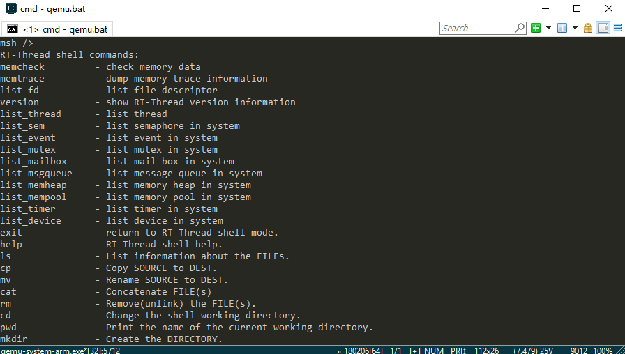
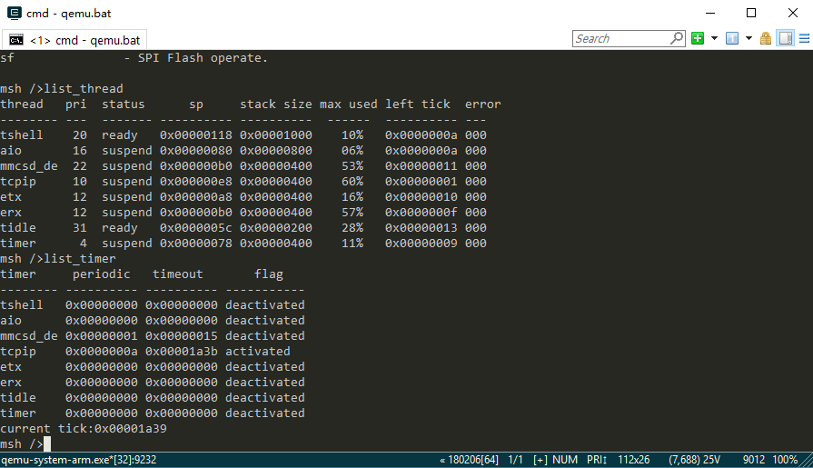
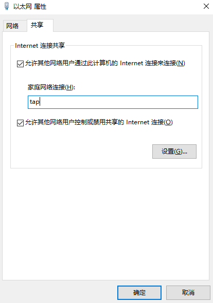

# 在 Window 平台使用 QEMU 运行 RT-Thread

本文描述了如何在 Window 平台使用 QEMU 运行 RT-Thread qemu-vexpress-a9 BSP 工程。

## 本文的目的和结构

### 本文的目的和背景

嵌入式软件开发离不开开发板，在没有物理开发板的情况下，可以使用 QEMU 等类似的虚拟机来模拟开发板。QEMU 是一个支持跨平台虚拟化的虚拟机，它可以虚拟很多开发板。为了方便大家在没有开发板的情况下体验 RT-Thread，RT-Thread 提供了 QEMU 模拟的 ARM vexpress A9 开发板的板级支持包 (BSP)。

本文主要介绍在 Window 平台使用 QEMU 运行 RT-Thread qemu-vexpress-a9 BSP 工程，并介绍了如何使用虚拟网卡连接 QEMU 到网络。

### 本文的结构

本文介绍了 qemu-vexpress-a9 BSP 在 Window 平台的使用明细。

## 准备工作

* [下载 RT-Thread 源码](https://www.rt-thread.org/page/download.html)，推荐下载3.1.0及以上版本。

* 下载 RT-Thread Env 工具，推荐下载1.0.0及以上版本。参考编程指南-《Env 用户手册了解如何下载及使用。

RT-Thread 提供的 QEMU 模拟的 ARM vexpress A9 开发板的板级支持包 (BSP) 位于 RT-Thread 源码 BSP 目录下的 qemu-vexpress-a9 文件夹，此 BSP 实现了 LCD、键盘、鼠标、SD 卡、以太网卡、串口等相关驱动，文件夹内容如下图所示。

qemu-vexpress-a9 BSP 主要文件及目录描述如下所示：

| 文件 / 目录        | 描述               |
| ------------- | --------------- |
| .vscode       | vscode 配置文件   |
| applications  | 用户应用代码目录   |
| cpu           | 芯片相关          |
| drivers       | RT-Thread 提供的底层驱动 |
| qemu.bat      | Windows 平台运行脚本文件 |
| qemu.sh       | Linux 平台运行脚本文件 |
| qemu-dbg.bat  | Windows 平台调试脚本文件 |
| qemu-dbg.sh   | Linux 平台调试脚本文件 |
|  README.md    | BSP 说明文件 |
| rtconfig.h    | BSP 配置头文件 |

## 编译和运行工程

### 步骤一 使用 scons 命令编译工程

打开 Env 文件夹，双击 env.exe 文件打开 Env 控制台：

在 Env 控制台下切换目录，输入命令 `cd D:\repository\rt-thread\bsp\qemu-vexpress-a9` 切换到 RT-Thread 源码文件夹下的 qemu-vexpress-a9  BSP 根目录，然后输入 `scons` 命令编译工程，如果编译正确无误，会在 BSP 目录下生成 QEMU 下运行的 rtthread.elf 目标文件。

### 步骤二 使用 qemu.bat 命令运行工程

编译完成后输入 `qemu.bat` 启动虚拟机及 BSP 工程，qemu.bat 是 Window 批处理文件，此文件位于 BSP 文件夹下，主要包括 QEMU 的执行指令，第一次运行工程会在 BSP 文件夹下创建一份空白的 sd.bin 文件，这是虚拟的 sd 卡，大小为 64M。Env 命令行界面显示 RT-Thread 系统启动过程中打印的初始化信息及版本号信息等，qemu 虚拟机也运行起来了。如下面图片所示：

**注意事项：**若电脑安装有 360 安全卫士会有警告，请点击允许程序运行。

## 运行 Finsh 控制台

RT-Thread 支持 Finsh，用户可以在命令行模式使用命令操作。输入 `help` 或按 tab 键可以查看所有支持的命令。如下图所示，左边为命令，右边为命令描述。

如下图所示，比如输入`list_thread`命令可以查看当前运行的线程，以及线程状态和堆栈大小等信息。输入`list_timer`可以查看定时器的状态。

## 运行文件系统

输入 `list_device` 可以查看注册到系统的所有设备。如下面图片所示可以看到虚拟的 sd 卡 “sd0” 设备，接下来我们可以使用 `mkfs sd0` 命令格式化 sd 卡，执行该命令会将 sd 卡格式化成 FatFS 文件系统。FatFs 是专为小型嵌入式设备开发的一个兼容微软 fat 的文件系统，采用 ANSI C 编写，采用抽象的硬件 I/O 层以及提供持续的维护，因此具有良好的硬件无关性以及可移植性。

了解 FatFS 详细信息请点击链接：<http://elm-chan.org/fsw/ff/00index_e.html>

第一次格式化 sd 卡后文件系统不会马上装载上，第二次启动才会被正确装载。我们退出虚拟机，然后在 Env 命令行界面输入 `qemu.bat` 重新启动虚拟机及工程，输入 `ls` 命令可以看到新增了 Directory 目录，文件系统已经装载上，然后可以使用 RT-Thread 提供的其他命令体验文件系统

## 运行网络功能

### 步骤一 安装和配置 TAP 网卡

1、下载 TAP 网卡  [tap-windows-9.21.2.exe](https://pan.baidu.com/s/1h2BmdL9myK6S0g8TlfSW0g)。下载好后双击安装程序，默认安装即可。

2、打开网络和共享中心更改适配器设置，将安装的虚拟网卡重命名为 tap，如下图所示：

 

**方法A:**右键当前能上网的网络连接（本文使用以太网），打开属性 -> 共享，选择家庭网络连接为 tap，点击确定完成设置，如下图所示：

 

 **方法B：**也可以将一个能正常连接网络的物理网卡与 tap 进行桥接，桥接成功后会出现一个网桥。如下面图片所示：

**注意事项：** tap 网卡和 VMware 的虚拟网卡可能会冲突，如果出现无法开启网络共享，或者 ping 不通网络的情况，请在删除 VMware 虚拟网卡之后再尝试一次。

### 步骤二 修改 qemu.bat 脚本文件

打开 qemu-vexpress-a9 BSP 目录下的 qemu.bat 文件，在下图所示位置添加以下配置内容：

`-net nic -net tap,ifname=tap`

其中 ifname=tap 的意思是网卡的名称是 tap。

### 步骤三 查看 IP 地址

输入 `qemu.bat` 命令运行工程，在 shell 中输入 `ifconfig`命令查看网络状态，正常获取到 IP 即表示网络驱动正常，配置工作完成，效果如下图所示：

### 注意事项

* 当出现获取不到 IP 地址的情况时，先将以太网的共享关闭，然后再次打开即可。

* 如果获取到的 IP 是 10.0.x,x，是因为没有为 QEMU 添加启动参数  `-net nic -net tap,ifname=tap` 。

* 虚拟机刚开始运行的时候并不会立刻获取到 IP 地址，有时需要等待几秒钟才会获取到 IP。

* 关闭虚拟机可以按 Ctrl + 'C' 来结束程序运行。

## 运行 Ping 工具

### 步骤一 下载网络工具软件包

1、在路径`bsp\qemu-vexpress-a9`下打开 Env 工具，执行 menuconfig，如下图所示:

2、在 RT-Thread online packages->IoT - internet of things 页面打开 netutils: Networking utilities for RT-Thread 功能，如下图所示：

 

3、进入 netutils: Networking utilities for RT-Thread 页面，打开 Enable Ping utility 功能，如下图所示：

 

4、保存并退出配置界面。如果没有开启 Env 自动更新软件包功能的话，需要输入 `pkgs --update` 更新软件包配置。更新完成后使用 scons 命令重新编译工程，如下图所示：

5、编译完成之后运行 qemu.bat 文件，如下图所示：

### 步骤二 运行 ping 工具

在 shell 中输入 `ifconfig`命令查看网络状态，正常获取到 IP 即表示网络驱动正常：

在 shell 中输入 ping www.rt-thread.com 可以看到 ping 通的返回结果， 表示网络配置成功，能够 ping 通，如下图所示：

## 运行 GUI 引擎

### 步骤一 下载 GUI 引擎软件包

关掉 QEMU 虚拟机，回到 ENV 控制台，输入 `menuconfig` 命令进入配置界面:

进入 “RT-Thread oneline packages” → “system packages”  →  “RT-Thread GUI Engine” 子菜单，选中 “Enable GUI Engine” 和“Enable the example of GUI Engine”：

按‘→’键选中 “save” 保存配置，并按 “Exit” 键退出配置界面，回到命令行界面，输入 `pkgs --update` 下载 GUI 软件包及示例代码：

### 步骤二 运行 GUI 引擎

软件包下载完成后输入 `scons` 重新编译工程：

编译完成后输入 `qemu.bat` 命令启动 QEMU 虚拟机及工程，可以看到 QEMU 虚拟的显示屏上显示了示例代码展示的图片、文字和图形信息：

## 参考资料

* 《Env 用户手册》

* 《文件系统》

## 常见问题

* **Env 工具的相关问题请参考编程指南-《Env 用户手册》章节。**

* **编译工程提示 fatal error: rtgui/driver.h: No such file or directory**

> 提示：解决方法：使用 menuconfig 使能 “Enable GUI Engine”后需要使用命令`pkgs --update`下载 GUI 软件包。

