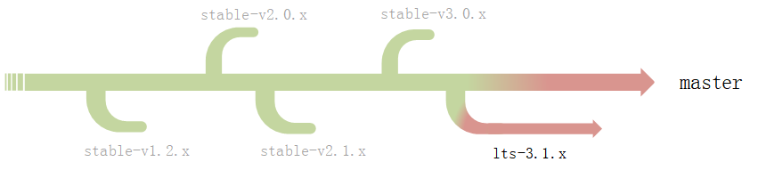

# 如何选择合适的 RT-Thread 版本进行开发？

RT-Thread 是以 Apache License v2 开源许可发布的物联网操作系统。RT-Thread 有十多年的历史，在开发过程中也放在 Github 上由大家协同开发，并发布一个个版本，导致了不同人群面对多样的版本无从下手，此文档将说明如何选择一个合适自己的版本进行开发。

RT-Thread 的版本 / 分支有以下几种可供选择：

开发分支（master 主分支）、长期支持分支（lts-v3.1.x 分支）、发布版本（release），**推荐用户使用已发布的版本**。

## RT-Thread 分支与版本介绍

**分支情况**：迄今为止，RT-Thread 已经存在的分支有：

- stable-v1.2.x（已不维护）
- stable-v2.0.x（已不维护）
- stable-v2.1.x（已不维护）
- stable-v3.0.x（已不维护）
- lts-v3.1.x（长期支持、维护）
- master（master 主分支是 RT-Thread 开发分支，一直活跃）

当有较大的版本变化时（如 3.0.x 更新为 3.1.x，或者是主版本变化时），此时会在 master 分支上建立一个新分支对旧版本进行维护。

**版本发布**：RT-Thread 已发布版本众多，如 3.1.1、3.1.2、4.0.0 发布版等等。新版本是基于 master 主分支或者基于正在维护的分支进行发布的。

例如长期支持分支 lts-v3.1.x，最新发布版是 3.1.2，之后还可能会发布 3.1.3、3.1.4、... 等版本，但是该分支上不会发布 3.2.x 版本。

例如当前 master 分支的版本是 4.0.1，最新发布版本是 4.0.0，之后也可能会发布 4.0.1、4.0.2、... 等版本。若待到有较大版本变化时，比如发布 4.1.0 时，此时就会建立 4.0.x 分支，对 4.0.x 进行维护。

**分支图**：

## 如何选择

### 发布版本（GitHub releases）

发布版本位于 [GitHub releases](https://github.com/RT-Thread/rt-thread/releases)，其中包含 RT-Thread 所有的发布版本。发布版本稳定性高，推荐使用最新发布版本。最新的发布版本有两个：3.1.2 版本与 4.0.0 版本，这两个发布版本可以根据自己需求进行选择。

**发布版本 3.1.x：**

- 做产品 / 项目：适合公司做产品或者项目
  - 若产品已经使用的是较早的发布版本，那么在维护产品时，建议仍然在旧的版本上进行维护
  - 如果是新的产品，那么建议使用 3.1.x 最新发布版本
- 学习 / 研究：适合新手入门学习

**发布版本 4.0.x：**

- 做产品 / 项目：适合公司做产品或者项目
  - 4.0.x 支持 SMP，适合有多核需求的产品或项目
- 学习 / 研究：适合新手入门学习、适合有入门经验的 RT-Thread 开发者

### 开发分支（GitHub master 主分支）

开发分支是 RT-Thread 团队在开发中过程中提交的代码的分支，位于 [GitHub master 分支](https://github.com/RT-Thread/rt-thread/tree/master)。该分支会一直更新迭代、优化功能，并且更新频率非常高。

- 做产品 / 项目：开发中的分支不稳定，不适合做产品或者用于项目中
- 学习 / 研究：由于更新速度快，适合有较多经验的 RT-Thread 开发者研究尝鲜
- 代码贡献：可以提交代码或者修补 Bug，欢迎广大开发者 [为 RT-Thread 贡献代码](https://www.rt-thread.org/document/site/development-guide/github/github/)，成为 RT-Thread 贡献者

### 长期支持分支（GitHub lts-v3.1.x 分支）

长期支持分支位于 [GitHub lts-v3.1.x 分支](https://github.com/RT-Thread/rt-thread/tree/lts-v3.1.x)，是 3.1.x 版本的维护分支，主要在于修复 Bug 以及 BSP 的更新。由于从 4.0.0 开始，增加了较多特性，如 SMP、lwp等，对于 3.1.x 来说有非常大的变化，所以对 3.1.x 会做长期的支持。

- 做产品 / 项目：开发中的分支不稳定，不适合做产品或者用于项目中
- 学习 / 研究：适合有较多经验的 RT-Thread 开发者

### Gitee 镜像源
由于 Github 在中国大陆访问不稳定，下载速度较慢，用户可以使用到 RT-Thread Gitee 仓库来下载 [发行版本](https://gitee.com/rtthread/rt-thread/tags)。

