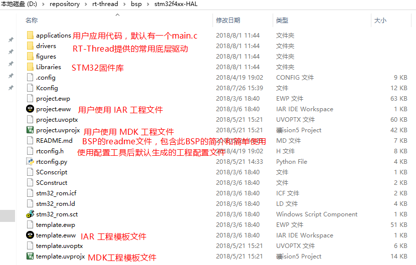

# RT-Thread 源码下载应用笔记 #

本文将详细介绍如何获取 RT-Thread 源代码。

## 简介

RT-Thread 源代码托管在 GitHub，对于不熟悉 GitHub 的新手，初次接触 RT-Thread 不知道如何从 GitHub 获取 RT-Thread 源代码。本文档将一步步介绍如何从 GitHub 获取 RT-Thread 源代码。

## RT-Thread 源代码下载链接 ##

**前提条件：安装好 Git ，git clone 命令需要用到 Git 工具。请参考文档[Git 安装应用笔记][Git 安装应用笔记]。**

在 [RT-Thread 官网](https://www.rt-thread.org/)提供了3种 RT-Thread 源代码的下载链接。

1、GitHub 的下载链接：https://github.com/RT-Thread/rt-thread

2、Gitee 的下载链接：https://gitee.com/rtthread/rt-thread

3、百度网盘的下载链接：https://pan.baidu.com/s/1mgIAyWo#list/path=%2F

百度网盘包含 RT-Thread 发布的各个版本源代码压缩包，压缩包不包括 RT-Thread 项目版本的历史记录。

Gitee 的源码是 GitHub 的镜像，会及时自动和 GitHub 保持同步，从这2个地方下载源代码都有2种方式，一种是复制 RT-Thread 项目仓库地址后使用 git clone 命令下载，另外一种是直接下载 RT-Thread 项目压缩包。两者的差别是后者不包括 RT-Thread 项目版本的历史记录，而前者会在本地创建一个本地仓库，并且包含 RT-Thread 项目所有版本的历史记录，并且可以直接使用 Git 工具对这个本地仓库进行管理，**强烈建议使用 git clone 命令下载 RT-Thread 源代码**。

Gitee 和 GitHub 2种下载方式如下面2张图所示，可以通过点击对应链接进入下载页面。

## RT-Thread源代码下载 ##

如上图所示复制 GitHub 上 RT-Thread 项目仓库地址后，打开 windows 命令行工具 或者Git Bash，切换到你想要放置源代码的目录，注意目录路径中不可以有中文字符或者空格，否则影响后续 Env 工具的使用。然后使用`git clone https://github.com/RT-Thread/rt-thread.git`命令克隆 RT-Thread 远程仓库到本地，如下图所示使用 git clone命令后将在 D盘的repository 目录下创建 rt-thread目录。

由于国外服务器 GitHub 下载代码速度较慢，建议从 Gitee 下载，可以很快就下载好 RT-Thread 源代码，如上图所示复制 Gitee 上 RT-Thread 项目仓库地址后，同样使用git clone命令下载代码，只是仓库地址为 RT-Thread 项目在 Gitee 的仓库地址。使用`git clone https://gitee.com/rtthread/rt-thread.git`命令克隆 RT-Thread 远程仓库到本地。

如果想要修改从 Gitee 克隆的本地 RT-Thread 仓库对应的远程仓库为 GitHub 上的仓库，可以按照下图所示修改，打开本地 RT-Thread 仓库 .git 目录里的config文件，修改 url 地址为 GitHub 上 RT-Thread 项目仓库地址。

说明：RT-Thread 源代码下载包较大，因其包含有将近 90 个 BSP（实际你只需要提取自己的板卡对应的 BSP 即可），而 Git 仓库不提供单独下载某个文件，请下载源码时多一些耐心。

## RT-Thread 源代码目录简介 ##

RT-Thread 源代码目录结构如下图所示：

| **目录名** | **描述** |
| -------- | -------- |
|    BSP          |  Board Support Package（板级支持包）基于各种开发板的移植 |
|    components    | RT-Thread 的各个组件代码，例如 finsh，gui 等。        |
|    documentation | 相关文档，如编码规范等         |
|    examples      |  相关示例代码        |
|    include       |  RT-Thread 内核的头文件。        |
|    libcpu        |  各类芯片的移植代码。        |
|    src           |  RT-Thread 内核的源文件。       |
|    tools         |  RT-Thread 命令构建工具的脚本文件。  |

## RT-Thread BSP 介绍 ##

目前 RT-Thread 已经针对将近90种开发板做好了移植，大部分 BSP 都支持 MDK﹑IAR开发环境和GCC编译器，并且已经提供了默认的 MDK 和 IAR 工程，用户可以直接基于这个工程添加自己的应用代码。 每个 BSP 的目录结构都类似，大部分 BSP 都提供一个 README.md 文件，这是一个 markdown 格式的文件，包含了对这个 BSP 的基本介绍，以及怎么样简单上手使用这个BSP，相当于是这份BSP的使用说明。大家找到对应的 BSP 以后首先应该看一下这份使用说明，才能少走弯路，快速的把RT-Thread 操作系统跑起来。下图是 stm32f4xx-HAL BSP 的目录描述。

双击打开 stm32f4xx-HAL BSP 下的MDK 工程文件 project.uvprojx 。

在工程主窗口的左侧 “Project” 栏里可以看到该工程的文件列表，这些文件被分别存放到如下几个组内，其他 BSP 提供的工程文件也是类似的分组方式。

| 目录组        | 描述               |
| ------------- | --------------- |
| Drivers       | 对应的目录为 stm32f4xx-HAL/drivers，它用于存放根据RT-Thread 提供的驱动框架实现的底层驱动代码。 |
| CMSIS         |  对应目录为 stm32f4xx-HAL/Libraries/CMSIS， stm32 CMSIS系统文件。  |
| STM32F4XX_HAL_Driver | 对应的目录为 stm32f4xx-HAL/Libraries/STM32F4xx_HAL_Driver，它用于存放 STM32 的固件库文件。 |
| Applications  | 对应的目录为 stm32f4xx-HAL/applications，它用于存放用户自己的应用代码。 |
| Kernel        | 对应的目录为 rt-thread/src，它用于存放 RT-Thread 内核核心代码。 |
| CORTEX-M4     | 对应的目录为 rt-thread/libcpu/arm，它用于存放 ARM Cortex-M4移植代码。 |
| DeviceDrivers | 对应的目录为 rt-thread/components/drivers，它用于存放 RT-Thread 驱动框架源代码。 |
| finsh         | 对应的目录为 rt-thread/components/finsh，它用于存放 RT-Thread finsh 命令行组件。 |
