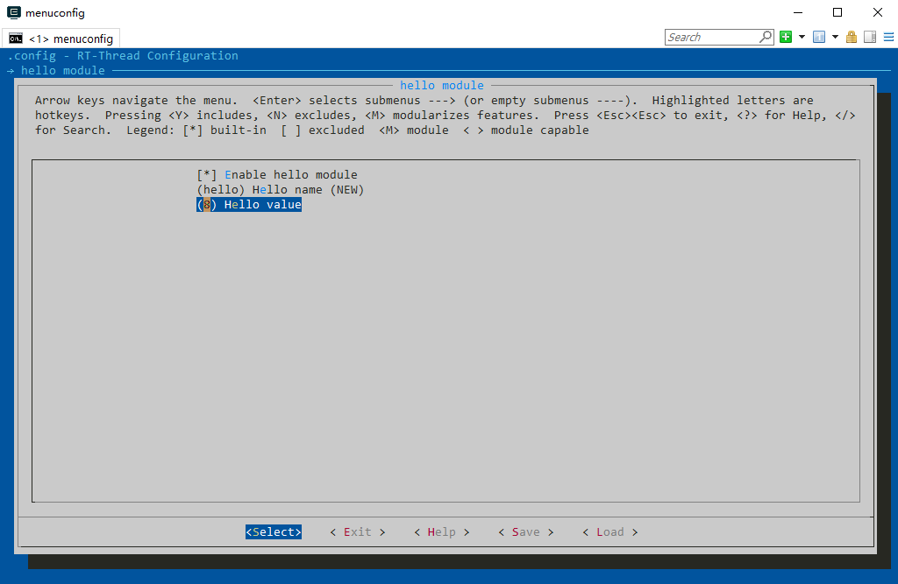

# 使用 Env 创建 RT-Thread 项目工程

本文用来指导用户按照标准方式创建和管理 RT-Thread 工程。

## 简介

RT-Thread 完全开源开放，支持几十款 BSP，支持多种编译器，支持众多基础组件以及数量持续增长的软件包，然而对于工程项目开发来说，只需要支持一款或者有限几款 MCU，使用一种熟悉的 IDE 开发环境，使用有限的外设和组件，本文档旨在指导用户在全功能 RT-Thread 版本基础上，根据项目需求搭建 RT-Thread 工程框架。

本文准备资料如下：

* [RT-Thread 源码](https://www.rt-thread.org/page/download.html)

* [Env 工具](https://www.rt-thread.org/page/download.html)

* 安装好 MDK 软件或者 IAR 软件。

## 标准工程管理

### 选择 BSP

用户获取 RT-Thread 源代码后需要根据自己手上的开发板型号找到对应的 BSP，就可以运行 BSP 提供的默认工程。大部分 BSP 都支持 MDK﹑IAR 开发环境和 GCC 编译器，并且已经提供了默认的 MDK 和 IAR 工程。

本文后续章节将使用正点原子潘多拉开发板演示相关操作，该开发板对应的 BSP 为 stm32l475-atk-pandora，默认使用串口 1 作为 shell 控制台输出使用串口。

### 搭建项目框架

在 BSP 目录下打开 Env 工具，运行 `scons --dist` 命令。使用此命令会在该 BSP 目录下生成 dist 目录，这便是开发项目的目录结构，RT-Thread 源码位于项目文件夹内，可以随意拷贝 dist 文件夹的工程到任何目录下使用。


进入dist目录下面的 stm32f4xx-HAL 工程目录，项目框架目录结构如下图所示：


项目框架主要目录及文件的说明如下表所示：

| 文件 / 目录        | 描述               |
| ------------- | --------------- |
| applications  | 用户应用代码目录   |
| drivers 或 board | RT-Thread 提供的底层驱动/板级相关的移植 |
| Libraries     | 芯片官网下载的固件库 |
| rt-thread     | RT-Thread 源代码 |
| Kconfig       | menuconfig 使用的文件 |
| project.ewww  | 用户使用的 IAR 工程文件 |
| project.uvprojx  | 用户使用的 MDK 工程文件 |
| template. uvprojx  | MDK 工程模板文件 |
| SConscript   | SCons 配置工具使用的文件 |
| SConstruct   | SCons 配置工具使用的文件 |
|  README.md    | BSP 说明文件 |
| rtconfig.h    | BSP 配置头文件 |

> [!NOTE]
> 注：此命令从 RT-Thread 3.1.0 正式版才开始支持。

### 修改工程模板

用户一般都需要根据自己的需求对工程做一些工程配置，比如配置 MCU 型号，设置调试选项等。建议大家直接修改工程模板，这样使用 Scons 相关命令生成的新工程也都会包含对模板的修改。MDK 的模板工程为 template.uvprojx。IAR 的模板工程为 template.eww。注意：直接双击打开 IAR 工程模板修改可能会导致生成的新工程低版本 IAR 软件用不了。

下图为修改 MDK 工程模板文件的芯片型号示例，选择相应 MCU 型号。


下图为根据自己使用的调试工具设置对应的调试选项，相关配置修改完成后就可以关闭模板工程。


> [!NOTE]
> 注：源代码和头文件路径的添加不建议直接修改工程模板，后面章节会介绍使用 Scons 工具往工程添加源代码及头文件路径。

### 配置和裁剪 RT-Thread

每个 BSP 下的工程都有默认的配置，比如系统内核支持的最大线程优先级、系统时钟频率、使用的设备驱动、控制台使用的串口等。RT-Thread 操作系统具有高度的可裁剪性，用户可以根据自己的需求使用 Env 工具进行配置和裁剪。

在 BSP 目录下打开 Env，然后在使用 `menuconfig` 命令打开配置界面。


menuconfig 常用快捷键如图所示：


### 使能在线软件包

下图使能了 mqtt 相关的软件包。


### 生成工程

选择软件包后需要使用 `pkgs --update` 命令下载软件包，然后使用`scons --target=mdk5` 命令或者 `scons --target=iar` 命令生成 MDK 或者 IAR 工程。如果大家直接修改 MDK 工程文件 project.uvprojx 或者 IAR 的工程文件 project.ewww 添加了自己的代码，或者修改了工程的一些基本配置，生成的新工程会覆盖之前对工程文件 project 的修改。


打开新生成的 MDK 工程 project.uvprojx ，可以看到我们选择的 paho mqtt 相关的软件包源文件已经被添加到了工程中。工程对应的芯片型号也是前文基于工程模板选择的芯片型号。


### 验证工程

编译工程，生成目标代码，然后就可以下载至开发板运行。本文使用终端软件 PuTTY 接收工程控制台对应串口 2 发送的数据，电脑右键→属性→设备管理器→端口（COM 和 LPT），即可查看串口对应的 COM 号，本文为 COM14。打开 PuTTY 按照下图配置，波特率一般配置为 115200。


点击 open 打开，重启开发板后会看到 RT-Thread 的启动 logo 信息。


### 添加文件到工程

BSP 下的 applications 文件夹用于存放用户自己的应用代码，目前只有一个 main.c 文件。如果用户的应用代码不是很多，建议相关源文件都放在这个文件夹下面，本文在 applications 文件夹下新增了 2 个简单的文件 hello.c 和 hello.h。

```c
/* file: hello.h */

#ifndef _HELLO_H_
#define _HELLO_H_

int hello_world(void);

#endif /* _HELLO_H_ */
```

```c
/* file: hello.c */
#include <stdio.h>
#include <finsh.h>
#include <rtthread.h>

int hello_world(void)
{
    rt_kprintf("Hello, world!\n");

    return 0;
}

MSH_CMD_EXPORT(hello_world, Hello world!)
```

那么用户如何加入自己的应用程序的初始化代码呢？RT-Thread 将 main 函数作为了用户代码入口，只需要在 main 函数里添加自己的代码即可。

```c
#include <rtthread.h>
#include <board.h>
#include "hello.h"

int main(void)
{
    /* user app entry */

    hello_world();

    return 0;
}
```

RT-Thread 还支持 finsh，提供一套供用户在命令行的操作接口，通过使用宏 `MSH_CMD_EXPORT()` 就可以新增一个自己命令，并可以在命令行端启动自己的应用代码。


> [!NOTE]
> 注：applications 文件夹下新增的 2 个文件需要使用 `scons --target=xxx` 命令生成新的工程，才会添加到工程项目中。每次新增文件都要重新生成工程。

下图为应用程序 hello_world() 的两种调用结果。


applications 文件夹下新增的文件是怎么样添加到工程中的呢？每个 BSP 的 applications 文件夹里都有一个 SConscript 文件，这些文件的功能都相似。RT-Thread 使用 SCons 构建系统，SCons 使用 SConscript 和 SConstruct 文件来组织源码结构。通常来说一个项目只有一个 SConstruct，但是会有多个 SConscript 。一般情况下，每个存放有源代码的子目录下都会放置一个 SConscript。

SConscript 文件是使用 Python 语言编写，stm32f4xx-HAL BSP 里面的 applications 文件夹里的 SConscript 文件的内容如下所示，# 号后面内容为注释。

```c
Import('RTT_ROOT')
Import('rtconfig')
from building import *

# str(Dir('#') 表示获取工程的 SConstruct 所在的目录, 也就是 D:\repository\rt-thread\bsp\stm32f4xx-HAL
# os.path.join() 表示将 `str(Dir('#')` 表示的目录和 applications 一起拼接成一个完整目录。
# 也就是获得当前目录 `D:\repository\rt-thread\bsp\stm32f4xx-HAL\applications`
cwd     = os.path.join(str(Dir('#')), 'applications')

# 获取当前目录下所有的 C 文件
src = Glob('*.c')

# 将当前目录和 SConstruct 所在的目录保存到 list 变量 CPPPATH 中
CPPPATH = [cwd, str(Dir('#'))]

# 将 src 包含的源文件创建为 Applications 组。depend 为空表示该组不依赖 rtconfig.h 中的任何宏。
# CPPPATH = CPPPATH 表示将右边 CPPPATH 变量包含的目录添加到系统的头文件路径中，左边的 CPPPATH 表示头文件路径。
# 这个 Applications 组也就对应 MDK 或者 IAR 工程里面的 Applications 分组。
group = DefineGroup('Applications', src, depend = [''], CPPPATH = CPPPATH)

Return('group')
```

通过这个 SConscript 文件，applications 目录下的所有源文件和相关头文件目录就添加到了工程中，而不需要用户手动添加。

### 添加模块到工程

前文提到在自己源代码文件不多的情况下，建议所有源代码文件都放在 applications 文件夹里面。如果用户源代码很多了，并且想创建自己的工程模块，或者需要使用自己获取的其他模块，怎么做会比较合适呢？前文对 applications 文件夹里的 SConscript 文件做了简单介绍，这一小节将简单演示怎么实现自己的  SConscript 文件来管理工程文件。

#### 添加源代码

同样以上文提到的 hello.c 和 hello.h 为例，需要把他们作为一个单独的模块管理，并且在 MDK 或者 IAR 的工程文件里有自己的分组，且可以通过 menuconfig 选择是否使用这个模块。在 BSP 下新增 hello 文件夹。


#### 编写 SConscript 文件

大家注意到文件夹里多了一个 SConscript 文件，如果想要将自己的一些源代码加入到 SCons 编译环境中，一般可以创建或修改已有 SConscript 文件。SConscript 文件可以控制源码文件的加入，并且可以指定文件的 Group（与 MDK/IAR 等 IDE 中的 Group 的概念类似）。对于这个新增的 hello 模块 SConscript 文件内容如下，# 号后面的内容为注释。

```c
# -*- coding: UTF-8 -*-             # 指定文件的编码格式是 UTF-8，文件可以用中文
Import('RTT_ROOT')
Import('rtconfig')
from building import *

cwd          = GetCurrentDir()      # 将当前路径赋值给字符串 cwd
include_path = [cwd]                # 将当前头文件路径保存到 list 变量 include_path 中
src          = []                   # 定义一个 list 变量 src

if GetDepend(['RT_USING_HELLO']):   # hello.c 依赖宏 RT_USING_HELLO
    src += ['hello.c']              # 保存 hello.c 字符串到 list 变量 src 中

# 将 src 包含的源文件创建为 hello 组。depend 为空表示该组不依赖 rtconfig.h 的任何宏。
# CPPPATH = include_path 表示将当前目录添加到系统的头文件路径中
group = DefineGroup('hello', src, depend = [''], CPPPATH = include_path)

Return('group')
```

通过上面几行简单的 python 代码就创建了一个新的 hello 分组，并且可以通过宏定义控制要加入到组里面的源文件。关于 SCons 的更多使用可以参考 [Scons 官方文档](https://scons.org/documentation.html) 或者参考 RT-Thread 提供的 [Scons 构建工具手册][Scons 构建工具手册]。

#### 增加 menuconfig 菜单

那么自定义宏 RT_USING_HELLO 又是通过怎样的方式定义呢？这里要介绍一个新的文件 Kconfig 。Kconfig 用来配置内核，menuconfig 命令通过读取工程的各个 Kconfig 文件，生成配置界面供用户配置内核 ，最后所有配置相关的宏定义都会自动保存到 BSP 目录里的 rtconfig.h 文件中，每一个 BSP 都有一个 rtconfig.h 文件，也就是这个 BSP 的配置信息。

在潘多拉 stm32l475-atk-pandora  BSP 目录下已经有了关于这个 BSP 的 Kconfig 文件，如果用户的 BSP 没有则可以自己新建一个。我们可以基于这个文件添加自己需要的配置选项。关于 hello 模块添加了如下配置选项，# 号后面为注释。


使用 Env 工具进入 stm32l475-atk-pandora BSP 目录后，使用 menuconfig 命令在主页面最下面就可以看到新增的 hello 模块的配置菜单，进入菜单后如下图显示。



我们还可以修改 hello value 的值。


保存配置后退出配置界面，打开 stm32l475-atk-pandora BSP 目录下的 rtconfig.h 文件可以看到 hello 模块的配置信息已经有了。


> [!NOTE]
> 注：每次 menuconfig 配置完成后要使用 `scons --target=XXX` 生成新工程。


打开新生成的 MDK5 工程文件 project.uvprojx 后可以看到新增一个 hello 分组，以及此分组下包含的 hello.c 文件。


## 参考资料

* [《Env 用户手册》](../../../../../development-tools/env/env.md)

* [《Scons 构建工具》](../../../../../development-tools/scons/scons.md)
