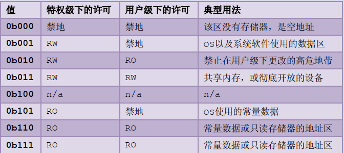

# ARM-MPU 详解

## 简介

MPU(Memory Protection Unit) 内存保护单元。 本文主要讲 armv7-m 架构 架构下的 MPU。在 armv7-m 架构下，Cortex-M3 和 Cortex-M4 处理器对 MPU 都是选配的，不是必须的。

MPU 是一个可以编程的 device 设备，可以用来定义内存空间的属性，比如特权指令和非特权指令以及 cache 是否可访问。armv7-m 通常支持 8 个 region。一个 region 就代表一段连续的区域。

MPU 可以让嵌入式系统更加健壮，以及保护一些加密区域，可以用来防止黑客攻击。

MPU 有以下能力可以增加系统的健壮性：

- 可以阻止用户去破坏操作系统需要使用的数据
- 可以防止一个任务去非法访问其他任务的数据，将任务完全隔离开
- 可以把关键数据区设为只读，从而不被破坏
- 检测其他意外访问，比如，堆栈溢出，数组越界等。

## 原理讲解

通常 MPU 功能这个是由操作系统提供的服务。在嵌入式调试的时候，我们经常会遇到 hardfault，这个时候一般情况可能是某个指针指到未知的地方，然后对该地址进行修改赋值，会触发 hardfault。MPU 的功能其实和这个功能基本类似。

首先理解以下两点，基本上可以大概理解 MPU：

1. MPU 可以定义某些特定的地址区域的属性，这个属性可以定义成很多类型，比如定义成非特权状态下不可以赋值
2. 如果非特权指针不小心访问到这个地址区域并且尝试给该区域赋值修改，这个时候会触发 MemManage fault 或者 hardfault 中断，代表你的程序不被允许修改该区域。

MPU 本质上就是为了保护某一段地址区域不被非授权状态的程序进行访问。

比如，RTOS 中的一些特殊的变量，用户线程是不被允许访问和修改的，这个时候如果你启用了 MPU，并且保护了这些变量，那用户即使知道这里的实际的物理地址，也是不被允许访问和修改的。

## MPU 寄存器模组

MPU 主要有以下寄存器

| 名称                             | 地址偏移   |
| -------------------------------- | ---------- |
| MPU 类型寄存器 TYPER               | 0xE000ED90 |
| MPU 控制寄存器 CTRL                | 0xE000ED94 |
| MPU region 号寄存器 RNR          | 0xE000ED98 |
| MPU region 基地址寄存器     RBAR | 0xE000ED9C |
| MPU region 属性寄存器     RASR       | 0xE000EDA0 |

### MPU_TYPER

MPU 类型寄存器主要表示这个 MCU 有几个 region：

| bit 位 | 名称     | 类型 | 描述                                 |
| ----- | -------- | ---- | ------------------------------------ |
| 15:8  | DREGION  | R    | MPU 支持的 data region 数量  通常为 0x08 |
| 0     | SEPARATE | R    | 分割标志，没有用，默认为 0            |

### MPU_CTRL

MPU 控制寄存器主要使能 MPU 等控制。

| bit 位 | 名称       | 类型 | 描述                                        |
| ----- | ---------- | ---- | ------------------------------------------- |
| 2     | PRIVDEFENA | R/W  | 是否为特权级打开缺省存储器映射              |
| 1     | HFNMIENA   | R/W  | 1: 在 hardfault 和 NMI 中默认使能 MPU（这个主要是在处理一些 hardfault 中断的时候，是否需要开启 MPU 保护对应的数据区域，默认是关闭的）。0: 在 hardfault 和 NMI 中默认不使能 |
| 0     | ENABLE     | R/W  | 置 1，使能 MPU                                |

PRIVDEFENA 这个 bit 参考下图：

- 如果 PRIVDEFENA=1 ，特权模式下打开背景 region。
- 如果 PRIVDEFENA = 0， 不打开背景 region。背景 region 如下图所示，就是 region 没有定义到的地方。


### MPU_RNR 和 MPU_RBAR

MPU region 号寄存器 (MPU_RNR) 和 MPU 基址寄存器 (MPU_RBAR)  通常成对使用。

**MPU_RNR**

| bit 位 | 名称   | 类型 | 描述                                                         |
| ----- | ------ | ---- | ------------------------------------------------------------ |
| 7:0   | region | R/W  | 选择下一个需要配置的 region, 因为通常只有 8 个 region，所以 2:0 位有效 |

**MPU_RBAR**

| bit 位 | 名称   | 类型 | 描述                                       |
| ----- | ------ | ---- | ------------------------------------------ |
| 31:N  | ADDR   | R/W  | REGION 的基地址。N>4                        |
| 4     | VALID  | R/W  | 决定是否理会写入 REGION 字段的值             |
| 3:0   | ENABLE | R/W  | MPU region 字段，valid=1 有效，valid=0 无效 |

从寄存器定义可以看出 region 的基地址最小单位为 64KB。所以你的基地址必须是像 0x10000， 0x20000 这样的地址才是合法的地址。这里主要定义 region 的起始地址。

### MPU_RASR

RASR 是 region 的属性和容量寄存器

| bit 位 | 名称       | 类型 | 描述                                                  |
| ----- | ---------- | ---- | ----------------------------------------------------- |
| 31:29 | 预留       | -    | -                                                     |
| 28    | XN         | R/W  |                                                       |
| 26:24 | AP         | R/W  | **访问许可属性**                                      |
| 21:19 | TEX        | R/W  | 类型拓展                                              |
| 18    | S          | R/W  | 是否可共享 （1= 可共享，0 = 不可共享）                  |
| 17    | C          | R/W  | 是否缓存（1 = 可缓存， 0 = 不可缓存）                   |
| 16    | B          | R/W  | buffable（可否缓冲）                                  |
| 15:8  | SRD        | R/W  | 子 region 除能，每个 bit 代表子 region 是否需要除能         |
| 5:1   | REGIONSIZE | R/W  | region 容量。 容量值为 1<<(REGIONSIZE+1) 最小为 32 字节 |
| 0     | SZENABLE   | R/W  | 1 = 使能此 region  0= 除能此 region                       |

REGIONSIZE 的值参考下图


AP(访问许可) 如下表所示



RASR 寄存器中有个 SRD "子 region" 的概念。通常 8 个 region 可能不是很够，所以允许每个 REGION 再次细分更小的模块。但是子 region 必须是 8 等分的，每一份是一个子 region，而且子 region 的属性和父 region 必须是相同的. 每个子 region 可以单独的除能，SRD 中每一个 bit 代表一个 region 是否被除能。例如 SRD.3 = 0 ， 则 3 号子 region 被除能。能被子 region 拆分的最小也要有 256 个字节（因为 region 大小最小为 32BYTE). 如果 128 就不能再分了。

其他属性的使用可以参考具体的架构文档。

## MPU Smple

下面是 MPU 对应的 sample，这个测试是在 armv7 架构下的，使用的是开发板 L496ZG-NUCLEO。其余的只要有 ARM MPU 的，都可以通过下面代码进行测试：

```c
#include "mpu_armv7.h"
#define ARRAY_ADDRESS_START    (0x20002000UL)
#define ARRAY_SIZE             ARM_MPU_REGION_SIZE_32B
#define ARRAY_REGION_NUMBER    0
#define REGION_PERMISSION      ARM_MPU_AP_RO
uint8_t PrivilegedReadOnlyArray[32] __attribute__((at(ARRAY_ADDRESS_START)));

void mpu_sample()
{
    uint32_t rbar;
    uint32_t rasr;
    ARM_MPU_Disable();
    rbar = ARM_MPU_RBAR(ARRAY_REGION_NUMBER, ARRAY_ADDRESS_START);
    rasr = ARM_MPU_RASR(0, ARM_MPU_AP_RO, 0, 0, 0, 0, 0, ARRAY_SIZE);
    ARM_MPU_SetRegion(rbar, rasr);
    ARM_MPU_Enable(MPU_CTRL_PRIVDEFENA_Msk);
    (void)PrivilegedReadOnlyArray[0];
    PrivilegedReadOnlyArray[0] = 'e';
}

void MemManage_Handler(void)
{
  uint32_t lrValue = 0;
  uint32_t cfsr = SCB->CFSR;

  rt_kprintf("MemManage_Handler:\n"
           "\tcontrol 0x%x\n"
           "\tmmfar 0x%x\n"
           "\tLR 0x%x\n",
           __get_CONTROL(), SCB->MMFAR, lrValue);

  if (cfsr & SCB_CFSR_MMARVALID_Msk)
  {
    rt_kprintf("Attempt to access address\n");
  }

  if (cfsr & SCB_CFSR_DACCVIOL_Msk)
  {
    rt_kprintf("Operation not permitted\n");
  }

  if (cfsr & SCB_CFSR_IACCVIOL_Msk)
  {
    rt_kprintf("Non-executable region\n");
  }

  if (cfsr & SCB_CFSR_MSTKERR_Msk)
  {
    rt_kprintf("Stacking error\n");
  }

  /* Disable MPU and restart instruction */
  ARM_MPU_Disable();
}
```

执行了 mpu_sample() 之后，你就会发现 MCU 进入了 MemManage_Handler 中断，并且可以恢复。

**（请将 mpu_armv7.h 等文件更新到最新的 [CMSIS](https://github.com/ARM-software/CMSIS_5/blob/develop/CMSIS/Core/Include/mpu_armv7.h)）**

## 参考文档：

[1] ARM cortex-M3 权威指南

[2] [Arm® Cortex®-M4 Processor Technical Reference Manual](https://developer.arm.com/documentation/100166/0001)

[3] [ARMv7-M Architecture Reference Manual](https://developer.arm.com/documentation/ddi0403/ee)

[4] [Armv8-M Architecture Reference Manual](https://developer.arm.com/documentation/ddi0553/bo)


