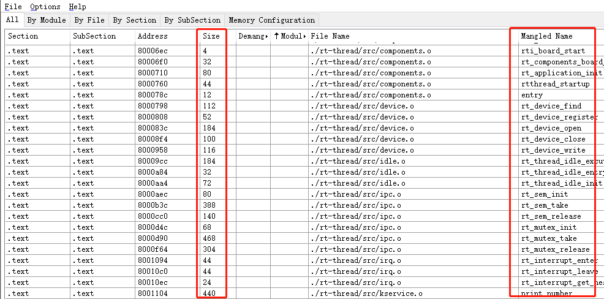

# 固件尺寸优化

## 前言

使用 RT-Thread-Studio 进行工程构建时，为了实现业务需求，我们常常会增加驱动文件、组件或者软件包等等，并且在调试代码时也可能需要使能调试相关的功能（例如打开 ulog 功能 ）或者自行打印一些调试的信息。因此，我们会编译得到一个稍微冗余的固件。对于 MCU 的 Flash 比较紧张时，我们需要考虑代码体积的优化，使其尽量精简，这样的代码在之后的迭代开发中才可以实现小而美的目标。

下面是几个可以去考虑的优化的方向：

* 裁剪
* 选择合适的优化等级
* 开启 newlib-nano 选项
* 使用 Map File 分析工具
* readelf 命令分析 ELF 文件
* 更换同类型 Flash 较大的硬件平台

需要注意的是，并不是所有的优化都是行之有效的，如果收效甚微的优化却造成了系统性能的大幅衰减，这是非常不可取的，所以优化的时候要认真分析，综合考虑，不可能一蹴而就。

## 1. 裁剪

裁剪是优先需要考虑的方向，这种方式操作简单，也最为见效。

以下是基于 stm32l475-atk-pandora BSP 进行裁剪的例子，该示例使用 RT-Thread 4.0.3 版本，优化等级 -O0。

MCU：STM32L475VET6，512KB FLASH ，128KB RAM

在做了一系列配置之后（模拟项目工程），该 BSP 现已有资源为：

- 内核：信号量、互斥量、事件集、邮箱、消息队列；main 线程、tshell 线程、idle 线程
- 组件：文件系统（fatfs）、Finsh 组件、UART 框架、GPIO 框架、SFUD 组件、QSPI 框架
- 外设驱动：片上 UART、GPIO、QSPI、板上 QSPI FLASH、NRF24L01、LCD、PWM、ADC等

其中关系为：

1. main 中的 led 闪烁：PIN 驱动、PIN 框架
2. FinSH 控制台：使用 UART 驱动、UART 框架、FinSH 组件
3. 文件系统（板上 QSPI FLASH）：使用 QSPI 驱动、QSPI 框架、文件系统组件 Fatfs、FAL 软件包
4. Ulog：ulog 组件
5. 其他硬件板载设备驱动：LCD、TIMER、PWM、ADC、RTC、Audio

利用 RT-Thread Setting 的图形界面，我们可以比较直观的看到使能了哪些软件包、驱动和组件。


当前系统体积大小如下所示：

```information
   text    data     bss     dec     hex filename
 260932    1648    5388  267968   416c0 rtthread.elf
              Used Size(B)           Used Size(KB)
Flash:         262580 B              256.43 KB
RAM:             7036 B                6.87 KB
```

可以看到**当前系统体积大小 256KB**，下面对该BSP进行裁剪，打开工程的 RT-Thread Settings 配置界面：

### 裁剪 Ulog 组件（-3.8KB）


去除异步日志功能后


```information
   text    data     bss     dec     hex filename
 257000    1648    5120  263768   40658 rtthread.elf
              Used Size(B)           Used Size(KB)
Flash:         258648 B              252.59 KB
RAM:             6768 B                6.61 KB
```

### 裁剪文件系统及 Flash 设备（-83.2KB)

由于系统使能了 FAL 软件包，如下图


关闭 QSPI Flash 设备，在Hardware选项中，将已经适配好的 QSPI FLASH相关设备除能。


**由于系统不再使用 QSPI 设备，那么相对应的 QSPI设备驱动框架，也是可以取消掉的。这点在裁剪系统时候很重要，因为我们开发中经常 使能/除能 一些总线上的设备，却常常忘记关 总线/设备驱动框架 造成系统体积上的损耗。**


最后将虚拟文件系统 DFS 关闭。


```
   text    data     bss     dec     hex filename
 172148    1308    3556  177012   2b374 rtthread.elf
              Used Size(B)           Used Size(KB)
Flash:         173456 B              169.39 KB
RAM:             4864 B                4.75 KB
```

### 裁剪外设驱动（-101.8KB）

关闭 LCD、Audio 设备（**由于SPI无其他设备挂载，因为可以裁剪掉SPI BUS**）( -75KB)


```information
   text    data     bss     dec     hex filename
  95204    1260    2864   99328   18400 rtthread.elf
              Used Size(B)           Used Size(KB)
Flash:          96464 B               94.20 KB
RAM:             4124 B                4.03 KB
```

裁剪掉 TIMER、PWM、ADC、RTC 外设驱动  (-26.6KB)


```information
   text    data     bss     dec     hex filename
  68856     384    2524   71764   11854 rtthread.elf
              Used Size(B)           Used Size(KB)
Flash:          69240 B               67.62 KB
RAM:             2908 B                2.84 KB
```

### 裁剪 FinSH（-13K）


```information
   text    data     bss     dec     hex filename
  55500     384    2240   58124    e30c rtthread.elf
              Used Size(B)           Used Size(KB)
Flash:          55884 B               54.57 KB
RAM:             2624 B                2.56 KB
```

### 裁剪内核 IPC（体积几乎不变）

关闭事件集、邮箱、消息队列


```information
   text    data     bss     dec     hex filename
  54888     336    2232   57456    e070 rtthread.elf
              Used Size(B)           Used Size(KB)
Flash:          55224 B               53.93 KB
RAM:             2568 B                2.51 KB
```

### 检查 RT-Thread Setting 和 rtconfig.h 配置文件

经过以上的裁剪步骤，差不多裁剪了十之八九了，接下来就要检查还有什么地方在裁剪的过程中被忽略了，然后再按照上面的步骤做深入的裁剪，在此不再一一演示，仅作展示说明为主。

打开 RT-Thread Setting 图形化界面如下图所示：


可以看到目前系统有使用到 libc 组件、Serial 驱动、Pin 设备驱动、Soft I2C 驱动。例如现在除能 libc 组件，直接单击 libc 按钮去除使能即可。

另外，我们也可以根据 rtconfig.h 文件查看各个宏定义信息，避免遗漏。下面是 rtcopnfig.h 的部分配置信息。

```c
#ifndef RT_CONFIG_H__
#define RT_CONFIG_H__

/* Generated by Kconfiglib (https://github.com/ulfalizer/Kconfiglib) */

/* RT-Thread Kernel */

#define RT_NAME_MAX 8
#define RT_ALIGN_SIZE 4
#define RT_THREAD_PRIORITY_32
#define RT_THREAD_PRIORITY_MAX 32
#define RT_TICK_PER_SECOND 1000
#define RT_USING_OVERFLOW_CHECK
#define RT_USING_HOOK
#define RT_USING_IDLE_HOOK
#define RT_IDLE_HOOK_LIST_SIZE 4
#define IDLE_THREAD_STACK_SIZE 256
#define RT_DEBUG                         //DEBUG相关还可以再优化掉
#define RT_DEBUG_COLOR                   //DEBUG相关还可以再优化掉

/* Inter-Thread communication */

#define RT_USING_SEMAPHORE
#define RT_USING_MUTEX
/* end of Inter-Thread communication */

/* Memory Management */

#define RT_USING_MEMPOOL                  //内存池还可以再优化掉
#define RT_USING_SMALL_MEM
#define RT_USING_HEAP
/* end of Memory Management */

/* Kernel Device Object */

#define RT_USING_DEVICE
#define RT_USING_CONSOLE
#define RT_CONSOLEBUF_SIZE 256
#define RT_CONSOLE_DEVICE_NAME "uart1"
/* end of Kernel Device Object */
#define RT_VER_NUM 0x40003
/* end of RT-Thread Kernel */
#define ARCH_ARM
#define RT_USING_CPU_FFS
#define ARCH_ARM_CORTEX_M
#define ARCH_ARM_CORTEX_M4

#endif
```

## 2.选择合适的优化等级

RT-Thread-Studio 使用的是 GCC 编译器，GCC 编译器对代码的编译优化有一系列的配置项，大体分为五个优化等级：-O0、-O1、-O2、-O3 和 -Os。

-O0：关闭所有优化选项，是 GCC 默认的等级，目的是让编译器减少编译时间并使调试产生预期的结果。在 RT-Thread-Studio 中，默认也是配置的该选项，如果编译的代码尺寸较大，我们建议更换优化等级（一般我们会选择 O2 等级）。

-O1：这是最基本的优化等级。编译器会在不花费太多编译时间的同时试图生成更快更小的代码。这些优化是非常基础的，但一般这些任务肯定能顺利完成。

-O2：O1 的进阶。这是推荐的优化等级，除非你有特殊的需求。O2 会比 O1 启用更多的优化选项。当设置了 O2 等级后，编译器会试图增加编译的时间和提升生成代码的性能（我们一般选用此优化等级完成编译任务）。

-O3：这是最高的优化等级，O3 开启了 O2 指定的所有优化，并启用了更多的优化选项。例如构建用于保存变量的伪寄存器网络（使得调试更加困难）、优化循环执行过程等。开启 O3 优化不一定会减少代码尺寸，有可能会为了减少代码执行时间反而增加代码体积。一般我们不使用此优化等级。

-Os：该这个等级用来优化代码尺寸。其中启用了 O2 中不增加目标文件大小的优化选项。这对于磁盘空间极其紧张或者 CPU 缓存较小的机器非常有用。一般使用 O2 等级之后发现生成的目标文件尺寸偏大，可以尝试使用 Os 等级进一步的优化。下表是[GCC 优化等级列表](https://www.rapidtables.com/code/linux/gcc/gcc-o.html#optimization)。

### gcc -O option flag

Set the compiler's optimization level.

|  option   |                 optimization level                 | execution time | code size | memory usage | compile time |
| :-------: | :------------------------------------------------: | :------------: | :-------: | :----------: | :----------: |
|    -O0    |    optimization for compilation time (default)     |       +        |     +     |      -       |      -       |
| -O1 or -O |   optimization for code size and execution time    |       -        |     -     |      +       |      +       |
|    -O2    | optimization more for code size and execution time |       --       |           |      +       |      ++      |
|    -O3    | optimization more for code size and execution time |      ---       |           |      +       |     +++      |
|    -Os    |             optimization for code size             |                |    --     |              |      ++      |
|  -Ofast   |    O3 with fast none accurate math calculations    |      ---       |           |      +       |     +++      |

+increase ++increase more +++increase even more -reduce --reduce more ---reduce even more

RT-Thread-Studio 默认选择的是 -O0（关闭所有优化）等级，按照上一章节，系统最后的裁剪的尺寸为 53.93KB，下面开启 O2 优化等级，代码尺寸缩小为 38.14 KB：


```information
   text    data     bss     dec     hex filename
  38724     336    2232   41292    a14c rtthread.elf
              Used Size(B)           Used Size(KB)
Flash:          39060 B               38.14 KB
RAM:             2568 B                2.51 KB
```

下面开启 -Os 优化等级，代码尺寸缩小为 34.64 KB：


```information
   text    data     bss     dec     hex filename
  35140     336    2232   37708    934c rtthread.elf
              Used Size(B)           Used Size(KB)
Flash:          35476 B               34.64 KB
RAM:             2568 B                2.51 KB
```

## 3.开启 newlib-nano 选项

RT-Thread-Studio 默认使用的 libc，提供了 printf、scanf 等很多标准库函数，但是这些库函数相对都比较大（在嵌入式平台上），而且很可能一些复杂的功能，我们在项目中并没有使用到，这样会造成代码体积的增大。

因此 newlib 提供了一个精简功能的版本，将一些标准库函数进行简化，仅仅实现一些简单常用的功能，这样便可以使得编译的代码轻量化，更适合嵌入式平台使用。（但是如果我们使用了标准库的一些复杂的功能，而 newlib-nano 并没有完备的实现这些功能，那么可能会造成一些意外的运行结果，我们在使用时要注意这些。）

如下图所示，我们在RT-Thread-Studio 中便可以开启该选项。


另外，开启 newlib-nano 时，对于 printf 和 scanf 等的使用是默认不带浮点运算的，如果使用浮点的话，则需要开启对应选项，如上图中 `Use float with nano printf` 和 `Use float with nano scanf` 选项框。

## 4.对 Map File 进行分析优化

在进行裁剪之后，我们还可以使用 Amap.exe 工具([ map 文件分析工具](http://www.sikorskiy.net/prj/amap/))

使用该工具只是辅助性的分析函数调用所占字段大小，从而针对各个组件和函数进行优化裁剪等。



## 5.使用 readelf 命令分析 ELF文件

与 Amap 工具类似，我们也可以使用 readelf 命令分析系统生成的 elf 文件。详细命令介绍见 [readelf - Linux man page](https://linux.die.net/man/1/readelf)，或者直接 `readelf --help`查看用法。

使用 `readelf -all rtthread.elf` 可以查看 elf 的所有信息。


依据生成的符号表 ( Symbol table ) ，可以看到生成的字段信息，例如类型为 `GLOBAL` 代表全局符号，`OBJECT` 代表数据对象，比如变量数组，`FUNC` 代表函数等等。我们可以利用这些这些信息，分析具体的段对应的大小。


## 6.更换同类型 Flash

最后还要提一点的是，当系统经过优化后仍然无法满足需求，如果有必要的话，建议更换成同类型 Flash 较大的硬件平台，这样可以在软件和硬件完全不需要修改的情况下完成项目功能，达到预期目标。
