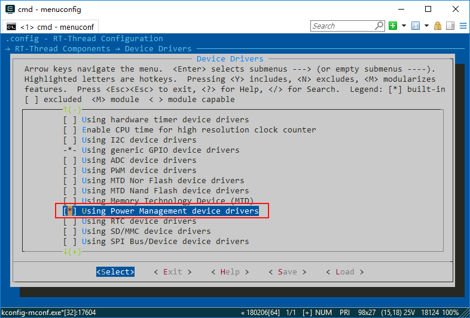
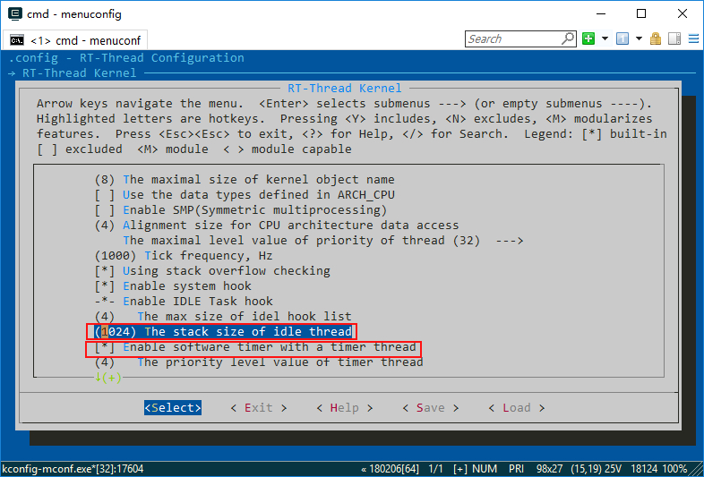
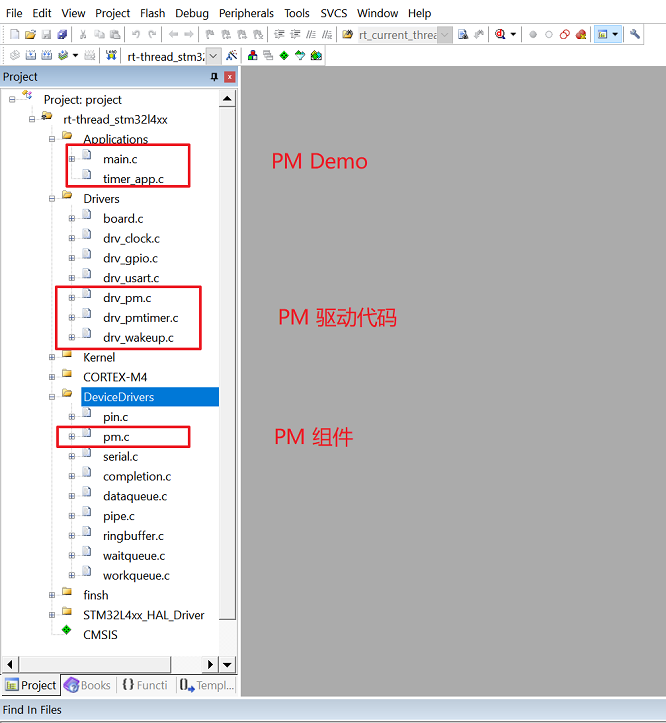
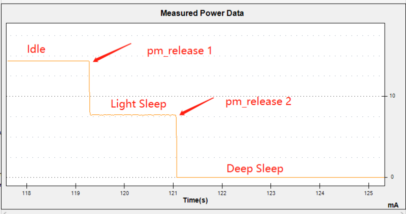
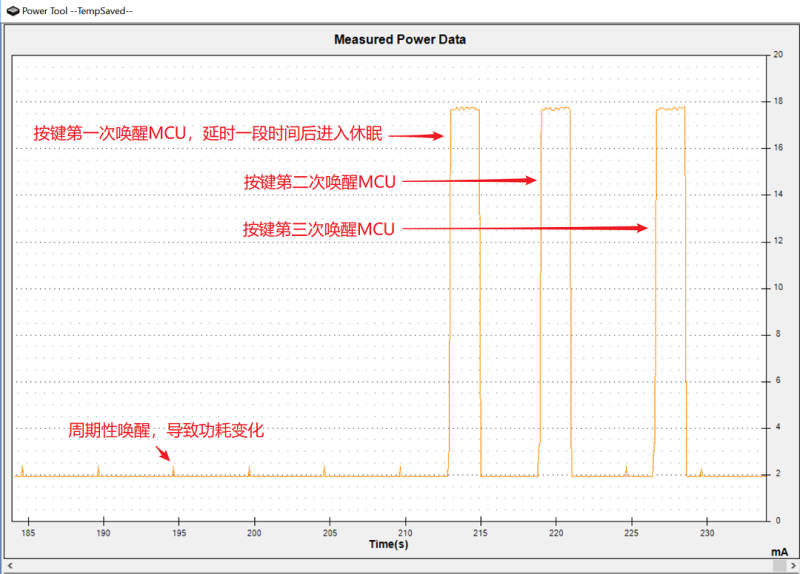
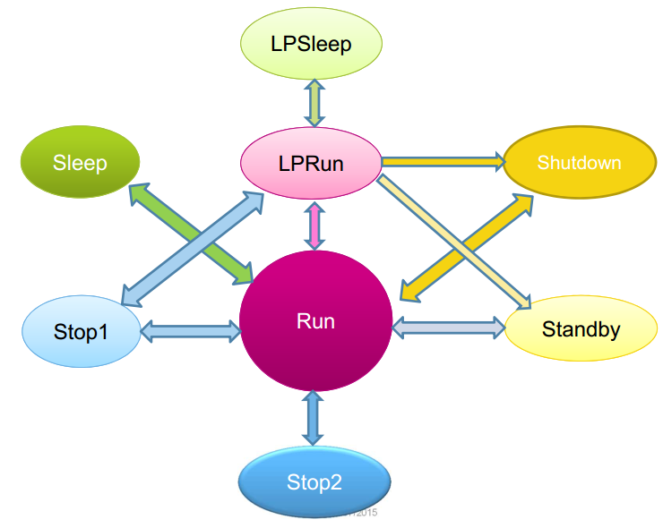

# 在 RT-Thread 潘多拉开发板上实现电源管理

本文介绍了基于 RT-Thread潘多拉开发板电源管理组件的使用和移植过程。

## 简介

随着物联网(IoT)的兴起，产品对功耗的需求越来越强烈。作为数据采集的传感器节点通常需要在电池供电时长期工作，而作为联网的SOC也需要有快速的响应功能和较低的功耗。

在产品开发的起始阶段，首先考虑是尽快完成产品的功能开发。在产品功能逐步完善之后，就需要加入电源管理功能。为了适应IoT的这种需求，RT-Thread提供了电源管理框架。电源管理框架的理念是尽量透明，使得产品加入低功耗功能更加轻松。

本文的示例都是在潘多拉开发板下运行。潘多拉开发板是 RT-Thread 和正点原子联合推出的硬件平台，该平台上专门为 IoT 领域设计，并提供了丰富的例程和文档。

MCU通常提供了多种时钟源供用户选择。例如潘多拉开发板上板载的 STM32L475 就可以选择 LSI/MSI/HSI 等内部时钟，还可以选择 HSE/LSE 等外部时钟。MCU 内通常也集成了 PLL(Phase-locked loops)，基于不同的时钟源，向 MCU 的其他模块提供更高频率的时钟。

为了支持低功耗功能，MCU 里也会提供不同的休眠模式。例如 STM32L475 里，可以分成 SLEEP模式、STOP模式、STANDBY模式。这些模式还可以有进一步的细分，以适应不同的场合。

本节主要展示了如何开启 PM 组件和相应的驱动，并通过例程来演示常见场景下，应用应该如何管理模式。

最后，本节将介绍 RT-Thread PM 组件在 STM32L476 上的移植和注意事项。

## 配置工程

在潘多拉开发板上运行电源管理组件，需要下载潘多拉开发板的相关资料、RT-Thread 源码和 ENV 工具。

* [RT-Thread 源码](https://github.com/RT-Thread/rt-thread)
* [ENV 工具](https://www.rt-thread.org/page/download.html)

开启 Env 工具，进入潘多拉开发板的 BSP 目录（`rt-thread\bsp\stm32\stm32l475-atk-pandora`），在 Env 命令行里输入 `menuconfig` 进入配置界面配置工程。

- 配置 PM 组件：勾选 BSP 里面的`RT-Thread Components ---> Device Drivers --->  [*] Using Power Management device drivers`：

  

- 配置内核选项：使用 PM 组件需要更大的 IDLE 线程的栈，这里使用了1024 字节。例程里还使用 Software timer，所以我们还需要开启相应的配置

  

- 配置完成，保存并退出配置选项，输入命令`scons --target=mdk5`生成 mdk5 工程；

打开mdk5 工程可以看到相应的源码以及被添加进来：



## 使用
###  定时应用

在定时应用里，我们创建了一个周期性的软件定时器，定时器任务里周期性输出当前的 OS Tick。如果创建软件定时器成功之后，使用`rt_pm_request(PM_SLEEP_MODE_DEEP)`请求深度睡眠模式。以下是示例核心代码（该代码可以直接复制 main.c 里运行）：

```c
#include <board.h>
#include <rtthread.h>
#include <rtdevice.h>

#ifndef RT_USING_TIMER_SOFT
    #error "Please enable soft timer feature!"
#endif

#define TIMER_APP_DEFAULT_TICK  (RT_TICK_PER_SECOND * 2)

#ifdef RT_USING_PM

static rt_timer_t timer1;

static void _timeout_entry(void *parameter)
{
    rt_kprintf("current tick: %ld\n", rt_tick_get());
}

static int timer_app_init(void)
{
    rt_pm_request(PM_SLEEP_MODE_IDLE);
    rt_pm_request(PM_SLEEP_MODE_LIGHT);

    timer1 = rt_timer_create("timer_app",
                             _timeout_entry,
                             RT_NULL,
                             TIMER_APP_DEFAULT_TICK,
                             RT_TIMER_FLAG_PERIODIC | RT_TIMER_FLAG_SOFT_TIMER);
    if (timer1 != RT_NULL)
    {
        rt_timer_start(timer1);

        /* keep in timer mode */
        rt_pm_request(PM_SLEEP_MODE_DEEP);

        return 0;
    }
    else
    {
        return -1;
    }
}
INIT_APP_EXPORT(timer_app_init);

#endif /* RT_USING_PM */
```

按下复位按键重启开发板，打开终端软件，我们可以看到有定时输出日志：

```
 \ | /
- RT -     Thread Operating System
 / | \     4.0.1 build May  9 2019
 2006 - 2019 Copyright by rt-thread team
msh >current tick: 2001
current tick: 4002
current tick: 6003
current tick: 8004
```

我们可以在msh里输入`pm_dump`命令观察PM组件的模式状态：

```shell
pm_dump
| Power Management Mode | Counter | Timer |
+-----------------------+---------+-------+
|             None Mode |       0 |     0 |
|             Idle Mode |       1 |     0 |
|       LightSleep Mode |       1 |     0 |
|        DeepSleep Mode |       1 |     1 |
|          Standby Mode |       0 |     0 |
|         Shutdown Mode |       0 |     0 |
+-----------------------+---------+-------+
pm current sleep mode: Idle Mode
pm current run mode:   Normal Speed
msh >
```

以上的输出说明，PM 组件里 Idle、Light Sleep、Deep Sleep 都被请求了一次，现在正处于空闲模式（Idle Mode）。

我们依次输入命令`pm_release 1`和`pm_release 2` 手动释放 Idle  和 Light Sleep 模式后，将进入`Deep Sleep Mode`。进入`Deep Sleep Mode`之后会定时唤醒，shell 还是一直在输出：

```shell
msh />pm_release 1
msh />
msh />current tick: 8023
current tick: 10024
current tick: 12025

msh />pm_release 2
msh />
msh />current tick: 14026
current tick: 16027
current tick: 18028
current tick: 20029
current tick: 22030
current tick: 24031

```

我们可以通过功耗仪器观察功耗的变化。下图是基于 Monsoon Solutions Inc 的 Power Monitor 的运行截图，可以看到随着模式变化，功耗明显变化：



休眠时显示2mA是仪器的误差。

### 按键唤醒应用

在按键唤醒应用里，我们使用 wakeup 按键来唤醒处于休眠模式的 MCU。一般情况下，在 MCU 处于比较深度的休眠模式，只能通过特定的方式唤醒。MCU 被唤醒之后，会触发相应的中断。以下例程是从 Deep Sleep 模式唤醒 MCU 并闪烁 LED 之后，再次进入休眠的例程。以下是核心代码（该代码可以直接复制 main.c 里运行）：

```c
#include <board.h>
#include <rtthread.h>
#include <rtdevice.h>

#ifdef RT_USING_PM

#define WAKEUP_EVENT_BUTTON                 (1 << 0)
#define PIN_LED_R                           GET_PIN(E, 7)
#define WAKEUP_PIN                          GET_PIN(C, 13)
#define WAKEUP_APP_THREAD_STACK_SIZE        1024

static rt_event_t wakeup_event;

static void wakeup_callback(void *args)
{
    rt_event_send(wakeup_event, WAKEUP_EVENT_BUTTON);
}

static void wakeup_init(void)
{
    rt_pin_mode(WAKEUP_PIN, PIN_MODE_INPUT_PULLUP);
    rt_pin_attach_irq(WAKEUP_PIN, PIN_IRQ_MODE_FALLING, wakeup_callback, RT_NULL);
    rt_pin_irq_enable(WAKEUP_PIN, 1);
}

static void wakeup_app_entry(void *parameter)
{
    wakeup_init();
    rt_pm_request(PM_SLEEP_MODE_DEEP);

    while (1)
    {
        if (rt_event_recv(wakeup_event,
                          WAKEUP_EVENT_BUTTON,
                          RT_EVENT_FLAG_AND | RT_EVENT_FLAG_CLEAR,
                          RT_WAITING_FOREVER, RT_NULL) == RT_EOK)
        {
            rt_pm_request(PM_SLEEP_MODE_NONE);

            rt_pin_mode(PIN_LED_R, PIN_MODE_OUTPUT);
            rt_pin_write(PIN_LED_R, 0);
            rt_thread_delay(rt_tick_from_millisecond(500));
            rt_pin_write(PIN_LED_R, 1);

            rt_pm_release(PM_SLEEP_MODE_NONE);
        }
    }
}

static int wakeup_app(void)
{
    rt_thread_t tid;

    wakeup_event = rt_event_create("wakup", RT_IPC_FLAG_PRIO);
    RT_ASSERT(wakeup_event != RT_NULL);

    tid = rt_thread_create("wakeup_app", wakeup_app_entry, RT_NULL,
                           WAKEUP_APP_THREAD_STACK_SIZE, RT_MAIN_THREAD_PRIORITY, 20);
    RT_ASSERT(tid != RT_NULL);

    rt_thread_startup(tid);

    return 0;
}
INIT_APP_EXPORT(wakeup_app);

#endif
```

上面的代码里，我们创建一个线程，这个线程里注册了按键中断唤醒回调函数，接着请求深度睡眠模式，每当唤醒中断之后就会触发回调。回调函数里会发送事件`WAKEUP_EVENT_BUTTON`。这样我们的线程里接收到这个事件之后，首先请求在 None 模式，然后完成 LED 闪烁功能之后，再去释放 None 。



上图是我们三次按下 wakeup 按键的运行截图。每次按下按键，MCU 都会被唤醒点亮 LED 2秒之后，再次进入休眠。

## STM32L4 移植 PM

### STM32L4 的低功耗模式简介

STM32L476 是 ST 公司推出的一款超低功耗的 Crotex-M4 内核的 MCU，支持多个电源管理模式，其中最低功耗 Shutdown 模式下，待机电流仅 30 nA。ST 公司 把 L476 的电管管理分为很多种，但各个模式的并非功耗逐级递减的特点，下面是各个模式之间的状态转换图：



尽管 STM32L476 的低功耗模式很多，但本质上并不复杂，理解它的原理有助于我们移植驱动，同时更好的在产品中选择合适的模式。

最终决定 STM32L476 系统功耗的主要是三个因素：稳压器（voltage regulator）、CPU 工作频率、芯片自身低功耗的处理，下面分别对三个因素进行阐述。

- 稳压器

L4 使用两个嵌入式线性稳压器为所有数字电路、待机电路以及备份时钟域供电，分别是主稳压器（main regulator，下文简称 MR）和低功耗稳压器（low-power
regulator，下文简称 LPR）。稳压器在复位后处于使能状态，根据应用模式，选择不同的稳压器对 Vcore 域供电。其中，MR 的输出电压可以由软件配置为不同的范围（Range 1 和 Rnage 2）。

| 稳压器 | 应用场合 |
| -- | -- |
| MR（Range 1） | Vcore = 1.2V，用于运行模式、睡眠模式和停止模式0，MR 未 Vcore 域提供全功率 |
| MR（Range 2） | Vcore = 1.0V，使用的场景同上|
| LPR | 用于低功耗运行模式、低功耗休眠模式、停止模式 1、停止模式2 |
| OFF | Standby 和 Shutdown 模式下，MR 和 LPR 都被关闭 |

- CPU 工作频率

通过降低 CPU 的主频达到降低功耗的目的：
MR 工作在 Range 1 正常模式时，SYSCLK 最高可以工作在 80M；
MR 工作在 Range 2 时，SYSCLK 最高不能超过 26 M；
低功耗运行模式和低功耗休眠模式，即 Vcore 域由 LPR 供电，SYSCLK 必须小于 2M。

- 芯片本身的低功耗处理

芯片本身定义了一系列的休眠模式，如 Sleeep、Stop、Standby 和 Shutdown，前面的四种模式功耗逐渐降低，实质是芯片内部通过关闭外设和时钟来实现。

### 移植的具体实现

上文简要说明 STM32 的低功耗模式和工作原理，下面介绍 RT-Thread PM 的功能和移植接口。

RT-Thread 低功耗管理系统从设计上分离运行模式和休眠模式，独立管理，运行模式用于变频和变电压，休眠调用芯片的休眠特性。对于多数芯片和开发来说，可能并不需要考虑变频和变电压，仅需关注休眠模式。

STM32 L4 系列的芯片有运行模式和低功耗运行模式的概念，同时 MR 还有 Range 2 模式，可用于变频场景。

PM 组件的底层功能都是通过struct rt_pm_ops结构体里的函数完成：

```c
/**
 * low power mode operations
 */
struct rt_pm_ops
{
    void (*sleep)(struct rt_pm *pm, uint8_t mode);
    void (*run)(struct rt_pm *pm, uint8_t mode);
    void (*timer_start)(struct rt_pm *pm, rt_uint32_t timeout);
    void (*timer_stop)(struct rt_pm *pm);
    rt_tick_t (*timer_get_tick)(struct rt_pm *pm);
};
```

- 移植休眠模式

移植休眠模式仅需关注 sleep 接口，根据 PM 用户手册相关介绍，首先将 RT-Thread 的休眠模式和 STM32 的模式作一个转换：

| RT-Thread | STM32 | 描述 |
| -- | -- | -- |
|PM_SLEEP_MODE_NONE | Run | 正常运行模式，不进行任何降功耗的措施 |
|PM_SLEEP_MODE_IDLE | Run | 正常运行模式，可选择 WFI(等待中断唤醒)和WFE(等待事件唤醒)，此处暂不处理 |
|PM_SLEEP_MODE_LIGHT | Sleep | 轻度睡眠模式，执行 ST 的 Sleep 模式|
|PM_SLEEP_MODE_DEEP | Stop2 | 深度睡眠模式，执行 ST 的 Stop2 模式 |
|PM_SLEEP_MODE_STANDBY | Standby| 待机模式，执行 ST 的 Standby 模式 |
|PM_SLEEP_MODE_SHUTDOWN | Shutdown |停止模式，执行 ST 的 Shtudown 模式 |

下面是具体的实现:

```c

#include <board.h>
#include <rtthread.h>
#include <rtdevice.h>

static void sleep(struct rt_pm *pm, uint8_t mode)
{
    switch (mode)
    {
    case PM_SLEEP_MODE_NONE:
        break;

    case PM_SLEEP_MODE_IDLE:
        // __WFI();
        break;

    case PM_SLEEP_MODE_LIGHT:
        /* Enter SLEEP Mode, Main regulator is ON */
        HAL_PWR_EnterSLEEPMode(PWR_MAINREGULATOR_ON, PWR_SLEEPENTRY_WFI);
        break;

    case PM_SLEEP_MODE_DEEP:
        /* Enter STOP 2 mode  */
        HAL_PWREx_EnterSTOP2Mode(PWR_STOPENTRY_WFI);
        break;

    case PM_SLEEP_MODE_STANDBY:
        /* Enter STANDBY mode */
        HAL_PWR_EnterSTANDBYMode();
        break;

    case PM_SLEEP_MODE_SHUTDOWN:
        /* Enter SHUTDOWNN mode */
        HAL_PWREx_EnterSHUTDOWNMode();
        break;

    default:
        RT_ASSERT(0);
        break;
    }
}

int rt_hw_pm_init(void)
{
    static const struct rt_pm_ops _ops =
    {
        sleep,
        RT_NULL,
        RT_NULL,
        RT_NULL,
        RT_NULL
    };

    rt_uint8_t timer_mask = 0;

    /* Enable Power Clock */
    __HAL_RCC_PWR_CLK_ENABLE();

    /* initialize system pm module */
    rt_system_pm_init(&_ops, timer_mask, RT_NULL);

    return 0;
}

INIT_BOARD_EXPORT(rt_hw_pm_init);

```

目前为止，ST 的休眠模式已经初步加入了，能够满足部分的应用场景。打开命令行，输入请求/释放休眠模式命令，可以观察到功耗显著降低。

- 移植时间补偿接口

某些情况下，我们可能需要系统在空闲时进入 Stop 模式，以达到更低的将功耗效果。L476 Stop 2 模式下的电流可以达到 1.6 uA 左右，ST 手册上对 Stop2 模式的描述如下：

Stop 2 模式基于 Cortex-M4 深度睡眠模式与外设时钟门控。在 Stop 2 模式下， Vcore 域中的所有时钟都会停止， PLL、 MSI、 HSI16 和 HSE 振荡器也被禁止。一些带有唤醒功能（I2C3 和 LPUART）的外设可以开启 HSI16 以获取帧，如果该帧不是唤醒帧，也可以在接收到帧后关闭 HSI16。SRAM1、 SRAM2、 SRAM3 和寄存器内容将保留，所有 I/O 引脚的状态与运行模式下相同。

根据手册可知，Stop 2 模式会关闭系统时钟，当前的 OS Tick 基于内核的 Systick 定时器。那么在系统时钟停止后，OS Tick 也会停止，对于某些依赖 OS Tick 的应用，在进入 Stop 2 模式，又被中断唤醒后，就会出现问题，因此需要在系统唤醒后，对 OS Tick 进行补偿。Stop 2 模式下，绝大多数外设都停止工作，仅低功耗定时器 1（LP_TIM1）选择 LSI 作为时钟源后，仍然能正常运行，所以选择 LP_TIM1 作为 Stop 2 模式的时间补偿定时器。

休眠的时间补偿需要实现三个接口，分别用于启动低功耗定时器、停止定时器、唤醒后获取休眠的 Tick，下面是具体的实现：

```c
static void pm_timer_start(struct rt_pm *pm, rt_uint32_t timeout)
{
    RT_ASSERT(pm != RT_NULL);
    RT_ASSERT(timeout > 0);

    /**
     * 当超时为 RT_TICK_MAX 时，表明系统此时没有依赖 OS Tick 的应用，
     * 因此不启动低功耗定时器，避免超时唤醒而增加系统功耗
     */
    if (timeout != RT_TICK_MAX)
    {
        /* Convert OS Tick to pmtimer timeout value */
        timeout = stm32l4_pm_tick_from_os_tick(timeout);
        if (timeout > stm32l4_lptim_get_tick_max())
        {
            timeout = stm32l4_lptim_get_tick_max();
        }

        /* Enter PM_TIMER_MODE */
        stm32l4_lptim_start(timeout);
    }
}

static void pm_timer_stop(struct rt_pm *pm)
{
    RT_ASSERT(pm != RT_NULL);

    /* Reset pmtimer status */
    stm32l4_lptim_stop();
}

static rt_tick_t pm_timer_get_tick(struct rt_pm *pm)
{
    rt_uint32_t timer_tick;

    RT_ASSERT(pm != RT_NULL);

    timer_tick = stm32l4_lptim_get_current_tick();

    return stm32l4_os_tick_from_pm_tick(timer_tick);
}

int rt_hw_pm_init(void)
{
    static const struct rt_pm_ops _ops =
    {
        sleep,
        RT_NULL,
        pm_timer_start,
        pm_timer_stop,
        pm_timer_get_tick
    };

    rt_uint8_t timer_mask = 0;

    /* Enable Power Clock */
    __HAL_RCC_PWR_CLK_ENABLE();

    /* initialize timer mask */
    timer_mask = 1UL << PM_SLEEP_MODE_DEEP;

    /* initialize system pm module */
    rt_system_pm_init(&_ops, timer_mask, RT_NULL);

    return 0;
}
```

休眠时间补偿的移植相对并不复杂，根据 Tick 配置低功耗定时器超时，唤醒后获取实际休眠时间并转换为OS Tick，告知 PM 组件即可。另外，从 Stop 2 模式唤醒后，默认会切换到内部的 MSI 时钟，通常需要重新配置时钟树。

- 移植运行模式

STM32L476 的运行模式移植主要是通过改变CPU 频率 和 稳压器，让其工作在 MR Range 2 或者 LP_RUN 模式，两个模式切换都会触发 CPU 频率改变的操作，这是一个比较危险的操作，我们在此处不作介绍。但是RT-Thread 仓库的 stm32l476-nucleo 有完整的实现，且已通过测试，如果项目中有此需求，可以参考该 bsp。

## 参考资料

* [《用户指南-电源管理》](../../../programming-manual/pm/pm.md)
