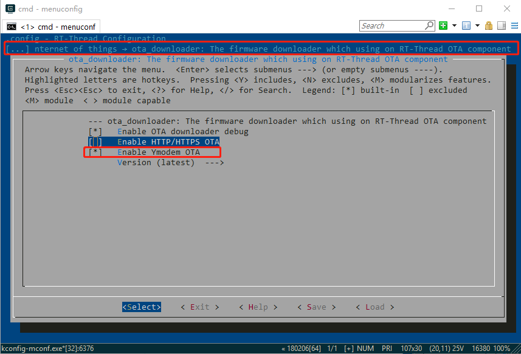
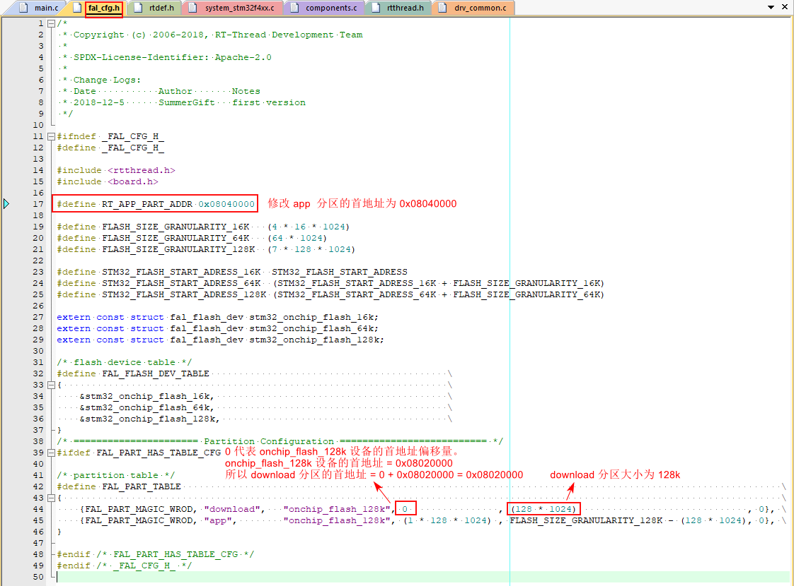
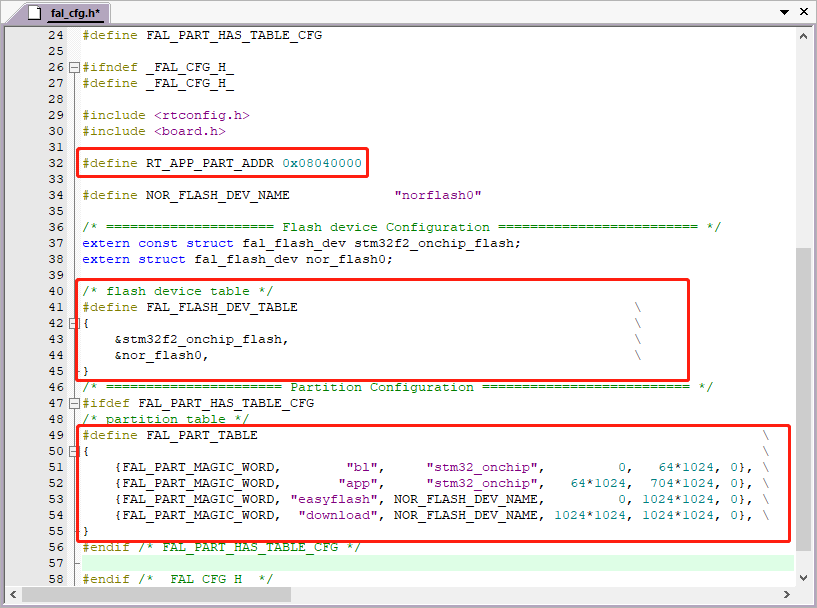

# STM32 通用 Bootloader

## 简介

为了能让开发者快速掌握 OTA 升级这把利器，RT-Thread 开发团队提供了通用的 Bootloader。开发者通过该 Bootloader 即可直接使用 RT-Thread OTA 功能，轻松实现对设备端固件的管理、升级与维护。

下图展示了 RT-Thread 通用 Bootloader 的软件框架：


RT-Thread 通用 Bootloader 有如下特点：

- 以 bin 文件的形式提供，无需修改即可使用

- 资源占用小，ROM 最小只需要 16KB，最大 32KB

- 适用于多系列 STM32 芯片（目前支持 F1 和 F4 系列 ）

- 支持各种 SPI Flash 存储固件

- 支持固件加解密功能

- 支持多种固件压缩方式

- 支持恢复出厂固件功能

- 以上功能均可自由配置

## 功能说明

Bootloader 的主要功能是更新 app 分区中的固件。

### 分区表介绍

通用 Bootloader 中的分区表包含如下三个分区：

| 分区名   | 起始地址 | 分区大小 | 分区位置                      | 介绍           |
| -------- | -------- | -------- | ----------------------------- | -------------- |
| app      | 自定义   | 自定义   | 片内 Flash                    | 存储 app 固件  |
| download | 自定义   | 自定义   | 片内 Flash 或者片外 SPI Flash | 存储待升级固件 |
| factory  | 自定义   | 自定义   | 片内 Flash 或者片外 SPI Flash | 存储出厂固件   |

### 升级固件功能

当系统需要升级固件时，Bootloader 将从  `download` 分区将固件搬运到 `app` 分区，主要功能流程如下所示：

1. Bootloader 启动时检查 `download` 分区和 `app` 分区中的固件版本。
2. 如果两个固件版本相同，则跳转到 app 分区，Bootloader 运行结束。
3. 固件版本不同则将  `download` 分区中的固件搬运到 `app` 分区。
4. 在搬运的过程中 Bootloader 可以对固件进行校验、解密、解压缩等操作。
5. 搬运完毕后，删除 `download` 分区中存储的固件。
6. 重启系统跳转到 `app` 分区中的固件运行，Bootloader 运行结束。

Bootloader 工作过程如下图所示：


### 恢复固件功能

当系统中的固件损坏，Bootloader 将从  `factory` 分区将固件搬运到 `app` 分区，主要功能流程如下所示：

1. Bootloader 启动时检查触发固件恢复的引脚是否为有效电平。
2. 如果有效电平持续超过 10S 则将  `factory` 分区中的固件搬运到 `app` 分区中。
3. 如果有效电平没有持续超过 10S 则继续进行 2.2 小节中介绍的启动步骤。
4. 在搬运的过程中 Bootloader 可以对固件进行校验、解密、解压缩等操作。
5. 搬运完毕后，保持 `factory`  分区中的固件不变。
6. 重启系统跳转到 `app` 分区中的固件运行，Bootloader 运行结束。

## 获取 Bootloader

Bootloader 可以通过网页端在线生成的方式来获取。开发者根据自己使用的芯片，填写相关参数，然后点击生成按钮，即可在线生成 Bootloader。

Bootloader 在线获取地址： http://iot.rt-thread.com

### 登陆账号


### 新建产品


### 进入设备管理


### 进入生成页面

进入 Bootloader 生成页面后，根据页面提示填写板卡参数，点击生成固件按钮即可在线自动生成 BootLoader，同时也会将生成的固件发送到用户邮箱中。

下面提供一个示例配置以供参考，开发者则需要根据自己手中板卡的实际情况，勾选和填写所需功能。


点击生成按钮后，等待大约一分钟即可通过自动下载或者邮件的方式获取定制的 Bootloader。

## 使用 Bootloader

### 准备工作

1. 在线生成 Bootloader 时可以自定义使用某个引脚作为串口输出引脚，例如 PA9。波特率设置为 115200 ，通过 usb 转串口正确地连接到 PC 端。

2. 保证 jlink 正常连接到开发板。

### 烧录 Bootloader

#### 方法 1： J-Flash 工具烧写

以 `STM32F407ZGT6` 芯片为例讲述如何使用 J-Flash 工具烧录 bootloader.bin 到开发板中，操作步骤如下：

1. 打开 J-Flash 工具，配置烧录参数。


2. 选择打开固件功能。


3. 选择需要烧录的固件，这里选择在线生成后下载到本地的 Bootloader 固件。


4. 烧录 bootloader.bin 到指定地址 0x8000000。


5. 连接开发板。


6. 开始烧录固件。


固件烧录成功后会自动运行 Bootloader，打印出 RT-Thread 的 logo。

#### 方法 2： ST-LINK Utility 工具烧写

以下介绍如何使用 ST-LINK Utility 工具烧录 bootloader.bin 到开发板中，这需要配合 ST-LINK 进行烧写，操作步骤如下所示：

1. 连接开发板。


2. 设置连接选项。


3. 烧录：选择需要烧录的固件，这里选择在线生成后下载到本地的 Bootloader 固件。


## 制作 app 固件

本小节介绍如何使用 stm32 系列的 BSP 制作一个可以用于 OTA 升级的，包含 OTA 下载器功能 app 固件。

接下来的示例中所用的 BSP 路径为 `stm32/stm32f407-atk-explorer`。

固件中使用的分区表如下所示：

| 分区名   | 起始地址  | 分区大小 | 分区位置   |
| -------- | --------- | -------- | ---------- |
| app      | 0x8040000 | 128k     | 片内 Flash |
| download | 0x8020000 | 128k     | 片内 Flash |
| factory  | 0x8060000 | 128k     | 片内 Flash |

制作该 app 固件有如下三个步骤：

- 为 BSP 添加下载器功能，下载需要的软件包并修改 FAL 分区表
- 修改 stm32 BSP 中断向量表跳转地址
- 修改 BSP 链接脚本

在后面的章节中，将按照上述步骤来制作 app 固件。

### 添加下载器功能

本小节介绍如何将下载器功能添加到 app 固件中。

添加该功能需要使用 env 工具，本次下载的软件包在 iot 类别中，需要按照如下步骤操作：

 1. 下载 ota_downloader 软件包，选中 Ymodem 功能。



 2. 添加 BSP Flash 驱动。


注：如果 BSP 没有该选项，则需要手动在 board 文件夹的 Kconfig 添加下面定义，保存，然后重新进入 menuconfig 即可。

```
    config BSP_USING_ON_CHIP_FLASH
        bool "Enable on-chip FLASH"
        default n
```

3. 配置完毕后，先使用 `pkgs --update` 命令将所需要的软件包下载下来，然后使用 `scons --target=mdk5` 命令重新生成 mdk 工程。

### 配置 FAL 分区

本小节将讲述如何初始化 FAL 组件，并修改 FAL 分区表。开发者需要对 FAL 进行简单入门，无需移植，只需要了解如何配置即可，详细内容可参考 [官方文档](https://github.com/RT-Thread-packages/fal)。

本次制作的 `app` 固件将附带下载器功能，下载器会将固件下载到 `download` 分区。根据第 4 章开始时的分区表可知，`download`  分区的地址为 0x8020000，而 `app` 分区的地址为 0x8040000。

#### 初始化 FAL

由于 FAL 组件会被 ota_downloader 软件包自动选中，因此直接添加 FAL 组件的初始化代码即可。


2. 修改 `stm32f407-atk-explorer/board/ports/fal_cfg.h` 文件中的分区表，使分区表中 download 分区的起始地址和大小与 Bootloader 中的 download 分区一致。



注意：如果 BSP 中没有该头文件，可以在该 BSP 目录下 `/packages/fal-latest/samples/porting` 中复制一份进行修改，其中分区地址和大小是根据实际 bootloader 中定义的大小进行设置。下图中标记处了可能需要修改的地方，请根据个人实际情况进行修改。



#### 修改 app 固件配置

由于 `app` 分区的起始地址为 `0x08040000`，`app` 固件如果想运行在该地址，就需要修改链接脚本和中断向量的跳转地址。

1. 修改固件的链接地址为 0x8040000。


2. 修改中断向量表的跳转基地址为 0x8040000。

首先在 main.c 文件中添加如下代码，这段代码的功能是重新设定中断向量跳转地址为 app 分区的地址。

```c
/**
 * Function    ota_app_vtor_reconfig
 * Description Set Vector Table base location to the start addr of app(RT_APP_PART_ADDR).
*/
static int ota_app_vtor_reconfig(void)
{
    #define NVIC_VTOR_MASK   0x3FFFFF80
    /* Set the Vector Table base location by user application firmware definition */
    SCB->VTOR = RT_APP_PART_ADDR & NVIC_VTOR_MASK;

    return 0;
}
INIT_BOARD_EXPORT(ota_app_vtor_reconfig);
```

然后在 main 函数中添加版本信息打印，如下图所示：


3. 下载 app 程序

直接点击下载程序，固件就会被烧录到 app 分区。Bootloader 启动后将跳转到 app 分区运行，实验效果如下图所示：


可以看到串口输出的信息 `The current version of APP firmware is 1.0.0`，即当前固件的版本为 1.0.0 。

## 打包 app 固件

本小节讲述如何使用 RT-Thread OTA 固件打包器对 app 固件进行打包，制作可以被下载到 download 分区的升级固件。固件打包工具可以在 ota_downloader 软件包下的 tools 文件夹内找到。

1. 在对固件进行打包操作前，先修改 `stm32f407-atk-explorer/applications/main.c` 中 APP_VERSION 宏的值为 2.0.0 作为参照，**然后重新编译一遍生成新的 rtthread.bin 文件**，修改内容如下图所示：


2. 双击打开 `tools\ota_packager\rt_ota_packaging_tool.exe` 程序，使用 OTA 固件打包工具将上一步编译出的 `rtthread.bin` 文件打包成可被升级的 `rtthread.rbl` 文件，如下图所示：


固件打包器提供三种固件压缩方式：fastlz、quicklz 和 gzip，一种固件加密方式 AES256。开发者可以根据实际需求选择合适的加密压缩方式。

## 执行 OTA

### Ymodem 升级固件

使用 Ymodem 协议升级固件时，推荐使用 Xshell 终端。

在 msh 命令行中输入 `ymodem_ota` 命令后，点击鼠标右键，然后在菜单栏找到用 YMODEM 发送选项发送文件，如下图所示：

1. 选择 Ymodem 方式发送升级固件。


2. 选中之前 OTA 固件打包工具生成的 rtthread.rbl 文件。


接下来升级固件就会通过 Ymodem 的方式被下载到 download 分区。

### 执行 OTA 升级

固件被下载到 download 分区后，系统会自动重启，执行 OTA 升级。


升级完毕后可以看到如下效果：


串口输出信息为 `The current version of APP firmware is 2.0.0` ，说明固件已经被升级到 2.0.0 版本了。

### 更多固件下载方式

HTTP/HTTPS 固件升级是另外一种固件下载方式，制作下载器时如果开启了系统中的网络驱动，即可使用此种方式下载固件。具体步骤与 **Ymodem 升级固件** 小节大体一致。以下是配置截图：


在终端输入 `http_ota http://xxx/xxx/rtthreadf.rbl` 命令，系统将会从链接 http://xxx/xxx/rtthreadf.rbl` 处下载固件到 download 分区，之后系统会自动重启，执行 OTA 升级程序。


### 恢复出厂固件

在生成页面中选中了 **恢复出厂固件引脚** 功能后，即开启了出厂固件恢复功能。开发者可以将制作好的 app 固件烧录至 `factory` 分区中，在系统启动前按下恢复出厂固件引脚（可选择一个或者两个引脚作为固件恢复触发引脚）并保持 10S，即可从 `factory` 分区中恢复出厂固件到 `app` 分区中。

恢复出厂按键引脚配置如下：


`factory` 分区的配置如下所示：


按照上图的配置，`factory` 分区被设置为从片内 Flash 首地址偏移 0x60000 的位置开始，大小为 128KB，想要使用固件恢复功能，则需要将可用的 app 固件烧录到该分区中，固件恢复过程如下图所示：


