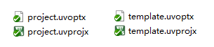
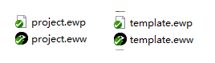
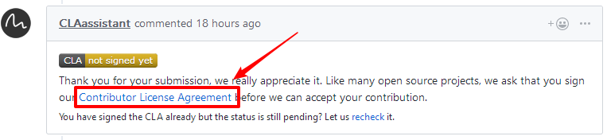
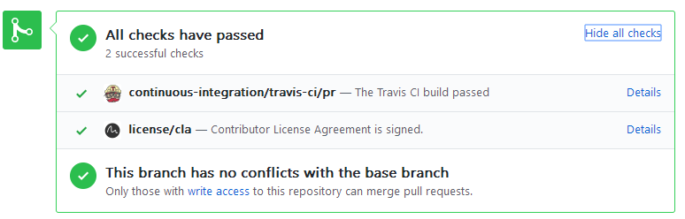

# BSP 提交自查

注意：以下所有要求不针对厂商提供的库文件驱动等等，为防止库文件 ci 不通过，需要在驱动库同级目录加入库文件路径（参考STM32:[.ignore_format.yml](https://gitee.com/rtthread/rt-thread/blob/master/bsp/stm32/libraries/.ignore_format.yml)），将忽略检查库文件格式。

## 代码规范部分

首先了解代码规范，可以查看 rt-thread 源码中的文档：[《RT-Thread 代码规范》](https://gitee.com/rtthread/rt-thread/blob/master/documentation/contribution_guide/coding_style_cn.md)

举例代码格式要求：

- 不允许中文注释
- 4 个空格缩进
- 大括号换行

了解上述链接中的代码规范之后，根据链接中的文档要求编写代码，代码格式可以使用 [astyle 格式化](#格式化代码)。

## readme 检查

是否清晰可读

1. 开发板的照片
2. 芯片资源的介绍中是否包含 FLASH，RAM（需要在 heap 配置时候检查大小，链接脚本是否配置正确）
3. 添加开发板资源的链接
4. 硬件连接是否清晰
5. 文档中英文之间添加空格，可以使用 vscode-pangu 插件一键格式化文档
6. 检查联系人信息，添加维护人自己的名字和 github 链接

## 命名检查

函数、变量名：
- 小写命名
- 不包含芯片厂商名，具体如下：

bsp 函数命名规范：

- 驱动 ops 命名规则：`_外设名_操作 `，以 uart 举例：
    - static _uart_read/write()
- 驱动注册接口命名规则：`rt_hw_外设_init()`，以 uart 举例：
    - int rt_hw_uart_init(void)

## 代码

1. 应用代码不包含设备驱动头文件，如 main 中不出现 #include "drv_gpio.h" ，驱动头文件可以包含在 board.h 中。
2. GCC 代码 rtt 启动部分是否修改（entry）
3. HEAP 大小配置是否正确
4. 检查链接脚本 ram rom 大小是否正确
5. 中断需要 rt_interrupt_enter();  与  rt_interrupt_leave();
6. 驱动合并重复代码
7. 驱动函数名小写
8. 不允许提交空文件

代码精简：

1. 是否存在无用的文件
2. 是否存在注释的代码, 如: `if 0`
3. 没有多于一行的连续换行

## 注释

注释格式如下，注释应该为英文注释，只允许放在 函数 / 语句 上方或右方

```
/* xxx */
```

## license

- 所有文件都要有 license 文件头
- 不能有 GPL 等与 apache 版权冲突的版权
- 非 apache 的兼容 license，需要更新 bsp 目录下的 license 声明：[Copyright_Notice.md](https://gitee.com/rtthread/rt-thread/blob/gitee_master/bsp/Copyright_Notice.md)。bsp 按照字母顺序排列。

## 工程文件检查

- 若支持MDK5，应上传：


- 若支持IAR，应上传：



## 格式化代码

当所有的代码都写完之后，检查代码格式就比较麻烦了，此时可以使用 astyle 工具格式化代码。

astyle 格式化参数：

```
!E --style=allman --indent=spaces=4 --indent-preproc-block --pad-oper --pad-header --unpad-paren --suffix=none --align-pointer=name  --convert-tabs --verbose
```

如何使用 astyle 格式化代码：[《astyle 格式化代码方法》](https://blog.csdn.net/yang1111111112/article/details/104793319)

## 测试验证

提交的 bsp 需要通过测试，并支持最基本的功能：uart 控制台，pin 设备。

最基本功能的效果：

- 可以运行 finsh 控制台，可以输入命令；
- 可以点灯。

## 添加 bsp 到 CI

- bsp 添加到 ci

打开源码根目录下 [.github/workflows/action.yml](https://gitee.com/rtthread/rt-thread/blob/gitee_master/.github/workflows/action.yml) 文件，添加 bsp 到 ci

## PR 后的检查项

- 提交 PR 之后，检查 CLA 是否签署（一个账户只需要在第一次提交时候签署）。注意不要使用非 GitHub 账号提交 commmit，或者使用不同的账号提交 commit 后提 Pull Request，这会导致 CLA 签署失败。



再检查 ci 是否正常运行（ci 检查需要一段时间），有无报错信息，全部通过后显示如下：



- 接下来等待 review 结果，有反馈需要修改的话，进行修改直到合并。