# 向 RT-Thread 贡献代码

我们真诚地感谢您的贡献，欢迎通过 GitHub 的 fork 和 Pull Request 流程来提交代码。

首先解释一下 Pull Request 这个词，pull request的意思是推送请求，开发者发起 Pull Request 的目的是请求仓库维护人采用开发者提交的代码。

下面是摘自[知乎](https://www.zhihu.com/question/21682976) 网友的一段解释：

我尝试用类比的方法来解释一下pull reqeust。想想我们中学考试，老师改卷的场景吧。你做的试卷就像仓库，你的试卷肯定会有很多错误，就相当于程序里的bug。老师把你的试卷拿过来，相当于先fork。在你的卷子上做一些修改批注，相当于git commit。最后把改好的试卷给你，相当于发pull request，你拿到试卷重新改正错误，相当于merge。

当你想更正别人仓库里的错误时，要按照下面的流程进行：

* 先 fork 别人的仓库，相当于拷贝一份别人的资料。因为不能保证你的修改一定是正确的，对项目有利的，所以你不能直接在别人的仓库里修改，而是要先fork到自己的git仓库中。

* clone 到自己的本地分支，做一些 bug fix，然后发起 pull request给原仓库，让原仓库的管理者看到你提交的修改。

* 原仓库的管理者 review 这个 bug，如果是正确的话，就会 merge 到他自己的项目中。merge 的意思就是合并，将你修改的这部分代码合并到原来的仓库中添加代码或者替换掉原来的代码。至此，整个 Pull Request 的过程就结束了。

## 编程风格

RT-Thread 代码编程风格请参考 rt_thread 项目 documentation/contribution_guide 目录下的 coding_style_cn.md 文件。

## 准备工作

* 安装 git
* 安装 TortoiseGit 工具，这个工具是 git 的一种图形化界面
* 注意安装 git 的时候记得勾选将 git 所在目录添加到系统环境变量

现在以rt-thread仓库为例说明贡献代码的流程：

## fork

将 rt-thread 仓库 fork 到自己的 git 仓库中。

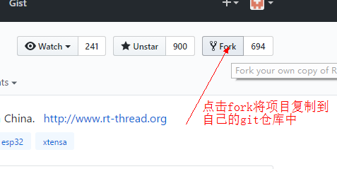

## 克隆（clone）

将 rt-thread 仓库 clone 到自己的本地 PC。

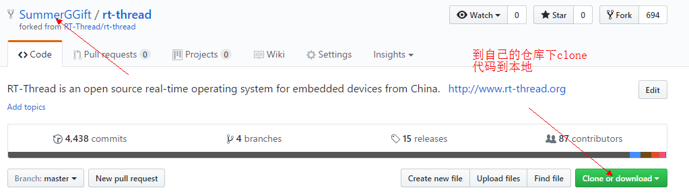

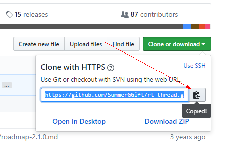

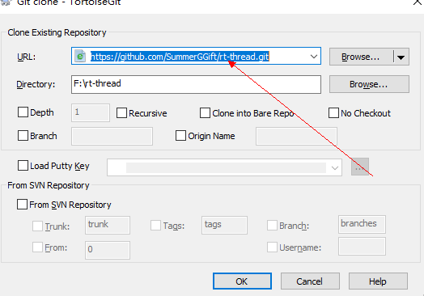

## 创建本地分支

建议从 master 分支创建自己的开发分支，可使用命令 `git checkout -b branchName`。

## 开发

发现了一个小 bug 并进行修改。

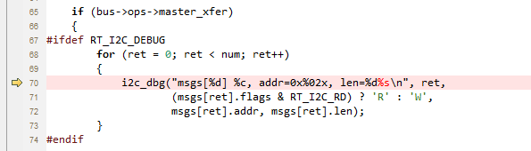

注意：开发时，代码需要符合 [RT-Thread 代码规范](https://github.com/RT-Thread/rt-thread/blob/master/documentation/contribution_guide/coding_style_cn.md)，请仔细检查。

## 提交（commit）

向本地仓库提交 bug.

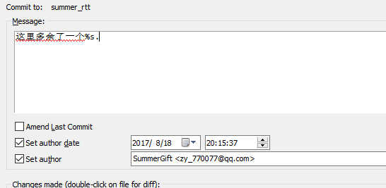

> [!NOTE]
> 注：若本地分支多个 commit，为了保证 RT-Thread 仓库 commit 干净，请整理一下本地的 commit，不接受 Pull Request 有超过 5 个及以上个commit。

## Push 到远程仓库

push 到开发者自己的远程仓库中。

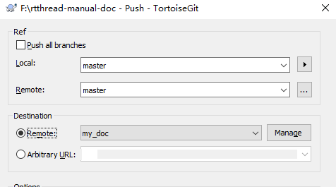

## 发起 Pull Request

在 git 仓库中选择自己修改了的分支，点击 create Pull Request 按钮发起 pull request。

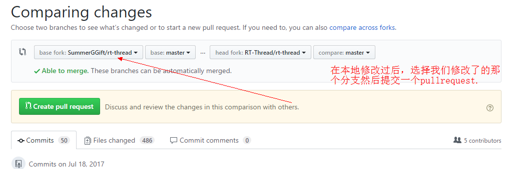

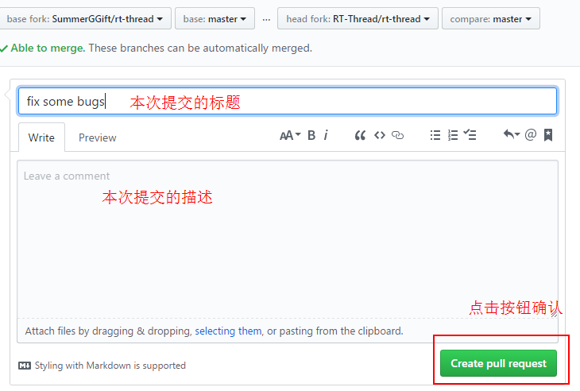

## checklist 核对

在正式发起 Pull Request 之前，需要根据 Preview 里面默认的描述信息即 checklist 仔细核对代码，在没问题的 checklist 对应选项复选框填写[x]确认，**注意[x]两边没有空格**。比如若代码是成熟版本，请选择成熟版本，且可以添加相应的描述信息。checklist 核对完成才可发起 Pull Request。

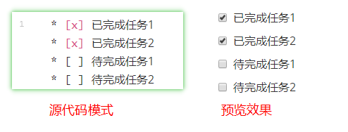

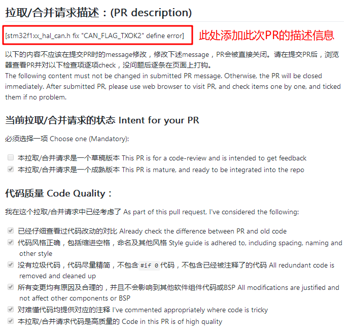

## 签署 CLA

第一次为 RT-Thread 贡献代码需要需要签署 Contributor License Agreement。


请确认 CLA 显示签署成功及 CI 编译通过，如下图所示：

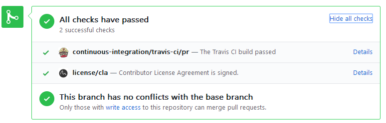

> [!NOTE]
> 注：注意不要使用非 GitHub 账号提交 commmit，或者使用不同的账号提交 commit 后提 Pull Request，这会导致 CLA 签署失败。

## Pull Request 审核

发起请求成功后，RT-Thread 维护人就可以看到你提交的代码。并且会对代码进行审核，相关的评审意见会填写在 GitHub 上。请及时查看 PR 状态并根据评审意见更新代码。

## 合并成功

Pull Request 审核没有问题代码就会被合并到 RT-Thread 仓库中。这样一次 Pull Request 就成功了。

至此，我们就完成了一次代码贡献的过程。

## 和 RT-Thread 仓库保持更新

RT-Thread GitHub 仓库的内容是经常处于更新的状态，若要基于最新的 RT-Thread 代码开发，那么就需要更新本地仓库。

clone 后本地 master 分支内容默认是和 clone 的远程仓库的 master 分支内容保持一致。建议本地新建其他分支开发，master 则和 fork 的 RT-Thread 原仓库保持同步，master 分支不要有内容修改，可以根据以下步骤保持同步：

* 查看现有的远程仓库，一般只有一个默认的 origin，也就是自己的远程仓库：

```c
$ git remote -v
origin  https://github.com/YOUR_USERNAME/YOUR_FORK.git (fetch)
origin  https://github.com/YOUR_USERNAME/YOUR_FORK.git (push)
```

* 添加 RT-Thread 远程仓库并命名为 rtt，rtt 可以是自己自定义的名称：

```c
$ git remote add rtt https://github.com/RT-Thread/rt-thread.git
```

* 查看本地跟踪的所有远程仓库：

```c
$ git remote -v
origin    https://github.com/YOUR_USERNAME/YOUR_FORK.git (fetch)
origin    https://github.com/YOUR_USERNAME/YOUR_FORK.git (push)
rtt       https://github.com/RT-Thread/rt-thread.git (fetch)
rtt       https://github.com/RT-Thread/rt-thread.git (push)
```

* 从 RT-Thread 远程仓库的 master 分支拉取代码并合并到本地的 master 分支：

```c
git pull rtt master
```

## 参考资料

* 若对贡献代码还有不明白的地方，可以参考 Git 官方中文文档[《GitHub - 对项目做出贡献》](https://git-scm.com/book/zh/v2/GitHub-%E5%AF%B9%E9%A1%B9%E7%9B%AE%E5%81%9A%E5%87%BA%E8%B4%A1%E7%8C%AE)章节。
* 教学视频：[从0教你如何给RT-Thread贡献代码](https://www.bilibili.com/video/BV1gr4y1w7yX)
* 小白如何进行开源贡献，可以参考 [开源小白的第一次PR](https://club.rt-thread.org/ask/article/5a3155877b44066c.html)
