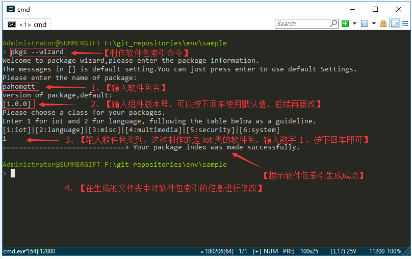
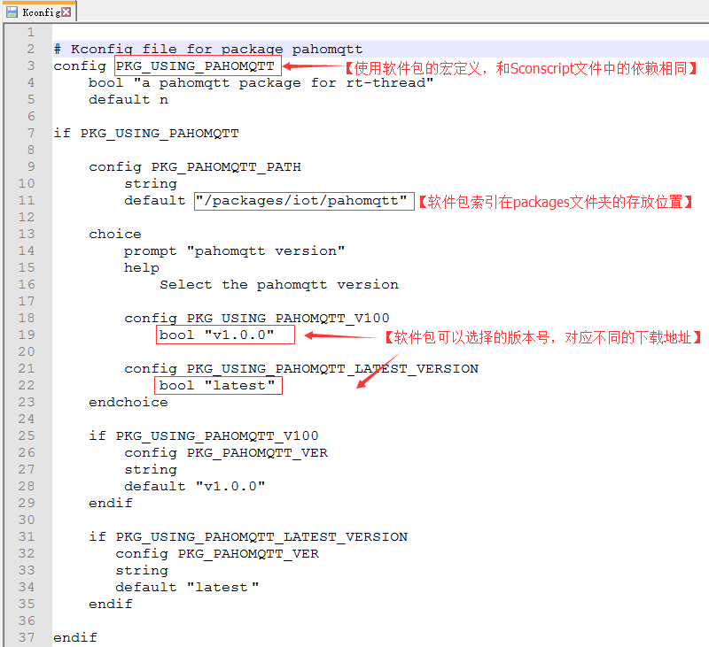
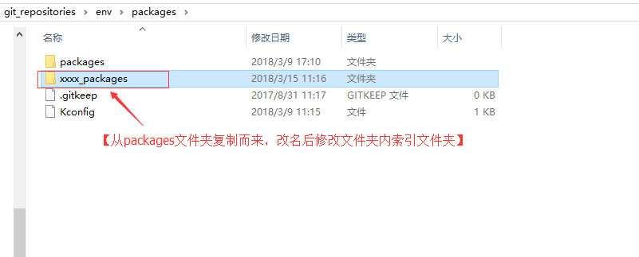
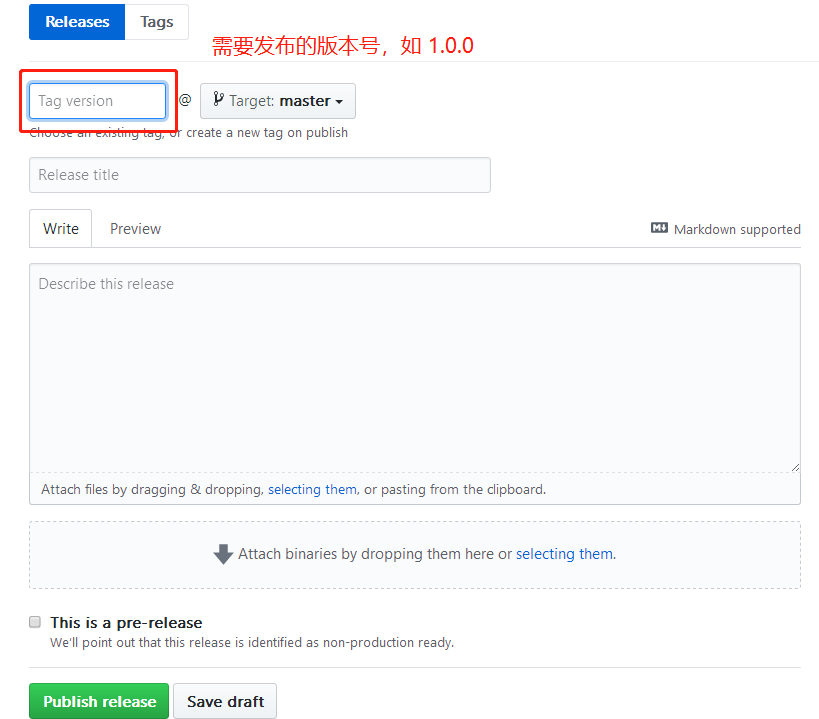

#  软件包开发指南

**软件包定义**：运行于 RT-Thread 物联网操作系统平台上，面向不同应用领域的软件组件形成一个个软件包，由软件包描述信息，软件包源代码或库文件组成。

在制作软件包前，需要先对软件包的功能进行准确的定义，确保 **不要耦合** 与产品业务逻辑有关的代码，提高软件包的 **通用性** 。

软件包应该包含以下内容：

* 软件包代码和说明文档。
* 软件包索引。

例如作为示例的 hello 软件包，这两部分的地址为分别是：

* [软件包代码和说明文档](https://github.com/RT-Thread-packages/hello)
* [软件包索引](https://github.com/RT-Thread/packages/tree/master/misc/hello)

### 整理软件包代码和说明文档

制作软件包前需要仔细阅读[示例软件包说明文档](https://github.com/RT-Thread-packages/hello)，参考示例软件包的文件夹结构。

软件包代码和说明文档应该由以下部分组成：

* 软件包的功能代码；
* 根目录下的 SConscript 文件，用于和 RT-Thread 环境一起进行编译；
* 根目录下的 examples 文件夹，用于提供一份使用的例子；
* 如果需要加入 git submodule ，则可以直接在根目录下添加；
* 根目录下的 README.md 文件，说明这个软件包的功能；
* 根目录下的 docs 文件夹，放置除了 README 之外的其他文档；
* 如果需要额外的移植代码，可将其放在 port 文件夹下；

### 创建软件包索引

**软件包索引** ：指存放在 `env\packages` 文件夹下的软件包 **描述文件** 。以 `env\packages\packages\iot\pahomqtt` 文件夹为例，包含内容如图所示：


- **Kconfig 文件**：软件包的配置项，如软件包版本、功能选项等信息。
- **package.json 文件**：存放软件包的名称、简介、各个版本对应的下载链接等信息。

#### 使用索引生成向导

我们可以使用 Env 的软件包索引生成向导功能来制作软件包索引，命令为 `pkgs --wizard`，大致流程如下如图所示：



生成内容如下图所示：


> 提示：SConscript 文件在制作软件包代码时使用，将其移动到软件包源码文件夹中即可，无需保留在索引文件夹中。

#### 修改 package.json 文件

- **package.json 文件**介绍：

```json
{
    "name" : "pahomqtt",
    "description" : "a pahomqtt package for rt-thread",   # 软件包描述信息
    "keywords" : [
        "pahomqtt"
    ],
    "site" : [
    {
       "version" : "v1.0.0",
       "URL" : "https://pahomqtt-1.0.0.zip",              # 根据版本号修改软件包压缩包的下载地址
       "filename" : "pahomqtt-1.0.0.zip",
       "VER_SHA" : "fill in the git version SHA value"    # 压缩包形式无需填写
    },
    {
       "version" : "latest",                              # latest 版本
       "URL" : "https://xxxxx.git",                       # 可以填入 Git 仓库地址
       "filename" : "Null for git package",
       "VER_SHA" : "fill in latest version branch name,such as mater" # 填入 SHA 值或者分支名
    }
    ]
}
```

关于文件中 `URL` 值，每个版本可以填入两种类型 ：

- **Git** ：可以填入 Git 仓库地址和对应版本的 SHA 值。一般 `latest` 版本会在 **SHA** 填入`master`。
- **压缩包** ： 指定软件包压缩包的下载地址，此时无需填入 **SHA** 。

**package.json** 是软件包的描述信息文件，包括软件包名称，软件包描述，作者等信息，以及必须的 package 代码下载链接。另外，请务必包含许可证的说明，使用了哪种许可证（ GPLv2，LGPLv2.1，MIT，Apache license v2.0，BSD 等）。

修改后的 package.json 大致如下：
```json
{
    "name" : "pahomqtt",
    "description" : "Eclipse Paho MQTT C/C++ client for Embedded platforms", # 更新了描述信息
    "keywords" : [
        "pahomqtt"
    ],
    "site" : [
    {
       "version" : "v1.0.0",                                             # v1.0.0 版本
       "URL" : "https://github.com/RT-Thread-packages/paho-mqtt.git",    # 更新了 git 仓库地址
       "filename" : "paho-mqtt-1.0.0.zip",
       "VER_SHA" : "cff7e82e3a7b33e100106d34d1d6c82e7862e6ab"            # 填入了指定版本的 SHA 值
    },
    {
       "version" : "latest",                                             # 最新版本
       "URL" : "https://github.com/RT-Thread-packages/paho-mqtt.git",
       "filename" : "paho-mqtt.zip",
       "VER_SHA" : "master"                                              # 填入 master
    }
    ]
}
```

#### 修改 Kconfig 文件

 **Kconfig** 文件内容大致如下：



软件包索引中的 Kconfig 文件主要由 menuconfig 命令使用，软件包的一些选项必须在 Kconfig 文件中定义出来，注意事项如下：

* 1、索引向导自动生成的 **Kconfig** 文件中的内容大多是必须的，可以参考其他软件包修改选项的值，但是**不要删除选项**。

* 2、软件包必须包含一个以`PKG_USING_`开头的配置项，这样RT-Thread的包管理器才能将其正确识别。假设这个包的名称叫做SOFTA，那么软件包总选项应该是`PKG_USING_SOFTA`；

* 3、和这个SOFTA软件包相关的其他选项，需要以`SOFTA_`开头的配置项进行定义，可以是`SOFTA_USING_A`或者`SOFTA_ENABLE_A`等方式。

* 4、支持 **latest** 版本的软件包也至少需要一个固定版本，以防止在某个时候找不到合适的版本。

* 5、软件包如果还需要更多的配置项，可以搜索 **Kconfig 语法** ，并参考已有的软件包来对 Kconfig 文件进行修改。

### 上传软件包

软件包可以上传到 git 上或者其他可供下载的地方，推荐使用 git 仓库的方式进行保存，这样方便更新软件包版本。

参考：[RT-Thread 软件包仓库]( https://github.com/RT-Thread-packages)

### 测试软件包

- **软件包的下载**：将软件包索引拷贝到 `env\packages\packages` 下对应的位置，然后在 Env 中尝试在线下载软件包，测试下载是否成功。
- **软件包的功能**：下载完成后，使用 scons 命令重新编译项目，在相应的环境下运行，测试软件包功能是否正确。
- **软件包版本的切换**：尝试在 menuconfig 下切换软件包的版本，查看版本切换是否正常。

### 提交软件包索引

最后需要将软件包索引通过 PR 流程推送到：[https://github.com/RT-Thread/packages](https://github.com/RT-Thread/packages)

[点击这里](../github/github.md)了解如何提交 PR 。

## 软件包索引源的管理

Env 可以从多个软件包源来下载软件包，每个源的软件包列表就存放在 `env\packages` 文件夹中，如 `env\packages\packages` 文件夹下就是 RT-Thread 官方的软件包列表。

### 添加软件包源

- 复制一份 RT-Thread 官方的 packages 文件夹，修改文件夹名称后，删除该文件夹内不需要的软件包索引，将需要的索引添加进去。



- 更新 `env\packages` 文件夹下的 Kconfig 文件，在 Kconfig 文件中添加软件包源信息。


### 删除软件包源

- 删除软件源文件夹；
- 将 Kconfig 文件中相应的源文件夹信息删除。

## 新版本发布流程

软件包发布新版本需要遵循以下流程：

1、检查软件包，确保软件包功能使用正常。

2、在 github 上使用 release 功能发布新版本，如果没有权限可以通知管理员发布新版本。如果不知道该如何 release，可以参考 [paho-mqtt 软件包仓库](https://github.com/RT-Thread-packages/paho-mqtt/releases)，发布新版本界面如下所示：

   

3、修改本地软件包索引，在 kconfig 文件和 package.json 文件中添加新版本的信息。

4、在本地测试新版本软件包的下载和删除，以及安装是否正常，确保软件包可以被正常添加到工程中使用。

5、向[软件包索引](https://github.com/RT-Thread/packages)提交 PR，并通知管理员合并。

