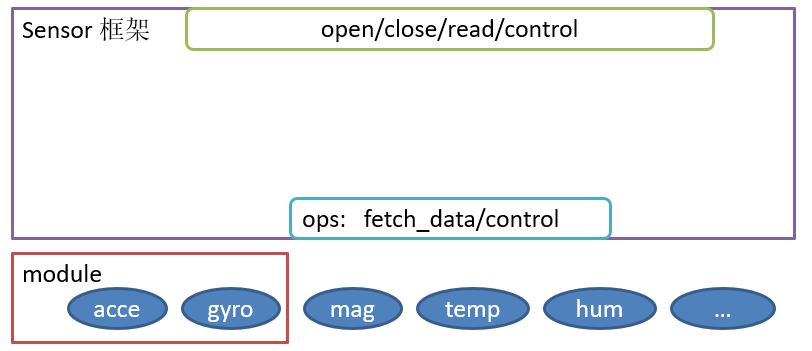
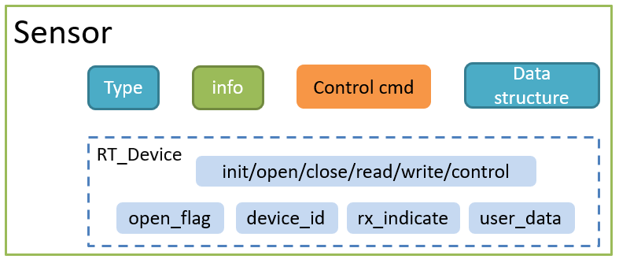

# 传感器驱动框架介绍

## 背景与概述

Sensor 是物联网重要的一部分，“Sensor 之于物联网”相当于“眼睛之于人类”。人没有眼睛就看不到这大千的花花世界，物联网没有了 Sensor 更是不能感知这变化万千的世界。

现在，为物联网开发的 Sensor 已经很多了，有加速度计(Accelerometer)，磁力计(Magnetometer)，陀螺仪(Gyroscope)，光感计(Ambient light sensor)，接近光(Proximity)，气压计(Barometer/pressure)，湿度计(Humidometer)等等。这些传感器，世界上的各大半导体厂商都有出产，虽然增加了市场的可选择性，同时也加大了应用程序开发的难度。因为不同的传感器厂商、不同的传感器都需要配套自己独有的驱动才能运转起来，这样在开发应用程序的时候就需要针对不同的传感器做适配，自然加大了开发难度。为了降低应用开发的难度，增加传感器驱动的可复用性，我们设计了 Sensor 驱动框架。

Sensor 驱动框架的作用是：为上层提供统一的操作接口，提高上层代码的可重用性；简化底层驱动开发的难度，只要实现简单的 ops(operations: 操作命令) 就可以将传感器注册到系统上。

## 整体框架

Sensor 驱动框架的整体架构图如下：



它为上层提供的是标准 device 接口`open/close/read/write/control` ，为底层驱动提供的是简单的 ops 接口:`fetch_data/control`。并且框架支持 module(模块)，为底层存在耦合的传感器设备提供服务。

## 工作原理

Sensor 设备其实是对标准设备 `rt_device` 的一个丰富，是在原有标准设备的基础上增加了 Sensor 自己独有的一部分 `属性` 和 `控制命令` ，如下图所示：



整个 Sensor 设备包括两个部分：

- 继承自标准设备的一些特性，包括：标准的控制接口 、`回调函数`、`device_id` 等。
- Sensor 设备独有的部分，包括：`Sensor 的类型`、`相关的信息`、`特有的控制命令`、`ops`、以及一些 `数据的结构`。

### sensor 的结构体

Sensor 设备的结构体如下所示：

```c
struct rt_sensor_device
{
    struct rt_device             parent;    /* The standard device */

    struct rt_sensor_info        info;      /* The sensor info data */
    struct rt_sensor_config      config;    /* The sensor config data */

    void                        *data_buf;  /* The buf of the data received */
    rt_size_t                    data_len;  /* The size of the data received */

    const struct rt_sensor_ops  *ops;       /* The sensor ops */

    struct rt_sensor_module     *module;    /* The sensor module */

    rt_err_t (*irq_handle)(rt_sensor_t sensor);  /* Called when an interrupt is generated, registered by the driver */
};
typedef struct rt_sensor_device *rt_sensor_t;
```

### Sensor 的信息

struct rt_sensor_info info 里存储的是一些与 Sensor 自身相关的信息，在 Sensor 设备注册的时候提供，在使用的过程中不应修改其内容。具体成员如下所示。

```c
struct rt_sensor_info
{
    rt_uint8_t     type;                    /* The sensor type */
    rt_uint8_t     vendor;                  /* Vendor of sensors */
    const char    *model;                   /* model name of sensor */
    rt_uint8_t     unit;                    /* unit of measurement */
    rt_uint8_t     intf_type;               /* Communication interface type */
    rt_int32_t     range_max;               /* maximum range of this sensor's value. unit is 'unit' */
    rt_int32_t     range_min;               /* minimum range of this sensor's value. unit is 'unit' */
    rt_uint32_t    period_min;              /* Minimum measurement period,unit:ms. zero = not a constant rate */
    rt_uint8_t     fifo_max;                /* Maximum depth of fifo  */
};
```

Sensor 的类型暂时只有以下几种，如果有新的传感器类型，可以提 PR 添加上。

```c
#define RT_SENSOR_CLASS_ACCE           (1)  /* Accelerometer     */
#define RT_SENSOR_CLASS_GYRO           (2)  /* Gyroscope         */
#define RT_SENSOR_CLASS_MAG            (3)  /* Magnetometer      */
#define RT_SENSOR_CLASS_TEMP           (4)  /* Temperature       */
#define RT_SENSOR_CLASS_HUMI           (5)  /* Relative Humidity */
#define RT_SENSOR_CLASS_BARO           (6)  /* Barometer         */
#define RT_SENSOR_CLASS_LIGHT          (7)  /* Ambient light     */
#define RT_SENSOR_CLASS_PROXIMITY      (8)  /* Proximity         */
#define RT_SENSOR_CLASS_HR             (9)  /* Heart Rate        */
#define RT_SENSOR_CLASS_TVOC           (10) /* TVOC Level        */
#define RT_SENSOR_CLASS_NOISE          (11) /* Noise Loudness    */
#define RT_SENSOR_CLASS_STEP           (12) /* Step sensor       */
#define RT_SENSOR_CLASS_FORCE          (13) /* Force sensor      */
```
其他的几个成员，分别是厂商、model（如:"mpu6050"）、传感器数据的单位、通信接口类型、测量的最大范围、测量的最小范围、最小测量周期、硬件 FIFO 的最大深度。

### Sensor 的配置

Sensor 驱动框架抽象出了一些公共的配置选项，这些可配置的选项置于 `struct rt_sensor_config` 里, 成员如下：

```c
struct rt_sensor_config
{
    struct rt_sensor_intf        intf;      /* sensor interface config */
    struct rt_device_pin_mode    irq_pin;   /* Interrupt pin, The purpose of this pin is to notification read data */
    rt_uint8_t                   mode;      /* sensor work mode */
    rt_uint8_t                   power;     /* sensor power mode */
    rt_uint16_t                  odr;       /* sensor out data rate */
    rt_int32_t                   range;     /* sensor range of measurement */
};
```
这些配置项中的 intf 和 irq_pin 是为了将传感器和硬件解耦而抽象出来的，通过在底层初始化的时候传入 `struct rt_sensor_config` 这个参数，完成了通信接口的解耦。

```c
struct rt_sensor_intf
{
    char                       *dev_name;   /* The name of the communication device */
    rt_uint8_t                  type;       /* Communication interface type */
    void                       *user_data;  /* Private data for the sensor. ex. i2c addr,spi cs,control I/O */
};
```
其余的一些配置项是用 Sensor 特有控制命令控制的，如下所示：

```c
#define  RT_SENSOR_CTRL_GET_ID         (0)  /* 读设备ID */
#define  RT_SENSOR_CTRL_GET_INFO       (1)  /* 获取设备信息 */
#define  RT_SENSOR_CTRL_SET_RANGE      (2)  /* 设置传感器测量范围 */
#define  RT_SENSOR_CTRL_SET_ODR        (3)  /* 设置传感器数据输出速率，unit is HZ */
#define  RT_SENSOR_CTRL_SET_MODE       (4)  /* 设置工作模式 */
#define  RT_SENSOR_CTRL_SET_POWER      (5)  /* 设置电源模式 */
#define  RT_SENSOR_CTRL_SELF_TEST      (6)  /* 自检 */
```
结合 ops 中的 control 接口使用，就可以完成传感器的配置了。

### Sensor 数据的存储

为了方便数据的解析，规定每一个类型的 Sensor 都有自己独有的数据结构，这些成员之间使用`共用体`以减少代码量。

```c
/* 3-axis Data Type */
struct sensor_3_axis
{
    rt_int32_t x;
    rt_int32_t y;
    rt_int32_t z;
};
struct rt_sensor_data
{
    rt_uint32_t         timestamp;          /* The timestamp when the data was received */
    rt_uint8_t          type;               /* The sensor type of the data */
    union
    {
        struct sensor_3_axis acce;          /* Accelerometer.       unit: mG          */
        struct sensor_3_axis gyro;          /* Gyroscope.           unit: mdps        */
        struct sensor_3_axis mag;           /* Magnetometer.        unit: mGauss      */
        rt_int32_t           temp;          /* Temperature.         unit: dCelsius    */
        rt_int32_t           humi;          /* Relative humidity.   unit: permillage  */
        rt_int32_t           baro;          /* Pressure.            unit: pascal (Pa) */
        rt_int32_t           light;         /* Light.               unit: lux         */
        rt_int32_t           proximity;     /* Distance.            unit: centimeters */
        rt_int32_t           hr;            /* Heat rate.           unit: HZ          */
        rt_int32_t           tvoc;          /* TVOC.                unit: permillage  */
        rt_int32_t           noise;         /* Noise Loudness.      unit: HZ          */
        rt_uint32_t          step;          /* Step sensor.         unit: 1           */
        rt_int32_t           force;         /* Force sensor.        unit: mN          */
    } data;
};
```

### 特有的 ops

ops（操作函数）包含两个函数指针， 一个的作用是获取传感器数据（fetch_data），另一个的作用是通过控制命令控制传感器（control）。

```c
struct rt_sensor_ops
{
    rt_size_t (*fetch_data)(struct rt_sensor_device *sensor, void *buf, rt_size_t len);
    rt_err_t (*control)(struct rt_sensor_device *sensor, int cmd, void *arg);
};
```

### 注册方式

传感器驱动框架提供了一个 Sensor 注册函数，通过传入 Sensor 的控制块，名称，标志位和私有数据，就可以完成传感器设备的注册。

```c
int rt_hw_sensor_register(rt_sensor_t sensor,
                          const char              *name,
                          rt_uint32_t              flag,
                          void                    *data);
```

这样看来 Sensor 驱动框架依托于标准的设备框架，只要将传感器驱动对接到 Sensor 的 ops 上，并通过调用 `rt_hw_sensor_register` 函数注册为 Sensor 设备就可以通过标准的设备接口控制传感器了。

### module支持

module 的定义是解决底层有耦合的两个传感器而出现的，有些传感器既有加速度计的功能又有陀螺仪的功能，并且他们的FIFO是共用的，在 FIFO 模式下，只能将两个类型的传感器的数据同时读出，这就说明他们的数据是耦合的。

为了解决这个问题，我们定义了 module 的类型

```c
struct rt_sensor_module
{
    rt_mutex_t            lock;                      /* The module lock */

    rt_sensor_t           sen[RT_SENSOR_MODULE_MAX]; /* The module contains a list of sensors */
    rt_uint8_t            sen_num;                   /* Number of sensors contained in the module */
};
```
里面包含有耦合的传感器的设备控制块指针，通过这个功能就可以在读取陀螺仪的数据的时候，同时更新加速度计的值，解决了底层耦合的问题。
