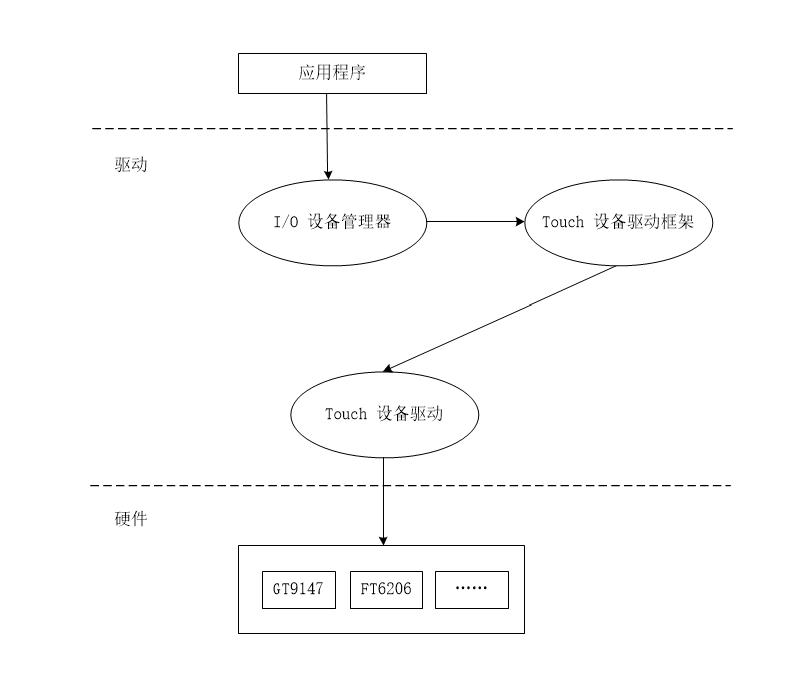
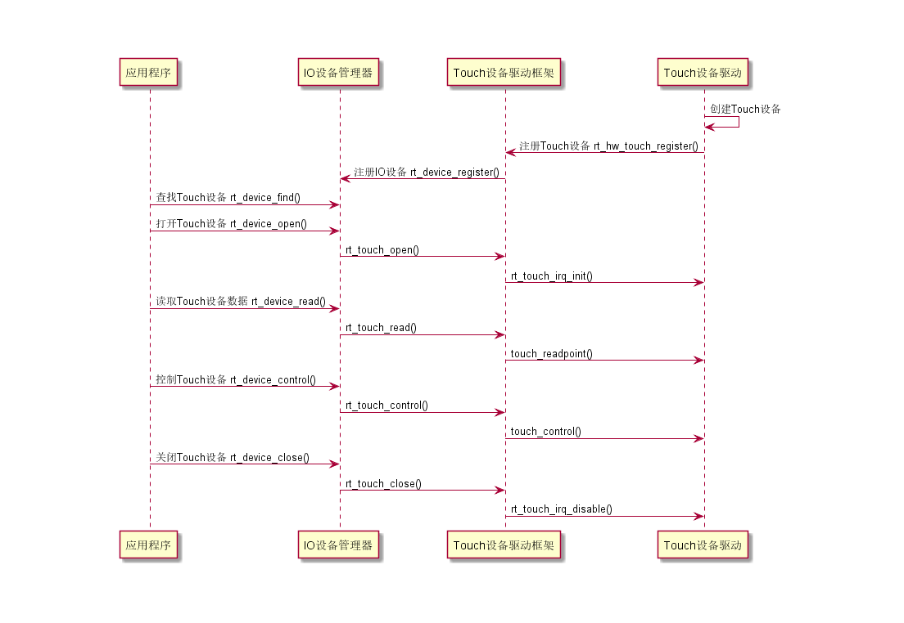
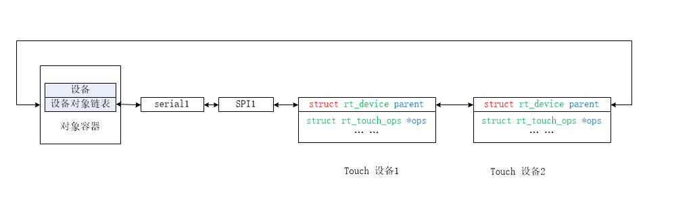
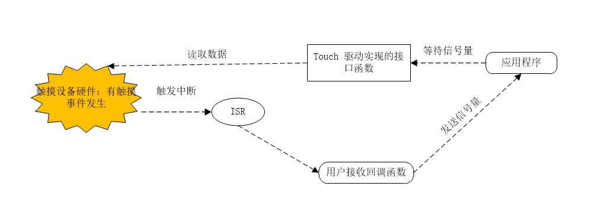

# Touch 设备驱动框架详解

## 概述

### 特性
RT-Thread 为方便管理和使用触摸设备和与 UI 的对接，抽象出了 Touch 设备驱动框架。应用程序可通过 I/O 设备管理接口来访问触摸设备硬件。Touch 设备驱动框架有以下特点：

 * 为上层提供统一的操作接口，提高上层代码的可重用性；
 * 简化底层驱动开发的难度，只要实现简单的 ops(operations: 操作命令) 就可以将触摸设备注册到系统上。
 * 支持中断模式读取触摸点数据；
 * Touch 框架支持读取多触摸点数据。

### 软件架构

Touch 设备驱动框架层级如下图所示：



* I/O 设备管理器 `src\device.c`：
  * 为应用程序提供通用的 I/O 设备管理接口，比如 rt_device_open(read/control) 等，用户使用这些接口访问 Touch 设备。
  * 为设备驱动提供了通用的 IO 设备的操作方法接口 struct rt_device_ops(init/open/close/read/write/control)，设备驱动需要实现这些接口。

* Touch 设备驱动框架 `components\drivers\touch\touch.c`：
  * Touch 设备驱动框架实现了 I/O 设备的操作方法接口： rt_touch_open(close/read/control) 。
  * 为 Touch 设备驱动提供了 Touch 设备的操作方法 `struct rt_touch_ops`。
  * 为 Touch 设备提供了注册接口 `rt_hw_touch_register`。

* Touch 设备驱动
  * 实现由 Touch 设备驱动框架提供的具体 Touch 设备的操作方法 `struct rt_touch_ops`。
  * 注册 Touch 设备到操作系统；

### Touch 设备使用序列

  * Touch 设备驱动创建 Touch 设备实例，并将该 Touch 设备通过 `rt_hw_touch_register()` 注册到 Touch 设备驱动框架中。Touch 设备驱动框架通过 `rt_device_register()` 将 Touch 设备注册到 I/O 设备管理器中。

 * Touch 设备驱动通过 Touch 设备驱动框架提供的接口访问硬件 Touch 控制器。

Touch 设备注册和使用序列图如下图所示:



##  Touch 设备注册机制

### Touch 设备控制块
Touch 设备驱动框架定义了 Touch 设备模型，它从设备对象派生而来，Touch 设备模型定义如下面代码所示：

```c
struct rt_touch_device
{
    struct rt_device            parent;        /* 设备基类 */
    struct rt_touch_info        info;          /* Touch 设备基本信息*/
    struct rt_touch_config      config;        /* Touch 设备配置参数 */

    const struct rt_touch_ops  *ops;           /* Touch 的操作方法 */
    rt_err_t (*irq_handle)(rt_touch_t touch);  /* 中断回调函数 */
};
```
* 设备基类(parent)：Touch 设备继承至设备基类 `struct rt_device` ，这个类是所有设备的父类。
* Touch 设备基本信息(info)：Touch 设备的基本信息例如分辨率、支持的触点个数等；
* Touch 设备的配置参数(config)：Touch 设备初始化的时候会根据配置参数初始化 Touch 芯片
* Touch 设备的操作方法(ops)：提供了 Touch 设备的操作方法，由 Touch 设备驱动实现。

 ### Touch 的信息
struct rt_touch_info info 里存储的是一些与 Touch 自身相关的信息，在使用的过程中不应修改其内容。具体成员如下所示：

```c
struct rt_touch_info
{
    rt_uint8_t     type;                       /* 触摸芯片类型：电阻屏/电容屏 */
    rt_uint8_t     vendor;                     /* 厂商信息 */
    rt_uint8_t     point_num;                  /* 支持的触控点数 */
    rt_int32_t     range_x;                    /* X 轴分辨率 */
    rt_int32_t     range_y;                    /* Y 轴分辨率 */
};
```

### Touch 的配置
Touch 驱动框架抽象出了一些公共的配置选项，这些可配置的选项置于 `struct rt_touch_config` 里, 成员如下：
```c
struct rt_touch_config
{
    struct rt_device_pin_mode   irq_pin;       /* 中断引脚和模式 */
    char                        *dev_name;     /* 接口总线名称 */
    void                        *user_data;    /* 扩展数据 */
};
```

### Touch 设备操作方法

Touch 设备的操作方法是 Touch 设备驱动需要实现的主要功能， 结构体原型如下：

```c
/* Touch 设备的操作方法 */
struct rt_touch_ops
{
    rt_size_t (*touch_readpoint)(struct rt_touch_device *touch, void *buf, rt_size_t touch_num);
    rt_err_t (*touch_control)(struct rt_touch_device *touch, int cmd, void *arg);
};
```

操作方法的描述如下表所示：

| 接口              | 描述                                |
|:------------------|:------------------------------------|
|touch_readpoint    | 读取 Touch 设备触摸点信息 |
|touch_control | 根据命令控制字 cmd 控制 Touch 设备 |

#### 接口函数 `touch_readpoint`

读取触点信息的接口函数 `touch_readpoint` 的描述如下表所示：

|   参数   |   描述                           |
|----------|------------------------------------|
| touch   | Touch 设备句柄 |
| buf      | 读到的数据指针(数据的类型如下触点信息组成所示) |
| touch_num      | 需要读取的触点信息的个数 |
|   返回   |   ——                             |
| rt_size_t    | 实际读到的触点信息的个数                   |


#### 接口函数 `touch_control`

控制 Touch 设备的接口函数 `touch_control` 的描述如下表所示：


|   参数   |   描述                           |
|----------|------------------------------------|
| touch   | Touch 设备句柄 |
| cmd      | 控制命令 |
| arg      | 控制参数 |
|   返回   |   ——                             |
| RT_EOK    | 成功                  |
| 其他错误码    | 失败                  |

该接口根据控制命令 cmd 和控制参数 arg 控制 Touch 设备。
参数 cmd 可取以下宏定义值：
```c
#define  RT_TOUCH_CTRL_GET_ID            (0)
#define  RT_TOUCH_CTRL_GET_INFO          (1)
#define  RT_TOUCH_CTRL_SET_MODE          (2)
#define  RT_TOUCH_CTRL_SET_X_RANGE       (3)
#define  RT_TOUCH_CTRL_SET_Y_RANGE       (4)
#define  RT_TOUCH_CTRL_SET_X_TO_Y        (5)
#define  RT_TOUCH_CTRL_DISABLE_INT       (6)
#define  RT_TOUCH_CTRL_ENABLE_INT        (7)
```

### Touch 设备注册

Touch 设备的实例化、操作方法的实现和注册都是在 Touch 驱动中完成。Touch 设备注册函数的源代码如下所示：
```c
/* 注册 Touch 设备 */
int rt_hw_touch_register(rt_touch_t touch,
                         const char              *name,
                         rt_uint32_t              flag,
                         void                    *data)
{
    rt_int8_t result;
    rt_device_t device;
    RT_ASSERT(touch != RT_NULL);
    /* 获取设备基本对象 */
    device = &touch->parent;
    /* 保存 Touch 设备的操作方法 */
#ifdef RT_USING_DEVICE_OPS
    device->ops         = &rt_touch_ops;
#else
    device->init        = RT_NULL;
    device->open        = rt_touch_open;
    device->close       = rt_touch_close;
    device->read        = rt_touch_read;
    device->write       = RT_NULL;
    device->control     = rt_touch_control;
#endif
    /* 设备类型为 Touch 设备 */
    device->type        = RT_Device_Class_Touch;
    device->rx_indicate = RT_NULL;
    device->tx_complete = RT_NULL;
    device->user_data   = data;
    /* 注册 Touch 设备 */
    result = rt_device_register(device, name, flag | RT_DEVICE_FLAG_STANDALONE);
    ......
}
```

注册 Touch 设备的时候 Touch 设备控制块会被初始化，操作方法也会保存，最终会调用 `rt_device_register()` 注册 Touch 到内核对象管理器中。RT-Thread 采用内核对象管理器来管理所有的内核对象，系统中所有的设备都属于设备类型对象。所有注册到系统的设备都被链接到了设备对象管理链表上。链接到对象管理器中的 Touch 设备如下图所示：



## Touch 设备数据传输

### 触点信息组成

```c
struct rt_touch_data
{
    rt_uint8_t          event;
    rt_uint8_t          track_id;
    rt_uint8_t          width;
    rt_uint16_t         x_coordinate;
    rt_uint16_t         y_coordinate;
    rt_tick_t           timestamp;
};
```

* event：触摸事件，包括抬起事件、按下事件和移动事件。
* track_id：每个触摸点都有自己的触摸轨迹，这个数据用来保存触摸轨迹 ID。
* width：触摸点宽度。
* x_coordinate：触摸点 X 轴坐标。
* y_coordinate：触摸点 Y 轴坐标。
* timestamp：触摸事件时间戳。

### 中断模式接收触点信息

中断模式下接收数据有很好的实时性，这种模式下对 CPU 的占用率大大降低，应用程序只用在底层中断发生时去读取数据，不需要一直占用 CPU。使用中断接收模式时，首先应用程序打开 Touch 设备会指定打开标志为 `RT_DEVICE_FLAG_INT_RX`，此时 Touch 设备驱动框架会按照初始化时指定的中断引脚和模式去使能中断。

中断接收数据的应用：

一般情况下应用程序使用 Touch 接收数据会配合操作系统提供的通信机制一起使用。Touch 数据读取线程会等待一个信号量，获取信号量后才会去读取数据。Touch 接收数据回调函数则会释放信号量，通知应用程序有触摸事件发生。流程如下图所示：




## 参考资料

* 《Touch 设备使用指南》

* 《Touch 设备驱动开发指南》
