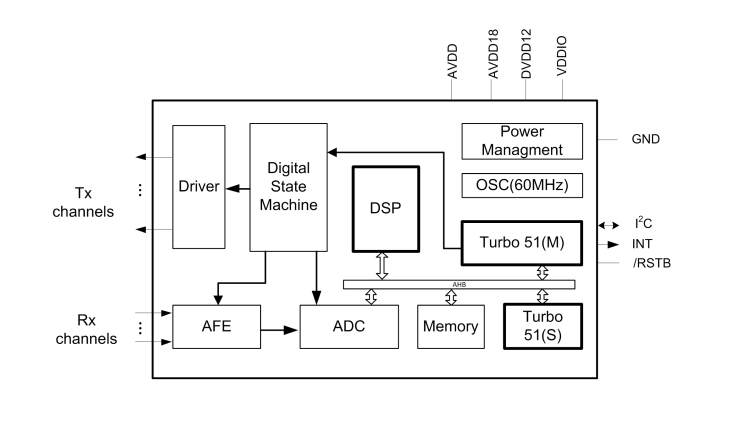
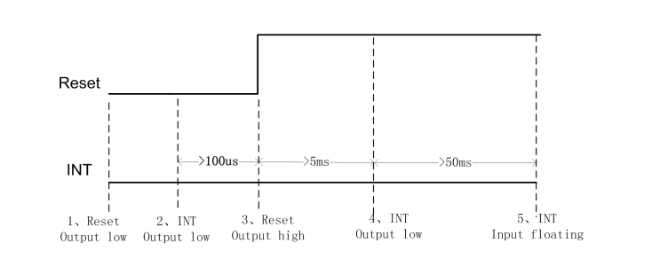
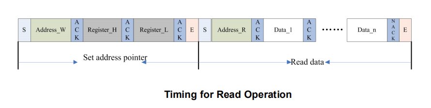
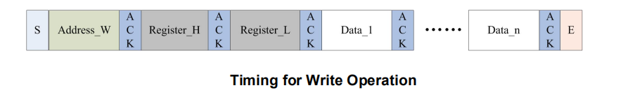

# TOUCH 从设备 GT9147 驱动开发指南

## 开发步骤

本文档为 RT-Thread Touch 从设备驱动开发指南，给开发团队提供开发指导和规范。

> [!NOTE]
> 注：在阅读本篇文档之前，请先查看文档 [《Touch 设备驱动框架详解》](./touch_device.md)。

Touch 从设备驱动开发可以按照如下的步骤进行：

 1. 创建 Touch 从设备。

 2. 实现 Touch 设备的操作方法。

 3. 注册 Touch 设备到操作系统。

本文档将会以 GT9147 为例讲解 Touch 从设备驱动的具体实现。

## GT9147 简介

### 概述

GT9147 是采用最新的电容检测技术，内置高性能微信号检测电路，可以很好地解决 LCD 干扰和共模干扰问题。软件方面，专门基于单层互容的电气环境设计，可支持 5 点触控。同时支持 HotKnot 功能。

GT9147 可同时识别 5 个触摸点位的实时准确位置，移动轨迹及触摸面积。并可根据主控需要，读取相应点数的触摸信息。功能框图如下图所示：

 

GT9147 采用 I2C 连接的方式读取转换数据。GT9147 相关使用引脚和 MCU 的连接方式如下表所示：

|  GT9147 引脚   |  MCU 引脚                                                                                                                  |
|----------------|----------------------------------------------------------------------------------------------------------------------------|
| RSTB（复位）   | GPIO 输出，输出高、低来控制 GT9147 的 RESET 口为高或低。为保证可靠复位，建议 RESET 脚输出低 100μs 以上。                   |
| INT（中断）    | GPIO 输入, 主控的 INT 口线需具有上升沿或下降沿中断触发功能，并且当其在输入态时，主控端必须设为悬浮态，取消内部上下拉功能； |
|  I2C           | I2C 总线                                                                                                                   |

### 硬件配置

这里以配置 GT9147 从设备地址为 0xBA/0xBB 为例，配置的时序图如下图所示：

 

* 首先配置 INT 引脚和 RST 引脚均为输出。
* INT 引脚输出低电平。
* 拉低 RST 引脚，为保证可靠复位，建议 RST 引脚输出低 100 us 以上。
* 拉高 RST 引脚，为保证可靠复位，建议 RST 引脚输出高 100 us 以上。
* 配置 INT 引脚为输入，用于接收中断。

GT9147 使用到了 RT-Thread 提供的 PIN 设备管理框架、I2C 设备管理框架和 Touch 设备管理框架。

## 创建 Touch 从设备

GT9147 的接口总线是基于 I2C 从设备来实现数据的传输，所以创建一个 Touch 从设备也就是创建一个 I2C 从设备。部分源代码如下所示：

```c
......
static struct rt_i2c_client *gt9147_client;
/* 创建 I2C 从设备 */
gt9147_client = (struct rt_i2c_client *)rt_calloc(1, sizeof(struct rt_i2c_client));
/* 查找I2C 从设备 */
gt9147_client->bus = (struct rt_i2c_bus_device *)rt_device_find(cfg->dev_name);
if (gt9147_client->bus == RT_NULL)
{
    LOG_E("Can't find device\n");
    return RT_ERROR;
}
/* 打开 I2C 接口总线 */
if (rt_device_open((rt_device_t)gt9147_client->bus, RT_DEVICE_FLAG_RDWR) != RT_EOK)
{
    LOG_E("open device failed\n");
    return RT_ERROR;
}

gt9147_client->client_addr = GT9147_ADDRESS_HIGH;
/* 复位 I2C 从设备 */
gt9147_soft_reset(gt9147_client);
```

用户创建 Touch 从设备时只需要传入 Touch 从设备使用的接口总线的名称，就可以创建对应 Touch 从设备。

I2C 从设备框架中定义了 I2C 的从设备控制块，如下面代码所示：

```c
struct rt_i2c_client
{
    struct rt_device               parent;         /* 设备基类 */
    struct rt_i2c_bus_device       *bus;           /* I2C 总线控制块指针 */
    rt_uint16_t                    client_addr;    /* 从设备地址 */
};
```
## 实现 Touch 设备的操作方法

### 读 GT9147 寄存器

GT9147 是标准的 I2C 从设备，所以使用 I2C 总线读取数据，下图为使用 I2C 从 GT9147 读取数据的时序图:

 

 GT9147 读时序的描述如下：
  1. 发送 I2C 总线起始信号；
  2. 发送 I2C 器件地址(写标志)；
  3. 发送寄存器地址的高八位并等待应答；
  4. 发送寄存器地址的低八位并等待应答；
  5. 重新发送 I2C 起始信号；
  6. 发送 I2C 地址(读标志)；
  7. 读数据(data1、2...n)；
  8. 数据读取完成发送停止 I2C 总线信号

读 GT9147 寄存器的源代码如下：

```c
static rt_err_t gt9147_read_regs(struct rt_i2c_client *dev,
                                 rt_uint8_t *cmd_buf,
                                 rt_uint8_t cmd_len,
                                 rt_uint8_t read_len,
                                 rt_uint8_t *read_buf)
{
    rt_int8_t res = 0;

    struct rt_i2c_msg msgs[2];
    /* I2C 总线写数据 */
    msgs[0].addr  = dev->client_addr;        /* 从设备地址 */
    msgs[0].flags = RT_I2C_WR;               /* 写标志 */
    msgs[0].buf   = cmd_buf;                 /* 要写入的寄存器地址 */
    msgs[0].len   = cmd_len;                 /* 写入数据长度 */

    msgs[1].addr  = dev->client_addr;        /* 从设备地址 */
    msgs[1].flags = RT_I2C_RD;               /* 读标志 */
    msgs[1].buf   = read_buf;                /* 读到的数据指针 */
    msgs[1].len   = read_len;                /* 要读的数据长度 */
    /* 传输数据 */
    if (rt_i2c_transfer(dev->bus, msgs, 2) == 2)
    {
        res = RT_EOK;
    }
    else
    {
        res = RT_ERROR;
    }

    return res;
}
```

### 写 GT9147 寄存器

下图为使用 I2C 向 GT9147 写入数据的时序图:



 GT9147 写时序的描述如下：
  1. 发送 I2C 总线起始信号；
  2. 发送 I2C 器件地址(写标志)；
  3. 发送寄存器地址的高八位并等待应答；
  4. 发送寄存器地址的低八位并等待应答；
  7. 发送要写入的数据(data1、2...n)；
  8. 数据发送完成发送 I2C 总线停止信号

写 GT9147 寄存器的源代码如下：

```c
static rt_err_t gt9147_write_reg(struct rt_i2c_client *dev, rt_uint8_t write_len, rt_uint8_t *write_data)
{
    rt_int8_t res = 0;
    struct rt_i2c_msg msgs;

    msgs.addr  = dev->client_addr;                  /* 从设备地址 */
    msgs.flags = RT_I2C_WR;                         /* 写标志 */
    msgs.buf   = write_data;                        /* 需要写入的数据 */
    msgs.len   = write_len;                         /* 写入数据的长度 */
    /* I2C 总线传输数据 */
    if (rt_i2c_transfer(dev->bus, &msgs, 1) == 1)
    {
        res = RT_EOK;
    }
    else
    {
        res = RT_ERROR;
    }

    return res;
}
```

### 读 GT9147 触摸点信息
GT9147 触摸设备检测到有点按下时会更新状态寄存器和存放触点信息的寄存器，读取触点信息的代码如下所示:
```c
static rt_size_t gt9147_read_point(struct rt_touch_device *touch, void *buf, rt_size_t read_num)
{
    /* 读触摸点状态寄存器 */
    if (gt9147_read_regs(gt9147_client, cmd, 2, 1, &point_status) != RT_EOK)
    {
        LOG_D("read point failed\n");
        read_num = 0;
        goto exit_;
    }

    /* 根据参数读取 read_num 个触摸点数据 */
    if (gt9147_read_regs(gt9147_client, cmd, 2, read_num * GT9147_POINT_INFO_NUM, read_buf) != RT_EOK)
    {
        LOG_D("read point failed\n");
        read_num = 0;
        goto exit_;
    }

    /*有触点抬起 */
    if (pre_touch > touch_num)
    {
        for (read_index = 0; read_index < pre_touch; read_index++)
        {
            rt_uint8_t j;

            for (j = 0; j < touch_num; j++)
            {
                read_id = read_buf[j * 8] & 0x0F;

                if (pre_id[read_index] == read_id)
                    break;

                if (j >= touch_num - 1)
                {
                    rt_uint8_t up_id;
                    up_id = pre_id[read_index];
                    /* 抬起事件 */
                    gt9147_touch_up(buf, up_id);
                }
            }
        }
    }

    /* 有触点按下 */
    if (touch_num)
    {
        rt_uint8_t off_set;

        for (read_index = 0; read_index < touch_num; read_index++)
        {
            off_set = read_index * 8;
            read_id = read_buf[off_set] & 0x0f;
            pre_id[read_index] = read_id;
            input_x = read_buf[off_set + 1] | (read_buf[off_set + 2] << 8); /* x */
            input_y = read_buf[off_set + 3] | (read_buf[off_set + 4] << 8); /* y */
            input_w = read_buf[off_set + 5] | (read_buf[off_set + 6] << 8); /* size */
            /* 按下事件 */
            gt9147_touch_down(buf, read_id, input_x, input_y, input_w);
        }
    }
    else if (pre_touch)
    {
        for(read_index = 0; read_index < pre_touch; read_index++)
        {
            /* 抬起事件 */
            gt9147_touch_up(buf, pre_id[read_index]);
        }
    }

    pre_touch = touch_num;

exit_:
    /* 清除触摸点状态寄存器 */
    gt9147_write_reg(gt9147_client, 3, write_buf);
    return read_num;
}

/* 抬起事件处理函数 */
static void gt9147_touch_up(void *buf, int8_t id)
{
    read_data = (struct rt_touch_data *)buf;

    if(s_tp_dowm[id] == 1)
    {
        s_tp_dowm[id] = 0;
        read_data[id].event = RT_TOUCH_EVENT_UP;
    }
    else
    {
        read_data[id].event = RT_TOUCH_EVENT_NONE;
    }

    read_data[id].timestamp = rt_touch_get_ts();
    read_data[id].width = pre_w[id];
    read_data[id].x_coordinate = pre_x[id];
    read_data[id].y_coordinate = pre_y[id];
    read_data[id].track_id = id;

    pre_x[id] = -1;  /* last point is none */
    pre_y[id] = -1;
    pre_w[id] = -1;
}

/* 按下事件处理函数 */
static void gt9147_touch_down(void *buf, int8_t id, int16_t x, int16_t y, int16_t w)
{
    read_data = (struct rt_touch_data *)buf;

    if (s_tp_dowm[id] == 1)
    {
        read_data[id].event = RT_TOUCH_EVENT_MOVE;

    }
    else
    {
        read_data[id].event = RT_TOUCH_EVENT_DOWN;
        s_tp_dowm[id] = 1;
    }

    read_data[id].timestamp = rt_touch_get_ts();
    read_data[id].width = w;
    read_data[id].x_coordinate = x;
    read_data[id].y_coordinate = y;
    read_data[id].track_id = id;

    pre_x[id] = x; /* save last point */
    pre_y[id] = y;
    pre_w[id] = w;
}
```

### 控制 GT9147
Touch 框架中定义了 Touch 控制设备的宏，宏定义如下所示：

```c
#define  RT_TOUCH_CTRL_GET_ID            (0)
#define  RT_TOUCH_CTRL_GET_INFO          (1)
#define  RT_TOUCH_CTRL_SET_MODE          (2)
#define  RT_TOUCH_CTRL_SET_X_RANGE       (3)
#define  RT_TOUCH_CTRL_SET_Y_RANGE       (4)
#define  RT_TOUCH_CTRL_SET_X_TO_Y        (5)
#define  RT_TOUCH_CTRL_DISABLE_INT       (6)
#define  RT_TOUCH_CTRL_ENABLE_INT        (7)
```

其中 `RT_TOUCH_CTRL_DISABLE_INT` 和 `RT_TOUCH_CTRL_ENABLE_INT` 已经在框架层中实现，所以从设备驱动需要实现剩下的宏定义，对接到 Touch 从设备的代码如下：

```c
static rt_err_t gt9147_control(struct rt_touch_device *device, int cmd, void *data)
{
    if (cmd == RT_TOUCH_CTRL_GET_ID)
    {
        return gt9147_get_product_id(gt9147_client, 6, data);
    }

    if (cmd == RT_TOUCH_CTRL_GET_INFO)
    {
        return gt9147_get_info(gt9147_client, data);
    }

    switch(cmd)
    {
    case RT_TOUCH_CTRL_SET_X_RANGE:
    {
        /* 设置 X 轴分辨率 */
        func_set_x_range();
        break;
    }
    case RT_TOUCH_CTRL_SET_Y_RANGE:
    {
        /* 设置 Y 轴分辨率 */
        func_set_y_range();
        break;
    }
    case RT_TOUCH_CTRL_SET_X_TO_Y:
    {
        /* 交换 X、Y 轴坐标 */
        func_set_x_to_y();
        break;
    }
    case RT_TOUCH_CTRL_SET_MODE:
    {
        /* 设置触摸芯片工作模式 */
       func_set_mode();
        break;
    }
    default:
    {
        break;
    }
    }

    return RT_EOK;
}
```

## 注册 Touch 设备
Touch 设备的操作方法实现后，需要注册 Touch 设备到操作系统中，注册部分代码如下：

```c
......
/* 保存 Touch 设备的操作方法 */
static struct rt_touch_ops touch_ops =
{
    .touch_readpoint = gt9147_read_point,
    .touch_control = gt9147_control,
};

int rt_hw_gt9147_init(const char *name, struct rt_touch_config *cfg)
{
    rt_touch_t touch_device = RT_NULL;

    /* 创建 Touch 设备 */
    touch_device = (rt_touch_t)rt_calloc(1, sizeof(struct rt_touch_device));

    /* 硬件初始化 */
   gt9147_hw_init();

    /* 创建接口总线从设备 */
    gt9147_client = (struct rt_i2c_client *)rt_calloc(1, sizeof(struct rt_i2c_client));
    /* 查找接口总线设备 */
    gt9147_client->bus = (struct rt_i2c_bus_device *)rt_device_find(cfg->dev_name);
    /* 打开接口总线 */
    if (rt_device_open((rt_device_t)gt9147_client->bus, RT_DEVICE_FLAG_RDWR) != RT_EOK)
    {
        LOG_E("open device failed\n");
        return RT_ERROR;
    }

    gt9147_client->client_addr = GT9147_ADDRESS_HIGH;
    gt9147_soft_reset(gt9147_client);
    /* 触摸设备类型是电容屏 */
    touch_device->info.type = RT_TOUCH_TYPE_CAPACITANCE;
    /* 厂商信息为 GT 系列 */
    touch_device->info.vendor = RT_TOUCH_VENDOR_GT;
    rt_memcpy(&touch_device->config, cfg, sizeof(struct rt_touch_config));
    /* 保存操作方法 */
    touch_device->ops = &touch_ops;

    /* 注册 Touch 设备到操作系统 */
    rt_hw_touch_register(touch_device, name, RT_DEVICE_FLAG_INT_RX, RT_NULL);

    ......
}
```

## 参考资料
《Touch 设备驱动框架详解》

