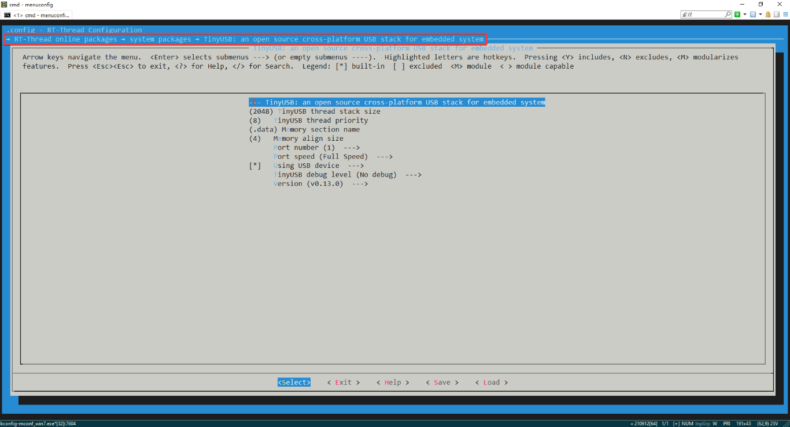
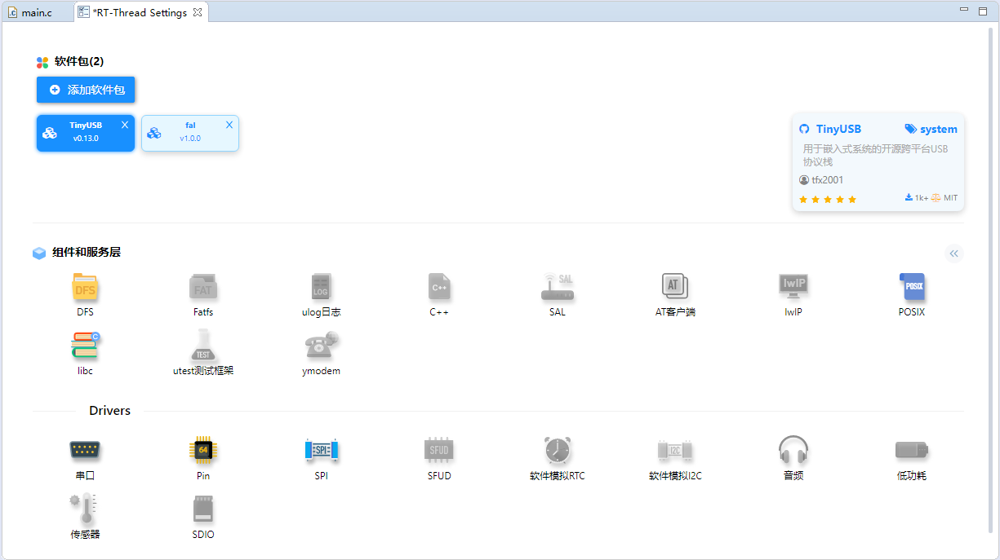

# TinyUSB 介绍

[TinyUSB](https://docs.tinyusb.org/en/latest/) 是一个开源的用于嵌入式系统的跨平台 USB Host/Device 协议栈，为了内存安全而设计，没有动态分配，同时也是线程安全的，所有中断事件都被推迟，然后在非 ISR 任务函数中处理，支持多种 MCU。目前 TinyUSB 的源代码托管在 [GitHub](https://github.com/hathach/tinyusb) 上。

在社区成员的努力下，通过对 TinyUSB 上游仓库进行 [移植](https://github.com/RT-Thread-packages/tinyusb)，目前已成为 RT-Thread 软件包。

# 支持情况

目前软件包仅支持 USB Device 协议栈。

[支持的 MCU 与设备类](https://github.com/RT-Thread-packages/tinyusb/blob/master/rt-thread/README_ZH.md#21mcu)

# 开始使用

1. ENV

   软件包在 ENV 包管理器中的路径为：

   

   > [!NOTE] 
   > 在 Keil MDK 中使用时，请选择 **ARM Clang** 编译器，或手动在编译选项中选中 **GNU Extensions**。

2. RT-Thread Studio

   在 RT-Thread Studio 中，搜索 `TinyUSB` 即可将软件包添加至工程。

   

# 配置项说明

| 配置项名称                | 说明                                                         |
| ------------------------- | ------------------------------------------------------------ |
| TinyUSB thread stack size | TinyUSB 线程栈大小                                           |
| TinyUSB thread priority   | TinyUSB 线程优先级                                           |
| Memory section name       | 指定 USB 内存对应的 section。在部分 MCU 上，DMA 只能访问特定的 SRAM 区域，可使用此配置项指定链接的区域。 |
| Memory align size         | USB 内存对齐大小                                             |
| Port number               | USB 接口数量                                                 |
| Port speed                | USB 速度，可选择 **全速 (12 Mpbs)** 或 **高速 (480 Mbps)**   |
| Using USB device          | 使能 USB 设备栈                                              |
| TinyUSB debug level       | 调试日志输出等级                                             |

# 问题反馈

Issue: [RT-Thread-packages/tinyusb](https://github.com/RT-Thread-packages/tinyusb/issues)
