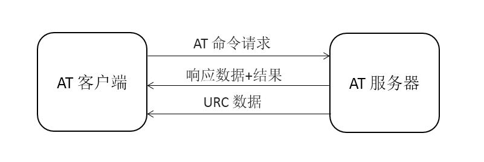
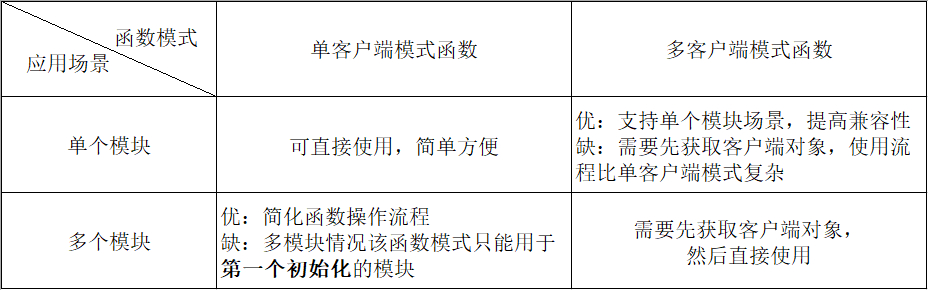

# AT 组件 #

## AT 命令简介

AT 命令（AT Commands）最早是由发明拨号调制解调器（MODEM）的贺氏公司（Hayes）为了控制 MODEM 而发明的控制协议。后来随着网络带宽的升级，速度很低的拨号 MODEM 基本退出一般使用市场，但是 AT 命令保留下来。当时主要的移动电话生产厂家共同为 GSM 研制了一整套 AT 命令，用于控制手机的 GSM 模块。AT 命令在此基础上演化并加入 GSM 07.05 标准以及后来的 GSM 07.07 标准，实现比较健全的标准化。

在随后的 GPRS 控制、3G 模块等方面，均采用的 AT 命令来控制，AT 命令逐渐在产品开发中成为实际的标准。如今，AT 命令也广泛的应用于嵌入式开发领域，AT 命令作为主芯片和通讯模块的协议接口，硬件接口一般为串口，这样主控设备可以通过简单的命令和硬件设计完成多种操作。

**AT 命令集是一种应用于 AT 服务器（AT Server）与 AT 客户端（AT Client）间的设备连接与数据通信的方式**。 其基本结构如下图所示：



1. 一般 AT 命令由三个部分组成，分别是：前缀、主体和结束符。其中前缀由字符 AT 构成；主体由命令、参数和可能用到的数据组成；结束符一般为 `<CR><LF>` (`"\r\n"`)。

2. AT 功能的实现需要 AT Server 和 AT Client 两个部分共同完成。

3. AT Server 主要用于接收 AT Client 发送的命令，判断接收的命令及参数格式，并下发对应的响应数据，或者主动下发数据。

4. AT Client 主要用于发送命令、等待 AT Server 响应，并对 AT Server 响应数据或主动发送的数据进行解析处理，获取相关信息。

5. AT Server 和 AT Client 之间支持多种数据通讯的方式（UART、SPI 等），目前最常用的是串口 UART 通讯方式。

6. AT Server 向 AT Client 发送的数据分成两种：响应数据和 URC 数据。

- 响应数据： AT Client 发送命令之后收到的 AT Server 响应状态和信息。

- URC 数据： AT Server 主动发送给 AT Client 的数据，一般出现在一些特殊的情况，比如 WIFI 连接断开、TCP 接收数据等，这些情况往往需要用户做出相应操作。

随着 AT 命令的逐渐普及，越来越多的嵌入式产品上使用了 AT 命令，AT 命令作为主芯片和通讯模块的协议接口，硬件接口一般为串口，这样主控设备可以通过简单的命令和硬件设计完成多种操作。

虽然 AT 命令已经形成了一定的标准化，但是不同的芯片支持的 AT 命令并没有完全统一，这直接提高了用户使用的复杂性。对于 AT 命令的发送和接收以及数据的解析没有统一的处理方式。并且在使用 AT 设备连接网络时，只能通过命令完成简单的设备连接和数据收发功能，很难做到对上层网络应用接口的适配，不利于产品设备的开发。

为了方便用户使用 AT 命令，简单的适配不同的 AT 模块， RT-Thread 提供了 AT 组件用于 AT 设备的连接和数据通讯。AT 组件的实现包括客户端的和服务器两部分。

## AT 组件简介

AT 组件是基于 RT-Thread 系统的 `AT Server` 和 `AT Client` 的实现，组件完成 AT 命令的发送、命令格式及参数判断、命令的响应、响应数据的接收、响应数据的解析、URC 数据处理等整个 AT 命令数据交互流程。

通过 AT 组件，设备可以作为 AT Client 使用串口连接其他设备发送并接收解析数据，可以作为 AT Server 让其他设备甚至电脑端连接完成发送数据的响应，也可以在本地 shell 启动 CLI 模式使设备同时支持 AT Server 和 AT Client 功能，该模式多用于设备开发调试。

**AT 组件资源占用：**

-  AT Client 功能：4.6K ROM 和 2.0K RAM；

- AT Server 功能：4.0K ROM 和 2.5K RAM；

- AT CLI 功能： 1.5K ROM ，几乎没有使用 RAM。

整体看来，AT 组件资源占用极小，因此非常适用应用于资源有限的嵌入式设备中。AT 组件代码主要位于 `rt-thread/components/net/at/` 目录中。主要的功能包括如下，

**AT Server 主要功能特点：**

- 基础命令： 实现多种通用基础命令（ATE、ATZ 等）；
- 命令兼容： 命令支持忽略大小写，提高命令兼容性；
- 命令检测： 命令支持自定义参数表达式，并实现对接收的命令参数自检测功能；
- 命令注册： 提供简单的用户自定义命令添加方式，类似于 `finsh/msh` 命令添加方式；
- 调试模式： 提供 AT Server CLI 命令行交互模式，主要用于设备调试。

**AT Client 主要功能特点：**

- URC 数据处理： 完备的 URC 数据的处理方式；
- 数据解析： 支持自定义响应数据的解析方式，方便获取响应数据中相关信息；
- 调试模式： 提供 AT Client CLI 命令行交互模式，主要用于设备调试。
- AT Socket：作为 AT Client 功能的延伸，使用 AT 命令收发作为基础，实现标准的 BSD Socket API，完成数据的收发功能，使用户通过 AT 命令完成设备连网和数据通讯。
- 多客户端支持： AT 组件目前支持多客户端同时运行。

## AT Server ##

### AT Server 配置 ###

当我们使用 AT 组件中的 AT Server 功能时需要在 rtconfig.h 中定义如下配置：

| **宏定义** | **描述** |
| ----  | ---- |
|RT_USING_AT| 开启 AT 组件 |
|AT_USING_SERVER  |开启 AT Server 功能|
|AT_SERVER_DEVICE |定义设备上 AT Server 功能使用的串口通讯设备名称，确保未被使用且设备名称唯一，例如 `uart3` 设备|
|AT_SERVER_RECV_BUFF_LEN|AT Server 设备最大接收数据的长度|
|AT_CMD_END_MARK_CRLF|判断接收命令的行结束符 |
|AT_USING_CLI | 开启服务器命令行交互模式|
|AT_DEBUG|开启 AT 组件 DEBUG 模式，可以显示更多调试日志信息 |
|AT_PRINT_RAW_CMD | 开启实时显示 AT 命令通信数据模式，方便调试|

对于不同的 AT 设备，发送命令的行结束符的格式有几种： `"\r\n"`、`"\r"`、`"\n"`，用户需要根据 AT Server 连接的设备类型选用对应的行结束符，进而判断发送命令行的结束， 定义的方式如下：

| **宏定义** | **结束符** |
| ----  | ---- |
| AT_CMD_END_MARK_CRLF | `"\r\n"` |
| AT_CMD_END_MARK_CR   | `"\r"`    |
| AT_CMD_END_MARK_LF   | `"\n"`    |

上面配置选项可以直接在 `rtconfig.h` 文件中添加使用，也可以通过组件包管理工具 Env 配置选项加入，ENV 中具体路径如下：

```c
RT-Thread Components  --->
    Network  --->
        AT commands  --->
            [*] Enable AT commands
            [*]   Enable debug log output
            [*] Enable AT commands server
            (uart3) Server device name
            (256)   The maximum length of server data accepted
                    The commands new line sign (\r\n)  --->
            [ ]   Enable AT commands client
            [*]   Enable command-line interface for AT commands
            [ ]   Enable print RAW format AT command communication data
```

添加配置完成之后可以使用命令行重新生成工程，或使用 scons 来进行编译生成。

### AT Server 初始化 ###

配置开启 AT Server 配置之后，需要在启动时对它进行初始化，开启 AT Server 功能，如果程序中已经使用了组件自动初始化，则不再需要额外进行单独的初始化，否则需要在初始化任务中调用如下函数：

```c
int at_server_init(void);
```
AT Server 初始化函数，属于应用层函数，需要在使用 AT Server 功能或者使用 AT Server CLI 功能前调用。`at_server_init()` 函数完成对 AT 命令存放数据段初始化、AT Server 设备初始化以及 AT Server 使用的信号量等资源的初始化，并创建 `at_server` 线程用于 AT Server 中数据的接收的解析。

AT Server 初始化成功之后，设备就可以作为 AT 服务器与 AT 客户端的串口设备连接并进行数据通讯，或者使用串口转化工具连接 PC，使 PC 端串口调试助手作为 AT 客户端与其进行数据通讯。

### 自定义 AT 命令添加方式 ###

目前，不同厂家的 AT 设备使用的 AT 命令集的格式没有完全的统一的标准，所以 AT 组件中的 AT Server 只支持了部分基础通用 AT 命令，例如：ATE、AT+RST 等，这些命令只能满足设备基本操作，用户想使用更多功能需要针对不同 AT 设备完成自定义 AT Server 命令，AT 组件提供类似于 `finsh/msh` 命令添加方式的 AT 命令添加方式，方便用户实现需要的命令。

AT Server 目前默认支持的基础命令如下：

- AT：AT 测试命令；
- ATZ：设备恢复出厂设置；
- AT+RST：设备重启；
- ATE：ATE1 开启回显，ATE0 关闭回显；
- AT&L：列出全部命令列表；
- AT+UART：设置串口设置信息。

AT 命令根据传入的参数格式不同可以实现不同的功能，对于每个 AT 命令最多包含四种功能，如下所述：

- 测试功能：`AT+<x>=?` 用于查询命令参数格式及取值范围；
- 查询功能：`AT+<x>?` 用于返回命令参数当前值；
- 设置功能：`AT+<x>=...` 用于用户自定义参数值；
- 执行功能：`AT+<x>` 用于执行相关操作。

每个命令的四种功能并不需要全部实现，用户自定义添加 AT Server 命令时，可根据自己需求实现一种或几种上述功能函数，未实现的功能可以使用 `NULL` 表示，再通过自定义命令添加函数添加到基础命令列表，添加方式类似于 `finsh/msh` 命令添加方式，添加函数如下：

```c
AT_CMD_EXPORT(_name_, _args_expr_, _test_, _query_, _setup_, _exec_);
```

|**参数**  |**描述**                        |
| ---------- | ------------------------------- |
| `_name_ `        | AT 命令名称                       |
| `_args_expr_`    | AT 命令参数表达式；（无参数为 NULL，`<>` 中为必选参数，`[]` 中为可选参数） |
| `_test_`     | AT 测试功能函数名；（无实现为 NULL）                |
| `_query_` | AT 查询功能函数名；（同上） |
| `_setup_` | AT 设置功能函数名；（同上）               |
| `_exec_` | AT 执行功能函数名；（同上）                |

如下为 AT 命令注册示例，`AT+TEST` 命令存在两个参数，第一个参数为必选参数，第二个参数为可选参数，命令实现查询功能和执行功能：

```c
static at_result_t at_test_exec(void)
{
    at_server_printfln("AT test commands execute!");

    return 0;
}
static at_result_t at_test_query(void)
{
    at_server_printfln("AT+TEST=1,2");

    return 0;
}

AT_CMD_EXPORT("AT+TEST", =<value1>[,<value2>], NULL, at_test_query, NULL, at_test_exec);
```

### AT Server API 接口

#### 发送数据至客户端（不换行）

```c
void at_server_printf(const char *format, ...);
```

该函数用于 AT Server 通过串口设备发送固定格式的数据到对应的 AT Client 串口设备上，数据结尾不带换行符。用于自定义 AT Server 中 AT 命令的功能函数中。

|  **参数**  | **描述**                     |
|------|-------------------------|
| format | 自定义输入数据的表达式   |
|   ...  | 输入数据列表，为可变参数 |

#### 发送数据至客户端（换行）

```c
void at_server_printfln(const char *format, ...);
```

 该函数用于 AT Server 通过串口设备发送固定格式的数据到对应的 AT Client 串口设备上，数据结尾带换行符。用于自定义 AT Server 中 AT 命令的功能函数中。

|  **参数**  | **描述**                     |
|------|-------------------------|
| format | 自定义输入数据的表达式   |
|   ...  | 输入数据列表，为可变参数 |

#### 发送命令执行结果至客户端

```c
void at_server_print_result(at_result_t result);
```

该函数用于 AT Server 通过串口设备发送命令执行结果到对应的 AT Client 串口设备上。AT 组件提供多种固定的命令执行结果类型，自定义命令时可以直接使用函数返回结果；

|  **参数**  | **描述**             |
|------|-----------------|
| result | 命令执行结果类型 |

AT 组件中命令执行结果类型以枚举类型给出，如下表所示：

|     命令执行结果类型     |        解释        |
|------------------------|------------------|
|      AT_RESULT_OK      |    命令执行成功    |
|     AT_RESULT_FAILE    |    命令执行失败    |
|     AT_RESULT_NULL     |     命令无返回结果 |
|   AT_RESULT_CMD_ERR   |    输入命令错误    |
| AT_RESULT_CHECK_FAILE | 参数表达式匹配错误 |
| AT_RESULT_PARSE_FAILE |    参数解析错误    |

可参考以下代码了解如何使用 at_server_print_result 函数：

```c
static at_result_t at_test_setup(const char *args)
{
    if(!args)
    {
        /* 如果传入的命令之后的参数错误，返回表达式匹配错误结果 */
        at_server_print_result(AT_RESULT_CHECK_FAILE);
    }

    /* 正常情况下返回执行成功结果 */
    at_server_print_result(AT_RESULT_OK);
    return 0;
}
static at_result_t at_test_exec(void)
{
    // execute some functions of the AT command.

    /* 该命令不需要返回结果 */
    at_server_print_result(AT_RESULT_NULL);
    return 0;
}
AT_CMD_EXPORT("AT+TEST", =<value1>,<value2>, NULL, NULL, at_test_setup, at_test_exec);
```

#### 解析输入命令参数

```c
int at_req_parse_args(const char *req_args, const char *req_expr, ...);
```

一个 AT 命令的四种功能函数中，只有设置函数有入参，该入参为去除 AT 命令剩余部分，例如一个命令输入为 `"AT+TEST=1,2,3,4"`，则设置函数的入参为参数字符串 `"=1,2,3,4"` 部分。

该命令解析函数主要用于 AT 命令的设置函数中，用于解析传入字符串参数，得到对应的多个输入参数，用于执行后面操作，这里的解析语法使用的标准 `sscanf` 解析语法，后面 AT Client 参数解析函数中会详细介绍。

|    **参数**   | **描述**                                           |
|---------|-----------------------------------------------|
| req_args | 请求命令的传入参数字符串                       |
| req_expr | 自定义参数解析表达式，用于解析上述传入参数数据 |
|    ...    | 输出的解析参数列表，为可变参数                 |
|    **返回**   | --                                           |
|    >0    | 成功，返回匹配参数表达式的可变参数个数         |
|     =0    | 失败，无匹配参数表达式的参数                   |
|     -1    | 失败，参数解析错误                             |

可参考以下代码了解如何使用 at_req_parse_args 函数：

```c
static at_result_t at_test_setup(const char *args)
{
    int value1,value2;

    /* args 的输入标准格式应为 "=1,2"，"=%d,%d" 为自定义参数解析表达式，解析得到结果存入 value1 和 value2 变量 */
    if (at_req_parse_args(args, "=%d,%d", &value1, &value2) > 0)
    {
        /* 数据解析成功，回显数据到 AT Server 串口设备 */
        at_server_printfln("value1 : %d, value2 : %d", value1, value2);

        /* 数据解析成功，解析参数的个数大于零，返回执行成功 */
        at_server_print_result(AT_RESULT_OK);
    }
    else
    {
        /* 数据解析失败，解析参数的个数不大于零，返回解析失败结果类型 */
        at_server_print_result(AT_RESULT_PARSE_FAILE);
    }
    return 0;
}
/* 添加 "AT+TEST" 命令到 AT 命令列表，命令参数格式为两个必选参数 <value1> 和 <value2>  */
AT_CMD_EXPORT("AT+TEST", =<value1>,<value2>, NULL, NULL, at_test_setup, NULL);
```

**移植相关接口**

AT Server 默认已支持多种基础命令（ATE、ATZ 等），其中部分命令的函数实现与硬件或平台相关，需要用户自定义实现。AT 组件源码 `src/at_server.c` 文件中给出了移植文件的弱函数定义，用户可在项目中新建移植文件实现如下函数完成移植接口，也可以直接在文件中修改弱函数完成移植接口。

1. 设备重启函数:`void at_port_reset(void);`。该函数完成设备软重启功能，用于 AT Server 中基础命令 AT+RST 的实现。

2. 设备恢复出厂设置函数：`void at_port_factory_reset(void);`。该函数完成设备恢复出厂设置功能，用于 AT Server 中基础命令 ATZ 的实现。

3. 链接脚本中添加命令表（gcc 添加，keil、iar 跳过）

工程中若使用 gcc 工具链，需在链接脚本中添加 AT 服务器命令表对应的 section ，参考如下链接脚本：

```c
/* Constant data goes into FLASH */
.rodata :
{
    ...

    /* section information for RT-thread AT package */
    . = ALIGN(4);
    __rtatcmdtab_start = .;
    KEEP(*(RtAtCmdTab))
    __rtatcmdtab_end = .;
    . = ALIGN(4);
} > CODE
```

## AT Client

### AT Client 配置

当我们使用 AT 组件中的 AT Client 功能是需要在 rtconfig.h 中定义如下配置：

```c
#define RT_USING_AT
#define AT_USING_CLIENT
#define AT_CLIENT_NUM_MAX 1
#define AT_USING_SOCKET
#define AT_USING_CLI
#define AT_PRINT_RAW_CMD
```

- `RT_USING_AT`： 用于开启或关闭 AT 组件；

- `AT_USING_CLIENT`： 用于开启 AT Client 功能；

- `AT_CLIENT_NUM_MAX`： 最大同时支持的 AT 客户端数量。

- `AT_USING_SOCKET`：用于 AT 客户端支持标准 BSD Socket API，开启 AT Socket 功能。

- `AT_USING_CLI`： 用于开启或关闭客户端命令行交互模式。

- `AT_PRINT_RAW_CMD`：用于开启 AT 命令通信数据的实时显示模式，方便调试

上面配置选项可以直接在 `rtconfig.h` 文件中添加使用，也可以通过组件包管理工具 Env 配置选项加入，ENV 中具体路径如下：

```c
RT-Thread Components  --->
    Network  --->
        AT commands  --->
            [*] Enable AT commands
            [ ]   Enable debug log output
            [ ]   Enable AT commands server
            [*]   Enable AT commands client
            (1)   The maximum number of supported clients
            [*]   Enable BSD Socket API support by AT commnads
            [*]   Enable command-line interface for AT commands
            [ ]   Enable print RAW format AT command communication data
```

添加配置完成之后可以使用命令行重新生成工程，或使用 scons 来进行编译生成。

### AT Client 初始化 ###

配置开启 AT Client 配置之后，需要在启动时对它进行初始化，开启 AT client 功能，如果程序中已经使用了组件自动初始化，则不再需要额外进行单独的初始化，否则需要在初始化任务中调用如下函数：

```c
int at_client_init(const char *dev_name,  rt_size_t recv_bufsz);
```

AT Client 初始化函数，属于应用层函数，需要在使用 AT Client 功能或者使用 AT Client CLI 功能前调用。`at_client_init()` 函数完成对 AT Client 设备初始化、AT Client 移植函数的初始化、AT Client 使用的信号量、互斥锁等资源初始化，并创建 `at_client` 线程用于 AT Client 中数据的接收的解析以及对 URC 数据的处理。

### AT Client 数据收发方式 ###

AT Client 主要功能是发送 AT 命令、接收数据并解析数据。下面是对 AT Client 数据接收和发送相关流程与函数介绍。相关结构体定义：

```c
struct at_response
{
    /* response buffer */
    char *buf;
    /* the maximum response buffer size */
    rt_size_t buf_size;
    /* the number of setting response lines
     * == 0: the response data will auto return when received 'OK' or 'ERROR'
     * != 0: the response data will return when received setting lines number data */
    rt_size_t line_num;
    /* the count of received response lines */
    rt_size_t line_counts;
    /* the maximum response time */
    rt_int32_t timeout;
};
typedef struct at_response *at_response_t;
```

AT 组件中，该结构体用于定义一个 AT 命令响应数据的控制块，用于存放或者限制 AT 命令响应数据的数据格式。其中 `buf` 用于存放接收到的响应数据，注意的是 buf 中存放的数据并不是原始响应数据，而是原始响应数据去除结束符（`"\r\n"`）的数据，**buf 中每行数据以 '\0' 分割，方便按行获取数据**。`buf_size` 为用户自定义本次响应最大支持的接收数据的长度，由用户根据自己命令返回值长度定义。`line_num` 为用户自定义的本次响应数据需要接收的行数，**如果没有响应行数限定需求，可以置为 0**。 `line_counts` 用于记录本次响应数据总行数。`timeout` 为用户自定义的本次响应数据最大响应时间。该结构体中 `buf_size`、`line_num`、`timeout` 三个参数为限制条件，在结构体创建时设置，其他参数为存放数据参数，用于后面数据解析。

相关 API 接口介绍：

#### 创建响应结构体

```c
at_response_t at_create_resp(rt_size_t buf_size, rt_size_t line_num, rt_int32_t timeout);
```

|    **参数**   | **描述**                                       |
|---------|-----------------------------------------|
| buf_size | 本次响应最大支持的接收数据的长度             |
| line_num | 本次响应需要返回数据的行数，行数是以标准结束符（如 `"\r\n"`）划分。若为 0 ，则接收到 "OK" 或 "ERROR" 数据后结束本次响应接收；若大于 0，接收完当前设置行号的数据后返回成功 |
|  timeout  | 本次响应数据最大响应时间，数据接收超时返回错误       |
|    **返回**   | --                              |
|  != NULL  | 成功，返回指向响应结构体的指针             |
|   = NULL  | 失败，内存不足                     |

该函数用于创建自定义的响应数据接收结构，用于后面接收并解析发送命令响应数据。

#### 删除响应结构体

```c
void at_delete_resp(at_response_t resp);
```

| **参数** | **描述**                     |
|----|-------------------------|
| resp | 准备删除的响应结构体指针 |

该函数用于删除创建的响应结构体对象，一般与**at_create_resp**创建函数成对出现。

#### 设置响应结构体参数

```c
at_response_t at_resp_set_info(at_response_t resp, rt_size_t buf_size, rt_size_t line_num, rt_int32_t timeout);
```

|    **参数**   | **描述**                            |
|---------|----------------------------------|
|    resp   | 已经创建的响应结构体指针            |
| buf_size | 本次响应最大支持的接收数据的长度                 |
| line_num | 本次响应需要返回数据的行数，行数是以标准结束符划分 若为 0 ，则接收到 "OK" 或 "ERROR" 数据后结束本次响应接收 若大于 0，接收完当前设置行号的数据后返回成功 |
|  timeout  | 本次响应数据最大响应时间，数据接收超时返回错误        |
|    **返回**   | --                          |
|  != NULL  | 成功，返回指向响应结构体的指针               |
|   = NULL  | 失败，内存不足               |

该函数用于设置已经创建的响应结构体信息，主要设置对响应数据的限制信息，一般用于创建结构体之后，发送 AT 命令之前。该函数主要用于设备初始化时命令的发送，可以减少响应结构体创建次数，降低代码资源占用。

#### 发送命令并接收响应

```c
rt_err_t at_exec_cmd(at_response_t resp, const char *cmd_expr, ...);
```

|    **参数**   | **描述**                         |
|---------|-----------------------------|
|    resp   | 创建的响应结构体指针         |
| cmd_expr | 自定义输入命令的表达式       |
|    ...    | 输入命令数据列表，为可变参数 |
|    **返回**   | --                         |
|    >=0   | 成功                         |
|     -1    | 失败                         |
|     -2    | 失败，接收响应超时           |

该函数用于 AT Client 发送命令到 AT Server，并等待接收响应，其中 `resp` 是已经创建好的响应结构体的指针，AT 命令的使用匹配表达式的可变参输入，**输入命令的结尾不需要添加命令结束符**。

可参考以下代码了解如何使用以上几个 AT 命令收发相关函数使用方式：

```c
/*
 * 程序清单：AT Client 发送命令并接收响应例程
 */

#include <rtthread.h>
#include <at.h>   /* AT 组件头文件 */

int at_client_send(int argc, char**argv)
{
    at_response_t resp = RT_NULL;

    if (argc != 2)
    {
        LOG_E("at_cli_send [command]  - AT client send commands to AT server.");
        return -RT_ERROR;
    }

    /* 创建响应结构体，设置最大支持响应数据长度为 512 字节，响应数据行数无限制，超时时间为 5 秒 */
    resp = at_create_resp(512, 0, rt_tick_from_millisecond(5000));
    if (!resp)
    {
        LOG_E("No memory for response structure!");
        return -RT_ENOMEM;
    }

    /* 发送 AT 命令并接收 AT Server 响应数据，数据及信息存放在 resp 结构体中 */
    if (at_exec_cmd(resp, argv[1]) != RT_EOK)
    {
        LOG_E("AT client send commands failed, response error or timeout !");
        return -ET_ERROR;
    }

    /* 命令发送成功 */
    LOG_D("AT Client send commands to AT Server success!");

    /* 删除响应结构体 */
    at_delete_resp(resp);

    return RT_EOK;
}
#ifdef FINSH_USING_MSH
#include <finsh.h>
/* 输出 at_Client_send 函数到 msh 中 */
MSH_CMD_EXPORT(at_Client_send, AT Client send commands to AT Server and get response data);
#endif
```

发送和接收数据的实现原理比较简单，主要是对 AT Client 绑定的串口设备的读写操作，并设置相关行数和超时来限制响应数据，值得注意的是，正常情况下需要先创建 resp 响应结构体传入 at_exec_cmd 函数用于数据的接收，当 at_exec_cmd 函数传入 resp 为 NULL 时说明本次发送数据**不考虑处理响应数据直接返回结果**。

### AT Client 数据解析方式 ###

数据正常获取之后，需要对响应的数据进行解析处理，这也是 AT Client 重要的功能之一。 AT Client 中数据的解析提供自定义解析表达式的解析形式，其解析语法使用标准的 `sscanf` 解析语法。开发者可以通过自定义数据解析表达式回去响应数据中有用信息，前提是开发者需要提前查看相关手册了解 AT Client 连接的 AT Server 设备响应数据的基本格式。下面通过几个函数和例程简单 AT Client 数据解析方式。

#### 获取指定行号的响应数据

```c
const char *at_resp_get_line(at_response_t resp, rt_size_t resp_line);
```

|    **参数**    | **描述**                         |
|----------|-----------------------------|
|    resp    |响应结构体指针               |
| resp_line | 需要获取数据的行号           |
|    **返回**    | --                         |
|   != NULL  | 成功，返回对应行号数据的指针 |
|   = NULL   | 失败，输入行号错误           |

该函数用于在 AT Server 响应数据中获取指定行号的一行数据。行号是以标准数据结束符来判断的，上述发送和接收函数 at_exec_cmd 已经对响应数据的数据和行号进行记录处理存放于 resp 响应结构体中，这里可以直接获取对应行号的数据信息。

#### 获取指定关键字的响应数据

```c
const char *at_resp_get_line_by_kw(at_response_t resp, const char *keyword);
```

|   **参数**  | **描述**                         |
|-------|-----------------------------|
|   resp  |响应结构体指针               |
| keyword | 关键字信息                   |
|   **返回**  | --                         |
| != NULL | 成功，返回对应行号数据的指针 |
|  = NULL | 失败，未找到关键字信息       |

该函数用于在 AT Server 响应数据中通过关键字获取对应的一行数据。

#### 解析指定行号的响应数据

```c
int at_resp_parse_line_args(at_response_t resp, rt_size_t resp_line, const char *resp_expr, ...);
```

|    **参数**    | **描述**                             |
|----------|---------------------------------|
|    resp    |响应结构体指针                   |
| resp_line | 需要解析数据的行号，**行号从 1 开始计数** |
| resp_expr | 自定义的参数解析表达式           |
|     ...    | 解析参数列表，为可变参数         |
|    **返回**    | --                             |
|     >0    | 成功，返回解析成功的参数个数     |
|     =0     | 失败，无匹参配数解析表达式的参数 |
|     -1     | 失败，参数解析错误               |

该函数用于在 AT Server 响应数据中获取指定行号的一行数据, 并解析该行数据中的参数。

#### 解析指定关键字行的响应数据

```c
int at_resp_parse_line_args_by_kw(at_response_t resp, const char *keyword, const char *resp_expr, ...);
```

|    **参数**    | **描述**                             |
|----------|---------------------------------|
|    resp    |响应结构体指针                   |
|   keyword  | 关键字信息                       |
| resp_expr | 自定义的参数解析表达式           |
|     ...    | 解析参数列表，为可变参数         |
|    **返回**    | --                             |
|     >0    | 成功，返回解析成功的参数个数     |
|     =0     | 失败，无匹参配数解析表达式的参数 |
|     -1     | 失败，参数解析错误               |

该函数用于在 AT Server 响应数据中获取包含关键字的一行数据, 并解析该行数据中的参数。

数据解析语法使用标准 `sscanf` 解析语法，语法的内容比较多，开发者可以自行搜索其解析语法，这里使用两个例程介绍简单使用方法。

#### 串口配置信息解析示例

客户端发送的数据：

```c
AT+UART?
```

客户端获取的响应数据：

```c
UART=115200,8,1,0,0\r\n
OK\r\n
```

解析伪代码如下：

```c
/* 创建服务器响应结构体，64 为用户自定义接收数据最大长度 */
resp = at_create_resp(64, 0, rt_tick_from_millisecond(5000));

/* 发送数据到服务器，并接收响应数据存放在 resp 结构体中 */
at_exec_cmd(resp, "AT+UART?");

/* 解析获取串口配置信息，1 表示解析响应数据第一行，'%*[^=]'表示忽略等号之前的数据 */
at_resp_parse_line_args(resp, 1,"%*[^=]=%d,%d,%d,%d,%d", &baudrate, &databits, &stopbits, &parity, &control);
printf("baudrate=%d, databits=%d, stopbits=%d, parity=%d, control=%d\n",
        baudrate, databits, stopbits, parity, control);

/* 删除服务器响应结构体 */
at_delete_resp(resp);
```

#### IP 和 MAC 地址解析示例 ####

客户端发送的数据：

```c
AT+IPMAC?
```

服务器获取的响应数据：

```c
IP=192.168.1.10\r\n
MAC=12:34:56:78:9a:bc\r\n
OK\r\n
```

解析伪代码如下：

```c
/* 创建服务器响应结构体，128 为用户自定义接收数据最大长度 */
resp = at_create_resp(128, 0, rt_tick_from_millisecond(5000));

at_exec_cmd(resp, "AT+IPMAC?");

/* 自定义解析表达式，解析当前行号数据中的信息 */
at_resp_parse_line_args(resp, 1,"IP=%s", ip);
at_resp_parse_line_args(resp, 2,"MAC=%s", mac);
printf("IP=%s, MAC=%s\n", ip, mac);

at_delete_resp(resp);
```

解析数据的关键在于解析表达式的正确定义，因为对于 AT 设备的响应数据，不同设备厂家不同命令的响应数据格式不唯一，所以只能提供自定义解析表达式的形式获取需要信息，at_resp_parse_line_args 解析参数函数的设计基于 `sscanf` 数据解析方式，开发者使用之前需要先了解基本的解析语法，再结合响应数据设计合适的解析语法。如果开发者不需要解析具体参数，可以直接使用 at_resp_get_line 函数获取一行的具体数据。

### AT Client URC 数据处理 ###

URC 数据的处理是 AT Client 另一个重要功能，URC 数据为服务器主动下发的数据，不能通过上述数据发送接收函数接收，并且对于不同设备 URC 数据格式和功能不一样，所以 URC 数据处理的方式也是需要用户自定义实现的。AT 组件中对 URC 数据的处理提供列表管理方式，用户可自定义添加 URC 数据和其执行函数到管理列表中，所以 URC 数据的处理也是 AT Client 的主要移植工作。

相关结构体：

```c
struct at_urc
{
    const char *cmd_prefix;             // URC 数据前缀
    const char *cmd_suffix;             // URC 数据后缀
    void (*func)(const char *data, rt_size_t size);     // URC 数据执行函数
};
typedef struct at_urc *at_urc_t;
```

每种 URC 数据都有一个结构体控制块，用于定义判断 URC 数据的前缀和后缀，以及 URC 数据的执行函数。一段数据只有完全匹配 URC 的前缀和后缀才能定义为 URC 数据，获取到匹配的 URC 数据后会立刻执行 URC 数据执行函数。所以开发者添加一个 URC 数据需要自定义匹配的前缀、后缀和执行函数。


#### URC 数据列表初始化

```c
void at_set_urc_table(const struct at_urc *table, rt_size_t size);
```

|  **参数** | **描述**                   |
|-----|-----------------------|
| table | URC 数据结构体数组指针 |
|  size | URC 数据的个数         |

该函数用于初始化开发者自定义的 URC 数据列表，主要在 AT Client 移植函数中使用。

下面给出 AT Client 移植具体示例，该示例主要展示  `at_client_port_init()` 移植函数中 URC 数据的具体处理方式，开发者可直接应用到自己的移植文件中，或者自定义修改实现功能，完成 AT Client 的移植。

```c
static void urc_conn_func(const char *data, rt_size_t size)
{
    /* WIFI 连接成功信息 */
    LOG_D("AT Server device WIFI connect success!");
}

static void urc_recv_func(const char *data, rt_size_t size)
{
    /* 接收到服务器发送数据 */
    LOG_D("AT Client receive AT Server data!");
}

static void urc_func(const char *data, rt_size_t size)
{
    /* 设备启动信息 */
    LOG_D("AT Server device startup!");
}

static struct at_urc urc_table[] = {
    {"WIFI CONNECTED",   "\r\n",     urc_conn_func},
    {"+RECV",            ":",          urc_recv_func},
    {"RDY",              "\r\n",     urc_func},
};

int at_client_port_init(void)
{
    /* 添加多种 URC 数据至 URC 列表中，当接收到同时匹配 URC 前缀和后缀的数据，执行 URC 函数  */
    at_set_urc_table(urc_table, sizeof(urc_table) / sizeof(urc_table[0]));
    return RT_EOK;
}
```

### AT Client 其他 API 接口介绍

#### 发送指定长度数据

```c
rt_size_t at_client_send(const char *buf, rt_size_t size);
```

| **参数** | **描述**                         |
|----|-----------------------------|
|  buf | 发送数据的指针               |
| size | 发送数据的长度               |
| **返回** | --                         |
|  >0 | 成功，返回发送成功的数据长度 |
| <=0 | 失败                         |

该函数用于通过 AT Client 设备发送指定长度数据到 AT Server 设备，多用于 AT Socket 功能。

#### 接收指定长度数据

```c
rt_size_t at_client_recv(char *buf, rt_size_t size,rt_int32_t timeout);
```

| **参数** | **描述**                         |
|----|-----------------------------|
|  buf | 接收数据的指针               |
| size | 最大支持接收数据的长度       |
| timeout | 接收数据超时时间，单位为 tick |
| **返回** | --                         |
|  >0 | 成功，返回接收成功的数据长度 |
| <=0 | 失败，接收数据错误或超时       |

该函数用于通过 AT Client 设备接收指定长度的数据，多用于 AT Socket 功能。**该函数只能在 URC 回调处理函数中使用**。

#### 设置接收数据的行结束符 ####

```c
void at_set_end_sign(char ch);
```

| 参数     | 描述                      |
| -----   | -----                   |
|ch        | 行结束符                  |
| **返回** | **描述**                  |
|无        | 无                        |

该函数用于设置行结束符，用于判断客户端接收一行数据的结束, 多用于 AT Socket 功能。

#### 等待模块初始化完成 ####

```c
int at_client_wait_connect(rt_uint32_t timeout);
```

| 参数     | 描述                      |
| -----   | -----                   |
|timeout   | 等待超时时间              |
| **返回** | **描述**                 |
|0         | 成功                     |
|<0        | 失败，超时时间内无数据返回 |

该函数用于 AT 模块启动时循环发送 AT 命令，直到模块响应数据，说明模块启动成功。

### AT Client 多客户端支持 ###

一般情况下，设备作为 AT Client 只连接一个 AT 模块（AT 模块作为 AT Server）可直接使用上述数据收发和命令解析的函数。少数情况，设备作为 AT Client 需要连接多个 AT 模块，这种情况下需要设备的多客户端支持功能。

AT 组件提供对多客户端连接的支持，并且提供两套不同的函数接口：**单客户端模式函数** 和 **多客户端模式函数**。

- 单客户端模式函数：该类函数接口主要用于设备只连接一个 AT 模块情况，或者在设备连接多个 AT 模块时，用于**第一个初始化**的 AT 客户端中。

- 多客户端模式函数：该类函数接口主要用设备连接多个 AT 模块情况。

两种不同模式函数和在不同应用场景下的优缺点如下图：



单客户端模式函数定义与单连接模式函数相比，主要是对传入的客户端对象的定义不同，单客户端模式函数默认使用第一个初始化的 AT 客户端对象，多客户端模式函数可以传入用户自定义获取的客户端对象, 获取客户端对象的函数如下：

```c
at_client_t at_client_get(const char *dev_name);
```

该函数通过传入的设备名称获取该设备创建的 AT 客户端对象，用于多客户端连接时区分不同的客户端。

单客户端模式和多客户端模式函数接口定义区别如下几个函数：

| 单客户端模式函数              | 多客户端模式函数                          |
| ----------------------------| ---------------------------------------|
| at_exec_cmd(...)             | at_obj_exec_cmd(client, ...)            |
| at_set_end_sign(...)         | at_obj_set_end_sign(client, ...)        |
| at_set_urc_table(...)        | at_obj_set_urc_table(client, ...)       |
| at_client_wait_connect(...)  | at_client_obj_wait_connect(client, ...) |
| at_client_send(...)          | at_client_obj_send(client, ...)         |
| at_client_recv(...)          | at_client_obj_recv(client, ...)         |

两种模式客户端数据收发和解析的方式基本相同，在函数使用流程上有所不同，如下所示：

```c
/* 单客户端模式函数使用方式 */

at_response_t resp = RT_NULL;

at_client_init("uart2", 512);

resp = at_create_resp(256, 0, 5000);

/* 使用单客户端模式函数发送命令 */
at_exec_cmd(resp, "AT+CIFSR");

at_delete_resp(resp);
```

```c
/* 多客户端模式函数使用方式 */

at_response_t resp = RT_NULL;
at_client_t client = RT_NULL;

/* 初始化两个 AT 客户端 */
at_client_init("uart2", 512);
at_client_init("uart3", 512);

/* 通过名称获取对应的 AT 客户端对象 */
client = at_client_get("uart3");

resp = at_create_resp(256, 0, 5000);

/* 使用多客户端模式函数发送命令 */
at_obj_exec_cmd(client, resp, "AT+CIFSR");

at_delete_resp(resp);
```

其他函数使用的流程区别类似于上述 `at_obj_exec_cmd()` 函数，主要是先通过 `at_client_get()` 函数获取客户端对象，再通过传入的对象判断是哪个客户端，实现多客户端的支持。

## 常见问题

### Q: 开启 AT 命令收发数据实时打印功能，shell 上日志显示错误怎么办？

**A:** 提高 shell 对应串口设备波特率为 921600，提高串口打印速度，防止数据量过大时打印显示错误。

### Q: AT Socket 功能启动时，编译提示 “The AT socket device is not selected, please  select it through the env menuconfig”？

**A:** 该错误因为开启 AT Socket 功能之后，默认开启 at device 软件包中为配置对应的设备型号，进入 at device 软件包，配置设备为 ESP8266 设备，配置 WIFI 信息，重新 scons 生成工程，编译下载。

### Q: AT Socket 功能数据接收超时或者数据接收不全？

**A:** 该错误可能是 AT 使用的串口设备中接收数据缓冲区过小（RT_SERIAL_RB_BUFSZ 默认为 64 bytes），数据未及时接收完就被覆盖导致的，适当增加串口接收数据的缓冲区大小（如 256 bytes）。
