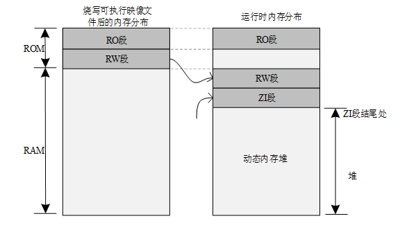

# 内核基础

本章介绍 RT-Thread 内核基础，包括：内核简介、系统的启动流程及内核配置的部分内容，为后面的章节奠定基础。

RT-Thread 内核的简单介绍，从软件架构入手讲解实时内核的组成与实现，这部分给初学者引入一些 RT-Thread 内核相关的概念与基础知识，让初学者对内核有初步的了解。学完本章，读者将会对 RT-Thread 内核有基本的了解，知道内核的组成部分、系统如何启动、内存分布情况以及内核配置方法。

RT-Thread 内核介绍
-----------------

内核是操作系统最基础也是最重要的部分。下图为 RT-Thread 内核架构图，内核处于硬件层之上，内核部分包括内核库、实时内核实现。


内核库是为了保证内核能够独立运行的一套小型的类似 C 库的函数实现子集。这部分根据编译器的不同自带 C 库的情况也会有些不同，当使用 GNU GCC 编译器时，会携带更多的标准 C 库实现。

> 提示：C 库：也叫 C 运行库（C Runtime Library），它提供了类似 “strcpy”、“memcpy” 等函数，有些也会包括 “printf”、“scanf” 函数的实现。RT-Thread Kernel Service Library 仅提供内核用到的一小部分 C 库函数实现，为了避免与标准 C 库重名，在这些函数前都会添加上 rt_前缀。

实时内核的实现包括：对象管理、线程管理及调度器、线程间通信管理、时钟管理及内存管理等等，内核最小的资源占用情况是 3KB ROM，1.2KB RAM。

### 线程调度

线程是 RT-Thread 操作系统中最小的调度单位，线程调度算法是基于优先级的全抢占式多线程调度算法，即在系统中除了中断处理函数、调度器上锁部分的代码和禁止中断的代码是不可抢占的之外，系统的其他部分都是可以抢占的，包括线程调度器自身。支持 256 个线程优先级（也可通过配置文件更改为最大支持 32 个或 8 个线程优先级，针对 STM32 默认配置是 32 个线程优先级），0 优先级代表最高优先级，最低优先级留给空闲线程使用；同时它也支持创建多个具有相同优先级的线程，相同优先级的线程间采用时间片的轮转调度算法进行调度，使每个线程运行相应时间；另外调度器在寻找那些处于就绪状态的具有最高优先级的线程时，所经历的时间是恒定的，系统也不限制线程数量的多少，线程数目只和硬件平台的具体内存相关。

线程管理将在[《线程管理》](../thread/thread.md)章节详细介绍。

### 时钟管理

RT-Thread 的时钟管理以时钟节拍为基础，时钟节拍是 RT-Thread 操作系统中最小的时钟单位。RT-Thread 的定时器提供两类定时器机制：第一类是单次触发定时器，这类定时器在启动后只会触发一次定时器事件，然后定时器自动停止。第二类是周期触发定时器，这类定时器会周期性的触发定时器事件，直到用户手动的停止定时器否则将永远持续执行下去。

另外，根据超时函数执行时所处的上下文环境，RT-Thread 的定时器可以设置为 HARD_TIMER 模式或者 SOFT_TIMER 模式。

通常使用定时器定时回调函数（即超时函数），完成定时服务。用户根据自己对定时处理的实时性要求选择合适类型的定时器。

定时器将在[《时钟管理》](../timer/timer.md)章节展开讲解。

### 线程间同步

RT-Thread 采用信号量、互斥量与事件集实现线程间同步。线程通过对信号量、互斥量的获取与释放进行同步；互斥量采用优先级继承的方式解决了实时系统常见的优先级翻转问题。线程同步机制支持线程按优先级等待或按先进先出方式获取信号量或互斥量。线程通过对事件的发送与接收进行同步；事件集支持多事件的 “或触发” 和“与触发”，适合于线程等待多个事件的情况。

信号量、互斥量与事件集的概念将在[《线程间同步》](../ipc1/ipc1.md)章节详细介绍。

### 线程间通信

RT-Thread 支持邮箱和消息队列等通信机制。邮箱中一封邮件的长度固定为 4 字节大小；消息队列能够接收不固定长度的消息，并把消息缓存在自己的内存空间中。邮箱效率较消息队列更为高效。邮箱和消息队列的发送动作可安全用于中断服务例程中。通信机制支持线程按优先级等待或按先进先出方式获取。

邮箱和消息队列的概念将在[《线程间通信》](../ipc2/ipc2.md)章节详细介绍。

### 内存管理

RT-Thread 支持静态内存池管理及动态内存堆管理。当静态内存池具有可用内存时，系统对内存块分配的时间将是恒定的；当静态内存池为空时，系统将申请内存块的线程挂起或阻塞掉 (即线程等待一段时间后仍未获得内存块就放弃申请并返回，或者立刻返回。等待的时间取决于申请内存块时设置的等待时间参数)，当其他线程释放内存块到内存池时，如果有挂起的待分配内存块的线程存在的话，则系统会将这个线程唤醒。

动态内存堆管理模块在系统资源不同的情况下，分别提供了面向小内存系统的内存管理算法及面向大内存系统的
SLAB 内存管理算法。

还有一种动态内存堆管理叫做 memheap，适用于系统含有多个地址且不连续的内存堆。使用 memheap 可以将多个内存堆 “粘贴” 在一起，让用户操作起来像是在操作一个内存堆。

内存管理的概念将在[《内存管理》](../memory/memory.md)章节展开讲解。

### I/O 设备管理

RT-Thread 将 PIN、I2C、SPI、USB、UART 等作为外设设备，统一通过设备注册完成。实现了按名称访问的设备管理子系统，可按照统一的 API 界面访问硬件设备。在设备驱动接口上，根据嵌入式系统的特点，对不同的设备可以挂接相应的事件。当设备事件触发时，由驱动程序通知给上层的应用程序。

I/O 设备管理的概念将在[《设备模型》](../device/device.md)及[《通用设备》](../device/adc/adc.md)章节展开讲解。

RT-Thread 启动流程
------------------

一般了解一份代码大多从启动部分开始，同样这里也采用这种方式，先寻找启动的源头。RT-Thread 支持多种平台和多种编译器，而 rtthread_startup() 函数是 RT-Thread 规定的统一启动入口。一般执行顺序是：系统先从启动文件开始运行，然后进入 RT-Thread 的启动函数 rtthread_startup() ，最后进入用户入口函数 main()，如下图所示：


以 MDK-ARM 为例，用户程序入口为 main() 函数，位于 main.c 文件中。系统启动后先从汇编代码 startup_stm32f103xe.s 开始运行，然后跳转到 C 代码，进行 RT-Thread 系统启动，最后进入用户程序入口函数 main()。

为了在进入 main() 之前完成 RT-Thread 系统功能初始化，我们使用了 MDK 的扩展功能 `$Sub$$` 和 `$Super$$`。可以给 main 添加 `$Sub$$` 的前缀符号作为一个新功能函数 `$Sub$$main`，这个 `$Sub$$main` 可以先调用一些要补充在 main 之前的功能函数（这里添加 RT-Thread 系统启动，进行系统一系列初始化），再调用 `$Super$$main` 转到 main() 函数执行，这样可以让用户不用去管 main() 之前的系统初始化操作。

关于 `$Sub$$` 和 `$Super$$` 扩展功能的使用，详见 [ARM® Compiler v5.06 for µVision®armlink User Guide](http://infocenter.arm.com/help/index.jsp?topic=/com.arm.doc.dui0377g/pge1362065967698.html)。

下面我们来看看在 components.c 中定义的这段代码：

```c
/* $Sub$$main 函数 */
int $Sub$$main(void)
{
  rtthread_startup();
  return 0;
}
```


在这里 `$Sub$$main` 函数调用了 rtthread_startup() 函数，其中 rtthread_startup() 函数的代码如下所示：

```c
int rtthread_startup(void)
{
    rt_hw_interrupt_disable();

    /* 板级初始化：需在该函数内部进行系统堆的初始化 */
    rt_hw_board_init();

    /* 打印 RT-Thread 版本信息 */
    rt_show_version();

    /* 定时器初始化 */
    rt_system_timer_init();

    /* 调度器初始化 */
    rt_system_scheduler_init();

#ifdef RT_USING_SIGNALS
    /* 信号初始化 */
    rt_system_signal_init();
#endif

    /* 由此创建一个用户 main 线程 */
    rt_application_init();

    /* 定时器线程初始化 */
    rt_system_timer_thread_init();

    /* 空闲线程初始化 */
    rt_thread_idle_init();

    /* 启动调度器 */
    rt_system_scheduler_start();

    /* 不会执行至此 */
    return 0;
}
```


这部分启动代码，大致可以分为四个部分：

（1）初始化与系统相关的硬件；

（2）初始化系统内核对象，例如定时器、调度器、信号；

（3）创建 main 线程，在 main 线程中对各类模块依次进行初始化；

（4）初始化定时器线程、空闲线程，并启动调度器。

启动调度器之前，系统所创建的线程在执行 rt_thread_startup() 后并不会立马运行，它们会处于就绪状态等待系统调度；待启动调度器之后，系统才转入第一个线程开始运行，根据调度规则，选择的是就绪队列中优先级最高的线程。

rt_hw_board_init() 中完成系统时钟设置，为系统提供心跳、串口初始化，将系统输入输出终端绑定到这个串口，后续系统运行信息就会从串口打印出来。

main() 函数是 RT-Thread 的用户代码入口，用户可以在 main() 函数里添加自己的应用。

```c
int main(void)
{
  /* user app entry */
  return 0;
}
```


RT-Thread 程序内存分布
---------------------

一般 MCU 包含的存储空间有：片内 Flash 与片内 RAM，RAM 相当于内存，Flash 相当于硬盘。编译器会将一个程序分类为好几个部分，分别存储在 MCU 不同的存储区。

Keil 工程在编译完之后，会有相应的程序所占用的空间提示信息，如下所示：

```
linking...
Program Size: Code=48008 RO-data=5660 RW-data=604 ZI-data=2124
After Build - User command \#1: fromelf --bin.\\build\\rtthread-stm32.axf--output rtthread.bin
".\\build\\rtthread-stm32.axf" - 0 Error(s), 0 Warning(s).
Build Time Elapsed: 00:00:07
```

上面提到的 Program Size 包含以下几个部分：

1）Code：代码段，存放程序的代码部分；

2）RO-data：只读数据段，存放程序中定义的常量；

3）RW-data：读写数据段，存放初始化为非 0 值的全局变量；

4）ZI-data：0 数据段，存放未初始化的全局变量及初始化为 0 的变量；

编译完工程会生成一个. map 的文件，该文件说明了各个函数占用的尺寸和地址，在文件的最后几行也说明了上面几个字段的关系：

```
Total RO Size (Code + RO Data) 53668 ( 52.41kB)
Total RW Size (RW Data + ZI Data) 2728 ( 2.66kB)
Total ROM Size (Code + RO Data + RW Data) 53780 ( 52.52kB)
```

1）RO Size 包含了 Code 及 RO-data，表示程序占用 Flash 空间的大小；

2）RW Size 包含了 RW-data 及 ZI-data，表示运行时占用的 RAM 的大小；

3）ROM Size 包含了 Code、RO-data 以及 RW-data，表示烧写程序所占用的 Flash 空间的大小；

程序运行之前，需要有文件实体被烧录到 STM32 的 Flash 中，一般是 bin 或者 hex 文件，该被烧录文件称为可执行映像文件。如下图左边部分所示，是可执行映像文件烧录到 STM32 后的内存分布，它包含 RO 段和 RW 段两个部分：其中 RO 段中保存了 Code、RO-data 的数据，RW 段保存了 RW-data 的数据，由于 ZI-data 都是 0，所以未包含在映像文件中。

STM32 在上电启动之后默认从 Flash 启动，启动之后会将 RW 段中的 RW-data（初始化的全局变量）搬运到 RAM 中，但不会搬运 RO 段，即 CPU 的执行代码从 Flash 中读取，另外根据编译器给出的 ZI 地址和大小分配出 ZI 段，并将这块 RAM 区域清零。



其中动态内存堆为未使用的 RAM 空间，应用程序申请和释放的内存块都来自该空间。

如下面的例子：

```c
rt_uint8_t* msg_ptr;
msg_ptr = (rt_uint8_t*) rt_malloc (128);
rt_memset(msg_ptr, 0, 128);
```

代码中的 msg_ptr 指针指向的 128 字节内存空间位于动态内存堆空间中。

而一些全局变量则是存放于 RW 段和 ZI 段中，RW 段存放的是具有初始值的全局变量（而常量形式的全局变量则放置在 RO 段中，是只读属性的），ZI 段存放的系统未初始化的全局变量，如下面的例子：

```c
#include <rtthread.h>

const static rt_uint32_t sensor_enable = 0x000000FE;
rt_uint32_t sensor_value;
rt_bool_t sensor_inited = RT_FALSE;

void sensor_init()
{
     /* ... */
}
```

sensor_value 存放在 ZI 段中，系统启动后会自动初始化成零（由用户程序或编译器提供的一些库函数初始化成零）。sensor_inited 变量则存放在 RW 段中，而 sensor_enable 存放在 RO 段中。

RT-Thread 自动初始化机制
-----------------------

自动初始化机制是指初始化函数不需要被显式调用，只需要在函数定义处通过宏定义的方式进行申明，就会在系统启动过程中被执行。

例如在串口驱动中调用一个宏定义告知系统初始化需要调用的函数，代码如下：

```c
int rt_hw_usart_init(void)  /* 串口初始化函数 */
{
     ... ...
     /* 注册串口 1 设备 */
     rt_hw_serial_register(&serial1, "uart1",
                        RT_DEVICE_FLAG_RDWR | RT_DEVICE_FLAG_INT_RX,
                        uart);
     return 0;
}
INIT_BOARD_EXPORT(rt_hw_usart_init);    /* 使用组件自动初始化机制 */
```

示例代码最后的 INIT_BOARD_EXPORT(rt_hw_usart_init) 表示使用自动初始化功能，按照这种方式，rt_hw_usart_init() 函数就会被系统自动调用，那么它是在哪里被调用的呢？

在系统启动流程图中，有两个函数：rt_components_board_init() 与 rt_components_init()，其后的带底色方框内部的函数表示被自动初始化的函数，其中：

1.  “board init functions” 为所有通过 INIT_BOARD_EXPORT(fn) 申明的初始化函数。

2.  “pre-initialization functions” 为所有通过 INIT_PREV_EXPORT(fn)申明的初始化函数。

3.  “device init functions” 为所有通过 INIT_DEVICE_EXPORT(fn) 申明的初始化函数。

4.  “components init functions” 为所有通过 INIT_COMPONENT_EXPORT(fn)申明的初始化函数。

5.  “enviroment init functions” 为所有通过 INIT_ENV_EXPORT(fn) 申明的初始化函数。

6.  “application init functions” 为所有通过 INIT_APP_EXPORT(fn)申明的初始化函数。

rt_components_board_init() 函数执行的比较早，主要初始化相关硬件环境，执行这个函数时将会遍历通过 INIT_BOARD_EXPORT(fn) 申明的初始化函数表，并调用各个函数。

rt_components_init() 函数会在操作系统运行起来之后创建的 main 线程里被调用执行，这个时候硬件环境和操作系统已经初始化完成，可以执行应用相关代码。rt_components_init() 函数会遍历通过剩下的其他几个宏申明的初始化函数表。

RT-Thread 的自动初始化机制使用了自定义 RTI 符号段，将需要在启动时进行初始化的函数指针放到了该段中，形成一张初始化函数表，在系统启动过程中会遍历该表，并调用表中的函数，达到自动初始化的目的。

用来实现自动初始化功能的宏接口定义详细描述如下表所示：

|**初始化顺序**|**宏接口**               |**描述**                                    |
|----------------|------------------------------------|----------------------------------------------|
| 1              | INIT_BOARD_EXPORT(fn)     | 非常早期的初始化，此时调度器还未启动         |
| 2              | INIT_PREV_EXPORT(fn)      | 主要是用于纯软件的初始化、没有太多依赖的函数 |
| 3              | INIT_DEVICE_EXPORT(fn)    | 外设驱动初始化相关，比如网卡设备             |
| 4              | INIT_COMPONENT_EXPORT(fn) | 组件初始化，比如文件系统或者 LWIP             |
| 5              | INIT_ENV_EXPORT(fn)       | 系统环境初始化，比如挂载文件系统             |
| 6              | INIT_APP_EXPORT(fn)       | 应用初始化，比如 GUI 应用                      |

初始化函数主动通过这些宏接口进行申明，如 INIT_BOARD_EXPORT(rt_hw_usart_init)，链接器会自动收集所有被申明的初始化函数，放到 RTI 符号段中，该符号段位于内存分布的 RO 段中，该 RTI 符号段中的所有函数在系统初始化时会被自动调用。

RT-Thread 内核对象模型
---------------------

### 静态对象和动态对象

RT-Thread 内核采用面向对象的设计思想进行设计，系统级的基础设施都是一种内核对象，例如线程，信号量，互斥量，定时器等。内核对象分为两类：静态内核对象和动态内核对象，静态内核对象通常放在 RW 段和 ZI 段中，在系统启动后在程序中初始化；动态内核对象则是从内存堆中创建的，而后手工做初始化。

以下代码是一个关于静态线程和动态线程的例子：


```c
/* 线程 1 的对象和运行时用到的栈 */
static struct rt_thread thread1;
static rt_uint8_t thread1_stack[512];

/* 线程 1 入口 */
void thread1_entry(void* parameter)
{
     int i;

    while (1)
    {
        for (i = 0; i < 10; i ++)
        {
            rt_kprintf("%d\n", i);

            /* 延时 100ms */
            rt_thread_mdelay(100);
        }
    }
}

/* 线程 2 入口 */
void thread2_entry(void* parameter)
{
     int count = 0;
     while (1)
     {
         rt_kprintf("Thread2 count:%d\n", ++count);

        /* 延时 50ms */
        rt_thread_mdelay(50);
    }
}

/* 线程例程初始化 */
int thread_sample_init()
{
     rt_thread_t thread2_ptr;
     rt_err_t result;

    /* 初始化线程 1 */
    /* 线程的入口是 thread1_entry，参数是 RT_NULL
     * 线程栈是 thread1_stack
     * 优先级是 200，时间片是 10 个 OS Tick
     */
    result = rt_thread_init(&thread1,
                            "thread1",
                            thread1_entry, RT_NULL,
                            &thread1_stack[0], sizeof(thread1_stack),
                            200, 10);

    /* 启动线程 */
    if (result == RT_EOK) rt_thread_startup(&thread1);

    /* 创建线程 2 */
    /* 线程的入口是 thread2_entry, 参数是 RT_NULL
     * 栈空间是 512，优先级是 250，时间片是 25 个 OS Tick
     */
    thread2_ptr = rt_thread_create("thread2",
                                thread2_entry, RT_NULL,
                                512, 250, 25);

    /* 启动线程 */
    if (thread2_ptr != RT_NULL) rt_thread_startup(thread2_ptr);

    return 0;
}
```

在这个例子中，thread1 是一个静态线程对象，而 thread2 是一个动态线程对象。thread1 对象的内存空间，包括线程控制块 thread1 与栈空间 thread1_stack 都是编译时决定的，因为代码中都不存在初始值，都统一放在未初始化数据段中。thread2 运行中用到的空间都是动态分配的，包括线程控制块（thread2_ptr 指向的内容）和栈空间。

静态对象会占用 RAM 空间，不依赖于内存堆管理器，内存分配时间确定。动态对象则依赖于内存堆管理器，运行时申请 RAM 空间，当对象被删除后，占用的 RAM 空间被释放。这两种方式各有利弊，可以根据实际环境需求选择具体使用方式。

### 内核对象管理架构

RT-Thread 采用内核对象管理系统来访问 / 管理所有内核对象，内核对象包含了内核中绝大部分设施，这些内核对象可以是静态分配的静态对象，也可以是从系统内存堆中分配的动态对象。

通过这种内核对象的设计方式，RT-Thread 做到了不依赖于具体的内存分配方式，系统的灵活性得到极大的提高。

RT-Thread 内核对象包括：线程，信号量，互斥量，事件，邮箱，消息队列和定时器，内存池，设备驱动等。对象容器中包含了每类内核对象的信息，包括对象类型，大小等。对象容器给每类内核对象分配了一个链表，所有的内核对象都被链接到该链表上，RT-Thread 的内核对象容器及链表如下图所示：


下图则显示了 RT-Thread 中各类内核对象的派生和继承关系。对于每一种具体内核对象和对象控制块，除了基本结构外，还有自己的扩展属性（私有属性），例如，对于线程控制块，在基类对象基础上进行扩展，增加了线程状态、优先级等属性。这些属性在基类对象的操作中不会用到，只有在与具体线程相关的操作中才会使用。因此从面向对象的观点，可以认为每一种具体对象是抽象对象的派生，继承了基本对象的属性并在此基础上扩展了与自己相关的属性。


在对象管理模块中，定义了通用的数据结构，用来保存各种对象的共同属性，各种具体对象只需要在此基础上加上自己的某些特别的属性，就可以清楚的表示自己的特征。

这种设计方法的优点有：

（1）提高了系统的可重用性和扩展性，增加新的对象类别很容易，只需要继承通用对象的属性再加少量扩展即可。

（2）提供统一的对象操作方式，简化了各种具体对象的操作，提高了系统的可靠性。

上图中由对象控制块 rt_object 派生出来的有：线程对象、内存池对象、定时器对象、设备对象和 IPC 对象（IPC：Inter-Process Communication，进程间通信。在 RT-Thread 实时操作系统中，IPC 对象的作用是进行线程间同步与通信）；由 IPC 对象派生出信号量、互斥量、事件、邮箱与消息队列、信号等对象。

### 对象控制块

内核对象控制块的数据结构：

```c
struct rt_object
{
     /* 内核对象名称     */
     char      name[RT_NAME_MAX];
     /* 内核对象类型     */
     rt_uint8_t  type;
     /* 内核对象的参数   */
     rt_uint8_t  flag;
     /* 内核对象管理链表 */
     rt_list_t   list;
};
```

目前内核对象支持的类型如下：

```c
enum rt_object_class_type
{
     RT_Object_Class_Thread = 0,             /* 对象为线程类型      */
#ifdef RT_USING_SEMAPHORE
    RT_Object_Class_Semaphore,              /* 对象为信号量类型    */
#endif
#ifdef RT_USING_MUTEX
    RT_Object_Class_Mutex,                  /* 对象为互斥量类型    */
#endif
#ifdef RT_USING_EVENT
    RT_Object_Class_Event,                  /* 对象为事件类型      */
#endif
#ifdef RT_USING_MAILBOX
    RT_Object_Class_MailBox,                /* 对象为邮箱类型      */
#endif
#ifdef RT_USING_MESSAGEQUEUE
    RT_Object_Class_MessageQueue,           /* 对象为消息队列类型   */
#endif
#ifdef RT_USING_MEMPOOL
    RT_Object_Class_MemPool,                /* 对象为内存池类型     */
#endif
#ifdef RT_USING_DEVICE
    RT_Object_Class_Device,                 /* 对象为设备类型       */
#endif
    RT_Object_Class_Timer,                  /* 对象为定时器类型     */
#ifdef RT_USING_MODULE
    RT_Object_Class_Module,                 /* 对象为模块          */
#endif
    RT_Object_Class_Unknown,                /* 对象类型未知        */
    RT_Object_Class_Static = 0x80           /* 对象为静态对象      */
};
```

从上面的类型说明，我们可以看出，如果是静态对象，那么对象类型的最高位将是 1（是 RT_Object_Class_Static 与其他对象类型的与操作），否则就是动态对象，系统最多能够容纳的对象类别数目是 127 个。

### 内核对象管理方式

内核对象容器的数据结构：

```c
struct rt_object_information
{
     /* 对象类型 */
     enum rt_object_class_type type;
     /* 对象链表 */
     rt_list_t object_list;
     /* 对象大小 */
     rt_size_t object_size;
};
```

一类对象由一个 rt_object_information 结构体来管理，每一个这类对象的具体实例都通过链表的形式挂接在 object_list 上。而这一类对象的内存块尺寸由 object_size 标识出来（每一类对象的具体实例，他们占有的内存块大小都是相同的）。

#### 初始化对象

在使用一个未初始化的静态对象前必须先对其进行初始化。初始化对象使用以下接口：

```c
void rt_object_init(struct  rt_object*  object ,
                    enum rt_object_class_type  type ,
                    const char* name)
```

当调用这个函数进行对象初始化时，系统会把这个对象放置到对象容器中进行管理，即初始化对象的一些参数，然后把这个对象节点插入到对象容器的对象链表中，对该函数的输入参数的描述如下表：


|**参数**|**描述**                                                    |
| -------- | ------------------------------------------------------------ |
| object   | 需要初始化的对象指针，它必须指向具体的对象内存块，而不能是空指针或野指针 |
| type     | 对象的类型，必须是 rt_object_class_type 枚举类型中列出的除 RT_Object_Class_Static 以外的类型（对于静态对象，或使用 rt_object_init 接口进行初始化的对象，系统会把它标识成 RT_Object_Class_Static 类型） |
| name     | 对象的名字。每个对象可以设置一个名字，这个名字的最大长度由 RT_NAME_MAX 指定，并且系统不关心它是否是由’`\0`’做为终结符 |

#### 脱离对象

从内核对象管理器中脱离一个对象。脱离对象使用以下接口：

```c
void rt_object_detach(rt_object_t object);
```

调用该接口，可使得一个静态内核对象从内核对象容器中脱离出来，即从内核对象容器链表上删除相应的对象节点。对象脱离后，对象占用的内存并不会被释放。

#### 分配对象

上述描述的都是对象初始化、脱离的接口，都是面向对象内存块已经有的情况下，而动态的对象则可以在需要时申请，不需要时释放出内存空间给其他应用使用。申请分配新的对象可以使用以下接口：

```c
rt_object_t rt_object_allocate(enum  rt_object_class_type type ,
                               const  char*  name)
```

在调用以上接口时，系统首先需要根据对象类型来获取对象信息（特别是对象类型的大小信息以用于系统能够分配正确大小的内存数据块），而后从内存堆中分配对象所对应大小的内存空间，然后再对该对象进行必要的初始化，最后将其插入到它所在的对象容器链表中。对该函数的输入参数的描述如下表：


|**参数**          |**描述**                                                    |
| ------------------ | ------------------------------------------------------------ |
| type               | 分配对象的类型，只能是 rt_object_class_type 中除 RT_Object_Class_Static 以外的类型。并且经过这个接口分配出来的对象类型是动态的，而不是静态的 |
| name               | 对象的名字。每个对象可以设置一个名字，这个名字的最大长度由 RT_NAME_MAX 指定，并且系统不关心它是否是由’`\0`’做为终结符 |
|**返回**          | ——                                                           |
| 分配成功的对象句柄 | 分配成功                                                     |
| RT_NULL            | 分配失败                                                     |

#### 删除对象

对于一个动态对象，当不再使用时，可以调用如下接口删除对象，并释放相应的系统资源：

```c
void rt_object_delete(rt_object_t object);
```

当调用以上接口时，首先从对象容器链表中脱离对象，然后释放对象所占用的内存。对该函数的输入参数的描述下表：


|**参数**|**描述**  |
|----------|------------|
| object   | 对象的句柄 |

#### 辨别对象

判断指定对象是否是系统对象（静态内核对象）。辨别对象使用以下接口：

```c
rt_err_t rt_object_is_systemobject(rt_object_t object);
```

调用 rt_object_is_systemobject 接口可判断一个对象是否是系统对象，在 RT-Thread 操作系统中，一个系统对象也就是一个静态对象，对象类型标识上 RT_Object_Class_Static 位置位。通常使用 rt_object_init() 方式初始化的对象都是系统对象。对该函数的输入参数的描述如下表：

rt_object_is_systemobject() 的输入参数

|**参数**|**描述**  |
|----------|------------|
| object   | 对象的句柄 |

### 如何遍历内核对象

以遍历所有线程为例：

```c
rt_thread_t thread = RT_NULL;
struct rt_list_node *node = RT_NULL;
struct rt_object_information *information = RT_NULL;

information = rt_object_get_information(RT_Object_Class_Thread);

rt_list_for_each(node, &(information->object_list))
{
    thread = (rt_thread_t)rt_list_entry(node, struct rt_object, list);
    /* 比如打印所有thread的名字 */
    rt_kprintf("name:%s\n", thread->name);
}
```

再以遍历所有互斥量为例：

```c
rt_mutex_t mutex = RT_NULL;
struct rt_list_node *node = RT_NULL;
struct rt_object_information *information = RT_NULL;

information = rt_object_get_information(RT_Object_Class_Mutex);

rt_list_for_each(node, &(information->object_list))
{
    mutex = (rt_mutex_t)rt_list_entry(node, struct rt_object, list);
    /* 比如打印所有mutex的名字 */
    rt_kprintf("name:%s\n", mutex->parent.parent.name);
}
```

RT-Thread 内核配置示例
----------------------

RT-Thread 的一个重要特性是高度可裁剪性，支持对内核进行精细调整，对组件进行灵活拆卸。

配置主要是通过修改工程目录下的 rtconfig.h 文件来进行，用户可以通过打开 / 关闭该文件中的宏定义来对代码进行条件编译，最终达到系统配置和裁剪的目的，如下：

（1）RT-Thread 内核部分

```c
/* 表示内核对象的名称的最大长度，若代码中对象名称的最大长度大于宏定义的长度，
 * 多余的部分将被截掉。*/
#define RT_NAME_MAX 8

/* 字节对齐时设定对齐的字节个数。常使用 ALIGN(RT_ALIGN_SIZE) 进行字节对齐。*/
#define RT_ALIGN_SIZE 4

/* 定义系统线程优先级数；通常用 RT_THREAD_PRIORITY_MAX-1 定义空闲线程的优先级 */
#define RT_THREAD_PRIORITY_MAX 32

/* 定义时钟节拍，为 100 时表示 100 个 tick 每秒，一个 tick 为 10ms */
#define RT_TICK_PER_SECOND 100

/* 检查栈是否溢出，未定义则关闭 */
#define RT_USING_OVERFLOW_CHECK

/* 定义该宏开启 debug 模式，未定义则关闭 */
#define RT_DEBUG
/* 开启 debug 模式时：该宏定义为 0 时表示关闭打印组件初始化信息，定义为 1 时表示启用 */
#define RT_DEBUG_INIT 0
/* 开启 debug 模式时：该宏定义为 0 时表示关闭打印线程切换信息，定义为 1 时表示启用 */
#define RT_DEBUG_THREAD 0

/* 定义该宏表示开启钩子函数的使用，未定义则关闭 */
#define RT_USING_HOOK

/* 定义了空闲线程的栈大小 */
#define IDLE_THREAD_STACK_SIZE 256
```

（2）线程间同步与通信部分，该部分会使用到的对象有信号量、互斥量、事件、邮箱、消息队列、信号等。

```c
/* 定义该宏可开启信号量的使用，未定义则关闭 */
#define RT_USING_SEMAPHORE

/* 定义该宏可开启互斥量的使用，未定义则关闭 */
#define RT_USING_MUTEX

/* 定义该宏可开启事件集的使用，未定义则关闭 */
#define RT_USING_EVENT

/* 定义该宏可开启邮箱的使用，未定义则关闭 */
#define RT_USING_MAILBOX

/* 定义该宏可开启消息队列的使用，未定义则关闭 */
#define RT_USING_MESSAGEQUEUE

/* 定义该宏可开启信号的使用，未定义则关闭 */
#define RT_USING_SIGNALS
```

（3）内存管理部分

```c
/* 开启静态内存池的使用 */
#define RT_USING_MEMPOOL

/* 定义该宏可开启两个或以上内存堆拼接的使用，未定义则关闭 */
#define RT_USING_MEMHEAP

/* 开启小内存管理算法 */
#define RT_USING_SMALL_MEM

/* 关闭 SLAB 内存管理算法 */
/* #define RT_USING_SLAB */

/* 开启堆的使用 */
#define RT_USING_HEAP
```

（4）内核设备对象

```c
/* 表示开启了系统设备的使用 */
#define RT_USING_DEVICE

/* 定义该宏可开启系统控制台设备的使用，未定义则关闭 */
#define RT_USING_CONSOLE
/* 定义控制台设备的缓冲区大小 */
#define RT_CONSOLEBUF_SIZE 128
/* 控制台设备的名称 */
#define RT_CONSOLE_DEVICE_NAME "uart1"
```

（5）自动初始化方式

```c
/* 定义该宏开启自动初始化机制，未定义则关闭 */
#define RT_USING_COMPONENTS_INIT

/* 定义该宏开启设置应用入口为 main 函数 */
#define RT_USING_USER_MAIN
/* 定义 main 线程的栈大小 */
#define RT_MAIN_THREAD_STACK_SIZE 2048
```

（6）FinSH

```c
/* 定义该宏可开启系统 FinSH 调试工具的使用，未定义则关闭 */
#define RT_USING_FINSH

/* 开启系统 FinSH 时：将该线程名称定义为 tshell */
#define FINSH_THREAD_NAME "tshell"

/* 开启系统 FinSH 时：使用历史命令 */
#define FINSH_USING_HISTORY
/* 开启系统 FinSH 时：对历史命令行数的定义 */
#define FINSH_HISTORY_LINES 5

/* 开启系统 FinSH 时：定义该宏开启使用 Tab 键，未定义则关闭 */
#define FINSH_USING_SYMTAB

/* 开启系统 FinSH 时：定义该线程的优先级 */
#define FINSH_THREAD_PRIORITY 20
/* 开启系统 FinSH 时：定义该线程的栈大小 */
#define FINSH_THREAD_STACK_SIZE 4096
/* 开启系统 FinSH 时：定义命令字符长度 */
#define FINSH_CMD_SIZE 80

/* 开启系统 FinSH 时：定义该宏开启 MSH 功能 */
#define FINSH_USING_MSH
/* 开启系统 FinSH 时：开启 MSH 功能时，定义该宏默认使用 MSH 功能 */
#define FINSH_USING_MSH_DEFAULT
/* 开启系统 FinSH 时：定义该宏，仅使用 MSH 功能 */
#define FINSH_USING_MSH_ONLY
```

（7）关于 MCU

```c
/* 定义该工程使用的 MCU 为 STM32F103ZE；系统通过对芯片类型的定义，来定义芯片的管脚 */
#define STM32F103ZE

/* 定义时钟源频率 */
#define RT_HSE_VALUE 8000000

/* 定义该宏开启 UART1 的使用 */
#define RT_USING_UART1
```

> [!NOTE]
> 注：在实际应用中，系统配置文件 rtconfig.h 是由配置工具自动生成的，无需手动更改。

常见宏定义说明
--------------

RT-Thread 中经常使用一些宏定义，举例 Keil 编译环境下一些常见的宏定义：

1）rt_inline，定义如下，static 关键字的作用是令函数只能在当前的文件中使用；inline 表示内联，用 static 修饰后在调用函数时会建议编译器进行内联展开。

```c
#define rt_inline                   static __inline
```

2）RT_USED，定义如下，该宏的作用是向编译器说明这段代码有用，即使函数中没有调用也要保留编译。例如 RT-Thread 自动初始化功能使用了自定义的段，使用 RT_USED 会将自定义的代码段保留。

```c
#define RT_USED                     __attribute__((used))
```

3）RT_UNUSED，定义如下，表示函数或变量可能不使用，这个属性可以避免编译器产生警告信息。

```c
#define RT_UNUSED                   __attribute__((unused))
```

4）RT_WEAK，定义如下，常用于定义函数，编译器在链接函数时会优先链接没有该关键字前缀的函数，如果找不到则再链接由 weak 修饰的函数。

```c
#define RT_WEAK                     __weak
```

5）ALIGN(n)，定义如下，作用是在给某对象分配地址空间时，将其存放的地址按照 n 字节对齐，这里 n 可取 2 的幂次方。字节对齐的作用不仅是便于 CPU 快速访问，同时合理的利用字节对齐可以有效地节省存储空间。

```c
#define ALIGN(n)                    __attribute__((aligned(n)))
```

6）RT_ALIGN(size,align)，定义如下，作用是将 size 提升为 align 定义的整数的倍数，例如，RT_ALIGN(13,4) 将返回 16。

```c
#define RT_ALIGN(size, align)      (((size) + (align) - 1) & ~((align) - 1))
```

