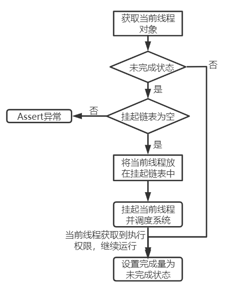
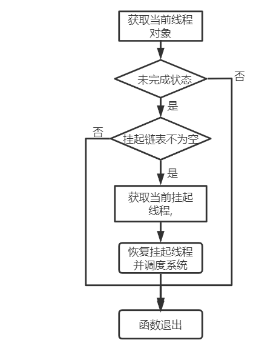
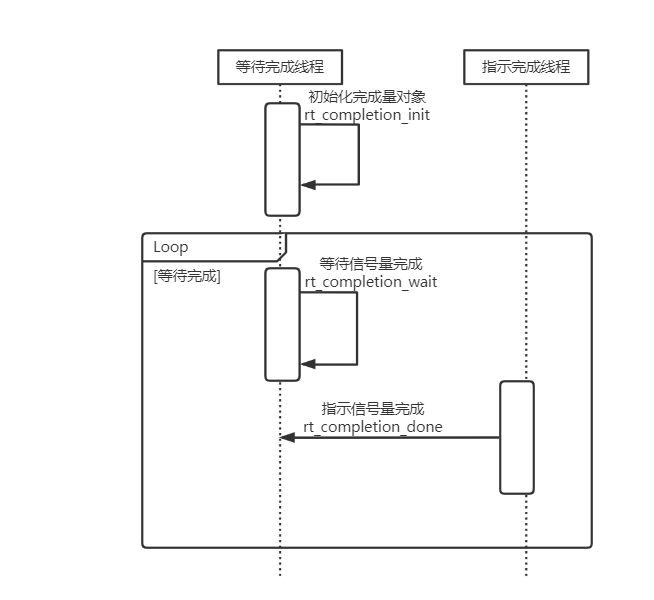

# completion

## 简介

completion 可以称之为**完成量**，是一种轻量级的线程间（`IPC`）同步机制，举一个生活中的例子来理解下，公交车上的售票员是一个线程 1，公交车司机是一个线程 2，只有当公交车司机停车后，售票员才能把车门打开。即售票员 (线程 1) 等待司机（线程 2）停车（完成了某件事）后，当售票员（线程 1）才能开门（做某件事）。

## 完成量和信号量对比

- 信号量是一种非常灵活的同步方式，可以运用在多种场合中。形成锁、同步、资源计数等关系，也能方便的用于线程与线程、中断与线程间的同步中。
- 完成量，是一种更加轻型的线程间同步的一种实现，可以理解为轻量级的二值信号，可以用于线程和线程间同步，也可以用于线程和中断之间的同步。
- 完成量不支持在某个线程中调用 `rt_completion_wait`，还未唤醒退出时，在另一个线程中调用该函数。

> 注意：当完成量应用于线程和中断之间的同步时，中断函数中只能调用 rt_completion_done 接口，而不能调用 rt_completion_wait 接口，因为 wait 接口是阻塞型接口，不可以在中断函数中调用

## 完成量控制块介绍

在 RT-Thread 中，完成量控制块是操作系统用于管理完成量的一个数据结构，由结构体 `struct rt_completion` 表示，完成量控制块的详细定义如下：

```c
struct rt_completion
{
    rt_uint32_t flag;

    /* suspended list */
    rt_list_t suspended_list;
};
```

其中 flag，表征当前完成量对象的状态，用下面的两个宏表示，即当 flag 值为 `RT_COMPLETED` 时，表征当前完成量对象已完成了某一个工作，可以继续下一个工作; 当 flag 值为 `RT_UNCOMPLETED` 时，表征当前需要等待某一个工作结束才能继续下一个工作。

```c
#define RT_COMPLETED    1
#define RT_UNCOMPLETED  0
```

## 完成量 API 接口介绍

rt-thread 中，完成量是一个轻量级的线程同步机制的实现，因此完成量的 API 接口，也很少，很简洁，下面详细介绍，说明。

### 初始化完成量

接口定义：

```c
void rt_completion_init(struct rt_completion *completion)
```

下表描述了该函数的输入参数与返回值：

| 参数       | 描述           |
| ---------- | -------------- |
| completion | 完成量对象指针 |
|**返回**  | ——             |
| 无         |                |

1. 完成量的创建只支持静态对象初始化，不支持动态生成对象，在调用初始化接口时，需要传递一个静态的完成量对象的指针。

2. 在完成量初始化接口中，只完成两件事，设置 flag 为 `RT_UNCOMPLETED`，然后初始化完成量对象的 suspend 线程链表。

### 等待完成

等待完成接口，用于等待某一个动作完成，根据 timeout 不同参数，做超时退出，或者永久等待的处理。

接口定义：

```c
rt_err_t rt_completion_wait(struct rt_completion *completion,
                            rt_int32_t            timeout)
```

下表描述了该函数的输入参数与返回值：

| 参数       | 描述                                                         |
| ---------- | ------------------------------------------------------------ |
| completion | 完成量对象指针                                               |
| timeout    | 指示等待超时退出时间 <br /> 说明：<br />1. 该 timeout 的单位是 tick<br />2. 当 timeout 为 0 时，直接返回 `RT_ETIMEOUT`<br />3. 当 timeout 为 `RT_WAITING_FOREVER` 时，该接口会一直阻塞，直到等待到完成量对象完成了工作 |
|**返回**  | ——                                                           |
| rt_err_t   | 执行正确时，返回 `RT_EOK` ，执行错误时，返回错误码            |

接口实现：



在等待完成接口中会做如下一些事：

1. 调用 `rt_thread_self` 获取当前线程对象，为后续挂起当前线程做准备。
2. 调用 `rt_hw_interrupt_disable` 和 `rt_hw_interrupt_enable` 完成接下来的原子操作。
3. 如果调用该接口前，已经调用 `rt_completion_done` 指示完成了某个工作，那么直接设置 flag 为 `RT_UNCOMPLETED`，为下一次等待做准备，函数退出。
4. 如果调用该接口时，还未完成某个工作，判断当前完成量对象的等待线程链（`suspended_list`）是否已经有线程在等待该完成量了，如果已经有，则程序直接异常挂起，如果没有正在等待的线程，那么流程继续。
5. 执行挂起当前线程的动作（因为挂起的时当前线程，因此需要后续执行 `rt_schedule` 才会真正执行挂起）。
6. 将当前线程挂在了完成量对象的 `suspended_list` 链表中。
7. 执行 `RT_DEBUG_NOT_IN_INTERRUPT`，确保当前函数不是在中断函数中执行。
8. 启动定时器，设置超时唤醒当前线程的逻辑。
9. 执行 `rt_schedule();` ，真正挂起当前线程。

### 指示完成

指示完成接口，用于指示某一个动作已经完成，指示完成后，其他的线程可以获取到该完成状态，并继续运行。

接口定义：

```c
void rt_completion_done(struct rt_completion *completion)
```

接口参数说明：completion 完成量对象指针。

接口实现：



在指示完成接口中，会做如下一些事：

1. 如果当前 flag 已经是完成状态，接口直接返回。
2. 当当前 flag 为未完成状态，设置接下来的原子操作保护。
3. 获取当前完成量挂起线程链表，并唤醒该线程。

## 完成量的使用



- 在等待线程中，或者其他线程中调用 `rt_completion_init` 初始化完成量对象。

- 在等待线程中，处理完一定逻辑后，需要等待某个工作完成时，调用 `rt_completion_wait` 接口，等待信号量完成后，程序阻塞等待。

- 子指示完成的线程中，执行 `rt_completion_done` 接口，通知等待线程，可以继续执行工作。

- 可能需要往复循环。

## 示例代码

```c
/*
 * 程序清单：完成量例程
 *
 * 程序会初始化 2 个线程及初始化一个完成量对象
 * 一个线程等待另一个线程发送完成量
*/
#include <rtthread.h>
#include <rtdevice.h>

#define THREAD_PRIORITY 9
#define THREAD_TIMESLICE 5

/* 完成量控制块 */
static struct rt_completion completion;

ALIGN(RT_ALIGN_SIZE)
static char thread1_stack[1024];
static struct rt_thread thread1;

/* 线程 1 入口函数 */
static void thread1_completion_wait(void *param)
{
    /* 等待完成 */
    rt_kprintf("thread1: completion is waitting\n");
    rt_completion_wait(&completion, RT_WAITING_FOREVER);
    rt_kprintf("thread1: completion waitting done\n");
    rt_kprintf("thread1 leave.\n");
}

ALIGN(RT_ALIGN_SIZE)
static char thread2_stack[1024];
static struct rt_thread thread2;

/* 线程 2 入口 */
static void thread2_completion_done(void *param)
{
    rt_kprintf("thread2: completion done\n");
    rt_completion_done(&completion);
    rt_kprintf("thread2 leave.\n");
}

int completion_sample(void)
{
    /* 初始化完成量对象 */
    rt_completion_init(&completion);

    rt_thread_init(&thread1,
                   "thread1",
                   thread1_completion_wait,
                   RT_NULL,
                   &thread1_stack[0],
                   sizeof(thread1_stack),
                   THREAD_PRIORITY - 1, THREAD_TIMESLICE);
    rt_thread_startup(&thread1);

    rt_thread_init(&thread2,
                   "thread2",
                   thread2_completion_done,
                   RT_NULL,
                   &thread2_stack[0],
                   sizeof(thread2_stack),
                   THREAD_PRIORITY, THREAD_TIMESLICE);
    rt_thread_startup(&thread2);

    return 0;
}

/* 导出到 msh 命令列表中 */
MSH_CMD_EXPORT(completion_sample, completion sample);
```

仿真运行结果如下：

```
msh />completion_sample
thread1: completion is waitting
thread2: completion done
thread1: completion waitting done
thread1 leave.
thread2 leave.
```
