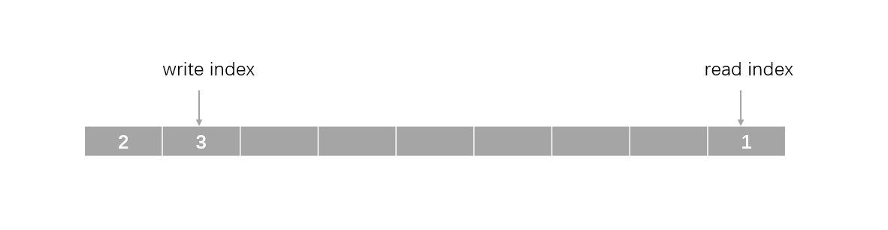

# ringbuffer

## 简介

ringbuffer（环形缓冲区）是一个非常实用的工具，我们可以将缓冲区看成一个环形的，可以不断地向里面填充数据而不用担心缓冲区溢出。ringbuffer 的读取以字节为单位。


RT-Thread 内部也提供了该工具，通过导入头文件 `#include <ipc/ringbuffer.h>` 即可直接使用。

## ringbuffer 结构体介绍

```c
struct rt_ringbuffer
{
    rt_uint8_t *buffer_ptr;

    rt_uint16_t read_mirror : 1;
    rt_uint16_t read_index : 15;
    rt_uint16_t write_mirror : 1;
    rt_uint16_t write_index : 15;

    rt_int16_t buffer_size;
};
```

`buffer_ptr` 是指向缓冲区的指针，`buffer_size` 是缓冲区的大小，`read_index` 是读索引，`write_index` 是写索引，而 `read_mirror` 和 `write_mirror` 可以理解为一种镜像值，每次向缓冲区写入数据，碰到缓冲区末尾时，切换到另一个镜像的缓冲区头部写入剩余数据。这种镜像操作可用于判断缓冲区内数据是满还是空。

当 `write_index == read_index` 且 `read_mirror == write_mirror` 时，缓冲区内数据为空。


当 `write_index == read_index` 且 `read_mirror != write_mirror` 时，缓冲区内数据已满。


若是没有上述镜像值，我们就没有办法区分缓冲区空和缓冲区满这两种情况。

**注意：**RT-Thread 的 ringbuffer 组件并未提供线程阻塞的功能，因此 ringbuffer 本质上是一个全局共享的对象，多线程使用时注意使用互斥锁保护。

## ringbuffer 接口介绍

###  创建和销毁 ringbuffer

当系统支持动态内存分配时，可以动态创建并销毁 ringbuffer 。创建 ringbuffer 使用下述接口：

```c
struct rt_ringbuffer* rt_ringbuffer_create(rt_uint16_t length);
```

该接口会根据传入的 `length` 参数动态分配 length 个字节大小的缓冲区，创建 ringbuffer 结构体并返回。下表描述了该函数的输入参数与返回值：

| 参数                  | 描述           |
| :-------------------- | :------------- |
| length                | 缓冲区字节大小 |
|**返回**             | ——             |
| RT_NULL               | 创建失败       |
| ringbuffer 结构体指针 | 创建成功       |

当不再需要使用 ringbuffer 时，可以使用下述接口销毁之前创建的 ringbuffer，

```c
void rt_ringbuffer_destroy(struct rt_ringbuffer *rb);
```

该接口会释放掉之前创建 ringbuffer 结构体时动态分配的缓冲区，下表描述了该函数的输入参数与返回值：

| 参数     | 描述                  |
| -------- | --------------------- |
| rb       | ringbuffer 结构体指针 |

### 初始化和复位 ringbuffer

若系统不支持动态内存分配，也可以使用下述静态接口来初始化 ringbuffer：

```c
void rt_ringbuffer_init(struct rt_ringbuffer *rb, rt_uint8_t *pool, rt_int16_t size);
```

该接口需要我们自己创建一个静态缓冲区，并传入缓冲区指针 `pool` 和缓冲区大小 `size` ，而后初始化 `rb` 所指向的 ringbuffer 结构体。下表描述了该函数的输入参数与返回值：

| 参数     | 描述                     |
| -------- | ------------------------ |
| rb       | ringbuffer 结构体指针    |
| pool     | 缓冲区指针               |
| size     | 缓冲区大小，以字节为单位 |

若我们需要还原 ringbuffer 为初始状态，则可以调用下述接口：

```c
void rt_ringbuffer_reset(struct rt_ringbuffer *rb);
```

该接口清空了 ringbuffer 里的所有数据，将内部状态还原成了刚初始化的时候。下表描述了该函数的输入参数与返回值：

| 参数     | 描述                  |
| -------- | --------------------- |
| rb       | ringbuffer 结构体指针 |

### 向 ringbuffer 写入数据

向 ringbuffer 写入数据的接口有许多，如果我们只需要写入一个字节，则可以使用下述接口：

```c
rt_size_t rt_ringbuffer_putchar(struct rt_ringbuffer *rb, const rt_uint8_t ch);
```

该接口向 `rb` 指向的 ringbuffer 里写入一个字节 `ch`，并返回写入的字节数。若 ringbuffer 已满，则写入失败，并返回 0 。下表描述了该函数的输入参数与返回值：

| 参数     | 描述                  |
| -------- | --------------------- |
| rb       | ringbuffer 结构体指针 |
| ch       | 待写入的字节          |
|**返回**| ——                    |
| 1        | 成功写入 1 字节       |
| 0        | 写入失败              |

若是希望 ringbuffer 满了之后也能够成功写入一个字节，则可以调用下述接口：

```c
rt_size_t rt_ringbuffer_putchar_force(struct rt_ringbuffer *rb, const rt_uint8_t ch);
```

该接口也是向 `rb` 指向的 ringbuffer 里写入一个字节 `ch`，并返回写入的字节数。不过当 ringbuffer 已满时，它也会执行写入操作，即用新的值覆盖掉旧的值。下表描述了该函数的输入参数与返回值：

| 参数     | 描述                  |
| -------- | --------------------- |
| rb       | ringbuffer 结构体指针 |
| ch       | 待写入的字节          |
|**返回**| ——                    |
| 1        | 成功写入 1 字节       |

当然，也有支持写入数据块的接口：

```c
rt_size_t rt_ringbuffer_put(struct rt_ringbuffer *rb, const rt_uint8_t *ptr, rt_uint16_t length);
```

该接口向 `rb` 指向的 ringbuffer 里写入数据块，数据块的起始地址为 `ptr`，数据块大小为 `length`，并返回写入的字节数。若写入时 ringbuffer 已满，则剩余的写入数据被抛弃，不再继续写入。下表描述了该函数的输入参数与返回值：

| 参数     | 描述                       |
| -------- | -------------------------- |
| rb       | ringbuffer 结构体指针      |
| ptr      | 数据块的起始地址           |
| length   | 数据块的大小，以字节为单位 |
|**返回**| ——                         |
| N        | 写入的字节数               |

与写入一个字节类似，写入数据块也支持覆盖写入的接口：

```c
rt_size_t rt_ringbuffer_put_force(struct rt_ringbuffer *rb, const rt_uint8_t *ptr, rt_uint16_t length);
```

该接口向 `rb` 指向的 ringbuffer 里写入数据块，数据块的起始地址为 `ptr`，数据块大小为 `length`，并返回写入的字节数。不过若写入时 ringbuffer 已满，该接口会继续写入剩余的数据，即用新的数据覆盖旧的数据。下表描述了该函数的输入参数与返回值：

| 参数     | 描述                       |
| -------- | -------------------------- |
| rb       | ringbuffer 结构体指针      |
| ptr      | 数据块的起始地址           |
| length   | 数据块的大小，以字节为单位 |
|**返回**| ——                         |
| N        | 写入的字节数               |

### 从 ringbuffer 读取数据

从 ringbuffer 里读取数据的接口分为两类，一类是**读数据并取出数据**，另一类是**读数据但并不取出数据**（peak 操作）。

先介绍第一类接口，读数据并取出数据。

从 ringbuffer 里读出一个字节的接口如下：

```c
rt_size_t rt_ringbuffer_getchar(struct rt_ringbuffer *rb, rt_uint8_t *ch);
```

该接口从 `rb` 指向的 ringbuffer 里读出一个字节，该字节通过 `ch` 返回，ch 是一个字节的缓冲区，供接口内部填充数据，该接口返回读取的字节数。下表描述了该函数的输入参数与返回值：

| 参数     | 描述                             |
| -------- | -------------------------------- |
| rb       | ringbuffer 结构体指针            |
| ch       | 字节数据指针，用于获取读取的字节 |
|**返回**| ——                               |
| 1        | 成功读取 1 个字节                |
| 0        | ringbuffer 为空                  |

若想要一次读出多个字节，则可以使用下述接口：

```c
rt_size_t rt_ringbuffer_get(struct rt_ringbuffer *rb, rt_uint8_t *ptr, rt_uint16_t length);
```

该接口从 `rb` 指向的 ringbuffer 里读出 `length` 个字节，并存入 `ptr` 所指向的缓冲区，若 ringbuffer 内存储的数据量小于 length，则实际读取的字节数为 ringbuffer 内的存储量。该接口返回实际读取的字节数。下表描述了该函数的输入参数与返回值：

| 参数     | 描述                         |
| -------- | ---------------------------- |
| rb       | ringbuffer 结构体指针        |
| ptr      | 读出数据缓冲区的起始地址     |
| length   | 读出数据的大小，以字节为单位 |
|**返回**| ——                           |
| > 0      | 实际读出的字节数             |
| 0        | 缓冲区为空                   |

下面介绍第二类接口，读数据但不取出数据：

```c
rt_size_t rt_ringbuffer_peak(struct rt_ringbuffer *rb, rt_uint8_t**ptr);
```

该接口用于获取  `rb` 指向的 ringbuffer 内部缓冲区**第一个可读数据的地址**，并保存到 `*ptr`，该接口返回 ringbuffer 内存储的字节数。

**注意：**该接口建议只用来访问一个字节，否则极有可能造成数组越界，参考下图：



此时 ringbuffer 内部存储了 3 个字节， `read_index` 索引到了内部数组的最后一个字节，此时调用 peak 接口，我们获取的就是内部数组的最后一个字节的地址 `p`，我们仅通过 `*p` 访问一个字节是没问题的，若访问第二个字节 `*(p+1)` 则就造成了数组越界。

下表描述了该函数的输入参数与返回值：

| 参数     | 描述                                                     |
| -------- | -------------------------------------------------------- |
| rb       | ringbuffer 结构体指针                                    |
| ptr      | 双重指针，用于获取 ringbuffer 内部第一个可读取数据的地址 |
|**返回**| ——                                                       |
| > 0      | ringbuffer 内存储的字节数                                |
| 0        | 缓冲区为空                                               |

### 获取 ringbuffer 内部状态

我们可以获取 ringbuffer 内存储的数据大小：

```c
rt_size_t rt_ringbuffer_data_len(struct rt_ringbuffer *rb);
```

该接口用于获取  `rb` 指向的 ringbuffer 内存储的数据大小，下表描述了该函数的输入参数与返回值：

| 参数     | 描述                      |
| -------- | ------------------------- |
| rb       | ringbuffer 结构体指针     |
|**返回**| ——                        |
| > 0      | ringbuffer 内存储的字节数 |
| 0        | ringbuffer 为空           |

还可获取 ringbuffer 内部缓冲区大小：

```c
rt_inline rt_uint16_t rt_ringbuffer_get_size(struct rt_ringbuffer *rb);
```

该接口用于获取  `rb` 指向的 ringbuffer 内部缓冲区的大小，下表描述了该函数的输入参数与返回值：

| 参数     | 描述                                      |
| -------- | ----------------------------------------- |
| rb       | ringbuffer 结构体指针                     |
|**返回**| ——                                        |
| N        | ringbuffer 内部缓冲区的大小，以字节为单位 |

## 示例代码

```c
#include <rtthread.h>
#include <ipc/ringbuffer.h>

typedef struct rb_example {
    int a;
    int b;
} rb_example_t;

int ringbuffer_example(void)
{
    rb_example_t data = {
        .a = 1,
        .b = 2,
    };

    struct rt_ringbuffer * rb = rt_ringbuffer_create(sizeof(rb_example_t) * 2);
    RT_ASSERT(rb != RT_NULL);

    rt_kprintf("Put data to   ringbuffer, a: %d b: %d size: %d\n", data.a, data.b, sizeof(data));
    rt_ringbuffer_put(rb, (rt_uint8_t *)&data, sizeof(data));


    rb_example_t recv_data;
    rt_size_t recv = rt_ringbuffer_get(rb, (rt_uint8_t *)&recv_data, sizeof(recv_data));
    RT_ASSERT(recv == sizeof(recv_data));
    rt_kprintf("Get data from ringbuffer, a: %d b: %d size: %d\n", recv_data.a, recv_data.b, sizeof(recv_data));

    return 0;
}

MSH_CMD_EXPORT(ringbuffer_example, ringbuffer example);
```

运行效果如下：

