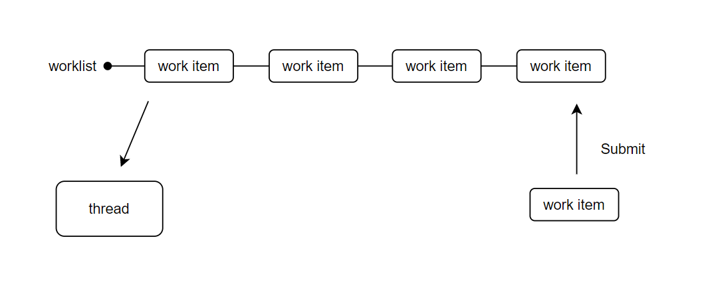
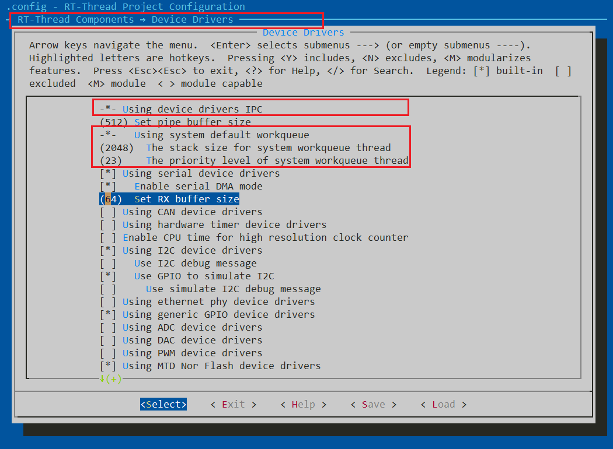

# workqueue

## 简介

工作队列（workqueue）是一种转移任务执行环境的工具，例如当系统产生一个中断时，我们可以在中断处理函数里做一些紧急地操作，然后将另外一些不那么紧急，而且需要一定时间的任务封装成函数交给工作队列执行，此时该函数的执行环境就从 中断环境 变成了 线程环境，这就是 Linux 里经常提及的中断处理 “下半部”。

工作队列的原理也比较简单，可以参考下述图示：



工作队列内部有一个工作链表（worklist），链表上有多个工作项（work item）节点，我们可以将工作项简单理解为函数，因此工作链表上就存储着一系列待执行的函数。而且工作队列内有个线程一直在轮询工作链表，每次都从工作链表中取出一个工作项，并执行其相关联的函数。当工作队列为空时，线程会被挂起。

---

RT-Thread 内有 workqueue 组件，导入头文件 `#include <ipc/workqueue.h>` 即可使用。

使用注意事项：

- 工作项里最好不要有会导致线程阻塞的代码，否则会影响后续工作项的执行。

RT-Thread 系统提供了一个 系统工作队列，可以通过 env 开启

```
RT-Thread Components
    ->    Device Drivers
        ->    Using device drivers IPC
            -> Using system default workqueue
```

我们还可以配置系统工作队列内线程栈的大小，线程的优先级，图示如下：



使用系统工作队列的好处是 RT-Thread 内部帮我们创建了一个工作队列，我们只需要提交工作项即可，使用简洁方便。

## workquque 结构体介绍

```c
struct rt_workqueue
{
    rt_list_t      work_list;
    rt_list_t      delayed_list;
    struct rt_work *work_current; /* current work */

    struct rt_semaphore sem;
    rt_thread_t    work_thread;
};
```

`work_list` 就是工作队列里的工作链表，`work_thread` 即工作队列里的线程。再来看看工作项结构体：

```c
struct rt_work
{
    rt_list_t list;

    void (*work_func)(struct rt_work *work, void *work_data);
    void *work_data;
    rt_uint16_t flags;
    rt_uint16_t type;
    struct rt_timer timer;
    struct rt_workqueue *workqueue;
};
```

`list` 用于将该工作项挂载到工作链表上去，而 `work_func` 就是该工作项绑定的函数指针，`work_data` 是用户自定义数据，当工作项被执行时就会调用该函数。

## workqueue 接口介绍

### 初始化工作项

每一个工作项在被提交到工作队列之前，都需要调用下述接口初始化：

```c
rt_inline void rt_work_init(struct rt_work *work, void (*work_func)(struct rt_work *work, void *work_data), void *work_data);
```

该接口初始化 `work` 指针指向的工作项，并绑定回调函数 `work_func` 以及用户自定义数据 `work_data`。若使用自定义数据，需要保证该数据对象为静态存储的。下表描述了该函数的输入参数与返回值：

| 参数      | 描述                           |
| --------- | ------------------------------ |
| work      | 工作项结构体指针               |
| work_func | 回调函数，工作项执行时会调用它 |
| work_data | 用户自定义数据，回调函数参数   |
| 返回  | ——                             |

### 使用系统工作队列

开启系统工作队列后，我们就可以通过下述接口向系统工作队列提交一个工作项：

```c
rt_err_t rt_work_submit(struct rt_work *work, rt_tick_t time);
```

该函数向系统工作队列里提交 `work` 指针指向的工作项，若 `time` 大于 0，则提交过程会延时 `time` 个 ticks 。下表描述了该函数的输入参数与返回值：

| 参数      | 描述                                                |
| --------- | --------------------------------------------------- |
| work      | 工作项结构体指针                                    |
| time      | 提交延时，以 tick 为单位，需小于  `RT_TICK_MAX / 2` |
| 返回  | ——                                                  |
| RT_EOK    | 提交成功                                            |
| -RT_EBUSY | 该工作项正在执行                                    |
| -RT_ERROR | `time` 参数错误                                     |

若我们想取消之前提交过的工作项，则可以调用下述接口：

```c
rt_err_t rt_work_cancel(struct rt_work *work);
```

该接口会在系统工作队列里移除 `work` 指向的工作项。 下表描述了该函数的输入参数与返回值：

| 参数      | 描述             |
| --------- | ---------------- |
| work      | 工作项结构体指针 |
| 返回  | ——               |
| RT_EOK    | 取消成功         |
| -RT_EBUSY | 该工作项正在执行 |

### 创建销毁工作队列

除了使用系统工作队列，我们也可以创建属于自己的工作队列，这样更加灵活。创建工作队列使用下述接口：

```c
struct rt_workqueue *rt_workqueue_create(const char *name, rt_uint16_t stack_size, rt_uint8_t priority);
```

该函数创建并初始化一个工作队列，利用参数 `name`，`stack_size` 和 `priority` 创建工作队列内部线程，最终返回创建的工作队列。下表描述了该函数的输入参数与返回值：

| 参数                    | 描述       |
| ----------------------- | ---------- |
| name                    | 线程名字   |
| stack_size              | 线程栈大小 |
| priority                | 线程优先级 |
| 返回                | ——         |
| RT_NULL                 | 创建失败   |
| rt_workqueue 结构体指针 | 创建成功   |

若不再使用工作队列，也可以销毁它：

```c
rt_err_t rt_workqueue_destroy(struct rt_workqueue *queue);
```

该函数还原了内部所有状态，删除了内部线程，并释放了 `queue` 所指向的结构体空间，因此调用该函数后，不能再使用 `queue` ，下表描述了该函数的输入参数与返回值：

| 参数     | 描述               |
| -------- | ------------------ |
| queue    | 工作队列结构体指针 |
| 返回 | ——                 |
| RT_EOK   | 销毁成功           |

### 提交工作项

向自己创建的工作队列提交工作项有三个接口，根据是否允许工作项延时提交可分为：

1. 允许工作项延时提交
2. 不允许工作项延时提交

允许 工作项延时提交的接口如下：

```c
rt_err_t rt_workqueue_submit_work(struct rt_workqueue *queue, struct rt_work *work, rt_tick_t time);
```

该接口将 `work` 指向的工作项提交到 `queue` 指向的工作队列中，若 `time` 大于 0，则该提交延时 `time` 个 tick 之后执行。下表描述了该函数的输入参数与返回值：

| 参数      | 描述                                                |
| --------- | --------------------------------------------------- |
| queue | 工作队列结构体指针 |
| work      | 工作项结构体指针                                    |
| time      | 提交延时，以 tick 为单位，需小于  `RT_TICK_MAX / 2` |
| 返回  | ——                                                  |
| RT_EOK    | 提交成功                                            |
| -RT_EBUSY | 该工作项正在执行                                    |
| -RT_ERROR | `time` 参数错误                                     |

不允许 工作项延时提交的接口如下：

```c
rt_err_t rt_workqueue_dowork(struct rt_workqueue *queue, struct rt_work *work);
```

该接口立即将 `work` 指向的工作项提交到 `queue` 指向的工作队列 尾部，下表描述了该函数的输入参数与返回值：

| 参数      | 描述               |
| --------- | ------------------ |
| queue     | 工作队列结构体指针 |
| work      | 工作项结构体指针   |
| 返回  | ——                 |
| RT_EOK    | 提交成功           |
| -RT_EBUSY | 该工作项正在执行   |

还有另一个类似接口：

```c
rt_err_t rt_workqueue_critical_work(struct rt_workqueue *queue, struct rt_work *work);
```

该接口立即将 `work` 指向的工作项提交到 `queue` 指向的工作队列 头部，因此该接口提交的工作项在当前工作项执行完毕后会被立即执行，适用于一些比较紧急（critical）的任务。而通过 dowork 提交的工作项会挂载到工作队列尾部，适用于不那么紧急的任务。下表描述了该函数的输入参数与返回值：

| 参数      | 描述               |
| --------- | ------------------ |
| queue     | 工作队列结构体指针 |
| work      | 工作项结构体指针   |
| 返回  | ——                 |
| RT_EOK    | 提交成功           |
| -RT_EBUSY | 该工作项正在执行   |

### 取消工作项

想要取消指定工作项可以调用下述接口：

```c
rt_err_t rt_workqueue_cancel_work(struct rt_workqueue *queue, struct rt_work *work);
```

该接口会从 `queue` 指向的工作队列中将 `work` 指向的工作项移除，这样该工作项就不会被执行了。当该工作项正在执行时，返回 -RT_EBUSY 的错误。下表描述了该函数的输入参数与返回值：

| 参数      | 描述               |
| --------- | ------------------ |
| queue     | 工作队列结构体指针 |
| work      | 工作项结构体指针   |
| 返回  | ——                 |
| RT_EOK    | 提交成功           |
| -RT_EBUSY | 该工作项正在执行   |

还有一类 sync 接口不会返回错误，而是等待该工作项执行完毕：

```c
rt_err_t rt_workqueue_cancel_work_sync(struct rt_workqueue *queue, struct rt_work *work);
```

该接口会从 `queue` 指向的工作队列中将 `work` 指向的工作项移除，这样该工作项就不会被执行了。不过当该工作项正在执行时，该接口内部会 阻塞 等待该工作项执行完毕，是一个同步接口。下表描述了该函数的输入参数与返回值：

| 参数     | 描述               |
| -------- | ------------------ |
| queue    | 工作队列结构体指针 |
| work     | 工作项结构体指针   |
| 返回 | ——                 |
| RT_EOK   | 提交成功           |

我们还可以一次性取消所有的工作项：

```c
rt_err_t rt_workqueue_cancel_all_work(struct rt_workqueue *queue);
```

该接口取消 `queue` 指向的工作队列里的所有工作项。下表描述了该函数的输入参数与返回值：

| 参数     | 描述               |
| -------- | ------------------ |
| queue    | 工作队列结构体指针 |
| work     | 工作项结构体指针   |
| 返回 | ——                 |
| RT_EOK   | 提交成功           |

## 示例代码

```c
#include <rtthread.h>
#include <ipc/workqueue.h>

struct rt_work work1;
int work1_data = 1;

struct rt_work work2;
int work2_data = 2;

void work_func(struct rt_work *work, void *work_data)
{
    int data = *(int *)work_data;
    rt_kprintf("recv work data: %d\n", data);
}

int workqueue_example(void)
{
    printf("hello rt-thread!\n");

    struct rt_workqueue *wq = rt_workqueue_create("my_wq", 2048, 20);
    RT_ASSERT(wq);

    rt_work_init(&work1, work_func, &work1_data);
    rt_work_init(&work2, work_func, &work2_data);

    rt_workqueue_submit_work(wq, &work1, 2);
    rt_workqueue_submit_work(wq, &work2, 0);

    return 0;
}

MSH_CMD_EXPORT(workqueue_example, workqueue example);
```

运行效果如下，与工作项绑定的任务被异步执行了，而且工作项 1 延迟了 2 个 tick 才执行：

