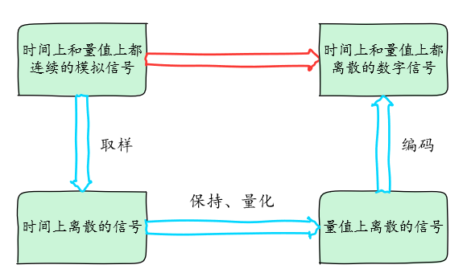

# ADC 设备

## ADC 简介

ADC(Analog-to-Digital Converter) 指模数转换器。是指将连续变化的模拟信号转换为离散的数字信号的器件。真实世界的模拟信号，例如温度、压力、声音或者图像等，需要转换成更容易储存、处理和发射的数字形式。模数转换器可以实现这个功能，在各种不同的产品中都可以找到它的身影。与之相对应的 DAC(Digital-to-Analog Converter)，它是 ADC 模数转换的逆向过程。ADC 最早用于对无线信号向数字信号转换。如电视信号，长短播电台发射接收等。

### 转换过程

如下图所示模数转换一般要经过采样、保持和量化、编码这几个步骤。在实际电路中，有些过程是合并进行的，如采样和保持，量化和编码在转换过程中是同时实现的。



采样是将时间上连续变化的模拟信号转换为时间上离散的模拟信号。采样取得的模拟信号转换为数字信号都需要一定时间，为了给后续的量化编码过程提供一个稳定的值，在采样电路后要求将所采样的模拟信号保持一段时间。

将数值连续的模拟量转换为数字量的过程称为量化。数字信号在数值上是离散的。采样保持电路的输出电压还需要按照某种近似方式归化到与之相应的离散电平上，任何数字量只能是某个最小数量单位的整数倍。量化后的数值最后还需要编码过程，也就是 A/D 转换器输出的数字量。

### 分辨率

分辨率以二进制（或十进制）数的位数来表示，一般有8位、10位、12位、16位等，它说明模数转换器对输入信号的分辨能力，位数越多，表示分辨率越高，恢复模拟信号时会更精确。

### 精度

精度表示 ADC 器件在所有的数值点上对应的模拟值和真实值之间的最大误差值，也就是输出数值偏离线性最大的距离。

> [!NOTE]
> 注：精度与分辨率是两个不一样的概念，请注意区分。

### 转换速率

转换速率是指 A/D 转换器完成一次从模拟到数字的 AD 转换所需时间的倒数。例如，某 A/D 转换器的转换速率为 1MHz，则表示完成一次 AD 转换时间为 1 微秒。

## 访问 ADC 设备

应用程序通过 RT-Thread 提供的 ADC 设备管理接口来访问 ADC 硬件，相关接口如下所示：

| **函数** | **描述**     |
| --------------- | ------------------ |
| rt_device_find()  | 根据 ADC 设备名称查找设备获取设备句柄 |
| rt_adc_enable()     | 使能 ADC 设备     |
| rt_adc_read()   | 读取 ADC 设备数据      |
| rt_adc_disable()  | 关闭 ADC 设备    |

### 查找 ADC 设备

应用程序根据 ADC 设备名称获取设备句柄，进而可以操作 ADC 设备，查找设备函数如下所示：

```c
rt_device_t rt_device_find(const char* name);
```

| **参数** | **描述**                           |
| -------- | ---------------------------------- |
| name     | ADC 设备名称                           |
| **返回** | ——                                 |
| 设备句柄 | 查找到对应设备将返回相应的设备句柄 |
| RT_NULL  | 没有找到设备            |

一般情况下，注册到系统的 ADC 设备名称为 adc0，adc1等，使用示例如下所示：

```c
#define ADC_DEV_NAME        "adc1"  /* ADC 设备名称 */
rt_adc_device_t adc_dev;            /* ADC 设备句柄 */
/* 查找设备 */
adc_dev = (rt_adc_device_t)rt_device_find(ADC_DEV_NAME);
```

### 使能 ADC 通道

在读取 ADC 设备数据前需要先使能设备，通过如下函数使能设备:

```c
rt_err_t rt_adc_enable(rt_adc_device_t dev, rt_uint32_t channel);
```

| **参数**   | **描述**                         |
| ---------- | ------------------------------- |
| dev        | ADC 设备句柄                        |
| channel | ADC 通道               |
| **返回**   | ——                             |
| RT_EOK     | 成功                |
| -RT_ENOSYS | 失败，设备操作方法为空 |
| 其他错误码 | 失败                |

使用示例如下所示：

```c
#define ADC_DEV_NAME        "adc1"  /* ADC 设备名称 */
#define ADC_DEV_CHANNEL     5       /* ADC 通道 */
rt_adc_device_t adc_dev;            /* ADC 设备句柄 */
/* 查找设备 */
adc_dev = (rt_adc_device_t)rt_device_find(ADC_DEV_NAME);
/* 使能设备 */
rt_adc_enable(adc_dev, ADC_DEV_CHANNEL);
```

### 读取 ADC 通道采样值

读取 ADC 通道采样值可通过如下函数完成：

```c
rt_uint32_t rt_adc_read(rt_adc_device_t dev, rt_uint32_t channel);
```

| **参数**   | **描述**          |
| ---------- | ----------------- |
| dev        | ADC 设备句柄          |
| channel    | ADC 通道            |
| **返回**   | ——                |
| 读取的数值     |       |

使用 ADC 采样电压值的使用示例如下所示：

```c
#define ADC_DEV_NAME        "adc1"  /* ADC 设备名称 */
#define ADC_DEV_CHANNEL     5       /* ADC 通道 */
#define REFER_VOLTAGE       330         /* 参考电压 3.3V,数据精度乘以100保留2位小数*/
#define CONVERT_BITS        (1 << 12)   /* 转换位数为12位 */

rt_adc_device_t adc_dev;            /* ADC 设备句柄 */
rt_uint32_t value；
/* 查找设备 */
adc_dev = (rt_adc_device_t)rt_device_find(ADC_DEV_NAME);
/* 使能设备 */
rt_adc_enable(adc_dev, ADC_DEV_CHANNEL);
/* 读取采样值 */
value = rt_adc_read(adc_dev, ADC_DEV_CHANNEL);
/* 转换为对应电压值 */
vol = value * REFER_VOLTAGE / CONVERT_BITS;
rt_kprintf("the voltage is :%d.%02d \n", vol / 100, vol % 100);
```

实际电压值的计算公式为：采样值 * 参考电压  /  （1 <<  分辨率位数），上面示例代码乘以 100 将数据放大，最后通过 vol / 100 获得电压的整数位值，通过 vol % 100 获得电压的小数位值。

### 关闭 ADC 通道

关闭 ADC 通道可通过如下函数完成：

```c
rt_err_t rt_adc_disable(rt_adc_device_t dev, rt_uint32_t channel);
```

| **参数**   | **描述**                         |
| ---------- | ------------------------------- |
| dev        | ADC 设备句柄                        |
| channel    | ADC 通道               |
| **返回**   | ——                             |
| RT_EOK     | 成功                |
| -RT_ENOSYS | 失败，设备操作方法为空 |
| 其他错误码 | 失败                |

使用示例如下所示：

```c
#define ADC_DEV_NAME        "adc1"  /* ADC 设备名称 */
#define ADC_DEV_CHANNEL     5       /* ADC 通道 */
rt_adc_device_t adc_dev;            /* ADC 设备句柄 */
rt_uint32_t value；
/* 查找设备 */
adc_dev = (rt_adc_device_t)rt_device_find(ADC_DEV_NAME);
/* 使能设备 */
rt_adc_enable(adc_dev, ADC_DEV_CHANNEL);
/* 读取采样值 */
value = rt_adc_read(adc_dev, ADC_DEV_CHANNEL);
/* 转换为对应电压值 */
vol = value * REFER_VOLTAGE / CONVERT_BITS;
rt_kprintf("the voltage is :%d.%02d \n", vol / 100, vol % 100);
/* 关闭通道 */
rt_adc_disable(adc_dev, ADC_DEV_CHANNEL);
```

### FinSH 命令

在使用设备前，需要先查找设备是否存在，可以使用命令 `adc probe` 后面跟注册的 ADC 设备的名称。如下所示：

```c
msh >adc probe adc1
probe adc1 success
```

使能设备的某个通道可以使用命令 `adc enable` 后面跟通道号。

```c
msh >adc enable 5
adc1 channel 5 enables success
```

读取 ADC 设备某个通道的数据可以使用命令 `adc read` 后面跟通道号。

```c
msh >adc read 5
adc1 channel 5  read value is 0x00000FFF
msh >
```

关闭设备的某个通道可以使用命令 `adc disable` 后面跟通道号。

```c
msh >adc disable 5
adc1 channel 5 disable success
msh >
```

## ADC 设备使用示例

ADC 设备的具体使用方式可以参考如下示例代码，示例代码的主要步骤如下：

1. 首先根据 ADC 设备名称 “adc1” 查找设备获取设备句柄。

2. 使能设备后读取 adc1 设备对应的通道 5 的采样值，然后根据分辨率为 12 位，参考电压为 3.3V 计算实际的电压值。

3. 最后关闭 ADC 设备对应通道。

运行结果：打印实际读取到的转换的原始数据和经过计算后的实际电压值。

```c
/*
 * 程序清单： ADC 设备使用例程
 * 例程导出了 adc_sample 命令到控制终端
 * 命令调用格式：adc_sample
 * 程序功能：通过 ADC 设备采样电压值并转换为数值。
 *           示例代码参考电压为3.3V,转换位数为12位。
*/

#include <rtthread.h>
#include <rtdevice.h>

#define ADC_DEV_NAME        "adc1"      /* ADC 设备名称 */
#define ADC_DEV_CHANNEL     5           /* ADC 通道 */
#define REFER_VOLTAGE       330         /* 参考电压 3.3V,数据精度乘以100保留2位小数*/
#define CONVERT_BITS        (1 << 12)   /* 转换位数为12位 */

static int adc_vol_sample(int argc, char *argv[])
{
    rt_adc_device_t adc_dev;
    rt_uint32_t value, vol;
    rt_err_t ret = RT_EOK;

    /* 查找设备 */
    adc_dev = (rt_adc_device_t)rt_device_find(ADC_DEV_NAME);
    if (adc_dev == RT_NULL)
    {
        rt_kprintf("adc sample run failed! can't find %s device!\n", ADC_DEV_NAME);
        return RT_ERROR;
    }

    /* 使能设备 */
    ret = rt_adc_enable(adc_dev, ADC_DEV_CHANNEL);

    /* 读取采样值 */
    value = rt_adc_read(adc_dev, ADC_DEV_CHANNEL);
    rt_kprintf("the value is :%d \n", value);

    /* 转换为对应电压值 */
    vol = value * REFER_VOLTAGE / CONVERT_BITS;
    rt_kprintf("the voltage is :%d.%02d \n", vol / 100, vol % 100);

    /* 关闭通道 */
    ret = rt_adc_disable(adc_dev, ADC_DEV_CHANNEL);

    return ret;
}
/* 导出到 msh 命令列表中 */
MSH_CMD_EXPORT(adc_vol_sample, adc voltage convert sample);
```

## 常见问题

### Q: menuconfig 找不到 ADC 设备的配置选项？

 **A:** 使用的源代码还不支持 ADC 设备驱动框架。建议更新源代码。

