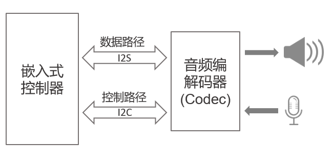

# AUDIO 设备

## Audio 简介

Audio （音频）设备是嵌入式系统中非常重要的一个组成部分，负责音频数据的采样和输出。Audio  设备通常由数据总线接口、控制总线接口、音频编解码器（Codec）、扬声器和麦克风等组成，如下图所示：



### Audio 设备特性

RT-Thread Audio 设备驱动框架是 Audio 框架的底层部分，主要负责原生音频数据的采集和输出、音频流的控制、音频设备的管理、音量调节以及不同硬件和 Codec 的抽象等。

- 接口：标准 device 接口(open/close/read/control)。
- 同步模式访问。
- 支持播放和录音。
- 支持音频参数管理。
- 支持音量调节。

## 访问 Audio 设备

### 查找 Audio 设备

应用程序根据 Audio 设备名称获取设备句柄，进而可以操作 Audio 设备，查找设备函数如下所示：

```c
rt_device_t rt_device_find(const char* name);
```

| **参数** | **描述**                           |
| -------- | ---------------------------------- |
| name     | Audio 设备名称                           |
| **返回** | ——                                 |
| 设备句柄 | 查找到对应设备将返回相应的设备句柄 |
| RT_NULL  | 没有找到相应的设备对象             |

使用示例如下所示：
```c
#define SOUND_DEVICE_NAME    "sound0"    /* Audio 设备名称 */

static rt_device_t snd_dev;              /* Audio 设备句柄 */

/* 根据设备名称查找 Audio 设备，获取设备句柄 */
snd_dev = rt_device_find(SOUND_DEVICE_NAME);
```

### 打开 Audio 设备

通过设备句柄，应用程序可以打开和关闭设备，通过如下函数打开设备:

```c
rt_err_t rt_device_open(rt_device_t dev, rt_uint16_t oflags);
```

| **参数**   | **描述**                         |
| ---------- | ------------------------------- |
| dev        | 设备句柄                        |
| oflags     | 设备模式标志                     |
| **返回**   | ——                             |
| RT_EOK     | 设备打开成功                |
| -RT_EBUSY  | 如果设备注册时指定的参数中包括 RT_DEVICE_FLAG_STANDALONE 参数，此设备将不允许重复打开 |
| -RT_EINVAL  | 不支持的打开参数 |
| 其他错误码 | 设备打开失败                |

oflags 参数支持下列参数：

```c
#define RT_DEVICE_OFLAG_WRONLY      0x002     /* 标准设备的只写模式，对应 Audio 播放设备 */
#define RT_DEVICE_FLAG_RDONLY       0x001     /* 标准设备的只读模式，对应 Audio 录音设备 */
```

Audio 设备分为播放和录音 2 种类型，播放设备输出音频数据到 Codec 编解码器，录音设备则读取数据。在使用的时候，播放设备通过只写标志进行标识，录音设备通过只读标志进行标识。

打开 Audio 播放设备使用示例如下所示：
```c
rt_device_open(snd_dev, RT_DEVICE_OFLAG_WRONLY)
```

打开 Audio 录音设备使用示例如下所示：
```c
rt_device_open(mic_dev, RT_DEVICE_FLAG_RDONLY)
```

### 控制 Audio 设备

通过命令控制字，应用程序可以对 Audio 设备进行配置，通过如下函数完成：

```c
rt_err_t rt_device_control(rt_device_t dev, rt_uint8_t cmd, void* arg);
```

| **参数**   | **描述**                                   |
| ---------- | ------------------------------------------ |
| dev        | 设备句柄                                   |
| cmd        | 命令控制字，详细介绍见下面 |
| arg        | 控制的参数, 详细介绍见下面  |
| **返回**   | ——                                         |
| RT_EOK     | 函数执行成功                               |
| -RT_ENOSYS | 执行失败，dev 为空                         |
| 其他错误码 | 执行失败                                   |

其中的 cmd 目前支持以下几种命令控制字

```c
/* AUDIO command */
#define _AUDIO_CTL(a) (0x10 + a)

#define AUDIO_CTL_GETCAPS                   _AUDIO_CTL(1) /* 获取设备功能属性 */
#define AUDIO_CTL_CONFIGURE                 _AUDIO_CTL(2) /* 配置设备功能属性 */

```

- 设备功能属性结构体的定义如下

```c
struct rt_audio_caps
{
    int main_type;                            /* 命令主类型 */
    int sub_type;                             /* 命令子类型 */

    union
    {
        rt_uint32_t mask;
        int     value;                       /* 参数值 */
        struct rt_audio_configure config;    /* 音频参数信息 */
    } udata;
};
```

#### 设置播放的音频参数信息

设置播放的采样率、采样通道、以及采样位数。

```c
struct rt_audio_caps caps;

caps.main_type               = AUDIO_TYPE_OUTPUT; /* 输出类型（播放设备 ）*/
caps.sub_type                = AUDIO_DSP_PARAM;   /* 设置所有音频参数信息 */
caps.udata.config.samplerate = 44100;             /* 采样率 */
caps.udata.config.channels   = 2;                 /* 采样通道 */
caps.udata.config.samplebits = 16;                /* 采样位数 */
rt_device_control(device, AUDIO_CTL_CONFIGURE, &caps);

```

#### 设置播放的主音量

设置播放的主音量。

```c
struct rt_audio_caps caps;

caps.main_type   = AUDIO_TYPE_MIXER;       /* 音量管理类型 */
caps.sub_type    = AUDIO_MIXER_VOLUME;     /* 设置播放的主音量 */
caps.udata.value = volume;                 /* 范围 0 ~ 100 */
rt_device_control(snd_dev, AUDIO_CTL_CONFIGURE, &caps);

```

#### 设置录音的音频参数信息

设置录音的采样率、采样通道、以及采样位数。

```c
struct rt_audio_caps caps;

caps.main_type               = AUDIO_TYPE_INPUT;  /* 输入类型（录音设备 ）*/
caps.sub_type                = AUDIO_DSP_PARAM;   /* 设置所有音频参数信息 */
caps.udata.config.samplerate = 44100;             /* 采样率 */
caps.udata.config.channels   = 2;                 /* 采样通道 */
caps.udata.config.samplebits = 16;                /* 采样位数 */
rt_device_control(device, AUDIO_CTL_CONFIGURE, &caps);

```

#### 设置录音的主音量

设置录音的主音量。

```c
struct rt_audio_caps caps;

caps.main_type = AUDIO_TYPE_MIXER;       /* 音量管理类型 */
caps.sub_type  = AUDIO_MIXER_MIC;        /* 设置录音的主音量 */
caps.udata.value = volume;               /* 范围 0 ~ 100 */
rt_device_control(player->device, AUDIO_CTL_CONFIGURE, &caps);

```

### 写入音频数据

向音频播放设备中写入数据，可以通过如下函数完成：

```c
rt_size_t rt_device_write(rt_device_t dev, rt_off_t pos, const void* buffer, rt_size_t size);
```

| **参数**   | **描述**                                   |
| ---------- | ------------------------------------------ |
| dev                | 设备句柄                               |
| pos                | 写入数据偏移量，此参数音频设备未使用          |
| buffer             | 内存缓冲区指针，放置要写入的数据       |
| size               | 写入数据的大小                         |
| **返回**           | ——                                     |
| 写入数据的实际大小 |  以字节为单位； |

调用这个函数，会把缓冲区 buffer 中的数据写入到设备 dev 中，写入数据的大小是 size。该函数为同步接口，驱动框架内部会将数据先保存到音频设备的缓冲区，当缓冲区满时，函数被阻塞。

### 读取音频数据

可调用如下函数读取音频录音设备接收到的数据：

```c
rt_size_t rt_device_read(rt_device_t dev, rt_off_t pos, void* buffer, rt_size_t size);
```

| **参数**           | **描述**                                       |
| ------------------ | ---------------------------------------------- |
| dev                | 设备句柄                                       |
| pos                | 读取数据偏移量，此参数串口设备未使用                 |
| buffer             | 缓冲区指针，读取的数据将会被保存在缓冲区中 |
| size               | 读取数据的大小                                 |
| **返回**           | ——                                             |
| 读到数据的实际大小 | 如果是字符设备，返回大小以字节为单位           |
| 0                  | 需要读取当前线程的 errno 来判断错误状态          |

调用这个函数，从音频录音设备读取 size 大小的数据到 buffer 中。该函数为同步接口，当驱动框架内部 Pipe缓存的数据小于 size 时，函数被阻塞。

### 关闭音频设备

当应用程序完成串口操作后，可以关闭音频设备，通过如下函数完成:

```c
rt_err_t rt_device_close(rt_device_t dev);
```

| **参数**   | **描述**                           |
| ---------- | ---------------------------------- |
| dev        | 设备句柄                           |
| **返回**   | ——                                 |
| RT_EOK     | 关闭设备成功                       |
| -RT_ERROR  | 设备已经完全关闭，不能重复关闭设备 |
| 其他错误码 | 关闭设备失败                       |

关闭设备接口和打开设备接口需配对使用，打开一次设备对应要关闭一次设备，这样设备才会被完全关闭，否则设备仍处于未关闭状态。

## 音频设备使用示例

音频设备用于播放和录音，通常伴随着音频文件的编解码使用。下面介绍播放和录制 wav 文件的示例，完整的代码可以通过 [RT-Thread wavplayer 软件包](https://github.com/RT-Thread-packages/wavplayer) 获取。

### 播放

播放一段音频数据的主要步骤如下：

1. 首先查找 Audio 设备获取设备句柄。

2. 以只写方式打开 Audio 设备。

3. 设置音频参数信息（采样率、通道等）。

4. 解码音频文件的数据。

5. 写入音频文件数据。

6. 播放完成，关闭设备。

```c
#include <rtthread.h>
#include <rtdevice.h>
#include <dfs_posix.h>

#define BUFSZ   1024
#define SOUND_DEVICE_NAME    "sound0"    /* Audio 设备名称 */
static rt_device_t snd_dev;              /* Audio 设备句柄 */

struct RIFF_HEADER_DEF
{
    char riff_id[4];     // 'R','I','F','F'
    uint32_t riff_size;
    char riff_format[4]; // 'W','A','V','E'
};

struct WAVE_FORMAT_DEF
{
    uint16_t FormatTag;
    uint16_t Channels;
    uint32_t SamplesPerSec;
    uint32_t AvgBytesPerSec;
    uint16_t BlockAlign;
    uint16_t BitsPerSample;
};

struct FMT_BLOCK_DEF
{
    char fmt_id[4];    // 'f','m','t',' '
    uint32_t fmt_size;
    struct WAVE_FORMAT_DEF wav_format;
};

struct DATA_BLOCK_DEF
{
    char data_id[4];     // 'R','I','F','F'
    uint32_t data_size;
};

struct wav_info
{
    struct RIFF_HEADER_DEF header;
    struct FMT_BLOCK_DEF   fmt_block;
    struct DATA_BLOCK_DEF  data_block;
};

int wavplay_sample(int argc, char **argv)
{
    int fd = -1;
    uint8_t *buffer = NULL;
    struct wav_info *info = NULL;
    struct rt_audio_caps caps = {0};

    if (argc != 2)
    {
        rt_kprintf("Usage:\n");
        rt_kprintf("wavplay_sample song.wav\n");
        return 0;
    }

    fd = open(argv[1], O_RDONLY);
    if (fd < 0)
    {
        rt_kprintf("open file failed!\n");
        goto __exit;
    }

    buffer = rt_malloc(BUFSZ);
    if (buffer == RT_NULL)
        goto __exit;

    info = (struct wav_info *) rt_malloc(sizeof * info);
    if (info == RT_NULL)
        goto __exit;

    if (read(fd, &(info->header), sizeof(struct RIFF_HEADER_DEF)) <= 0)
        goto __exit;
    if (read(fd, &(info->fmt_block),  sizeof(struct FMT_BLOCK_DEF)) <= 0)
        goto __exit;
    if (read(fd, &(info->data_block), sizeof(struct DATA_BLOCK_DEF)) <= 0)
        goto __exit;

    rt_kprintf("wav information:\n");
    rt_kprintf("samplerate %d\n", info->fmt_block.wav_format.SamplesPerSec);
    rt_kprintf("channel %d\n", info->fmt_block.wav_format.Channels);

    /* 根据设备名称查找 Audio 设备，获取设备句柄 */
    snd_dev = rt_device_find(SOUND_DEVICE_NAME);

    /* 以只写方式打开 Audio 播放设备 */
    rt_device_open(snd_dev, RT_DEVICE_OFLAG_WRONLY);

    /* 设置采样率、通道、采样位数等音频参数信息 */
    caps.main_type               = AUDIO_TYPE_OUTPUT;                           /* 输出类型（播放设备 ）*/
    caps.sub_type                = AUDIO_DSP_PARAM;                             /* 设置所有音频参数信息 */
    caps.udata.config.samplerate = info->fmt_block.wav_format.SamplesPerSec;    /* 采样率 */
    caps.udata.config.channels   = info->fmt_block.wav_format.Channels;         /* 采样通道 */
    caps.udata.config.samplebits = 16;                                          /* 采样位数 */
    rt_device_control(snd_dev, AUDIO_CTL_CONFIGURE, &caps);

    while (1)
    {
        int length;

        /* 从文件系统读取 wav 文件的音频数据 */
        length = read(fd, buffer, BUFSZ);

        if (length <= 0)
            break;

        /* 向 Audio 设备写入音频数据 */
        rt_device_write(snd_dev, 0, buffer, length);
    }

    /* 关闭 Audio 设备 */
    rt_device_close(snd_dev);

__exit:

    if (fd >= 0)
        close(fd);

    if (buffer)
        rt_free(buffer);

    if (info)
        rt_free(info);

    return 0;
}

MSH_CMD_EXPORT(wavplay_sample,  play wav file);

```


### 录音

录制一段音频数据的主要步骤如下：

1. 首先查找 Audio 设备获取设备句柄。

2. 以只读方式打开 Audio 设备。

3. 设置音频参数信息（采样率、通道等）。

4. 从音频设备读取数据。

5. 处理读取的数据等。

6. 录音完成，关闭设备。

```c
#include <rtthread.h>
#include <rtdevice.h>
#include <dfs_posix.h>

#define RECORD_TIME_MS      5000
#define RECORD_SAMPLERATE   16000
#define RECORD_CHANNEL      2
#define RECORD_CHUNK_SZ     ((RECORD_SAMPLERATE * RECORD_CHANNEL * 2) * 20 / 1000)

#define SOUND_DEVICE_NAME    "mic0"      /* Audio 设备名称 */
static rt_device_t mic_dev;              /* Audio 设备句柄 */

struct wav_header
{
    char  riff_id[4];              /* "RIFF" */
    int   riff_datasize;           /* RIFF chunk data size,exclude riff_id[4] and riff_datasize,total - 8 */
    char  riff_type[4];            /* "WAVE" */
    char  fmt_id[4];               /* "fmt " */
    int   fmt_datasize;            /* fmt chunk data size,16 for pcm */
    short fmt_compression_code;    /* 1 for PCM */
    short fmt_channels;            /* 1(mono) or 2(stereo) */
    int   fmt_sample_rate;         /* samples per second */
    int   fmt_avg_bytes_per_sec;   /* sample_rate * channels * bit_per_sample / 8 */
    short fmt_block_align;         /* number bytes per sample, bit_per_sample * channels / 8 */
    short fmt_bit_per_sample;      /* bits of each sample(8,16,32). */
    char  data_id[4];              /* "data" */
    int   data_datasize;           /* data chunk size,pcm_size - 44 */
};

static void wavheader_init(struct wav_header *header, int sample_rate, int channels, int datasize)
{
    memcpy(header->riff_id, "RIFF", 4);
    header->riff_datasize = datasize + 44 - 8;
    memcpy(header->riff_type, "WAVE", 4);
    memcpy(header->fmt_id, "fmt ", 4);
    header->fmt_datasize = 16;
    header->fmt_compression_code = 1;
    header->fmt_channels = channels;
    header->fmt_sample_rate = sample_rate;
    header->fmt_bit_per_sample = 16;
    header->fmt_avg_bytes_per_sec = header->fmt_sample_rate * header->fmt_channels * header->fmt_bit_per_sample / 8;
    header->fmt_block_align = header->fmt_bit_per_sample * header->fmt_channels / 8;
    memcpy(header->data_id, "data", 4);
    header->data_datasize = datasize;
}

int wavrecord_sample(int argc, char **argv)
{
    int fd = -1;
    uint8_t *buffer = NULL;
    struct wav_header header;
    struct rt_audio_caps caps = {0};
    int length, total_length = 0;

    if (argc != 2)
    {
        rt_kprintf("Usage:\n");
        rt_kprintf("wavrecord_sample file.wav\n");
        return -1;
    }

    fd = open(argv[1], O_WRONLY | O_CREAT);
    if (fd < 0)
    {
        rt_kprintf("open file for recording failed!\n");
        return -1;
    }
    write(fd, &header, sizeof(struct wav_header));

    buffer = rt_malloc(RECORD_CHUNK_SZ);
    if (buffer == RT_NULL)
        goto __exit;

    /* 根据设备名称查找 Audio 设备，获取设备句柄 */
    mic_dev = rt_device_find(SOUND_DEVICE_NAME);
    if (mic_dev == RT_NULL)
        goto __exit;

    /* 以只读方式打开 Audio 录音设备 */
    rt_device_open(mic_dev, RT_DEVICE_OFLAG_RDONLY);

    /* 设置采样率、通道、采样位数等音频参数信息 */
    caps.main_type               = AUDIO_TYPE_INPUT;                            /* 输入类型（录音设备 ）*/
    caps.sub_type                = AUDIO_DSP_PARAM;                             /* 设置所有音频参数信息 */
    caps.udata.config.samplerate = RECORD_SAMPLERATE;                           /* 采样率 */
    caps.udata.config.channels   = RECORD_CHANNEL;                              /* 采样通道 */
    caps.udata.config.samplebits = 16;                                          /* 采样位数 */
    rt_device_control(mic_dev, AUDIO_CTL_CONFIGURE, &caps);

    while (1)
    {
        /* 从 Audio 设备中，读取 20ms 的音频数据  */
        length = rt_device_read(mic_dev, 0, buffer, RECORD_CHUNK_SZ);

        if (length)
        {
            /* 写入音频数据到到文件系统 */
            write(fd, buffer, length);
            total_length += length;
        }

        if ((total_length / RECORD_CHUNK_SZ) >  (RECORD_TIME_MS / 20))
            break;
    }

    /* 重新写入 wav 文件的头 */
    wavheader_init(&header, RECORD_SAMPLERATE, RECORD_CHANNEL, total_length);
    lseek(fd, 0, SEEK_SET);
    write(fd, &header, sizeof(struct wav_header));
    close(fd);

    /* 关闭 Audio 设备 */
    rt_device_close(mic_dev);

__exit:
    if (fd >= 0)
        close(fd);

    if (buffer)
        rt_free(buffer);

    return 0;
}
MSH_CMD_EXPORT(wavrecord_sample, record voice to a wav file);
```
