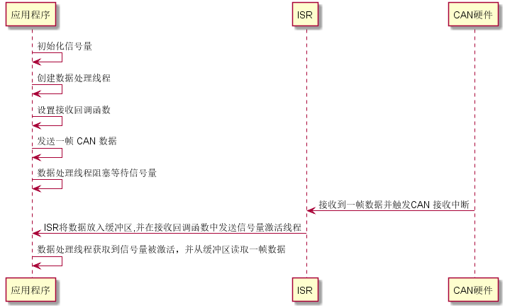

# CAN 设备

## CAN 简介

CAN 是控制器局域网络 (Controller Area Network, CAN) 的简称，是由以研发和生产汽车电子产品著称的德国 BOSCH 公司开发的，并最终成为国际标准（ISO 11898），是国际上应用最广泛的现场总线之一。

CAN 控制器根据两根线上的电位差来判断总线电平。总线电平分为显性电平和隐性电平，二者必居其一。发送方通过使总线电平发生变化，将消息发送给接收方。 CAN 的连接示意图如下图所示：


CAN 总线有如下特点：

 * CAN 总线是可同时连接多个单元的总线。可连接的单元总数理论上是没有限制的。但实际上可连接的单元数受总线上的时间延迟及电气负载的限制。降低通信速度，可连接的单元数增加；提高通信速度，则可连接的单元数减少。
 * 多主控制。在总线空闲时，所有的单元都可开始发送消息（多主控制）。多个单元同时开始发送时，发送高优先级 ID 消息的单元可获得发送权。
 * 消息的发送。在 CAN 协议中，所有的消息都以固定的格式发送。总线空闲时，所有与总线相连的单元都可以开始发送新消息。两个以上的单元同时开始发送消息时，根据标识符 ID 决定优先级。ID 表示访问总线的消息的优先级。两个以上的单元同时开始发送消息时，对各消息 ID 的每个位进行逐个仲裁比较。仲裁获胜（被判定为优先级最高）的单元可继续发送消息，仲裁失利的单元则立刻停止发送而进行接收工作。
 * 根据整个网络的规模，可设定适合的通信速度。在同一网络中，所有单元必须设定成统一的通信速度。即使有一个单元的通信速度与其它的不一样，此单元也会输出错误信号，妨碍整个网络的通信。不同网络间则可以有不同的通信速度。

 CAN 协议包括 5 种类型的帧：

 * 数据帧
 * 遥控帧
 * 错误帧
 * 过载帧
 * 帧间隔

数据帧和遥控帧有标准格式和扩展格式两种格式。标准格式有 11 个位的 ID，扩展格式有 29 个位的 ID。

各种帧的用途如下表所示：

| 帧 | 帧用途                           |
| --------------------------- | -------------------------- |
| 数据帧  |用于发送单元向接收单元传送数据的帧   |
| 遥控帧    | 用于接收单元向具有相同 ID 的发送单元请求数据的帧  |
| 错误帧   | 用于当检测出错误时向其它单元通知错误的帧 |
| 过载帧 |用于接收单元通知其尚未做好接收准备的帧 |
| 帧间隔 |用于将数据帧及遥控帧与前面的帧分离开来的帧  |

## 访问 CAN 设备

应用程序通过 RT-Thread 提供的 I/O 设备管理接口来访问 CAN 硬件控制器，相关接口如下所示：

| 函数 | 描述                           |
| --------------------------- | -------------------------- |
| rt_device_find  | 查找设备   |
| rt_device_open     | 打开设备  |
| rt_device_read  | 读取数据 |
| rt_device_write  | 写入数据 |
| rt_device_control  | 控制设备  |
| rt_device_set_rx_indicate   | 设置接收回调函数   |
| rt_device_close    | 关闭设备 |

### 查找 CAN 设备

应用程序根据 CAN 设备名称查找设备获取设备句柄，进而可以操作 CAN 设备，查找设备函数如下所示，

```c
rt_device_t rt_device_find(const char* name);
```

| 参数 | 描述                           |
| -------- | ---------------------------------- |
| name     | 设备名称                           |
| **返回** | ——                                 |
| 设备句柄 | 查找到对应设备将返回相应的设备句柄 |
| RT_NULL  | 没有找到相应的设备对象             |

一般情况下，注册到系统的 CAN 设备名称为 can1，can2 等，使用示例如下所示：

```c
#define CAN_DEV_NAME       "can1"      /* CAN 设备名称 */

static rt_device_t can_dev;            /* CAN 设备句柄 */
/* 查找 CAN 设备 */
can_dev = rt_device_find(CAN_DEV_NAME);
```

### 打开 CAN 设备

通过设备句柄，应用程序可以打开和关闭设备，打开设备时，会检测设备是否已经初始化，没有初始化则会默认调用初始化接口初始化设备。通过如下函数打开设备:

```c
rt_err_t rt_device_open(rt_device_t dev, rt_uint16_t oflags);
```

| 参数   | 描述                         |
| ---------- | ------------------------------- |
| dev        | 设备句柄                        |
| oflags     | 打开设备模式标志                     |
| **返回**   | ——                             |
| RT_EOK     | 设备打开成功                |
| -RT_EBUSY  | 如果设备注册时指定的参数中包括 RT_DEVICE_FLAG_STANDALONE 参数，此设备将不允许重复打开 |
| 其他错误码 | 设备打开失败                |

目前 RT-Thread CAN 设备驱动框架支持中断接收和中断发送模式。oflags 参数支持下列取值 (可以采用或的方式支持多种取值)：

```c
#define RT_DEVICE_FLAG_INT_RX       0x100     /* 中断接收模式 */
#define RT_DEVICE_FLAG_INT_TX       0x400     /* 中断发送模式 */
```

以中断接收及发送模式打开 CAN 设备的示例如下所示：

```c
#define CAN_DEV_NAME       "can1"      /* CAN 设备名称 */

static rt_device_t can_dev;            /* CAN 设备句柄 */
/* 查找 CAN 设备 */
can_dev = rt_device_find(CAN_DEV_NAME);
/* 以中断接收及发送模式打开 CAN 设备 */
rt_device_open(can_dev, RT_DEVICE_FLAG_INT_TX | RT_DEVICE_FLAG_INT_RX);
```

### 控制 CAN 设备

通过命令控制字，应用程序可以对 CAN 设备进行配置，通过如下函数完成：

```c
rt_err_t rt_device_control(rt_device_t dev, rt_uint8_t cmd, void* arg);
```

| 参数   | 描述                                   |
| ---------- | ------------------------------------------ |
| dev        | 设备句柄                                   |
| cmd        | 控制命令 |
| arg        | 控制参数 |
| **返回**   | ——                                         |
| RT_EOK     | 函数执行成功                               |
| 其他错误码 | 执行失败                                   |

arg（控制参数）根据命令不同而不同，cmd（控制命令）可取以下值：

```c
#define RT_DEVICE_CTRL_RESUME           0x01    /* 恢复设备 */
#define RT_DEVICE_CTRL_SUSPEND          0x02    /* 挂起设备 */
#define RT_DEVICE_CTRL_CONFIG           0x03    /* 配置设备 */

#define RT_CAN_CMD_SET_FILTER           0x13    /* 设置硬件过滤表 */
#define RT_CAN_CMD_SET_BAUD             0x14    /* 设置波特率 */
#define RT_CAN_CMD_SET_MODE             0x15    /* 设置 CAN 工作模式 */
#define RT_CAN_CMD_SET_PRIV             0x16    /* 设置发送优先级 */
#define RT_CAN_CMD_GET_STATUS           0x17    /* 获取 CAN 设备状态 */
#define RT_CAN_CMD_SET_STATUS_IND       0x18    /* 设置状态回调函数 */
#define RT_CAN_CMD_SET_BUS_HOOK         0x19    /* 设置 CAN 总线钩子函数 */
```
#### 设置波特率
设置波特率的示例代码如下所示：

```c
#define CAN_DEV_NAME       "can1"      /* CAN 设备名称 */

static rt_device_t can_dev;            /* CAN 设备句柄 */

/* 查找 CAN 设备 */
can_dev = rt_device_find(CAN_DEV_NAME);
/* 以中断接收及发送方式打开 CAN 设备 */
res = rt_device_open(can_dev, RT_DEVICE_FLAG_INT_TX | RT_DEVICE_FLAG_INT_RX);
/* 设置 CAN 通信的波特率为 500kbit/s*/
res = rt_device_control(can_dev, RT_CAN_CMD_SET_BAUD, (void *)CAN500kBaud);

```

#### 设置工作模式

设置工作模式的示例代码如下所示：
```c
#define CAN_DEV_NAME       "can1"      /* CAN 设备名称 */

static rt_device_t can_dev;            /* CAN 设备句柄 */

/* 查找 CAN 设备 */
can_dev = rt_device_find(CAN_DEV_NAME);
/* 以中断接收及发送方式打开 CAN 设备 */
res = rt_device_open(can_dev, RT_DEVICE_FLAG_INT_TX | RT_DEVICE_FLAG_INT_RX);
/* 设置 CAN 的工作模式为正常工作模式 */
res = rt_device_control(can_dev, RT_CAN_CMD_SET_MODE, (void *)RT_CAN_MODE_NORMAL);
```
#### 获取 CAN 设备状态

获取 CAN 设备状态的示例代码如下所示：
```c
#define CAN_DEV_NAME       "can1"      /* CAN 设备名称 */

static rt_device_t can_dev;            /* CAN 设备句柄 */
static struct rt_can_status status;    /* 获取到的 CAN 总线状态 */

/* 查找 CAN 设备 */
can_dev = rt_device_find(CAN_DEV_NAME);
/* 以中断接收及发送方式打开 CAN 设备 */
res = rt_device_open(can_dev, RT_DEVICE_FLAG_INT_TX | RT_DEVICE_FLAG_INT_RX);
/* 获取 CAN 总线设备的状态 */
res = rt_device_control(can_dev, RT_CAN_CMD_GET_STATUS, &status);
```

#### 设置硬件过滤表

过滤表控制块各成员描述如下所示：
```c
struct rt_can_filter_item
{
    rt_uint32_t id  : 29;   /* 报文 ID */
    rt_uint32_t ide : 1;    /* 扩展帧标识位 */
    rt_uint32_t rtr : 1;    /* 远程帧标识位 */
    rt_uint32_t mode : 1;   /* 过滤表模式 */
    rt_uint32_t mask;       /* ID 掩码，0 表示对应的位不关心，1 表示对应的位必须匹配 */
    rt_int32_t hdr;         /* -1 表示不指定过滤表号，对应的过滤表控制块也不会被初始化，正数为过滤表号，对应的过滤表控制块会被初始化 */
#ifdef RT_CAN_USING_HDR
    /* 过滤表回调函数 */
    rt_err_t (*ind)(rt_device_t dev, void *args , rt_int32_t hdr, rt_size_t size);
    /* 回调函数参数 */
    void *args;
#endif /*RT_CAN_USING_HDR*/
};
```

如果需要过滤的报文 ID 为 0x01 的标准数据帧，使用默认过滤表，则过滤表各个成员设置如下：
```c
struct rt_can_filter_item filter;
/* 报文 ID */
filter.id = 0x01;
/* 标准格式 */
filter.ide = 0x00;
/* 数据帧 */
filter.rtr = 0x00;
/* 过滤表模式 */
filter.mode = 0x01;
/* 匹配 ID */
filter.mask = 0x01;
/* 使用默认过滤表 */
filter.hdr = -1;
```

为了方便表示过滤表的各个成员变量的值， RT-Thread 系统提供了匹配过滤表的宏

```c
#define RT_CAN_FILTER_ITEM_INIT(id,ide,rtr,mode,mask,ind,args) \
     {(id), (ide), (rtr), (mode), (mask), -1, (ind), (args)}
```
过滤表宏中各个位分别和过滤表结构体成员变量一一对应，只是使用的过滤表是默认的过滤表。

则上述过滤信息使用过滤表的宏可以表示为

```c
RT_CAN_FILTER_ITEM_INIT(0x01, 0, 0, 1, 0x01, RT_NULL, RT_NULL);
```

当需要使用过滤表时还需要指定过滤表配置控制块的成员变量，过滤表的配置控制块成员变量的组成如下所示：

```c
struct rt_can_filter_config
{
    rt_uint32_t count;                  /* 过滤表数量 */
    rt_uint32_t actived;                /* 过滤表激活选项，1 表示初始化过滤表控制块，0 表示去初始化过滤表控制块 */
    struct rt_can_filter_item *items;   /* 过滤表指针，可指向一个过滤表数组 */
};
```

设置硬件过滤表示例代码如下所示：

```c
#define CAN_DEV_NAME       "can1"      /* CAN 设备名称 */

static rt_device_t can_dev;            /* CAN 设备句柄 */

can_dev = rt_device_find(CAN_DEV_NAME);

/* 以中断接收及发送模式打开 CAN 设备 */
rt_device_open(can_dev, RT_DEVICE_FLAG_INT_TX | RT_DEVICE_FLAG_INT_RX);

struct rt_can_filter_item items[1] =
{
    RT_CAN_FILTER_ITEM_INIT(0x01, 0, 0, 1, 0x01, RT_NULL, RT_NULL),
    /* 过滤 ID 为 0x01,match ID:0x100~0x1ff，hdr 为 - 1，设置默认过滤表 */
};
struct rt_can_filter_config cfg = {1, 1, items}; /* 一共有 1 个过滤表 */
/* 设置硬件过滤表 */
res = rt_device_control(can_dev, RT_CAN_CMD_SET_FILTER, &cfg);
```


### 发送数据

使用 CAN 设备发送数据，可以通过如下函数完成：

```c
rt_size_t rt_device_write(rt_device_t dev, rt_off_t pos, const void* buffer, rt_size_t size);
```

| 参数   | 描述                                   |
| ---------- | ------------------------------------------ |
| dev                | 设备句柄                               |
| pos                | 写入数据偏移量，此参数 CAN 设备未使用          |
| buffer             | CAN 消息指针      |
| size               | CAN 消息大小                         |
| **返回**           | ——                                     |
| 不为 0               | 实际发送的 CAN 消息大小 |
| 0                  | 发送失败  |

CAN 消息原型如下所示：

```c
struct rt_can_msg
{
    rt_uint32_t id  : 29;   /* CAN ID, 标志格式 11 位，扩展格式 29 位 */
    rt_uint32_t ide : 1;    /* 扩展帧标识位 */
    rt_uint32_t rtr : 1;    /* 远程帧标识位 */
    rt_uint32_t rsv : 1;    /* 保留位 */
    rt_uint32_t len : 8;    /* 数据段长度 */
    rt_uint32_t priv : 8;   /* 报文发送优先级 */
    rt_uint32_t hdr : 8;    /* 硬件过滤表号 */
    rt_uint32_t reserved : 8;
    rt_uint8_t data[8];     /* 数据段 */
};
```

使用 CAN 设备发送数据示例程序如下所示：

```c
#define CAN_DEV_NAME       "can1"      /* CAN 设备名称 */

static rt_device_t can_dev;            /* CAN 设备句柄 */
struct rt_can_msg msg = {0};           /* CAN 消息 */

can_dev = rt_device_find(CAN_DEV_NAME);

/* 以中断接收及发送模式打开 CAN 设备 */
rt_device_open(can_dev, RT_DEVICE_FLAG_INT_TX | RT_DEVICE_FLAG_INT_RX);

msg.id = 0x78;              /* ID 为 0x78 */
msg.ide = RT_CAN_STDID;     /* 标准格式 */
msg.rtr = RT_CAN_DTR;       /* 数据帧 */
msg.len = 8;                /* 数据长度为 8 */
/* 待发送的 8 字节数据 */
msg.data[0] = 0x00;
msg.data[1] = 0x11;
msg.data[2] = 0x22;
msg.data[3] = 0x33;
msg.data[4] = 0x44;
msg.data[5] = 0x55;
msg.data[6] = 0x66;
msg.data[7] = 0x77;
/* 发送一帧 CAN 数据 */
size = rt_device_write(can_dev, 0, &msg, sizeof(msg));
```

### 设置接收回调函数

可以通过如下函数来设置数据接收指示，当 CAN 收到数据时，通知上层应用线程有数据到达 ：

```c
rt_err_t rt_device_set_rx_indicate(rt_device_t dev, rt_err_t (*rx_ind)(rt_device_t dev,rt_size_t size));
```

| 参数 | 描述     |
| -------- | ------------ |
| dev      | 设备句柄     |
| rx_ind   | 回调函数指针 |
| dev      | 设备句柄（回调函数参数）|
| size     | 缓冲区数据大小（回调函数参数）|
| **返回** | ——           |
| RT_EOK   | 设置成功     |

该函数的回调函数由调用者提供。CAN 设备在中断接收模式下，当 CAN 接收到一帧数据产生中断时，就会调用回调函数，并且会把此时缓冲区的数据大小放在 size 参数里，把 CAN 设备句柄放在 dev 参数里供调用者获取。

一般情况下接收回调函数可以发送一个信号量或者事件通知 CAN 数据处理线程有数据到达。使用示例如下所示：

```c
#define CAN_DEV_NAME       "can1"      /* CAN 设备名称 */
static rt_device_t can_dev;            /* CAN 设备句柄 */
struct rt_can_msg msg = {0};           /* CAN 消息 */

/* 接收数据回调函数 */
static rt_err_t can_rx_call(rt_device_t dev, rt_size_t size)
{
    /* CAN 接收到数据后产生中断，调用此回调函数，然后发送接收信号量 */
    rt_sem_release(&rx_sem);

    return RT_EOK;
}

/* 设置接收回调函数 */
rt_device_set_rx_indicate(can_dev, can_rx_call);
```

### 接收数据

可调用如下函数读取 CAN 设备接收到的数据：

```c
rt_size_t rt_device_read(rt_device_t dev, rt_off_t pos, void* buffer, rt_size_t size);
```

| 参数           | 描述                                       |
| ------------------ | ---------------------------------------------- |
| dev                | 设备句柄                                       |
| pos                | 读取数据偏移量，此参数 CAN 设备未使用                 |
| buffer             | CAN 消息指针，读取的数据将会被保存在缓冲区中 |
| size               | CAN 消息大小                                 |
| **返回**           | ——                                             |
| 不为 0               | CAN 消息大小           |
| 0                  | 失败  |

> [!NOTE]
> 注：接收数据时 CAN 消息的 hdr 参数必须要指定值，默认指定为 -1 就可以，表示从接收数据的 uselist 链表读取数据。也可以指定为硬件过滤表号的值，表示此次读取数据从哪一个硬件过滤表对应的消息链接读取数据，此时需要设置硬件过滤表的时候 hdr 有指定正确的过滤表号。如果设置硬件过滤表的时候 hdr 都为 -1，则读取数据的时候也要赋值为-1。

CAN 使用中断接收模式并配合接收回调函数的使用示例如下所示：

```c
#define CAN_DEV_NAME       "can1"      /* CAN 设备名称 */

static rt_device_t can_dev;            /* CAN 设备句柄 */
struct rt_can_msg rxmsg = {0};         /* CAN 接收消息缓冲区 */

/* hdr 值为 - 1，表示直接从 uselist 链表读取数据 */
rxmsg.hdr = -1;

/* 阻塞等待接收信号量 */
rt_sem_take(&rx_sem, RT_WAITING_FOREVER);
/* 从 CAN 读取一帧数据 */
rt_device_read(can_dev, 0, &rxmsg, sizeof(rxmsg));
```

### 关闭 CAN 设备

当应用程序完成 CAN 操作后，可以关闭 CAN 设备，通过如下函数完成:

```c
rt_err_t rt_device_close(rt_device_t dev);
```

| 参数   | 描述                           |
| ---------- | ---------------------------------- |
| dev        | 设备句柄                           |
| **返回**   | ——                                 |
| RT_EOK     | 关闭设备成功                       |
| -RT_ERROR  | 设备已经完全关闭，不能重复关闭设备 |
| 其他错误码 | 关闭设备失败                       |

关闭设备接口和打开设备接口需配对使用，打开一次设备对应要关闭一次设备，这样设备才会被完全关闭，否则设备仍处于未关闭状态。

## CAN 设备使用示例

示例代码的主要步骤如下所示：

1. 首先查找 CAN 设备获取设备句柄。

2. 初始化信号量，然后以中断接收及中断发送方式打开 CAN 设备。

3. 创建读取数据线程。

4. 发送一帧 CAN 数据。

* 读取数据线程首先会设置接收回调函数，然后设置硬件过滤表，之后会等待信号量。当 CAN 设备接收到一帧数据时会触发中断并调用接收回调函数，此函数会发送信号量唤醒线程，此时线程会马上读取接收到的数据。

* 此示例代码不局限于特定的 BSP，根据 BSP 注册的 CAN 设备，修改示例代码宏定义 CAN_DEV_NAME 对应的 CAN 设备名称即可运行。

运行序列图如下图所示：



程序运行起来后在命令行输入 `can_sample` 即可运行示例代码，后面数据为 CAN 设备接收到的数据：

```c
 \ | /
- RT -     Thread Operating System
 / | \     4.0.1 build Jun 24 2019
 2006 - 2019 Copyright by rt-thread team
msh >can_sample
ID:486   0 11 22 33  0 23  4 86
ID:111   0 11 22 33  0 23  1 11
ID:555   0 11 22 33  0 23  5 55
ID:211   0 11 22 33  0 23  2 11
ID:344   0 11 22 33  0 23  3 44
```

可以使用 CAN 分析工具连接对应 CAN 设备收发数据，第一帧数据为 CAN 示例代码发送的 ID 为 0X78的数据， 效果如下图所示：


```c
/*
 * 程序清单：这是一个 CAN 设备使用例程
 * 例程导出了 can_sample 命令到控制终端
 * 命令调用格式：can_sample can1
 * 命令解释：命令第二个参数是要使用的 CAN 设备名称，为空则使用默认的 CAN 设备
 * 程序功能：通过 CAN 设备发送一帧，并创建一个线程接收数据然后打印输出。
*/

#include <rtthread.h>
#include "rtdevice.h"

#define CAN_DEV_NAME       "can1"      /* CAN 设备名称 */

static struct rt_semaphore rx_sem;     /* 用于接收消息的信号量 */
static rt_device_t can_dev;            /* CAN 设备句柄 */

/* 接收数据回调函数 */
static rt_err_t can_rx_call(rt_device_t dev, rt_size_t size)
{
    /* CAN 接收到数据后产生中断，调用此回调函数，然后发送接收信号量 */
    rt_sem_release(&rx_sem);

    return RT_EOK;
}

static void can_rx_thread(void *parameter)
{
    int i;
    rt_err_t res;
    struct rt_can_msg rxmsg = {0};

    /* 设置接收回调函数 */
    rt_device_set_rx_indicate(can_dev, can_rx_call);

#ifdef RT_CAN_USING_HDR
    struct rt_can_filter_item items[5] =
    {
        RT_CAN_FILTER_ITEM_INIT(0x100, 0, 0, 0, 0x700, RT_NULL, RT_NULL), /* std,match ID:0x100~0x1ff，hdr 为 - 1，设置默认过滤表 */
        RT_CAN_FILTER_ITEM_INIT(0x300, 0, 0, 0, 0x700, RT_NULL, RT_NULL), /* std,match ID:0x300~0x3ff，hdr 为 - 1 */
        RT_CAN_FILTER_ITEM_INIT(0x211, 0, 0, 0, 0x7ff, RT_NULL, RT_NULL), /* std,match ID:0x211，hdr 为 - 1 */
        RT_CAN_FILTER_STD_INIT(0x486, RT_NULL, RT_NULL),                  /* std,match ID:0x486，hdr 为 - 1 */
        {0x555, 0, 0, 0, 0x7ff, 7,}                                       /* std,match ID:0x555，hdr 为 7，指定设置 7 号过滤表 */
    };
    struct rt_can_filter_config cfg = {5, 1, items}; /* 一共有 5 个过滤表 */
    /* 设置硬件过滤表 */
    res = rt_device_control(can_dev, RT_CAN_CMD_SET_FILTER, &cfg);
    RT_ASSERT(res == RT_EOK);
#endif

    while (1)
    {
        /* hdr 值为 - 1，表示直接从 uselist 链表读取数据 */
        rxmsg.hdr = -1;
        /* 阻塞等待接收信号量 */
        rt_sem_take(&rx_sem, RT_WAITING_FOREVER);
        /* 从 CAN 读取一帧数据 */
        rt_device_read(can_dev, 0, &rxmsg, sizeof(rxmsg));
        /* 打印数据 ID 及内容 */
        rt_kprintf("ID:%x", rxmsg.id);
        for (i = 0; i < 8; i++)
        {
            rt_kprintf("%2x", rxmsg.data[i]);
        }

        rt_kprintf("\n");
    }
}

int can_sample(int argc, char *argv[])
{
    struct rt_can_msg msg = {0};
    rt_err_t res;
    rt_size_t  size;
    rt_thread_t thread;
    char can_name[RT_NAME_MAX];

    if (argc == 2)
    {
        rt_strncpy(can_name, argv[1], RT_NAME_MAX);
    }
    else
    {
        rt_strncpy(can_name, CAN_DEV_NAME, RT_NAME_MAX);
    }
    /* 查找 CAN 设备 */
    can_dev = rt_device_find(can_name);
    if (!can_dev)
    {
        rt_kprintf("find %s failed!\n", can_name);
        return RT_ERROR;
    }

    /* 初始化 CAN 接收信号量 */
    rt_sem_init(&rx_sem, "rx_sem", 0, RT_IPC_FLAG_FIFO);

    /* 以中断接收及发送方式打开 CAN 设备 */
    res = rt_device_open(can_dev, RT_DEVICE_FLAG_INT_TX | RT_DEVICE_FLAG_INT_RX);
    RT_ASSERT(res == RT_EOK);
    /* 创建数据接收线程 */
    thread = rt_thread_create("can_rx", can_rx_thread, RT_NULL, 1024, 25, 10);
    if (thread != RT_NULL)
    {
        rt_thread_startup(thread);
    }
    else
    {
        rt_kprintf("create can_rx thread failed!\n");
    }

    msg.id = 0x78;              /* ID 为 0x78 */
    msg.ide = RT_CAN_STDID;     /* 标准格式 */
    msg.rtr = RT_CAN_DTR;       /* 数据帧 */
    msg.len = 8;                /* 数据长度为 8 */
    /* 待发送的 8 字节数据 */
    msg.data[0] = 0x00;
    msg.data[1] = 0x11;
    msg.data[2] = 0x22;
    msg.data[3] = 0x33;
    msg.data[4] = 0x44;
    msg.data[5] = 0x55;
    msg.data[6] = 0x66;
    msg.data[7] = 0x77;
    /* 发送一帧 CAN 数据 */
    size = rt_device_write(can_dev, 0, &msg, sizeof(msg));
    if (size == 0)
    {
        rt_kprintf("can dev write data failed!\n");
    }

    return res;
}
/* 导出到 msh 命令列表中 */
MSH_CMD_EXPORT(can_sample, can device sample);
```

