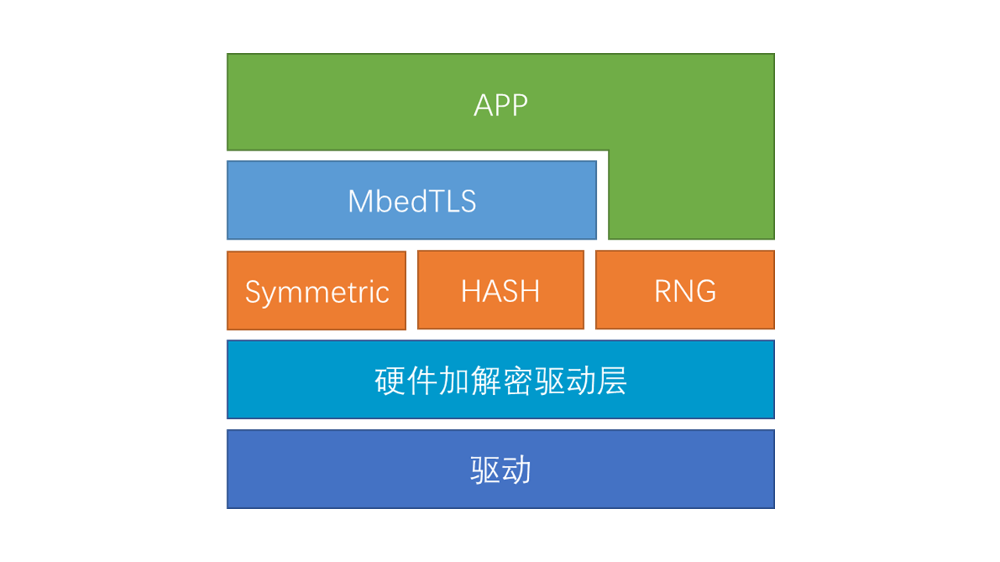

# CRYPTO 设备

加解密(Encryption/Decryption)是一种文件、消息加密、解密技术。这种技术随着物联网快速发展，用户的正常工作中对数据的加解密需求有着强烈的需求。

为保证物联网设备的信息安全，软件层面引入了 TLS 安全传输层协议，同时硬件芯片上也逐渐添加安全相关的加解密模块，甚至出现了专为安全设计的安全芯片。芯片上的硬件安全模块相比纯软件实现的安全算法，拥有更快的运算速度，更小的资源占用。但大多数物联网设备上仍在使用纯软件的安全算法。其中最重要的一个原因，就是硬件接口不一，种类繁杂，软件对接起来比较困难。

因此 RT-Thread 推出了 hwcrypto 硬件加解密驱动框架，并对接了常见的安全传输套件。只要硬件支持加解密模块，就能直接使用基于硬件加解密的安全传输套件，传输速度提升数倍。

## CRYPTO 简介

### 框架简介

hwcrypto 是一个硬件加解密设备驱动框架。主要由硬件加解密驱动抽象层以及各种加解密 API 接口两部分构成。对于上层应用，可对接安全套件或直接使用，使用方式十分灵活。对于驱动，需要对接的接口少，功能单一，驱动开发简单快捷。下图是 Crypto 框架层次图:



主要**特性**如下：

- **设计轻薄，运行高效**

硬件加解密驱动的最重要的一个功能就是接口转换，实现接口统一，方便上层应用使用硬件加解密。所以它被设计的十分轻薄。有着极低资源占用，ROM < 0.8K / RAM < 0.2K。

加解密在运行速度上，也有着很高的要求。所以频繁调用的代码，细致考虑，把运行过程的步骤降到最少，让性能损失降到最小，如同直接操作硬件寄存器一般迅速。

- **考虑周全，使用简单**

在 API 设计上，从简单易用，功能齐全两个维度出发。首先是用户直接使用硬件加解密API，要求上手简单, 使用容易。为此前期针对众多软件接口进行了评估。亲身使用测试，最终定义出一套功能齐全，接口简单的 API。

满足用户的使用需求的同时，在安全传输套件的对接上，也做了许多考虑。专门为安全传输套件增加了API。最终这套API用户使用或是对接安全传输套件，都能游刃有余。

- **完全兼容，通用性强**

驱动对接的接口设计上，也精心设计。前期对多家硬件厂商的加解密外设根据功能进行分类，进行分析整理，提取出一套功能单一，参数全面的驱动接口。该驱动接口可完全适配常规 MCU 加解密外设。现目前已在多个平台上做验证，例如联盛德 W60X 系列，STM32 系列等。

### 功能简介

硬件加解密框架目前已经支持 AES/DES/3DES/RC4/SHA1/SHA2/MD5/CRC/RNG/BIGNUM 等加解密相关的接口。

将上述加解密算法按照不同的类型分成如下几个大类，每一类都有丰富的 API 可供使用。目前已经支持的类型如下：

- hash: 散列算法
- symmetric: 对称加解密算法
- gcm:  GMAC 消息认证码
- crc: CRC 冗余校验
- rng: 随机数发生器
- bignum: 大数运算

## hash 算法

hash 算法是把任意长度的输入通过散列算法变换成固定长度的输出，是一种将任意长度的消息压缩到某一固定长度的消息摘要的函数。散列值的空间通常远小于输入的空间，不同的输入可能会散列成相同的输出，所以不可能从散列值来确定唯一的输入值。

### 访问 hash 算法设备

应用程序通过 RT-Thread 提供的 hash 算法设备管理接口来访问 hash 算法设备硬件，相关接口如下所示：

| 函数                        | 描述               |
|-----------------------------|--------------------|
| rt_hwcrypto_hash_create()   | 创建 hash 上下文   |
| rt_hwcrypto_hash_destroy()  | 释放上下文         |
| rt_hwcrypto_hash_finish()   | 计算最终 hash 值   |
| rt_hwcrypto_hash_update()   | 处理一包数据       |
| rt_hwcrypto_hash_cpy()      | 复制上下文         |
| rt_hwcrypto_hash_reset()    | 重置上下文         |
| rt_hwcrypto_hash_set_type() | 设置 hash 算法类型 |

### 创建 hash 上下文

应用程序根据 hash 设备的句柄，创建 hash 上下文，如下所示：

```c
struct rt_hwcrypto_ctx *rt_hwcrypto_hash_create(struct rt_hwcrypto_device *device,
                                                hwcrypto_type type);
```

| **参数** | **描述**       |
|----------|----------------|
| device   | 加解密设备句柄 |
| type     | hash 算法类型  |
| **返回** | ——             |
| NULL     | 失败           |
| 其他     | 设备对象       |

hash 算法常用类型及子类型如下

```c
    /* HASH Type */
    HWCRYPTO_TYPE_MD5     = ((__LINE__ - HWCRYPTO_TYPE_HEAD) & 0xffff) << 16,  /**< MD5 */
    HWCRYPTO_TYPE_SHA1    = ((__LINE__ - HWCRYPTO_TYPE_HEAD) & 0xffff) << 16,  /**< SHA1 */
    HWCRYPTO_TYPE_SHA2    = ((__LINE__ - HWCRYPTO_TYPE_HEAD) & 0xffff) << 16,  /**< SHA2 */

    /* SHA2 Subtype */
    HWCRYPTO_TYPE_SHA224 = HWCRYPTO_TYPE_SHA2 | (0x01 << 8),
    HWCRYPTO_TYPE_SHA256 = HWCRYPTO_TYPE_SHA2 | (0x02 << 8),
    HWCRYPTO_TYPE_SHA384 = HWCRYPTO_TYPE_SHA2 | (0x03 << 8),
    HWCRYPTO_TYPE_SHA512 = HWCRYPTO_TYPE_SHA2 | (0x04 << 8),

```

如果创建 MD5 类型的 hash 算法，使用示例如下

```c
    struct rt_hwcrypto_ctx *ctx;

    ctx = rt_hwcrypto_hash_create(rt_hwcrypto_dev_default(), HWCRYPTO_TYPE_MD5);
```

- rt_hwcrypto_dev_default()函数原型为 `struct rt_hwcrypto_device *rt_hwcrypto_dev_default(void)`，返回默认的硬件加解密设备句柄。

### 释放上下文

应用程序根据 hash 的上下文，删除该上下文，并且释放资源，如下所示：

```c
void rt_hwcrypto_hash_destroy(struct rt_hwcrypto_ctx *ctx);
```

| **参数** | **描述** |
|----------|----------|
| ctx      | 上下文   |
| **返回** | ——       |

### 计算最终 hash 值

应用程序根据 hash 的上下文，可以输出最后的 hash 值，如下所示：

```c
rt_err_t rt_hwcrypto_hash_finish(struct rt_hwcrypto_ctx *ctx, rt_uint8_t *output, rt_size_t length);
```

| **参数** | **描述** |
|----------|----------|
| ctx      | 上下文   |
| output   | 输出数据 |
| length   | 数据长度 |
| **返回** | ——       |
| RT_EOK   | 计算成功 |
| 其他     | 失败     |

### 计算一包数据

应用程序根据 hash 的上下文，输入一包数据，计算 hash 值，如下所示：

```c
rt_err_t rt_hwcrypto_hash_update(struct rt_hwcrypto_ctx *ctx, const rt_uint8_t *input, rt_size_t length);
```

| **参数** | **描述**     |
|----------|--------------|
| ctx      | 上下文       |
| input    | 输入数据     |
| length   | 输入数据长度 |
| **返回** | ——           |
| RT_EOK   | 计算成功     |
| 其他     | 失败         |

使用实例如下：

```c
int main(void)
{
    rt_uint8_t buf_in[32];
    int i;
    struct rt_hwcrypto_ctx *ctx;

    /* 填充测试数据 */
    for (i = 0; i < sizeof(buf_in); i++)
    {
        buf_in[i] = (rt_uint8_t)i;
    }
    /* 创建一个 SHA1/MD5 类型的上下文 */
    ctx = rt_hwcrypto_hash_create(rt_hwcrypto_dev_default(), type);

    /* 将输入数据进行 hash 运算 */
    rt_hwcrypto_hash_update(ctx, in, 32);
    /* 获得运算结果 */
    rt_hwcrypto_hash_finish(ctx, out, 32);
    /* 删除上下文，释放资源 */
    rt_hwcrypto_hash_destroy(ctx);
}
```

### 复制上下文

应用程序根据源 hash 的上下文，复制到目标 hash 的上下文中，如下所示：

```c
rt_err_t rt_hwcrypto_hash_cpy(struct rt_hwcrypto_ctx *des, const struct rt_hwcrypto_ctx *src);
```

| **参数** | **描述**   |
|----------|------------|
| des      | 目标上下文 |
| src      | 源上下文   |
| **返回** | ——         |
| RT_EOK   | 计算成功   |
| 其他     | 失败       |

### 重置上下文

应用程序根据 hash 的上下文，重置 hash 上下文文本，如下所示：

```c
void rt_hwcrypto_hash_reset(struct rt_hwcrypto_ctx *ctx);
```

| **参数** | **描述** |
|----------|----------|
| ctx      | 上下文   |
| **返回** | ——       |

- 没有释放上下文之前，只有重置后才可以计算下一包数据

### 设置 hash 算法类型

应用程序根据 hash 的上下文，设置 hash 算法类型，如下所示：

```c
rt_err_t rt_hwcrypto_hash_set_type(struct rt_hwcrypto_ctx *ctx, hwcrypto_type type);
```

| **参数** | **描述**      |
|----------|---------------|
| ctx      | 上下文        |
| type     | hash 算法类型 |
| **返回** | ——            |
| RT_EOK   | 计算成功      |
| 其他     | 失败          |

- 常用 hash 算法类型，参考创建 hash 上下文中类型介绍
- 设置类型仅在数据运算之前有效，运算中途更改类型，将导致运算结果错误

## 对称加解密算法

对称加解密指加密和解密使用相同密钥的加密算法，所以也称这种加密算法为秘密密钥算法或单密钥算法。对称算法的安全性依赖于密钥，泄漏密钥就意味着任何人都可以对他们发送或接收的消息解密，所以密钥的保密性对通信的安全性至关重要。

### 访问对称加解密设备

应用程序通过 RT-Thread 提供的 symmetric 设备管理接口来访问 symmetric 算法设备硬件，相关接口如下所示：

| 函数                              | 描述                           |
|-----------------------------------|--------------------------------|
| rt_hwcrypto_symmetric_create()    | 创建对称加解密上下文           |
| rt_hwcrypto_symmetric_destroy()   | 释放上下文                     |
| rt_hwcrypto_symmetric_crypt()     | 加解密操作                     |
| rt_hwcrypto_symmetric_setkey()    | 设置加解密密钥                 |
| rt_hwcrypto_symmetric_getkey()    | 获取加解密密钥                 |
| rt_hwcrypto_symmetric_setiv()     | 设置对称加解密初始化向量       |
| rt_hwcrypto_symmetric_getiv()     | 获取对称加解密初始化向量       |
| rt_hwcrypto_symmetric_set_ivoff() | 设置对称加解密初始化向量偏移值 |
| rt_hwcrypto_symmetric_get_ivoff() | 获取对称加解密初始化向量偏移值 |
| rt_hwcrypto_symmetric_cpy()       | 复制上下文                     |
| rt_hwcrypto_symmetric_reset()     | 重置上下文                     |
| rt_hwcrypto_symmetric_set_type()  | 设置加解密类型                 |

### 创建对称加解密上下文

应用程序根据对称加解密设备的句柄，创建对称加解密上下文，如下所示：

```c
struct rt_hwcrypto_ctx *rt_hwcrypto_symmetric_create(struct rt_hwcrypto_device *device, hwcrypto_type type);
```

| **参数** | **描述**           |
|----------|--------------------|
| device   | 加解密设备句柄     |
| type     | 对称加解密算法类型 |
| **返回** | ——                 |
| NULL     | 失败               |
| 其他     | 设备对象           |

对称加解密算法常用类型及子类型如下

```c
    /* symmetric Type */
    HWCRYPTO_TYPE_AES     = ((__LINE__ - HWCRYPTO_TYPE_HEAD) & 0xffff) << 16,  /**< AES */
    HWCRYPTO_TYPE_DES     = ((__LINE__ - HWCRYPTO_TYPE_HEAD) & 0xffff) << 16,  /**< DES */
    HWCRYPTO_TYPE_3DES    = ((__LINE__ - HWCRYPTO_TYPE_HEAD) & 0xffff) << 16,  /**< 3DES */
    HWCRYPTO_TYPE_RC4     = ((__LINE__ - HWCRYPTO_TYPE_HEAD) & 0xffff) << 16,  /**< RC4 */
    HWCRYPTO_TYPE_GCM     = ((__LINE__ - HWCRYPTO_TYPE_HEAD) & 0xffff) << 16,  /**< GCM */

    /* AES Subtype */
    HWCRYPTO_TYPE_AES_ECB = HWCRYPTO_TYPE_AES | (0x01 << 8),
    HWCRYPTO_TYPE_AES_CBC = HWCRYPTO_TYPE_AES | (0x02 << 8),
    HWCRYPTO_TYPE_AES_CFB = HWCRYPTO_TYPE_AES | (0x03 << 8),
    HWCRYPTO_TYPE_AES_CTR = HWCRYPTO_TYPE_AES | (0x04 << 8),
    HWCRYPTO_TYPE_AES_OFB = HWCRYPTO_TYPE_AES | (0x05 << 8),

    /* DES Subtype */
    HWCRYPTO_TYPE_DES_ECB = HWCRYPTO_TYPE_DES | (0x01 << 8),
    HWCRYPTO_TYPE_DES_CBC = HWCRYPTO_TYPE_DES | (0x02 << 8),

    /* 3DES Subtype */
    HWCRYPTO_TYPE_3DES_ECB = HWCRYPTO_TYPE_3DES | (0x01 << 8),
    HWCRYPTO_TYPE_3DES_CBC = HWCRYPTO_TYPE_3DES | (0x02 << 8),
```

创建 AES-CBC 加密，如下所示

```c
    struct rt_hwcrypto_ctx *ctx;

    ctx = rt_hwcrypto_symmetric_create(rt_hwcrypto_dev_default(), HWCRYPTO_TYPE_AES_CBC);
```

### 释放上下文

应用程序根据对称加解密的上下文，删除该上下文，并且释放资源，如下所示：

```c
void rt_hwcrypto_symmetric_destroy(struct rt_hwcrypto_ctx *ctx);
```

| **参数** | **描述**   |
|----------|------------|
| ctx      | 上下文句柄 |
| **返回** | ——         |

### 加解密数据

应用程序根据对称加解密的上下文、加解密模式、输入数据及长度，可以输出最后计算后的值，如下所示：

```c
rt_err_t rt_hwcrypto_symmetric_crypt(struct rt_hwcrypto_ctx *ctx, hwcrypto_mode mode, rt_size_t length, const rt_uint8_t *in, rt_uint8_t *out);

```

| **参数** | **描述**     |
|----------|--------------|
| ctx      | 上下文句柄   |
| mode     | 加密或者解密 |
| length   | 数据长度     |
| in       | 输入数据     |
| out      | 输出数据     |
| **返回** | ——           |
| RT_EOK   | 计算成功     |
| 其他     | 失败         |

加密或者解密模式如下

```c
typedef enum
{
    HWCRYPTO_MODE_ENCRYPT = 0x1,        /**< Encryption operations */
    HWCRYPTO_MODE_DECRYPT = 0x2,        /**< Decryption operations */
    HWCRYPTO_MODE_UNKNOWN = 0x7fffffff, /**< Unknown */
} hwcrypto_mode;
```

### 设置加解密密钥

应用程序根据对称加解密的上下文、密钥与密钥及长度，设置加解密密钥，如下所示：

```c
rt_err_t rt_hwcrypto_symmetric_setkey(struct rt_hwcrypto_ctx *ctx, const rt_uint8_t *key, rt_uint32_t bitlen);
```

| **参数** | **描述**     |
|----------|--------------|
| ctx      | 上下文句柄   |
| key      | 输入密钥     |
| bitlen   | 密钥长度     |
| **返回** | ——           |
| RT_EOK   | 设置密钥成功 |
| 其他     | 失败         |

### 获取密钥

应用程序根据对称加解密的上下文、密钥、长度，获取密钥长度，如下所示：

```c
int rt_hwcrypto_symmetric_getkey(struct rt_hwcrypto_ctx *ctx, rt_uint8_t *key, rt_uint32_t bitlen);
```

| **参数** | **描述**     |
|----------|--------------|
| ctx      | 目标上下文   |
| key      | 密钥         |
| bitlen   | 密钥长度     |
| **返回** | ——           |
| int      | 复制密钥长度 |
| 其他     | 失败         |

### 设置对称加解密初始化向量

应用程序根据对称加解密的上下文、初始化向量与向量长度，设置对称加解密初始化向量，如下所示：

```c
rt_err_t rt_hwcrypto_symmetric_setiv(struct rt_hwcrypto_ctx *ctx, const rt_uint8_t *iv, rt_size_t len);
```

| **参数** | **描述**         |
|----------|------------------|
| ctx      | 上下文           |
| iv       | 初始化向量       |
| len      | 初始化向量的长度 |
| **返回** | ——               |
| RT_EOK   | 设置成功         |
| 其他     | 失败             |

### 获取对称加解密初始化向量

应用程序根据对称加解密的上下文，获取对称加解密初始化向量，如下所示：

```c
int rt_hwcrypto_symmetric_getiv(struct rt_hwcrypto_ctx *ctx, rt_uint8_t *iv, rt_size_t len);
```

| **参数** | **描述**         |
|----------|------------------|
| ctx      | 上下文           |
| iv       | 将获取初始化向量 |
| len      | 初始化向量的长度 |
| **返回** | ——               |
| int      | 获取成功的长度   |
| 其他     | 失败             |

### 设置对称加解密初始化向量偏移

应用程序根据对称加解密的上下文、初始化向量偏移值，设置对称加解密初始化向量的偏移值，如下所示：

```c
void rt_hwcrypto_symmetric_set_ivoff(struct rt_hwcrypto_ctx *ctx, rt_int32_t iv_off);
```

| **参数** | **描述**           |
|----------|--------------------|
| ctx      | 上下文             |
| iv_off   | 初始化向量的偏移值 |
| **返回** | ——                 |

### 获取对称加解密初始化向量偏移值

应用程序根据对称加解密的上下文，获取对称加解密初始化向量的偏移值，如下所示：

```c
void rt_hwcrypto_symmetric_get_ivoff(struct rt_hwcrypto_ctx *ctx, rt_int32_t *iv_off);
```

| **参数** | **描述**             |
|----------|----------------------|
| ctx      | 上下文               |
| iv_off   | 初始化向量的偏移指针 |
| **返回** | ——                   |

### 复制对称加解密上下文

应用程序根据源对称加解密的上下文，复制到目的上下文中，如下所示：

```c
rt_err_t rt_hwcrypto_symmetric_cpy(struct rt_hwcrypto_ctx *des, const struct rt_hwcrypto_ctx *src);
```

| **参数** | **描述**   |
|----------|------------|
| des      | 目标上下文 |
| src      | 源上下文   |
| **返回** | ——         |
| RT_EOK   | 设置成功   |
| 其他     | 失败       |

### 重置对称加解密上下文

应用程序根据对称加解密的上下文，重置上下文，如下所示：

```c
void rt_hwcrypto_symmetric_reset(struct rt_hwcrypto_ctx *ctx);
```

| **参数** | **描述** |
|----------|----------|
| des      | 上下文   |
| **返回** | ——       |

### 设置加解密类型

应用程序根据对称加解密的上下文，设置加密或者解密，如下所示：

```c
rt_err_t rt_hwcrypto_symmetric_set_type(struct rt_hwcrypto_ctx *ctx, hwcrypto_type type);
```

| **参数** | **描述**   |
|----------|------------|
| ctx      | 上下文     |
| type     | 加解密类型 |
| **返回** | ——         |
| RT_EOK   | 设置成功   |
| 其他     | 失败       |

- 常用加解密类型，参考创建对称加解密上下文中类型介绍。

采用应用 AES-CBC 进行加密，应用举例如下：

```c
/* 加密密钥 */
static const rt_uint8_t key[16] = {0x0, 0x1, 0x2, 0x3, 0x4, 0x5, 0x6, 0x7, 0x8, 0x9, 0xA, 0xB, 0xC, 0xD, 0xE, 0xF};

static void hw_aes_cbc(const rt_uint8_t in[32], rt_uint8_t out[32], hwcrypto_mode mode);

int main(void)
{
    rt_uint8_t buf_in[32];
    rt_uint8_t buf_out[32];
    int i;

    /* 填充测试数据 */
    for (i = 0; i < sizeof(buf_in); i++)
    {
        buf_in[i] = (rt_uint8_t)i;
    }

    memset(buf_out, 0, sizeof(buf_out));
    /* 对测试数据进行加密 */
    hw_aes_cbc(buf_in, buf_out, HWCRYPTO_MODE_ENCRYPT);
}

static void hw_aes_cbc(const rt_uint8_t in[32], rt_uint8_t out[32], hwcrypto_mode mode)
{
    struct rt_hwcrypto_ctx *ctx;

    /* 创建一个 AES-CBC 模式的上下文 */
    ctx = rt_hwcrypto_symmetric_create(rt_hwcrypto_dev_default(), HWCRYPTO_TYPE_AES_CBC);
    if (ctx == RT_NULL)
    {
        LOG_E("create AES-CBC context err!");
        return;
    }
    /* 设置 AES-CBC 加密密钥 */
    rt_hwcrypto_symmetric_setkey(ctx, key, 128);
    /* 执行 AES-CBC 加密/解密 */
    rt_hwcrypto_symmetric_crypt(ctx, mode, 32, in, out);
    /* 删除上下文，释放资源 */
    rt_hwcrypto_symmetric_destroy(ctx);
}

```

## gcm 消息认证

gcm 消息认证可以提供对消息的加密和完整性校验，也能够对其他附加消息的真实性进行检验。

### 访问 gcm 设备

应用程序通过 RT-Thread 提供的 gcm 设备管理接口来访问 gcm 算法设备硬件，相关接口如下所示：

| 函数                        | 描述               |
|-----------------------------|--------------------|
| rt_hwcrypto_gcm_create()    | 创建上下文         |
| rt_hwcrypto_gcm_destroy()   | 释放上下文         |
| rt_hwcrypto_gcm_start()     | 传入附加值         |
| rt_hwcrypto_gcm_finish()    | 生成消息认证码     |
| rt_hwcrypto_gcm_crypt()     | 进行加解密         |
| rt_hwcrypto_gcm_setkey()    | 设置密钥           |
| rt_hwcrypto_gcm_getkey()    | 获取密钥           |
| rt_hwcrypto_gcm_setiv()     | 设置初始化向量     |
| rt_hwcrypto_gcm_getiv()     | 获取初始化向量     |
| rt_hwcrypto_gcm_set_ivoff() | 设置初始化向量偏移 |
| rt_hwcrypto_gcm_get_ivoff() | 获取初始化向量偏移 |
| rt_hwcrypto_gcm_cpy()       | 复制上下文         |
| rt_hwcrypto_gcm_reset()     | 重置上下文         |

### 创建 gcm 上下文

应用程序根据 gcm 消息认证的句柄，创建对称加解密上下文，如下所示：

```c
struct rt_hwcrypto_ctx *rt_hwcrypto_gcm_create(struct rt_hwcrypto_device *device,
                                               hwcrypto_type crypt_type);
```

| **参数**   | **描述**       |
|------------|----------------|
| device     | 加解密设备句柄 |
| crypt_type | 加解密算法类型 |
| **返回**   | ——             |
| NULL       | 失败           |
| 其他       | 设备对象       |

gcm 常用类型如下

```c
    /* symmetric Type */
    HWCRYPTO_TYPE_AES     = ((__LINE__ - HWCRYPTO_TYPE_HEAD) & 0xffff) << 16,  /**< AES */
    HWCRYPTO_TYPE_DES     = ((__LINE__ - HWCRYPTO_TYPE_HEAD) & 0xffff) << 16,  /**< DES */
    HWCRYPTO_TYPE_3DES    = ((__LINE__ - HWCRYPTO_TYPE_HEAD) & 0xffff) << 16,  /**< 3DES */
    HWCRYPTO_TYPE_RC4     = ((__LINE__ - HWCRYPTO_TYPE_HEAD) & 0xffff) << 16,  /**< RC4 */
    HWCRYPTO_TYPE_GCM     = ((__LINE__ - HWCRYPTO_TYPE_HEAD) & 0xffff) << 16,  /**< GCM */

    /* AES Subtype */
    HWCRYPTO_TYPE_AES_ECB = HWCRYPTO_TYPE_AES | (0x01 << 8),
    HWCRYPTO_TYPE_AES_CBC = HWCRYPTO_TYPE_AES | (0x02 << 8),
    HWCRYPTO_TYPE_AES_CFB = HWCRYPTO_TYPE_AES | (0x03 << 8),
    HWCRYPTO_TYPE_AES_CTR = HWCRYPTO_TYPE_AES | (0x04 << 8),
    HWCRYPTO_TYPE_AES_OFB = HWCRYPTO_TYPE_AES | (0x05 << 8),

    /* DES Subtype */
    HWCRYPTO_TYPE_DES_ECB = HWCRYPTO_TYPE_DES | (0x01 << 8),
    HWCRYPTO_TYPE_DES_CBC = HWCRYPTO_TYPE_DES | (0x02 << 8),

    /* 3DES Subtype */
    HWCRYPTO_TYPE_3DES_ECB = HWCRYPTO_TYPE_3DES | (0x01 << 8),
    HWCRYPTO_TYPE_3DES_CBC = HWCRYPTO_TYPE_3DES | (0x02 << 8),
```

### 释放上下文

应用程序根据 gcm 的上下文，删除该上下文，并且释放资源，如下所示：

```c
void rt_hwcrypto_gcm_destroy(struct rt_hwcrypto_ctx *ctx);
```

| **参数** | **描述** |
|----------|----------|
| ctx      | 上下文   |
| **返回** | ——       |

### 传入附加值

应用程序根据 gcm 的上下文，传入附加值初值进行加密，如下所示：

```c
rt_err_t rt_hwcrypto_gcm_start(struct rt_hwcrypto_ctx *ctx, const rt_uint8_t *add,
                               rt_size_t add_len);
```

| **参数** | **描述**     |
|----------|--------------|
| ctx      | 上下文       |
| add      | 附加消息     |
| add_len  | 附加消息长度 |
| **返回** | ——           |
| RT_EOK   | 成功         |
| 其他     | 失败         |

### 生成消息认证码

应用程序根据 gcm 的上下文，对数据进行加密之后，输出 tag 值与长度，作为完整性与真实性检验认证，如下所示：

```c
rt_err_t rt_hwcrypto_gcm_finish(struct rt_hwcrypto_ctx *ctx, const rt_uint8_t *tag, rt_size_t tag_len);
```

| **参数** | **描述**       |
|----------|----------------|
| ctx      | 上下文         |
| tag      | 消息认证码     |
| tag_len  | 消息认证码长度 |
| **返回** | ——             |
| RT_EOK   | 成功           |
| 其他     | 失败           |

### 进行加解密

应用程序根据 gcm 的上下文、加解密模式、数据长度以及输入数据后，对数据进行加密之后，输出数据缓存区，如下所示：

```c
rt_err_t rt_hwcrypto_gcm_crypt(struct rt_hwcrypto_ctx *ctx, hwcrypto_mode mode,
                               rt_size_t length, const rt_uint8_t *in, rt_uint8_t *out);
```

| **参数** | **描述**     |
|----------|--------------|
| ctx      | 上下文       |
| mode     | 加解密模式   |
| length   | 输入数据长度 |
| in       | 输入数据     |
| out      | 输出数据     |
| **返回** | ——           |
| RT_EOK   | 成功         |
| 其他     | 失败         |

### 设置密钥

应用程序根据 gcm 的上下文、加解密密钥与长度，设置密钥，如下所示：

```c
rt_err_t rt_hwcrypto_gcm_setkey(struct rt_hwcrypto_ctx *ctx,
                                const rt_uint8_t *key, rt_uint32_t bitlen);
```

| **参数** | **描述** |
|----------|----------|
| ctx      | 上下文   |
| key      | 密钥     |
| bitlen   | 密钥长度 |
| **返回** | ——       |
| RT_EOK   | 成功     |
| 其他     | 失败     |

### 获取密钥

应用程序根据 gcm 的上下文、加解密密钥与长度，获取密钥，如下所示：

```c
rt_err_t rt_hwcrypto_gcm_getkey(struct rt_hwcrypto_ctx *ctx,
                                rt_uint8_t *key, rt_uint32_t bitlen);
```

| **参数** | **描述** |
|----------|----------|
| ctx      | 上下文   |
| key      | 密钥     |
| bitlen   | 密钥长度 |
| **返回** | ——       |
| RT_EOK   | 成功     |
| 其他     | 失败     |

### 设置初始化向量

应用程序根据 gcm 的上下文、初始化向量与长度，设置初始化向量，如下所示：

```c
rt_err_t rt_hwcrypto_gcm_setiv(struct rt_hwcrypto_ctx *ctx,
                               const rt_uint8_t *iv, rt_size_t len);
```

| **参数** | **描述**       |
|----------|----------------|
| ctx      | 上下文         |
| iv       | 初始化向量     |
| len      | 初始化向量长度 |
| **返回** | ——             |
| RT_EOK   | 成功           |
| 其他     | 失败           |

### 获取初始化向量

应用程序根据 gcm 的上下文、初始化向量与长度，获取初始化向量，如下所示：

```c
rt_err_t rt_hwcrypto_gcm_getiv(struct rt_hwcrypto_ctx *ctx,
                               rt_uint8_t *iv, rt_size_t len);
```

| **参数** | **描述**       |
|----------|----------------|
| ctx      | 上下文         |
| iv       | 初始化向量     |
| len      | 初始化向量长度 |
| **返回** | ——             |
| RT_EOK   | 成功           |
| 其他     | 失败           |

### 设置初始化向量偏移

应用程序根据 gcm 的上下文、初始化向量偏移，设置初始化向量偏移，如下所示：

```c
void rt_hwcrypto_gcm_set_ivoff(struct rt_hwcrypto_ctx *ctx, rt_int32_t iv_off);
```

| **参数** | **描述**       |
|----------|----------------|
| ctx      | 上下文         |
| iv_off   | 初始化向量偏移 |
| **返回** | ——             |

### 获取初始化向量偏移

应用程序根据 gcm 的上下文、初始化向量偏移，获取初始化向量偏移，如下所示：

```c
void rt_hwcrypto_gcm_get_ivoff(struct rt_hwcrypto_ctx *ctx, rt_int32_t iv_off);
```

| **参数** | **描述**       |
|----------|----------------|
| ctx      | 上下文         |
| iv_off   | 初始化向量偏移 |
| **返回** | ——             |

### 复制上下文

应用程序根据 gcm 的上下文，复制到目标上下文中，如下所示：

```c
rt_err_t rt_hwcrypto_gcm_cpy(struct rt_hwcrypto_ctx *des,
                             const struct rt_hwcrypto_ctx *src);
```

| **参数** | **描述**   |
|----------|------------|
| des      | 目标上下文 |
| src      | 源上下文   |
| **返回** | ——         |
| RT_EOK   | 成功       |
| 其他     | 失败       |

## CRC 冗余校验

循环冗余校验(Cyclic Redundancy Check, CRC)是一种根据网络数据包或电脑文件等数据产生简短固定位数校验码的一种散列函数，主要用来检测或校验数据传输或者保存后可能出现的错误。它是利用除法及余数的原理来作错误侦测的。

### 访问 CRC 设备

应用程序通过 RT-Thread 提供的 CRC 设备管理接口来访问 CRC 算法设备硬件，相关接口如下所示：

| 函数                      | 描述               |
|---------------------------|--------------------|
| rt_hwcrypto_crc_create()  | 创建 CRC 上下文    |
| rt_hwcrypto_crc_destroy() | 释放上下文         |
| rt_hwcrypto_crc_update()  | 计算一包数据       |
| rt_hwcrypto_crc_cfg()     | 设置上下文计算数据 |

### 创建 CRC 上下文

应用程序根据 CRC 设备的句柄，创建 CRC 上下文，如下所示：

```c
struct rt_hwcrypto_ctx *rt_hwcrypto_crc_create(struct rt_hwcrypto_device *device,
                                               hwcrypto_crc_mode mode);
```

| **参数** | **描述**       |
|----------|----------------|
| device   | 将要设置的设备 |
| mode     | CRC 计算模式   |
| **返回** | ——             |
| NULL     | 失败           |
| 其他     | 设备对象       |

常用的 CRC 计算模式如下：

```c
typedef enum
{
    HWCRYPTO_CRC_CUSTOM,        /**< Custom CRC mode */
    HWCRYPTO_CRC_CRC8,          /**< poly : 0x07 */
    HWCRYPTO_CRC_CRC16,         /**< poly : 0x8005 */
    HWCRYPTO_CRC_CRC32,         /**< poly : 0x04C11DB7 */
    HWCRYPTO_CRC_CCITT,         /**< poly : 0x1021 */
    HWCRYPTO_CRC_DNP,           /**< poly : 0x3D65 */
} hwcrypto_crc_mode;
```

这些模式分别对应不同的计算多项式，如备注所示。

### 释放上下文

应用程序根据 CRC 的上下文，删除该上下文，并且释放资源，如下所示：

```c
void rt_hwcrypto_crc_destroy(struct rt_hwcrypto_ctx *ctx);
```

| **参数** | **描述** |
|----------|----------|
| ctx      | 上下文   |
| **返回** | ——       |

### 计算数据

应用程序根据 CRC 的上下文、输入数据及其长度，计算 CRC 计算结果，如下所示：

```c
rt_uint32_t rt_hwcrypto_crc_update(struct rt_hwcrypto_ctx *ctx,
                                   const rt_uint8_t *input, rt_size_t length);
```

| **参数** | **描述**     |
|----------|--------------|
| ctx      | 上下文       |
| input    | 输入数据     |
| length   | 输入数据长度 |
| **返回** | ——           |
| uint32_t | 计算结果     |
| 0        | 失败         |

### 设置配置

应用程序根据 CRC 的上下文与配置信息，并且释放资源，如下所示：

```c
void rt_hwcrypto_crc_cfg(struct rt_hwcrypto_ctx *ctx,
                         struct hwcrypto_crc_cfg *cfg);
```

| **参数** | **描述**       |
|----------|----------------|
| ctx      | 上下文         |
| cfg      | 加解密配置参数 |
| **返回** | ——             |

CRC 配置结构体如下

```c
struct hwcrypto_crc_cfg
{
    rt_uint32_t last_val;   /**< Last CRC value cache */
    rt_uint32_t poly;       /**< CRC polynomial */
    rt_uint16_t width;      /**< CRC value width */
    rt_uint32_t xorout;     /**< Result XOR Value */
    rt_uint16_t flags;      /**< Input or output data reverse. CRC_FLAG_REFIN or CRC_FLAG_REFOUT */
};
```

计算 0 - 7 的数据校验，并且实现如下配置

```c
    struct hwcrypto_crc_cfg cfg =
    {
        .last_val = 0xFFFFFFFF,
        .poly = 0x04C11DB7,
        .width = 32,
        .xorout = 0x00000000,
        .flags = 0,
    };
```

求取校验值，具体程序如下

```c
int main(void)
{
    rt_uint8_t temp[] = {0,1,2,3,4,5,6,7};
    struct rt_hwcrypto_ctx *ctx;
    rt_uint32_t result = 0;
    struct hwcrypto_crc_cfg cfg =
    {
        .last_val = 0xFFFFFFFF,
        .poly = 0x04C11DB7,
        .width = 32,
        .xorout = 0x00000000,
        .flags = 0,
    };

    /* 创建设备的上下文 */
    ctx = rt_hwcrypto_crc_create(rt_hwcrypto_dev_default(), HWCRYPTO_CRC_CRC32);/* 设置　CRC　配置　*/
    rt_hwcrypto_crc_cfg(ctx, &cfg);
    /* 输入数据，获取其 CRC 计算值 */
    result = rt_hwcrypto_crc_update(ctx, temp, sizeof(temp));
    /* 打印结果 */
    rt_kprintf("result: %x \n", result);
    /* 释放 ctx */
    rt_hwcrypto_crc_destroy(ctx);
}
```

## 随机数发生器

随机数发生（Random Numeral Generator，RNG）器所产生的数据，后面的数与前面的数毫无关系。

### 访问 RNG 设备

应用程序通过 RT-Thread 提供的 RNG 设备管理接口来访问 RNG 算法设备硬件，相关接口如下所示：

| 函数                     | 描述               |
|--------------------------|--------------------|
| rt_hwcrypto_rng_update() | 获取默认设备随机数 |

### 获取默认设备随机数

应用程序根据 RNG 默认设备的上下文，产生随机数，如下所示：

```c
rt_uint32_t rt_hwcrypto_rng_update(void);
```

| **参数**    | **描述**     |
|-------------|--------------|
| **返回**    | ——           |
| rt_uint32_t | 产生的随机数 |
| 其他        | 失败         |

例如检测随机数产生 1000，000 次，统计产生奇数与偶数的数量，代码如下：

```c
#include <hw_rng.h>

void hw_rng(void)
{
    rt_uint32_t result=0;
    int i, num0=0, num1 =0;
    const int max_test = 1000 * 1000;


    for (i = 0; i < max_test; i++)
    {
        result = rt_hwcrypto_rng_update();
        result%2 ? num1++ : num0++;
    }
    LOG_I(" num1: %d, num0: %d ",num1, num0);
}
```

## 大数运算

由于编程语言提供的基本数值数据类型表示的数值范围有限，不能满足较大规模的高精度数值计算，因此需要利用其他方法实现高精度数值的计算。

### 访问大数设备

应用程序通过 RT-Thread 提供的大数设备管理接口来访问大数算法设备硬件，相关接口如下所示：

| 函数                            | 描述                 |
|---------------------------------|----------------------|
| rt_hwcrypto_bignum_default()    | 获取默认上下文       |
| rt_hwcrypto_bignum_init()       | 初始化大数对象       |
| rt_hwcrypto_bignum_free()       | 释放大数             |
| rt_hwcrypto_bignum_get_len()    | 获取大数长度         |
| rt_hwcrypto_bignum_export_bin() | 以大端模式输出二进制 |
| rt_hwcrypto_bignum_import_bin() | 以大端模式输入二进制 |
| rt_hwcrypto_bignum_add()        | 大数相加             |
| rt_hwcrypto_bignum_sub()        | 大数相减             |
| rt_hwcrypto_bignum_mul()        | 大数相乘             |
| rt_hwcrypto_bignum_mulmod       | 大数乘积取模             |
| rt_hwcrypto_bignum_exptmod      | 大数幂运算取模         |

### 获取默认上下文

应用程序根据大数的设备句柄，获取默认上下文，如下所示：

```c
rt_err_t rt_hwcrypto_bignum_default(struct rt_hwcrypto_device *device);
```

| **参数** | **描述** |
|----------|----------|
| device   | 设备句柄 |
| **返回** | ——       |
| RT_EOK   | 成功     |
| 其他     | 失败     |

### 初始化大数对象

应用程序根据大数的上下文，初始化大数对象，如下所示：

```c
void rt_hwcrypto_bignum_init(struct hw_bignum_mpi *n);
```

| **参数** | **描述**       |
|----------|----------------|
| n        | 初始化大数对象 |
| **返回** | ——             |

大数对象的结构体如下：

```c
struct hw_bignum_mpi
{
    int sign;            /**< integer sign */
    rt_size_t total;     /**< total of limbs */
    rt_uint8_t *p;       /**< pointer to limbs */
};
```

### 释放大数

应用程序释放大数对象，如下所示：

```c
void rt_hwcrypto_bignum_free(struct hw_bignum_mpi *n);
```

| **参数** | **描述** |
|----------|----------|
| n        | 大数对象 |
| **返回** | ——       |

### 获取大数长度

应用程序获取大数的长度，如下所示：

```c
int rt_hwcrypto_bignum_get_len(const struct hw_bignum_mpi *n);
```

| **参数** | **描述**               |
|----------|------------------------|
| n        | 将要获取长度的大数对象 |
| **返回** | ——                     |
| int      | 返回大数的长度         |
| 其他     | 失败                   |

### 以大端模式输出二进制数

应用程序根据大数的对象，以大端的模式输出二进制数，返回复制的长度，如下所示：

```c
int rt_hwcrypto_bignum_export_bin(struct hw_bignum_mpi *n, rt_uint8_t *buf, int len);
```

| **参数** | **描述**     |
|----------|--------------|
| n        | 大数对象     |
| buf      | 将要输出数据 |
| len      | 数据长度     |
| **返回** | ——           |
| int      | 返回复制长度 |
| 其他     | 失败         |

### 以大端模式输入二进制数

应用程序根据大数的句柄，以大端的模式输入二进制数，如下所示：

```c
rt_err_t rt_hwcrypto_bignum_import_bin(struct hw_bignum_mpi *n, rt_uint8_t *buf, int len);
```

| **参数** | **描述** |
|----------|----------|
| n        | 大数对象 |
| buf      | 输入数据 |
| len      | 数据长度 |
| **返回** | ——       |
| RT_EOK   | 成功     |
| 其他     | 失败     |

### 大数相加

应用程序将两个大数对象进行相加，结果赋值给 `x`，如下所示

```c
rt_err_t rt_hwcrypto_bignum_add(struct hw_bignum_mpi *x,
                                const struct hw_bignum_mpi *a,
                                const struct hw_bignum_mpi *b);
```

| **参数** | **描述** |
|----------|----------|
| x        | 输出结果 |
| a        | 输入数据 |
| b        | 输入数据 |
| **返回** | ——       |
| RT_EOK   | 成功     |
| 其他     | 失败     |

### 大数相减

应用程序将两个大数对象进行相减，结果赋值给 `x`，如下所示

```c
rt_err_t rt_hwcrypto_bignum_sub(struct hw_bignum_mpi *x,
                                const struct hw_bignum_mpi *a,
                                const struct hw_bignum_mpi *b);
```

| **参数** | **描述** |
|----------|----------|
| x        | 输出结果 |
| a        | 输入数据 |
| b        | 输入数据 |
| **返回** | ——       |
| RT_EOK   | 成功     |
| 其他     | 失败     |

### 大数相乘

应用程序将两个大数对象进行相乘，结果赋值给 `x`，如下所示

```c
rt_err_t rt_hwcrypto_bignum_mul(struct hw_bignum_mpi *x,
                                const struct hw_bignum_mpi *a,
                                const struct hw_bignum_mpi *b);
```

| **参数** | **描述** |
|----------|----------|
| x        | 输出结果 |
| a        | 输入数据 |
| b        | 输入数据 |
| **返回** | ——       |
| RT_EOK   | 成功     |
| 其他     | 失败     |

### 乘积取模

应用程序将大数对象进行乘积取模，结果赋值给 `x = a * b (mod c)`，如下所示

```c
rt_err_t rt_hwcrypto_bignum_mulmod(struct hw_bignum_mpi *x,
                                   const struct hw_bignum_mpi *a,
                                   const struct hw_bignum_mpi *b,
                                   const struct hw_bignum_mpi *c);
```

| **参数** | **描述** |
|----------|----------|
| x        | 输出结果 |
| a        | 输入数据 |
| b        | 输入数据 |
| c        | 输入数据 |
| **返回** | ——       |
| RT_EOK   | 成功     |
| 其他     | 失败     |

### 幂运算取模

应用程序将大数对象进行指数取模，结果赋值给 `x = a ^ b (mod c)`，如下所示

```c
rt_err_t rt_hwcrypto_bignum_exptmod(struct hw_bignum_mpi *x,
                                    const struct hw_bignum_mpi *a,
                                    const struct hw_bignum_mpi *b,
                                    const struct hw_bignum_mpi *c);
```

| **参数** | **描述** |
|----------|----------|
| x        | 输出结果 |
| a        | 输入数据 |
| b        | 输入数据 |
| c        | 输入数据 |
| **返回** | ——       |
| RT_EOK   | 成功     |
| 其他     | 失败     |

## crypto 设备使用示例

通常硬件加解密使用流程大致分为 4 个步骤：第一步创建具体加解密类型的上下文；第二步对上下文进行配置，如设置密钥等操作；第三步执行相应的功能，获得处理后的结果；第四步删除上下文，释放资源。

### 示例代码

下面代码先使用 AES-CBC 将数据进行加密，然后对加密后的数据进行解密。解密完成后，使用 MD5 和 SHA1 两种散列算法生成信息摘要，同时输出一些日志信息（硬件加解密具体实现代码在 main() 函数下方）。

```c

/* 加密密钥 */
static const rt_uint8_t key[16] = {0x0, 0x1, 0x2, 0x3, 0x4, 0x5, 0x6, 0x7, 0x8, 0x9, 0xA, 0xB, 0xC, 0xD, 0xE, 0xF};

int main(void)
{
    rt_uint8_t buf_in[32];
    rt_uint8_t buf_out[32];
    int i;

    /* 填充测试数据 */
    for (i = 0; i < sizeof(buf_in); i++)
    {
        buf_in[i] = (rt_uint8_t)i;
    }
    /* 打印填充的数据 */
    LOG_HEX("Data   ", 8, buf_in, sizeof(buf_in));

    memset(buf_out, 0, sizeof(buf_out));
    /* 对测试数据进行加密 */
    hw_aes_cbc(buf_in, buf_out, HWCRYPTO_MODE_ENCRYPT);

    /* 打印加密后的数据 */
    LOG_HEX("AES-enc", 8, buf_out, sizeof(buf_out));

    memset(buf_in, 0, sizeof(buf_in));
    /* 对加密数据进行解密 */
    hw_aes_cbc(buf_out, buf_in, HWCRYPTO_MODE_DECRYPT);

    /* 打印解密后的数据 */
    LOG_HEX("AES-dec", 8, buf_in, sizeof(buf_in));

    memset(buf_out, 0, sizeof(buf_out));
    /* 对测试数据进行 MD5 运算 */
    hw_hash(buf_in, buf_out, HWCRYPTO_TYPE_MD5);

    /* 打印 16 字节长度的 MD5 结果 */
    LOG_HEX("MD5    ", 8, buf_out, 16);

    memset(buf_out, 0, sizeof(buf_out));
    /* 对测试数据进行 SHA1 运算 */
    hw_hash(buf_in, buf_out, HWCRYPTO_TYPE_SHA1);

    /* 打印 20 字节长度的 SHA1 结果 */
    LOG_HEX("SHA1   ", 8, buf_out, 20);

    return 0;
}
```
**1. AES-CBC 加解密**

```c
static void hw_aes_cbc(const rt_uint8_t in[32], rt_uint8_t out[32], hwcrypto_mode mode)
{
    struct rt_hwcrypto_ctx *ctx;

    /* 创建一个 AES-CBC 模式的上下文 */
    ctx = rt_hwcrypto_symmetric_create(rt_hwcrypto_dev_default(), HWCRYPTO_TYPE_AES_CBC);
    if (ctx == RT_NULL)
    {
        LOG_E("create AES-CBC context err!");
        return;
    }
    /* 设置 AES-CBC 加密密钥 */
    rt_hwcrypto_symmetric_setkey(ctx, key, 128);
    /* 执行 AES-CBC 加密/解密 */
    rt_hwcrypto_symmetric_crypt(ctx, mode, 32, in, out);
    /* 删除上下文，释放资源 */
    rt_hwcrypto_symmetric_destroy(ctx);
}
```

**2. HASH 信息摘要**

```c
static void hw_hash(const rt_uint8_t in[32], rt_uint8_t out[32], hwcrypto_type type)
{
    struct rt_hwcrypto_ctx *ctx;

    /* 创建一个 SHA1/MD5 类型的上下文 */
    ctx = rt_hwcrypto_hash_create(rt_hwcrypto_dev_default(), type);
    if (ctx == RT_NULL)
    {
        LOG_E("create hash[%08x] context err!", type);
        return;
    }
    /* 将输入数据进行 hash 运算 */
    rt_hwcrypto_hash_update(ctx, in, 32);
    /* 获得运算结果 */
    rt_hwcrypto_hash_finish(ctx, out, 32);
    /* 删除上下文，释放资源 */
    rt_hwcrypto_hash_destroy(ctx);
}
```

### 运行效果

在正常运行后，终端输出信息如下：

```shell
 \ | /
- RT -     Thread Operating System
 / | \     4.0.1 build Jun  3 2019
 2006 - 2019 Copyright by rt-thread team
D/HEX Data   : 0000-0008: 00 01 02 03 04 05 06 07    ........
               0008-0010: 08 09 0A 0B 0C 0D 0E 0F    ........
               0010-0018: 10 11 12 13 14 15 16 17    ........
               0018-0020: 18 19 1A 1B 1C 1D 1E 1F    ........
D/HEX AES-enc: 0000-0008: 0A 94 0B B5 41 6E F0 45    ....An.E
               0008-0010: F1 C3 94 58 C6 53 EA 5A    ...X.S.Z
               0010-0018: 3C F4 56 B4 CA 48 8A A3    <.V..H..
               0018-0020: 83 C7 9C 98 B3 47 97 CB    .....G..
D/HEX AES-dec: 0000-0008: 00 01 02 03 04 05 06 07    ........
               0008-0010: 08 09 0A 0B 0C 0D 0E 0F    ........
               0010-0018: 10 11 12 13 14 15 16 17    ........
               0018-0020: 18 19 1A 1B 1C 1D 1E 1F    ........
D/HEX MD5    : 0000-0008: B4 FF CB 23 73 7C EC 31    ...#s|.1
               0008-0010: 5A 4A 4D 1A A2 A6 20 CE    ZJM... .
D/HEX SHA1   : 0000-0008: AE 5B D8 EF EA 53 22 C4    .[...S".
               0008-0010: D9 98 6D 06 68 0A 78 13    ..m.h.x.
               0010-0018: 92 F9 A6 42                ...B
```
