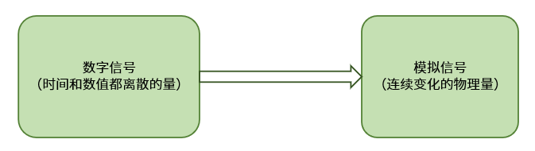

# DAC 设备

## DAC 简介

DAC(Digital-to-Analogl Converter) 指数模转换器。是指把二进制数字量形式的离散数字信号转换为连续变化的模拟信号的器件。在数字世界中，要处理不稳定和动态的模拟信号并不容易，基于 DAC 的特性，在各种不同的产品中都可以找到它的身影。与之相对应的 ADC(Analog-to-Digital Converter))，它是 DAC 数模转换的逆向过程。DAC 主要应用于音频放大，视频编码，电机控制，数字电位计等。

### 转换过程

DAC 主要由数字寄存器、模拟电子开关、位权网络、求和运算放大器和基准电压源（或恒流源）组成。用存于数字寄存器的数字量的各位数码，分别控制对应位的模拟电子开关，使数码为 1 的位在位权网络上产生与其位权成正比的电流值，再由运算放大器对各电流值求和，并转换成电压值。DAC 的转换过程如下图所示：



数模转换器是将数字信号转换为模拟信号的系统，一般用低通滤波即可以实现。数字信号先进行解码，即把数字码转换成与之对应的电平，形成阶梯状信号，然后进行低通滤波。

### 分辨率

分辨率是指 D/A 转换器能够转换的二进制位数，位数越多分辨率越高。

### 转换时间

建立时间是将一个数字量转换为稳定模拟信号所需的时间，也可以认为是转换时间。D/A 中常用建立时间来描述其速度,而不是 A/D 中常用的转换速率。一般地，电流输出 D/A 建立时间较短，电压输出 D/A 则较长。

### 转换精度

精度是指输入端加有最大数值量时，DAC 的实际输出值和理论计算值之差,它主要包括非线性误差、比例系统误差、失调误差。

### 线性度

理想的 D/A 转换器是线性的，实际上是有误差的。线性度是指数字量化时，D/A 转换器输出的模拟量按比例关系变化程度。

## 访问 DAC 设备

应用程序通过 RT-Thread 提供的 DAC 设备管理接口来访问 DAC 硬件，相关接口如下所示：

| **函数**         | **描述**                              |
| ---------------- | ------------------------------------- |
| rt_device_find() | 根据 DAC 设备名称查找设备获取设备句柄 |
| rt_dac_enable()  | 使能 DAC 设备                         |
| rt_dac_write()   | 设置 DAC 设备输出值                   |
| rt_dac_disable() | 关闭 DAC 设备                         |

### 查找 DAC 设备

应用程序根据 DAC 设备名称获取设备句柄，进而可以操作 DAC 设备，查找设备函数如下所示：

```c
rt_device_t rt_device_find(const char* name);
```

| **参数** | **描述**                           |
| -------- | ---------------------------------- |
| name     | DAC 设备名称                       |
| **返回** | ——                                 |
| 设备句柄 | 查找到对应设备将返回相应的设备句柄 |
| RT_NULL  | 没有找到设备                       |

一般情况下，注册到系统的 DAC 设备名称为 dac1，dac2 等，使用示例如下所示：

```c
#define DAC_DEV_NAME        "dac1"  /* DAC 设备名称 */
rt_dac_device_t dac_dev;            /* DAC 设备句柄 */
/* 查找设备 */
dac_dev = (rt_dac_device_t)rt_device_find(DAC_DEV_NAME);
```

### 使能 DAC 通道

在设置 DAC 设备数据前需要先使能设备，通过如下函数使能设备:

```c
rt_err_t rt_dac_enable(rt_dac_device_t dev, rt_uint32_t channel);
```

| **参数**   | **描述**               |
| ---------- | ---------------------- |
| dev        | DAC 设备句柄           |
| channel    | DAC 通道               |
| **返回**   | ——                     |
| RT_EOK     | 成功                   |
| -RT_ENOSYS | 失败，设备操作方法为空 |
| 其他错误码 | 失败                   |

使用示例如下所示：

```c
#define DAC_DEV_NAME        "dac1"  /* DAC 设备名称 */
#define DAC_DEV_CHANNEL     1       /* DAC 通道 */
rt_dac_device_t dac_dev;            /* DAC 设备句柄 */
/* 查找设备 */
dac_dev = (rt_dac_device_t)rt_device_find(DAC_DEV_NAME);
/* 使能设备 */
rt_dac_enable(dac_dev, DAC_DEV_CHANNEL);
```

### 设置 DAC 通道输出值

设置 DAC 通道输出值可通过如下函数完成：

```c
rt_uint32_t rt_dac_write(rt_dac_device_t dev, rt_uint32_t channel, rt_uint32_t value);
```

|            |              |
| ---------- | ------------ |
| **参数**   | **描述**     |
| dev        | DAC 设备句柄 |
| channel    | DAC 通道     |
| value      | DAC 输出值   |
| **返回**   | ——           |
| RT_EOK     | 成功         |
| -RT_ENOSYS | 失败         |

使用 DAC 输出电压值的使用示例如下所示：

```c
#define DAC_DEV_NAME        "dac1"  /* DAC 设备名称 */
#define DAC_DEV_CHANNEL     1       /* DAC 通道 */
rt_dac_device_t dac_dev;            /* DAC 设备句柄 */
rt_uint32_t value = 1000;          /* DAC 数据保持寄存器值 */
/* 查找设备 */
dac_dev = (rt_dac_device_t)rt_device_find(DAC_DEV_NAME);
/* 使能设备 */
rt_dac_enable(dac_dev, DAC_DEV_CHANNEL);
/* 输出电压值 */
rt_dac_write(dac_dev, DAC_DEV_CHANNEL, value);
/* 转换为对应电压值 */
vol = value * REFER_VOLTAGE / CONVERT_BITS;
rt_kprintf("the voltage is :%d.%02d \n", vol / 100, vol % 100);
```

### 关闭 DAC 通道

关闭 DAC 通道可通过如下函数完成：

```c
rt_err_t rt_dac_disable(rt_dac_device_t dev, rt_uint32_t channel);
```

| **参数**   | **描述**               |
| ---------- | ---------------------- |
| dev        | DAC 设备句柄           |
| channel    | DAC 通道               |
| **返回**   | ——                     |
| RT_EOK     | 成功                   |
| -RT_ENOSYS | 失败，设备操作方法为空 |
| 其他错误码 | 失败                   |

使用示例如下所示：

```c
#define DAC_DEV_NAME        "dac1"  /* DAC 设备名称 */
#define DAC_DEV_CHANNEL     1       /* DAC 通道 */
rt_dac_device_t dac_dev;            /* DAC 设备句柄 */
rt_uint32_t value = 1000;          /* DAC 数据保持寄存器值 */
/* 查找设备 */
dac_dev = (rt_dac_device_t)rt_device_find(DAC_DEV_NAME);
/* 使能设备 */
rt_dac_enable(dac_dev, DAC_DEV_CHANNEL);
/* 设置输出值 */
rt_dac_write(dac_dev, DAC_DEV_CHANNEL， value);
/* 转换为对应电压值 */
vol = value * REFER_VOLTAGE / CONVERT_BITS;
rt_kprintf("the voltage is :%d.%02d \n", vol / 100, vol % 100);
/* 关闭通道 */
rt_dac_disable(dac_dev, DAC_DEV_CHANNEL);
```

### FinSH 命令

在使用设备前，需要先查找设备是否存在，可以使用命令 `dac probe` 后面跟注册的 DAC 设备的名称。如下所示：

```c
msh >dac probe dac1
probe dac1 success
```

使能设备的某个通道可以使用命令 `dac enable` 后面跟通道号。

```c
msh >dac enable 1
dac1 channel 1 enables success
```

设置 DAC 设备某个通道的输出值可以使用命令 `dac write` 后面跟通道号和输出值。

```c
msh >dac write 1 1000
dac1 channel 1  write value is 1000
msh >
```

关闭设备的某个通道可以使用命令 `dac disable` 后面跟通道号。

```c
msh >dac disable 1
dac1 channel 1 disable success
msh >
```

## DAC 设备使用示例

DAC 设备的具体使用方式可以参考如下示例代码，示例代码的主要步骤如下：

1. 首先根据 DAC 设备名称 “dac1” 查找设备获取设备句柄。
2. 使能设备后设置 dac1 设备对应的通道 1 的输出值，然后根据分辨率为 12 位，参考电压为 3.3V 计算实际的电压值。
3. 若不使用 DAC 设备对应通道，则需要关闭该通道。

运行结果：打印实际读取到的转换的原始数据和经过计算后的实际电压值。

```c
/*
 * 程序清单： DAC 设备使用例程
 * 例程导出了 dac_sample 命令到控制终端
 * 命令调用格式：dac_sample
 * 程序功能：通过 DAC 设备将数字值转换为模拟量，并输出电压值。
 *           示例代码参考电压为3.3V,转换位数为12位。
*/

#include <rtthread.h>
#include <rtdevice.h>
#include <stdlib.h>
#define DAC_DEV_NAME        "dac1"  /* DAC 设备名称 */
#define DAC_DEV_CHANNEL     1       /* DAC 通道 */
#define REFER_VOLTAGE       330         /* 参考电压 3.3V,数据精度乘以100保留2位小数*/
#define CONVERT_BITS        (1 << 12)   /* 转换位数为12位 */

static int dac_vol_sample(int argc, char *argv[])
{
    rt_dac_device_t dac_dev;
    rt_uint32_t value, vol;
    rt_err_t ret = RT_EOK;

    /* 查找设备 */
    dac_dev = (rt_dac_device_t)rt_device_find(DAC_DEV_NAME);
    if (dac_dev == RT_NULL)
    {
        rt_kprintf("dac sample run failed! can't find %s device!\n", DAC_DEV_NAME);
        return RT_ERROR;
    }

    /* 打开通道 */
    ret = rt_dac_enable(dac_dev, DAC_DEV_CHANNEL);

    /* 设置输出值 */
    value = atoi(argv[1]);
    rt_dac_write(dac_dev, DAC_DEV_NAME, DAC_DEV_CHANNEL, &value);
    rt_kprintf("the value is :%d \n", value);

    /* 转换为对应电压值 */
    vol = value * REFER_VOLTAGE / CONVERT_BITS;
    rt_kprintf("the voltage is :%d.%02d \n", vol / 100, vol % 100);

    /* 延时查看效果，关闭通道后无输出 */
    rt_thread_mdelay(500);

    /* 关闭通道 */
    ret = rt_dac_disable(dac_dev, DAC_DEV_CHANNEL);

    return ret;
}
/* 导出到 msh 命令列表中 */
MSH_CMD_EXPORT(dac_vol_sample, dac voltage convert sample);
```

## 常见问题

### Q: menuconfig 找不到 DAC 设备的配置选项？

**A:** 使用的源代码还不支持 DAC 设备驱动框架。建议更新源代码。
