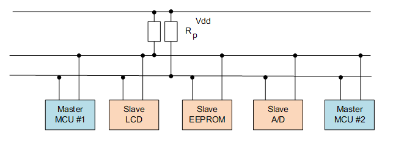

# I2C 总线设备

## I2C 简介

I2C（Inter Integrated Circuit）总线是 PHILIPS 公司开发的一种半双工、双向二线制同步串行总线。I2C 总线传输数据时只需两根信号线，一根是双向数据线 SDA（serial data），另一根是双向时钟线 SCL（serial clock）。SPI 总线有两根线分别用于主从设备之间接收数据和发送数据，而 I2C 总线只使用一根线进行数据收发。

I2C 和 SPI 一样以主从的方式工作，不同于 SPI 一主多从的结构，它允许同时有多个主设备存在，每个连接到总线上的器件都有唯一的地址，主设备启动数据传输并产生时钟信号，从设备被主设备寻址，同一时刻只允许有一个主设备。如下图所示：



如下图所示为 I2C 总线主要的数据传输格式：


当总线空闲时，SDA 和 SCL 都处于高电平状态，当主机要和某个从机通讯时，会先发送一个开始条件，然后发送从机地址和读写控制位，接下来传输数据（主机发送或者接收数据），数据传输结束时主机会发送停止条件。传输的每个字节为8位，高位在前，低位在后。数据传输过程中的不同名词详解如下所示：

* **开始条件：** SCL 为高电平时，主机将 SDA 拉低，表示数据传输即将开始。

* **从机地址：** 主机发送的第一个字节为从机地址，高 7 位为地址，最低位为 R/W 读写控制位，1 表示读操作，0 表示写操作。一般从机地址有 7 位地址模式和 10 位地址模式两种，如果是 10 位地址模式，第一个字节的头 7 位 是 11110XX 的组合，其中最后两位（XX）是 10 位地址的两个最高位，第二个字节为 10 位从机地址的剩下8位，如下图所示：


* **应答信号：** 每传输完成一个字节的数据，接收方就需要回复一个 ACK（acknowledge）。写数据时由从机发送 ACK，读数据时由主机发送 ACK。当主机读到最后一个字节数据时，可发送 NACK（Not acknowledge）然后跟停止条件。

* **数据：** 从机地址发送完后可能会发送一些指令，依从机而定，然后开始传输数据，由主机或者从机发送，每个数据为 8 位，数据的字节数没有限制。

* **重复开始条件：** 在一次通信过程中，主机可能需要和不同的从机传输数据或者需要切换读写操作时，主机可以再发送一个开始条件。

* **停止条件：** 在 SDA 为低电平时，主机将 SCL 拉高并保持高电平，然后在将 SDA 拉高，表示传输结束。

## 访问 I2C 总线设备

一般情况下 MCU 的 I2C 器件都是作为主机和从机通讯，在 RT-Thread 中将 I2C 主机虚拟为 I2C总线设备，I2C 从机通过 I2C 设备接口和 I2C 总线通讯，相关接口如下所示：

| **函数** | **描述**                           |
| --------------- | ---------------------------------- |
| rt_device_find()  | 根据 I2C 总线设备名称查找设备获取设备句柄      |
| rt_i2c_transfer() | 传输数据     |

### 查找 I2C 总线设备

在使用 I2C 总线设备前需要根据 I2C 总线设备名称获取设备句柄，进而才可以操作 I2C 总线设备，查找设备函数如下所示，

```c
rt_device_t rt_device_find(const char* name);
```

| **参数** | **描述**                           |
| -------- | ---------------------------------- |
| name     | I2C 总线设备名称                         |
| **返回** | ——                                 |
| 设备句柄 | 查找到对应设备将返回相应的设备句柄 |
| RT_NULL  | 没有找到相应的设备对象             |

一般情况下，注册到系统的 I2C  设备名称为 i2c0 ，i2c1等，使用示例如下所示：

```c
#define AHT10_I2C_BUS_NAME      "i2c1"  /* 传感器连接的I2C总线设备名称 */
struct rt_i2c_bus_device *i2c_bus;      /* I2C总线设备句柄 */

/* 查找I2C总线设备，获取I2C总线设备句柄 */
i2c_bus = (struct rt_i2c_bus_device *)rt_device_find(name);
```

### 数据传输

获取到 I2C 总线设备句柄就可以使用 `rt_i2c_transfer()` 进行数据传输。函数原型如下所示：

```c
rt_size_t rt_i2c_transfer(struct rt_i2c_bus_device *bus,
                          struct rt_i2c_msg         msgs[],
                          rt_uint32_t               num);
```

| **参数**           | **描述**             |
|--------------------|----------------------|
| bus                | I2C 总线设备句柄      |
| msgs[]             | 待传输的消息数组指针 |
| num                | 消息数组的元素个数   |
| **返回**           | ——                   |
| 消息数组的元素个数 | 成功                 |
| 错误码             | 失败                 |

和 SPI 总线的自定义传输接口一样，I2C 总线的自定义传输接口传输的数据也是以一个消息为单位。参数 msgs[] 指向待传输的消息数组，用户可以自定义每条消息的内容，实现 I2C 总线所支持的 2 种不同的数据传输模式。如果主设备需要发送重复开始条件，则需要发送 2 个消息。

> [!NOTE]
> 注：此函数会调用 rt_mutex_take(), 不能在中断服务程序里面调用，会导致 assertion 报错。

I2C 消息数据结构原型如下：

```c
struct rt_i2c_msg
{
    rt_uint16_t addr;    /* 从机地址 */
    rt_uint16_t flags;   /* 读、写标志等 */
    rt_uint16_t len;     /* 读写数据字节数 */
    rt_uint8_t  *buf;    /* 读写数据缓冲区指针　*/
}
```

从机地址 addr：支持 7 位和 10 位二进制地址，需查看不同设备的数据手册 。

> [!NOTE]
> 注：RT-Thread I2C 设备接口使用的从机地址均不包含读写位，读写位控制需修改标志 flags。

标志 flags 可取值为以下宏定义，根据需要可以与其他宏使用位运算 “|” 组合起来使用。

```c
#define RT_I2C_WR              0x0000        /* 写标志，不可以和读标志进行“|”操作 */
#define RT_I2C_RD              (1u << 0)     /* 读标志，不可以和写标志进行“|”操作 */
#define RT_I2C_ADDR_10BIT      (1u << 2)     /* 10 位地址模式 */
#define RT_I2C_NO_START        (1u << 4)     /* 无开始条件 */
#define RT_I2C_IGNORE_NACK     (1u << 5)     /* 忽视 NACK */
#define RT_I2C_NO_READ_ACK     (1u << 6)     /* 读的时候不发送 ACK */
#define RT_I2C_NO_STOP         (1u << 7)     /* 不发送结束位 */
```

使用示例如下所示：

```c
#define AHT10_I2C_BUS_NAME      "i2c1"  /* 传感器连接的I2C总线设备名称 */
#define AHT10_ADDR               0x38   /* 从机地址 */
struct rt_i2c_bus_device *i2c_bus;      /* I2C总线设备句柄 */

/* 查找I2C总线设备，获取I2C总线设备句柄 */
i2c_bus = (struct rt_i2c_bus_device *)rt_device_find(name);

/* 读传感器寄存器数据 */
static rt_err_t read_regs(struct rt_i2c_bus_device *bus, rt_uint8_t len, rt_uint8_t *buf)
{
    struct rt_i2c_msg msgs;

    msgs.addr = AHT10_ADDR;     /* 从机地址 */
    msgs.flags = RT_I2C_RD;     /* 读标志 */
    msgs.buf = buf;             /* 读写数据缓冲区指针　*/
    msgs.len = len;             /* 读写数据字节数 */

    /* 调用I2C设备接口传输数据 */
    if (rt_i2c_transfer(bus, &msgs, 1) == 1)
    {
        return RT_EOK;
    }
    else
    {
        return -RT_ERROR;
    }
}
```

## I2C 从设备数据读写API

以下两个读写函数封装自 rt_i2c_transfer() 函数，用于读写I2C从设备的数据，更加简单易用，推荐使用。

向 I2C 从设备发送数据：

```c
rt_size_t rt_i2c_master_send(struct rt_i2c_bus_device *bus,
                             rt_uint16_t               addr,
                             rt_uint16_t               flags,
                             const rt_uint8_t         *buf,
                             rt_uint32_t               count);
```

| **参数**           | **描述**                                                     |
| ------------------ | ------------------------------------------------------------ |
| bus                | I2C 总线设备句柄                                             |
| addr               | I2C 从设备地址                                               |
| flags              | 标志位，可为上文提到的除 `RT_I2C_WR` `RT_I2C_RD`之外的其他标志位，可以进行 “\|” 操作 |
| buf                | 待数据数据缓冲区                                             |
| count              | 待发送数据大小（单位：字节）                                 |
| **返回**           | ——                                                           |
| 消息数组的元素个数 | 成功                                                         |
| 错误码             | 失败                                                         |

从 I2C 从设备读取数据，数据会放在缓冲区中：

```c
rt_size_t rt_i2c_master_recv(struct rt_i2c_bus_device *bus,
                             rt_uint16_t               addr,
                             rt_uint16_t               flags,
                             rt_uint8_t               *buf,
                             rt_uint32_t               count);
```

| **参数**           | **描述**                                                     |
| ------------------ | ------------------------------------------------------------ |
| bus                | I2C 总线设备句柄                                             |
| addr               | I2C 从设备地址                                               |
| flags              | 标志位，可为上文提到的除 `RT_I2C_WR` `RT_I2C_RD`之外的其他标志位，可以进行 “\|” 操作 |
| buf                | 数据缓冲区                                                   |
| count              | 缓冲区大小（单位：字节，要大于等于最大接收到的数据长度）     |
| **返回**           | ——                                                           |
| 消息数组的元素个数 | 成功                                                         |
| 错误码             | 失败                                                         |

### 小技巧

有时，I2C数据需要通过多次函数拼接而成，通过如下方法，可以实现拼接发送一条I2C数据，数据内容为 prefix_buffer + buffer：

```c
rt_i2c_master_send(_i2c_bus_dev, _addr, RT_I2C_NO_STOP, prefix_buffer, prefix_len); /* 只发送起始位，不发送停止位 */
rt_i2c_master_send(_i2c_bus_dev, _addr, RT_I2C_NO_START, buffer, len); /* 不发送起始位，只发送停止位 */
```

## I2C 总线设备使用示例

I2C 设备的具体使用方式可以参考如下示例代码，示例代码的主要步骤如下：

1. 首先根据 I2C 设备名称查找 I2C 名称，获取设备句柄，然后初始化 aht10 传感器。

2. 控制传感器的两个函数为写传感器寄存器 write_reg() 和读传感器寄存器 read_regs()，这两个函数分别调用了 rt_i2c_transfer() 传输数据。读取温湿度信息的函数 read_temp_humi() 则是调用这两个函数完成功能。

```c
/*
 * 程序清单：这是一个 I2C 设备使用例程
 * 例程导出了 i2c_aht10_sample 命令到控制终端
 * 命令调用格式：i2c_aht10_sample i2c1
 * 命令解释：命令第二个参数是要使用的I2C总线设备名称，为空则使用默认的I2C总线设备
 * 程序功能：通过 I2C 设备读取温湿度传感器 aht10 的温湿度数据并打印
*/

#include <rtthread.h>
#include <rtdevice.h>

#define AHT10_I2C_BUS_NAME          "i2c1"  /* 传感器连接的I2C总线设备名称 */
#define AHT10_ADDR                  0x38    /* 从机地址 */
#define AHT10_CALIBRATION_CMD       0xE1    /* 校准命令 */
#define AHT10_NORMAL_CMD            0xA8    /* 一般命令 */
#define AHT10_GET_DATA              0xAC    /* 获取数据命令 */

static struct rt_i2c_bus_device *i2c_bus = RT_NULL;     /* I2C总线设备句柄 */
static rt_bool_t initialized = RT_FALSE;                /* 传感器初始化状态 */

/* 写传感器寄存器 */
static rt_err_t write_reg(struct rt_i2c_bus_device *bus, rt_uint8_t reg, rt_uint8_t *data)
{
    rt_uint8_t buf[3];
    struct rt_i2c_msg msgs;
    rt_uint32_t buf_size = 1;

    buf[0] = reg; //cmd
    if (data != RT_NULL)
    {
        buf[1] = data[0];
        buf[2] = data[1];
        buf_size = 3;
    }

    msgs.addr = AHT10_ADDR;
    msgs.flags = RT_I2C_WR;
    msgs.buf = buf;
    msgs.len = buf_size;

    /* 调用I2C设备接口传输数据 */
    if (rt_i2c_transfer(bus, &msgs, 1) == 1)
    {
        return RT_EOK;
    }
    else
    {
        return -RT_ERROR;
    }
}

/* 读传感器寄存器数据 */
static rt_err_t read_regs(struct rt_i2c_bus_device *bus, rt_uint8_t len, rt_uint8_t *buf)
{
    struct rt_i2c_msg msgs;

    msgs.addr = AHT10_ADDR;
    msgs.flags = RT_I2C_RD;
    msgs.buf = buf;
    msgs.len = len;

    /* 调用I2C设备接口传输数据 */
    if (rt_i2c_transfer(bus, &msgs, 1) == 1)
    {
        return RT_EOK;
    }
    else
    {
        return -RT_ERROR;
    }
}

static void read_temp_humi(float *cur_temp, float *cur_humi)
{
    rt_uint8_t temp[6];

    write_reg(i2c_bus, AHT10_GET_DATA, RT_NULL);      /* 发送命令 */
    rt_thread_mdelay(400);
    read_regs(i2c_bus, 6, temp);                /* 获取传感器数据 */

    /* 湿度数据转换 */
    *cur_humi = (temp[1] << 12 | temp[2] << 4 | (temp[3] & 0xf0) >> 4) * 100.0 / (1 << 20);
    /* 温度数据转换 */
    *cur_temp = ((temp[3] & 0xf) << 16 | temp[4] << 8 | temp[5]) * 200.0 / (1 << 20) - 50;
}

static void aht10_init(const char *name)
{
    rt_uint8_t temp[2] = {0, 0};

    /* 查找I2C总线设备，获取I2C总线设备句柄 */
    i2c_bus = (struct rt_i2c_bus_device *)rt_device_find(name);

    if (i2c_bus == RT_NULL)
    {
        rt_kprintf("can't find %s device!\n", name);
    }
    else
    {
        write_reg(i2c_bus, AHT10_NORMAL_CMD, temp);
        rt_thread_mdelay(400);

        temp[0] = 0x08;
        temp[1] = 0x00;
        write_reg(i2c_bus, AHT10_CALIBRATION_CMD, temp);
        rt_thread_mdelay(400);
        initialized = RT_TRUE;
    }
}

static void i2c_aht10_sample(int argc, char *argv[])
{
    float humidity, temperature;
    char name[RT_NAME_MAX];

    humidity = 0.0;
    temperature = 0.0;

    if (argc == 2)
    {
        rt_strncpy(name, argv[1], RT_NAME_MAX);
    }
    else
    {
        rt_strncpy(name, AHT10_I2C_BUS_NAME, RT_NAME_MAX);
    }

    if (!initialized)
    {
        /* 传感器初始化 */
        aht10_init(name);
    }
    if (initialized)
    {
        /* 读取温湿度数据 */
        read_temp_humi(&temperature, &humidity);

        rt_kprintf("read aht10 sensor humidity   : %d.%d %%\n", (int)humidity, (int)(humidity * 10) % 10);
        if( temperature >= 0 )
        {
            rt_kprintf("read aht10 sensor temperature: %d.%d°C\n", (int)temperature, (int)(temperature * 10) % 10);
        }
        else
        {
            rt_kprintf("read aht10 sensor temperature: %d.%d°C\n", (int)temperature, (int)(-temperature * 10) % 10);
        }
    }
    else
    {
        rt_kprintf("initialize sensor failed!\n");
    }
}
/* 导出到 msh 命令列表中 */
MSH_CMD_EXPORT(i2c_aht10_sample, i2c aht10 sample);
```
