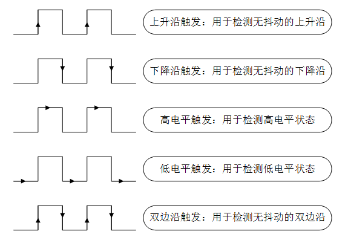

# PIN 设备

## 引脚简介

芯片上的引脚一般分为 4 类：电源、时钟、控制与 I/O，I/O 口在使用模式上又分为 General Purpose Input Output（通用输入 / 输出），简称 GPIO，与功能复用 I/O（如 SPI/I2C/UART 等）。

大多数 MCU 的引脚都不止一个功能。不同引脚内部结构不一样，拥有的功能也不一样。可以通过不同的配置，切换引脚的实际功能。通用 I/O 口主要特性如下：

* 可编程控制中断：中断触发模式可配置，一般有下图所示 5 种中断触发模式：



* 输入输出模式可控制。

   * 输出模式一般包括：推挽、开漏、上拉、下拉。引脚为输出模式时，可以通过配置引脚输出的电平状态为高电平或低电平来控制连接的外围设备。

   * 输入模式一般包括：浮空、上拉、下拉、模拟。引脚为输入模式时，可以读取引脚的电平状态，即高电平或低电平。

## 访问 PIN 设备

应用程序通过 RT-Thread 提供的 PIN 设备管理接口来访问 GPIO，相关接口如下所示：

| **函数** | **描述**                           |
| ---------------- | ---------------------------------- |
| rt_pin_get()  | 获取引脚编号  |
| rt_pin_mode()  | 设置引脚模式  |
| rt_pin_write()     | 设置引脚电平     |
| rt_pin_read()   | 读取引脚电平      |
| rt_pin_attach_irq()  | 绑定引脚中断回调函数  |
| rt_pin_irq_enable()   | 使能引脚中断      |
| rt_pin_detach_irq()  | 脱离引脚中断回调函数  |

### 获取引脚编号

RT-Thread 提供的引脚编号需要和芯片的引脚号区分开来，它们并不是同一个概念，引脚编号由 PIN 设备驱动程序定义，和具体的芯片相关。有3种方式可以获取引脚编号： API 接口获取、使用宏定义或者查看PIN 驱动文件。

#### 使用 API

使用 rt_pin_get() 获取引脚编号，如下获取 PF9 的引脚编号：

```c
pin_number = rt_pin_get("PF.9");
```

#### 使用宏定义

如果使用 `rt-thread/bsp/stm32` 目录下的 BSP 则可以使用下面的宏获取引脚编号：

```c
GET_PIN(port, pin)
```

获取引脚号为 PF9 的 LED0 对应的引脚编号的示例代码如下所示：

```c
#define LED0_PIN        GET_PIN(F,  9)
```


#### 查看驱动文件

如果使用其他 BSP 则需要查看 PIN 驱动代码 drv_gpio.c 文件确认引脚编号。此文件里有一个数组存放了每个 PIN 脚对应的编号信息，如下所示：

```c
static const rt_uint16_t pins[] =
{
    __STM32_PIN_DEFAULT,
    __STM32_PIN_DEFAULT,
    __STM32_PIN(2, A, 15),
    __STM32_PIN(3, B, 5),
    __STM32_PIN(4, B, 8),
    __STM32_PIN_DEFAULT,
    __STM32_PIN_DEFAULT,
    __STM32_PIN_DEFAULT,
    __STM32_PIN(8, A, 14),
    __STM32_PIN(9, B, 6),
    ... ...
}
```

以`__STM32_PIN(2, A, 15)`为例，2 为 RT-Thread 使用的引脚编号，A 为端口号，15 为引脚号，所以 PA15 对应的引脚编号为 2。

### 设置引脚模式

引脚在使用前需要先设置好输入或者输出模式，通过如下函数完成：

```c
void rt_pin_mode(rt_base_t pin, rt_base_t mode);
```

| **参数** | **描述**     |
|----------|--------------|
| pin      | 引脚编号     |
| mode     | 引脚工作模式 |

目前 RT-Thread 支持的引脚工作模式可取如所示的 5 种宏定义值之一，每种模式对应的芯片实际支持的模式需参考 PIN 设备驱动程序的具体实现：

```c
#define PIN_MODE_OUTPUT 0x00            /* 输出 */
#define PIN_MODE_INPUT 0x01             /* 输入 */
#define PIN_MODE_INPUT_PULLUP 0x02      /* 上拉输入 */
#define PIN_MODE_INPUT_PULLDOWN 0x03    /* 下拉输入 */
#define PIN_MODE_OUTPUT_OD 0x04         /* 开漏输出 */
```

使用示例如下所示：

```c
#define BEEP_PIN_NUM            35  /* PB0 */

/* 蜂鸣器引脚为输出模式 */
rt_pin_mode(BEEP_PIN_NUM, PIN_MODE_OUTPUT);
```

### 设置引脚电平

设置引脚输出电平的函数如下所示：

```c
void rt_pin_write(rt_base_t pin, rt_base_t value);
```

| **参数** | **描述**                 |
|----------|-------------------------|
| pin      | 引脚编号                  |
| value    | 电平逻辑值，可取 2 种宏定义值之一：PIN_LOW 低电平，PIN_HIGH 高电平 |

使用示例如下所示：

```c
#define BEEP_PIN_NUM            35  /* PB0 */

/* 蜂鸣器引脚为输出模式 */
rt_pin_mode(BEEP_PIN_NUM, PIN_MODE_OUTPUT);
/* 设置低电平 */
rt_pin_write(BEEP_PIN_NUM, PIN_LOW);
```

### 读取引脚电平

读取引脚电平的函数如下所示：

```c
int rt_pin_read(rt_base_t pin);
```

| **参数** | **描述** |
|----------|----------|
| pin      | 引脚编号 |
| **返回** | ——       |
| PIN_LOW  | 低电平   |
| PIN_HIGH | 高电平   |

使用示例如下所示：

```c
#define BEEP_PIN_NUM            35  /* PB0 */
int status;

/* 蜂鸣器引脚为输出模式 */
rt_pin_mode(BEEP_PIN_NUM, PIN_MODE_OUTPUT);
/* 设置低电平 */
rt_pin_write(BEEP_PIN_NUM, PIN_LOW);

status = rt_pin_read(BEEP_PIN_NUM);
```

### 绑定引脚中断回调函数

若要使用到引脚的中断功能，可以使用如下函数将某个引脚配置为某种中断触发模式并绑定一个中断回调函数到对应引脚，当引脚中断发生时，就会执行回调函数:

```c
rt_err_t rt_pin_attach_irq(rt_int32_t pin, rt_uint32_t mode,
                           void (*hdr)(void *args), void *args);
```

| **参数** | **描述**                                  |
|----------|--------------------------------------|
| pin      | 引脚编号                                  |
| mode     | 中断触发模式                              |
| hdr      | 中断回调函数，用户需要自行定义这个函数    |
| args     | 中断回调函数的参数，不需要时设置为 RT_NULL |
| **返回** | ——                                        |
| RT_EOK   | 绑定成功                                  |
| 错误码   | 绑定失败                                  |

中断触发模式 mode 可取如下 5 种宏定义值之一：

```c
#define PIN_IRQ_MODE_RISING 0x00         /* 上升沿触发 */
#define PIN_IRQ_MODE_FALLING 0x01        /* 下降沿触发 */
#define PIN_IRQ_MODE_RISING_FALLING 0x02 /* 边沿触发（上升沿和下降沿都触发）*/
#define PIN_IRQ_MODE_HIGH_LEVEL 0x03     /* 高电平触发 */
#define PIN_IRQ_MODE_LOW_LEVEL 0x04      /* 低电平触发 */
```

使用示例如下所示：

```c
#define KEY0_PIN_NUM            55  /* PD8 */
/* 中断回调函数 */
void beep_on(void *args)
{
    rt_kprintf("turn on beep!\n");

    rt_pin_write(BEEP_PIN_NUM, PIN_HIGH);
}
static void pin_beep_sample(void)
{
    /* 按键0引脚为输入模式 */
    rt_pin_mode(KEY0_PIN_NUM, PIN_MODE_INPUT_PULLUP);
    /* 绑定中断，下降沿模式，回调函数名为beep_on */
    rt_pin_attach_irq(KEY0_PIN_NUM, PIN_IRQ_MODE_FALLING, beep_on, RT_NULL);
}
```

### 使能引脚中断

绑定好引脚中断回调函数后使用下面的函数使能引脚中断：

```c
rt_err_t rt_pin_irq_enable(rt_base_t pin, rt_uint32_t enabled);
```

| **参数** | **描述**        |
|----------|----------------|
| pin      | 引脚编号         |
| enabled  | 状态，可取 2 种值之一：PIN_IRQ_ENABLE（开启），PIN_IRQ_DISABLE（关闭） |
| **返回** | ——             |
| RT_EOK   | 使能成功        |
| 错误码   | 使能失败     |

使用示例如下所示：

```c
#define KEY0_PIN_NUM            55  /* PD8 */
/* 中断回调函数 */
void beep_on(void *args)
{
    rt_kprintf("turn on beep!\n");

    rt_pin_write(BEEP_PIN_NUM, PIN_HIGH);
}
static void pin_beep_sample(void)
{
    /* 按键0引脚为输入模式 */
    rt_pin_mode(KEY0_PIN_NUM, PIN_MODE_INPUT_PULLUP);
    /* 绑定中断，下降沿模式，回调函数名为beep_on */
    rt_pin_attach_irq(KEY0_PIN_NUM, PIN_IRQ_MODE_FALLING, beep_on, RT_NULL);
    /* 使能中断 */
    rt_pin_irq_enable(KEY0_PIN_NUM, PIN_IRQ_ENABLE);
}
```

### 脱离引脚中断回调函数

可以使用如下函数脱离引脚中断回调函数：

```c
rt_err_t rt_pin_detach_irq(rt_int32_t pin);
```

| **参数** | **描述** |
|----------|----------|
| pin      | 引脚编号 |
| **返回** | ——       |
| RT_EOK   | 脱离成功 |
| 错误码   | 脱离失败 |

引脚脱离了中断回调函数以后，中断并没有关闭，还可以调用绑定中断回调函数再次绑定其他回调函数。

```c
#define KEY0_PIN_NUM            55  /* PD8 */
/* 中断回调函数 */
void beep_on(void *args)
{
    rt_kprintf("turn on beep!\n");

    rt_pin_write(BEEP_PIN_NUM, PIN_HIGH);
}
static void pin_beep_sample(void)
{
    /* 按键0引脚为输入模式 */
    rt_pin_mode(KEY0_PIN_NUM, PIN_MODE_INPUT_PULLUP);
    /* 绑定中断，下降沿模式，回调函数名为beep_on */
    rt_pin_attach_irq(KEY0_PIN_NUM, PIN_IRQ_MODE_FALLING, beep_on, RT_NULL);
    /* 使能中断 */
    rt_pin_irq_enable(KEY0_PIN_NUM, PIN_IRQ_ENABLE);
    /* 脱离中断回调函数 */
    rt_pin_detach_irq(KEY0_PIN_NUM);
}
```

## PIN 设备使用示例

PIN 设备的具体使用方式可以参考如下示例代码，示例代码的主要步骤如下：

1. 设置蜂鸣器对应引脚为输出模式，并给一个默认的低电平状态。

2. 设置按键 0 和 按键1 对应引脚为输入模式，然后绑定中断回调函数并使能中断。

3. 按下按键 0 蜂鸣器开始响，按下按键 1 蜂鸣器停止响。

```c
/*
 * 程序清单：这是一个 PIN 设备使用例程
 * 例程导出了 pin_beep_sample 命令到控制终端
 * 命令调用格式：pin_beep_sample
 * 程序功能：通过按键控制蜂鸣器对应引脚的电平状态控制蜂鸣器
*/

#include <rtthread.h>
#include <rtdevice.h>

/* 引脚编号，通过查看设备驱动文件drv_gpio.c确定 */
#ifndef BEEP_PIN_NUM
    #define BEEP_PIN_NUM            35  /* PB0 */
#endif
#ifndef KEY0_PIN_NUM
    #define KEY0_PIN_NUM            55  /* PD8 */
#endif
#ifndef KEY1_PIN_NUM
    #define KEY1_PIN_NUM            56  /* PD9 */
#endif

void beep_on(void *args)
{
    rt_kprintf("turn on beep!\n");

    rt_pin_write(BEEP_PIN_NUM, PIN_HIGH);
}

void beep_off(void *args)
{
    rt_kprintf("turn off beep!\n");

    rt_pin_write(BEEP_PIN_NUM, PIN_LOW);
}

static void pin_beep_sample(void)
{
    /* 蜂鸣器引脚为输出模式 */
    rt_pin_mode(BEEP_PIN_NUM, PIN_MODE_OUTPUT);
    /* 默认低电平 */
    rt_pin_write(BEEP_PIN_NUM, PIN_LOW);

    /* 按键0引脚为输入模式 */
    rt_pin_mode(KEY0_PIN_NUM, PIN_MODE_INPUT_PULLUP);
    /* 绑定中断，下降沿模式，回调函数名为beep_on */
    rt_pin_attach_irq(KEY0_PIN_NUM, PIN_IRQ_MODE_FALLING, beep_on, RT_NULL);
    /* 使能中断 */
    rt_pin_irq_enable(KEY0_PIN_NUM, PIN_IRQ_ENABLE);

    /* 按键1引脚为输入模式 */
    rt_pin_mode(KEY1_PIN_NUM, PIN_MODE_INPUT_PULLUP);
    /* 绑定中断，下降沿模式，回调函数名为beep_off */
    rt_pin_attach_irq(KEY1_PIN_NUM, PIN_IRQ_MODE_FALLING, beep_off, RT_NULL);
    /* 使能中断 */
    rt_pin_irq_enable(KEY1_PIN_NUM, PIN_IRQ_ENABLE);
}
/* 导出到 msh 命令列表中 */
MSH_CMD_EXPORT(pin_beep_sample, pin beep sample);
```
