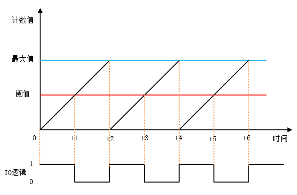
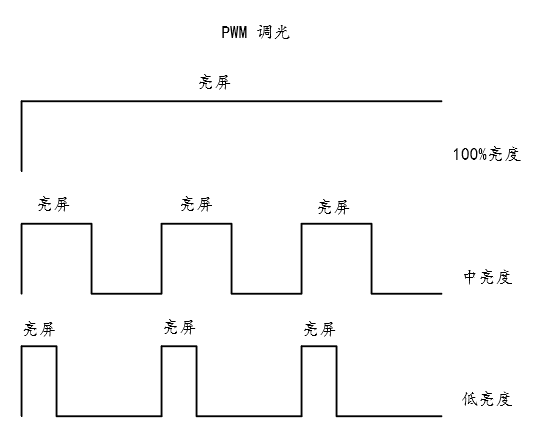

# PWM 设备

## PWM 简介

PWM(Pulse Width Modulation , 脉冲宽度调制) 是一种对模拟信号电平进行数字编码的方法，通过不同频率的脉冲使用方波的占空比用来对一个具体模拟信号的电平进行编码，使输出端得到一系列幅值相等的脉冲，用这些脉冲来代替所需要波形的设备。



上图是一个简单的 PWM 原理示意图，假定定时器工作模式为向上计数，当计数值小于阈值时，则输出一种电平状态，比如高电平，当计数值大于阈值时则输出相反的电平状态，比如低电平。当计数值达到最大值是，计数器从0开始重新计数，又回到最初的电平状态。高电平持续时间（脉冲宽度）和周期时间的比值就是占空比，范围为0~100%。上图高电平的持续时间刚好是周期时间的一半，所以占空比为50%。

一个比较常用的pwm控制情景就是用来调节灯或者屏幕的亮度，根据占空比的不同，就可以完成亮度的调节。PWM调节亮度并不是持续发光的，而是在不停地点亮、熄灭屏幕。当亮、灭交替够快时，肉眼就会认为一直在亮。在亮、灭的过程中，灭的状态持续时间越长，屏幕给肉眼的观感就是亮度越低。亮的时间越长，灭的时间就相应减少，屏幕就会变亮。



## 访问 PWM 设备

应用程序通过 RT-Thread 提供的 PWM 设备管理接口来访问 PWM 设备硬件，相关接口如下所示：

| **函数** | **描述**                           |
| ----------------- | ---------------------------------- |
| rt_device_find()  | 根据 PWM 设备名称查找设备获取设备句柄      |
| rt_pwm_set()     | 设置 PWM 周期和脉冲宽度     |
| rt_pwm_enable()   | 使能 PWM 设备      |
| rt_pwm_disable()  | 关闭 PWM 设备    |

### 查找 PWM 设备

应用程序根据 PWM 设备名称获取设备句柄，进而可以操作 PWM 设备，查找设备函数如下所示:

```c
rt_device_t rt_device_find(const char* name);
```

| **参数** | **描述**                           |
| -------- | ---------------------------------- |
| name     | 设备名称                           |
| **返回** | ——                                 |
| 设备句柄 | 查找到对应设备将返回相应的设备句柄 |
| RT_NULL  | 没有找到设备         |

一般情况下，注册到系统的 PWM 设备名称为 pwm0，pwm1等，使用示例如下所示：

```c
#define PWM_DEV_NAME        "pwm3"  /* PWM 设备名称 */
struct rt_device_pwm *pwm_dev;      /* PWM 设备句柄 */
/* 查找设备 */
pwm_dev = (struct rt_device_pwm *)rt_device_find(PWM_DEV_NAME);
```

### 设置 PWM 周期和脉冲宽度

通过如下函数设置 PWM 周期和占空比：

```c
rt_err_t rt_pwm_set(struct rt_device_pwm *device,
                    int channel,
                    rt_uint32_t period,
                    rt_uint32_t pulse);
```

| **参数**   | **描述**          |
| ---------- | ----------------- |
| device     |  PWM 设备句柄          |
| channel    | PWM 通道           |
| period     | PWM 周期时间 (单位纳秒 ns) |
| pulse     | PWM 脉冲宽度时间 (单位纳秒 ns)   |
| **返回**   | ——                |
| RT_EOK     | 成功      |
| -RT_EIO | device 为空 |
| -RT_ENOSYS | 设备操作方法为空 |
| 其他错误码 | 执行失败          |

PWM 的输出频率由周期时间 period 决定，例如周期时间为 0.5ms (毫秒)，则 period 值为 500000ns（纳秒），输出频率为 2KHz，占空比为 pulse / period，pulse 值不能超过 period。

使用示例如下所示：

```c
#define PWM_DEV_NAME        "pwm3"  /* PWM设备名称 */
#define PWM_DEV_CHANNEL     4       /* PWM通道 */
struct rt_device_pwm *pwm_dev;      /* PWM设备句柄 */
rt_uint32_t period, pulse;

period = 500000;    /* 周期为0.5ms，单位为纳秒ns */
pulse = 0;          /* PWM脉冲宽度值，单位为纳秒ns */
/* 查找设备 */
pwm_dev = (struct rt_device_pwm *)rt_device_find(PWM_DEV_NAME);
/* 设置PWM周期和脉冲宽度 */
rt_pwm_set(pwm_dev, PWM_DEV_CHANNEL, period, pulse);
```

### 使能 PWM 设备

设置好 PWM 周期和脉冲宽度后就可以通过如下函数使能 PWM 设备:

```c
rt_err_t rt_pwm_enable(struct rt_device_pwm *device, int channel);
```

| **参数**   | **描述**                         |
| ---------- | ------------------------------- |
| device  | PWM 设备句柄                        |
| channel | PWM 通道  -channel代表互补通道       |
| **返回**   | ——                             |
| RT_EOK     | 设备使能成功                |
| -RT_ENOSYS | 设备操作方法为空 |
| 其他错误码   | 设备使能失败                |

使用示例如下所示：

```c
#define PWM_DEV_NAME        "pwm3"  /* PWM设备名称 */
#define PWM_DEV_CHANNEL     4       /* PWM通道 */
struct rt_device_pwm *pwm_dev;      /* PWM设备句柄 */
rt_uint32_t period, pulse;

period = 500000;    /* 周期为0.5ms，单位为纳秒ns */
pulse = 0;          /* PWM脉冲宽度值，单位为纳秒ns */
/* 查找设备 */
pwm_dev = (struct rt_device_pwm *)rt_device_find(PWM_DEV_NAME);
/* 设置PWM周期和脉冲宽度 */
rt_pwm_set(pwm_dev, PWM_DEV_CHANNEL, period, pulse);
/* 使能设备 */
rt_pwm_enable(pwm_dev, PWM_DEV_CHANNEL);
```

### 关闭 PWM 设备通道

通过如下函数关闭 PWM 设备对应通道。

```c
rt_err_t rt_pwm_disable(struct rt_device_pwm *device, int channel);
```

| **参数**   | **描述**                         |
| ---------- | ------------------------------- |
| device  | PWM 设备句柄                        |
| channel | PWM 通道               |
| **返回**   | ——                             |
| RT_EOK     | 设备关闭成功                |
| -RT_EIO | 设备句柄为空 |
| 其他错误码   | 设备关闭失败                |

使用示例如下所示：

```c
#define PWM_DEV_NAME        "pwm3"  /* PWM设备名称 */
#define PWM_DEV_CHANNEL     4       /* PWM通道 */
struct rt_device_pwm *pwm_dev;      /* PWM设备句柄 */
rt_uint32_t period, pulse;

period = 500000;    /* 周期为0.5ms，单位为纳秒ns */
pulse = 0;          /* PWM脉冲宽度值，单位为纳秒ns */
/* 查找设备 */
pwm_dev = (struct rt_device_pwm *)rt_device_find(PWM_DEV_NAME);
/* 设置PWM周期和脉冲宽度 */
rt_pwm_set(pwm_dev, PWM_DEV_CHANNEL, period, pulse);
/* 使能设备 */
rt_pwm_enable(pwm_dev, PWM_DEV_CHANNEL);
/* 关闭设备通道 */
rt_pwm_disable(pwm_dev,PWM_DEV_CHANNEL);
```


## FinSH 命令

设置 PWM 设备的某个通道的周期和占空比可使用命令`pwm_set pwm1 1 500000 5000`，第一个参数为命令，第二个参数为 PWM 设备名称，第 3 个参数为 PWM 通道，第 4 个参数为周期（单位纳秒），第 5 个参数为脉冲宽度（单位纳秒）。

```c
msh />pwm_set pwm1 1 500000 5000
msh />
```

使能 PWM 设备的某个通道可使用命令`pwm_enable pwm1 1`，第一个参数为命令，第二个参数为 PWM 设备名称，第 3 个参数为 PWM 通道。

```c
msh />pwm_enable pwm1 1
msh />
```

关闭 PWM 设备的某个通道可使用命令`pwm_disable pwm1 1`，第一个参数为命令，第二个参数为 PWM 设备名称，第 3 个参数为 PWM 通道。

```c
msh />pwm_disable pwm1 1
msh />
```

## PWM 设备使用示例

PWM 设备的具体使用方式可以参考如下示例代码，示例代码的主要步骤如下：

1. 查找 PWM 设备获取设备句柄。

2. 设置 PWM 周期和脉冲宽度。

3. 使能 PWM 设备。

4. while 循环里每 50 毫秒修改一次脉冲宽度。

* 将 PWM通道对应引脚和 LED 对应引脚相连，可以看到 LED 不停的由暗变到亮，然后又从亮变到暗。

```c
/*
 * 程序清单：这是一个 PWM 设备使用例程
 * 例程导出了 pwm_led_sample 命令到控制终端
 * 命令调用格式：pwm_led_sample
 * 程序功能：通过 PWM 设备控制 LED 灯的亮度，可以看到LED不停的由暗变到亮，然后又从亮变到暗。
*/

#include <rtthread.h>
#include <rtdevice.h>

#define PWM_DEV_NAME        "pwm3"  /* PWM设备名称 */
#define PWM_DEV_CHANNEL     4       /* PWM通道 */

struct rt_device_pwm *pwm_dev;      /* PWM设备句柄 */

static int pwm_led_sample(int argc, char *argv[])
{
    rt_uint32_t period, pulse, dir;

    period = 500000;    /* 周期为0.5ms，单位为纳秒ns */
    dir = 1;            /* PWM脉冲宽度值的增减方向 */
    pulse = 0;          /* PWM脉冲宽度值，单位为纳秒ns */

    /* 查找设备 */
    pwm_dev = (struct rt_device_pwm *)rt_device_find(PWM_DEV_NAME);
    if (pwm_dev == RT_NULL)
    {
        rt_kprintf("pwm sample run failed! can't find %s device!\n", PWM_DEV_NAME);
        return RT_ERROR;
    }

    /* 设置PWM周期和脉冲宽度默认值 */
    rt_pwm_set(pwm_dev, PWM_DEV_CHANNEL, period, pulse);
    /* 使能设备 */
    rt_pwm_enable(pwm_dev, PWM_DEV_CHANNEL);

    while (1)
    {
        rt_thread_mdelay(50);
        if (dir)
        {
            pulse += 5000;      /* 从0值开始每次增加5000ns */
        }
        else
        {
            pulse -= 5000;      /* 从最大值开始每次减少5000ns */
        }
        if (pulse >= period)
        {
            dir = 0;
        }
        if (0 == pulse)
        {
            dir = 1;
        }

        /* 设置PWM周期和脉冲宽度 */
        rt_pwm_set(pwm_dev, PWM_DEV_CHANNEL, period, pulse);
    }
}
/* 导出到 msh 命令列表中 */
MSH_CMD_EXPORT(pwm_led_sample, pwm sample);
```
