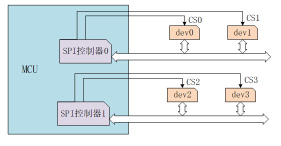
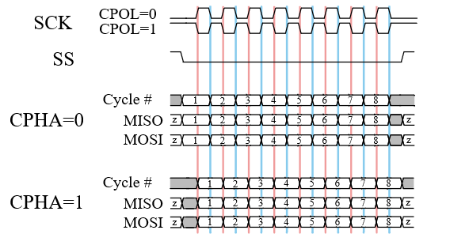

# SPI 设备

## SPI 简介

SPI（Serial Peripheral Interface，串行外设接口）是一种高速、全双工、同步通信总线，常用于短距离通讯，主要应用于 EEPROM、FLASH、实时时钟、AD 转换器、还有数字信号处理器和数字信号解码器之间。SPI 一般使用 4 根线通信，如下图所示：


* MOSI –主机输出 / 从机输入数据线（SPI Bus Master Output/Slave Input）。

* MISO –主机输入 / 从机输出数据线（SPI Bus Master Input/Slave Output)。

* SCLK –串行时钟线（Serial Clock），主设备输出时钟信号至从设备。

* CS –从设备选择线 (Chip select)。也叫 SS、CSB、CSN、EN 等，主设备输出片选信号至从设备。

SPI 以主从方式工作，通常有一个主设备和一个或多个从设备。通信由主设备发起，主设备通过 CS 选择要通信的从设备，然后通过 SCLK 给从设备提供时钟信号，数据通过 MOSI 输出给从设备，同时通过 MISO 接收从设备发送的数据。

如下图所示芯片有 2 个 SPI 控制器，SPI 控制器对应 SPI 主设备，每个 SPI 控制器可以连接多个 SPI 从设备。挂载在同一个 SPI 控制器上的从设备共享 3 个信号引脚：SCK、MISO、MOSI，但每个从设备的 CS 引脚是独立的。



主设备通过控制 CS 引脚对从设备进行片选，一般为低电平有效。任何时刻，一个 SPI 主设备上只有一个 CS 引脚处于有效状态，与该有效 CS 引脚连接的从设备此时可以与主设备通信。

从设备的时钟由主设备通过 SCLK 提供，MOSI、MISO 则基于此脉冲完成数据传输。SPI 的工作时序模式由 CPOL（Clock Polarity，时钟极性）和 CPHA（Clock Phase，时钟相位）之间的相位关系决定，CPOL 表示时钟信号的初始电平的状态，CPOL 为 0 表示时钟信号初始状态为低电平，为 1 表示时钟信号的初始电平是高电平。CPHA 表示在哪个时钟沿采样数据，CPHA 为 0 表示在首个时钟变化沿采样数据，而 CPHA 为 1 则表示在第二个时钟变化沿采样数据。根据 CPOL 和 CPHA 的不同组合共有 4 种工作时序模式：①CPOL=0，CPHA=0、②CPOL=0，CPHA=1、③CPOL=1，CPHA=0、④CPOL=1，CPHA=1。如下图所示：



**QSPI:** QSPI 是 Queued SPI 的简写，是 Motorola 公司推出的 SPI 接口的扩展，比 SPI 应用更加广泛。在 SPI 协议的基础上，Motorola 公司对其功能进行了增强，增加了队列传输机制，推出了队列串行外围接口协议（即 QSPI 协议）。使用该接口，用户可以一次性传输包含多达 16 个 8 位或 16 位数据的传输队列。一旦传输启动，直到传输结束，都不需要 CPU 干预，极大的提高了传输效率。与 SPI 相比，QSPI 的最大结构特点是以 80 字节的 RAM 代替了 SPI 的发送和接收数据寄存器。

**Dual SPI Flash:** 对于 SPI Flash 而言全双工并不常用，可以发送一个命令字节进入 Dual 模式，让它工作在半双工模式，用以加倍数据传输。这样 MOSI 变成 SIO0（serial io 0），MISO 变成 SIO1（serial io 1）,这样一个时钟周期内就能传输 2 个 bit 数据，加倍了数据传输。

**Quad SPI Flash:** 与 Dual SPI 类似，Quad SPI Flash增加了两根 I/O 线（SIO2,SIO3），目的是一个时钟内传输 4 个 bit 数据。

所以对于 SPI Flash，有标准 SPI Flash，Dual SPI Flash, Quad SPI Flash 三种类型。在相同时钟下，线数越多传输速率越高。

## 挂载 SPI 设备

SPI 驱动会注册 SPI 总线，SPI 设备需要挂载到已经注册好的 SPI 总线上。

```c
rt_err_t rt_spi_bus_attach_device(struct rt_spi_device *device,
                                  const char           *name,
                                  const char           *bus_name,
                                  void                 *user_data)
```

| **参数** | **描述**                           |
| -------- | ---------------------------------- |
| device     | SPI 设备句柄                           |
| name     |  SPI 设备名称                         |
| bus_name     | SPI 总线名称                           |
| user_data     | 用户数据指针                           |
| **返回** | ——                                 |
| RT_EOK     | 成功             |
| 其他错误码  | 失败             |

此函数用于挂载一个 SPI 设备到指定的 SPI 总线，并向内核注册 SPI 设备，并将 user_data 保存到 SPI 设备的控制块里。

一般 SPI 总线命名原则为 spix， SPI 设备命名原则为 spixy ，如 spi10 表示挂载在 spi1 总线上的 0 号设备。user_data 一般为 SPI 设备的 CS 引脚指针，进行数据传输时 SPI 控制器会操作此引脚进行片选。

若使用 rt-thread/bsp/stm32 目录下的 BSP 则可以使用下面的函数挂载 SPI 设备到总线：

```c
rt_err_t rt_hw_spi_device_attach(const char *bus_name, const char *device_name, GPIO_TypeDef* cs_gpiox, uint16_t cs_gpio_pin);
```

下面的示例代码挂载 SPI FLASH W25Q128 到 SPI 总线：

```c
static int rt_hw_spi_flash_init(void)
{
    __HAL_RCC_GPIOB_CLK_ENABLE();
    rt_hw_spi_device_attach("spi1", "spi10", GPIOB, GPIO_PIN_14);

    if (RT_NULL == rt_sfud_flash_probe("W25Q128", "spi10"))
    {
        return -RT_ERROR;
    };

    return RT_EOK;
}
/* 导出到自动初始化 */
INIT_COMPONENT_EXPORT(rt_hw_spi_flash_init);
```

## 配置 SPI 设备

挂载 SPI 设备到 SPI 总线后需要配置 SPI 设备的传输参数。

```c
rt_err_t rt_spi_configure(struct rt_spi_device *device,
                          struct rt_spi_configuration *cfg)
```

| **参数** | **描述**                           |
| -------- | ---------------------------------- |
| device   | SPI 设备句柄                           |
| cfg      |  SPI 配置参数指针                         |
| **返回** | ——                                 |
| RT_EOK     | 成功             |

此函数会保存 cfg 指向的配置参数到 SPI 设备 device 的控制块里，当传输数据时会使用此配置参数。

struct rt_spi_configuration 原型如下：

```c
struct rt_spi_configuration
{
    rt_uint8_t mode;        /* 模式 */
    rt_uint8_t data_width;  /* 数据宽度，可取8位、16位、32位 */
    rt_uint16_t reserved;   /* 保留 */
    rt_uint32_t max_hz;     /* 最大频率 */
};
```

**模式：** 包含 MSB/LSB、主从模式、 时序模式等，可取宏组合如下:

```c
/* 设置数据传输顺序是MSB位在前还是LSB位在前 */
#define RT_SPI_LSB      (0<<2)                        /* bit[2]: 0-LSB */
#define RT_SPI_MSB      (1<<2)                        /* bit[2]: 1-MSB */

/* 设置SPI的主从模式 */
#define RT_SPI_MASTER   (0<<3)                        /* SPI master device */
#define RT_SPI_SLAVE    (1<<3)                        /* SPI slave device */

/* 设置时钟极性和时钟相位 */
#define RT_SPI_MODE_0   (0 | 0)                       /* CPOL = 0, CPHA = 0 */
#define RT_SPI_MODE_1   (0 | RT_SPI_CPHA)             /* CPOL = 0, CPHA = 1 */
#define RT_SPI_MODE_2   (RT_SPI_CPOL | 0)             /* CPOL = 1, CPHA = 0 */
#define RT_SPI_MODE_3   (RT_SPI_CPOL | RT_SPI_CPHA)   /* CPOL = 1, CPHA = 1 */

#define RT_SPI_CS_HIGH  (1<<4)                        /* Chipselect active high */
#define RT_SPI_NO_CS    (1<<5)                        /* No chipselect */
#define RT_SPI_3WIRE    (1<<6)                        /* SI/SO pin shared */
#define RT_SPI_READY    (1<<7)                        /* Slave pulls low to pause */
```

**数据宽度：** 根据 SPI 主设备及 SPI 从设备可发送及接收的数据宽度格式设置为8位、16位或者32位。

**最大频率：** 设置数据传输的波特率，同样根据 SPI 主设备及 SPI 从设备工作的波特率范围设置。

配置示例如下所示：

```c
    struct rt_spi_configuration cfg;
    cfg.data_width = 8;
    cfg.mode = RT_SPI_MASTER | RT_SPI_MODE_0 | RT_SPI_MSB;
    cfg.max_hz = 20 * 1000 *1000;                           /* 20M */

    rt_spi_configure(spi_dev, &cfg);
```

## 配置 QSPI 设备

配置 QSPI 设备的传输参数可使用如下函数：

```c
rt_err_t rt_qspi_configure(struct rt_qspi_device *device, struct rt_qspi_configuration *cfg);
```

| **参数** | **描述**                           |
| -------- | ---------------------------------- |
| device   | QSPI 设备句柄                           |
| cfg      | QSPI 配置参数指针                         |
| **返回** | ——                                 |
| RT_EOK     | 成功             |

此函数会保存 cfg 指向的配置参数到 QSPI 设备 device 的控制块里，当传输数据时会使用此配置参数。

struct rt_qspi_configuration 原型如下：

```c
struct rt_qspi_configuration
{
    struct rt_spi_configuration parent;     /* 继承自 SPI 设备配置参数 */
    rt_uint32_t medium_size;                /* 介质大小 */
    rt_uint8_t ddr_mode;                   /* 双倍速率模式 */
    rt_uint8_t qspi_dl_width ;             /* QSPI 总线位宽，单线模式 1 位、双线模式 2 位，4 线模式 4 位 */
};
```

## 访问 SPI 设备

一般情况下 MCU 的 SPI 器件都是作为主机和从机通讯，在 RT-Thread 中将 SPI 主机虚拟为 SPI 总线设备，应用程序使用 SPI 设备管理接口来访问 SPI 从机器件，主要接口如下所示：

| **函数** | **描述**                           |
| -------------------- | ---------------------------------- |
| rt_device_find()  | 根据 SPI 设备名称查找设备获取设备句柄      |
| rt_spi_transfer_message()     | 自定义传输数据   |
| rt_spi_transfer()     | 传输一次数据   |
| rt_spi_send()     | 发送一次数据   |
| rt_spi_recv()     | 接受一次数据   |
| rt_spi_send_then_send()  | 连续两次发送   |
| rt_spi_send_then_recv()  | 先发送后接收   |

> [!NOTE]
> 注：SPI 数据传输相关接口会调用 rt_mutex_take(), 此函数不能在中断服务程序里面调用，会导致 assertion 报错。

### 查找 SPI 设备

在使用 SPI 设备前需要根据 SPI 设备名称获取设备句柄，进而才可以操作 SPI 设备，查找设备函数如下所示，

```c
rt_device_t rt_device_find(const char* name);
```

| **参数** | **描述**                           |
| -------- | ---------------------------------- |
| name     | 设备名称                           |
| **返回** | ——                                 |
| 设备句柄 | 查找到对应设备将返回相应的设备句柄 |
| RT_NULL  | 没有找到相应的设备对象             |

一般情况下，注册到系统的 SPI 设备名称为 spi10， qspi10等，使用示例如下所示：

```c
#define W25Q_SPI_DEVICE_NAME     "qspi10"   /* SPI 设备名称 */
struct rt_spi_device *spi_dev_w25q;     /* SPI 设备句柄 */

/* 查找 spi 设备获取设备句柄 */
spi_dev_w25q = (struct rt_spi_device *)rt_device_find(W25Q_SPI_DEVICE_NAME);
```

### 自定义传输数据

获取到 SPI 设备句柄就可以使用 SPI 设备管理接口访问 SPI 设备器件，进行数据收发。可以通过如下函数传输消息：

```c
struct rt_spi_message *rt_spi_transfer_message(struct rt_spi_device  *device,struct rt_spi_message *message)；
```

| **参数** | **描述**                                    |
|----------|--------------------------------------------|
| device   | SPI 设备句柄                               |
| message  | 消息指针                                    |
| **返回** | ——                                          |
| RT_NULL  | 成功发送                                    |
| 非空指针 | 发送失败，返回指向剩余未发送的 message 的指针 |

此函数可以传输一连串消息，用户可以自定义每个待传输的 message 结构体各参数的数值，从而可以很方便的控制数据传输方式。struct rt_spi_message 原型如下：

```c
struct rt_spi_message
{
    const void *send_buf;           /* 发送缓冲区指针 */
    void *recv_buf;                 /* 接收缓冲区指针 */
    rt_size_t length;               /* 发送 / 接收 数据字节数 */
    struct rt_spi_message *next;    /* 指向继续发送的下一条消息的指针 */
    unsigned cs_take    : 1;        /* 片选选中 */
    unsigned cs_release : 1;        /* 释放片选 */
};
```
sendbuf 为发送缓冲区指针，其值为 RT_NULL 时，表示本次传输为只接收状态，不需要发送数据。

recvbuf 为接收缓冲区指针，其值为 RT_NULL 时，表示本次传输为只发送状态，不需要保存接收到的数据，所以收到的数据直接丢弃。

length 的单位为 word，即数据长度为 8 位时，每个 length 占用 1 个字节；当数据长度为 16 位时，每个 length 占用 2 个字节。

参数 next 是指向继续发送的下一条消息的指针，若只发送一条消息，则此指针值为 RT_NULL。多个待传输的消息通过 next 指针以单向链表的形式连接在一起。

cs_take 值为 1 时，表示在传输数据前，设置对应的 CS 为有效状态。cs_release 值为 1 时，表示在数据传输结束后，释放对应的 CS。

> [!NOTE]
> 注：* 当 send_buf 或 recv_buf 不为空时，两者的可用空间都不得小于 length。
    * 若使用此函数传输消息，传输的第一条消息 cs_take 需置为 1，设置片选为有效，最后一条消息的 cs_release 需置 1，释放片选。

使用示例如下所示：

```c
#define W25Q_SPI_DEVICE_NAME     "qspi10"   /* SPI 设备名称 */
struct rt_spi_device *spi_dev_w25q;     /* SPI 设备句柄 */
struct rt_spi_message msg1, msg2;
rt_uint8_t w25x_read_id = 0x90;         /* 命令 */
rt_uint8_t id[5] = {0};

/* 查找 spi 设备获取设备句柄 */
spi_dev_w25q = (struct rt_spi_device *)rt_device_find(W25Q_SPI_DEVICE_NAME);
/* 发送命令读取ID */
struct rt_spi_message msg1, msg2;

msg1.send_buf   = &w25x_read_id;
msg1.recv_buf   = RT_NULL;
msg1.length     = 1;
msg1.cs_take    = 1;
msg1.cs_release = 0;
msg1.next       = &msg2;

msg2.send_buf   = RT_NULL;
msg2.recv_buf   = id;
msg2.length     = 5;
msg2.cs_take    = 0;
msg2.cs_release = 1;
msg2.next       = RT_NULL;

rt_spi_transfer_message(spi_dev_w25q, &msg1);
rt_kprintf("use rt_spi_transfer_message() read w25q ID is:%x%x\n", id[3], id[4]);
```

### 传输一次数据

如果只传输一次数据可以通过如下函数：

```c
rt_size_t rt_spi_transfer(struct rt_spi_device *device,
                          const void           *send_buf,
                          void                  *recv_buf,
                          rt_size_t             length);
```

| **参数** | **描述**             |
|----------|----------------------|
| device   | SPI 设备句柄        |
| send_buf | 发送数据缓冲区指针   |
| recv_buf | 接收数据缓冲区指针   |
| length   | 发送/接收 数据字节数 |
| **返回** | ——                   |
| 0   | 传输失败             |
| 非 0 值    | 成功传输的字节数     |

此函数等同于调用`rt_spi_transfer_message()` 传输一条消息，开始发送数据时片选选中，函数返回时释放片选，message 参数配置如下：

```c
struct rt_spi_message msg；

msg.send_buf   = send_buf;
msg.recv_buf   = recv_buf;
msg.length     = length;
msg.cs_take    = 1;
msg.cs_release = 1;
msg.next        = RT_NULL;
```

### 发送一次数据

如果只发送一次数据，而忽略接收到的数据可以通过如下函数：

```c
rt_size_t rt_spi_send(struct rt_spi_device *device,
                      const void           *send_buf,
                      rt_size_t             length)
```

| **参数** | **描述**           |
|----------|--------------------|
| device   | SPI 设备句柄      |
| send_buf | 发送数据缓冲区指针 |
| length   | 发送数据字节数     |
| **返回** | ——                 |
| 0    | 发送失败           |
| 非 0 值    | 成功发送的字节数   |

调用此函数发送 send_buf 指向的缓冲区的数据，忽略接收到的数据，此函数是对 `rt_spi_transfer()` 函数的封装。

此函数等同于调用 `rt_spi_transfer_message()` 传输一条消息，开始发送数据时片选选中，函数返回时释放片选，message 参数配置如下：

```c
struct rt_spi_message msg；

msg.send_buf   = send_buf;
msg.recv_buf   = RT_NULL;
msg.length     = length;
msg.cs_take    = 1;
msg.cs_release = 1;
msg.next       = RT_NULL;
```

### 接收一次数据

如果只接收一次数据可以通过如下函数：

```c
rt_size_t rt_spi_recv(struct rt_spi_device *device,
                      void                 *recv_buf,
                      rt_size_t             length);
```

| **参数** | **描述**           |
|----------|--------------------|
| device   | SPI 设备句柄      |
| recv_buf | 接收数据缓冲区指针 |
| length   | 接收数据字节数     |
| **返回** | ——                 |
| 0    | 接收失败           |
| 非 0 值    | 成功接收的字节数   |

调用此函数接收数据并保存到 recv_buf 指向的缓冲区。此函数是对 `rt_spi_transfer()` 函数的封装。SPI 总线协议规定只能由主设备产生时钟，因此在接收数据时，主设备会发送数据 0XFF。

此函数等同于调用 `rt_spi_transfer_message()` 传输一条消息，开始接收数据时片选选中，函数返回时释放片选，message 参数配置如下：

```c
struct rt_spi_message msg；

msg.send_buf   = RT_NULL;
msg.recv_buf   = recv_buf;
msg.length     = length;
msg.cs_take    = 1;
msg.cs_release = 1;
msg.next       = RT_NULL;
```

### 连续两次发送数据

如果需要先后连续发送 2 个缓冲区的数据，并且中间片选不释放，可以调用如下函数:

```c
rt_err_t rt_spi_send_then_send(struct rt_spi_device *device,
                               const void           *send_buf1,
                               rt_size_t             send_length1,
                               const void           *send_buf2,
                               rt_size_t             send_length2);
```

| **参数**     | **描述**                  |
|--------------|---------------------------|
| device       | SPI 设备句柄             |
| send_buf1    | 发送数据缓冲区 1 指针       |
| send_length1 | 发送数据缓冲区 1 数据字节数 |
| send_buf2    | 发送数据缓冲区 2 指针       |
| send_length2 | 发送数据缓冲区 2 数据字节数 |
| **返回**     | ——                        |
| RT_EOK       | 发送成功                  |
| -RT_EIO     | 发送失败                  |

此函数可以连续发送 2 个缓冲区的数据，忽略接收到的数据，发送 send_buf1 时片选选中，发送完 send_buf2 后释放片选。

本函数适合向 SPI 设备中写入一块数据，第一次先发送命令和地址等数据，第二次再发送指定长度的数据。之所以分两次发送而不是合并成一个数据块发送，或调用两次 `rt_spi_send()`，是因为在大部分的数据写操作中，都需要先发命令和地址，长度一般只有几个字节。如果与后面的数据合并在一起发送，将需要进行内存空间申请和大量的数据搬运。而如果调用两次 `rt_spi_send()`，那么在发送完命令和地址后，片选会被释放，大部分 SPI 设备都依靠设置片选一次有效为命令的起始，所以片选在发送完命令或地址数据后被释放，则此次操作被丢弃。

此函数等同于调用 `rt_spi_transfer_message()` 传输 2 条消息，message 参数配置如下：

```c
struct rt_spi_message msg1,msg2；

msg1.send_buf   = send_buf1;
msg1.recv_buf   = RT_NULL;
msg1.length     = send_length1;
msg1.cs_take    = 1;
msg1.cs_release = 0;
msg1.next       = &msg2;

msg2.send_buf   = send_buf2;
msg2.recv_buf   = RT_NULL;
msg2.length     = send_length2;
msg2.cs_take    = 0;
msg2.cs_release = 1;
msg2.next       = RT_NULL;
```

### 先发送后接收数据

如果需要向从设备先发送数据，然后接收从设备发送的数据，并且中间片选不释放，可以调用如下函数:

```c
rt_err_t rt_spi_send_then_recv(struct rt_spi_device *device,
                               const void           *send_buf,
                               rt_size_t             send_length,
                               void                 *recv_buf,
                               rt_size_t             recv_length);
```

| **参数**    | **描述**                 |
|-------------|--------------------------|
| device      | SPI 从设备句柄            |
| send_buf    | 发送数据缓冲区指针       |
| send_length | 发送数据缓冲区数据字节数 |
| recv_buf    | 接收数据缓冲区指针       |
| recv_length | 接收数据字节数           |
| **返回**    | ——                       |
| RT_EOK      | 成功                     |
| -RT_EIO    | 失败                     |

此函数发送第一条数据 send_buf 时开始片选，此时忽略接收到的数据，然后发送第二条数据，此时主设备会发送数据 0XFF，接收到的数据保存在 recv_buf 里，函数返回时释放片选。

本函数适合从 SPI 从设备中读取一块数据，第一次会先发送一些命令和地址数据，然后再接收指定长度的数据。

此函数等同于调用 `rt_spi_transfer_message()` 传输 2 条消息，message 参数配置如下：

```c
struct rt_spi_message msg1,msg2；

msg1.send_buf   = send_buf;
msg1.recv_buf   = RT_NULL;
msg1.length     = send_length;
msg1.cs_take    = 1;
msg1.cs_release = 0;
msg1.next       = &msg2;

msg2.send_buf   = RT_NULL;
msg2.recv_buf   = recv_buf;
msg2.length     = recv_length;
msg2.cs_take    = 0;
msg2.cs_release = 1;
msg2.next       = RT_NULL;
```

SPI 设备管理模块还提供 `rt_spi_sendrecv8()` 和 `rt_spi_sendrecv16()` 函数，这两个函数都是对此函数的封装，`rt_spi_sendrecv8()` 发送一个字节数据同时收到一个字节数据，`rt_spi_sendrecv16()` 发送 2 个字节数据同时收到 2 个字节数据。

## 访问 QSPI 设备

QSPI 的数据传输接口如下所示：

| **函数** | **描述**                           |
| -------------------- | ----------------------------|
| rt_qspi_transfer_message()     | 传输数据   |
| rt_qspi_send_then_recv()     | 先发送后接收   |
| rt_qspi_send()               | 发送一次数据   |

> [!NOTE]
> 注：QSPI 数据传输相关接口会调用 rt_mutex_take(), 此函数不能在中断服务程序里面调用，会导致 assertion 报错。

### 传输数据

可以通过如下函数传输消息：

```c
rt_size_t rt_qspi_transfer_message(struct rt_qspi_device  *device, struct rt_qspi_message *message);
```

| **参数** | **描述**                                    |
|----------|--------------------------------------------|
| device   | QSPI 设备句柄                               |
| message  | 消息指针                                    |
| **返回** | ——                                          |
| 实际传输的消息大小 |                      |

消息结构体 struct rt_qspi_message 原型如下：

```c
struct rt_qspi_message
{
    struct rt_spi_message parent;   /* 继承自struct rt_spi_message */

    struct
    {
        rt_uint8_t content;         /* 指令内容 */
        rt_uint8_t qspi_lines;      /* 指令模式，单线模式 1 位、双线模式 2 位，4 线模式 4 位 */
    } instruction;                  /* 指令阶段 */

     struct
    {
        rt_uint32_t content;        /* 地址/交替字节 内容 */
        rt_uint8_t size;            /* 地址/交替字节 长度 */
        rt_uint8_t qspi_lines;      /* 地址/交替字节 模式，单线模式 1 位、双线模式 2 位，4 线模式 4 位 */
    } address, alternate_bytes;     /* 地址/交替字节 阶段 */

    rt_uint32_t dummy_cycles;       /* 空指令周期阶段 */
    rt_uint8_t qspi_data_lines;     /*  QSPI 总线位宽 */
};
```

### 接收数据

可以调用如下函数:

```c
rt_err_t rt_qspi_send_then_recv(struct rt_qspi_device *device,
                                const void *send_buf,
                                rt_size_t send_length,
                                void *recv_buf,
                                rt_size_t recv_length);
```

| **参数**    | **描述**                 |
|-------------|--------------------------|
| device      | QSPI 设备句柄            |
| send_buf    | 发送数据缓冲区指针       |
| send_length | 发送数据字节数 |
| recv_buf    | 接收数据缓冲区指针       |
| recv_length | 接收数据字节数           |
| **返回**    | ——                       |
| RT_EOK      | 成功                     |
| 其他错误码    | 失败                     |

send_buf 参数包含了将要发送的命令序列。

### 发送数据

```c
rt_err_t rt_qspi_send(struct rt_qspi_device *device, const void *send_buf, rt_size_t length)
```

| **参数**    | **描述**                 |
|-------------|--------------------------|
| device      | QSPI 设备句柄            |
| send_buf    | 发送数据缓冲区指针       |
| length      | 发送数据字节数 |
| **返回**    | ——                       |
| RT_EOK      | 成功                     |
| 其他错误码    | 失败                     |

send_buf 参数包含了将要发送的命令序列和数据。

## 特殊使用场景

在一些特殊的使用场景，某个设备希望独占总线一段时间，且期间要保持片选一直有效，期间数据传输可能是间断的，则可以按照如所示步骤使用相关接口。传输数据函数必须使用 `rt_spi_transfer_message()`，并且此函数每个待传输消息的片选控制域 cs_take 和 cs_release 都要设置为 0 值，因为片选已经使用了其他接口控制，不需要在数据传输的时候控制。

### 获取总线

在多线程的情况下，同一个 SPI 总线可能会在不同的线程中使用，为了防止 SPI 总线正在传输的数据丢失，从设备在开始传输数据前需要先获取 SPI 总线的使用权，获取成功才能够使用总线传输数据，可使用如下函数获取 SPI 总线:

```c
rt_err_t rt_spi_take_bus(struct rt_spi_device *device);
```

| **参数** | **描述**      |
|----------|---------------|
| device   | SPI 设备句柄 |
| **返回** | ——            |
| RT_EOK   | 成功          |
| 错误码   | 失败          |

### 选中片选

从设备获取总线的使用权后，需要设置自己对应的片选信号为有效，可使用如下函数选中片选:

```c
rt_err_t rt_spi_take(struct rt_spi_device *device)；
```

| **参数** | **描述**      |
|----------|---------------|
| device   | SPI 设备句柄 |
| **返回** | ——            |
| 0        | 成功          |
| 错误码   | 失败          |

### 增加一条消息

使用 `rt_spi_transfer_message()` 传输消息时，所有待传输的消息都是以单向链表的形式连接起来的，可使用如下函数往消息链表里增加一条新的待传输消息:

```c
void rt_spi_message_append(struct rt_spi_message *list,
                           struct rt_spi_message *message);
```

| **参数** | **描述**             |
|----------|----------------------|
| list     | 待传输的消息链表节点 |
| message  | 新增消息指针         |

### 释放片选

从设备数据传输完成后，需要释放片选，可使用如下函数释放片选:

```c
rt_err_t rt_spi_release(struct rt_spi_device *device)；
```

| **参数** | **描述**      |
|----------|---------------|
| device   | SPI 设备句柄 |
| 返回     | ——            |
| 0        | 成功          |
| 错误码   | 失败          |

### 释放总线

从设备不在使用 SPI 总线传输数据，必须尽快释放总线，这样其他从设备才能使用 SPI 总线传输数据，可使用如下函数释放总线:

```c
rt_err_t rt_spi_release_bus(struct rt_spi_device *device);
```

| **参数** | **描述**      |
|----------|---------------|
| device   | SPI 设备句柄 |
| **返回** | ——            |
| RT_EOK   | 成功          |

## SPI 设备使用示例

SPI 设备的具体使用方式可以参考如下的示例代码，示例代码首先查找 SPI 设备获取设备句柄，然后使用 rt_spi_transfer_message() 发送命令读取 ID信息。

```c
/*
 * 程序清单：这是一个 SPI 设备使用例程
 * 例程导出了 spi_w25q_sample 命令到控制终端
 * 命令调用格式：spi_w25q_sample spi10
 * 命令解释：命令第二个参数是要使用的SPI设备名称，为空则使用默认的SPI设备
 * 程序功能：通过SPI设备读取 w25q 的 ID 数据
*/

#include <rtthread.h>
#include <rtdevice.h>

#define W25Q_SPI_DEVICE_NAME     "qspi10"

static void spi_w25q_sample(int argc, char *argv[])
{
    struct rt_spi_device *spi_dev_w25q;
    char name[RT_NAME_MAX];
    rt_uint8_t w25x_read_id = 0x90;
    rt_uint8_t id[5] = {0};

    if (argc == 2)
    {
        rt_strncpy(name, argv[1], RT_NAME_MAX);
    }
    else
    {
        rt_strncpy(name, W25Q_SPI_DEVICE_NAME, RT_NAME_MAX);
    }

    /* 查找 spi 设备获取设备句柄 */
    spi_dev_w25q = (struct rt_spi_device *)rt_device_find(name);
    if (!spi_dev_w25q)
    {
        rt_kprintf("spi sample run failed! can't find %s device!\n", name);
    }
    else
    {
        /* 方式1：使用 rt_spi_send_then_recv()发送命令读取ID */
        rt_spi_send_then_recv(spi_dev_w25q, &w25x_read_id, 1, id, 5);
        rt_kprintf("use rt_spi_send_then_recv() read w25q ID is:%x%x\n", id[3], id[4]);

        /* 方式2：使用 rt_spi_transfer_message()发送命令读取ID */
        struct rt_spi_message msg1, msg2;

        msg1.send_buf   = &w25x_read_id;
        msg1.recv_buf   = RT_NULL;
        msg1.length     = 1;
        msg1.cs_take    = 1;
        msg1.cs_release = 0;
        msg1.next       = &msg2;

        msg2.send_buf   = RT_NULL;
        msg2.recv_buf   = id;
        msg2.length     = 5;
        msg2.cs_take    = 0;
        msg2.cs_release = 1;
        msg2.next       = RT_NULL;

        rt_spi_transfer_message(spi_dev_w25q, &msg1);
        rt_kprintf("use rt_spi_transfer_message() read w25q ID is:%x%x\n", id[3], id[4]);

    }
}
/* 导出到 msh 命令列表中 */
MSH_CMD_EXPORT(spi_w25q_sample, spi w25q sample);
```
