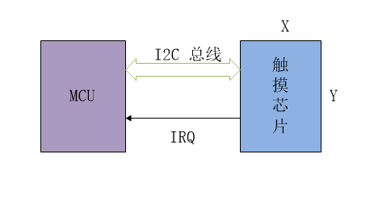

# TOUCH 设备

## Touch 简介

Touch（触摸芯片）是 UI 设计中进行人机交互重要的一部分，一个完整的 UI 设计应该包括输入信息和输出信息，LCD 等屏幕设备负责显示输出，那么 Touch 设备就负责触点信息采集作为信息输入。

Touch 设备与主机通讯一般都是采用 I2C 总线协议来进行数据交互，所以一个 Touch 设备，就是一个标准的 I2C 从设备，而且为了提高接收 Touch 数据的实时性，触摸芯片都会提供中断支持，当有触摸事件(抬起，按下，移动)发生时，会触发中断通知 MCU 有触摸事件。主机可以通过中断回调函数去读取触摸点信息。

Touch 设备与主机通讯连接如下图所示：

 

RT-Thread 为了方便使用 Touch 设备，抽象出了 Touch 设备驱动框架，并且向上层提供统一的操作接口，提高上层代码的可重用性。

### Touch 设备特性

- 接口：标准 device 接口(open/close/read/control)。
- 工作模式：支持中断和轮询两种模式。
- 支持读取多点数据

点击 [Touch 列表](touch_list.md)，查看当前支持的 Touch 类型。


## 访问 Touch 设备

应用程序通过 RT-Thread 提供的 I/O 设备管理接口来访问 Touch 设备，相关接口如下所示：

| **函数**                    | **描述**                                   |
| --------------------------- | ------------------------------------------ |
| rt_device_find()            | 根据 Touch 设备设备名称查找设备获取设备句柄 |
| rt_device_open()            | 打开 Touch 设备                             |
| rt_device_read()            | 读取触点数据                                   |
| rt_device_control()         | 控制 Touch 设备                             |
| rt_device_set_rx_indicate() | 设置接收回调函数                           |
| rt_device_close()           | 关闭 Touch 设备                             |

### 查找 Touch 设备

应用程序根据 Touch 设备名称获取设备句柄，进而可以操作 Touch 设备，查找设备函数如下所示：

```c
rt_device_t rt_device_find(const char* name);
```

| **参数** | **描述**                           |
| -------- | ---------------------------------- |
| name     | Touch 设备名称                           |
| **返回** | ——                                 |
| 设备句柄 | 查找到对应设备将返回相应的设备句柄 |
| RT_NULL  | 没有找到相应的设备对象             |

使用示例如下所示：
```c
#define TOUCH_DEVICE_NAME    "touch_gt"    /* Touch 设备名称 */

static rt_device_t touch_dev;             /* Touch 设备句柄 */
/* 根据设备名称查找 Touch 设备，获取设备句柄 */
touch_dev = rt_device_find(TOUCH_DEVICE_NAME);
```

### 打开 Touch 设备

通过设备句柄，应用程序可以打开和关闭设备，通过如下函数打开设备:

```c
rt_err_t rt_device_open(rt_device_t dev, rt_uint16_t oflags);
```

| **参数**   | **描述**                         |
| ---------- | ------------------------------- |
| dev        | 设备句柄                        |
| oflags     | 设备模式标志                     |
| **返回**   | ——                             |
| RT_EOK     | 设备打开成功                |
| -RT_EBUSY  | 如果设备注册时指定的参数中包括 RT_DEVICE_FLAG_STANDALONE 参数，此设备将不允许重复打开 |
| -RT_EINVAL  | 不支持的打开参数 |
| 其他错误码 | 设备打开失败                |

oflags 参数支持下列参数：

```c
#define RT_DEVICE_FLAG_RDONLY       0x001     /* 标准设备的只读模式，对应 Touch 的轮询模式 */
#define RT_DEVICE_FLAG_INT_RX       0x100     /* 中断接收模式 */
```

Touch 设备数据接收和发送数据的模式分为 2 种：中断模式和轮询模式。在使用的时候，这 2 种模式只能**选其一**，若 Touch 的打开参数 oflags 没有指定使用中断模式，则默认使用轮询模式。

以轮询模式打开 Touch 设备使用示例如下所示：

```c
rt_device_open(touch_dev, RT_DEVICE_FLAG_RDONLY)
```

以中断模式打开 Touch 设备使用示例如下所示：
```c
rt_device_open(touch_dev, RT_DEVICE_FLAG_INT_RX)
```

### 控制 Touch 设备

通过命令控制字，应用程序可以对 Touch 设备进行配置，通过如下函数完成：

```c
rt_err_t rt_device_control(rt_device_t dev, rt_uint8_t cmd, void* arg);
```

| **参数**   | **描述**                                   |
| ---------- | ------------------------------------------ |
| dev        | 设备句柄                                   |
| cmd        | 命令控制字，详细介绍见下面 |
| arg        | 控制的参数, 详细介绍见下面  |
| **返回**   | ——                                         |
| RT_EOK     | 函数执行成功                               |
| -RT_ENOSYS | 执行失败，dev 为空                         |
| 其他错误码 | 执行失败                                   |

其中的 cmd 目前支持以下几种命令控制字

```c
#define  RT_TOUCH_CTRL_GET_ID            (0)   /* 读设备ID */
#define  RT_TOUCH_CTRL_GET_INFO          (1)   /* 获取设备信息 */
#define  RT_TOUCH_CTRL_SET_MODE          (2)   /* 设置工作模式 */
#define  RT_TOUCH_CTRL_SET_X_RANGE       (3)   /* 设置 X 轴分辨率  */
#define  RT_TOUCH_CTRL_SET_Y_RANGE       (4)   /* 设置 Y 轴分辨率 */
#define  RT_TOUCH_CTRL_SET_X_TO_Y        (5)   /* 交换 X、Y 轴坐标 */
#define  RT_TOUCH_CTRL_DISABLE_INT       (6)   /* 失能中断 */
#define  RT_TOUCH_CTRL_ENABLE_INT        (7)   /* 使能中断 */
```


#### 读设备ID

```c
rt_uint8_t read_id[4];
rt_device_control(touch_dev, RT_TOUCH_CTRL_GET_ID, read_id);
LOG_I("id = %d %d %d %d \n", read_id[0] - '0', read_id[1] - '0', read_id[2] - '0', read_id[3] - '0');
```

#### 获取设备信息

```c
struct rt_touch_info info;
rt_device_control(touch_dev, RT_TOUCH_CTRL_GET_INFO, &info);
LOG_I("type       :%d", info.type);                       /* 类型：电容型/电阻型*/
LOG_I("vendor     :%s", info.vendor);                     /* 厂商 */
LOG_I("point_num  :%d", info.point_num);                  /* 支持的触点个数 */
LOG_I("range_x    :%d", info.range_x);                    /* X 轴分辨率 */
LOG_I("range_y    :%d", info.range_y);                    /* Y 轴分辨率*/
```
#### 设置工作模式

```c
/* 设置工作模式为中断模式 */
rt_device_control(touch_dev, RT_TOUCH_CTRL_SET_MODE, (void *)RT_DEVICE_FLAG_INT_RX);
/* 设置工作模式为轮询模式 */
rt_device_control(touch_dev, RT_TOUCH_CTRL_SET_MODE, (void *)RT_DEVICE_FLAG_RDONLY);
```

#### 设置 X 轴范围

设置 Touch X 轴坐标的分辨率。

```c
rt_uint16_t x = 400;
rt_device_control(touch_dev, RT_TOUCH_CTRL_SET_X_RANGE, &x);
```

#### 设置 Y 轴范围

设置 Touch Y 轴坐标的分辨率。
```c
rt_uint16_t y = 400;
rt_device_control(touch_dev, RT_TOUCH_CTRL_SET_Y_RANGE, &y);
```

#### 交换 X、Y 轴坐标

```c
rt_device_control(touch_dev, RT_TOUCH_CTRL_SET_X_TO_Y, RT_NULL);
```

#### 关闭 Touch 关闭中断

```c
rt_device_control(touch_dev, RT_TOUCH_CTRL_DISABLE_INT, RT_NULL);
```

#### 开启 Touch 设备中断

```c
rt_device_control(touch_dev, RT_TOUCH_CTRL_ENABLE_INT, RT_NULL);
```

当使用中断模式读取触点数据时，底层有触摸事件发生时会触发中断，由于中断触发的速度会大于 Touch 设备读取的速速(I2C 读取数据一般较慢)，所以，在接收回调函数中需要关闭中断，然后再释放信号量，在触点信息读取线程中，请求到信号量之后会去读取数据，数据读取完成再去打开中断。注意打开中断接口和关闭中断接口需配对使用，打开一次中断对应要关闭一次中断，这样设备才能以正常的中断模式去读取数据。


### 设置接收回调函数

可以通过如下函数来设置数据接收指示，当 Touch 收到数据时，通知上层应用线程有数据到达 ：

```c
rt_err_t rt_device_set_rx_indicate(rt_device_t dev, rt_err_t (*rx_ind)(rt_device_t dev,rt_size_t size));
```

| **参数** | **描述**     |
| -------- | ------------ |
| dev      | 设备句柄     |
| rx_ind   | 回调函数指针 |
| dev      | 设备句柄（回调函数参数）|
| size     | 缓冲区数据大小（回调函数参数）|
| **返回** | ——           |
| RT_EOK   | 设置成功     |

该函数的回调函数由调用者提供。若 Touch 设备以中断接收模式打开，当 Touch 接收到数据产生中断时，就会调用回调函数，把 Touch 设备句柄放在 dev 参数里供调用者获取。

### 读 Touch 设备触摸点信息

#### 触点信息组成
```c
struct rt_touch_data
{
    rt_uint8_t          event;
    rt_uint8_t          track_id;
    rt_uint8_t          width;
    rt_uint16_t         x_coordinate;
    rt_uint16_t         y_coordinate;
    rt_tick_t           timestamp;
};
```
* event：触摸事件，包括抬起事件、按下事件和移动事件。
* track_id：每个触摸点都有自己的触摸轨迹，这个数据用来保存触摸轨迹 ID。
* width：触摸点宽度。
* x_coordinate：触摸点 X 轴坐标。
* y_coordinate：触摸点 Y 轴坐标。
* timestamp：触摸事件时间戳。

#### 读取触摸点信息接口

可调用如下接口读取触摸点信息：

```c
rt_size_t rt_device_read(rt_device_t dev, rt_off_t pos, void* buffer, rt_size_t size);
```

| **参数**           | **描述**                                       |
| ------------------ | ---------------------------------------------- |
| dev                | 设备句柄                                       |
| pos                | 读取数据偏移量，此参数 Touch 未使用                 |
| buffer             | 缓冲区指针，读取的数据将会被保存在缓冲区中 |
| size               | Touch 设备驱动框架根据这个参数来确定需要读取的触点个数                                |
| **返回**           | ——                                             |
| 读到数据的实际大小 | 返回读取到的触点信息的个数         |
| 0                  | 需要读取当前线程的 errno 来判断错误状态          |

读取一个触摸点信息的代码片段如下：
```c
struct rt_touch_data *read_data;
read_data = (struct rt_touch_data *)rt_malloc(sizeof(struct rt_touch_data));

if (rt_device_read(touch_dev, 0, read_data, 1) == 1)
{
    rt_kprintf("%d %d %d %d %d\n", read_data->track_id, read_data->x_coordinate, 
               read_data->y_coordinate, read_data->timestamp, read_data->width);
}
```

读取五个触摸点信息的代码片段如下：
```c
struct rt_touch_data *read_data;
read_data = (struct rt_touch_data *)rt_malloc(sizeof(struct rt_touch_data) * 5);

if (rt_device_read(dev, 0, read_data, 5) == 5)
{
    for (rt_uint8_t i = 0; i < 5; i++)
    {
        if (read_data[i].event == RT_TOUCH_EVENT_DOWN || read_data[i].event == RT_TOUCH_EVENT_MOVE)
        {
            rt_kprintf("%d %d %d %d %d\n",
                        read_data[i].track_id,
                        read_data[i].x_coordinate,
                        read_data[i].y_coordinate,
                        read_data[i].timestamp,
                        read_data[i].width);
        }
    }
}
```

### 关闭 Touch 设备

当应用程序完成 Touch 操作后，可以关闭 Touch 设备，通过如下函数完成:

```c
rt_err_t rt_device_close(rt_device_t dev);
```

| **参数**   | **描述**                           |
| ---------- | ---------------------------------- |
| dev        | 设备句柄                           |
| **返回**   | ——                                 |
| RT_EOK     | 关闭设备成功                       |
| -RT_ERROR  | 设备已经完全关闭，不能重复关闭设备 |
| 其他错误码 | 关闭设备失败                       |

关闭设备接口和打开设备接口需配对使用，打开一次设备对应要关闭一次设备，这样设备才会被完全关闭，否则设备仍处于未关闭状态。

## Touch 设备使用示例

### 中断方式读取五个点的触摸信息

Touch 设备中断方式读取五个点的触摸信息的具体使用方式可以参考如下示例代码，示例代码的主要步骤如下：

1. 首先查找 Touch 设置获取设备句柄。

2. 以中断接收数据的方式打开 Touch 设备。

3. 设置中断接收回调。

4. 创建读取 Touch 数据线程和信号量，在中断接收回调中释放该信号量，在数据接收线程中一直请求信号量，一旦请求到信号量就去读取 Touch 的数据。

```c
static rt_thread_t  gt9147_thread = RT_NULL;
static rt_sem_t     gt9147_sem = RT_NULL;
static rt_device_t  dev = RT_NULL;
static struct       rt_touch_data *read_data;

/* 读取数据线程入口函数 */
static void gt9147_entry(void *parameter)
{
    struct rt_touch_data *read_data;
    read_data = (struct rt_touch_data *)rt_malloc(sizeof(struct rt_touch_data) * 5);

    while (1)
    {
        /* 请求信号量 */
        rt_sem_take(gt9147_sem, RT_WAITING_FOREVER);
        /* 读取五个点的触摸信息 */
        if (rt_device_read(dev, 0, read_data, 5) == 5)
        {
            for (rt_uint8_t i = 0; i < 5; i++)
            {
                if (read_data[i].event == RT_TOUCH_EVENT_DOWN || read_data[i].event == RT_TOUCH_EVENT_MOVE)
                {
                    rt_kprintf("%d %d %d %d %d\n",
                                read_data[i].track_id,
                                read_data[i].x_coordinate,
                                read_data[i].y_coordinate,
                                read_data[i].timestamp,
                                read_data[i].width);
                }
            }
        }
        /* 打开中断 */
        rt_device_control(dev, RT_TOUCH_CTRL_ENABLE_INT, RT_NULL);
    }
}

/* 接收回调函数 */
static rt_err_t rx_callback(rt_device_t dev, rt_size_t size)
{
    /* 关闭中断 */
    rt_device_control(dev, RT_TOUCH_CTRL_DISABLE_INT, RT_NULL);
    /* 释放信号量 */
    rt_sem_release(gt9147_sem);
    return 0;
}

static int gt9147_sample(void)
{
    /* 查找 Touch 设备 */
    dev = rt_device_find("touch");

    if (dev == RT_NULL)
    {
        rt_kprintf("can't find device:%s\n", "touch");
        return -1;
    }
    /* 以中断的方式打开设备 */
    if (rt_device_open(dev, RT_DEVICE_FLAG_INT_RX) != RT_EOK)
    {
        rt_kprintf("open device failed!");
        return -1;
    }
    /* 设置接收回调 */
    rt_device_set_rx_indicate(dev, rx_callback);
    /* 创建信号量 */
    gt9147_sem = rt_sem_create("dsem", 0, RT_IPC_FLAG_PRIO);

    if (gt9147_sem == RT_NULL)
    {
        rt_kprintf("create dynamic semaphore failed.\n");
        return -1;
    }
    /* 创建读取数据线程 */
    gt9147_thread = rt_thread_create("thread1",
                                     gt9147_entry,
                                     RT_NULL,
                                     THREAD_STACK_SIZE,
                                     THREAD_PRIORITY,
                                     THREAD_TIMESLICE);
    /* 启动线程 */
    if (gt9147_thread != RT_NULL)
        rt_thread_startup(gt9147_thread);

    return 0;
}
MSH_CMD_EXPORT(gt9147_sample, gt9147 sample);

```
