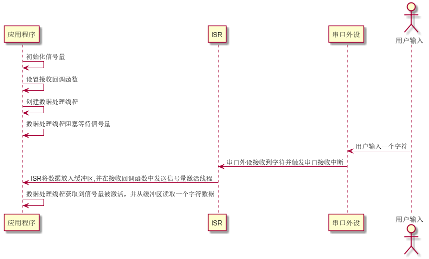
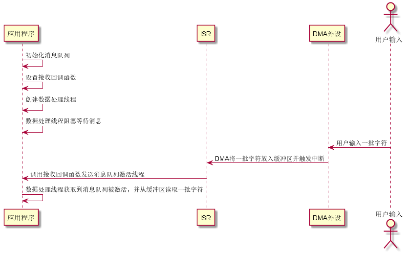

# UART 设备

## UART 简介

UART（Universal Asynchronous Receiver/Transmitter）通用异步收发传输器，UART 作为异步串口通信协议的一种，工作原理是将传输数据的每个字符一位接一位地传输。是在应用程序开发过程中使用频率最高的数据总线。

UART 串口的特点是将数据一位一位地顺序传送，只要 2 根传输线就可以实现双向通信，一根线发送数据的同时用另一根线接收数据。UART 串口通信有几个重要的参数，分别是波特率、起始位、数据位、停止位和奇偶检验位，对于两个使用 UART 串口通信的端口，这些参数必须匹配，否则通信将无法正常完成。UART 串口传输的数据格式如下图所示：


* 起始位：表示数据传输的开始，电平逻辑为 “0” 。

* 数据位：可能值有 5、6、7、8、9，表示传输这几个 bit 位数据。一般取值为 8，因为一个 ASCII 字符值为 8 位。

* 奇偶校验位：用于接收方对接收到的数据进行校验，校验 “1” 的位数为偶数(偶校验)或奇数(奇校验)，以此来校验数据传送的正确性，使用时不需要此位也可以。

* 停止位： 表示一帧数据的结束。电平逻辑为 “1”。

* 波特率：串口通信时的速率，它用单位时间内传输的二进制代码的有效位(bit)数来表示，其单位为每秒比特数 bit/s(bps)。常见的波特率值有 4800、9600、14400、38400、115200等，数值越大数据传输的越快，波特率为 115200 表示每秒钟传输 115200 位数据。

## 访问串口设备

应用程序通过 RT-Thread提供的 I/O 设备管理接口来访问串口硬件，相关接口如下所示：

| **函数** | **描述**                           |
| --------------------------- | -------------------------- |
| rt_device_find()  | 查找设备   |
| rt_device_open()     | 打开设备  |
| rt_device_read()   | 读取数据 |
| rt_device_write()  |写入数据|
| rt_device_control()  | 控制设备  |
| rt_device_set_rx_indicate()   | 设置接收回调函数   |
| rt_device_set_tx_complete()  | 设置发送完成回调函数 |
| rt_device_close()     | 关闭设备|

### 查找串口设备

应用程序根据串口设备名称获取设备句柄，进而可以操作串口设备，查找设备函数如下所示，

```c
rt_device_t rt_device_find(const char* name);
```

| **参数** | **描述**                           |
| -------- | ---------------------------------- |
| name     | 设备名称                           |
| **返回** | ——                                 |
| 设备句柄 | 查找到对应设备将返回相应的设备句柄 |
| RT_NULL  | 没有找到相应的设备对象             |

一般情况下，注册到系统的串口设备名称为 uart0，uart1等，使用示例如下所示：

```c
#define SAMPLE_UART_NAME       "uart2"    /* 串口设备名称 */
static rt_device_t serial;                /* 串口设备句柄 */
/* 查找串口设备 */
serial = rt_device_find(SAMPLE_UART_NAME);
```

### 打开串口设备

通过设备句柄，应用程序可以打开和关闭设备，打开设备时，会检测设备是否已经初始化，没有初始化则会默认调用初始化接口初始化设备。通过如下函数打开设备:

```c
rt_err_t rt_device_open(rt_device_t dev, rt_uint16_t oflags);
```

| **参数**   | **描述**                         |
| ---------- | ------------------------------- |
| dev        | 设备句柄                        |
| oflags     | 设备模式标志                     |
| **返回**   | ——                             |
| RT_EOK     | 设备打开成功                |
| -RT_EBUSY  | 如果设备注册时指定的参数中包括 RT_DEVICE_FLAG_STANDALONE 参数，此设备将不允许重复打开 |
| 其他错误码 | 设备打开失败                |

oflags 参数支持下列取值 (可以采用或的方式支持多种取值)：

```c
#define RT_DEVICE_FLAG_STREAM       0x040     /* 流模式      */
/* 接收模式参数 */
#define RT_DEVICE_FLAG_INT_RX       0x100     /* 中断接收模式 */
#define RT_DEVICE_FLAG_DMA_RX       0x200     /* DMA 接收模式 */
/* 发送模式参数 */
#define RT_DEVICE_FLAG_INT_TX       0x400     /* 中断发送模式 */
#define RT_DEVICE_FLAG_DMA_TX       0x800     /* DMA 发送模式 */
```

串口数据接收和发送数据的模式分为 3 种：中断模式、轮询模式、DMA 模式。在使用的时候，这 3 种模式只能**选其一**，若串口的打开参数 oflags 没有指定使用中断模式或者 DMA 模式，则默认使用轮询模式。

DMA（Direct Memory Access）即直接存储器访问。 DMA 传输方式无需 CPU 直接控制传输，也没有中断处理方式那样保留现场和恢复现场的过程，通过 DMA 控制器为 RAM 与 I/O 设备开辟一条直接传送数据的通路，这就节省了 CPU 的资源来做其他操作。使用 DMA 传输可以连续获取或发送一段信息而不占用中断或延时，在通信频繁或有大段信息要传输时非常有用。

> [!NOTE]
> 注：* RT_DEVICE_FLAG_STREAM：流模式用于向串口终端输出字符串：当输出的字符是 `"\n"` （对应 16 进制值为 0x0A）时，自动在前面输出一个 `"\r"`（对应 16 进制值为 0x0D） 做分行。

流模式 RT_DEVICE_FLAG_STREAM 可以和接收发送模式参数使用或 “|” 运算符一起使用。

以**中断接收及轮询发送模式**使用串口设备的示例如下所示：

```c
#define SAMPLE_UART_NAME       "uart2"    /* 串口设备名称 */
static rt_device_t serial;                /* 串口设备句柄 */
/* 查找串口设备 */
serial = rt_device_find(SAMPLE_UART_NAME);

/* 以中断接收及轮询发送模式打开串口设备 */
rt_device_open(serial, RT_DEVICE_FLAG_INT_RX);
```

若串口要使用 DMA 接收模式，oflags 取值 RT_DEVICE_FLAG_DMA_RX。以**DMA 接收及轮询发送模式**使用串口设备的示例如下所示：

```c
#define SAMPLE_UART_NAME       "uart2"  /* 串口设备名称 */
static rt_device_t serial;              /* 串口设备句柄 */
/* 查找串口设备 */
serial = rt_device_find(SAMPLE_UART_NAME);

/* 以 DMA 接收及轮询发送模式打开串口设备 */
rt_device_open(serial, RT_DEVICE_FLAG_DMA_RX);
```

### 控制串口设备

通过控制接口，应用程序可以对串口设备进行配置，如波特率、数据位、校验位、接收缓冲区大小、停止位等参数的修改。控制函数如下所示：

```c
rt_err_t rt_device_control(rt_device_t dev, rt_uint8_t cmd, void* arg);
```

| **参数**   | **描述**                                       |
| ---------- | ---------------------------------------------- |
| dev        | 设备句柄                                       |
| cmd        | 命令控制字，可取值：RT_DEVICE_CTRL_CONFIG      |
| arg        | 控制的参数，可取类型： struct serial_configure |
| **返回**   | ——                                             |
| RT_EOK     | 函数执行成功                                   |
| -RT_ENOSYS | 执行失败，dev 为空                             |
| 其他错误码 | 执行失败                                       |

控制参数结构体 struct serial_configure 原型如下：

```c
struct serial_configure
{
    rt_uint32_t baud_rate;            /* 波特率 */
    rt_uint32_t data_bits    :4;      /* 数据位 */
    rt_uint32_t stop_bits    :2;      /* 停止位 */
    rt_uint32_t parity       :2;      /* 奇偶校验位 */
    rt_uint32_t bit_order    :1;      /* 高位在前或者低位在前 */
    rt_uint32_t invert       :1;      /* 模式 */
    rt_uint32_t bufsz        :16;     /* 接收数据缓冲区大小 */
    rt_uint32_t reserved     :4;      /* 保留位 */
};
```

RT-Thread 提供的配置参数可取值为如下宏定义：

```c
/* 波特率可取值 */
#define BAUD_RATE_2400                  2400
#define BAUD_RATE_4800                  4800
#define BAUD_RATE_9600                  9600
#define BAUD_RATE_19200                 19200
#define BAUD_RATE_38400                 38400
#define BAUD_RATE_57600                 57600
#define BAUD_RATE_115200                115200
#define BAUD_RATE_230400                230400
#define BAUD_RATE_460800                460800
#define BAUD_RATE_921600                921600
#define BAUD_RATE_2000000               2000000
#define BAUD_RATE_3000000               3000000
/* 数据位可取值 */
#define DATA_BITS_5                     5
#define DATA_BITS_6                     6
#define DATA_BITS_7                     7
#define DATA_BITS_8                     8
#define DATA_BITS_9                     9
/* 停止位可取值 */
#define STOP_BITS_1                     0
#define STOP_BITS_2                     1
#define STOP_BITS_3                     2
#define STOP_BITS_4                     3
/* 极性位可取值 */
#define PARITY_NONE                     0
#define PARITY_ODD                      1
#define PARITY_EVEN                     2
/* 高低位顺序可取值 */
#define BIT_ORDER_LSB                   0
#define BIT_ORDER_MSB                   1
/* 模式可取值 */
#define NRZ_NORMAL                      0     /* normal mode */
#define NRZ_INVERTED                    1     /* inverted mode */
/* 接收数据缓冲区默认大小 */
#define RT_SERIAL_RB_BUFSZ              64
```

接收缓冲区：当串口使用中断接收模式打开时，串口驱动框架会根据 RT_SERIAL_RB_BUFSZ 大小开辟一块缓冲区用于保存接收到的数据，底层驱动接收到一个数据,都会在中断服务程序里面将数据放入缓冲区。

RT-Thread 提供的默认串口配置如下，即 RT-Thread 系统中默认每个串口设备都使用如下配置：

```c
#define RT_SERIAL_CONFIG_DEFAULT           \
{                                          \
    BAUD_RATE_115200, /* 115200 bits/s */  \
    DATA_BITS_8,      /* 8 databits */     \
    STOP_BITS_1,      /* 1 stopbit */      \
    PARITY_NONE,      /* No parity  */     \
    BIT_ORDER_LSB,    /* LSB first sent */ \
    NRZ_NORMAL,       /* Normal mode */    \
    RT_SERIAL_RB_BUFSZ, /* Buffer size */  \
    0                                      \
}
```

> [!NOTE]
> 注：默认串口配置接收数据缓冲区大小为 RT_SERIAL_RB_BUFSZ，即 64 字节。若一次性数据接收字节数很多，没有及时读取数据，那么缓冲区的数据将会被新接收到的数据覆盖，造成数据丢失，建议调大缓冲区，即通过 control 接口修改。在修改缓冲区大小时请注意，缓冲区大小无法动态改变，只有在 open 设备之前可以配置。open 设备之后，缓冲区大小不可再进行更改。但除缓冲区之外的其他参数，在 open 设备前 / 后，均可进行更改。

若实际使用串口的配置参数与默认配置参数不符，则用户可以通过应用代码进行修改。修改串口配置参数，如波特率、数据位、校验位、缓冲区接收 buffsize、停止位等的示例程序如下：

```c
#define SAMPLE_UART_NAME       "uart2"    /* 串口设备名称 */
static rt_device_t serial;                /* 串口设备句柄 */
struct serial_configure config = RT_SERIAL_CONFIG_DEFAULT;  /* 初始化配置参数 */

/* step1：查找串口设备 */
serial = rt_device_find(SAMPLE_UART_NAME);

/* step2：修改串口配置参数 */
config.baud_rate = BAUD_RATE_9600;        //修改波特率为 9600
config.data_bits = DATA_BITS_8;           //数据位 8
config.stop_bits = STOP_BITS_1;           //停止位 1
config.bufsz     = 128;                   //修改缓冲区 buff size 为 128
config.parity    = PARITY_NONE;           //无奇偶校验位

/* step3：控制串口设备。通过控制接口传入命令控制字，与控制参数 */
rt_device_control(serial, RT_DEVICE_CTRL_CONFIG, &config);

/* step4：打开串口设备。以中断接收及轮询发送模式打开串口设备 */
rt_device_open(serial, RT_DEVICE_FLAG_INT_RX);
```

### 发送数据

向串口中写入数据，可以通过如下函数完成：

```c
rt_size_t rt_device_write(rt_device_t dev, rt_off_t pos, const void* buffer, rt_size_t size);
```

| **参数**   | **描述**                                   |
| ---------- | ------------------------------------------ |
| dev                | 设备句柄                               |
| pos                | 写入数据偏移量，此参数串口设备未使用          |
| buffer             | 内存缓冲区指针，放置要写入的数据       |
| size               | 写入数据的大小                         |
| **返回**           | ——                                     |
| 写入数据的实际大小 | 如果是字符设备，返回大小以字节为单位； |
| 0                  | 需要读取当前线程的 errno 来判断错误状态  |

调用这个函数，会把缓冲区 buffer 中的数据写入到设备 dev 中，写入数据的大小是 size。

向串口写入数据示例程序如下所示：

```c
#define SAMPLE_UART_NAME       "uart2"    /* 串口设备名称 */
static rt_device_t serial;                /* 串口设备句柄 */
char str[] = "hello RT-Thread!\r\n";
struct serial_configure config = RT_SERIAL_CONFIG_DEFAULT; /* 配置参数 */
/* 查找串口设备 */
serial = rt_device_find(SAMPLE_UART_NAME);

/* 以中断接收及轮询发送模式打开串口设备 */
rt_device_open(serial, RT_DEVICE_FLAG_INT_RX);
/* 发送字符串 */
rt_device_write(serial, 0, str, (sizeof(str) - 1));
```

### 设置发送完成回调函数

在应用程序调用 `rt_device_write()` 写入数据时，如果底层硬件能够支持自动发送，那么上层应用可以设置一个回调函数。这个回调函数会在底层硬件数据发送完成后 (例如 DMA 传送完成或 FIFO 已经写入完毕产生完成中断时) 调用。可以通过如下函数设置设备发送完成指示 ：

```c
rt_err_t rt_device_set_tx_complete(rt_device_t dev, rt_err_t (*tx_done)(rt_device_t dev,void *buffer));
```

| **参数** | **描述**     |
| -------- | ------------ |
| dev      | 设备句柄     |
| tx_done  | 回调函数指针 |
| **返回** | ——           |
| RT_EOK   | 设置成功     |

调用这个函数时，回调函数由调用者提供，当硬件设备发送完数据时，由设备驱动程序回调这个函数并把发送完成的数据块地址 buffer 作为参数传递给上层应用。上层应用（线程）在收到指示时会根据发送 buffer 的情况，释放 buffer 内存块或将其作为下一个写数据的缓存。

### 设置接收回调函数

可以通过如下函数来设置数据接收指示，当串口收到数据时，通知上层应用线程有数据到达 ：

```c
rt_err_t rt_device_set_rx_indicate(rt_device_t dev, rt_err_t (*rx_ind)(rt_device_t dev,rt_size_t size));
```

| **参数** | **描述**     |
| -------- | ------------ |
| dev      | 设备句柄     |
| rx_ind   | 回调函数指针 |
| dev      | 设备句柄（回调函数参数）|
| size     | 缓冲区数据大小（回调函数参数）|
| **返回** | ——           |
| RT_EOK   | 设置成功     |

该函数的回调函数由调用者提供。若串口以中断接收模式打开，当串口接收到一个数据产生中断时，就会调用回调函数，并且会把此时缓冲区的数据大小放在 size 参数里，把串口设备句柄放在 dev 参数里供调用者获取。

若串口以 DMA 接收模式打开，当 DMA 完成一批数据的接收后会调用此回调函数。

一般情况下接收回调函数可以发送一个信号量或者事件通知串口数据处理线程有数据到达。使用示例如下所示：

```c
#define SAMPLE_UART_NAME       "uart2"    /* 串口设备名称 */
static rt_device_t serial;                /* 串口设备句柄 */
static struct rt_semaphore rx_sem;    /* 用于接收消息的信号量 */

/* 接收数据回调函数 */
static rt_err_t uart_input(rt_device_t dev, rt_size_t size)
{
    /* 串口接收到数据后产生中断，调用此回调函数，然后发送接收信号量 */
    rt_sem_release(&rx_sem);

    return RT_EOK;
}

static int uart_sample(int argc, char *argv[])
{
    serial = rt_device_find(SAMPLE_UART_NAME);

    /* 以中断接收及轮询发送模式打开串口设备 */
    rt_device_open(serial, RT_DEVICE_FLAG_INT_RX);

    /* 初始化信号量 */
    rt_sem_init(&rx_sem, "rx_sem", 0, RT_IPC_FLAG_FIFO);

    /* 设置接收回调函数 */
    rt_device_set_rx_indicate(serial, uart_input);
}

```

### 接收数据

可调用如下函数读取串口接收到的数据：

```c
rt_size_t rt_device_read(rt_device_t dev, rt_off_t pos, void* buffer, rt_size_t size);
```

| **参数**           | **描述**                                       |
| ------------------ | ---------------------------------------------- |
| dev                | 设备句柄                                       |
| pos                | 读取数据偏移量，此参数串口设备未使用                 |
| buffer             | 缓冲区指针，读取的数据将会被保存在缓冲区中 |
| size               | 读取数据的大小                                 |
| **返回**           | ——                                             |
| 读到数据的实际大小 | 如果是字符设备，返回大小以字节为单位           |
| 0                  | 需要读取当前线程的 errno 来判断错误状态          |

读取数据偏移量 pos 针对字符设备无效，此参数主要用于块设备中。

串口使用中断接收模式并配合接收回调函数的使用示例如下所示：

```c
static rt_device_t serial;                /* 串口设备句柄 */
static struct rt_semaphore rx_sem;    /* 用于接收消息的信号量 */

/* 接收数据的线程 */
static void serial_thread_entry(void *parameter)
{
    char ch;

    while (1)
    {
        /* 从串口读取一个字节的数据，没有读取到则等待接收信号量 */
        while (rt_device_read(serial, -1, &ch, 1) != 1)
        {
            /* 阻塞等待接收信号量，等到信号量后再次读取数据 */
            rt_sem_take(&rx_sem, RT_WAITING_FOREVER);
        }
        /* 读取到的数据通过串口错位输出 */
        ch = ch + 1;
        rt_device_write(serial, 0, &ch, 1);
    }
}
```

### 关闭串口设备

当应用程序完成串口操作后，可以关闭串口设备，通过如下函数完成:

```c
rt_err_t rt_device_close(rt_device_t dev);
```

| **参数**   | **描述**                           |
| ---------- | ---------------------------------- |
| dev        | 设备句柄                           |
| **返回**   | ——                                 |
| RT_EOK     | 关闭设备成功                       |
| -RT_ERROR  | 设备已经完全关闭，不能重复关闭设备 |
| 其他错误码 | 关闭设备失败                       |

关闭设备接口和打开设备接口需配对使用，打开一次设备对应要关闭一次设备，这样设备才会被完全关闭，否则设备仍处于未关闭状态。

## 串口设备使用示例

### 中断接收及轮询发送

示例代码的主要步骤如下所示：

1. 首先查找串口设备获取设备句柄。

2. 初始化回调函数发送使用的信号量，然后以读写及中断接收方式打开串口设备。

3. 设置串口设备的接收回调函数，之后发送字符串，并创建读取数据线程。

* 读取数据线程会尝试读取一个字符数据，如果没有数据则会挂起并等待信号量，当串口设备接收到一个数据时会触发中断并调用接收回调函数，此函数会发送信号量唤醒线程，此时线程会马上读取接收到的数据。

* 此示例代码不局限于特定的 BSP，根据 BSP 注册的串口设备，修改示例代码宏定义 SAMPLE_UART_NAME 对应的串口设备名称即可运行。

运行序列图如下图所示：




```c
/*
 * 程序清单：这是一个 串口 设备使用例程
 * 例程导出了 uart_sample 命令到控制终端
 * 命令调用格式：uart_sample uart2
 * 命令解释：命令第二个参数是要使用的串口设备名称，为空则使用默认的串口设备
 * 程序功能：通过串口输出字符串"hello RT-Thread!"，然后错位输出输入的字符
*/

#include <rtthread.h>

#define SAMPLE_UART_NAME       "uart2"

/* 用于接收消息的信号量 */
static struct rt_semaphore rx_sem;
static rt_device_t serial;

/* 接收数据回调函数 */
static rt_err_t uart_input(rt_device_t dev, rt_size_t size)
{
    /* 串口接收到数据后产生中断，调用此回调函数，然后发送接收信号量 */
    rt_sem_release(&rx_sem);

    return RT_EOK;
}

static void serial_thread_entry(void *parameter)
{
    char ch;

    while (1)
    {
        /* 从串口读取一个字节的数据，没有读取到则等待接收信号量 */
        while (rt_device_read(serial, -1, &ch, 1) != 1)
        {
            /* 阻塞等待接收信号量，等到信号量后再次读取数据 */
            rt_sem_take(&rx_sem, RT_WAITING_FOREVER);
        }
        /* 读取到的数据通过串口错位输出 */
        ch = ch + 1;
        rt_device_write(serial, 0, &ch, 1);
    }
}

static int uart_sample(int argc, char *argv[])
{
    rt_err_t ret = RT_EOK;
    char uart_name[RT_NAME_MAX];
    char str[] = "hello RT-Thread!\r\n";

    if (argc == 2)
    {
        rt_strncpy(uart_name, argv[1], RT_NAME_MAX);
    }
    else
    {
        rt_strncpy(uart_name, SAMPLE_UART_NAME, RT_NAME_MAX);
    }

    /* 查找系统中的串口设备 */
    serial = rt_device_find(uart_name);
    if (!serial)
    {
        rt_kprintf("find %s failed!\n", uart_name);
        return RT_ERROR;
    }

    /* 初始化信号量 */
    rt_sem_init(&rx_sem, "rx_sem", 0, RT_IPC_FLAG_FIFO);
    /* 以中断接收及轮询发送模式打开串口设备 */
    rt_device_open(serial, RT_DEVICE_FLAG_INT_RX);
    /* 设置接收回调函数 */
    rt_device_set_rx_indicate(serial, uart_input);
    /* 发送字符串 */
    rt_device_write(serial, 0, str, (sizeof(str) - 1));

    /* 创建 serial 线程 */
    rt_thread_t thread = rt_thread_create("serial", serial_thread_entry, RT_NULL, 1024, 25, 10);
    /* 创建成功则启动线程 */
    if (thread != RT_NULL)
    {
        rt_thread_startup(thread);
    }
    else
    {
        ret = RT_ERROR;
    }

    return ret;
}
/* 导出到 msh 命令列表中 */
MSH_CMD_EXPORT(uart_sample, uart device sample);
```

### DMA 接收及轮询发送

当串口接收到一批数据后会调用接收回调函数，接收回调函数会把此时缓冲区的数据大小通过消息队列发送给等待的数据处理线程。线程获取到消息后被激活，并读取数据。一般情况下 DMA 接收模式会结合 DMA 接收完成中断和串口空闲中断完成数据接收。

* 此示例代码不局限于特定的 BSP，根据 BSP 注册的串口设备，修改示例代码宏定义 SAMPLE_UART_NAME 对应的串口设备名称即可运行。

运行序列图如下图所示：



```c
/*
 * 程序清单：这是一个串口设备 DMA 接收使用例程
 * 例程导出了 uart_dma_sample 命令到控制终端
 * 命令调用格式：uart_dma_sample uart3
 * 命令解释：命令第二个参数是要使用的串口设备名称，为空则使用默认的串口设备
 * 程序功能：通过串口输出字符串"hello RT-Thread!"，并通过串口输出接收到的数据，然后打印接收到的数据。
*/

#include <rtthread.h>

#define SAMPLE_UART_NAME       "uart3"      /* 串口设备名称 */

/* 串口接收消息结构*/
struct rx_msg
{
    rt_device_t dev;
    rt_size_t size;
};
/* 串口设备句柄 */
static rt_device_t serial;
/* 消息队列控制块 */
static struct rt_messagequeue rx_mq;

/* 接收数据回调函数 */
static rt_err_t uart_input(rt_device_t dev, rt_size_t size)
{
    struct rx_msg msg;
    rt_err_t result;
    msg.dev = dev;
    msg.size = size;

    result = rt_mq_send(&rx_mq, &msg, sizeof(msg));
    if ( result == -RT_EFULL)
    {
        /* 消息队列满 */
        rt_kprintf("message queue full！\n");
    }
    return result;
}

static void serial_thread_entry(void *parameter)
{
    struct rx_msg msg;
    rt_err_t result;
    rt_uint32_t rx_length;
    static char rx_buffer[RT_SERIAL_RB_BUFSZ + 1];

    while (1)
    {
        rt_memset(&msg, 0, sizeof(msg));
        /* 从消息队列中读取消息*/
        result = rt_mq_recv(&rx_mq, &msg, sizeof(msg), RT_WAITING_FOREVER);
        if (result == RT_EOK)
        {
            /* 从串口读取数据*/
            rx_length = rt_device_read(msg.dev, 0, rx_buffer, msg.size);
            rx_buffer[rx_length] = '\0';
            /* 通过串口设备 serial 输出读取到的消息 */
            rt_device_write(serial, 0, rx_buffer, rx_length);
            /* 打印数据 */
            rt_kprintf("%s\n",rx_buffer);
        }
    }
}

static int uart_dma_sample(int argc, char *argv[])
{
    rt_err_t ret = RT_EOK;
    char uart_name[RT_NAME_MAX];
    static char msg_pool[256];
    char str[] = "hello RT-Thread!\r\n";

    if (argc == 2)
    {
        rt_strncpy(uart_name, argv[1], RT_NAME_MAX);
    }
    else
    {
        rt_strncpy(uart_name, SAMPLE_UART_NAME, RT_NAME_MAX);
    }

    /* 查找串口设备 */
    serial = rt_device_find(uart_name);
    if (!serial)
    {
        rt_kprintf("find %s failed!\n", uart_name);
        return RT_ERROR;
    }

    /* 初始化消息队列 */
    rt_mq_init(&rx_mq, "rx_mq",
               msg_pool,                 /* 存放消息的缓冲区 */
               sizeof(struct rx_msg),    /* 一条消息的最大长度 */
               sizeof(msg_pool),         /* 存放消息的缓冲区大小 */
               RT_IPC_FLAG_FIFO);        /* 如果有多个线程等待，按照先来先得到的方法分配消息 */

    /* 以 DMA 接收及轮询发送方式打开串口设备 */
    rt_device_open(serial, RT_DEVICE_FLAG_DMA_RX);
    /* 设置接收回调函数 */
    rt_device_set_rx_indicate(serial, uart_input);
    /* 发送字符串 */
    rt_device_write(serial, 0, str, (sizeof(str) - 1));

    /* 创建 serial 线程 */
    rt_thread_t thread = rt_thread_create("serial", serial_thread_entry, RT_NULL, 1024, 25, 10);
    /* 创建成功则启动线程 */
    if (thread != RT_NULL)
    {
        rt_thread_startup(thread);
    }
    else
    {
        ret = RT_ERROR;
    }

    return ret;
}
/* 导出到 msh 命令列表中 */
MSH_CMD_EXPORT(uart_dma_sample, uart device dma sample);
```

### 串口接收不定长数据

串口接收不定长数据需要用户在应用层进行处理，一般会有特定的协议，比如一帧数据可能会有起始标记位、数据长度位、数据、终止标记位等，发送数据帧时按照约定的协议进行发送，接收数据时再按照协议进行解析。

以下是一个简单的串口接收不定长数据示例代码，仅做了数据的结束标志位 DATA_CMD_END，如果遇到结束标志，则表示一帧数据结束。示例代码的主要步骤如下所示：

1. 首先查找串口设备获取设备句柄。
2. 初始化回调函数发送使用的信号量，然后以读写及中断接收方式打开串口设备。
3. 设置串口设备的接收回调函数，之后发送字符串，并创建解析数据线程。

- 解析数据线程会尝试读取一个字符数据，如果没有数据则会挂起并等待信号量，当串口设备接收到一个数据时会触发中断并调用接收回调函数，此函数会发送信号量唤醒线程，此时线程会马上读取接收到的数据。在解析数据时，判断结束符，如果结束，则打印数据。
- 此示例代码不局限于特定的 BSP，根据 BSP 注册的串口设备，修改示例代码宏定义 SAMPLE_UART_NAME 对应的串口设备名称即可运行。
- 当一帧数据长度超过最大长度时，这将是一帧不合格的数据，因为后面接收到的字符将覆盖最后一个字符。

```c
/*
 * 程序清单：这是一个串口设备接收不定长数据的示例代码
 * 例程导出了 uart_dma_sample 命令到控制终端
 * 命令调用格式：uart_dma_sample uart2
 * 命令解释：命令第二个参数是要使用的串口设备名称，为空则使用默认的串口设备
 * 程序功能：通过串口 uart2 输出字符串"hello RT-Thread!"，并通过串口 uart2 输入一串字符（不定长），再通过数据解析后，使用控制台显示有效数据。
*/

#include <rtthread.h>

#define SAMPLE_UART_NAME                 "uart2"
#define DATA_CMD_END                     '\r'       /* 结束位设置为 \r，即回车符 */
#define ONE_DATA_MAXLEN                  20         /* 不定长数据的最大长度 */

/* 用于接收消息的信号量 */
static struct rt_semaphore rx_sem;
static rt_device_t serial;

/* 接收数据回调函数 */
static rt_err_t uart_rx_ind(rt_device_t dev, rt_size_t size)
{
    /* 串口接收到数据后产生中断，调用此回调函数，然后发送接收信号量 */
    if (size > 0)
    {
        rt_sem_release(&rx_sem);
    }
    return RT_EOK;
}

static char uart_sample_get_char(void)
{
    char ch;

    while (rt_device_read(serial, 0, &ch, 1) == 0)
    {
        rt_sem_control(&rx_sem, RT_IPC_CMD_RESET, RT_NULL);
        rt_sem_take(&rx_sem, RT_WAITING_FOREVER);
    }
    return ch;
}

/* 数据解析线程 */
static void data_parsing(void)
{
    char ch;
    char data[ONE_DATA_MAXLEN];
    static char i = 0;

    while (1)
    {
        ch = uart_sample_get_char();
        rt_device_write(serial, 0, &ch, 1);
        if(ch == DATA_CMD_END)
        {
            data[i++] = '\0';
            rt_kprintf("data=%s\r\n",data);
            i = 0;
            continue;
        }
        i = (i >= ONE_DATA_MAXLEN-1) ? ONE_DATA_MAXLEN-1 : i;
        data[i++] = ch;
    }
}

static int uart_data_sample(int argc, char *argv[])
{
    rt_err_t ret = RT_EOK;
    char uart_name[RT_NAME_MAX];
    char str[] = "hello RT-Thread!\r\n";

    if (argc == 2)
    {
        rt_strncpy(uart_name, argv[1], RT_NAME_MAX);
    }
    else
    {
        rt_strncpy(uart_name, SAMPLE_UART_NAME, RT_NAME_MAX);
    }

    /* 查找系统中的串口设备 */
    serial = rt_device_find(uart_name);
    if (!serial)
    {
        rt_kprintf("find %s failed!\n", uart_name);
        return RT_ERROR;
    }

    /* 初始化信号量 */
    rt_sem_init(&rx_sem, "rx_sem", 0, RT_IPC_FLAG_FIFO);
    /* 以中断接收及轮询发送模式打开串口设备 */
    rt_device_open(serial, RT_DEVICE_FLAG_INT_RX);
    /* 设置接收回调函数 */
    rt_device_set_rx_indicate(serial, uart_rx_ind);
    /* 发送字符串 */
    rt_device_write(serial, 0, str, (sizeof(str) - 1));

    /* 创建 serial 线程 */
    rt_thread_t thread = rt_thread_create("serial", (void (*)(void *parameter))data_parsing, RT_NULL, 1024, 25, 10);
    /* 创建成功则启动线程 */
    if (thread != RT_NULL)
    {
        rt_thread_startup(thread);
    }
    else
    {
        ret = RT_ERROR;
    }

    return ret;
}

/* 导出到 msh 命令列表中 */
MSH_CMD_EXPORT(uart_data_sample, uart device sample);

```

