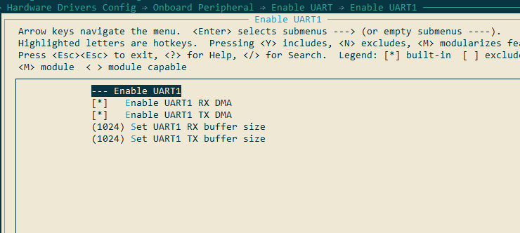
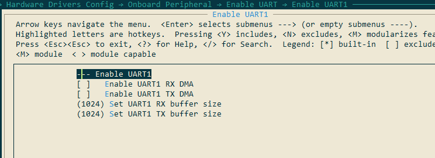
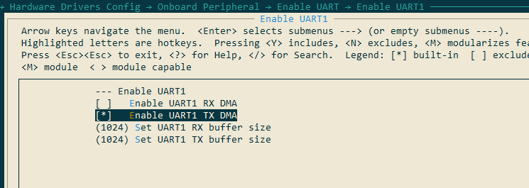
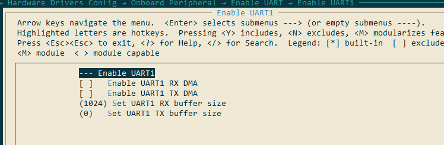
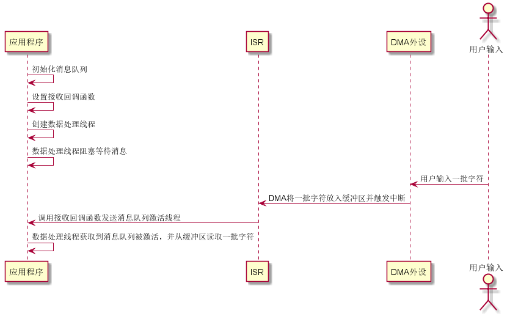

# UART 设备 v2 版本

> [!NOTE]
> 注：目前只有 github 的 master 分支上的 stm32l475-pandora 的 BSP 进行了串口 V2 版本的适配。

> [!NOTE]
> 注：如果用户已经清楚了解[旧版本的串口框架](https://www.rt-thread.org/document/site/#/rt-thread-version/rt-thread-standard/programming-manual/device/uart/uart_v1/uart)，那么可直接跳过该文档的前部分关于串口介绍的内容，从[访问串口设备](uart?id=%e8%ae%bf%e9%97%ae%e4%b8%b2%e5%8f%a3%e8%ae%be%e5%a4%87)章节开始查阅即可。

## UART 简介

UART（Universal Asynchronous Receiver/Transmitter）通用异步收发传输器，UART 作为异步串口通信协议的一种，工作原理是将传输数据的每个字符一位接一位地传输。是在应用程序开发过程中使用频率最高的数据总线。

UART 串口的特点是将数据一位一位地顺序传送，只要 2 根传输线就可以实现双向通信，一根线发送数据的同时用另一根线接收数据。UART 串口通信有几个重要的参数，分别是波特率、起始位、数据位、停止位和奇偶检验位，对于两个使用 UART 串口通信的端口，这些参数必须匹配，否则通信将无法正常完成。UART 串口传输的数据格式如下图所示：


* 起始位：表示数据传输的开始，电平逻辑为 “0” 。

* 数据位：可能值有 5、6、7、8、9，表示传输这几个 bit 位数据。一般取值为 8，因为一个 ASCII 字符值为 8 位。

* 奇偶校验位：用于接收方对接收到的数据进行校验，校验 “1” 的位数为偶数 (偶校验) 或奇数(奇校验)，以此来校验数据传送的正确性，使用时不需要此位也可以。

* 停止位： 表示一帧数据的结束。电平逻辑为 “1”。

* 波特率：串口通信时的速率，它用单位时间内传输的二进制代码的有效位 (bit) 数来表示，其单位为每秒比特数 bit/s(bps)。常见的波特率值有 4800、9600、14400、38400、115200 等，数值越大数据传输的越快，波特率为 115200 表示每秒钟传输 115200 位数据。

## 访问串口设备

应用程序通过 RT-Thread 提供的 I/O 设备管理接口来访问串口硬件，相关接口如下所示：

|  **函数**  | **描述**                            |
| --------------------------- | -------------------------- |
| rt_device_find()  | 查找设备   |
| rt_device_open()     | 打开设备  |
| rt_device_read()   | 读取数据 |
| rt_device_write()  | 写入数据 |
| rt_device_control()  | 控制设备  |
| rt_device_set_rx_indicate()   | 设置接收回调函数   |
| rt_device_set_tx_complete()  | 设置发送完成回调函数 |
| rt_device_close()     | 关闭设备 |

### 查找串口设备

应用程序根据串口设备名称获取设备句柄，进而可以操作串口设备，查找设备函数如下所示，

```c
rt_device_t rt_device_find(const char* name);
```

| **参数**  | **描述**                           |
| -------- | ---------------------------------- |
| name     | 设备名称                           |
| **返回** | ——                                 |
| 设备句柄 | 查找到对应设备将返回相应的设备句柄 |
| RT_NULL  | 没有找到相应的设备对象             |

一般情况下，注册到系统的串口设备名称为 uart0，uart1 等，使用示例如下所示：

```c
#define SAMPLE_UART_NAME       "uart2"    /* 串口设备名称 */
static rt_device_t serial;                /* 串口设备句柄 */
/* 查找串口设备 */
serial = rt_device_find(SAMPLE_UART_NAME);
```

### 打开串口设备

通过设备句柄，应用程序可以打开和关闭设备，打开设备时，会检测设备是否已经初始化，没有初始化则会默认调用初始化接口初始化设备。通过如下函数打开设备:

```c
rt_err_t rt_device_open(rt_device_t dev, rt_uint16_t oflags);
```

| **参数**   | **描述**                         |
| ---------- | ------------------------------- |
| dev        | 设备句柄                        |
| oflags     | 设备模式标志                     |
| **返回**   | ——                             |
| RT_EOK     | 设备打开成功                |
| -RT_EBUSY  | 如果设备注册时指定的参数中包括 RT_DEVICE_FLAG_STANDALONE 参数，此设备将不允许重复打开 |
| 其他错误码 | 设备打开失败                |

oflags 参数支持下列取值 (可以采用或的方式支持多种取值)：

```c
/* 接收模式参数 */
#define RT_DEVICE_FLAG_RX_BLOCKING        0x1000   /* 接收阻塞模式 */

#define RT_DEVICE_FLAG_RX_NON_BLOCKING    0x2000   /* 接收非阻塞模式 */

/* 发送模式参数 */
#define RT_DEVICE_FLAG_TX_BLOCKING        0x4000   /* 发送阻塞模式 */

#define RT_DEVICE_FLAG_TX_NON_BLOCKING    0x8000   /* 发送非阻塞模式 */

#define RT_DEVICE_FLAG_STREAM             0x040     /* 流模式      */
```

用户使用串口时，不再根据硬件工作模式（轮询、中断、DMA）选择，而是根据具体的操作方式去配置，一般情况下，我们会选择使用  发送阻塞模式 以及 接收非阻塞模式 来进行开发。如下例子:

```c
rt_device_open(dev, RT_DEVICE_FLAG_RX_NON_BLOCKING | RT_DEVICE_FLAG_TX_BLOCKING); // 串口设备使用模式为 (发送阻塞 接收非阻塞) 模式
```

> [!NOTE]
> 注：为了避免 阻塞 / 非阻塞模式  和 轮询 / 中断 / DMA 模式 在文中描述上可能存在的误解，故本文以 应用层操作模式 指代 阻塞 / 非阻塞模式，以 硬件工作模式 指代 轮询 / 中断 / DMA 模式。

而对于流模式 `RT_DEVICE_FLAG_STREAM`，主要是当串口外设作为控制台时才会使用，该模式用来解决用户回车换行的问题，在正常的串口外设通信场景中，该模式一般不会使用。

> [!NOTE]
> 注：`RT_DEVICE_FLAG_STREAM` 流模式用于向串口终端输出字符串：当输出的字符是 `"\n"` （对应 16 进制值为 0x0A）时，自动在前面输出一个 `"\r"`（对应 16 进制值为 0x0D） 做分行。

流模式 RT_DEVICE_FLAG_STREAM 可以和接收发送模式参数使用或 “|” 运算符一起使用。

#### 硬件工作模式选择

由于用户层使用串口时，只关心应用层操作模式，不再关心硬件工作模式，使得应用层开发变得更加便捷，也增加了应用程序的可移植性。倘若用户开发时比较关心硬件具体的工作模式，那么应该对其工作模式如何选择？

串口外设的遵循如下规则：

1. 模式优先级为：DMA 模式 > 中断模式 > 轮询模式。即当有 DMA 配置时，默认使用 DMA 模式，以此类推。且非必要条件，不选择使用轮询模式。
2. 串口默认配置接收和发送缓冲区
3. 默认使用阻塞发送、非阻塞接收模式

> [!NOTE]
> 注：由于串口控制台的工作场景的独特性，其硬件工作模式为中断接收和轮询发送，用户使用时不建议参照串口控制台的模式进行配置，建议参照串口设备使用示例进行使用。

为了更加直观的表示应用层操作模式与硬件工作模式的对应关系，下面以图表和示例的方式进行说明。

**发送端的模式对应关系如下表所示：**

| 编号 | 配置发送缓冲区（有 / 无）说明                 | 硬件工作模式（TX） | 应用层操作模式（TX） |
| ---- | --------------------------------------- | ------------------ | -------------------- |
| (1) | **不使用缓存区，且设置缓存区长度为0**   | 轮询               | 阻塞                 |
| (2) | 不支持该模式                            | 轮询               | 非阻塞               |
| (3) | 使用缓存区                              | 中断               | 阻塞                 |
| (4) | 使用缓存区                              | 中断               | 非阻塞               |
| (5) | **不使用缓存区，但需要设置缓冲区长度大于0** | DMA                | 阻塞                 |
| (6) | 使用缓存区                              | DMA                | 非阻塞               |

对于编号 (1) 模式，如果必须使用轮询模式时，一定要将缓冲区大小配置为 0，因为如果缓冲区大小不为 0，在应用层使用发送阻塞模式时，将会使用中断模式（如果开 DMA，则使用 DMA 模式）。

对于编号 (2) 模式，当用户设置为 DMA 阻塞模式时，虽然设置了缓冲区不为 0，但是该缓冲区并不会进行初始化，而是直接进行 DMA 数据搬运。从而省去了内存搬运造成的性能下降的问题。需要注意的是，当使用 DMA 阻塞模式时，虽然不用缓冲区，但是也要将缓冲区长度设置为大于 0 的值，因为当缓冲区长度为 0 时，将会错误地使用轮询模式。

**接收端的模式对应关系如下表所示：**

| 编号 | 配置接收缓冲区（有 / 无）说明           | 硬件工作模式（RX） | 应用层操作模式（RX） |
| ---- | ------------------------------------- | ------------------ | -------------------- |
| (1)  | **不使用缓存区，且设置缓存区长度为0** | 轮询               | 阻塞                 |
| (2)  | 不支持该模式                          | 轮询               | 非阻塞               |
| (3)  | 使用缓存区                            | 中断               | 阻塞                 |
| (4)  | 使用缓存区                            | 中断               | 非阻塞               |
| (5)  | 使用缓存区                            | DMA                | 阻塞                 |
| (6)  | 使用缓存区                            | DMA                | 非阻塞               |

对于编号 (1) 模式，如果必须使用轮询模式时，一定要将缓冲区大小配置为 0，因为如果缓冲区大小不为 0，在应用层使用接收阻塞模式时，将会使用中断模式（如果开 DMA，则使用 DMA 模式）。

下面举例说明如何配置硬件工作模式：

##### 配置发送接收为 DMA 模式

在 menuconfig 中配置效果如下：



上图所示，对于 UART1 的配置为开启 DMA RX 和 DMA TX，且发送和接收缓存区大小设置为 1024 字节。

由此用户在应用层对串口的接收和发送的操作模式进行配置时，无论配置阻塞或者非阻塞，均使用的是 DMA 模式。

##### 配置发送接收为中断模式

在 menuconfig 中配置效果如下：



上图所示，对于 UART1 的配置为关闭 DMA RX 和 DMA TX，且发送和接收缓存区大小设置为 1024 字节。

由此用户在应用层对串口的接收和发送的操作模式进行配置时，无论配置阻塞或者非阻塞，均使用的是中断模式。

##### 配置发送 DMA 模式、接收中断模式

在 menuconfig 中配置效果如下：



上图所示，对于 UART1 的配置为关闭 DMA RX 和开启 DMA TX，且发送和接收缓存区大小设置为 1024 字节。

由此用户在应用层对串口的接收和发送的操作模式进行配置时，无论配置阻塞或者非阻塞，均使用的是 DMA 发送模式和中断接收模式。

##### 配置发送轮询模式、接收中断模式（串口控制台默认模式）

在 menuconfig 中配置效果如下：



上图所示，对于 UART1 的配置为关闭 DMA RX 和 DMA TX，且发送和接收缓存区大小设置为 1024 字节。并且设置 `UART1 TX buffer size` 为 0。

由此用户在应用层对串口的接收和发送的操作模式进行配置时，发送只能使用阻塞模式，接收可以使用阻塞和非阻塞模式。串口控制台默认使用这样的配置模式，且操作模式为阻塞发送和非阻塞接收。

串口数据接收和发送数据的模式分为 3 种：中断模式、轮询模式、DMA 模式。在使用的时候，这 3 种模式只能**选其一**，若串口的打开参数 oflags 没有指定使用中断模式或者 DMA 模式，则默认使用轮询模式。

### 控制串口设备

通过控制接口，应用程序可以对串口设备进行配置，如波特率、数据位、校验位、接收缓冲区大小、停止位等参数的修改。控制函数如下所示：

```c
rt_err_t rt_device_control(rt_device_t dev, rt_uint8_t cmd, void* arg);
```

| **参数**   | **描述**                                       |
| ---------- | ---------------------------------------------- |
| dev        | 设备句柄                                       |
| cmd        | 命令控制字，可取值：RT_DEVICE_CTRL_CONFIG      |
| arg        | 控制的参数，可取类型： struct serial_configure |
| **返回**   | ——                                             |
| RT_EOK     | 函数执行成功                                   |
| -RT_ENOSYS | 执行失败，dev 为空                             |
| 其他错误码 | 执行失败                                       |

控制参数结构体 struct serial_configure 原型如下：

```c
struct serial_configure
{
    rt_uint32_t baud_rate;            /* 波特率 */
    rt_uint32_t data_bits    :4;      /* 数据位 */
    rt_uint32_t stop_bits    :2;      /* 停止位 */
    rt_uint32_t parity       :2;      /* 奇偶校验位 */
    rt_uint32_t bit_order    :1;      /* 高位在前或者低位在前 */
    rt_uint32_t invert       :1;      /* 模式 */
    rt_uint32_t rx_bufsz     :16;     /* 接收数据缓冲区大小 */
    rt_uint32_t tx_bufsz     :16;     /* 发送数据缓冲区大小 */
    rt_uint32_t reserved     :4;      /* 保留位 */
};
```

RT-Thread 提供的配置参数可取值为如下宏定义：

```c
/* 波特率可取值 */
#define BAUD_RATE_2400                  2400
#define BAUD_RATE_4800                  4800
#define BAUD_RATE_9600                  9600
#define BAUD_RATE_19200                 19200
#define BAUD_RATE_38400                 38400
#define BAUD_RATE_57600                 57600
#define BAUD_RATE_115200                115200
#define BAUD_RATE_230400                230400
#define BAUD_RATE_460800                460800
#define BAUD_RATE_921600                921600
#define BAUD_RATE_2000000               2000000
#define BAUD_RATE_3000000               3000000
/* 数据位可取值 */
#define DATA_BITS_5                     5
#define DATA_BITS_6                     6
#define DATA_BITS_7                     7
#define DATA_BITS_8                     8
#define DATA_BITS_9                     9
/* 停止位可取值 */
#define STOP_BITS_1                     0
#define STOP_BITS_2                     1
#define STOP_BITS_3                     2
#define STOP_BITS_4                     3
/* 极性位可取值 */
#define PARITY_NONE                     0
#define PARITY_ODD                      1
#define PARITY_EVEN                     2
/* 高低位顺序可取值 */
#define BIT_ORDER_LSB                   0
#define BIT_ORDER_MSB                   1
/* 模式可取值 */
#define NRZ_NORMAL                      0     /* normal mode */
#define NRZ_INVERTED                    1     /* inverted mode */

#define RT_SERIAL_RX_MINBUFSZ 64        /* 限制接收缓冲区最小长度 */
#define RT_SERIAL_TX_MINBUFSZ 64        /* 限制发送缓冲区最小长度 */
```

RT-Thread 提供的默认串口配置如下，即 RT-Thread 系统中默认每个串口设备都使用如下配置：

```c
/* Default config for serial_configure structure */
#define RT_SERIAL_CONFIG_DEFAULT                    \
{                                                   \
    BAUD_RATE_115200,       /* 115200 bits/s */     \
    DATA_BITS_8,            /* 8 databits */        \
    STOP_BITS_1,            /* 1 stopbit */         \
    PARITY_NONE,            /* No parity  */        \
    BIT_ORDER_LSB,          /* LSB first sent */    \
    NRZ_NORMAL,             /* Normal mode */       \
    RT_SERIAL_RX_MINBUFSZ,  /* rxBuf size */        \
    RT_SERIAL_TX_MINBUFSZ,  /* txBuf size */        \
    0                                               \
}
```

> [!NOTE]
> 注：虽然默认串口配置设置了 rx_bufsz 和 tx_bufsz 的大小，但是其缓冲区具体长度会在底层驱动初始化时再次配置，这里无需关心其值。

若实际使用串口的配置参数与默认配置参数不符，则用户可以通过应用代码进行修改。修改串口配置参数，如波特率、数据位、校验位、缓冲区接收 buffsize、停止位等的示例程序如下：

```c
#define SAMPLE_UART_NAME       "uart2"    /* 串口设备名称 */
static rt_device_t serial;                /* 串口设备句柄 */
struct serial_configure config = RT_SERIAL_CONFIG_DEFAULT;  /* 初始化配置参数 */

/* step1：查找串口设备 */
serial = rt_device_find(SAMPLE_UART_NAME);

/* step2：修改串口配置参数 */
config.baud_rate = BAUD_RATE_9600;        // 修改波特率为 9600
config.data_bits = DATA_BITS_8;           // 数据位 8
config.stop_bits = STOP_BITS_1;           // 停止位 1
config.rx_bufsz     = 128;                // 修改缓冲区 rx buff size 为 128
config.parity    = PARITY_NONE;           // 无奇偶校验位

/* step3：控制串口设备。通过控制接口传入命令控制字，与控制参数 */
rt_device_control(serial, RT_DEVICE_CTRL_CONFIG, &config);

/* step4：打开串口设备。以非阻塞接收和阻塞发送模式打开串口设备 */
rt_device_open(serial, RT_DEVICE_FLAG_RX_NON_BLOCKING | RT_DEVICE_FLAG_TX_BLOCKING);
```

### 发送数据

向串口中写入数据，可以通过如下函数完成：

```c
rt_size_t rt_device_write(rt_device_t dev, rt_off_t pos, const void* buffer, rt_size_t size);
```

| **参数**   | **描述**                                   |
| ---------- | ------------------------------------------ |
| dev                | 设备句柄                               |
| pos                | 写入数据偏移量，此参数串口设备未使用          |
| buffer             | 内存缓冲区指针，放置要写入的数据       |
| size               | 写入数据的大小                         |
| **返回**           | ——                                     |
| 写入数据的实际大小 | 如果是字符设备，返回大小以字节为单位； |
| 0                  | 需要读取当前线程的 errno 来判断错误状态  |

调用这个函数，会把缓冲区 buffer 中的数据写入到设备 dev 中，写入数据的大小是 size。

向串口写入数据示例程序如下所示：

```c
#define SAMPLE_UART_NAME       "uart2"    /* 串口设备名称 */
static rt_device_t serial;                /* 串口设备句柄 */
char str[] = "hello RT-Thread!\r\n";
struct serial_configure config = RT_SERIAL_CONFIG_DEFAULT; /* 配置参数 */
/* 查找串口设备 */
serial = rt_device_find(SAMPLE_UART_NAME);

/* 以非阻塞接收和阻塞发送模式打开串口设备 */
rt_device_open(serial, RT_DEVICE_FLAG_RX_NON_BLOCKING | RT_DEVICE_FLAG_TX_BLOCKING);
/* 发送字符串 */
rt_device_write(serial, 0, str, (sizeof(str) - 1));
```

### 设置发送完成回调函数

在应用程序调用 `rt_device_write()` 写入数据时，如果底层硬件能够支持自动发送，那么上层应用可以设置一个回调函数。这个回调函数会在底层硬件数据发送完成后 (例如 DMA 传送完成或 FIFO 已经写入完毕产生完成中断时) 调用。可以通过如下函数设置设备发送完成指示 ：

```c
rt_err_t rt_device_set_tx_complete(rt_device_t dev, rt_err_t (*tx_done)(rt_device_t dev,void *buffer));
```

| **参数** | **描述**     |
| -------- | ------------ |
| dev      | 设备句柄     |
| tx_done  | 回调函数指针 |
| **返回** | ——           |
| RT_EOK   | 设置成功     |

调用这个函数时，回调函数由调用者提供，当硬件设备发送完数据时，由设备驱动程序回调这个函数并把发送完成的数据块地址 buffer 作为参数传递给上层应用。上层应用（线程）在收到指示时会根据发送 buffer 的情况，释放 buffer 内存块或将其作为下一个写数据的缓存。

### 设置接收回调函数

可以通过如下函数来设置数据接收指示，当串口收到数据时，通知上层应用线程有数据到达 ：

```c
rt_err_t rt_device_set_rx_indicate(rt_device_t dev, rt_err_t (*rx_ind)(rt_device_t dev,rt_size_t size));
```

| **参数** | **描述**     |
| -------- | ------------ |
| dev      | 设备句柄     |
| rx_ind   | 回调函数指针 |
| dev      | 设备句柄（回调函数参数）|
| size     | 缓冲区数据大小（回调函数参数）|
| **返回** | ——           |
| RT_EOK   | 设置成功     |

该函数的回调函数由调用者提供。若串口以中断接收模式打开，当串口接收到一个数据产生中断时，就会调用回调函数，并且会把此时缓冲区的数据大小放在 size 参数里，把串口设备句柄放在 dev 参数里供调用者获取。

若串口以 DMA 接收模式打开，当 DMA 完成一批数据的接收后会调用此回调函数。

一般情况下接收回调函数可以发送一个信号量或者事件通知串口数据处理线程有数据到达。使用示例如下所示：

```c
#define SAMPLE_UART_NAME       "uart2"    /* 串口设备名称 */
static rt_device_t serial;                /* 串口设备句柄 */
static struct rt_semaphore rx_sem;    /* 用于接收消息的信号量 */

/* 接收数据回调函数 */
static rt_err_t uart_input(rt_device_t dev, rt_size_t size)
{
    /* 串口接收到数据后产生中断，调用此回调函数，然后发送接收信号量 */
    rt_sem_release(&rx_sem);

    return RT_EOK;
}

static int uart_sample(int argc, char *argv[])
{
    serial = rt_device_find(SAMPLE_UART_NAME);

    /* 以非阻塞接收和阻塞发送模式打开串口设备 */
    rt_device_open(serial, RT_DEVICE_FLAG_RX_NON_BLOCKING | RT_DEVICE_FLAG_TX_BLOCKING);

    /* 初始化信号量 */
    rt_sem_init(&rx_sem, "rx_sem", 0, RT_IPC_FLAG_FIFO);

    /* 设置接收回调函数 */
    rt_device_set_rx_indicate(serial, uart_input);
}

```

### 接收数据

可调用如下函数读取串口接收到的数据：

```c
rt_size_t rt_device_read(rt_device_t dev, rt_off_t pos, void* buffer, rt_size_t size);
```

| **参数**           | **描述**                                       |
| ------------------ | ---------------------------------------------- |
| dev                | 设备句柄                                       |
| pos                | 读取数据偏移量，此参数串口设备未使用                 |
| buffer             | 缓冲区指针，读取的数据将会被保存在缓冲区中 |
| size               | 读取数据的大小                                 |
| **返回**           | ——                                             |
| 读到数据的实际大小 | 如果是字符设备，返回大小以字节为单位           |
| 0                  | 需要读取当前线程的 errno 来判断错误状态          |

读取数据偏移量 pos 针对字符设备无效，此参数主要用于块设备中。

串口使用中断接收模式并配合接收回调函数的使用示例如下所示：

```c
static rt_device_t serial;                /* 串口设备句柄 */
static struct rt_semaphore rx_sem;    /* 用于接收消息的信号量 */

/* 接收数据的线程 */
static void serial_thread_entry(void *parameter)
{
    char ch;

    while (1)
    {
        /* 从串口读取一个字节的数据，没有读取到则等待接收信号量 */
        while (rt_device_read(serial, -1, &ch, 1) != 1)
        {
            /* 阻塞等待接收信号量，等到信号量后再次读取数据 */
            rt_sem_take(&rx_sem, RT_WAITING_FOREVER);
        }
        /* 读取到的数据通过串口错位输出 */
        ch = ch + 1;
        rt_device_write(serial, 0, &ch, 1);
    }
}
```

### 关闭串口设备

当应用程序完成串口操作后，可以关闭串口设备，通过如下函数完成:

```c
rt_err_t rt_device_close(rt_device_t dev);
```

| **参数**   | **描述**                           |
| ---------- | ---------------------------------- |
| dev        | 设备句柄                           |
| **返回**   | ——                                 |
| RT_EOK     | 关闭设备成功                       |
| -RT_ERROR  | 设备已经完全关闭，不能重复关闭设备 |
| 其他错误码 | 关闭设备失败                       |

关闭设备接口和打开设备接口需配对使用，打开一次设备对应要关闭一次设备，这样设备才会被完全关闭，否则设备仍处于未关闭状态。

## 新旧版本串口使用区别

* 使用 `rt_devide_open()` 的入参 `oflags` 区别：

  ```c
  // 旧版本 oflags 的参数取值
  RT_DEVICE_FLAG_INT_RX
  RT_DEVICE_FLAG_INT_TX
  RT_DEVICE_FLAG_DMA_RX
  RT_DEVICE_FLAG_DMA_TX

  // 新版本 oflags 的参数取值
  RT_DEVICE_FLAG_RX_NON_BLOCKING
  RT_DEVICE_FLAG_RX_BLOCKING
  RT_DEVICE_FLAG_TX_NON_BLOCKING
  RT_DEVICE_FLAG_TX_BLOCKING
  ```

  **为了兼容旧版本的框架，使用新版本串口框架时旧版本的应用代码可直接使用，只需注意一点，旧版本的 oflags 参数不再起作用，默认使用新版本的操作模式： 接收非阻塞发送阻塞模式。**

* 缓冲区宏定义区别

  旧版本接收缓冲区统一为 `RT_SERIAL_RB_BUFSZ` ，旧版本没有发送缓冲区的设置。

  新版本缓冲区进行了分离接收和发送，并且也可以对各个串口进行单独设置，例如：

  ```c
  // 设置 串口 2 的发送缓冲区为 256 字节，接收缓冲区为 1024 字节，见 rtconfig.h
  #define BSP_UART2_RX_BUFSIZE 256
  #define BSP_UART2_TX_BUFSIZE 1024
  ```

  **当从新版本往旧版本进行迁移时，如果使用了`RT_SERIAL_RB_BUFSZ`，那么需要将本参数更改为对应的串口的具体的宏定义**

* 串口配置 `serial_configure` 成员变量 `bufsz` 的区别：

  旧版本的 `bufsz` 指代串口接收缓冲区的大小，新版本由于需要分别设置发送和接收缓冲区，因此成员变量调整为 `rx_bufsz` 和 `tx_bufsz`。

  ```c
  // 旧版本
  struct serial_configure
  {
      rt_uint32_t baud_rate;

      rt_uint32_t data_bits               :4;
      rt_uint32_t stop_bits               :2;
      rt_uint32_t parity                  :2;
      rt_uint32_t bit_order               :1;
      rt_uint32_t invert                  :1;
      rt_uint32_t bufsz                   :16;
      rt_uint32_t reserved                :6;
  };

  // 新版本
  struct serial_configure
  {
      rt_uint32_t baud_rate;

      rt_uint32_t data_bits               :4;
      rt_uint32_t stop_bits               :2;
      rt_uint32_t parity                  :2;
      rt_uint32_t bit_order               :1;
      rt_uint32_t invert                  :1;
      rt_uint32_t rx_bufsz                :16;
      rt_uint32_t tx_bufsz                :16;
      rt_uint32_t reserved                :6;
  };
  ```

## 串口设备使用示例

### 非阻塞接收和阻塞发送模式

当串口接收到一批数据后会调用接收回调函数，接收回调函数会把此时缓冲区的数据大小通过消息队列发送给等待的数据处理线程。线程获取到消息后被激活，并读取数据。

此例程以开启了 DMA 发送和接收模式为例，一般情况下 DMA 接收模式会结合 DMA 接收半完成中断、完成中断和串口空闲中断完成数据接收。

* 此示例代码不局限于特定的 BSP，根据 BSP 注册的串口设备，修改示例代码宏定义 SAMPLE_UART_NAME 对应的串口设备名称即可运行。

运行序列图如下图所示：



```c
/*
 * 程序清单：这是一个串口设备 开启 DMA 模式后使用例程
 * 例程导出了 uart_dma_sample 命令到控制终端
 * 命令调用格式：uart_dma_sample uart1
 * 命令解释：命令第二个参数是要使用的串口设备名称，为空则使用默认的串口设备
 * 程序功能：通过串口输出字符串 "hello RT-Thread!"，并通过串口输出接收到的数据，然后打印接收到的数据。
*/

#include <rtthread.h>
#include <rtdevice.h>

#define SAMPLE_UART_NAME       "uart1"      /* 串口设备名称 */

/* 串口接收消息结构 */
struct rx_msg
{
    rt_device_t dev;
    rt_size_t size;
};
/* 串口设备句柄 */
static rt_device_t serial;
/* 消息队列控制块 */
static struct rt_messagequeue rx_mq;

/* 接收数据回调函数 */
static rt_err_t uart_input(rt_device_t dev, rt_size_t size)
{
    struct rx_msg msg;
    rt_err_t result;
    msg.dev = dev;
    msg.size = size;

    result = rt_mq_send(&rx_mq, &msg, sizeof(msg));
    if (result == -RT_EFULL)
    {
        /* 消息队列满 */
        rt_kprintf("message queue full！\n");
    }
    return result;
}

static void serial_thread_entry(void *parameter)
{
    struct rx_msg msg;
    rt_err_t result;
    rt_uint32_t rx_length;
    static char rx_buffer[BSP_UART1_RX_BUFSIZE + 1];

    while (1)
    {
        rt_memset(&msg, 0, sizeof(msg));
        /* 从消息队列中读取消息 */
        result = rt_mq_recv(&rx_mq, &msg, sizeof(msg), RT_WAITING_FOREVER);
        if (result == RT_EOK)
        {
            /* 从串口读取数据 */
            rx_length = rt_device_read(msg.dev, 0, rx_buffer, msg.size);
            rx_buffer[rx_length] = '\0';
            /* 通过串口设备 serial 输出读取到的消息 */
            rt_device_write(serial, 0, rx_buffer, rx_length);
            /* 打印数据 */
            rt_kprintf("%s\n",rx_buffer);
        }
    }
}

static int uart_dma_sample(int argc, char *argv[])
{
    rt_err_t ret = RT_EOK;
    char uart_name[RT_NAME_MAX];
    static char msg_pool[256];
    char str[] = "hello RT-Thread!\r\n";

    if (argc == 2)
    {
        rt_strncpy(uart_name, argv[1], RT_NAME_MAX);
    }
    else
    {
        rt_strncpy(uart_name, SAMPLE_UART_NAME, RT_NAME_MAX);
    }

    /* 查找串口设备 */
    serial = rt_device_find(uart_name);
    if (!serial)
    {
        rt_kprintf("find %s failed!\n", uart_name);
        return RT_ERROR;
    }

    /* 初始化消息队列 */
    rt_mq_init(&rx_mq, "rx_mq",
               msg_pool,                 /* 存放消息的缓冲区 */
               sizeof(struct rx_msg),    /* 一条消息的最大长度 */
               sizeof(msg_pool),         /* 存放消息的缓冲区大小 */
               RT_IPC_FLAG_FIFO);        /* 如果有多个线程等待，按照先来先得到的方法分配消息 */

    /* 以 DMA 接收及轮询发送方式打开串口设备 */
    rt_device_open(serial, RT_DEVICE_FLAG_RX_NON_BLOCKING | RT_DEVICE_FLAG_TX_BLOCKING);
    /* 设置接收回调函数 */
    rt_device_set_rx_indicate(serial, uart_input);
    /* 发送字符串 */
    rt_device_write(serial, 0, str, (sizeof(str) - 1));

    /* 创建 serial 线程 */
    rt_thread_t thread = rt_thread_create("serial", serial_thread_entry, RT_NULL, 1024, 25, 10);
    /* 创建成功则启动线程 */
    if (thread != RT_NULL)
    {
        rt_thread_startup(thread);
    }
    else
    {
        ret = RT_ERROR;
    }

    return ret;
}
/* 导出到 msh 命令列表中 */
MSH_CMD_EXPORT(uart_dma_sample, uart device dma sample);
```
