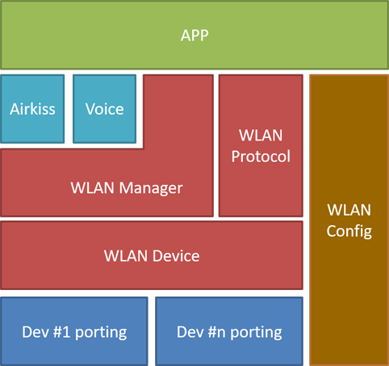
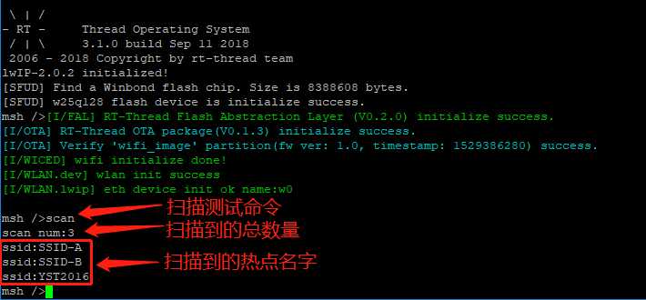
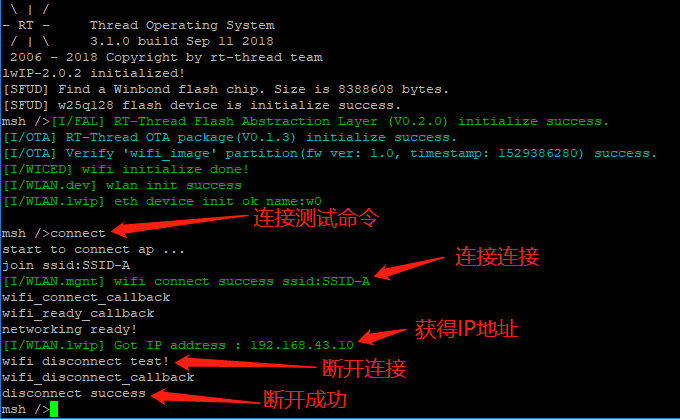
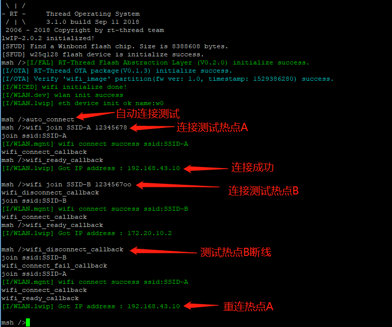

# WLAN 设备

随着物联网快速发展，越来越多的嵌入式设备上搭载了 WIFI 无线网络设备。为了能够管理 WIFI 网络设备，RT-Thread 引入了 WLAN 设备管理框架。这套框架具备控制和管理 WIFI 的众多功能，为开发者使用 WIFI 设备提供许多便利。

## WLAN 框架简介

WLAN 框架是 RT-Thread 开发的一套用于管理 WIFI 的中间件。对下连接具体的 WIFI 驱动，控制 WIFI 的连接断开，扫描等操作。对上承载不同的应用，为应用提供 WIFI 控制，事件，数据导流等操作，为上层应用提供统一的 WIFI 控制接口。WLAN 框架主要由三个部分组成。DEV 驱动接口层，为 WLAN 框架提供统一的调用接口。Manage 管理层为用户提供 WIFI 扫描，连接，断线重连等具体功能。Protocol 协议负责处理 WIFI 上产生的数据流，可根据不同的使用场景挂载不同通讯协议，如 LWIP 等。具有使用简单，功能齐全，对接方便，兼容性强等特点。

下图是 WIFI 框架层次图:



第一部分 app 为应用层。是基于 WLAN 框架的具体应用，如 WiFi 相关的 Shell 命令。

第二部分 airkiss、voice 为配网层。提供无线配网和声波配网等功能。

第三部分 WLAN manager 为 WLAN 管理层。能够对 WLAN 设备进行控制和管理。具备设置模式、连接热点、断开热点、启动热点、扫描热点等 WLAN 控制相关的功能。还提供断线重连，自动切换热点等管理功能。

第四部分 WLAN protocol 为协议层。将数据流递交给具体协议进行解析，用户可以指定使用不同的协议进行通信。

第五部分 WLAN config 为参数管理层。管理连接成功的热点信息及密码，并写入非易失的存储介质中。

第六部分 WLAN dev 为驱动接口层。对接具体 WLAN 硬件，为管理层提供统一的调用接口。

### 功能简介

* 自动连接：打开自动连接功能后，只要 WIFI 处在断线状态，就会自动读取之前连接成功的热点信息，连接热点。如果一个热点连接失败，则切换下一个热点信息进行连接，直到连接成功为止。自动连接使用的热点信息，按连接成功的时间顺序，依次尝试，优先使用最近连接成功的热点信息。连接成功后，将热点信息缓存在最前面，下次断线优先使用。

* 参数存储：存储连接成功的 WIFI 参数，WIFI 参数会在内存中缓存一份，如果配置外部非易失存储接口，则会在外部存储介质中存储一份。用户可根据自己的实际情况，实现 `struct rt_wlan_cfg_ops` 这个结构体，将参数保存任何地方。缓存的参数主要给自动连接提供热点信息，wifi 处在未连接状态时，会读取缓存的参数，尝试连接。

* WIFI 控制：提供完备的 WIFI 控制接口，扫描，连接，热点等。提供 WIFI 相关状态回调事件，断开，连接，连接失败等。为用户提供简单易用的 WIFI 管理接口。

* Shell 命令：可在 Msh 中输入命令控制 WIFI 执行扫描，连接，断开等动作。打印 WIFI 状态等调试信息。

### 配置选项

在 ENV工具中使用 `menuconfig`命令按照以下菜单进入 WLAN 配置界面：

```c
RT-Thread Components ->  Device Drivers -> Using WiFi ->
```

各个配置选项详细描述如下：

```shell
(wlan0) The device name for station                             /* Station 设备默认名字 */
(wlan1) The device name for ap                                  /* AP 设备默认名字 */
(32)  SSID maximum length                                       /* SSID 最大长度 */
(64)  Password maximum length                                   /* 密码最大长度 */
(2)   Driver events maxcount                                    /* 事件最大注册数 */
[*]   Connection management Enable                              /* 连接管理功能使能 */
(10000) Set scan timeout time(ms)                               /* 扫描超时时间 */
(10000) Set connect timeout time(ms)                            /* 连接超时时间 */
[*]     Automatic sorting of scan results                       /* 扫描结果自动排序 */
[*]     MSH command Enable                                      /* MSH 命令功能使能 */
[*]     Auto connect Enable                                     /* 自动连接功能使能 */
(2000)    Auto connect period(ms)                               /* 断线检查周期 */
-*-   WiFi information automatically saved Enable               /* 连接参数自动存储使能 */
(3)     Maximum number of WiFi information automatically saved  /* 连接参数最大存储数量 */
[*]   Transport protocol manage Enable                          /* 传输协议管理功能使能 */
(8)     Transport protocol name length                          /* 传输协议名字最大长度 */
(2)     Transport protocol maxcount                             /* 传输协议类型数量 */
(lwip)  Default transport protocol                              /* 默认传输协议名字 */
[*]     LWIP transport protocol Enable                          /* LWIP 传输协议使能 */
(lwip)    LWIP transport protocol name                          /* LWIP 传输协议名字 */
[ ]       Forced use of PBUF transmission                       /* 强制使用 PBUF 交换数据 */
-*-   WLAN work queue thread Enable                             /* WLAN 线程使能 */
(wlan)  WLAN work queue thread name                             /* WLAN 线程名字 */
(2048)  WLAN work queue thread size                             /* WLAN 线程栈大小 */
(15)    WLAN work queue thread priority                         /* WLAN 线程优先级 */
[ ]   Enable WLAN Debugging Options  --->                       /* 打开调试日志 */
```

应用程序通过 WLAN 连接管理层相关 API 来访问硬件设备，相关接口如下所示：

## WLAN 初始化

| **函数** | **描述**                           |
| --------------------- | ---------------------- |
| rt_wlan_init()        | 初始化连接管理器       |
| rt_wlan_set_mode()    | 设置工作模式           |
| rt_wlan_get_mode()    | 获取设备工作模式       |

### 连接管理初始化

`int rt_wlan_init(void)`

初始化连接管理器需要的静态资源，如全局变量，线程，互斥锁等。支持自动初始化，无需用户调用。如果没用使能自动初始化，在使用 WLAN 相关 API 之前，需要手动调用进行初始化。

| 参数              | 描述                                 |
|:------------------|:------------------------------------|
|无                 |                                     |
| **返回值**        | **描述**                            |
| 0                 | 执行成功                            |

### 设置设备模式

`rt_err_t rt_wlan_set_mode(const char *dev_name, rt_wlan_mode_t mode)`

设置 WLAN 设备的工作模。同一个设备，切换相同的模式无效，一种模式，只能存在一个设备，不能两个设备设置同一个模式。一般的，一个设备只支持一种模式。

| 参数              | 描述                                 |
|:------------------|:------------------------------------|
|`dev_name`         | 设备名字                             |
|`mode`             | 工作模式                             |
| **返回值**        | **描述**                            |
| RT_EOK            | 设置成功                          |
| -RT_ERROR         | 设置失败                          |

WLAN 设备工作模式如下:

```c
typedef enum
{
    RT_WLAN_NONE,                           /* 停止工作模式 */
    RT_WLAN_STATION,                        /* 无线终端模式 */
    RT_WLAN_AP,                             /* 无线接入服务模式 */
    RT_WLAN_MODE_MAX                        /* 无效 */
} rt_wlan_mode_t;
```

系统默认会提供一个默认的 STA 设备名和 AP 设备名，下面示例将展示默认 STA 设备工作在无线终端模式：

```c
rt_wlan_set_mode(RT_WLAN_DEVICE_STA_NAME, RT_WLAN_STATION);
```

### 获取设备模式

`rt_wlan_mode_t rt_wlan_get_mode(const char *dev_name)`

获得设备的工作模式。

| 参数              | 描述                                 |
|:------------------|:------------------------------------|
|`dev_name`         | 设备名字                             |
| **返回值**        | **描述**                            |
| RT_WLAN_NONE      | 设备停止工作                        |
| RT_WLAN_STATION   | 无线终端模式                        |
| RT_WLAN_AP        | 无线接入服务模式                     |

## WLAN 连接

| **函数** | **描述**                                    |
| ------------------------ | ---------------------------- |
| rt_wlan_connect()        | 连接热点                    |
| rt_wlan_connect_adv()    | 无阻塞连接热点              |
| rt_wlan_disconnect()     | 断开热点                    |
| rt_wlan_is_connected()   | 获取连接标志                |
| rt_wlan_is_ready()       | 获取就绪标志                |
| rt_wlan_get_info()       | 获取连接信息                |
| rt_wlan_get_rssi()       | 获取信号强度                |

### 连接热点

`rt_err_t rt_wlan_connect(const char *ssid, const char *password)`

阻塞式连接热点。此 API调用的时间会比较长，连接成功或失败后才会返回。

| 参数              | 描述                                 |
|:------------------|:------------------------------------|
|`ssid`             | 热点的名字                          |
|`password`         | 热点密码，无密码传空                |
| **返回**          | **描述**                            |
| RT_EOK            |  连接成功                           |
| -RT_ERROR         |  连接失败                           |

WLAN 连接成功，还不能进行数据通讯，需要等待连接就绪才能通讯。

### 无阻塞连接

`rt_err_t rt_wlan_connect_adv(struct rt_wlan_info *info, const char *password)`

非阻塞连接热点，连接参数可通过扫描获得或手动指定。一般用于连接特定热点或隐藏热点，返回值仅表示连接动作是否开始执行，是否连接成功需要主动查询或设置回调通知。

| 参数              | 描述                                 |
|:------------------|:------------------------------------|
|`info`             | 连接信息                            |
|`password`         | 热点密码，无密码传空                |
| **返回**          | **描述**                            |
| RT_EOK            |  执行成功                           |
| -RT_ERROR         |  执行失败                           |

连接信息必须配置的项有`security`、`ssid`。完整配置如下：

```c
struct rt_wlan_info
{
    rt_wlan_security_t security;                        /* 安全类型 */
    rt_802_11_band_t band;                              /* 2.4G / 5G */
    rt_uint32_t datarate;                               /* 连接速率 */
    rt_int16_t channel;                                 /* 通道 */
    rt_int16_t  rssi;                                   /* 信号强度 */
    rt_wlan_ssid_t ssid;                                /* 热点名称 */
    rt_uint8_t bssid[RT_WLAN_BSSID_MAX_LENGTH];         /* 热点物理地址 */
    rt_uint8_t hidden;                                  /* 热点隐藏标志 */
};
```

安全模式如下所示：

```c
typedef enum
{
    SECURITY_OPEN           = 0,                                            /* Open security                           */
    SECURITY_WEP_PSK        = WEP_ENABLED,                                  /* WEP Security with open authentication   */
    SECURITY_WEP_SHARED     = (WEP_ENABLED | SHARED_ENABLED),               /* WEP Security with shared authentication */
    SECURITY_WPA_TKIP_PSK   = (WPA_SECURITY  | TKIP_ENABLED),               /* WPA Security with TKIP                  */
    SECURITY_WPA_AES_PSK    = (WPA_SECURITY  | AES_ENABLED),                /* WPA Security with AES                   */
    SECURITY_WPA2_AES_PSK   = (WPA2_SECURITY | AES_ENABLED),                /* WPA2 Security with AES                  */
    SECURITY_WPA2_TKIP_PSK  = (WPA2_SECURITY | TKIP_ENABLED),               /* WPA2 Security with TKIP                 */
    SECURITY_WPA2_MIXED_PSK = (WPA2_SECURITY | AES_ENABLED | TKIP_ENABLED), /* WPA2 Security with AES & TKIP           */
    SECURITY_WPS_OPEN       = WPS_ENABLED,                                  /* WPS with open security                  */
    SECURITY_WPS_SECURE     = (WPS_ENABLED | AES_ENABLED),                  /* WPS with AES security                   */
    SECURITY_UNKNOWN        = -1,                                           /* security is unknown.                    */
} rt_wlan_security_t;
```

下面将展示使用指定连接信息执行连接。

```c
struct rt_wlan_info info;

INVALID_INFO(&info);                                /* 初始化 info */
SSID_SET(&info, "test_ap");                         /* 设置热点名字 */
info.security = SECURITY_WPA2_AES_PSK;              /* 指定安全类型 */
rt_wlan_connect_adv(&info, "12345678");             /* 执行连接动作 */
while (rt_wlan_is_connected() == RT_FALSE);         /* 等待连接成功 */
```

### 断开热点

`rt_err_t rt_wlan_disconnect(void)`

阻塞式断开连接，返回值表示是否成功断开。

| 参数              | 描述                                 |
|:------------------|:------------------------------------|
| 无                |                                     |
| **返回**          | **描述**                            |
| RT_EOK            |  断开成功                           |
| -RT_ERROR         |  断开失败                           |

执行断开之前，建议先查询是否已经连接，如果已经连接，再执行断开。示例代码如下：

```c
if (rt_wlan_is_connected())                     /* 判断是否已经连接 */
{
    rt_wlan_disconnect();                       /* 断开连接 */
}
```

### 获取连接标志

`rt_bool_t rt_wlan_is_connected(void)`

查询是否连接到热点。

| 参数              | 描述                                 |
|:------------------|:------------------------------------|
| 无                |                                     |
| **返回**          | **描述**                            |
| RT_TRUE           |  已经连接                           |
| RT_FALSE          |  没有连接                           |

### 获取就绪标志

`rt_bool_t rt_wlan_is_ready(void)`

查询连接是否就绪。一般的，获取到 IP 表示已经准备就绪，可以传输数据。

| 参数              | 描述                                 |
|:------------------|:------------------------------------|
| 无                |                                     |
| **返回**          | **描述**                            |
| RT_TRUE           |  已经就绪                           |
| RT_FALSE          |  没有就绪                           |

### 获取连接信息

`rt_err_t rt_wlan_get_info(struct rt_wlan_info *info)`

获取详细的连接信息，可获取热点名字、通道、信号强度、安全类型等。

| 参数              | 描述                                 |
|:------------------|:------------------------------------|
| `info`            | info 对象                           |
| **返回**          | **描述**                            |
| RT_EOK            |  获取成功                           |
| -RT_ERROR         |  获取失败                           |

### 获取信号强度

`int rt_wlan_get_rssi(void);`

> 获得信号强度。信号强度为负值，值越大信号越强。例如信号强度 -25 比 信号强度 -55 要好。

| 参数              | 描述                                 |
|:------------------|:------------------------------------|
| 无                |                                     |
| **返回**          | **描述**                            |
| 负数              |  信号强度                           |
| 0                 |  未连接                        |

## WLAN 扫描

| **函数** | **描述**                                    |
| ----------------------------- | ----------------------- |
| rt_wlan_scan()                | 异步扫描                |
| rt_wlan_scan_sync()           | 同步扫描                |
| rt_wlan_scan_with_info()      | 条件扫描                |
| rt_wlan_scan_get_info_num()   | 获取热点个数            |
| rt_wlan_scan_get_info()       | 拷贝热点信息            |
| rt_wlan_scan_get_result()     | 获取扫描缓存            |
| rt_wlan_scan_result_clean()   | 清理扫描缓存            |
| rt_wlan_find_best_by_cache()  | 查找最佳热点            |

### 异步扫描

`rt_err_t rt_wlan_scan(void)`

异步扫描函数，扫描完成需要通过回调进行通知。

| 参数              | 描述                                |
|:------------------|:------------------------------------|
| 无                |                                     |
| **返回**          | **描述**                            |
| RT_EOK            | 启动扫描成功                        |
| -RT_ERROR         | 启动扫描失败                        |

### 同步扫描

`struct rt_wlan_scan_result *rt_wlan_scan_sync(void)`

> 同步扫描函数，扫描全部热点信息，完成过直接返回扫描结果。

| 参数              | 描述                                 |
|:------------------|:------------------------------------|
| 无                |                                     |
| **返回**          | **描述**                            |
| 扫描结果          | 热点信息和数量                       |
| RT_NULL           | 扫描失败                            |

该接口执行成功，会返回 `struct rt_wlan_scan_result` 类型的指针，包含了热点的详细信息和数量。结构体定义如下：

```c
struct rt_wlan_scan_result
{
    rt_int32_t num;                     /* 热点个数 */
    struct rt_wlan_info *info;          /* 热点信息 */
};
```

结构体中的 info 是连续的内存块，可通过类似数组的形式进行访问。示例如下：

```c
result = rt_wlan_scan_sync(void);                   /* 获取扫描结果 */
for (i = 0; i < result->num; i++)                   /* 根据扫描到的结果，进行遍历 */
{
    printf("SSID:%s\n", result->info[i].ssid.val);  /* 使用数组的形式进行访问，打印扫描到的 SSID 信息 */
}
```

### 条件扫描

`struct rt_wlan_scan_result *rt_wlan_scan_with_info(struct rt_wlan_info *info)`

同步条件扫描。根据参入的条件进行过滤，可用于扫描指定 SSID。

| 参数              | 描述                                 |
|:------------------|:------------------------------------|
| `info`            | 通过 info 指定限定条件               |
| **返回**          | **描述**                            |
| 扫描结果          | 热点信息和数量                      |
| RT_NULL           | 扫描失败                            |

下面示例将展示扫描指定 SSID 的热点信息。

```c
struct rt_wlan_info info;

INVALID_INFO(&info);                                /* 初始化 info */
SSID_SET(&info, "test_ap");                         /* 指定 SSID */
result = rt_wlan_scan_with_info(&info);             /* 开始同步扫描 */
```

### 获取热点个数

`int rt_wlan_scan_get_result_num(void)`

返回扫描到的热点数量。

| 参数              | 描述                                |
|:------------------|:------------------------------------|
| 无                |                                     |
| **返回**          | **描述**                            |
| 数量              | 热点数量                            |

### 拷贝热点信息

`int rt_wlan_scan_get_info(struct rt_wlan_info *info, int num)`

拷贝热点信息。

| 参数              | 描述                                 |
|:------------------|:------------------------------------|
| `info`            | info 缓存，用于保存拷贝结果         |
| `num`             | info 个数                           |
| **返回**          | **描述**                            |
| 数量              | 实际拷贝的个数                      |

下面代码片段将展示如何拷贝热点信息

```c
num = rt_wlan_scan_get_result_num();                        /* 查询热点数量 */
info = rt_malloc(sizeof(struct rt_wlan_info) * num);        /* 分配内存 */
rt_wlan_scan_get_info(info, num);                           /* 拷贝 */
```

### 获取扫描缓存

`struct rt_wlan_scan_result *rt_wlan_scan_get_result(void)`

返回扫描缓存。

| 参数              | 描述                                 |
|:------------------|:------------------------------------|
| 无                |                                     |
| **返回**          | **描述**                            |
| 扫描缓存指针      | 该指针不安全，仅作临时访问          |

### 清理扫描缓存

`void rt_wlan_scan_result_clean(void)`

清理扫描缓存。

| 参数              | 描述                                 |
|:------------------|:------------------------------------|
| 无                |                                     |
| **返回**          | **描述**                            |
| 无                |                                      |

### 查找最佳热点

`rt_bool_t rt_wlan_find_best_by_cache(const char *ssid, struct rt_wlan_info *info)`

指定 SSID ，在扫描缓存中查找信号最好的热点信息。

| 参数              | 描述                                 |
|:------------------|:------------------------------------|
| `ssid`            | 指定需要查询的 ssid                  |
| `info`            | 存查询到的热点信息                   |
| **返回**          | **描述**                            |
| RT_FALSE          |  没有查到                           |
| RT_TRUE           |  查到                              |

## WLAN 热点

| **函数** | **描述**                                    |
| ----------------------------- | ----------------------- |
| rt_wlan_start_ap()            | 启动热点                |
| rt_wlan_start_ap_adv()        | 无阻塞启动热点          |
| rt_wlan_ap_is_active()        | 获取启动标志            |
| rt_wlan_ap_stop()             | 停止热点                |
| rt_wlan_ap_get_info()         | 获取热点信息            |

### 启动热点

`rt_err_t rt_wlan_start_ap(const char *ssid, const char *password)`

阻塞式启动热点，返回值表示是否启动成功。

| 参数              | 描述                                 |
|:------------------|:------------------------------------|
| `ssid`            | 热点名字                            |
| `password`        | 热点密码。             |
| **返回**          | **描述**                            |
| RT_EOK            |  启动成功                           |
| -RT_ERROR         |  启动失败                           |

### 非阻塞启动热点

`rt_err_t rt_wlan_start_ap_adv(struct rt_wlan_info *info, const char *password)`

非阻塞启动热点，可以指加密类型，通道等。热点是否启动需要手动查询或回调通知。

| 参数              | 描述                                 |
|:------------------|:------------------------------------|
| `info`            | 热点信息                            |
| `password`        | 热点密码，开放热点传空              |
| **返回**          | **描述**                            |
| RT_EOK            | 执行成功                           |
| -RT_ERROR         | 执行失败                           |

### 获取启动标志

`rt_bool_t rt_wlan_ap_is_active(void)`

> 查询热点是否处于活动状态。

| 参数              | 描述                                 |
|:------------------|:------------------------------------|
| 无                |                                     |
| **返回**          | **描述**                            |
| RT_TRUE           |  热点启动                           |
| -RT_FALSE         |  热点未启动                         |

### 停止热点

`rt_err_t rt_wlan_ap_stop(void)`

> 阻塞式停止热点。停止之前先查询是否已经启动，已经启动后在停止。

| 参数              | 描述                                 |
|:------------------|:------------------------------------|
| 无                |                                     |
| **返回**          | **描述**                            |
| RT_EOK            | 停止成功                             |
| -RT_ERROR         | 停止失败                            |

### 获取热点信息

`rt_err_t rt_wlan_ap_get_info(struct rt_wlan_info *info)`

> 获取热点相关信息，如热点名字，通道等。

| 参数              | 描述                                 |
|:------------------|:------------------------------------|
| info              | 热点信息                            |
| **返回**          | **描述**                            |
| RT_EOK            | 获取成功                             |
| -RT_ERROR         | 获取失败                            |

## WLAN 自动重连

| **函数** | **描述**                                       |
| ---------------------------------- | --------------------- |
| rt_wlan_config_autoreconnect()     | 启动/停止自动重连     |
| rt_wlan_get_autoreconnect_mode()   | 获取自动重连模式  |

### 启动/停止自动重连

`void rt_wlan_config_autoreconnect(rt_bool_t enable)`

开启或关闭自动重连模式，当没有网络时，会自动进行重连。

| 参数              | 描述                                 |
|:------------------|:------------------------------------|
| `enable`          |  开启或关闭                         |
| **返回**          | **描述**                            |
| 无                 | 执行成功                            |

### 获取自动重连模式

`rt_bool_t rt_wlan_get_autoreconnect_mode(void)`

查询自动重连是否启动。

| 参数              | 描述                                 |
|:------------------|:------------------------------------|
| 无                |                                     |
| **返回**          | **描述**                            |
| RT_TRUE           | 启动                                |
| RT_FALSE          | 未启动                              |

## WLAN 事件回调

| **函数** | **描述**                                      |
| ------------------------------------ | ----------------- |
| rt_wlan_register_event_handler()     | 事件注册          |
| rt_wlan_unregister_event_handler()   | 解除注册          |

### 事件注册

`rt_err_t rt_wlan_register_event_handler(rt_wlan_event_t event, rt_wlan_event_handler handler, void *parameter)`

> 注册事件回调函数。

| 参数              | 描述                                 |
|:------------------|:------------------------------------|
| `event`           | 事件类型                             |
| `handler`         | 事件处理函数                         |
| `parameter`       | 用户参数                             |
| **返回**          | **描述**                            |
| RT_EOK            | 注册成功                            |
| -RT_ERROR         | 注册失败                            |

WLAN 产生如下事件时，触发回调：

```c
typedef enum
{
    RT_WLAN_EVT_READY = 0,              /* 网络就绪 */
    RT_WLAN_EVT_SCAN_DONE,              /* 扫描完成 */
    RT_WLAN_EVT_SCAN_REPORT,            /* 扫描到一个热点 */
    RT_WLAN_EVT_STA_CONNECTED,          /* 连接成功 */
    RT_WLAN_EVT_STA_CONNECTED_FAIL,     /* 连接失败 */
    RT_WLAN_EVT_STA_DISCONNECTED,       /* 断开连接 */
    RT_WLAN_EVT_AP_START,               /* 热点启动 */
    RT_WLAN_EVT_AP_STOP,                /* 热点停止 */
    RT_WLAN_EVT_AP_ASSOCIATED,          /* STA 接入 */
    RT_WLAN_EVT_AP_DISASSOCIATED,       /* STA 断开 */
} rt_wlan_event_t;
```

WLAN 回调函数定义为： `void (*rt_wlan_event_handler)(int event, struct rt_wlan_buff *buff, void *parameter);`，其中 `buff` 根据事件的不同有不同的涵义。详细信息参考下表。

| 事件                           | 类型                         | 描述                    |
| :----------------------------- | :--------------------------- | :---------------------- |
| RT_WLAN_EVT_READY              | ip_addr_t *                  | IP 地址                 |
| RT_WLAN_EVT_SCAN_DONE          | struct rt_wlan_scan_result * | 扫描的结果              |
| RT_WLAN_EVT_SCAN_REPORT        | struct rt_wlan_info *        | 扫描到的热点信息        |
| RT_WLAN_EVT_STA_CONNECTED      | struct rt_wlan_info *        | 连接成功的 Station 信息 |
| RT_WLAN_EVT_STA_CONNECTED_FAIL | struct rt_wlan_info *        | 连接失败的 Station 信息 |
| RT_WLAN_EVT_STA_DISCONNECTED   | struct rt_wlan_info *        | 断开连接的 Station 信息 |
| RT_WLAN_EVT_AP_START           | struct rt_wlan_info *        | 启动成功的 AP 信息      |
| RT_WLAN_EVT_AP_STOP            | struct rt_wlan_info *        | 启动失败的 AP 信息      |
| RT_WLAN_EVT_AP_ASSOCIATED      | struct rt_wlan_info *        | 连入的 Station 信息     |
| RT_WLAN_EVT_AP_DISASSOCIATED   | struct rt_wlan_info *        | 断开的 Station 信息     |

### 解除注册

`rt_err_t rt_wlan_unregister_event_handler(rt_wlan_event_t event)`

事件解除注册。

| 参数              | 描述                                 |
|:------------------|:------------------------------------|
| `event`           | 事件类型                            |
| **返回**          | **描述**                            |
| RT_EOK            | 解除成功                            |

## WLAN 功耗管理

| **函数** | **描述**                                      |
| --------------------------------- | --------------------- |
| rt_wlan_set_powersave()           | 设置功耗等级          |
| rt_wlan_get_powersave()           | 获取功耗等级          |

### 设置功耗等级

设置功耗等级，用于 station 模式。

`rt_err_t rt_wlan_set_powersave(int level)`

| 参数              | 描述                                 |
|:------------------|:------------------------------------|
| `level`           | 功耗等级                           |
| **返回**          | **描述**                            |
| RT_EOK            | 设置成功                            |
| -RT_ERROR         | 设置失败                            |

### 获取功耗等级

`int rt_wlan_get_powersave(void)`

获取当前工作功耗等级。

| 参数              | 描述                                 |
|:------------------|:------------------------------------|
| 无                |                                     |
| **返回**          | **描述**                            |
| 功耗级别          |                                     |

## FinSH 命令

使用 shell 命令，可以帮助我们快速调试 WiFi 相关功能。wifi 相关的 shell 命令如下：

```shell
wifi                           /* 打印帮助 */
wifi help                      /* 查看帮助 */
wifi join SSID [PASSWORD]      /* 连接 wifi，SSDI 为空，使用配置自动连接 */
wifi ap   SSID [PASSWORD]      /* 建立热点 */
wifi scan                      /* 扫描全部热点 */
wifi disc                      /* 断开连接 */
wifi ap_stop                   /* 停止热点 */
wifi status                    /* 打印 wifi 状态 sta + ap */
wifi smartconfig               /* 启动配网功能 */
```

### WiFi 扫描

wifi 扫描命令为 `wifi scan`，执行 wifi 扫描命令后，会将周围的热点信息打印在终端上。通过打印的热点信息，可以看到 SSID，MAC 地址等多项属性。

在 msh 中输入该命令，扫描结果如下所示：

```shell
wifi scan
SSID                                   MAC            security    rssi chn Mbps
------------------------------- -----------------  -------------- ---- --- ----
rtt_test_ssid_1                 c0:3d:46:00:3e:aa  OPEN           -14    8  300
test_ssid                       3c:f5:91:8e:4c:79  WPA2_AES_PSK   -18    6   72
rtt_test_ssid_2                 ec:88:8f:88:aa:9a  WPA2_MIXED_PSK -47    6  144
rtt_test_ssid_3                 c0:3d:46:00:41:ca  WPA2_MIXED_PSK -48    3  300
```

### WiFi 连接

wifi 扫描命令为 `wifi join`，命令后面需要跟热点名称和热点密码，没有密码可不输入这一项。执行 WiFi 连接命令后，如果热点存在，且密码正确，开发板会连接上热点，并获得 IP 地址。网络连接成功后，可使用 socket 套接字进行网络通讯。

wifi 连接命令使用示例如下所示，连接成功后，将在终端上打印获得的 IP 地址，如下所示：

```shell
wifi join ssid_test 12345678
[I/WLAN.mgnt] wifi connect success ssid:ssid_test
[I/WLAN.lwip] Got IP address : 192.168.1.110
```

### WiFi 断开

wifi 断开的命令为 `wifi disc`，执行 WiFi 断开命令后，开发板将断开与热点的连接。

WiFi 断开命令使用示例如下所示，断开成功后，将在终端上打印如下信息，如下所示

```shell
wifi disc
[I/WLAN.mgnt] disconnect success!
```

## WLAN 设备使用示例

### 扫描示例

下面这段代码将展示 WiFi 同步扫描，然后我们将结果打印在终端上。先需要执行 WIFI 初始化，然后执行 WIFI 扫描函数 `rt_wlan_scan_sync`, 这个函数是同步的，函数返回的扫描的数量和结果。在这个示例中，会将扫描的热点名字打印出来。

```c
#include <rthw.h>
#include <rtthread.h>

#include <wlan_mgnt.h>
#include <wlan_prot.h>
#include <wlan_cfg.h>

void wifi_scan(void)
{
    struct rt_wlan_scan_result *result;
    int i = 0;

    /* Configuring WLAN device working mode */
    rt_wlan_set_mode(RT_WLAN_DEVICE_STA_NAME, RT_WLAN_STATION);
    /* WiFi scan */
    result = rt_wlan_scan_sync();
    /* Print scan results */
    rt_kprintf("scan num:%d\n", result->num);
    for (i = 0; i < result->num; i++)
    {
        rt_kprintf("ssid:%s\n", result->info[i].ssid.val);
    }
}

int scan(int argc, char *argv[])
{
    wifi_scan();
    return 0;
}
MSH_CMD_EXPORT(scan, scan test.);
```

运行结果如下：



### 连接与断开示例

下面这段代码将展示 WiFi 同步连接。需要先执行 WIFI 初始化，然后创建一个用于等待 `RT_WLAN_EVT_READY` 事件的信号量。注册需要关注的事件的回调函数，执行 `rt_wlan_connect` wifi 连接函数，函数返回表示是否已经连接成功。但是连接成功还不能进行通信，还需要等待网络获取 IP。使用事先创建的信号量等待网络准备好，网络准备好后，就能正常通信了。

连接上 WIFI 后，等待一段时间后，执行 `rt_wlan_disconnect` 函数断开连接。断开操作是阻塞的，返回值表示是否断开成功。

```c
#include <rthw.h>
#include <rtthread.h>

#include <wlan_mgnt.h>
#include <wlan_prot.h>
#include <wlan_cfg.h>

#define WLAN_SSID               "SSID-A"
#define WLAN_PASSWORD           "12345678"
#define NET_READY_TIME_OUT       (rt_tick_from_millisecond(15 * 1000))

static rt_sem_t net_ready = RT_NULL;

static void
wifi_ready_callback(int event, struct rt_wlan_buff *buff, void *parameter)
{
    rt_kprintf("%s\n", __FUNCTION__);
    rt_sem_release(net_ready);
}

static void
wifi_connect_callback(int event, struct rt_wlan_buff *buff, void *parameter)
{
    rt_kprintf("%s\n", __FUNCTION__);
    if ((buff != RT_NULL) && (buff->len == sizeof(struct rt_wlan_info)))
    {
        rt_kprintf("ssid : %s \n", ((struct rt_wlan_info *)buff->data)->ssid.val);
    }
}

static void
wifi_disconnect_callback(int event, struct rt_wlan_buff *buff, void *parameter)
{
    rt_kprintf("%s\n", __FUNCTION__);
    if ((buff != RT_NULL) && (buff->len == sizeof(struct rt_wlan_info)))
    {
        rt_kprintf("ssid : %s \n", ((struct rt_wlan_info *)buff->data)->ssid.val);
    }
}

static void
wifi_connect_fail_callback(int event, struct rt_wlan_buff *buff, void *parameter)
{
    rt_kprintf("%s\n", __FUNCTION__);
    if ((buff != RT_NULL) && (buff->len == sizeof(struct rt_wlan_info)))
    {
        rt_kprintf("ssid : %s \n", ((struct rt_wlan_info *)buff->data)->ssid.val);
    }
}

rt_err_t wifi_connect(void)
{
    rt_err_t result = RT_EOK;

    /* Configuring WLAN device working mode */
    rt_wlan_set_mode(RT_WLAN_DEVICE_STA_NAME, RT_WLAN_STATION);
    /* station connect */
    rt_kprintf("start to connect ap ...\n");
    net_ready = rt_sem_create("net_ready", 0, RT_IPC_FLAG_PRIO);
    rt_wlan_register_event_handler(RT_WLAN_EVT_READY,
            wifi_ready_callback, RT_NULL);
    rt_wlan_register_event_handler(RT_WLAN_EVT_STA_CONNECTED,
            wifi_connect_callback, RT_NULL);
    rt_wlan_register_event_handler(RT_WLAN_EVT_STA_DISCONNECTED,
            wifi_disconnect_callback, RT_NULL);
    rt_wlan_register_event_handler(RT_WLAN_EVT_STA_CONNECTED_FAIL,
            wifi_connect_fail_callback, RT_NULL);

    /* connect wifi */
    result = rt_wlan_connect(WLAN_SSID, WLAN_PASSWORD);

    if (result == RT_EOK)
    {
        /* waiting for IP to be got successfully  */
        result = rt_sem_take(net_ready, NET_READY_TIME_OUT);
        if (result == RT_EOK)
        {
            rt_kprintf("networking ready!\n");
        }
        else
        {
            rt_kprintf("wait ip got timeout!\n");
        }
        rt_wlan_unregister_event_handler(RT_WLAN_EVT_READY);
        rt_sem_delete(net_ready);

        rt_thread_delay(rt_tick_from_millisecond(5 * 1000));
        rt_kprintf("wifi disconnect test!\n");
        /* disconnect */
        result = rt_wlan_disconnect();
        if (result != RT_EOK)
        {
            rt_kprintf("disconnect failed\n");
            return result;
        }
        rt_kprintf("disconnect success\n");
    }
    else
    {
        rt_kprintf("connect failed!\n");
    }
    return result;
}

int connect(int argc, char *argv[])
{
    wifi_connect();
    return 0;
}
MSH_CMD_EXPORT(connect, connect test.);
```

运行结果如下



### 自动连接示例

先开启自动重连功能，使用命令行连接上一个热点 A 后，在连接上另一个热点 B。等待几秒后，将热点 B 断电，系统会自动重试连接 B 热点，此时 B 热点连接不上，系统自动切换热点 A 进行连接。连接成功 A 后，系统停止连接。

```c
#include <rthw.h>
#include <rtthread.h>

#include <wlan_mgnt.h>
#include <wlan_prot.h>
#include <wlan_cfg.h>

static void
wifi_ready_callback(int event, struct rt_wlan_buff *buff, void *parameter)
{
    rt_kprintf("%s\n", __FUNCTION__);
}

static void
wifi_connect_callback(int event, struct rt_wlan_buff *buff, void *parameter)
{
    rt_kprintf("%s\n", __FUNCTION__);
    if ((buff != RT_NULL) && (buff->len == sizeof(struct rt_wlan_info)))
    {
        rt_kprintf("ssid : %s \n", ((struct rt_wlan_info *)buff->data)->ssid.val);
    }
}

static void
wifi_disconnect_callback(int event, struct rt_wlan_buff *buff, void *parameter)
{
    rt_kprintf("%s\n", __FUNCTION__);
    if ((buff != RT_NULL) && (buff->len == sizeof(struct rt_wlan_info)))
    {
        rt_kprintf("ssid : %s \n", ((struct rt_wlan_info *)buff->data)->ssid.val);
    }
}

static void
wifi_connect_fail_callback(int event, struct rt_wlan_buff *buff, void *parameter)
{
    rt_kprintf("%s\n", __FUNCTION__);
    if ((buff != RT_NULL) && (buff->len == sizeof(struct rt_wlan_info)))
    {
        rt_kprintf("ssid : %s \n", ((struct rt_wlan_info *)buff->data)->ssid.val);
    }
}

int wifi_autoconnect(void)
{
    /* Configuring WLAN device working mode */
    rt_wlan_set_mode(RT_WLAN_DEVICE_STA_NAME, RT_WLAN_STATION);
    /* Start automatic connection */
    rt_wlan_config_autoreconnect(RT_TRUE);
    /* register event */
    rt_wlan_register_event_handler(RT_WLAN_EVT_READY,
            wifi_ready_callback, RT_NULL);
    rt_wlan_register_event_handler(RT_WLAN_EVT_STA_CONNECTED,
            wifi_connect_callback, RT_NULL);
    rt_wlan_register_event_handler(RT_WLAN_EVT_STA_DISCONNECTED,
            wifi_disconnect_callback, RT_NULL);
    rt_wlan_register_event_handler(RT_WLAN_EVT_STA_CONNECTED_FAIL,
            wifi_connect_fail_callback, RT_NULL);
    return 0;
}

int auto_connect(int argc, char *argv[])
{
    wifi_autoconnect();
    return 0;
}
MSH_CMD_EXPORT(auto_connect, auto connect test.);
```

运行结果如下:


