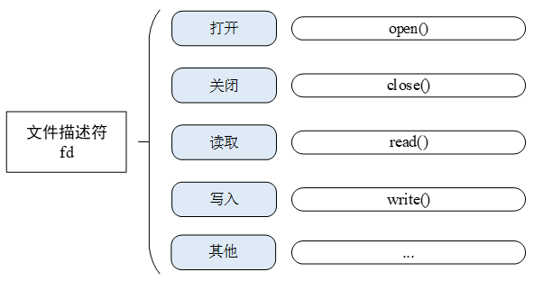

# 虚拟文件系统

在早期的嵌入式系统中，需要存储的数据比较少，数据类型也比较单一，往往使用直接在存储设备中的指定地址写入数据的方法来存储数据。然而随着嵌入式设备功能的发展，需要存储的数据越来越多，也越来越复杂，这时仍使用旧方法来存储并管理数据就变得非常繁琐困难。因此我们需要新的数据管理方式来简化存储数据的组织形式，这种方式就是我们接下来要介绍的文件系统。

文件系统是一套实现了数据的存储、分级组织、访问和获取等操作的抽象数据类型 (Abstract data type)，是一种用于向用户提供底层数据访问的机制。文件系统通常存储的基本单位是文件，即数据是按照一个个文件的方式进行组织。当文件比较多时，将导致文件繁多，不易分类、重名的问题。而文件夹作为一个容纳多个文件的容器而存在。

本章讲解 RT-Thread 文件系统相关内容，带你了解 RT-Thread 虚拟文件系统的架构、功能特点和使用方式。

## DFS 简介

DFS 是 RT-Thread 提供的虚拟文件系统组件，全称为 Device File System，即设备虚拟文件系统，文件系统的名称使用类似 UNIX 文件、文件夹的风格，目录结构如下图所示：


在 RT-Thread DFS 中，文件系统有统一的根目录，使用 `/` 来表示。而在根目录下的 f1.bin 文件则使用 `/f1.bin` 来表示，2018 目录下的 `f1.bin` 目录则使用 `/data/2018/f1.bin` 来表示。即目录的分割符号是 `/`，这与 UNIX/Linux 完全相同，与 Windows 则不相同（Windows 操作系统上使用 `\` 来作为目录的分割符）。

### DFS 架构

RT-Thread DFS 组件的主要功能特点有：

* 为应用程序提供统一的 POSIX 文件和目录操作接口：read、write、poll/select 等。

* 支持多种类型的文件系统，如 FatFS、RomFS、DevFS 等，并提供普通文件、设备文件、网络文件描述符的管理。

* 支持多种类型的存储设备，如 SD Card、SPI Flash、Nand Flash 等。

DFS 的层次架构如下图所示，主要分为 POSIX 接口层、虚拟文件系统层和设备抽象层。


### POSIX 接口层

POSIX 表示可移植操作系统接口（Portable Operating System Interface of UNIX，缩写 POSIX），POSIX 标准定义了操作系统应该为应用程序提供的接口标准，是 IEEE 为要在各种 UNIX 操作系统上运行的软件而定义的一系列 API 标准的总称。

POSIX 标准意在期望获得源代码级别的软件可移植性。换句话说，为一个 POSIX 兼容的操作系统编写的程序，应该可以在任何其它 POSIX 操作系统（即使是来自另一个厂商）上编译执行。RT-Thread 支持 POSIX 标准接口，因此可以很方便的将 Linux/Unix 的程序移植到 RT-Thread 操作系统上。

在类 Unix 系统中，普通文件、设备文件、网络文件描述符是同一种文件描述符。而在 RT-Thread 操作系统中，使用 DFS 来实现这种统一性。有了这种文件描述符的统一性，我们就可以使用 poll/select 接口来对这几种描述符进行统一轮询，为实现程序功能带来方便。

使用 poll/select 接口可以阻塞地同时探测一组支持非阻塞的 I/O 设备是否有事件发生（如可读，可写，有高优先级的错误输出，出现错误等等），直至某一个设备触发了事件或者超过了指定的等待时间。这种机制可以帮助调用者寻找当前就绪的设备，降低编程的复杂度。

### 虚拟文件系统层

用户可以将具体的文件系统注册到 DFS 中，如 FatFS、RomFS、DevFS 等，下面介绍几种常用的文件系统类型：

* FatFS 是专为小型嵌入式设备开发的一个兼容微软 FAT 格式的文件系统，采用 ANSI C 编写，具有良好的硬件无关性以及可移植性，是 RT-Thread 中最常用的文件系统类型。

* 传统型的 RomFS 文件系统是一种简单的、紧凑的、只读的文件系统，不支持动态擦写保存，按顺序存放数据，因而支持应用程序以 XIP(execute In Place，片内运行) 方式运行，在系统运行时, 节省 RAM 空间。

* Jffs2 文件系统是一种日志闪存文件系统。主要用于 NOR 型闪存，基于 MTD 驱动层，特点是：可读写的、支持数据压缩的、基于哈希表的日志型文件系统，并提供了崩溃 / 掉电安全保护，提供写平衡支持等。

* DevFS 即设备文件系统，在 RT-Thread 操作系统中开启该功能后，可以将系统中的设备在 /dev 文件夹下虚拟成文件，使得设备可以按照文件的操作方式使用 read、write 等接口进行操作。

* NFS 网络文件系统（Network File System）是一项在不同机器、不同操作系统之间通过网络共享文件的技术。在操作系统的开发调试阶段，可以利用该技术在主机上建立基于 NFS 的根文件系统，挂载到嵌入式设备上，可以很方便地修改根文件系统的内容。

* UFFS 是 Ultra-low-cost Flash File System（超低功耗的闪存文件系统）的简称。它是国人开发的、专为嵌入式设备等小内存环境中使用 Nand Flash 的开源文件系统。与嵌入式中常使用的 Yaffs 文件系统相比具有资源占用少、启动速度快、免费等优势。

### 设备抽象层

设备抽象层将物理设备如 SD Card、SPI Flash、Nand Flash，抽象成符合文件系统能够访问的设备，例如 FAT 文件系统要求存储设备必须是块设备类型。

不同文件系统类型是独立于存储设备驱动而实现的，因此把底层存储设备的驱动接口和文件系统对接起来之后，才可以正确地使用文件系统功能。

## 挂载管理

文件系统的初始化过程一般分为以下几个步骤：

1. 初始化 DFS 组件。
2. 初始化具体类型的文件系统。
3. 在存储器上创建块设备。
4. 格式化块设备。
5. 挂载块设备到 DFS 目录中。
6. 当文件系统不再使用，可以将它卸载。

### 初始化 DFS 组件

DFS 组件的的初始化是由 dfs_init() 函数完成。dfs_init() 函数会初始化 DFS 所需的相关资源，创建一些关键的数据结构, 有了这些数据结构，DFS 便能在系统中找到特定的文件系统，并获得对特定存储设备内文件的操作方法。如果开启了自动初始化（默认开启），该函数将被自动调用。

### 注册文件系统

在 DFS 组件初始化之后，还需要初始化使用的具体类型的文件系统，也就是将具体类型的文件系统注册到 DFS 中。注册文件系统的接口如下所示：

```c
int dfs_register(const struct dfs_filesystem_ops *ops);
```

|**参数**|**描述**                          |
|----------|------------------------------------|
| ops      | 文件系统的操作函数的集合 |
|**返回**|**——**                            |
| 0        | 文件注册成功                       |
| -1      | 文件注册失败                       |

该函数不需要用户调用，他会被不同文件系统的初始化函数调用，如 elm-FAT 文件系统的初始化函数`elm_init()`。开启对应的文件系统后，如果开启了自动初始化（默认开启），文件系统初始化函数也将被自动调用。

`elm_init()` 函数会初始化 elm-FAT 文件系统，此函数会调用 `dfs_register(`) 函数将 elm-FAT 文件系统注册到 DFS 中，文件系统注册过程如下图所示：


### 将存储设备注册为块设备

因为只有块设备才可以挂载到文件系统上，因此需要在存储设备上创建所需的块设备。如果存储设备是 SPI Flash，则可以使用 “串行 Flash 通用驱动库 SFUD” 组件，它提供了各种 SPI Flash 的驱动，并将 SPI Flash 抽象成块设备用于挂载，注册块设备过程如下图所示：


### 格式化文件系统

注册了块设备之后，还需要在块设备上创建指定类型的文件系统，也就是格式化文件系统。可以使用 `dfs_mkfs()` 函数对指定的存储设备进行格式化，创建文件系统，格式化文件系统的接口如下所示：

```c
int dfs_mkfs(const char * fs_name, const char * device_name);
```

|**参数**   |**描述**                  |
|-------------|----------------------------|
| fs_name     | 文件系统类型          |
| device_name | 块设备名称 |
|**返回**   |**——**                    |
| 0           | 文件系统格式化成功         |
| -1         | 文件系统格式化失败         |

文件系统类型（fs_name）可取值及对应的文件系统如下表所示：

|**取值**   |**文件系统类型**                  |
|-------------|----------------------------|
| elm         | elm-FAT 文件系统    |
| jffs2       | jffs2 日志闪存文件系统       |
| nfs         | NFS 网络文件系统          |
| ram         | RamFS 文件系统         |
| rom         | RomFS 只读文件系统     |
| uffs        | uffs 文件系统          |
| lfs         | littlefs 文件系统          |

以 elm-FAT 文件系统格式化块设备为例，格式化过程如下图所示：


还可以使用 `mkfs` 命令格式化文件系统，格式化块设备 sd0 的运行结果如下所示：

```c
msh />mkfs sd0                    # sd0 为块设备名称，该命令会默认格式化 sd0 为 elm-FAT 文件系统
msh />
msh />mkfs -t elm sd0             # 使用 -t 参数指定文件系统类型为 elm-FAT 文件系统
```

### 挂载文件系统

在 RT-Thread 中，挂载是指将一个存储设备挂接到一个已存在的路径上。我们要访问存储设备中的文件，必须将文件所在的分区挂载到一个已存在的路径上，然后通过这个路径来访问存储设备。挂载文件系统的接口如下所示：

```c
int dfs_mount(const char   *device_name,
              const char   *path,
              const char   *filesystemtype,
              unsigned long rwflag,
              const void   *data);
```

|**参数**      |**描述**                    |
|----------------|------------------------------|
| device_name    | 已经格式化的块设备名称 |
| path           | 挂载路径，即挂载点 |
| filesystemtype | 挂载的文件系统类型，可取值见 dfs_mkfs() 函数描述  |
| rwflag         | 读写标志位                   |
| data           | 特定文件系统的私有数据       |
|**返回**      | **——**                     |
| 0              | 文件系统挂载成功             |
| -1            | 文件系统挂载失败             |

如果只有一个存储设备，则可以直接挂载到根目录 `/` 上。

### 卸载文件系统

当某个文件系统不需要再使用了，那么可以将它卸载掉。卸载文件系统的接口如下所示：

```c
int dfs_unmount(const char *specialfile);
```

|**参数**   |**描述**                |
|-------------|--------------------------|
| specialfile | 挂载路径 |
|**返回**   |**——**                  |
| 0           | 卸载文件系统成功         |
| -1         | 卸载文件系统失败         |

## 文件管理

本节介绍对文件进行操作的相关函数，对文件的操作一般都要基于文件描述符 fd，如下图所示：



### 打开和关闭文件

打开或创建一个文件可以调用下面的 open() 函数：

```c
int open(const char *file, int flags, ...);
```

|**参数**  |**描述**                            |
|------------|--------------------------------------|
| file       | 打开或创建的文件名                   |
| flags      | 指定打开文件的方式，取值可参考下表 |
|**返回**  |**——**                                 |
| 文件描述符 | 文件打开成功                         |
| -1        | 文件打开失败                         |

一个文件可以以多种方式打开，并且可以同时指定多种打开方式。例如，一个文件以 O_RDONLY 和 O_CREAT 的方式打开，那么当指定打开的文件不存在时，就会先创建这个文件，然后再以只读的方式打开。文件打开方式如下表所示：

|**参数**|**描述**                     |
|----------|-----------------------|
| O_RDONLY | 只读方式打开文件                   |
| O_WRONLY | 只写方式打开文件                  |
| O_RDWR   | 以读写方式打开文件                   |
| O_CREAT  | 如果要打开的文件不存在，则建立该文件        |
| O_APPEND | 当读写文件时会从文件尾开始移动，也就是所写入的数据会以附加的方式添加到文件的尾部 |
| O_TRUNC  | 如果文件已经存在，则清空文件中的内容        |

当使用完文件后若不再需要使用则可使用 `close()` 函数关闭该文件，而 `close()` 会让数据写回磁盘，并释放该文件所占用的资源。

```
int close(int fd);
```

|**参数**|**描述**    |
|----------|--------------|
| fd       | 文件描述符   |
|**返回**|**——**      |
| 0        | 文件关闭成功 |
| -1      | 文件关闭失败 |

### 读写数据

读取文件内容可使用 `read()` 函数：

```
int read(int fd, void *buf, size_t len);
```

|**参数**|**描述**                                |
|----------|------------------------------------------|
| fd       | 文件描述符                               |
| buf      | 缓冲区指针                               |
| len      | 读取文件的字节数                         |
|**返回**|**——**                                  |
| int      | 实际读取到的字节数                       |
| 0        | 读取数据已到达文件结尾或者无可读取的数据 |
| -1      | 读取出错，错误代码查看当前线程的 errno    |

该函数会把参数 fd 所指的文件的 len 个字节读取到 buf 指针所指的内存中。此外文件的读写位置指针会随读取到的字节移动。

向文件中写入数据可使用 `write()` 函数：

```
int write(int fd, const void *buf, size_t len);
```

|**参数**|**描述**                             |
|----------|---------------------------------------|
| Fd       | 文件描述符                            |
| buf      | 缓冲区指针                            |
| len      | 写入文件的字节数                      |
|**返回**|**——**                               |
| int      | 实际写入的字节数                      |
| -1      | 写入出错，错误代码查看当前线程的 errno |

该函数会把 buf 指针所指向的内存中 len 个字节写入到参数 fd 所指的文件内。此外文件的读写位置指针会随着写入的字节移动。

### 重命名

重命名文件可使用 `rename()` 函数：

```
int rename(const char *old, const char *new);
```

|**参数**|**描述**    |
|----------|--------------|
| old      | 旧文件名     |
| new      | 新文件名     |
|**返回**|**——**      |
| 0        | 更改名称成功 |
| -1      | 更改名称失败 |

该函数会将参数 old 所指定的文件名称改为参数 new 所指的文件名称。若 new 所指定的文件已经存在，则该文件将会被覆盖。

### 取得状态

获取文件状态可使用下面的 `stat()` 函数：

```
int stat(const char *file, struct stat *buf);
```

|**参数**|**描述**                                  |
|----------|--------------------------------------------|
| file     | 文件名                                     |
| buf      | 结构指针，指向一个存放文件状态信息的结构体 |
|**返回**|**——**                                    |
| 0        | 获取状态成功                               |
| -1      | 获取状态失败                               |

### 删除文件

删除指定目录下的文件可使用 `unlink()` 函数：

```
int unlink(const char *pathname);
```

|**参数**|**描述**              |
|----------|------------------------|
| pathname | 指定删除文件的绝对路径 |
|**返回**|**——**                |
| 0        | 删除文件成功           |
| -1      | 删除文件失败           |

### 同步文件数据到存储设备

同步内存中所有已修改的文件数据到储存设备可使用 `fsync()` 函数:

```c
int fsync(int fildes);
```

|**参数**|**描述**    |
|----------|--------------|
| fildes   | 文件描述符   |
|**返回**|**——**      |
| 0        | 同步文件成功 |
| -1      | 同步文件失败 |

### 查询文件系统相关信息

查询文件系统相关信息可使用 `statfs()` 函数：

```c
int statfs(const char *path, struct statfs *buf);
```

|**参数**|**描述**                        |
|----------|----------------------------------|
| path     | 文件系统的挂载路径               |
| buf      | 用于储存文件系统信息的结构体指针 |
|**返回**|**——**                          |
| 0        | 查询文件系统信息成功             |
| -1      | 查询文件系统信息失败             |

### 监视 I/O 设备状态

监视 I/O 设备是否有事件发生可使用 `select()` 函数：

```c
int select( int nfds,
            fd_set *readfds,
            fd_set *writefds,
            fd_set *exceptfds,
            struct timeval *timeout);
```

|**参数** |**描述**                                               |
|-----------|---------------------------------------------------------|
| nfds      | 集合中所有文件描述符的范围，即所有文件描述符的最大值加 1 |
| readfds   | 需要监视读变化的文件描述符集合                          |
| writefds  | 需要监视写变化的文件描述符集合                          |
| exceptfds | 需要监视出现异常的文件描述符集合                        |
| timeout   | select 的超时时间                                        |
|**返回** |**——**                                                 |
| 正值      | 监视的文件集合出现可读写事件或出错                      |
| 0         | 等待超时，没有可读写或错误的文件                        |
| 负值      | 出错                                                    |

使用 `select()` 接口可以阻塞地同时探测一组支持非阻塞的 I/O 设备是否有事件发生（如可读，可写，有高优先级的错误输出，出现错误等等），直至某一个设备触发了事件或者超过了指定的等待时间。

## 目录管理

本节介绍目录管理经常使用的函数，对目录的操作一般都基于目录地址，如下图所示：


### 创建和删除目录

创建目录可使用 `mkdir()` 函数：

```c
int mkdir(const char *path, mode_t mode);
```

|**参数**|**描述**      |
|----------|----------------|
| path     | 目录的绝对地址 |
| mode     | 创建模式       |
|**返回**|**——**        |
| 0        | 创建目录成功   |
| -1      | 创建目录失败   |

该函数用来创建一个目录即文件夹，参数 path 为目录的绝对路径，参数 mode 在当前版本未启用，所以填入默认参数 0x777 即可。

删除目录可使用 `rmdir()` 函数：

```c
int rmdir(const char *pathname);
```

|**参数**|**描述**              |
|----------|------------------------|
| pathname | 需要删除目录的绝对路径 |
|**返回**|**——**                |
| 0        | 目录删除成功           |
| -1      | 目录删除错误           |

### 打开和关闭目录

打开目录可使用 `opendir()` 函数：

```c
DIR* opendir(const char* name);
```

|**参数**|**描述**                               |
|----------|-----------------------------------------|
| name     | 目录的绝对地址                          |
|**返回**|**——**                                 |
| DIR      | 打开目录成功，返回指向目录流的指针 |
| NULL     | 打开失败                                |

关闭目录可使用 `closedir()` 函数：

```c
int closedir(DIR* d);
```

|**参数**|**描述**    |
|----------|--------------|
| d        | 目录流指针   |
|**返回**|**——**      |
| 0        | 目录关闭成功 |
| -1      | 目录关闭错误 |

该函数用来关闭一个目录，必须和 `opendir()` 函数配合使用。

### 读取目录

读取目录可使用 `readdir()` 函数：

```c
struct dirent* readdir(DIR *d);
```

|**参数**|**描述**                             |
|----------|---------------------------------------|
| d        | 目录流指针                            |
|**返回**|**——**                               |
| dirent   | 读取成功返回指向目录条目的结构体指针 |
| NULL     | 已读到目录尾                          |

该函数用来读取目录，参数 d 为目录流指针。此外，每读取一次目录，目录流的指针位置将自动往后递推 1 个位置。

### 取得目录流的读取位置

获取目录流的读取位置可使用 `telldir()` 函数：

```
long telldir(DIR *d);
```

|**参数**|**描述**        |
|----------|------------------|
| d        | 目录流指针       |
|**返回**|**——**          |
| long     | 读取位置的偏移量 |

该函数的返回值记录着一个目录流的当前位置，此返回值代表距离目录文件开头的 [偏移量](https://baike.baidu.com/item/%E5%81%8F%E7%A7%BB%E9%87%8F)。你可以在随后的 `seekdir()`[函数调用](https://baike.baidu.com/item/%E5%87%BD%E6%95%B0%E8%B0%83%E7%94%A8) 中利用这个值来重置目录到当前位置。也就是说 `telldir()` 函数可以和 `seekdir()` 函数配合使用，重新设置目录流的读取位置到指定的偏移量。

### 设置下次读取目录的位置

设置下次读取目录的位置可使用 `seekdir()` 函数：

```
void seekdir(DIR *d, off_t offset);
```

|**参数**|**描述**                  |
|----------|----------------------------|
| d        | 目录流指针                 |
| offset   | 偏移值，距离本次目录的位移 |

该用来设置参数 d 目录流的读取位置，在调用 readdir() 时便从此新位置开始读取。

### 重设读取目录的位置为开头位置

重设目录流的读取位置为开头可使用 `rewinddir()` 函数：

```
void rewinddir(DIR *d);
```

|**参数**|**描述**  |
|----------|------------|
| d        | 目录流指针 |

该函数可以用来设置 d 目录流目前的读取位置为目录流的初始位置。

## DFS 配置选项

文件系统在 menuconfig 中具体配置路径如下：

```c
RT-Thread Components  --->
    Device virtual file system  --->
```

配置菜单描述及对应的宏定义如下表所示：

|**配置选项** |**对应宏定义**|**描述** |
|-------------------------------|-------------------------------|----------------------|
|[*] Using device virtual file system |RT_USING_DFS |开启DFS虚拟文件系统 |
|[*]   Using working directory |DFS_USING_WORKDIR |开启相对路径 |
|(2)   The maximal number of mounted file system |DFS_FILESYSTEMS_MAX |最大挂载文件系统的数量 |
|(2)   The maximal number of file system type |DFS_FILESYSTEM_TYPES_MAX |最大支持文件系统的数量 |
|(4)   The maximal number of opened files | DFS_FD_MAX|打开文件的最大数量 |
|[ ]   Using mount table for file system|RT_USING_DFS_MNTTABLE |开启自动挂载表 |
|[*]   Enable elm-chan fatfs |RT_USING_DFS_ELMFAT |开启 elm-FatFs 文件系统 |
|[*]   Using devfs for device objects |RT_USING_DFS_DEVFS | 开启 DevFS 设备文件系统|
|[ ]   Enable ReadOnly file system on flash |RT_USING_DFS_ROMFS |开启 RomFS 文件系统 |
|[ ]   Enable RAM file system |RT_USING_DFS_RAMFS |开启 RamFS 文件系统 |
|[ ]   Enable UFFS file system: Ultra-low-cost Flash File System |RT_USING_DFS_UFFS |开启 UFFS 文件系统 |
|[ ]   Enable JFFS2 file system |RT_USING_DFS_JFFS2 |开启 JFFS2 文件系统 |
|[ ]   Using NFS v3 client file system |RT_USING_DFS_NFS |开启 NFS 文件系统 |

默认情况下，RT-Thread 操作系统为了获得较小的内存占用，并不会开启相对路径功能。当支持相对路径选项没有打开时，在使用文件、目录接口进行操作时应该使用绝对目录进行（因为此时系统中不存在当前工作的目录）。如果需要使用当前工作目录以及相对目录，可在文件系统的配置项中开启相对路径功能。

选项 `[*]  Using mount table for file system` 被选中之后，会使能相应的宏 `RT_USING_DFS_MNTTABLE`，开启自动挂载表功能。自动挂载表 `mount_table[]` 由用户在应用代码中提供，用户需在表中指定设备名称、挂载路径、文件系统类型、读写标志及私有数据等，之后系统便会遍历该挂载表执行挂载，需要注意的是挂载表必须以 {0} 结尾，用于判断表格结束。

自动挂载表 `mount_table[]` 的示例如下所示，其中 `mount_table[0]` 的 5 个成员即函数 `dfs_mount()` 的 5 个参数，意思是将 elm 文件系统挂载到 flash0 设备的 / 路径下，rwflag 为 0 ，data 为 0 ； `mount_table[1]` 为  {0} 作为结尾，用于判断表格结束。

```c
const struct dfs_mount_tbl mount_table[] =
{
    {"flash0", "/", "elm", 0, 0},
    {0}
};
```

### elm-FatFs 文件系统配置选项

在 menuconfig 中开启 elm-FatFs 文件系统后可对 elm-FatFs 做进一步配置，配置菜单描述及对应的宏定义如下表所示：

|**配置选项** |**对应宏定义**|**描述** |
|---------------------------------|-----------------------------------|-------------------|
|(437) OEM code page |RT_DFS_ELM_CODE_PAGE |编码方式 |
|[*] Using RT_DFS_ELM_WORD_ACCESS |RT_DFS_ELM_WORD_ACCESS | |
|Support long file name (0: LFN disable)  ---> |RT_DFS_ELM_USE_LFN |开启长文件名子菜单 |
|(255) Maximal size of file name length |RT_DFS_ELM_MAX_LFN |文件名最大长度 |
|(2) Number of volumes (logical drives) to be used. |RT_DFS_ELM_DRIVES |挂载 FatFs 的设备数量  |
(4096) Maximum sector size to be handled. |RT_DFS_ELM_MAX_SECTOR_SIZE |文件系统扇区大小 |
|[ ] Enable sector erase feature |RT_DFS_ELM_USE_ERASE | |
|[*] Enable the reentrancy (thread safe) of the FatFs module |RT_DFS_ELM_REENTRANT |开启可重入性 |

#### 长文件名

默认情况下，FatFs 的文件命名有如下缺点：

* 文件名（不含后缀）最长不超过8个字符，后缀最长不超过3个字符，文件名和后缀超过限制后将会被截断。

* 文件名不支持大小写（显示为大写）

如果需要支持长文件名，则需要打开支持长文件名选项。长文件名子菜单描述如下所示：

|**配置选项** |**对应宏定义**|**描述** |
|----------------------------------|-------------------------|---------------------|
|( ) 0: LFN disable |RT_DFS_ELM_USE_LFN_0 |关闭长文件名 |
|( ) 1: LFN with static LFN working buffer|RT_DFS_ELM_USE_LFN_1 |采用静态缓冲区支持长文件名，多线程操作文件名时将会带来重入问题 |
|( ) 2: LFN with dynamic LFN working buffer on the stack |RT_DFS_ELM_USE_LFN_2 |采用栈内临时缓冲区支持长文件名。对栈空间需求较大 |
|(X) 3: LFN with dynamic LFN working buffer on the heap |RT_DFS_ELM_USE_LFN_3 |使用heap（malloc申请）缓冲区存放长文件名，最安全（默认方式） |

#### 编码方式

当打开长文件名支持时，可以设置文件名的编码方式，RT-Thread/FatFs 默认使用 437 编码（美国英语）。如果需要存储中文文件名，可以使用 936 编码（GBK编码）。936 编码需要一个大约 180KB 的字库。如果仅使用英文字符作为文件，建议使用 437 编码（美国
英语），这样就可以节省这 180KB 的 Flash 空间。

FatFs所支持的文件编码如下所示：

```c
/* This option specifies the OEM code page to be used on the target system.
/  Incorrect setting of the code page can cause a file open failure.
/
/   1   - ASCII (No extended character. Non-LFN cfg. only)
/   437 - U.S.
/   720 - Arabic
/   737 - Greek
/   771 - KBL
/   775 - Baltic
/   850 - Latin 1
/   852 - Latin 2
/   855 - Cyrillic
/   857 - Turkish
/   860 - Portuguese
/   861 - Icelandic
/   862 - Hebrew
/   863 - Canadian French
/   864 - Arabic
/   865 - Nordic
/   866 - Russian
/   869 - Greek 2
/   932 - Japanese (DBCS)
/   936 - Simplified Chinese (DBCS)
/   949 - Korean (DBCS)
/   950 - Traditional Chinese (DBCS)
*/
```

#### 文件系统扇区大小

指定 FatFs 的内部扇区大小，需要大于等于实际硬件驱动的扇区大小。例如，某 spi flash 芯片扇区为 4096 字节，则上述宏需要修改为 4096，否则 FatFs 从驱动读入数据时就会发生数组越界而导致系统崩溃（新版本在系统执行时给出警告信息）。

一般 Flash 设备可以设置为 4096，常见的 TF 卡和 SD 卡的扇区大小设置为 512。

#### 可重入性

FatFs 充分考虑了多线程安全读写安全的情况，当在多线程中读写 FatFs 时，为了避免重入带来的问题，需要打开上述宏。如果系统仅有一个线程操作文件系统，不会出现重入问题，则可以关闭此功能节省资源。

#### 更多配置

FatFs 本身支持非常多的配置选项，配置非常灵活。下面文件为 FatFs 的配置文件，可以修改这个文件来定制 FatFs。

```c
components/dfs/filesystems/elmfat/ffconf.h
```

## DFS 应用示例

### FinSH 命令

文件系统挂载成功后就可以进行文件和目录的操作了，文件系统操作常用的 FinSH 命令如下表所示：

|**FinSH 命令**   |**描述**                      |
|--------|----------------------------------|
| ls            | 显示文件和目录的信息                |
| cd            | 进入指定目录                                 |
| cp            | 复制文件                                  |
| rm            | 删除文件或目录                                  |
| mv            | 将文件移动位置或改名                               |
| echo          | 将指定内容写入指定文件，当文件存在时，就写入该文件，当文件不存在时就新创建一个文件并写入 |
| cat           | 展示文件的内容                                 |
| pwd           | 打印出当前目录地址                                 |
| mkdir         | 创建文件夹                                  |
| mkfs         | 格式化文件系统                                 |

使用 `ls` 命令查看当前目录信息，运行结果如下所示：

```c
msh />ls                          # 使用 ls 命令查看文件系统目录信息
Directory /:                      # 可以看到已经存在根目录 /
```

使用 `mkdir` 命令来创建文件夹，运行结果如下所示：

```c
msh />mkdir rt-thread             # 创建 rt-thread 文件夹
msh />ls                          # 查看目录信息如下
Directory /:
rt-thread           <DIR>
```

使用 `echo` 命令将输入的字符串输出到指定输出位置，运行结果如下所示：

```c
msh />echo "hello rt-thread!!!"                 # 将字符串输出到标准输出
hello rt-thread!!!
msh />echo "hello rt-thread!!!" hello.txt      # 将字符串出输出到 hello.txt 文件
msh />ls
Directory /:
rt-thread           <DIR>
hello.txt           18
msh />
```

使用 `cat` 命令查看文件内容，运行结果如下所示：

```c
msh />cat hello.txt                     # 查看 hello.txt 文件的内容并输出
hello rt-thread!!!
```

使用 `rm` 命令删除文件夹或文件，运行结果如下所示：

```c
msh />ls                                # 查看当前目录信息
Directory /:
rt-thread           <DIR>
hello.txt           18
msh />rm rt-thread                      # 删除 rt-thread 文件夹
msh />ls
Directory /:
hello.txt           18
msh />rm hello.txt                      # 删除 hello.txt 文件
msh />ls
Directory /:
msh />
```

### 读写文件示例

文件系统正常工作后，就可以运行应用示例，在该示例代码中，首先会使用 `open()` 函数创建一个文件 text.txt，并使用 write() 函数在文件中写入字符串 `“RT-Thread Programmer!\n”`，然后关闭文件。再次使用 `open()` 函数打开 text.txt 文件，读出其中的内容并打印出来，最后关闭该文件。

示例代码如下所示：

```c
#include <rtthread.h>
#include <dfs_posix.h> /* 当需要使用文件操作时，需要包含这个头文件 */

static void readwrite_sample(void)
{
    int fd, size;
    char s[] = "RT-Thread Programmer!", buffer[80];

    rt_kprintf("Write string %s to test.txt.\n", s);

    /* 以创建和读写模式打开 /text.txt 文件，如果该文件不存在则创建该文件 */
    fd = open("/text.txt", O_WRONLY | O_CREAT);
    if (fd>= 0)
    {
        write(fd, s, sizeof(s));
        close(fd);
        rt_kprintf("Write done.\n");
    }

      /* 以只读模式打开 /text.txt 文件 */
    fd = open("/text.txt", O_RDONLY);
    if (fd>= 0)
    {
        size = read(fd, buffer, sizeof(buffer));
        close(fd);
        rt_kprintf("Read from file test.txt : %s \n", buffer);
        if (size < 0)
            return ;
    }
  }
/* 导出到 msh 命令列表中 */
MSH_CMD_EXPORT(readwrite_sample, readwrite sample);

```

### 更改文件名称示例

本小节的示例代码展示如何修改文件名称，程序会创建一个操作文件的函数 `rename_sample()` 并导出到 msh 命令列表。该函数会调用 `rename()` 函数， 将名为 text.txt 的文件改名为 text1.txt。示例代码如下所示：

```c
#include <rtthread.h>
#include <dfs_posix.h> /* 当需要使用文件操作时，需要包含这个头文件 */

static void rename_sample(void)
{
    rt_kprintf("%s => %s", "/text.txt", "/text1.txt");

    if (rename("/text.txt", "/text1.txt") < 0)
        rt_kprintf("[error!]\n");
    else
        rt_kprintf("[ok!]\n");
}
/* 导出到 msh 命令列表中 */
MSH_CMD_EXPORT(rename_sample, rename sample);
```

在 FinSH 控制台运行该示例，运行结果如下：

```c
msh />echo "hello" text.txt
msh />ls
Directory /:
text.txt           5
msh />rename_sample
/text.txt => /text1.txt [ok!]
msh />ls
Directory /:
text1.txt           5
```

在示例展示过程中，我们先使用 echo 命令创建一个名为 text.txt 文件，然后运行示例代码将文件 text.txt 的文件名修改为 text1.txt。

### 获取文件状态示例

本小节的示例代码展示如何获取文件状态，程序会创建一个操作文件的函数 `stat_sample()` 并导出到 msh 命令列表。该函数会调用 `stat()` 函数获取 text.txt 文件的文件大小信息。示例代码如下所示：

```c
#include <rtthread.h>
#include <dfs_posix.h> /* 当需要使用文件操作时，需要包含这个头文件 */

static void stat_sample(void)
{
    int ret;
     struct stat buf;
     ret = stat("/text.txt", &buf);
    if(ret == 0)
    rt_kprintf("text.txt file size = %d\n", buf.st_size);
    else
    rt_kprintf("text.txt file not fonud\n");
}
/* 导出到 msh 命令列表中 */
MSH_CMD_EXPORT(stat_sample, show text.txt stat sample);
```

在 FinSH 控制台运行该示例，运行结果如下：

```c
msh />echo "hello" text.txt
msh />stat_sample
text.txt file size = 5
```

在示例运行过程中，首先会使用 `echo` 命令创建文件 text.txt，然后运行示例代码，将文件 text.txt 的文件大小信息打印出来。

### 创建目录示例

本小节的示例代码展示如何创建目录，程序会创建一个操作文件的函数 `mkdir_sample()` 并导出到 msh 命令列表，该函数会调用 `mkdir()` 函数创建一个名为 dir_test 的文件夹。示例代码如下所示：

```c
#include <rtthread.h>
#include <dfs_posix.h> /* 当需要使用文件操作时，需要包含这个头文件 */

static void mkdir_sample(void)
{
    int ret;

    /* 创建目录 */
    ret = mkdir("/dir_test", 0x777);
    if (ret < 0)
    {
        /* 创建目录失败 */
        rt_kprintf("dir error!\n");
    }
    else
    {
        /* 创建目录成功 */
        rt_kprintf("mkdir ok!\n");
    }
}
/* 导出到 msh 命令列表中 */
MSH_CMD_EXPORT(mkdir_sample, mkdir sample);
```

在 FinSH 控制台运行该示例，运行结果如下：

```c
msh />mkdir_sample
mkdir ok!
msh />ls
Directory /:
dir_test                 <DIR>    # <DIR> 表示该目录的类型是文件夹
```

本例程演示了在根目录下创建名为 dir_test 的文件夹。

### 读取目录示例

本小节的示例代码展示如何读取目录，程序会创建一个操作文件的函数 `readdir_sample()` 并导出到 msh 命令列表，该函数会调用 `readdir()` 函数获取 dir_test 文件夹的内容信息并打印出来。示例代码如下所示：

```c
#include <rtthread.h>
#include <dfs_posix.h> /* 当需要使用文件操作时，需要包含这个头文件 */

static void readdir_sample(void)
{
    DIR *dirp;
    struct dirent *d;

    /* 打开 / dir_test 目录 */
    dirp = opendir("/dir_test");
    if (dirp == RT_NULL)
    {
        rt_kprintf("open directory error!\n");
    }
    else
    {
        /* 读取目录 */
        while ((d = readdir(dirp)) != RT_NULL)
        {
            rt_kprintf("found %s\n", d->d_name);
        }

        /* 关闭目录 */
        closedir(dirp);
    }
}
/* 导出到 msh 命令列表中 */
MSH_CMD_EXPORT(readdir_sample, readdir sample);
```

在 FinSH 控制台运行该示例，运行结果如下：

```c
msh />ls
Directory /:
dir_test                 <DIR>
msh />cd dir_test
msh /dir_test>echo "hello" hello.txt       # 创建一个 hello.txt 文件
msh /dir_test>cd ..                        # 切换到上级文件夹
msh />readdir_sample
found hello.txt
```

本示例中，首先进入到 dir_test 文件夹下创建 hello.txt 文件，然后退出 dir_test 文件夹。此时运行示例程序将 dir_test 文件夹中的内容打印出来。

### 设置读取目录位置示例

本小节的示例代码展示如何设置下次读取目录的位置，程序会创建一个操作文件的函数 `telldir_sample()` 并导出到 msh 命令列表。该函数会首先打开根目录，然后读取根目录下所有目录信息，并将这些目录信息打印出来。同时使用 `telldir()` 函数记录第三个目录项的位置信息。在第二次读取根目录下的目录信息前，使用 `seekdir()` 函数设置读取位置为之前记录的第三个目录项的地址，此时再次读取根目录下的信息，并将目录信息打印出来。示例代码如下所示：

```c
#include <rtthread.h>
#include <dfs_posix.h> /* 当需要使用文件操作时，需要包含这个头文件 */

/* 假设文件操作是在一个线程中完成 */
static void telldir_sample(void)
{
    DIR *dirp;
    int save3 = 0;
    int cur;
    int i = 0;
    struct dirent *dp;

    /* 打开根目录 */
    rt_kprintf("the directory is:\n");
    dirp = opendir("/");

    for (dp = readdir(dirp); dp != RT_NULL; dp = readdir(dirp))
    {
        /* 保存第三个目录项的目录指针 */
        i++;
        if (i == 3)
            save3 = telldir(dirp);

        rt_kprintf("%s\n", dp->d_name);
    }

    /* 回到刚才保存的第三个目录项的目录指针 */
    seekdir(dirp, save3);

    /* 检查当前目录指针是否等于保存过的第三个目录项的指针. */
    cur = telldir(dirp);
    if (cur != save3)
    {
        rt_kprintf("seekdir (d, %ld); telldir (d) == %ld\n", save3, cur);
    }

    /* 从第三个目录项开始打印 */
    rt_kprintf("the result of tell_seek_dir is:\n");
    for (dp = readdir(dirp); dp != NULL; dp = readdir(dirp))
    {
         rt_kprintf("%s\n", dp->d_name);
    }

    /* 关闭目录 */
    closedir(dirp);
}
/* 导出到 msh 命令列表中 */
MSH_CMD_EXPORT(telldir_sample, telldir sample);
```

本次演示示例中，需要手动在根目录下用 `mkdir` 命令依次创建从 hello_1 到 hello_5 这五个文件夹，确保根目录下有运行示例所需的文件夹目录。

在 FinSH 控制台运行该示例，运行结果如下：

```c
msh />ls
Directory /:
hello_1             <DIR>
hello_2             <DIR>
hello_3             <DIR>
hello_4             <DIR>
hello_5             <DIR>
msh />telldir_sample
the directory is:
hello_1
hello_2
hello_3
hello_4
hello_5
the result of tell_seek_dir is:
hello_3
hello_4
hello_5
```

运行示例程序后，可以看到第一次读取根目录信息时是从第一个文件夹开始读取，打印出了根目录下所有的目录信息。第二次打印目录信息时，由于使用了 `seekdir()` 函数设置读取的起始位置为第三个文件夹的位置，因此第二次读取根目录时，是从第三个文件夹开始读取直到最后一个文件夹，只打印出了从 hello_3 到 hello_5 的目录信息。

## 常见问题

### Q: 发现文件名或者文件夹名称显示不正常怎么办？

 **A:**  检查是否开启了长文件名支持，DFS 功能配置小节。

### Q: 文件系统初始化失败怎么办？

 **A:**  检查文件系统配置项目中的允许挂载的文件系统类型和数量是否充足。

### Q: 创建文件系统 mkfs 命令失败怎么办？

 **A:**  检查存储设备是否存在，如果存在检查设备驱动是否可以通过功能测试，如果不能通过，则检查驱动错误。 检查 libc 功能是否开启。

### Q: 文件系统挂载失败怎么办？

 **A:**

 * 检查指定的挂载路径是否存在。文件系统可以直接挂载到根目录（“/”），但是如果想要挂载到其他路径上，如 （“/sdcard”）。需要确保（“/sdcard”）路径是存在的，否则需要先在根目录创建 `sdcard` 文件夹才能挂载成功。

 * 检查是否在存储设备上创建了文件系统，如果存储设备上没有文件系统，需要使用 `mkfs` 命令在存储器上创建文件系统。

### Q: SFUD 探测不到 Flash 所使用的具体型号怎么办？

 **A:**

* 检查硬件引脚设置是否错误。

* SPI 设备是否已经注册。

* SPI 设备是否已经挂载到总线。

* 检查在 `RT-Thread Components → Device Drivers -> Using SPI Bus/Device device drivers -> Using Serial Flash Universal Driver` 菜单下的 `Using auto probe flash JEDEC SFDP parameter` 和 `Using defined supported flash chip information table` 配置项是否选中，如果没有选中那么需要开启这两个选项。

* 如果开启了上面的选项仍然无法识别存储设备，那么可以在 [SFUD](https://github.com/armink/SFUD) 项目中提出 issues。

### Q: 存储设备的 benchmark 测试耗时过长是怎么回事？

 **A:**

* 可对比 `system tick` 为 1000 时的 [benchmark 测试数据](https://github.com/armink/SFUD/blob/master/docs/zh/benchmark.txt) 和本次测试所需的时长，如果耗时差距过大，则可以认为测试工作运行不正常。

* 检查系统 tick 的设置，因为一些延时操作会根据 tick 时间来决定，所以需要根据系统情况来设置合适的 `system tick` 值。如果系统的 `system tick` 值不低于 1000，则需要使用逻辑分析仪检查波形确定通信速率正常。

### Q: SPI Flash 实现 elmfat 文件系统，如何保留部分扇区不被文件系统使用？

 **A:** 可以使用 RT-Thread 提供的 [partition](https://github.com/RT-Thread-packages/partition) 工具软件包为整个存储设备创建多个块设备，为创建的多个块设备分配不同的功能即可。

### Q: 测试文件系统过程中程序卡住了怎么办？

 **A:** 尝试使用调试器或者打印一些必要的调试信息，确定程序卡住的位置再提出问题。

### Q: 如何一步步检查文件系统出现的问题？

 **A:**

* 可以采用从底层到上层的方法来逐步排查问题。

* 首先检查存储设备是否注册成功，功能是否正常。

* 检查存储设备中是否创建了文件系统。

* 检查指定文件系统类型是否注册到 DFS 框架，经常要检查允许的文件系统类型和数量是否足够。

* 检查 DFS 是否初始化成功，这一步的初始化操作是纯软件的，因此出错的可能性不高。需要注意的是如果开启了组件自动初始化，就无需再次手动初始化。
